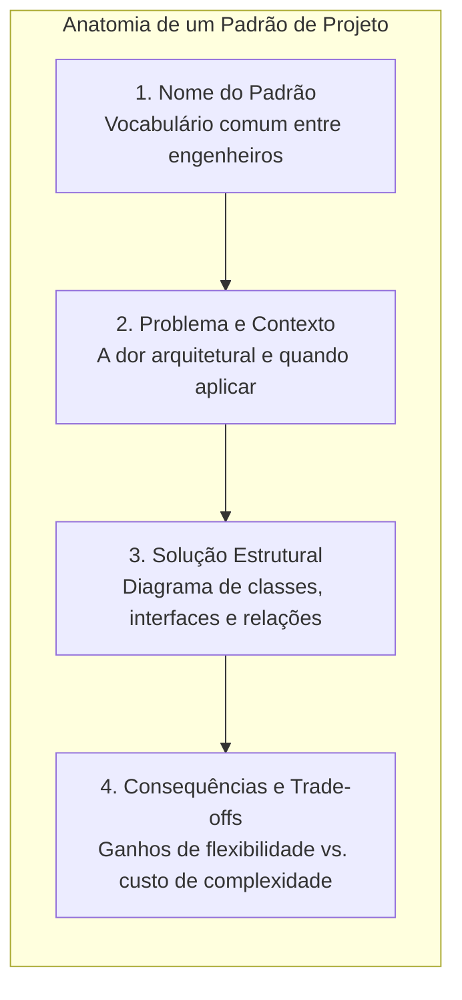
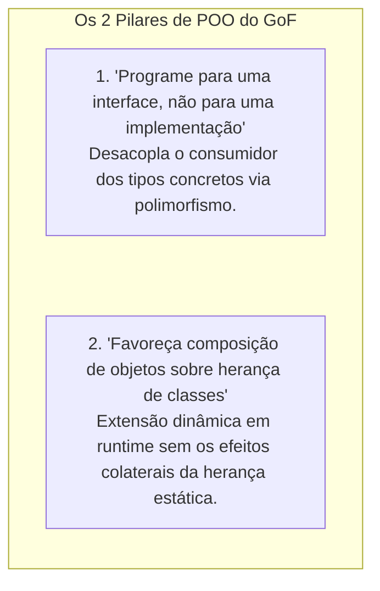
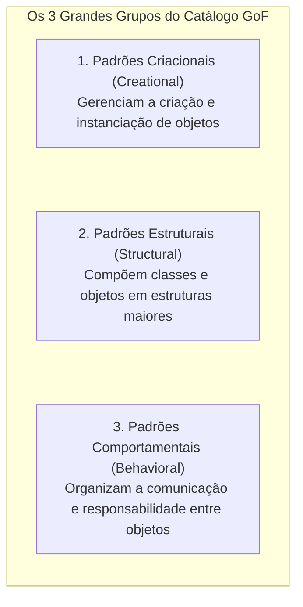

# 24. Padrões de projeto (design patterns): fundamentos, catálogo GoF e os três grandes grupos

> **Contexto:** Estudo aprofundado sobre o conceito de **Padrões de Projeto (*Design Patterns*)**, que são soluções provadas e testadas que resolvem problemas recorrentes da Engenharia de Software. Você compreenderá o que são os padrões de projeto, quais os princípios da programação orientada a objetos por trás da sua construção (*GoF - Gang of Four*), as origens com Christopher Alexander e a divisão nos **três grandes grupos** fundamentais: **Criacionais**, **Estruturais** e **Comportamentais**, com suas funções e implementações práticas em C#.

---

## 1. O que são padrões de projeto (*design patterns*)?

Um **padrão de projeto (*design pattern*)** é uma **solução geral, reutilizável e comprovada para um problema recorrente** no design de software orientado a objetos. 

Ele não é um pedaço de código pronto para "copiar e colar" (como uma biblioteca ou framework), mas sim um **modelo mental (*template*) arquitetural** que descreve como estruturar classes, interfaces e objetos para resolver um desafio específico com alta flexibilidade e manutenibilidade.



---

### A analogia de Feynman: A planta arquitetônica de uma ponte suspensa

Imagine que você é um engenheiro civil contratado para ligar duas margens de um rio:
* **Sem padrão de projeto (Reinvenção caótica da roda):** Você tenta criar um design do zero, soldando cabos aleatórios e torcendo para que o vento não derrube a estrutura. Você corre o risco de cometer os mesmos erros que derrubaram pontes no século XIX.
* **Com padrão de projeto (A ponte pênsil / suspensa):** Você adota uma solução que já foi calculada, construída e validada milhares de vezes em rios pelo mundo inteiro. Você não copia a ponte de São Francisco tijolo por tijolo, mas adapta a **ideia estrutural** (torres de sustentação + cabos de tração + pista suspensa) ao tamanho específico do seu rio.

---

## 2. A origem histórica e a Gang of Four (GoF)

1. **A inspiração na arquitetura urbana (Christopher Alexander, 1977):**
   - O conceito de padrão nasceu na arquitetura civil com o livro *A Pattern Language*, onde Alexander defendia que cidades e edifícios bem-sucedidos compartilham soluções espaciais recorrentes (ex.: janelas voltadas para o sol, praças públicas centrais).
2. **A transposição para a computação (A Gang of Four - 1994):**
   - Quatro cientistas da computação — **Erich Gamma, Richard Helm, Ralph Johnson e John Vlissides** (conhecidos como a *Gang of Four* ou **GoF**) — publicaram o livro seminal:
   > *"Design Patterns: Elements of Reusable Object-Oriented Software"* (1994).
   - O livro catalogou **23 padrões clássicos**, divididos em três grandes famílias estruturais.

---

## 3. Os dois princípios centrais de POO por trás dos padrões GoF

Quase todos os 23 padrões de projeto do GoF são construídos sobre dois pilares fundamentais da engenharia de software:



1. **Programar para interfaces:** Permite que o sistema trate objetos por aquilo que eles *fazem* (seu contrato), e não pelo que eles *são* (sua classe concreta).
2. **Composição sobre herança (*Favor Object Composition over Class Inheritance*):** A herança cria acoplamento branco (*White-Box Reuse*), onde a filha expõe os detalhes internos do pai. A composição (*Black-Box Reuse*) permite trocar o comportamento em tempo de execução simplesmente injetando um novo objeto.

---

## 4. Os três grandes grupos de padrões GoF

O catálogo GoF classifica os 23 padrões em três grandes categorias, conforme o propósito arquitetural:



---

### Grupo 1: Padrões Criacionais (*Creational Patterns*)

* **Propósito:** Abstraem o processo de instanciação. Eles tornam o sistema independente de como seus objetos são criados, compostos e representados.
* **Problema que resolvem:** Evitar o uso indiscriminado do operador `new` espalhado pelo código, o que gera acoplamento direto rígido (violação de OCP e DIP).

| Padrão Criacional | Propósito e Mecanismo Central |
| :--- | :--- |
| **Factory Method** | Define uma interface para criar um objeto, mas deixa as subclasses decidirem qual classe instanciar. |
| **Abstract Factory** | Cria famílias de objetos relacionados ou dependentes sem especificar suas classes concretas. |
| **Singleton** | Garante que uma classe tenha apenas uma única instância em todo o ciclo de vida e fornece um ponto global de acesso. |
| **Builder** | Separa a construção de um objeto complexo da sua representação, permitindo o mesmo processo criar representações diferentes. |
| **Prototype** | Cria novos objetos clonando uma instância existente (protótipo). |

#### Exemplo em C# — *Singleton* (Instância única e thread-safe):

```csharp
public sealed class GerenciadorConfiguracao
{
    private static GerenciadorConfiguracao? _instancia;
    private static readonly object _lock = new object();

    public string Ambiente { get; set; } = "Produção";

    // Construtor privado impede new externo:
    private GerenciadorConfiguracao() { }

    public static GerenciadorConfiguracao Instancia
    {
        get
        {
            if (_instancia == null)
            {
                lock (_lock)
                {
                    if (_instancia == null)
                    {
                        _instancia = new GerenciadorConfiguracao();
                    }
                }
            }
            return _instancia;
        }
    }
}
```

---

### Grupo 2: Padrões Estruturais (*Structural Patterns*)

* **Propósito:** Lidam com a composição de classes e objetos para formar estruturas maiores, mantendo-as flexíveis e eficientes.
* **Problema que resolvem:** Integrar interfaces incompatíveis, montar hierarquias árvore (todo-parte) ou adicionar novas responsabilidades a objetos sem usar herança excessiva.

| Padrão Estrutural | Propósito e Mecanismo Central |
| :--- | :--- |
| **Adapter** | Converte a interface de uma classe em outra interface esperada pelos clientes (funciona como um adaptador de tomada). |
| **Decorator** | Agrega responsabilidades adicionais a um objeto dinamicamente (alternativa flexível à herança). |
| **Facade** | Fornece uma interface unificada e simplificada para um subsistema complexo de classes. |
| **Composite** | Compõe objetos em estruturas de árvore para representar hierarquias do tipo "parte-todo". |
| **Proxy** | Fornece um substituto ou intermediário para controlar o acesso a outro objeto (lazy loading, segurança, cache). |
| **Bridge** | Desacopla uma abstração da sua implementação para que ambas possam variar independentemente. |
| **Flyweight** | Compartilha eficientemente grandes quantidades de objetos de granularidade fina para economizar memória. |

#### Exemplo em C# — *Adapter* (Compatibilizando sistemas legados):

```csharp
// Interface moderna esperada pelo sistema:
public interface IProcessadorPagamento
{
    void Pagar(decimal valor);
}

// Classe de terceiros ou legado incompatível:
public class ServicoLegadoPayPal
{
    public void MakePayment(double amountInDollars)
    {
        Console.WriteLine($"Pagamento legado de U$ {amountInDollars:F2} aprovado.");
    }
}

// O Adaptador: Converte a chamada moderna para a biblioteca legada
public class PayPalAdapter : IProcessadorPagamento
{
    private readonly ServicoLegadoPayPal _paypal;

    public PayPalAdapter(ServicoLegadoPayPal paypal)
    {
        _paypal = paypal;
    }

    public void Pagar(decimal valor)
    {
        double valorConvertido = (double)valor;
        _paypal.MakePayment(valorConvertido);
    }
}
```

---

### Grupo 3: Padrões Comportamentais (*Behavioral Patterns*)

* **Propósito:** Concentram-se nos algoritmos e na atribuição de responsabilidades entre objetos, descrevendo não apenas padrões de classes, mas os **padrões de comunicação entre eles**.
* **Problema que resolvem:** Desacoplar o emissor de uma solicitação dos seus receptores e permitir que o fluxo de execução varie em tempo de execução.

| Padrão Comportamental | Propósito e Mecanismo Central |
| :--- | :--- |
| **Strategy** | Define uma família de algoritmos, encapsula cada um e os torna intercambiáveis em tempo de execução. |
| **Observer** | Define uma dependência um-para-muitos entre objetos para que, quando um mude de estado, todos os seus dependentes sejam notificados (base do padrão Pub/Sub e eventos). |
| **Command** | Encapsula uma solicitação como um objeto, permitindo parametrizar clientes com diferentes requisições, enfileirar e suportar operações de *Undo* (desfazer). |
| **Iterator** | Fornece uma maneira de acessar sequencialmente os elementos de uma coleção agregada sem expor sua representação interna. |
| **Template Method** | Define o esqueleto de um algoritmo em uma superclasse, deixando que as subclasses sobrescrevam etapas específicas sem mudar a estrutura global. |
| **State** | Permite que um objeto altere seu comportamento quando seu estado interno muda (parece mudar de classe). |
| **Chain of Responsibility** | Evita o acoplamento do remetente de uma requisição ao seu destinatário, dando a mais de um objeto a chance de tratar a requisição. |
| **Mediator** | Define um objeto que encapsula a forma como um conjunto de objetos interage, evitando referências explícitas entre si. |
| **Memento** | Captura e externaliza o estado interno de um objeto para que possa ser restaurado posteriormente (padrão de *Snapshot/Undo*). |
| **Visitor** | Representa uma operação a ser executada nos elementos de uma estrutura de objetos sem alterar as classes desses elementos. |

#### Exemplo em C# — *Strategy* (Algoritmos de cálculo intercambiáveis):

```csharp
// Contrato da estratégia:
public interface ICalculoFreteStrategy
{
    decimal Calcular(decimal pesoKg);
}

// Estratégias concretas:
public class FreteExpresso : ICalculoFreteStrategy
{
    public decimal Calcular(decimal pesoKg) => pesoKg * 15.00m;
}

public class FreteEconomico : ICalculoFreteStrategy
{
    public decimal Calcular(decimal pesoKg) => pesoKg * 5.50m;
}

// Contexto consumidor (Aderente ao OCP e DIP):
public class CalculadoraFreteContexto
{
    private ICalculoFreteStrategy _strategy;

    public CalculadoraFreteContexto(ICalculoFreteStrategy strategy)
    {
        _strategy = strategy;
    }

    public void DefinirEstrategia(ICalculoFreteStrategy novaStrategy) => _strategy = novaStrategy;

    public decimal ExecutarCalculo(decimal pesoKg) => _strategy.Calcular(pesoKg);
}
```

---

## 5. Exemplo completo e integrado: Combinando Singleton, Strategy e Observer em C#

Abaixo está um sistema de e-commerce completo e compilável demonstrando a cooperação harmoniosa dos três grupos de padrões:

```csharp
using System;
using System.Collections.Generic;

namespace PadroesDeProjetoIntegrados
{
    // ==============================================================
    // 1. CRIACIONAL: SINGLETON (Configuração Global de Moeda)
    // ==============================================================
    public sealed class SistemaConfiguracao
    {
        private static SistemaConfiguracao? _instancia;
        public string SimboloMoeda { get; } = "R$";

        private SistemaConfiguracao() { }

        public static SistemaConfiguracao Instancia => _instancia ??= new SistemaConfiguracao();
    }

    // ==============================================================
    // 2. COMPORTAMENTAL: STRATEGY (Descontos Dinâmicos)
    // ==============================================================
    public interface IDescontoStrategy
    {
        decimal AplicarDesconto(decimal valorOriginal);
    }

    public class DescontoBlackFriday : IDescontoStrategy
    {
        public decimal AplicarDesconto(decimal valor) => valor * 0.70m; // 30% off
    }

    public class DescontoClienteComum : IDescontoStrategy
    {
        public decimal AplicarDesconto(decimal valor) => valor; // Sem desconto
    }

    // ==============================================================
    // 3. COMPORTAMENTAL: OBSERVER (Notificação de Status)
    // ==============================================================
    public interface IPedidoObserver
    {
        void Atualizar(string codigoPedido, decimal valorFinal);
    }

    public class NotificadorWhatsApp : IPedidoObserver
    {
        public void Atualizar(string codigo, decimal valor) =>
            Console.WriteLine($"[WhatsApp] Pedido {codigo} faturado: {SistemaConfiguracao.Instancia.SimboloMoeda} {valor:F2}");
    }

    public class NotificadorEstoque : IPedidoObserver
    {
        public void Atualizar(string codigo, decimal valor) =>
            Console.WriteLine($"[Estoque] Reservando itens para o pedido {codigo}.");
    }

    // ==============================================================
    // CONTEXTO: CLASSE PEDIDO (Orquestrador)
    // ==============================================================
    public class Pedido
    {
        private readonly List<IPedidoObserver> _observadores = new List<IPedidoObserver>();
        public string Codigo { get; }
        public decimal ValorTotal { get; }

        public Pedido(string codigo, decimal valorTotal)
        {
            Codigo = codigo;
            ValorTotal = valorTotal;
        }

        public void AnexarObservador(IPedidoObserver obs) => _observadores.Add(obs);

        public void Processar(IDescontoStrategy estrategiaDesconto)
        {
            decimal valorFinal = estrategiaDesconto.AplicarDesconto(ValorTotal);
            Console.WriteLine($"Processando pedido {Codigo}. Valor final: {SistemaConfiguracao.Instancia.SimboloMoeda} {valorFinal:F2}");

            // Notifica todos os observadores (Observer Pattern)
            foreach (var obs in _observadores)
            {
                obs.Atualizar(Codigo, valorFinal);
            }
        }
    }

    internal class Program
    {
        private static void Main()
        {
            Console.WriteLine("=== SISTEMA COM PADRÕES DE PROJETO GoF ===");

            var pedido = new Pedido("PED-1001", 1000.00m);

            // Registra os observadores:
            pedido.AnexarObservador(new NotificadorWhatsApp());
            pedido.AnexarObservador(new NotificadorEstoque());

            // Executa com estratégia de Black Friday:
            IDescontoStrategy promo = new DescontoBlackFriday();
            pedido.Processar(promo);
        }
    }
}
```

---

## 6. Resumo conceitual e mapa de decisão

1. **Padrões de projeto são vocabulário compartilhado:** Permitem que engenheiros comuniquem estruturas arquiteturais complexas dizendo apenas *"use um Strategy aqui"* ou *"coloque um Adapter ali"*.
2. **Não force padrões desnecessários (*Overengineering*):** Padrões adicionam camadas de indireção e abstração. Só use um padrão quando houver um problema real e recorrente a ser resolvido.
3. **Os 3 grandes grupos:**
   - **Criacionais:** Lidam com o nascimento do objeto (ocultam o `new`).
   - **Estruturais:** Lidam com a montagem de blocos e compatibilidade de interfaces.
   - **Comportamentais:** Lidam com a coreografia de comunicação e divisão de responsabilidades.

---

## Referências bibliográficas

### Bibliografia básica
* GAMMA, Erich; HELM, Richard; JOHNSON, Ralph; VLISSIDES, John. **Padrões de Projeto: Soluções Reutilizáveis de Software Orientado a Objetos**. Porto Alegre: Bookman, 2000. 364 p. ISBN 9788573076103. Disponível em: [https://bib.pucminas.br/acervo/102047/](https://bib.pucminas.br/acervo/102047/).
* FREEMAN, Eric; ROBSON, Elisabeth. **Use a Cabeça! Padrões de Projetos**. 2. ed. Rio de Janeiro: Alta Books, 2021.
* MARTIN, Robert C. **Princípios, Padrões e Práticas Ágeis em C#**. Porto Alegre: Bookman, 2011. Disponível em: [https://bib.pucminas.br/acervo/454490/](https://bib.pucminas.br/acervo/454490/).

### Bibliografia complementar
* ALEXANDER, Christopher et al. **A Pattern Language: Towns, Buildings, Construction**. Oxford: Oxford University Press, 1977.
* FOWLER, Martin. **Padrões de Arquitetura de Aplicações Corporativas**. Porto Alegre: Bookman, 2006.
* SHVETS, Alexander. **Mergulho nos Padrões de Projeto**. Refactoring.Guru, 2019. Disponível em: [https://refactoring.guru/pt-br/design-patterns](https://refactoring.guru/pt-br/design-patterns).
* MICROSOFT. **.NET Design Patterns Guide**. Microsoft Learn, 2023. Disponível em: [https://learn.microsoft.com/pt-br/dotnet/architecture/modern-web-apps-azure/architectural-principles](https://learn.microsoft.com/pt-br/dotnet/architecture/modern-web-apps-azure/architectural-principles).

---

## Artigos relacionados e navegação

* **Artigo anterior:** [[23. Princípios SOLID de design orientado a objetos]]
* **Resumo da disciplina:** [[00. Programação modular - Resumo]]
* **Glossário da disciplina:** [[Glossário de conceitos]]
* **Guia de sintaxe multilinguagem (Classes e Interfaces):** [[00. Sintaxe Multilinguagem/05. Abstração e encapsulamento com classes (TADs)]]
* **Guia de sintaxe multilinguagem (Polimorfismo):** [[00. Sintaxe Multilinguagem/11. Herança, superclasses e subclasses (sintaxe comparada e extensibilidade)]]
* **Índice geral do vault:** [[index.md|Página inicial do vault]]
