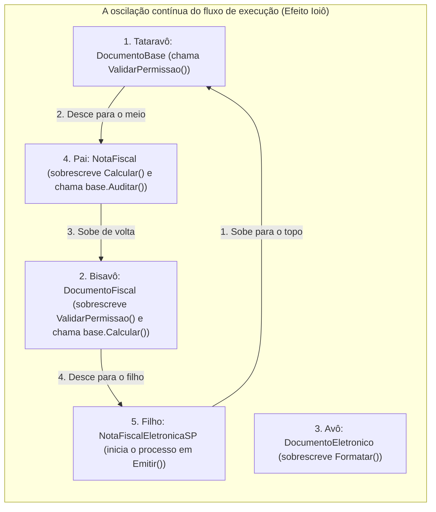
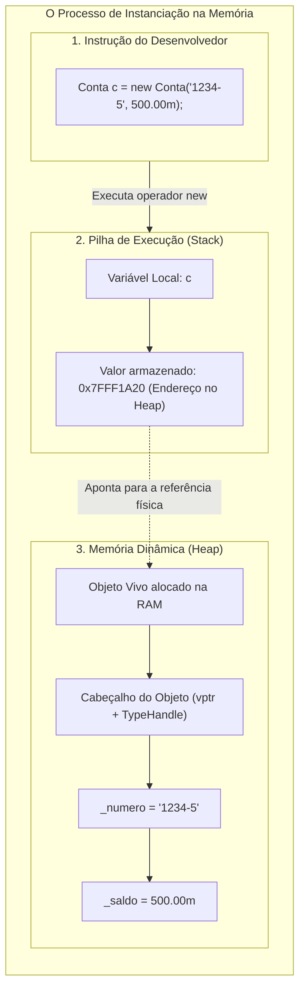

# Glossário de conceitos em programação modular

> **Contexto:** Guia rápido e comparativo para diferenciar os termos fundamentais da engenharia de software e da programação modular: Tipos, Operações, Módulos, Atributos, Classes, Objetos, Interfaces e a instrução histórica GOTO.

---

## Índice temático

### 1. Estrutura básica e orientação a objetos (POO)
* [[#1. Tipo (Type)|1. Tipo (*Type*)]] • [[#2. Operação (Operation / Method)|2. Operação (*Operation*)]] • [[#4. Atributo (Attribute / Field)|4. Atributo (*Attribute*)]] • [[#5. Estado (State)|5. Estado (*State*)]] • [[#6. Método (Method)|6. Método (*Method*)]]
* [[#22. Encapsulamento (Encapsulation)|22. Encapsulamento (*Encapsulation*)]] • [[#23. Herança (Inheritance)|23. Herança (*Inheritance*)]] • [[#24. Polimorfismo (Polymorphism)|24. Polimorfismo (*Polymorphism*)]] • [[#25. Interface (Interface / Contrato de Serviço)|25. Interface (*Interface*)]] • [[#26. Implementação (Implementation / Mecânica Interna)|26. Implementação (*Implementation*)]] • [[#44. Subtipagem (Subtyping / Subtype Polymorphism)|44. Subtipagem (*Subtyping*)]]
* [[#46. Método virtual (Virtual Method)|46. Método virtual (`virtual`)]] • [[#47. Sobreposição e sobrescrita de método (Method Overriding / Override)|47. Sobreposição e sobrescrita (`override`)]] • [[#48. Palavra-chave base (Base Keyword)|48. Palavra-chave `base`]] • [[#49. Modificador new e ocultação de membro (Member Shadowing / New Modifier)|49. Modificador `new` (*shadowing*)]]
* [[#50. Vinculação antecipada (Early Binding / Static Binding)|50. Vinculação antecipada (*Early binding*)]] • [[#51. Vinculação tardia e despacho dinâmico (Late Binding & Dynamic Dispatch)|51. Vinculação tardia (*Late binding*)]] • [[#52. Referência polimórfica (Polymorphic Reference)|52. Referência polimórfica]] • [[#53. Método ToString (String Representation Method)|53. Método `ToString()`]]
* [[#54. Tabela de métodos virtuais (Virtual Method Table - vtable)|54. Tabela de métodos virtuais (*vtable*)]] • [[#55. Polimorfismo dinâmico vs. polimorfismo estático (Dynamic vs. Static Polymorphism)|55. Polimorfismo dinâmico vs. estático]] • [[#56. Superclasse vs. interface (Superclass vs. Interface / Inheritance vs. Interface)|56. Superclasse vs. interface]]
* [[#57. Classe abstrata (Abstract Class)|57. Classe abstrata (`abstract class`)]] • [[#58. Método abstrato (Abstract Method)|58. Método abstrato (`abstract method`)]] • [[#59. Palavra-chave abstract (Abstract Keyword / Modificador abstract)|59. Palavra-chave `abstract`]]
* [[#62. Classe selada (Sealed Class / Final Class)|62. Classe selada (`sealed class`)]] • [[#63. Membro selado (Sealed Member / Sealed Override)|63. Membro selado (`sealed override`)]] • [[#64. Instanciação e instanciar (Instantiation / Object Creation)|64. Instanciação e instanciar (`new`)]]
* [[#65. Tipos genéricos (Generics / Parametric Polymorphism)|65. Tipos genéricos (`Generics`)]] • [[#66. Segurança de tipos (Type Safety)|66. Segurança de tipos (*Type safety*)]] • [[#67. Conjuntos disjuntos em tipos (Disjoint Sets in Types)|67. Conjuntos disjuntos em tipos]] • [[#68. Função de hashing e código hash (Hash Function & Hash Code)|68. Função de hashing e código hash (`GetHashCode`)]]

### 2. Modularidade e arquitetura de software
* [[#3. Módulo (Module)|3. Módulo (*Module*)]] • [[#27. Coesão (Cohesion)|27. Coesão (*Cohesion*)]] • [[#28. Princípio da caixa preta (Black Box Principle)|28. Princípio da caixa preta (*Black box*)]] • [[#29. Independência funcional (Functional Independence)|29. Independência funcional]]
* [[#39. Espaço de nomes (Namespace)|39. Espaço de nomes (*Namespace*)]] • [[#40. Classe parcial (Partial Class)|40. Classe parcial (*Partial class*)]] • [[#41. Biblioteca de vínculo dinâmico (Dynamic Link Library - DLL / Assembly)|41. Biblioteca de vínculo dinâmico (DLL / *Assembly*)]] • [[#45. Problema do diamante (The Diamond Problem)|45. Problema do diamante]] • [[#61. Anti-padrão Yo-Yo (Yo-Yo Anti-pattern / Yo-Yo Problem)|61. Anti-padrão Yo-Yo]]

### 3. Memória, ciclo de vida e concorrência
* [[#10. Semântica de Referência (Reference Semantics)|10. Semântica de referência]] • [[#11. Coletor de Lixo (Garbage Collector - GC)|11. Coletor de lixo (*GC*)]] • [[#18. Destrutor e Finalizador (Destructor & Finalizer)|18. Destrutor e finalizador]]
* [[#19. Padrão Dispose e IDisposable (Deterministic Cleanup)|19. Padrão `Dispose` e `IDisposable`]] • [[#20. Buffer e descarregamento de dados (Buffer & Flush)|20. Buffer e *flush*]] • [[#21. Thread (Linha de execução / Fluxo concorrente)|21. *Thread* e concorrência]]
* [[#60. Ponteiro (Pointer / vptr / Memory Pointer)|60. Ponteiro (*Pointer / vptr*)]]

### 4. Recursos de linguagem, sintaxe e C#
* [[#8. Declaração em Computação (Declaration / Declarar)|8. Declaração]] • [[#9. Assinatura de Método (Method Signature)|9. Assinatura de método]] • [[#12. Parâmetro vs. Argumento (Parameter vs. Argument)|12. Parâmetro vs. argumento]] • [[#13. GOTO (Salto Incondicional)|13. `GOTO`]] • [[#15. Membro estático (Static Member)|15. Membro estático (`static`)]]
* [[#16. Propriedades (Properties & Auto-Properties)|16. Propriedades]] • [[#17. Escopo (Scope)|17. Escopo]] • [[#31. Métodos de acesso ou getters (Accessors / Getters)|31. *Getters*]] • [[#32. Métodos modificadores ou setters (Mutators / Setters)|32. *Setters*]] • [[#33. Convenções de nomenclatura (Naming Conventions: camelCase e PascalCase)|33. Convenções de nomenclatura]]
* [[#34. Propriedade (Property)|34. Propriedades avançadas]] • [[#35. Princípio DRY (Don't Repeat Yourself)|35. Princípio DRY]] • [[#36. Código boilerplate (Boilerplate Code)|36. Código *boilerplate*]] • [[#37. Expressão lambda e membros com corpo de expressão (Lambda Expressions & Expression-Bodied Members)|37. Expressões lambda (`=>`)]]
* [[#38. Paradigma funcional (Functional Programming Paradigm)|38. Paradigma funcional]] • [[#42. Compilador Roslyn (.NET Compiler Platform)|42. Compilador Roslyn]] • [[#43. Mapeador objeto-relacional e Entity Framework (ORM & Entity Framework)|43. ORM & Entity Framework]]

### 5. Qualidade e engenharia de software
* [[#7. Qualidade de Código (Code Quality)|7. Qualidade de código]] • [[#14. Robustez (Robustness)|14. Robustez (*Robustness*)]] • [[#30. Regra prática ou heurística (Rule of Thumb)|30. Regra prática / Heurística]]

---

## Matriz completa de consulta rápida

| ID | Termo | Definição simplificada | O que representa? | Exemplo no código / Teoria |
| :---: | :--- | :--- | :--- | :--- |
| **01** | [[#1. Tipo (Type)\|Tipo (*Type*)]] | Conjunto de valores e operações válidas sobre eles. | O **conceito/definição** do dado | `int`, `string`, `class Conta` |
| **02** | [[#2. Operação (Operation / Method)\|Operação (*Operation*)]] | Sub-rotina que executa cálculos ou altera estado. | O **comportamento executável** | `Sacar()`, `CalcularDV()` |
| **03** | [[#3. Módulo (Module)\|Módulo (*Module*)]] | Unidade de organização física ou lógica do código. | O **container de fronteira** | Arquivo `.cs`, `class`, pacote |
| **04** | [[#4. Atributo (Attribute / Field)\|Atributo (*Field*)]] | Variável interna que armazena os dados do objeto. | Os **dados estruturais** | `private double _saldo;` |
| **05** | [[#5. Estado (State)\|Estado (*State*)]] | Valores de todos os atributos em um dado instante. | A **fotografia do objeto** | `_saldo = 500.00;` |
| **06** | [[#6. Método (Method)\|Método (*Method*)]] | Função ou procedimento pertencente a uma classe. | A **ação vinculada ao dado** | `public void Depositar(...)` |
| **07** | [[#7. Qualidade de Código (Code Quality)\|Qualidade de código]] | Atendimento a fatores externos e internos. | A **longevidade do software** | ISO/IEC 25010, Código limpo |
| **08** | [[#8. Declaração em Computação (Declaration / Declarar)\|Declaração]] | Avisar ao compilador a existência e tipo de um item. | A **reserva de identidade** | `double saldo;`, `void Sacar();` |
| **09** | [[#9. Assinatura de Método (Method Signature)\|Assinatura]] | Nome do método + lista de tipos dos parâmetros. | O **identificador único** | `Sacar(double)` |
| **10** | [[#10. Semântica de Referência (Reference Semantics)\|Semântica de referência]] | Variável armazena endereço de memória do *Heap*. | O **controle remoto** | `Conta c2 = c1;` |
| **11** | [[#11. Coletor de Lixo (Garbage Collector - GC)\|Coletor de lixo (*GC*)]] | Limpeza automática de instâncias órfãs da RAM. | A **reciclagem de memória** | Motor de GC do .NET / CLR |
| **12** | [[#12. Parâmetro vs. Argumento (Parameter vs. Argument)\|Parâmetro vs. argumento]] | Parâmetro é o molde na assinatura; argumento é o valor enviado. | O **molde vs. dado real** | `(double v)` vs `(150.00)` |
| **13** | [[#13. GOTO (Salto Incondicional)\|`GOTO`]] | Salto arbitrário descontinuado na estruturação. | O **fluxo desordenado (evitar)** | `goto Rotulo;` |
| **14** | [[#14. Robustez (Robustness)\|Robustez (*Robustness*)]] | Capacidade de reagir a erros sem travar o sistema. | A **segurança a imprevistos** | `try / catch`, validação de dados |
| **15** | [[#15. Membro estático (Static Member)\|Membro estático]] | Atributo ou método que pertence à classe, não ao objeto. | O **dado compartilhado global** | `static int TotalContas;` |
| **16** | [[#16. Propriedades (Properties & Auto-Properties)\|Propriedades]] | Encapsulamento elegante de leitura e escrita. | A **fachada inteligente com get/set** | `public double Saldo { get; }` |
| **17** | [[#17. Escopo (Scope)\|Escopo (*Scope*)]] | Região do código onde um identificador é visível. | A **fronteira de visibilidade** | Bloco `{ }`, classe, método |
| **18** | [[#18. Destrutor e Finalizador (Destructor & Finalizer)\|Destrutor (*Finalizer*)]] | Método especial invocado antes do GC coletar o objeto. | A **limpeza final de recursos** | `~ContaCorrente() { ... }` |
| **19** | [[#19. Padrão Dispose e IDisposable (Deterministic Cleanup)\|Padrão `Dispose`]] | Liberação determinística e imediata de recursos nativos. | A **devolução manual expressa** | `using (var f = new FileStream)` |
| **20** | [[#20. Buffer e descarregamento de dados (Buffer & Flush)\|Buffer & flush]] | Acúmulo temporário em RAM e descarregamento no disco. | O **lote de transferência** | `stream.Flush();` |
| **21** | [[#21. Thread (Linha de execução / Fluxo concorrente)\|*Thread* / Concorrência]] | Sequência linear de execução concorrente de tarefas. | A **linha de produção paralela** | `Thread`, `Task`, async/await |
| **22** | [[#22. Encapsulamento (Encapsulation)\|Encapsulamento]] | Ocultação de detalhes internos e proteção de dados. | A **cápsula blindada** | Atributos `private`, métodos `public` |
| **23** | [[#23. Herança (Inheritance)\|Herança]] | Reaproveitamento e extensão de membros entre classes. | A **relação pai-filho (*is-a*)** | `class Poupanca : Conta` |
| **24** | [[#24. Polimorfismo (Polymorphism)\|Polimorfismo]] | Capacidade de tratar objetos distintos via contrato comum. | As **múltiplas formas de resposta** | `virtual` / `override` |
| **25** | [[#25. Interface (Interface / Contrato de Serviço)\|Interface (*Contrato*)]] | Conjunto de assinaturas públicas sem implementação. | O **contrato de serviço** | `interface IConta { void Sacar(); }` |
| **26** | [[#26. Implementação (Implementation / Mecânica Interna)\|Implementação]] | O código concreto dentro do corpo dos métodos. | O **"como faz" interno** | Corpo das funções `{ ... }` |
| **27** | [[#27. Coesão (Cohesion)\|Coesão (*Cohesion*)]] | Grau em que os membros da classe têm foco único. | O **foco e propósito único** | Alta coesão (Princípio SRP) |
| **28** | [[#28. Princípio da caixa preta (Black Box Principle)\|Caixa preta]] | Uso de um componente conhecendo apenas sua entrada/saída. | O **isolamento instrumental** | Usar API sem ler código-fonte |
| **29** | [[#29. Independência funcional (Functional Independence)\|Independência funcional]] | Módulo opera com autonomia e dependências mínimas. | O **desacoplamento operacional** | Módulos autossuficientes |
| **30** | [[#30. Regra prática ou heurística (Rule of Thumb)\|Regra prática / Heurística]] | Diretriz empírica consagrada para tomada de decisão. | O **guia de boas práticas** | "Prefira composição a herança" |
| **31** | [[#31. Métodos de acesso ou getters (Accessors / Getters)\|*Getters*]] | Métodos ou blocos que leem valores sem alterar estado. | A **consulta segura de dados** | `public double GetSaldo()` |
| **32** | [[#32. Métodos modificadores ou setters (Mutators / Setters)\|*Setters*]] | Métodos ou blocos que alteram estado com validação. | A **modificação controlada** | `public void SetSaldo(double v)` |
| **33** | [[#33. Convenções de nomenclatura (Naming Conventions: camelCase e PascalCase)\|Convenções de nomes]] | Padrões de escrita de identificadores (`PascalCase`, `_camelCase`). | A **legibilidade padronizada** | `_saldoPrivado`, `MetodoPublico` |
| **34** | [[#34. Propriedade (Property)\|Propriedade]] | Estrutura de C# que encapsula getters e setters como campo. | O **acesso idiomático com regras** | `public int Idade { get; set; }` |
| **35** | [[#35. Princípio DRY (Don't Repeat Yourself)\|Princípio DRY]] | Eliminação de duplicação lógica no sistema. | A **fonte única de verdade** | Centralizar validações e cálculos |
| **36** | [[#36. Código boilerplate (Boilerplate Code)\|Código *boilerplate*]] | Código repetitivo e burocrático necessário pela sintaxe. | A **burocracia sintática** | Getters e setters manuais longos |
| **37** | [[#37. Expressão lambda e membros com corpo de expressão (Lambda Expressions & Expression-Bodied Members)\|Expressões lambda (`=>`)]] | Sintaxe compacta de função anônima ou corpo conciso. | A **flecha expressiva direta** | `public double Saldo => _saldo;` |
| **38** | [[#38. Paradigma funcional (Functional Programming Paradigm)\|Paradigma funcional]] | Foco em funções puras, imutabilidade e sem efeitos colaterais. | O **cálculo matemático puro** | LINQ (`Select`, `Where`), Imutabilidade |
| **39** | [[#39. Espaço de nomes (Namespace)\|*Namespace*]] | Escopo hierárquico para organizar classes e evitar colisões. | As **pastas lógicas do projeto** | `namespace MeuApp.Dominio.Contas;` |
| **40** | [[#40. Classe parcial (Partial Class)\|Classe parcial (`partial`)]] | Divisão da declaração de uma classe em múltiplos arquivos. | A **classe em múltiplos arquivos** | `partial class ContaCorrente` |
| **41** | [[#41. Biblioteca de vínculo dinâmico (Dynamic Link Library - DLL / Assembly)\|DLL / *Assembly*]] | Unidade binária compilada reutilizável entre projetos. | O **pacote compilado de entrega** | `Dominio.dll`, Pacotes NuGet |
| **42** | [[#42. Compilador Roslyn (.NET Compiler Platform)\|Compilador Roslyn]] | Compilador modular como serviço do .NET e C#. | O **motor analítico de código** | Análise estática, refatoração de IDE |
| **43** | [[#43. Mapeador objeto-relacional e Entity Framework (ORM & Entity Framework)\|ORM & Entity Framework]] | Tradução automática entre objetos em memória e tabelas SQL. | A **ponte memória-banco de dados** | `DbSet<Cliente>`, mapeamento LINQ-SQL |
| **44** | [[#44. Subtipagem (Subtyping / Subtype Polymorphism)\|Subtipagem]] | Compatibilidade semântica onde subtipo substitui supertipo ($S <: T$). | A **tomada universal compatível** | `Funcionario f = new Gerente();` |
| **45** | [[#45. Problema do diamante (The Diamond Problem)\|Problema do diamante]] | Ambiguidade fatal de herança múltipla de classes em grafo losango. | A **ordem contraditória dos pais** | `class D : B, C` com conflito de métodos |
| **46** | [[#46. Método virtual (Virtual Method)\|Método virtual (`virtual`)]] | Método que autoriza e convida subclasses a redefinirem seu comportamento. | A **abertura de contrato extensível** | `public virtual void Sacar()` |
| **47** | [[#47. Sobreposição e sobrescrita de método (Method Overriding / Override)\|Sobreposição / Sobrescrita (`override`)]] | Redefinição polimórfica especializada na subclasse via despacho dinâmico. | A **especialização polimórfica** | `public override void Sacar()` |
| **48** | [[#48. Palavra-chave base (Base Keyword)\|Palavra-chave `base`]] | Referência direta aos construtores e métodos da superclasse imediata. | O **acesso à linhagem ancestral** | `: base(...)`, `base.Sacar()` |
| **49** | [[#49. Modificador new e ocultação de membro (Member Shadowing / New Modifier)\|Modificador `new` (*shadowing*)]] | Ocultação estática e não-polimórfica de membro ancestral de mesmo nome. | O **cartaz sobreposto no mural** | `new public void Sacar()` |
| **50** | [[#50. Vinculação antecipada (Early Binding / Static Binding)\|Vinculação antecipada (*Early binding*)]] | Associação estática entre chamada e endereço de memória em tempo de compilação. | O **salto direto de compilação** | Métodos comuns, estáticos ou `new` |
| **51** | [[#51. Vinculação tardia e despacho dinâmico (Late Binding & Dynamic Dispatch)\|Vinculação tardia (*Late binding*)]] | Decisão do método executado em tempo de execução via tabela virtual (*vtable*). | A **resolução dinâmica em runtime** | `virtual` e `override` (`callvirt`) |
| **52** | [[#52. Referência polimórfica (Polymorphic Reference)\|Referência polimórfica]] | Variável cujo tipo declarado é um ancestral genérico que aponta para qualquer subtipo. | O **crachá universal de visitante** | `Animal a = new Cachorro();` |
| **53** | [[#53. Método ToString (String Representation Method)\|Método `ToString()`]] | Método virtual universal herdado de `object` para representação textual customizada. | O **crachá de identidade pessoal** | `public override string ToString()` |
| **54** | [[#54. Tabela de métodos virtuais (Virtual Method Table - vtable)\|Tabela de métodos virtuais (*vtable*)]] | Estrutura interna de ponteiros de função que viabiliza o despacho dinâmico. | O **catálogo de ramais dinâmicos** | Tabela interna do .NET / CLR |
| **55** | [[#55. Polimorfismo dinâmico vs. polimorfismo estático (Dynamic vs. Static Polymorphism)\|Polimorfismo dinâmico vs. estático]] | Dicotomia entre resolução em tempo de compilação (*early binding*) vs. execução (*late binding*). | A **decisão antecipada vs. tardia** | Sobrecarga vs. `virtual`/`override` |
| **56** | [[#56. Superclasse vs. interface (Superclass vs. Interface / Inheritance vs. Interface)\|Superclasse vs. interface]] | Contraste entre herança rígida ("é um" + estado) e implementação de contratos ("capaz de" sem estado). | A **árvore genealógica vs. habilitação** | `class B : A` vs. `class B : IContrato` |
| **57** | [[#57. Classe abstrata (Abstract Class)\|Classe abstrata (`abstract`)]] | Superclasse incompleta que proíbe instanciação direta (`new`) e serve de molde comum. | O **molde de chassi sem lataria** | `public abstract class Forma` |
| **58** | [[#58. Método abstrato (Abstract Method)\|Método abstrato (`abstract`)]] | Assinatura sem corpo dentro de classe abstrata que impõe implementação com `override`. | A **cláusula de formulário obrigatória** | `public abstract double Area();` |
| **59** | [[#59. Palavra-chave abstract (Abstract Keyword / Modificador abstract)\|Palavra-chave `abstract`]] | Modificador reservado de linguagem que indica incompletude proposital e impõe herança. | A **etiqueta "rascunho de engenharia"** | `abstract class`, `abstract void` |
| **60** | [[#60. Ponteiro (Pointer / vptr / Memory Pointer)\|Ponteiro (*Pointer / vptr*)]] | Endereço numérico exato na RAM que aponta para objetos, *vtables* ou rotinas de código. | O **papel com o endereço da casa** | `vptr`, referências de memória, ponteiros de função |
| **61** | [[#61. Anti-padrão Yo-Yo (Yo-Yo Anti-pattern / Yo-Yo Problem)\|Anti-padrão Yo-Yo]] | Hierarquia de herança excessivamente profunda que fragmenta o entendimento do código. | A **caça ao tesouro subindo e descendo escadas** | `A -> B -> C -> D -> E` com métodos espalhados |
| **62** | [[#62. Classe selada (Sealed Class / Final Class)\|Classe selada (`sealed`)]] | Classe cuja herança é terminantemente proibida pelo compilador por segurança e performance. | A **embalagem de remédio lacrada** | `public sealed class Cripto` |
| **63** | [[#63. Membro selado (Sealed Member / Sealed Override)\|Membro selado (`sealed override`)]] | Método sobrescrito cuja cadeia de novas sobreposições por subclasses foi encerrada. | A **cláusula pétrea constitucional** | `public sealed override void Taxa()` |
| **64** | [[#64. Instanciação e instanciar (Instantiation / Object Creation)\|Instanciação / Instanciar]] | Ato de alocar memória no *Heap* e criar um objeto vivo a partir do molde de uma classe. | O **nascimento físico do objeto na RAM** | `Conta c = new Conta();` |
| **65** | [[#65. Tipos genéricos (Generics / Parametric Polymorphism)\|Tipos genéricos (*Generics*)]] | Parametrização de tipos com `<T>` para criar classes e coleções reutilizáveis e homogêneas. | A **gaveta organizadora com divisórias ajustáveis** | `class Pilha<T>`, `List<Conta>` |
| **66** | [[#66. Segurança de tipos (Type Safety)\|Segurança de tipos (*Type Safety*)]] | Garantia em tempo de compilação de que uma operação só é executada em tipos compatíveis. | A **catraca eletrônica infalível na compilação** | Erros de *cast* viram erros de build |
| **67** | [[#67. Conjuntos disjuntos em tipos (Disjoint Sets in Types)\|Conjuntos disjuntos em tipos]] | Domínios matemáticos sem elementos em comum ($A \cap B = \emptyset$) blindados pelo compilador. | As **duas trilhas de trem paralelas que nunca se cruzam** | `Dictionary<TKey, TValue>` |
| **68** | [[#68. Função de hashing e código hash (Hash Function & Hash Code)\|Função de hashing (*GetHashCode*)]] | Algoritmo determinístico que mapeia objetos para inteiros de 32 bits para busca $O(1)$. | O **guarda-volumes com 100 mil armários numerados** | `public override int GetHashCode()` |

---

## 1. Tipo (*Type*)

Na Ciência da Computação (e na teoria dos conjuntos), um **Tipo** define o **espaço de valores permitidos** e quais regras/operações podem ser executadas sobre eles.

* **Função:** Impedir que o programa execute operações inválidas (como tentar multiplicar um texto por uma data).
* **Tipos nativos:** `int`, `double`, `bool`.
* **Tipos personalizados (TADs):** `Conta`, `Cliente`, `Pilha`.

---

## 2. Operação (*Operation / Method*)

Uma **Operação** é a abstração executável (uma função ou um procedimento) responsável por processar entradas, realizar cálculos ou modificar o estado dos dados.

* **Abstração de expressão (Função):** Mapeia entradas em um resultado de saída sem que o usuário precise se preocupar com como isso é feito (ex.: `GetSaldo()`, `CalcularPrimeiroDigito()`).
* **Abstração de comando (Procedimento):** Agrupa tarefas repetitivas em blocos de comando isolados sem obrigatoriedade de retorno de valor (ex.: `Depositar(200)`, `ExibirMenu()`).

---

## 3. Módulo (*Module*)

Um **Módulo** é a unidade de fronteira e organização do código. É o invólucro que agrupa funções, variáveis e tipos relacionados em uma entidade delimitada.

* **No nível de arquivo:** Um arquivo de código (ex.: `Validador.cs`).
* **No nível de linguagem:** Uma `class`, um `namespace` ou um módulo de compilação.
* **No nível de arquitetura:** Uma biblioteca (`.dll`), pacote ou microsserviço.

---

## 4. Atributo (*Attribute / Field*)

Um **Atributo** (também chamado de campo ou variável de instância) é onde o estado interno é efetivamente armazenado na memória.

* **Ocultamento da informação:** Em programação modular bem projetada, os atributos são mantidos **privados** (`private`) para que nenhuma parte externa do sistema possa alterá-los sem autorização.
* **Exemplo:** O atributo `_saldo` da conta bancária.

---

## 5. Estado (*State*)

O **Estado** de um objeto é a **configuração exata de valores que seus atributos possuem em um determinado instante de tempo**.

* **Analogia de Feynman:** Uma **fotografia instantânea** de uma pessoa. Na foto das 10h ela está sentada e de óculos; na foto das 14h ela está em pé e correndo. A pessoa é o mesmo objeto, mas seu estado mudou.
* **Mutabilidade:** O estado de um objeto é alterado ao longo da execução exclusivamente através da chamada de seus **métodos**.

---

## 6. Método (*Method*)

Um **Método** é uma sub-rotina (função ou procedimento) declarada dentro do escopo de uma classe que define o **comportamento** dos objetos daquele tipo.

* **Função no TAD:** O método é o único canal legítimo para consultar ou modificar os atributos privados encapsulados.
* **Exemplo:** `Depositar(valor)` altera o estado aumentando o saldo; `ObterSaldo()` lê o estado atual e o retorna.

---

## 7. Qualidade de Código (*Code Quality*)

A **Qualidade de Código** mede o equilíbrio entre a satisfação das necessidades do usuário (**Fatores Externos** como Corretude e Robustez) e a sustentabilidade técnica da arquitetura para a equipe de engenharia (**Fatores Internos** como Legibilidade, Baixo Acoplamento e Modularidade).

---

## 8. Declaração em Computação (*Declaration / Declarar*)

Na Ciência da Computação, **Declarar** é o ato formal de **apresentar um identificador ao compilador/interpretador**, especificando seu **nome** e seu **tipo de dado**, antes que ele possa ser utilizado pelo programa.

* **Analogia de Feynman:** **Fazer uma certidão de nascimento** ou reservar um crachá em um evento. Você avisa aos organizadores: *"Existirá uma pessoa chamada Leo que é um Aluno"*. Você reservou a identidade e o papel formal, mesmo antes de o crachá receber o número da mesa.
* **A tríade fundamental da computação:**
  1. **Declaração (*Declaration*):** Apresenta o nome e o tipo ao compilador (`double saldo;`).
  2. **Inicialização (*Initialization*):** Atribui o primeiro valor à variável na memória (`saldo = 0.0;`).
  3. **Definição / Instanciação (*Instantiation*):** Constrói e aloca fisicamente o espaço na memória RAM (`Conta c = new Conta();`).
* **Importância:** Linguagens com tipagem estática (C#, Java, C++) exigem a declaração prévia para garantir **segurança de tipos (*Type Safety*)** em tempo de compilação, impedindo operações ilegais.

---

## 9. Assinatura de Método (*Method Signature*)

Na Engenharia de Software, a **Assinatura de um Método** é a impressão digital única (*fingerprint*) que o compilador utiliza para diferenciar uma sub-rotina de todas as outras dentro de uma classe.

* **O que COMPÕE a assinatura em C# e Java:**
  1. O **Nome** do método ou construtor (ex.: `Depositar`).
  2. A **Quantidade** de parâmetros.
  3. Os **Tipos de Dados** dos parâmetros e sua **Ordem exata** (ex.: `(string, double)` $\neq$ `(double, string)`).
* **O que NÃO faz parte da assinatura:**
  - O modificador de acesso (`public`, `private`).
  - O tipo de retorno (`void`, `double`, `int`).
  - Os nomes internos dos parâmetros (apenas seus tipos importam).
* **Analogia de Feynman:** O **CPF / RG do Método**. Duas pessoas podem se chamar "João", mas são diferenciadas pelo número do documento. No código, você pode ter dez métodos chamados `Calcular`, desde que cada um tenha uma "lista de tipos" diferente (**Sobrecarga / *Overloading***).

---

## 10. Semântica de Referência (*Reference Semantics*)

A **Semântica de Referência** é o modelo de gerenciamento de dados em linguagens como C# e Java no qual uma variável associada a uma classe **não contém os dados do objeto em si**, mas sim um **ponteiro / endereço de memória** que aponta para o local no *Heap* onde o objeto físico foi construído.

* **Analogia de Feynman:** O **controle remoto da televisão**. Se você der o seu controle remoto extra para um amigo (`Conta c2 = c1;`), vocês agora têm dois controles diferentes, mas **ambos controlam a exata mesma televisão na sala**. Se o seu amigo mudar de canal (`c2.Depositar(100)`), você imediatamente verá o novo saldo na sua tela (`c1.ObterSaldo()`).
* **Diferença para Tipos de Valor (*Value Semantics*):** Tipos primitivos (`int a = 10; int b = a;`) criam uma **cópia independente** do valor (como fotocopiar uma folha de papel: rabiscar a cópia não altera o original).
* **Conexão com Construtores:** O operador `new` aciona o construtor, constrói a televisão na memória *Heap* e devolve a frequência/endereço de rádio para ser gravada na variável de referência.

---

## 11. Coletor de Lixo (*Garbage Collector - GC*)

O **Coletor de Lixo (*Garbage Collector*)** é um componente interno do ambiente de execução (*runtime* do .NET CLR ou Java JVM) responsável pelo **gerenciamento automático de memória**. Ele monitora a memória *Heap*, identifica objetos que não podem mais ser alcançados por nenhuma variável de referência do programa e desaloca esse espaço automaticamente.

* **Analogia de Feynman:** O **caminhão de reciclagem da cidade**. Enquanto você estiver usando um móvel na sua casa (tiver uma referência na *Stack* apontando para ele), ele permanece seguro. No momento em que você corta a conexão (`conta = null;` ou a variável local sai de escopo), aquele móvel se torna "lixo órfão". O caminhão de reciclagem passa periodicamente em segundo plano, recolhe o móvel e libera o espaço para novas compras (`new`), impedindo o entupimento da casa (**vazamentos de memória / *Memory Leaks***).
* **Ciclo de Vida Complementar:** O **Construtor** é a maternidade que dá a vida ao objeto; o **Garbage Collector** é o serviço de limpeza que encerra o ciclo de vida e recupera a memória RAM.

---

## 12. Parâmetro vs. Argumento (*Parameter vs. Argument*)

Embora no dia a dia muitos usem esses termos como sinônimos, na Engenharia de Software e na Teoria das Linguagens há uma distinção formal muito clara:

* **Parâmetro Formal (*Parameter*):** É a **variável declarada na assinatura da sub-rotina** que atua como um espaço reservado (*placeholder*), definindo o tipo e o nome do dado que a função espera receber.
  - *Analogia de Feynman:* A **abertura da caixa de correio** com o tamanho certo para receber cartas.
  - *Exemplo:* Em `void Depositar(double valor)`, `double valor` é o **parâmetro**.
* **Argumento Real (*Argument*):** É o **valor real e concreto fornecido à sub-rotina** no momento em que ela é invocada/chamada na execução.
  - *Analogia de Feynman:* A **carta física de 50 gramas** que você coloca dentro da caixa de correio.
  - *Exemplo:* Em `conta.Depositar(150.00)`, o número `150.00` é o **argumento**.

---

## 13. `GOTO` (Salto Incondicional)

A instrução **`GOTO`** é um comando primitivo de desvio incondicional no fluxo de execução que faz a CPU saltar diretamente para qualquer linha marcada por um rótulo no programa.

* **Problema histórico:** Seu uso desordenado originou o chamado *spaghetti code* ("código espaguete"), tornando imprevisível o rastreamento do estado das variáveis e a localização de bugs.
* **Substituição:** O Teorema de Böhm-Jacopini (1966) e o artigo de Dijkstra (1968) provaram que o `GOTO` é desnecessário e deve ser substituído por comandos estruturados (Sequência, Seleção e Repetição).

---

## 14. Robustez (*Robustness*)

A **Robustez** é o fator externo de qualidade de software que mede a capacidade de um sistema computacional **reagir de maneira segura e controlada diante de condições anormais, entradas inválidas ou falhas de ambiente**, sem travar inesperadamente (*crash*) e sem corromper seus dados.

* **Analogia de Feynman:** O **airbag e o cinto de segurança de um carro**. Em condições normais de trânsito, você não percebe sua presença. Porém, diante de um evento imprevisto ou batida (um erro), eles são acionados instantaneamente para proteger a vida dos passageiros e evitar uma tragédia.
* **Conexão direta com construtores e invariantes ([[08. Construtores (inicialização, sobrecarga e garantia de invariantes)|Artigo 08]]):**
  - O **construtor defensivo** é o primeiro escudo de robustez do software. Ao validar rigorosamente seus parâmetros de entrada (`if (valor <= 0) throw new ArgumentException(...)`), ele impede que o objeto nasça em estado corrompido, evitando que erros silenciosos se propaguem pela aplicação.
  - A robustez garante que uma conta bancária nunca seja instanciada com saldo negativo ou titular nulo, protegendo o sistema contra o colapso de regras de negócio.

---

## 15. Membro estático (*Static Member*)

Um **membro estático (*Static Member*)** é definido formalmente como um componente de uma classe com **tempo de vida global** e **escopo local (delimitado à classe)**. São atributos ou métodos que são comuns a todos os objetos de uma classe. Quando declaramos um atributo ou método estático, ele passa a ser um **membro de classe**, sendo compartilhado por todos os objetos daquela classe.

* **Definição técnica:** Ao contrário dos membros de instância (que são duplicados a cada chamada de `new`), existe **uma única cópia do membro estático para todo o ciclo de vida da aplicação**. Ele é alocado na área de metadados da classe quando o tipo é carregado pela primeira vez pelo *runtime* (.NET CLR ou JVM). Ele permanece vivo durante toda a execução (*tempo de vida global*), mas sob as regras de encapsulamento da classe (*escopo local*).
* **As 4 formas de membros estáticos:**
  1. **Atributo estático (*static field*):** Variável única compartilhada por todos os objetos (ex.: `private static int _contador;`).
  2. **Método estático (*static method*):** Operação pura ou utilitária que não depende de estado de instância e não possui acesso ao ponteiro `this` (ex.: `Math.Sqrt(x)` ou `Conta.ObterTotalContas()`).
  3. **Propriedade estática (*static property*):** Getter/setter de escopo de classe com proteção de regras globais (ex.: `Conta.TaxaGlobal`).
  4. **Construtor estático (*static constructor*):** Bloco executado uma única vez automaticamente antes do primeiro acesso à classe para preparar dados globais.
* **Analogia de Feynman:** O **ar-condicionado ou a iluminação da sala de aula**. Cada aluno sentado na carteira possui seu próprio caderno individual (membro de instância). No entanto, o ar-condicionado é único para a sala inteira (membro estático). Se o professor alterar a temperatura para 19°C, **todos os alunos na sala sentem a mudança simultaneamente**, porque o recurso é compartilhado no nível da sala.
* **Conexão direta com compartilhamento de estado ([[09. Atributos estáticos e propriedades (compartilhamento de estado e encapsulamento)|Artigo 09]]):** Usados para geradores sequenciais de identificadores (IDs), contadores de objetos ativos, constantes matemáticas (`Math.PI`) e taxas de configuração global.

---

## 16. Propriedades (*Properties & Auto-Properties*)

Uma **Propriedade** é um membro de primeira classe em C# que fornece um mecanismo flexível para ler, gravar ou computar o valor de um campo privado, combinando a **sintaxe simples de um atributo público** com a **segurança e encapsulamento de métodos assessores (`get` e `set`)**.

* **Analogia de Feynman:** O **painel digital de um cofre inteligente**. Você não encosta diretamente nas engrenagens internas de aço (`_saldo` privado). Você interage com a tela externa (`Saldo` público). Quando você digita um novo valor, a tela executa um leitor biométrico e checa o limite permitido antes de acionar as engrenagens mecânicas.
* **Auto-Properties (`{ get; set; }`):** Quando nenhuma validação especial é necessária, o compilador cria o campo de apoio privado oculto automaticamente por debaixo dos panos, mantendo o código limpo e preparado para futuras regras de negócio.

---

## 17. Escopo (*Scope*)

O **Escopo** é a região do código-fonte onde um determinado identificador (variável, parâmetro, atributo ou método) é **visível, acessível e válido**. Ele determina a **fronteira de visibilidade** e o **tempo de vida** dos dados na memória.

* **Analogia de Feynman:** As **chaves de acesso de um prédio**:
  - **Escopo de bloco (`{ }`):** A **chave do banheiro individual**. Só funciona dentro daquela cabine específica; ao sair dela, ninguém mais tem acesso.
  - **Escopo de método (local / parâmetros):** O **cartão do crachá do seu departamento**. Permite transitar apenas dentro daquela sala durante o horário de trabalho (execução do método).
  - **Escopo de instância (atributos de objeto):** A **sua mesa de trabalho pessoal**. Seus objetos pessoais ficam nela enquanto você for funcionário da empresa (enquanto a instância existir no *Heap*).
  - **Escopo de classe (`static`):** O **hall de entrada principal e o relógio da recepção**. É único, compartilhado por todos os funcionários e visitantes do prédio, existindo enquanto o prédio estiver aberto (enquanto a aplicação estiver em execução).
* **Níveis fundamentais de escopo:**
  1. **Escopo de bloco:** Variáveis declaradas dentro de `if`, `for` ou `while` que deixam de existir fora do par de chaves `{ }`.
  2. **Escopo de sub-rotina (local):** Parâmetros e variáveis criados na *Stack* durante a chamada de um método.
  3. **Escopo de instância:** Atributos declarados no corpo da classe pertencentes a cada objeto individual no *Heap*.
  4. **Escopo de classe (`static`):** Membros globais compartilhados por todas as instâncias da classe.
* **Conexão com Programação Modular ([[09. Atributos estáticos e propriedades (compartilhamento de estado e encapsulamento)|Artigo 09]]):** O correto isolamento de escopo previne efeitos colaterais indesejados (*Side Effects*) e é a base para o baixo acoplamento e alto encapsulamento.

---

## 18. Destrutor e Finalizador (*Destructor & Finalizer*)

O **Destrutor** (denotado em C# como `~NomeDaClasse()`) é um método especial executado automaticamente pelo Coletor de Lixo (*Garbage Collector*) antes de um objeto órfão ser desalocado fisicamente da memória *Heap*.

* **Execução Não Determinística:** Ao contrário do construtor (que roda na hora do `new`), o destrutor roda em um momento imprevisível, apenas quando o GC decidir varrer a memória.
* **Analogia de Feynman:** O **fechamento do registro de gás de um apartamento desocupado**. Quando o morador abandona o imóvel, a equipe de vistoria da imobiliária (GC) passa para desligar as válvulas e liberar o imóvel para demolição ou reforma.
* **Conexão direta ([[10. Destrutores e finalizadores (desalocação de memória e liberação de recursos)|Artigo 10]]):** Atua como uma **rede de segurança de emergência** para evitar vazamento de recursos do Sistema Operacional caso o desenvolvedor esqueça de fechar conexões manualmente.

---

## 19. Padrão `Dispose` e `IDisposable` (*Deterministic Cleanup*)

O padrão **`IDisposable`** é a interface oficial do ecossistema .NET para **liberação imediata e determinística de recursos não gerenciados** (arquivos abertos, conexões de banco de dados, portas de rede e dispositivos de hardware).

* **A Instrução `using`:** Garante que o método `Dispose()` seja acionado no exato instante em que o bloco de código for encerrado, inclusive em cenários de exceção ou erro de execução.
* **Analogia de Feynman:** O **quarto de hotel com cartão inteligente**. No momento em que você sai do quarto e retira o cartão da fenda na porta (fim do bloco `using`), o sistema desliga imediatamente o ar-condicionado, a televisão e tranca a porta na mesma fração de segundo.

---

## 20. Buffer e descarregamento de dados (*Buffer & Flush*)

Um **Buffer** é uma área temporária de memória RAM utilizada para reter e agrupar dados durante operações de entrada e saída (E/S - *Input/Output*), evitando o custo excessivo de acessar dispositivos físicos lentos (como disco rígido ou rede) a cada caractere individual.

* **O Comando `Flush`:** É a operação de **esvaziamento forçado**, que pega todos os bytes acumulados no buffer da memória RAM e os grava imediatamente no destino físico permanente (o HD ou o socket de rede).
* **Analogia de Feynman:** A **caixa de correspondências da recepção**. As cartas vão sendo guardadas na caixa. Se você fechar a empresa sem que o carteiro faça o recolhimento (*Flush*), as cartas ficam retidas ou são perdidas.
* **Conexão com Destrutores e `Dispose` ([[10. Destrutores e finalizadores (desalocação de memória e liberação de recursos)|Artigo 10]]):** Métodos de encerramento (`Dispose`, `Close` ou destrutores) executam o `Flush()` obrigatório antes de desalocar a memória, garantindo que nenhum arquivo salvo fique pela metade ou corrompido.

---

## 21. *Thread* (Linha de execução / Fluxo concorrente)

Uma **`Thread`** (ou Linha de Execução) é a menor unidade de processamento que pode ser agendada e executada por um Sistema Operacional dentro de um processo. Enquanto processos possuem espaços de memória isolados, múltiplas *threads* dentro do mesmo processo compartilham a mesma memória *Heap*.

* **Analogia de Feynman:** As **bocas do fogão de um restaurante**. O restaurante inteiro é o processo. Cada boca acesa cozinhando um prato diferente ao mesmo tempo é uma *thread*. O cozinheiro pode cortar legumes em uma boca enquanto a sopa ferve em outra, tudo dentro da mesma cozinha (mesma memória).
* **Conexão com Garbage Collector e Destrutores ([[10. Destrutores e finalizadores (desalocação de memória e liberação de recursos)|Artigo 10]]):**
  - O Garbage Collector roda em **threads de segundo plano (*background threads*)** para inspecionar a memória sem congelar a interface do usuário.
  - O .NET mantém uma *thread* separada chamada **`Finalizer Thread`** encarregada exclusivamente de disparar os destrutores (`~Classe()`) dos objetos órfãos.

---

## 22. Encapsulamento (*Encapsulation*)

O **Encapsulamento** é o mecanismo fundamental da Orientação a Objetos que agrupa dados (atributos) e os comportamentos que operam sobre esses dados (métodos) dentro de uma mesma unidade lógica (a Classe), restringindo o acesso direto ao estado interno por meio de modificadores de visibilidade (`private`, `protected`, `public`).

* **Analogia de Feynman:** Uma **cápsula de remédio**. Você não engole o pó químico solto (dados expostos); os compostos químicos ativos ficam selados e protegidos dentro da cápsula de gelatina. Você só interage com a cápsula ingerindo-a inteira (a interface pública).
* **Conexão com Ocultação da Informação ([[11. Princípio da ocultação da informação (information hiding e encapsulamento)|Artigo 11]]):** O Encapsulamento é a **ferramenta de linguagem e mecanismo prático** que materializa o princípio arquitetural de *Information Hiding*.

---

## 23. Herança (*Inheritance*)

A **Herança** é o mecanismo de reutilização e extensão estrutural em POO pelo qual uma nova classe (**classe derivada / subclasse**) adquire todos os atributos, métodos e propriedades de uma classe existente (**classe base / superclasse**), podendo adicionar novas funcionalidades ou especializar comportamentos existentes.

* **Analogia de Feynman:** A **árvore genealógica biológica**. Um ser humano herda o código genético básico dos pais (olhos, coração, circulação sanguínea), mas pode desenvolver habilidades únicas (como tocar violino ou falar três línguas).
* **Conexão direta ([[15. Herança (generalização, especialização e extensibilidade modular)|Artigo 15]]):** Generalização (*Bottom-Up*), Especialização (*Top-Down*), relação semântica *"é um"* (*is-a*), construtores `base(...)` e Princípio Aberto/Fechado (OCP).

---

## 24. Polimorfismo (*Polymorphism*)

O **Polimorfismo** (do grego *"muitas formas"*) é o princípio em POO que permite que objetos de diferentes classes derivadas sejam tratados uniformemente através da interface da sua classe base ou interface comum, executando comportamentos específicos e customizados em tempo de execução (*Dynamic Dispatch / Late Binding*).

* **Analogia de Feynman:** O **botão de "Play" de um controle universal**. Seja você apontando o controle para um tocador de CD, um aplicativo do Spotify ou uma fita VHS, o comando enviado é o mesmo: *"Tocar"* (`Reproduzir()`). Cada aparelho sabe exatamente como reproduzir o som à sua maneira, sem que o controle precise entender a mecânica de lasers ou fitas magnéticas.
* **Conexão com Ocultação da Informação ([[11. Princípio da ocultação da informação (information hiding e encapsulamento)|Artigo 11]]):** É o ápice da ocultação da informação: quem chama o método não sabe (e não precisa saber) qual tipo concreto de objeto está respondendo à mensagem, garantindo o menor acoplamento possível no sistema.

---

## ==25. Interface (*Interface / Contrato de Serviço*)==

==A **Interface** é a fronteira pública visível de um módulo ou classe que define **o que** o componente faz, expondo um conjunto de assinaturas de operações, métodos e propriedades sem revelar como eles são executados.==

* ==**Natureza:** É o **contrato formal e estável** firmado entre o fornecedor do serviço e os clientes externos.==
* ==**Analogia de Feynman:** A **tomada de parede padrão de 3 pinos**. O eletrodoméstico (cliente) precisa apenas conhecer o formato dos pinos da tomada (a interface) para receber energia (220V/110V). O aparelho não sabe e não precisa saber se a energia foi gerada por uma usina hidrelétrica, solar, eólica ou nuclear.==
* ==**Conexão direta ([[11. Princípio da ocultação da informação (information hiding e encapsulamento)|Artigo 11]]):** Uma interface bem projetada deve ser enxuta, clara e imune a alterações internas de tecnologia.==

---

## 26. Implementação (*Implementation / Mecânica Interna*)

A **Implementação** é o conjunto de código-fonte concreto, algoritmos, estruturas de dados internas (`arrays`, `dicionários`) e detalhes de infraestrutura que realizam as operações prometidas pela interface.

* **Natureza:** É a **decisão de projeto volátil e privada** (o "como fazer") que deve ficar rigorosamente oculta sob o princípio de *Information Hiding*.
* **Analogia de Feynman:** A **cozinha e os cozinheiros de um restaurante**. O cliente escolhe o prato pelo cardápio (a interface) e recebe a comida na mesa. O cliente não entra na cozinha para ver qual marca de panela, forno ou fogão os cozinheiros usam para preparar o prato (a implementação). Se o restaurante trocar o fogão a gás por fogão por indução, o cliente continua recebendo o mesmo prato sem perceber a mudança.
* **Conexão direta ([[11. Princípio da ocultação da informação (information hiding e encapsulamento)|Artigo 11]]):** A implementação pode ser alterada, otimizada ou substituída integralmente sem que nenhuma linha do código cliente precise ser modificada.

---

## 27. Coesão (*Cohesion*)

A **Coesão** é a medida do grau em que todos os atributos, métodos e responsabilidades dentro de um único módulo estão **fortemente relacionados, focados e alinhados a um único propósito conceitual**.

* **Natureza:** É a força de união interna de um módulo. Em um módulo altamente coeso, cada linha de código contribui diretamente para a sua missão principal.
* **Analogia de Feynman:** A **maleta cirúrgica de um médico** (alta coesão) em oposição à **gaveta de bagunça da cozinha** (baixa coesão). A maleta do médico contém apenas bisturis, pinças e gaze esterilizada (todos os itens trabalham juntos para a cirurgia). A gaveta da bagunça contém pilhas velhas, fita crepe, tesoura, chaves antigas e remédio vencido (itens sem nenhuma relação funcional entre si).
* **Conexão direta ([[11. Princípio da ocultação da informação (information hiding e encapsulamento)|Artigo 11]]):** Um módulo com alta coesão esconde seus segredos com muito mais eficiência, pois tem uma fronteira conceitual clara e não sofre com responsabilidades misturadas.

---

## 28. Princípio da caixa preta (*Black Box Principle*)

O **Princípio da Caixa Preta** estabelece que um módulo de software deve consistir em um conjunto de comandos com uma **função bem definida**, operando de forma o **mais independente possível** em relação ao restante do sistema.

* **Natureza:** O usuário externo enxerga apenas as entradas e saídas do componente através de sua interface pública, desconhecendo completamente os circuitos, estruturas de dados e variáveis internas.
* **Analogia de Feynman:** O **forno de micro-ondas**. Você coloca o prato, digita "2 minutos" e aperta "Iniciar" (a interface pública). O micro-ondas aquece a comida usando válvulas magnetron e radiação eletromagnética interna (a mecânica oculta). Você não precisa entender de física quântica ou circuitos de alta voltagem para esquentar seu almoço; você apenas aperta os botões externos da caixa preta!
* **Conexão direta ([[11. Princípio da ocultação da informação (information hiding e encapsulamento)|Artigo 11]]):** Permite substituir a tecnologia interna da caixa preta sem que nenhum usuário precise reaprender a utilizá-la.

---

## 29. Independência funcional (*Functional Independence*)

A **Independência Funcional** é o critério de projeto que determina que cada módulo de um sistema deve **cuidar de uma função específica**, servindo a um propósito exclusivo, delimitado e coeso no domínio do problema.

* **Natureza:** É alcançada pelo desenvolvimento de módulos que possuem **alta coesão interna** e **baixo acoplamento externo**, minimizando o tráfego de dependências e efeitos colaterais.
* **Analogia de Feynman:** A **equipe de mecânicos de um pit stop da Fórmula 1**. Existe o especialista em trocar o pneu dianteiro direito, o especialista que reabastece e o especialista que ajusta a asa. Se o mecânico do pneu tentar trocar a asa enquanto troca a porca da roda, ele perde o foco e atrasa a corrida. Cada membro faz uma única função com perfeição cirúrgica.
* **Conexão direta ([[11. Princípio da ocultação da informação (information hiding e encapsulamento)|Artigo 11]]):** Módulos funcionalmente independentes são mais fáceis de testar, documentar, manter e reutilizar em outros sistemas.

---

## 30. Regra prática ou heurística (*Rule of Thumb*)

Uma **Regra Prática (*Rule of Thumb*)** é uma diretriz empírica, heurística ou princípio orientador baseado na experiência acumulada da engenharia de software que ajuda o desenvolvedor a tomar decisões arquiteturais rápidas e seguras sem precisar deduzir fórmulas matemáticas complexas.

* **Natureza:** Não é uma lei rígida do compilador, mas sim uma **boa prática consolidada** que previne 95% dos erros arquiteturais mais comuns em sistemas orientados a objetos.
* **Analogia de Feynman:** A **regra dos 3 segundos de distância entre carros na estrada**. Não há um radar fiscalizando se você está exatamente a 2,8s ou 3,1s do carro da frente, mas seguir essa regra prática garante tempo suficiente para frear com segurança em quase qualquer emergência.
* **Conexão com Modificadores de Acesso ([[12. Modificadores de acesso (visibilidade e níveis de proteção no encapsulamento)|Artigo 12]]):** A regra prática fundamental de visibilidade é: *"Atributos sempre `private`, métodos públicos apenas quando necessários para o contrato, e classes utilitárias como `internal`"*.

---

## 31. Métodos de acesso ou getters (*Accessors / Getters*)

Um **Método de Acesso (*Getter*)** é uma sub-rotina pública ou bloco de propriedade (`get`) cujo único objetivo é **recuperar e retornar o valor** de um atributo privado de um objeto sem expor a variável diretamente para manipulação externa.

* **Natureza:** Operação de **somente leitura (*read-only*)** que garante transparência de consulta sem efeitos colaterais no estado do objeto.
* **Analogia de Feynman:** A **janela de vidro blindado do museu**. Você consegue olhar para a joia rara, ver sua cor e tamanho com clareza (ler o valor), mas não consegue colocar as mãos no pedestal para pegar ou quebrar a joia.
* **Conexão direta ([[13. Métodos de acesso e propriedades (publicação de contratos e garantia de invariantes)|Artigo 13]]):** Em C#, pode ser escrito como método explícito `public decimal GetSaldo()` ou como propriedade `public decimal Saldo => _saldo;`.

---

## 32. Métodos modificadores ou setters (*Mutators / Setters*)

Um **Método Modificador (*Setter*)** é uma sub-rotina pública ou bloco de propriedade (`set`) cujo objetivo é **atribuir ou alterar o valor** de um atributo privado, atuando como um filtro obrigatório de validação de regras de negócio e invariantes.

* **Natureza:** Operação de **escrita controlada** que intercepta o novo dado recebido (`value`) e rejeita entradas ilegais (como saldos negativos, textos vazios ou idades impossíveis) antes de atualizar a memória.
* **Analogia de Feynman:** O **leitor de notas com detector de cédulas falsas em uma máquina de autoatendimento**. Você insere uma cédula de R$ 50; a máquina confere a marca d'água, o tamanho e a autenticidade. Se a nota for falsa ou estiver rasgada, a máquina cospe a nota de volta e não altera o saldo da conta!
* **Conexão direta ([[13. Métodos de acesso e propriedades (publicação de contratos e garantia de invariantes)|Artigo 13]]):** Permite proteger o estado do objeto contra corrupção em tempo de execução via validações e disparo de exceções (`throw new ArgumentOutOfRangeException(...)`).

---

## 33. Convenções de nomenclatura (*Naming Conventions: camelCase e PascalCase*)

As **Convenções de Nomenclatura** são regras e padrões de estilo adotados pela comunidade e fabricantes de linguagens para formatar os nomes de identificadores no código (classes, métodos, variáveis, parâmetros e propriedades).

* **`camelCase` (A corcunda do camelo):** A primeira palavra inicia em minúscula e cada palavra subsequente inicia com maiúscula (ex.: `saldoInicial`, `calcularDesconto`, `numeroConta`). Usado em C# para **variáveis locais e parâmetros de métodos**. Em Java/JavaScript, é usado também para **métodos e funções**.
* **`PascalCase` (Capitalização de todas as palavras):** Todas as palavras iniciam com letra maiúscula (ex.: `ContaBancaria`, `CalcularTotal`, `DataNascimento`). Usado em C# para **nomes de classes, métodos, propriedades e interfaces (`I...`)**.
* **Prefixo `_underline` (*Backing Fields*):** Convenção em C# para **atributos privados de instância** (ex.: `private decimal _saldo;`, `private int _quantidade;`), permitindo distingui-los instantaneamente de parâmetros e propriedades sem ambiguidade.
* **Analogia de Feynman:** O **uniforme de uma equipe esportiva**. Quando você olha para o campo de futebol, sabe imediatamente quem é o goleiro (camisa diferente) e quem é jogador de linha. As convenções de nomenclatura permitem que qualquer programador olhe para um identificador e saiba instantaneamente se ele é uma variável local, um parâmetro, um atributo privado ou uma propriedade pública.

---

## 34. Propriedade (*Property*)

Uma **Propriedade (*Property*)** é um membro de primeira classe em linguagens modernas (como C# e Python) que atua como uma **máscara inteligente sobre o estado do objeto**, combinando a sintaxe limpa e direta de acesso a um campo (`objeto.Saldo = 100`) com a segurança, validação e encapsulamento de métodos (`get` e `set`).

* **Natureza:** Funciona como um **par de métodos disfarçados (*Smart Field*)**. Internamente, o compilador traduz a propriedade em dois métodos executáveis (`get_Saldo()` e `set_Saldo(value)`), garantindo que nenhum acesso direto à memória ocorra.
* **Analogia de Feynman:** O **interruptor com dimmer giratório inteligente na parede da sala**.
  - Você apenas gira o botão para regular a luz de 0 a 100% com um gesto simples (sintaxe direta de campo).
  - Por trás da parede plástica, há um circuito eletrônico moderno que impede sobrecargas elétricas, filtra ruídos e nunca permite que a voltagem exploda a lâmpada (a validação e lógica do `get`/`set`).
* **Conexão direta ([[13. Métodos de acesso e propriedades (publicação de contratos e garantia de invariantes)|Artigo 13]]):** Permite criar auto-properties (`{ get; set; }`), propriedades somente leitura (`{ get; }`), imutáveis na inicialização (`{ get; init; }`) e calculadas dinamicamente (`=> expressao`).

---

## 35. Princípio DRY (*Don't Repeat Yourself*)

Formulado por Andy Hunt e Dave Thomas no livro clássico *The Pragmatic Programmer*, o princípio **DRY (*Don't Repeat Yourself* — Não Se Repita)** afirma que:
> *"Cada pedaço de conhecimento ou lógica no sistema deve ter uma representação única, não ambígua e definitiva dentro do código."*

* **Aplicação em métodos de acesso e construtores:** Em vez de duplicar validações em 5 lugares diferentes (no construtor, no método de alteração e no setter), a lógica de validação de invariantes é centralizada **exclusivamente no bloco `set` da propriedade** ou em uma única sub-rotina de domínio.
* **O perigo do oposto (WET - *Write Everything Twice / We Enjoy Typing*):** Quando a mesma regra de validação (ex.: `if (preco <= 0)`) é copiada em vários pontos, uma futura alteração de regra inevitavelmente esquecerá de atualizar uma das cópias, gerando bugs silenciosos e inconsistência de dados.
* **Quando o DRY NÃO se aplica? (A armadilha da abstração prematura):**
  1. **Duplicação acidental vs. duplicação real de conhecimento:** Se dois trechos de código têm a mesma aparência sintática hoje, mas pertencem a **domínios de negócio completamente diferentes** (ex.: a validação de formato de um `CpfCliente` e de um `CpfFornecedor` que evoluem com regras tributárias distintas), unificá-los à força gera **acoplamento perigoso**.
  2. **Regra de Sandi Metz (*A duplicação é muito mais barata que a abstração errada*):** Criar uma classe genérica complexa com dezenas de `if/else` apenas para reaproveitar 3 linhas de código torna o sistema ilegível e rígido.
  3. **Testes automatizados (*DAMP - Descriptive And Meaningful Phrases*):** Em testes unitários, ter um pouco de repetição deliberada de código de montagem de dados (*setup*) é preferível para manter o teste autoexplicativo e fácil de ler de ponta a ponta sem pular entre arquivos.
* **Analogia de Feynman:** A **certidão de nascimento no cartório**. Quando você muda de nome ou corrige um dado civil, você atualiza a certidão no cartório central (representação única autoritativa). Você não sai imprimindo 50 papéis caseiros diferentes para espalhar pela cidade.
* **Conexão direta ([[13. Métodos de acesso e propriedades (publicação de contratos e garantia de invariantes)|Artigo 13]]):** Centralização de validação de invariantes nos *setters* e propriedades calculadas.

---

## 36. Código boilerplate (*Boilerplate Code*)

**Código *Boilerplate*** (literalmente "chapa de caldeira") refere-se a trechos de código padronizados, repetitivos e verbosos que precisam ser incluídos em vários lugares com pouca ou nenhuma alteração apenas para satisfazer as exigências de sintaxe ou cerimônias da linguagem de programação, sem agregar valor imediato à regra de negócio.

* **Origem do termo:** Surgiu na indústria de impressão de jornais no século XIX. Os textos de colunas sindicais e anúncios repetitivos eram fundidos em placas de aço rígido (semelhantes às chapas usadas em caldeiras a vapor — *boiler plates*) e enviados aos jornais locais para serem carimbados diretamente na prensa sem precisar montar letra por letra a cada edição.
* **Exemplo clássico em POO:** Em Java ou C++ tradicional, escrever 40 linhas de código apenas para declarar atributos privados e funções manuais `getCampo()` / `setCampo()` para 5 variáveis simples.
* **A solução no C#:** O recurso de **propriedades autoimplementadas (`public string Nome { get; set; }`)** e de propriedades calculadas (`=>`) foi criado especificamente para **destruir o boilerplate**, reduzindo 10 linhas repetitivas para apenas 1 linha limpa.
* **Analogia de Feynman:** O **contrato padrão de termos de uso de um aplicativo**. São 15 páginas de burocracia jurídica repetitiva que todo serviço precisa ter. O *boilerplate* é a papelada burocrática que a linguagem exige que você preencha antes de deixá-lo escrever a regra de negócio real.
* **Conexão direta ([[13. Métodos de acesso e propriedades (publicação de contratos e garantia de invariantes)|Artigo 13]]):** Propriedades autoimplementadas como eliminadoras de código cerimonial.

---

## 37. Expressão lambda e membros com corpo de expressão (*Lambda Expressions & Expression-Bodied Members*)

Uma **Expressão Lambda** é uma forma ultra compacta e anônima de escrever funções e operações no código usando o operador seta **`=>`** (lê-se *"vai para"* ou *"resulta em"*), inspirada diretamente no Cálculo Lambda ($\lambda$) de Alonzo Church (1930).

* **Aplicação em propriedades do C# (*Expression-Bodied Properties*):** Permite escrever métodos e propriedades de somente leitura em uma única linha, eliminando a necessidade de abrir blocos `{ get { return ...; } }`.
  - Exemplo: `public double Area => Largura * Altura;`
* **Natureza:** Substitui blocos imperativos verbosos por uma definição matemática direta: *"Dado o estado atual do objeto, a área resulta em $\text{Largura} \times \text{Altura}$"*.
* **Analogia de Feynman:** O **atalho no teclado do celular**. Em vez de você digitar a frase inteira *"estou chegando em casa agora"* (código procedural tradicional com 5 linhas), você digita o atalho `/casa` e o celular expande instantaneamente na frase completa (`=>`).
* **Conexão direta ([[13. Métodos de acesso e propriedades (publicação de contratos e garantia de invariantes)|Artigo 13]]):** Propriedades calculadas e métodos concisos.

---

## 38. Paradigma funcional (*Functional Programming Paradigm*)

O **Paradigma Funcional** é um estilo de programação que trata a computação como a **avaliação de funções matemáticas puras**, evitando estados mutáveis e efeitos colaterais (*side effects*).

* **Relação com C# e POO:** O C# moderno é uma **linguagem multiparadigma**. Ele une o melhor da Orientação a Objetos (encapsulamento e modelagem de entidades) com os melhores recursos da Programação Funcional (funções lambda, imutabilidade com `init` e propriedades calculadas).
* **Propriedades calculadas como funções puras:** Uma propriedade como `public double Area => Largura * Altura;` é puramente funcional: ela **não guarda estado**, não altera nenhuma variável na memória e sempre devolve o mesmo resultado exato para as mesmas entradas.
* **Analogia de Feynman:** A **calculadora de bolso científica**. Você digita $\sqrt{144}$ e aperta `=`. A calculadora exibe `12`. Ela não altera o peso do aparelho, não gasta combustível do carro nem altera o seu saldo no banco (sem efeitos colaterais). Ela apenas avalia a expressão e retorna a resposta.
* **Conexão direta ([[13. Métodos de acesso e propriedades (publicação de contratos e garantia de invariantes)|Artigo 13]]):** Imutabilidade de dados e propriedades derivadas.

---

## 39. Espaço de nomes (*Namespace*)

Um **Espaço de Nomes (*Namespace*)** é um contêiner lógico de nível superior que agrupa tipos correlacionados (classes, interfaces, structs, enums e delegates) sob um domínio nomeado unificado, prevenindo conflitos de identificadores em sistemas de larga escala.

* **Natureza:** Mecanismo de **desambiguação e hierarquização arquitetural** que estabelece um nome qualificado completo (*Fully Qualified Name*) para cada elemento do software (ex.: `Empresa.Financeiro.Conta` vs. `Empresa.Seguranca.Conta`).
* **Analogia de Feynman:** O **sistema de CEP e endereçamento postal**. Dizer apenas *"Rua das Flores"* causa confusão em qualquer país; dizer *"Brasil, MG, Belo Horizonte, Savassi, Rua das Flores, CEP 30140"* garante que a carta chegue exatamente ao destinatário correto sem nenhuma ambiguidade.
* **Conexão direta ([[14. Namespaces e partial classes (espaços de nomes e modularização em larga escala)|Artigo 14]]):** Estruturação modular por camadas e prevenção de colisões de identificadores.

---

## 40. Classe parcial (*Partial Class*)

Uma **Classe Parcial (*Partial Class*)** é um recurso de linguagem que permite dividir a declaração de uma única classe, interface ou struct em **múltiplos arquivos físicos separados (`.cs`)**, mantendo a unidade lógica indivisível no binário final compilado.

* **Natureza:** Mecanismo de **particionamento físico de código-fonte**. Durante a compilação (*build time*), o compilador funde todas as partes marcadas com `partial` em uma única definição de tipo na memória IL/Heap.
* **Aplicações essenciais:** Separação de código gerado automaticamente por ferramentas visuais/mapeadores (`Form.Designer.cs`) do código manual de regras de negócio (`Form.cs`), e divisão de trabalho em equipes corporativas sem conflitos no controle de versão (Git).
* **Analogia de Feynman:** As **peças de um quebra-cabeça 3D que se encaixam perfeitamente**. Você pode pintar uma peça em uma mesa e a outra peça em outra oficina separada; na hora da montagem final (a compilação), elas se unem para formar um único brinquedo sólido e indivisível.
* **Conexão direta ([[14. Namespaces e partial classes (espaços de nomes e modularização em larga escala)|Artigo 14]]):** Modularização em larga escala e métodos parciais (*partial methods*).

---

## 41. Biblioteca de vínculo dinâmico (*Dynamic Link Library - DLL / Assembly*)

Uma **DLL (*Dynamic Link Library* — Biblioteca de Vínculo Dinâmico)**, conhecida no ecossistema .NET como um **Assembly gerenciado (`.dll`)**, é um pacote de código executável compilado (em formato IL / Intermediate Language) que contém classes, tipos, namespaces e recursos que podem ser **compartilhados e carregados dinamicamente na memória por múltiplos programas simultaneamente**.

* **Diferença entre EXE e DLL:** Um arquivo `.exe` (*Executable*) possui um ponto de entrada principal (`Main()`) e pode ser executado diretamente pelo usuário. Um arquivo `.dll` não roda sozinho: ele funciona como uma **biblioteca de serviços modulares** pronta para ser consumida e invocada por outros executáveis ou projetos.
* **Diferença entre Namespace e DLL:** Um **Namespace** é uma fronteira puramente **lógica e semântica** no código-fonte para organizar nomes (como pastas conceituais). Uma **DLL** é o contêiner **físico e binário no disco** gerado pela compilação de um projeto (*Class Library*). Uma única DLL pode conter vários namespaces, e um mesmo namespace pode ser estendido por múltiplas DLLs!
* **Analogia de Feynman:** A **caixa de ferramentas modular ou cartucho de videogame**. O programa principal (`.exe`) é o console ligado na tomada; a DLL é o cartucho ou o conjunto de ferramentas especializadas que você conecta nele quando precisa de funcionalidades extras (como processamento de boletos bancários ou geração de PDFs), sem precisar reconstruir o console do zero.
* **Conexão direta ([[14. Namespaces e partial classes (espaços de nomes e modularização em larga escala)|Artigo 14]]):** Unidades físicas de distribuição (*assemblies*) vs. unidades lógicas de organização (*namespaces*).

---

## 42. Compilador Roslyn (*.NET Compiler Platform*)

O **Roslyn** (nome oficial: *.NET Compiler Platform*) é o compilador oficial e de código aberto da Microsoft para as linguagens C# e Visual Basic .NET. 

* **A revolução do *Compiler as a Service* (CaaS):** Tradicionalmente, compiladores eram "caixas-pretas opacas": você colocava texto de um lado e saía um binário `.exe` do outro. O Roslyn abriu essas engrenagens através de APIs ricas, permitindo que a IDE (Visual Studio, VS Code, Rider) analise o código em tempo real, mostre erros enquanto você digita (*live squiggles*), faça *IntelliSense*, refatorações automáticas e execute geradores de código (*Source Generators*).
* **Papel em *Partial Classes* e *Namespaces*:** O Roslyn analisa a Árvore de Sintaxe Abstrata (AST) de todos os arquivos do projeto simultaneamente. Quando encontra múltiplos arquivos com `partial class MeuTipo` no mesmo namespace, ele **combina as árvores sintáticas em uma única definição consolidada antes de gerar a Linguagem Intermediária (IL)**.
* **Analogia de Feynman:** O **revisor e editor-chefe de uma grande editora de jornais**.
  - O compilador antigo era como uma gráfica que só aceitava o livro pronto e imprimia tudo de uma vez sem avisar onde estavam os erros gramaticais.
  - O **Roslyn** é um revisor inteligente que senta ao seu lado enquanto você escreve: ele lê cada palavra no momento em que você digita, junta os capítulos que outros autores escreveram em salas separadas (`partial classes`), aponta erros em tempo real com caneta vermelha e sugere sinônimos e melhorias estruturais imediatamente.
* **Conexão direta ([[14. Namespaces e partial classes (espaços de nomes e modularização em larga escala)|Artigo 14]]):** Fusão de classes parciais e geração de binários.

---

## 43. Mapeador objeto-relacional e Entity Framework (*ORM & Entity Framework*)

O **Entity Framework (EF / EF Core)** é o principal framework de **Mapeamento Objeto-Relacional (ORM — *Object-Relational Mapping*)** do ecossistema .NET. Ele atua como uma ponte automática entre o mundo da **Orientação a Objetos na memória** (classes C#, objetos e coleções) e o mundo dos **Bancos de Dados Relacionais no disco** (tabelas SQL, linhas, colunas e chaves estrangeiras).

* **Como elimina o atrito de impedância objeto-relacional:** Em vez de escrever comandos SQL manuais (`SELECT * FROM Clientes`), o desenvolvedor interage diretamente com classes C# fortemente tipadas (`banco.Clientes.Where(c => c.Ativo)`), e o Entity Framework traduz essas consultas para SQL otimizado nos bastidores.
* **Conexão com *Partial Classes* (Geração automática de código / *Scaffolding*):** Ao fazer engenharia reversa de um banco de dados legado (*Database-First*), o Entity Framework gera automaticamente as classes de entidade com o modificador **`partial class`**. Isso permite que a ferramenta atualize as propriedades do banco sem sobrescrever os métodos de negócio que o programador escreveu na outra metade da classe!
* **Analogia de Feynman:** O **tradutor diplomático simultâneo da ONU**.
  - O desenvolvedor fala a língua dos *Objetos C#* (classes, atributos, métodos).
  - O banco de dados fala a língua das *Tabelas SQL* (tabelas relacionais, linhas e colunas rígidas).
  - O **Entity Framework** é o diplomata que senta no meio da sala: ele ouve você pedir *"me dê todos os clientes de Minas Gerais"* em C# e traduz instantaneamente para SQL perfeito para o banco, trazendo as linhas e transformando-as em objetos prontos na memória.
* **Conexão direta ([[14. Namespaces e partial classes (espaços de nomes e modularização em larga escala)|Artigo 14]]):** Extensão de entidades geradas por ORM via classes parciais.

---

## 44. Subtipagem (*Subtyping / Subtype Polymorphism*)

A **Subtipagem** (ou *Polimorfismo de Inclusão*) é a propriedade teórica fundamental dos sistemas de tipos segundo a qual um tipo derivado $S$ (**subtipo**) pode ser utilizado em qualquer contexto que espere um tipo mais geral $T$ (**supertipo**), denotado formalmente como $S <: T$.

* **Natureza teórica vs. prática:** Enquanto a **herança** é um mecanismo de implementação (reaproveitamento de código e estrutura), a **subtipagem** é uma **relação semântica de compatibilidade de tipos**: se uma função pede uma `ContaBancaria`, ela aceita receber uma `ContaPoupanca` ou `ContaCorrente` de forma transparente.
* **A formalização do princípio de substituição de Liskov (LSP):** Formalizado por Barbara Liskov (1987), estabelece que qualquer propriedade demonstrável sobre objetos do supertipo $T$ deve continuar válida quando objetos de $T$ forem substituídos por instâncias do subtipo $S$.
* **Analogia de Feynman:** O **plugue e a tomada padrão**.
  - A tomada na parede é projetada para aceitar qualquer aparelho que cumpra o padrão de *Aparelho Elétrico 110V* (o supertipo).
  - Você pode conectar uma furadeira, um liquidificador ou um carregador de celular (os subtipos). A tomada não precisa saber qual é o aparelho; ela apenas entrega energia com segurança porque todos são subtipos compatíveis com o contrato da tomada.
* **Conexão direta ([[15. Herança (generalização, especialização e extensibilidade modular)|Artigo 15]]):** Compatibilidade de tipos, polimorfismo e Princípio de Substituição de Liskov.

---

## 45. Problema do diamante (*The Diamond Problem*)

O **problema do diamante** é uma anomalia e ambiguidade semântica clássica que ocorre em linguagens orientadas a objetos que suportam **herança múltipla de classes**. Ele se manifesta quando duas classes $B$ e $C$ herdam de uma mesma classe ancestral $A$, e uma quarta classe $D$ herda simultaneamente de $B$ e $C$. Se $B$ e $C$ sobrescreverem um método herdado de $A$, o compilador é incapaz de determinar qual das duas implementações a classe $D$ deve executar.

* **A solução de C# e Java:** Proibição estrita de herança múltipla para classes concretas. Permite-se apenas herança múltipla de **interfaces** (`interface`), onde não há código executável ou conflito de estado, forçando a classe filha a prover sua própria implementação sem ambiguidade.
* **Analogia de Feynman:** A **ordem contraditória dos pais**.
  - O avô ($A$) ensina que *"quando o alarme toca, deve-se agir"*.
  - O pai ($B$) diz: *"quando o alarme tocar, apague as luzes"*.
  - A mãe ($C$) diz: *"quando o alarme tocar, acenda todas as luzes"*.
  - O filho ($D$), ao ouvir o alarme, fica paralisado em contradição (**ambiguidade fatal**).
* **Conexão direta ([[15. Herança (generalização, especialização e extensibilidade modular)|Artigo 15]]):** Herança simples vs. múltipla e o design de interfaces.

---

## 46. Método virtual (*Virtual Method*)

Um **método virtual** é uma operação declarada na classe base com o modificador **`virtual`**, concedendo autorização e permissão explícita para que qualquer classe derivada redefina ou especifique o seu comportamento em tempo de execução via polimorfismo dinâmico.

* **Importância arquitetural:** Em C#, métodos são não-virtuais por padrão (resolução estática e direta em tempo de compilação). O modificador `virtual` instrui o compilador a criar uma entrada na tabela de métodos virtuais (*vtable*), permitindo extensibilidade controlada sem quebrar o código cliente.
* **Analogia de Feynman:** A **tomada universal de parede**. A construtora entrega a tomada padrão com uma voltagem e corrente definidas (a implementação virtual padrão), mas deixa você plugar uma lâmpada, uma TV ou um computador (as subclasses), permitindo que cada aparelho reaja à energia à sua própria maneira.
* **Conexão direta ([[17. Sobreposição de métodos (virtual e override)|Artigo 17]]):** Abertura de contratos polimórficos e princípio aberto/fechado (OCP).

---

## 47. Sobreposição e sobrescrita de método (*Method Overriding / Override*)

A **sobreposição de método** (sinônimo formal de **sobrescrita de método** ou *method overriding*) é o mecanismo fundamental do polimorfismo de subtipagem pelo qual uma subclasse substitui ou redefine a implementação de um método virtual ou abstrato herdado da superclasse utilizando a palavra-chave **`override`**.

* **Importância arquitetural:** A sobreposição redireciona o ponteiro da tabela de métodos virtuais (*vtable*) do objeto. Quando o método é acionado através de uma referência da classe base (`FormaGeometrica f = new Circulo(); f.CalcularArea()`), o *runtime* executa a versão da classe concreta via **despacho dinâmico (*dynamic dispatch*)**.
* **Diferença fundamental com `new` (ocultação):** Enquanto a **sobreposição (`override`)** participa do polimorfismo dinâmico e executa a subclasse mesmo através de referências ancestrais, a **ocultação (`new`)** quebra o polimorfismo e executa a superclasse caso a variável seja do tipo base.
* **Diferença com sobrecarga (*overloading*):** A sobrecarga ocorre na mesma classe com parâmetros diferentes (resolvida na compilação / *early binding*); a sobreposição ocorre entre classes em hierarquia com a mesma assinatura (resolvida na execução / *late binding*).
* **Analogia de Feynman:** O **reaproveitamento da receita de família com toque gourmet**. A receita base ensina a assar um bolo simples. O confeiteiro especializado mantém o mesmo nome do bolo no cardápio (`override`), mas adiciona calda de pistache e frutas frescas, entregando uma experiência refinada quando o cliente pede aquele prato.
* **Conexões diretas:** [[17. Sobreposição de métodos (virtual e override)|Artigo 17 (Sobreposição)]] e [[18. Classes abstratas e métodos abstratos (contratos de herança e polimorfismo puro)|Artigo 18 (Métodos abstratos)]].

---

## 48. Palavra-chave base (*Base Keyword*)

A palavra-chave **`base`** no C# é uma referência explícita aos membros da **superclasse imediata (classe pai)** a partir do interior de uma subclasse (equivalente ao `super` em Java e Python).

* **Usos fundamentais:**
  1. **Inicialização ancestral em construtores:** `: base(...)` aciona o construtor da superclasse antes do corpo da classe filha executar, garantindo a integridade e as invariantes da base.
  2. **Reaproveitamento de comportamento em métodos:** `base.NomeDoMetodo()` executa a lógica da superclasse a partir de um método sobrescrito com `override`, permitindo estender a rotina pai sem duplicar código.
* **Analogia de Feynman:** O **telefonema para o mestre artesão**. O aprendiz sabe fazer o acabamento especial, mas para a estrutura básica ele liga para o mestre (`base.ConstruirEstrutura()`), garantindo que os alicerces fiquem perfeitos antes de aplicar sua própria arte.
* **Conexões diretas:** [[16. Construtores em classes filhas (ordem de inicialização e a cláusula base)|Artigo 16 (Construtores)]] e [[17. Sobreposição de métodos (virtual e override)|Artigo 17 (Métodos)]].

---

## 49. Modificador new e ocultação de membro (*Member Shadowing / New Modifier*)

O modificador **`new`** aplicado a um membro (método, propriedade ou campo) de uma classe filha indica explicitamente ao compilador que aquele membro está **ocultando (*shadowing*)** intencionalmente um membro de mesmo nome da superclasse, sem substituí-lo na tabela virtual (*vtable*).

* **Diferença crítica com `override`:**
  - `override` participa do polimorfismo dinâmico: se a chamada for feita por uma referência do pai (`Pai p = new Filho(); p.Metodo()`), executa o método do **Filho**.
  - `new` é estático e **não polimórfico**: se a chamada for feita por uma referência do pai (`Pai p = new Filho(); p.Metodo()`), executa o método do **Pai**, pois o método do filho foi apenas "escondido".
* **Analogia de Feynman:** O **cartaz sobreposto no mural**. O mural do pai tem um aviso antigo. O filho cola um cartaz novo por cima (`new`). Quem olha de frente para o filho vê o cartaz novo, mas quem olha pelo cadastro oficial do pai ainda lê o aviso antigo original.
* **Conexão direta ([[17. Sobreposição de métodos (virtual e override)|Artigo 17]]):** `override` vs. `new` e perigos do *shadowing*.

---

## 50. Vinculação antecipada (*Early Binding / Static Binding*)

A **vinculação antecipada (*early binding*)** é o mecanismo no qual a associação entre a chamada de um método e o endereço de memória do código executável é resolvida **estaticamente em tempo de compilação (*compile-time*)**.

* **Como opera no compilador:** O compilador emite instruções diretas de salto (`call` no IL do .NET) para um endereço fixo de função. Ocorre em métodos não-virtuais, métodos estáticos e métodos ocultados com `new`.
* **Vantagem:** Desempenho máximo da CPU (sem custo de pesquisa em tabelas intermediárias).
* **Analogia de Feynman:** O **casamento arranjado no cartório**. Quem vai casar com quem já está registrado no papel antes mesmo da cerimônia começar.
* **Conexão direta ([[17. Sobreposição de métodos (virtual e override)|Artigo 17]]):** Métodos normais vs. polimórficos.

---

## 51. Vinculação tardia e despacho dinâmico (*Late Binding & Dynamic Dispatch*)

A **vinculação tardia (*late binding*)** é o mecanismo no qual a decisão de qual implementação de método executar é postergada para o **tempo de execução (*runtime*)**, baseando-se no tipo concreto do objeto alocado na memória *Heap*.

* **Como opera no runtime:** O compilador emite a instrução `callvirt`. Durante a execução, a CPU consulta a tabela de métodos virtuais (*vtable*) associada ao objeto concreto no *Heap* para encontrar a versão mais especializada (marcada com `override`).
* **Vantagem:** Extensibilidade desacoplada e polimorfismo de subtipagem puro (Princípio OCP).
* **Analogia de Feynman:** O **leilão presencial ao vivo**. Não se sabe antecipadamente quem arrematará a obra; a decisão é tomada dinamicamente no momento em que alguém levanta a placa no salão.
* **Conexão direta ([[17. Sobreposição de métodos (virtual e override)|Artigo 17]]):** Mecânica interna de `virtual` e `override`.

---

## 52. Referência polimórfica (*Polymorphic Reference*)

Uma **referência polimórfica** é uma variável cujo tipo declarado em tempo de compilação é uma classe ancestral (superclasse) ou interface, mas que aponta no *Heap* para instâncias de diferentes classes filhas derivadas ao longo da execução do programa.

* **Importância:** Permite a criação de coleções heterogêneas (`List<Funcionario>`) e a passagem de parâmetros genéricos em métodos (`ProcessarFolha(List<Funcionario>)`), desvinculando o código cliente da necessidade de conhecer as classes concretas.
* **Analogia de Feynman:** O **crachá de visitante**. O segurança na portaria dá um crachá padrão escrito "Visitante" (o tipo declarado). Quem está usando o crachá pode ser um engenheiro, um auditor ou um entregador (o tipo concreto real no *Heap*). O segurança interage com todos pelo protocolo universal do crachá, mas cada um executa seu trabalho especializado no prédio.
* **Conexão direta ([[17. Sobreposição de métodos (virtual e override)|Artigo 17]]):** Tipo declarado vs. tipo concreto e polimorfismo de inclusão.

---

## 53. Método ToString (*String Representation Method*)

O **`ToString()`** é o método virtual fundamental herdado por todas as classes a partir da raiz universal **`System.Object`** (no C#), responsável por fornecer uma representação textual significativa do estado de um objeto.

* **Papel polimórfico:** Quando sobrescrito com `override`, o método é invocado de forma transparente por interpolações de strings (`$"..."`), comandos de console (`Console.WriteLine(obj)`) e motores de log via despacho dinâmico (*late binding*).
* **Analogia de Feynman:** O **crachá de identidade pessoal do objeto**. Sem personalizá-lo (`override`), o crachá vem com o carimbo padrão de fábrica da gráfica contendo apenas o número do lote e da sala (`Namespace.Tipo`). Ao escrever seu nome e cargo no crachá, qualquer pessoa que olhar para você entenderá instantaneamente quem você é e qual é o seu papel.
* **Conexões diretas:** [[17. Sobreposição de métodos (virtual e override)|Artigo 17 (C#)]] e [[00. Sintaxe Multilinguagem/12. Sobrescrita de métodos e representação textual (ToString, toString, __str__)|Guia de Sintaxe Multilinguagem 12]].

---

## 54. Tabela de métodos virtuais (*Virtual Method Table - vtable*)

A **tabela de métodos virtuais (*vtable*)** é uma estrutura de dados interna criada e mantida pelo compilador e pelo *runtime* (como a CLR do .NET ou a JVM do Java) para viabilizar o **despacho dinâmico (*dynamic dispatch*)** no polimorfismo de subtipagem.

* **Como funciona na memória:**
  - Cada classe que declara ou herda métodos virtuais possui uma única tabela *vtable* na memória contendo um array de **ponteiros de função** para as implementações executáveis de seus métodos.
  - Todo objeto no *Heap* possui um ponteiro oculto de cabeçalho (*vptr* ou *Type Handle*) que aponta para a *vtable* da sua classe concreta.
  - Quando o método é chamado através de uma referência ancestral (`Animal a = new Cachorro(); a.EmitirSom()`), o processador não pula para um endereço fixo de código; ele consulta o *vptr* do objeto no *Heap*, abre a *vtable* e salta para o ponteiro de função preenchido por `Cachorro` via `override`.
* **Analogia de Feynman:** O **catálogo de ramais telefônicos da recepção**.
  - A central telefônica tem um botão padrão para *"Suporte Técnico"* (a chamada do método virtual).
  - Em vez de ligar direto para um ramal fixo de metal, a telefonista olha uma tabela dinâmica (*vtable*). Se o cliente que está na linha contratou o plano empresarial, o catálogo aponta para o ramal do engenheiro sênior (`override`); se for o plano comum, aponta para o atendente padrão.
* **Conexão direta ([[17. Sobreposição de métodos (virtual e override)|Artigo 17]]):** Mecânica interna de execução de `virtual`, `override` e `new`.

---

## 55. Polimorfismo dinâmico vs. polimorfismo estático (*Dynamic vs. Static Polymorphism*)

A dicotomia entre **polimorfismo dinâmico** e **polimorfismo estático** define a temporalidade da tomada de decisão sobre qual código executar:

* **Polimorfismo estático (*compile-time / early binding*):** O compilador resolve a função em tempo de compilação analisando os tipos e quantidades de argumentos. Materializado pela **sobrecarga de métodos (*overloading*)** e **tipos genéricos (*generics*)**.
* **Polimorfismo dinâmico (*runtime / late binding*):** A decisão é postergada para o momento em que o programa está rodando no computador, baseando-se no objeto real instanciado no *Heap*. Materializado por **métodos virtuais (`virtual`), sobrescrita (`override`) e interfaces**.
* **Analogia de Feynman:**
  - *Estático:* O **cardápio de código de barras**. O atendente bipa o produto no caixa e o valor é buscado imediatamente no catálogo pré-gravado.
  - *Dinâmico:* O **músico de jazz na jam session**. A partitura diz apenas *"solo no compasso 12"* (o método base); se for a vez do saxofonista ou do pianista, cada um improvisará ao vivo a sua própria melodia especializada (`override`).
* **Conexão direta ([[17. Sobreposição de métodos (virtual e override)|Artigo 17]]):** Taxonomia e anatomia da sobreposição de métodos.

---

## 56. Superclasse vs. interface (*Superclass vs. Interface / Inheritance vs. Interface*)

A distinção entre herdar de uma **superclasse (classe base)** e implementar uma **interface (`interface`)** é um dos eixos arquiteturais mais importantes da POO e da programação modular:

| Critério | Superclasse / Herança de classe (`class Base`) | Interface / Contrato puro (`interface IContrato`) |
| :--- | :--- | :--- |
| **Relação semântica** | Relação de identidade rígida: **"É um" (*is-a*)**. | Relação de capacidade ou papel: **"Comporta-se como / É capaz de" (*can-do*)**. |
| **Compartilhamento de código e estado** | **Sim.** Herda campos (`private`/`protected`), propriedades e lógica de métodos concretos da base. | **Não.** Define apenas assinaturas públicas sem estado (sem campos ou atributos de instância). |
| **Multiplicidade em C# / Java** | **Herança simples:** Uma classe só pode herdar de **uma única** superclasse. | **Múltipla:** Uma classe pode implementar **múltiplas interfaces** simultaneamente sem conflito. |
| **Construtores e ciclo de vida** | Possui construtores e exige encadeamento com `: base(...)`. | Não possui construtores nem alocação direta de memória. |
| **Grau de acoplamento** | **Alto acoplamento:** Subclasses ficam amarradas à estrutura e ao ciclo de vida da classe pai. | **Baixíssimo acoplamento:** Desacopla o código cliente de qualquer hierarquia concreta. |
| **Quando utilizar?** | Quando há um parentesco taxonômico real e reaproveitamento indispensável de estado e código comum. | Quando classes não relacionadas precisam compartilhar um comportamento padrão (ex.: `IImprimivel`, `IDisposable`). |
| **Analogia de Feynman** | **A árvore genealógica biológica:** Um *Cachorro* é um *Mamífero* (herda sangue quente, coração e esqueleto). | **O contrato profissional ou habilitação:** Um *Cachorro*, um *Humano* e um *Golfinho* podem ter a certificação de *Salva-Vidas* (`ISalvaVidas`). |

* **Conexões diretas:** [[15. Herança (generalização, especialização e extensibilidade modular)|Artigo 15 (Herança)]] e [[17. Sobreposição de métodos (virtual e override)|Artigo 17 (Polimorfismo)]].

---

## 57. Classe abstrata (*Abstract Class*)

Uma **classe abstrata** é uma superclasse declarada com o modificador `abstract` que serve como molde conceitual incompleto, definindo estado comum e contratos arquiteturais para uma família de subclasses, mas cuja **instanciação direta com `new` é estritamente proibida pelo compilador**.

* **Papel arquitetural:** Centraliza atributos encapsulados, construtores encadeados (`: base(...)`) e rotinas concretas compartilhadas (como no padrão *Template Method*), exigindo que subclasses herdem e implementem suas lacunas operacionais.
* **Analogia de Feynman:** O **molde de chassi automotivo de fábrica**. Ninguém compra um "molde vazio de chassi" na loja; o molde existe exclusivamente na linha de montagem para ser completado como um *Carro*, uma *Moto* ou um *Caminhão*.
* **Conexões diretas:** [[18. Classes abstratas e métodos abstratos (contratos de herança e polimorfismo puro)|Artigo 18]] e [[00. Sintaxe Multilinguagem/11. Herança, superclasses e subclasses (sintaxe comparada e extensibilidade)|Guia de Sintaxe 11]].

---

## 58. Método abstrato (*Abstract Method*)

Um **método abstrato** é uma assinatura de operação declarada com o modificador `abstract` dentro de uma classe abstrata que **não possui corpo nem implementação `{ ... }`**, terminando com ponto-e-vírgula (`;`).

* **Obrigação contratual:** Representa uma promessa inegociável: toda subclasse concreta que herdar da classe abstrata **é forçada pelo compilador a fornecer a implementação com `override`**, sob pena de erro de compilação.
* **Analogia de Feynman:** A **cláusula de formulário em branco obrigatória**. No contrato de aluguel há um campo assinalado em vermelho dizendo: *"Preencha aqui como você pagará o aluguel (Boleto, Cartão ou PIX)"*. O contrato não assina por você, mas se você deixar em branco, o cartório recusa o registro.
* **Conexões diretas:** [[18. Classes abstratas e métodos abstratos (contratos de herança e polimorfismo puro)|Artigo 18]] e [[17. Sobreposição de métodos (virtual e override)|Artigo 17]].

---

## 59. Palavra-chave abstract (*Abstract Keyword / Modificador abstract*)

A **palavra-chave `abstract`** é um modificador de linguagem reservado no C#, Java e C++ utilizado para indicar que uma entidade (classe, método, propriedade ou indexador) possui uma **definição incompleta por projeto** e serve exclusivamente como contrato para derivação em tempo de compilação.

* **Regras de aplicação do modificador:**
  1. **Em classes (`abstract class`):** Proíbe o operador de instanciação direta `new` e autoriza a declaração de membros abstratos em seu interior.
  2. **Em métodos (`abstract void Metodo()`):** Impõe a ausência de corpo `{ ... }` e obriga a utilização de `override` em subclasses concretas. Um método abstrato só pode existir dentro de uma classe explicitamente marcada como `abstract`.
  3. **Incompatibilidade:** Não pode ser combinada com `static`, `virtual` ou `sealed`, pois `abstract` exige herança e sobreposição dinâmica obrigatória.
* **Analogia de Feynman:** A **etiqueta "Rascunho de Engenharia"**. Qualquer documento carimbado com essa etiqueta tem validade jurídica para guiar os operários da fábrica, mas a fiscalização proíbe colocar a peça na prateleira de vendas até que o projeto receba a assinatura definitiva da versão final (`override`).
* **Conexões diretas:** [[18. Classes abstratas e métodos abstratos (contratos de herança e polimorfismo puro)|Artigo 18 (Classes abstratas)]] e [[00. Sintaxe Multilinguagem/11. Herança, superclasses e subclasses (sintaxe comparada e extensibilidade)|Guia de Sintaxe 11]].

---

## 60. Ponteiro (*Pointer / vptr / Memory Pointer*)

Um **ponteiro** é uma variável de baixo nível cujo valor não é um dado comum (como um número ou texto), mas sim o **endereço numérico exato de uma posição de memória RAM**.

* **Papel arquitetural na POO e no polimorfismo:**
  1. **Referências em linguagens gerenciadas (C#, Java):** Variáveis de tipos por referência (`Conta c = new Conta()`) são internamente ponteiros seguros gerenciados pelo *runtime* (*CLR/JVM*), apontando para o bloco do objeto no *Heap*.
  2. **Ponteiro de método virtual (*vptr*):** Todo objeto polimórfico possui um ponteiro oculto no cabeçalho (*object header*) que aponta diretamente para a tabela de métodos virtuais (*vtable*) de sua classe concreta, permitindo o **despacho dinâmico** em tempo de execução.
  3. **Ponteiros de função:** Endereços de memória onde residem as instruções binárias executáveis dos métodos compilados em código de máquina pela CPU.
* **Analogia de Feynman:** O **papelzinho com o endereço da casa escrito**. O papel não é a casa física de tijolos; ele apenas contém as coordenadas `"Rua das Flores, nº 123"`. Ter o papel na mão permite que você viaje até lá e encontre a casa instantaneamente.
* **Conexões diretas:** [[17. Sobreposição de métodos (virtual e override)|Artigo 17 (vtable e despacho dinâmico)]] e [[Glossário de conceitos#54. Tabela de métodos virtuais (Virtual Method Table - vtable)|Glossário 54 (vtable)]].

---

## 61. Anti-padrão Yo-Yo (*Yo-Yo Anti-pattern / Yo-Yo Problem*)

O **anti-padrão Yo-Yo** (ou *problema do ioiô*) é uma falha clássica de design arquitetural em Programação Orientada a Objetos que ocorre quando uma hierarquia de herança se torna **excessivamente vertical, profunda e fragmentada em muitas camadas de classes ancestrais e derivadas**.



### Por que se chama "Yo-Yo" (Ioiô)?
O nome vem do movimento físico de um **brinquedo ioiô (que sobe e desce repetidamente em uma corda)**:
* Quando um programador tenta ler ou depurar um método simples (ex.: `nota.Emitir()`), o código pula para a classe pai (`base.Metodo()`), que pula para a classe avô, que por sua vez chama um método polimórfico sobrescrito de volta na classe bisneta, que chama o tataravô.
* Os olhos e a atenção do desenvolvedor são forçados a **oscilar freneticamente para cima e para baixo** entre 5 a 10 arquivos de código-fonte diferentes na IDE para entender o que uma única função faz.

---

### Exemplo do problema no código:

```csharp
// ANTI-PADRÃO YO-YO: 5 níveis de herança espalhando passos simples
public class A { public virtual void Executar() { Passo1(); Passo2(); } public virtual void Passo1() { ... } public virtual void Passo2() { ... } }
public class B : A { public override void Passo1() { base.Passo1(); PassoExtraB(); } public virtual void PassoExtraB() { ... } }
public class C : B { public override void Passo2() { base.Passo2(); PassoExtraC(); } public virtual void PassoExtraC() { ... } }
public class D : C { public override void PassoExtraB() { base.PassoExtraB(); PassoExtraD(); } }
public class E : D { /* Onde começa e onde termina a lógica afinal?! */ }
```

---

### Por que é prejudicial e como evitar?
1. **Perda total de legibilidade:** O comportamento não está centralizado em lugar nenhum; ele está fragmentado em pequenos pedaços espalhados pela árvore de herança.
2. **Alto acoplamento e fragilidade (*Fragile Base Class*):** Qualquer alteração mínima em uma classe do meio (`B` ou `C`) causa efeitos colaterais imprevisíveis em todas as subclasses abaixo dela.
3. **A solução de engenharia:** Aplicar a regra de ouro: **"Prefira composição a herança"**. Mantenha hierarquias de herança com no máximo **2 ou 3 níveis** (ex.: `FormaGeometrica -> Retangulo`) e utilize objetos injetados (composição/interfaces) para comportamentos adicionais.

* **Analogia de Feynman:** O **jogo de caça ao tesouro burocrático**. Você abre uma gaveta e encontra um bilhete: *"vá ao sótão"*; no sótão, um bilhete diz: *"vá ao porão"*; no porão, outro bilhete diz: *"vá à garagem"*; na garagem: *"volte para o quarto"*. Em vez de pegar a ferramenta e trabalhar, você passa o dia inteiro exausto subindo e descendo escadas.
* **Conexões diretas:** [[18. Classes abstratas e métodos abstratos (contratos de herança e polimorfismo puro)|Artigo 18 (Quando não usar classes abstratas)]] e [[15. Herança (generalização, especialização e extensibilidade modular)|Artigo 15 (Herança e acoplamento)]].

---

## 62. Classe selada (*Sealed Class / Final Class*)

Uma **classe selada** (marcada com o modificador **`sealed`** em C# ou `final` em Java) é uma classe completa e concreta cuja **herança é estritamente proibida pelo compilador**.

* **Os 3 motivos fundamentais de sua existência:**
  1. **Segurança (*Security*):** Impede que subclasses maliciosas ou desatentas alterem invariantes críticas de negócio, protejam credenciais e impeçam brechas de autenticação (como na classe `string` do .NET).
  2. **Performance (*Performance & Devirtualization*):** Como o runtime tem a garantia de que não existem subclasses, o compilador JIT elimina a consulta indireta à *vtable* (troca `callvirt` por `call` direto) e realiza *inlining* (embutimento de instruções direto na CPU).
  3. **Segurança de tipos (*Type Safety*):** Previsibilidade semântica absoluta de que o tipo em execução é exatamente o tipo declarado, sem riscos de subtipagem espúria ou violação do Princípio da Substituição de Liskov (LSP).
* **Analogia de Feynman:** A **embalagem de remédio lacrada de fábrica**. Ninguém tem permissão para abrir o frasco na loja para adicionar ingredientes próprios; o produto vem 100% finalizado e protegido contra adulteração.
* **Conexões diretas:** [[19. Classes e membros selados (sealed)|Artigo 19 (Classes seladas)]] e [[00. Sintaxe Multilinguagem/11. Herança, superclasses e subclasses (sintaxe comparada e extensibilidade)|Guia de Sintaxe 11]].

---

## 63. Membro selado (*Sealed Member / Sealed Override*)

Um **membro selado** (método ou propriedade marcado com **`sealed override`** em C#) é um membro herdado de uma superclasse que foi sobrescrito pela classe atual e cujo **recurso de novas sobreposições por subclasses futuras foi definitivamente bloqueado**.

* **Regra de sintaxe mandatória:** Só pode ser aplicado em métodos que já sejam um `override` de um ancestral virtual.
* **Analogia de Feynman:** A **cláusula pétrea constitucional**. O avô criou uma regra flexível que podia ser ajustada (`virtual`), mas o pai decidiu que aquela versão da regra financeira é definitiva (`sealed override`), proibindo que os filhos futuros a alterem.
* **Conexões diretas:** [[19. Classes e membros selados (sealed)|Artigo 19 (Membros selados)]] e [[17. Sobreposição de métodos (virtual e override)|Artigo 17 (Sobreposição)]].

---

## 64. Instanciação e instanciar (*Instantiation / Object Creation*)

**Instanciar** (do inglês *instantiate*, derivado de *"instance"*) é o ato computacional de **dar vida a um objeto real na memória RAM** a partir da especificação conceitual definida por uma classe ou tipo abstrato de dados (TAD). 

Enquanto a **classe** é apenas o arquivo de texto ou o projeto de engenharia estático, a **instanciação** é o evento dinâmico que aloca espaço físico no *Heap*, executa o método construtor para inicializar os atributos e devolve um endereço de memória (referência) para ser armazenado na *Stack*.



### O que acontece passo a passo quando você "instancia" um objeto?
1. **Cálculo de tamanho:** O runtime (CLR no .NET ou JVM no Java) calcula quantos bytes são necessários para armazenar todos os atributos de instância da classe mais os cabeçalhos de controle (`TypeHandle` e *SyncBlockIndex*).
2. **Alocação no *Heap*:** O operador `new` solicita ao gerenciador de memória esse bloco contíguo de bytes no *Heap*.
3. **Zerar a memória:** Todos os campos são preenchidos com seus valores padrão (`0`, `false` ou `null`).
4. **Execução do construtor:** O método construtor da classe (`public Conta(...)`) é executado para aplicar as regras iniciais de negócio e preencher o estado do objeto.
5. **Retorno do endereço:** O endereço de memória onde o objeto nasceu é retornado e guardado na variável de referência da *Stack*.

### Regras de instanciação na programação orientada a objetos:
* **Classes comuns (concretas):** Permitem instanciação direta e irrestrita (`new MinhaClasse()`).
* **Classes abstratas (`abstract`):** **PROIBIDO instanciar diretamente.** O compilador rejeita `new Forma()` porque a classe é incompleta. Ela só ganha vida na RAM quando uma subclasse concreta derivada for instanciada (`Forma f = new Circulo()`).
* **Interfaces (`interface`):** **PROIBIDO instanciar diretamente.** `new IAutenticavel()` é inválido porque interfaces não possuem implementação nem campos para alocar no *Heap*.
* **Classes estáticas (`static`):** **PROIBIDO instanciar.** Classes marcadas como `static` não produzem instâncias no *Heap*; todos os seus métodos e dados residem na área de tipos estáticos do runtime.

### Analogia de Feynman:
A classe é a **planta arquitetônica desenhada no papel**. Você não pode morar dentro da planta, não pode acender as luzes da planta nem abrir as portas da planta. **Instanciar** é o trabalho dos pedreiros e engenheiros construindo a **casa física de tijolo e cimento** no terreno (o *Heap*). A partir do momento em que a casa está de pé na RAM, você tem uma **instância** (o objeto real) onde pode entrar e interagir.

* **Conexões diretas:** [[07. Construtores (inicialização, sobrecarga e encapsulamento)|Artigo 07 (Construtores)]], [[10. Semântica de valor versus referência|Artigo 10 (Semântica de referência)]], [[18. Classes abstratas e métodos abstratos (contratos de herança e polimorfismo puro)|Artigo 18 (Classes abstratas)]] e [[00. Sintaxe Multilinguagem/08. Construtores, instanciação e inicialização de objetos (sintaxe comparada)|Guia de Sintaxe 08]].

---

## 65. Tipos genéricos (*Generics / Parametric Polymorphism*)

**Tipos genéricos** (*Generics* ou polimorfismo paramétrico) são um recurso de linguagens tipadas que permite definir classes, interfaces, estruturas e métodos com **parâmetros formais de tipo (`<T>`)**, desacoplando a lógica algorítmica dos tipos concretos de dados que serão armazenados ou processados.

* **O problema que resolveu:** Substituiu as antigas coleções heterogêneas baseadas em `object` (`ArrayList`), que causavam lentidão por *Boxing/Unboxing* e explosões de erros em tempo de execução (*runtime*).
* **Analogia de Feynman:** A **fôrma de gelo de silicone flexível**. A fôrma tem o formato perfeito de cubos idênticos; você pode usá-la para congelar água mineral, suco de uva ou chocolate derretido. O molde físico é exatamente o mesmo (`Forma<T>`), mas cada lote é 100% puro e homogêneo com o líquido que você despejou.
* **Conexões diretas:** [[20. Tipos genéricos (generics, type safety e coleções homogêneas)|Artigo 20 (Tipos genéricos)]] e [[00. Sintaxe Multilinguagem/08. Estruturas de dados fundamentais (materialização de modelos mentais em código)|Guia de Sintaxe 08]].

---

## 66. Segurança de tipos (*Type Safety*)

**Segurança de tipos** (*Type Safety*) é a propriedade arquitetônica e formal de uma linguagem de programação que **impede ou bloqueia erros de tipo antes que o programa seja executado**, garantindo que operações sejam realizadas exclusivamente sobre dados válidos e compatíveis.

* **O papel do compilador:** Em linguagens *type-safe* com suporte a *Generics*, qualquer tentativa de inserir um tipo incompatível (ex.: tentar adicionar um `string` em uma `List<Conta>`) faz o **compilador abortar o build imediatamente**, eliminando completamente a necessidade de conversões forçadas e arriscadas (*type casts* manuais) durante a leitura dos dados.
* **Analogia de Feynman:** A **catraca eletrônica com leitor biométrico**. Se uma pessoa com crachá de visitante tentar passar na catraca dos diretores, a catraca trava na hora na portaria (tempo de compilação), impedindo que qualquer estranho circule despercebido pelas salas dos servidores (tempo de execução).
* **Conexões diretas:** [[20. Tipos genéricos (generics, type safety e coleções homogêneas)|Artigo 20 (Type safety)]] e [[01. Variáveis, tipos e atribuição|Guia de Sintaxe 01]].

---

## 67. Conjuntos disjuntos em tipos (*Disjoint Sets in Types*)

Na teoria formal de tipos e na programação orientada a objetos, **conjuntos disjuntos** são domínios matemáticos de valores cuja **interseção é estritamente vazia ($A \cap B = \emptyset$)**, significando que nenhum elemento de um conjunto pode pertencer ao outro.

* **Aplicação em Generics:** Em estruturas com múltiplos parâmetros de tipo (como `Dictionary<TKey, TValue>`), o conjunto de chaves de busca (`TKey`, ex.: `string`) e o conjunto de valores armazenados (`TValue`, ex.: `ContaCorrente`) formam partições disjuntas. O sistema de tipos impede qualquer contaminação cruzada, garantindo que operações válidas em `TValue` nunca sejam acidentalmente disparadas contra `TKey`.
* **Analogia de Feynman:** As **duas trilhas de trem paralelas que nunca se cruzam**. O trem de carga viaja exclusivamente no trilho leste e o trem de passageiros viaja exclusivamente no trilho oeste. A sinalização do compilador garante que os dois trens nunca colidam nem troquem de trilho por engano.
* **Conexões diretas:** [[20. Tipos genéricos (generics, type safety e coleções homogêneas)|Artigo 20 (Tipos genéricos)]] e [[03. Tipos abstratos de dados|Artigo 03 (TADs e teoria dos conjuntos)]].

---

## 68. Função de hashing e código hash (*Hash Function & Hash Code*)

Uma **função de hashing** é um algoritmo matemático determinístico que mapeia dados de tamanho arbitrário (como textos, instâncias de objetos ou registros de banco de dados) para um **número inteiro fixo de 32 bits (*hash code*)**.

* **O papel em coleções genéricas:** Viabiliza o acesso instantâneo em tempo constante ($O(1)$) em estruturas como `Dictionary<TKey, TValue>` e `HashSet<T>`, determinando o endereço exato do balde de memória (*bucket*) onde a chave reside.
* **O contrato sagrado com `Equals`:** Se dois objetos são considerados semanticamente iguais pelo método `Equals()`, eles **DEVEM obrigatoriamente produzir o mesmo código retornado por `GetHashCode()`**.
* **Analogia de Feynman:** O **guarda-volumes com 100 mil armários**. Em vez de andar armário por armário até achar sua mochila ($O(N)$), a recepcionista aplica uma conta rápida no seu CPF (função hash) e aponta diretamente para o armário 37 ($O(1)$), abrindo-o e checando seu nome na etiqueta (`Equals`).
* **Conexões diretas:** [[00. Sintaxe Multilinguagem/13. Igualdade de objetos, comparação e hashing (Equals, GetHashCode, hashCode, __eq__)|Guia de Sintaxe 13 (Equals e GetHashCode)]] e [[20. Tipos genéricos (generics, type safety e coleções homogêneas)|Artigo 20 (Tipos genéricos)]].

---

## Analogia do mundo real

Para fixar a diferença de forma intuitiva:

* **Tipo / Classe:** O projeto arquitetônico de um **Carro**.
* **Objeto / Instância:** O carro físico vermelho parado na sua garagem.
* **Atributos (Dados):** O nível de combustível no tanque e a velocidade atual no velocímetro.
* **Operações (Métodos):** Acelerador, freio e troca de marcha.
* **Módulo:** O sistema do motor completo encapsulado sob o capô (onde o motorista interage apenas com os pedais, sem tocar nos pistões).

---

## Referências bibliográficas

* SEBESTA, Robert W. **Conceitos de Linguagens de Programação**. 11. ed. Porto Alegre: Bookman, 2018.
* SOMMERVILLE, Ian. **Engenharia de Software**. 10. ed. São Paulo: Pearson, 2019.
* DIJKSTRA, Edsger W. **Go To Statement Considered Harmful**. Communications of the ACM, v. 11, n. 3, p. 147-148, 1968.

---

## Artigos relacionados e navegação

* **Resumo da disciplina:** [[00. Programação modular - Resumo]]
* **Ver Introdução e Böhm-Jacopini:** [[01. Introdução à programação modular]]
* **Ver Tipos Abstratos de Dados:** [[03. Tipos abstratos de dados]]
* **Índice geral do vault:** [[index.md|Página Inicial do Vault]]
