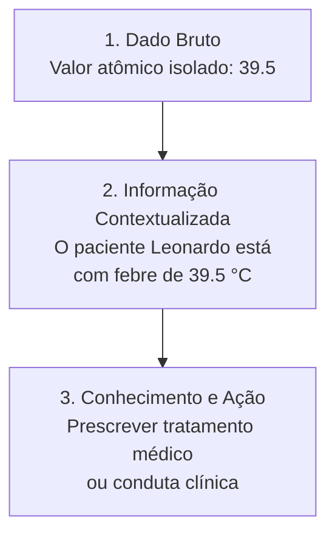
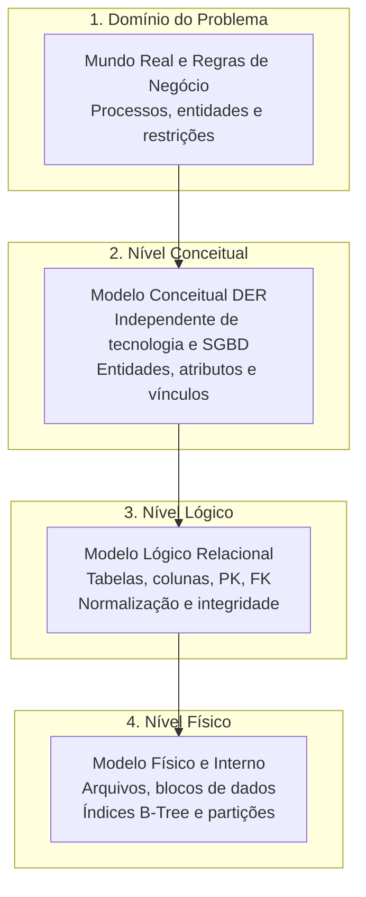
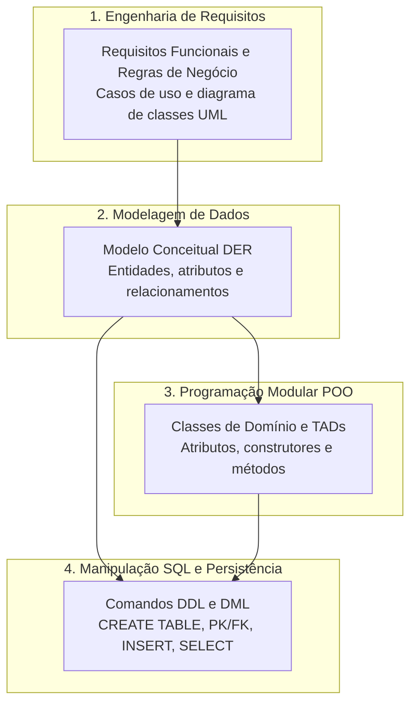
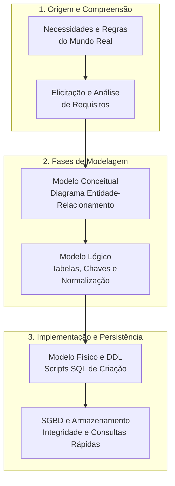

# Introdução à modelagem de dados e sua importância: da realidade ao banco de dados estruturado

> **Contexto:** Fundamentação teórica e prática sobre a necessidade crítica da modelagem de dados no ciclo de vida do software, desmistificando o processo de abstração do mundo real para estruturas computacionais consistentes, escaláveis e seguras.

---

## Introdução

Em qualquer sistema de informação moderno — desde um aplicativo móvel de entrega de comida até a infraestrutura transacional de um grande banco global —, o software existe fundamentalmente para processar, transformar e preservar **dados**. Telas atraentes, arquiteturas em nuvem e algoritmos velozes perdem totalmente o sentido se a base de dados subjacente estiver corrompida, duplicada, incompleta ou estruturada de maneira caótica.

Historicamente, muitos desenvolvedores cometem o erro de iniciar um projeto abrindo o editor de código e criando tabelas diretamente no banco conforme a necessidade imediata das telas. Esse caminho quase sempre conduz a desastres arquiteturais: dados órfãos, lentidão crítica em consultas, anomalias destrutivas de exclusão e custos astronômicos de manutenção.

A **modelagem de dados** é a disciplina da ciência da computação responsável por criar a ponte intelectual entre a complexidade do mundo real e a precisão do armazenamento digital. Neste artigo inaugural, utilizaremos a **Técnica de Feynman** para desconstruir os conceitos essenciais da modelagem de dados, explorar analogias intuitivas, entender por que ela é indispensável e visualizar como ela conecta negócio, código e persistência.

---

## 1. Desconstruindo a pirâmide do conhecimento: dado, informação e inteligência

Antes de projetar qualquer estrutura de banco de dados, é imperativo distinguir com rigor três conceitos que o senso comum frequentemente confunde: **dado**, **informação** e **conhecimento**.

### O dado (*o fato bruto descontextualizado*)
O dado é um registro atômico, bruto e desprovido de significado intrínseco quando isolado. 
* *Exemplo prático:* O número `39.5` em uma folha de papel ou em uma variável de memória. Sozinho, `39.5` pode ser a temperatura corporal de uma pessoa, o preço de uma refeição, a metragem de uma sala ou a velocidade do vento em nós.

### A informação (*o dado estruturado e contextualizado*)
A informação surge quando atribuímos contexto, rótulo, semântica e relacionamento a um conjunto de dados brutos, tornando-o compreensível para os seres humanos e para as regras de negócio.
* *Exemplo prático:* Conectar o valor `39.5` ao atributo `temperatura_celsius`, associá-lo à entidade `Paciente` de nome "Leonardo" e registrar a data/hora da medição: *"O paciente Leonardo registrou temperatura de 39.5 °C às 10:15h do dia 01/09/2026"*. O dado agora possui significado claro: o paciente está com febre alta.

### O conhecimento (*a informação aplicada à tomada de decisão*)
O conhecimento é a assimilação da informação integrada a regras, experiências e heurísticas que permitem agir, prever comportamentos ou tomar decisões assertivas.
* *Exemplo prático:* O médico ou o algoritmo hospitalar que cruza o histórico do paciente Leonardo, identifica a febre alta persistente, diagnostica uma infecção em estágio inicial e prescreve o protocolo medicamentoso adequado.

> **O papel central da modelagem:** A modelagem de dados é a engenharia que garante que os **dados brutos** sejam armazenados de forma tão organizada e precisa que o software consiga extrair **informações confiáveis** e viabilizar **conhecimento estratégico** a qualquer momento.

---

## 2. A analogia da planta arquitetônica: por que modelar antes de construir?

Imagine que uma construtora decida erguer um edifício residencial de 25 andares. O que aconteceria se o mestre de obras dissesse: *"Não precisamos perder tempo desenhando plantas baixas, calculando distribuição de cargas ou mapeando encanamentos. Vamos comprar tijolos, cimento e começar a empilhar paredes amanhã cedo"*?

O resultado seria catastrófico:
1. Ao chegar no 5º andar, o peso da estrutura esmagaria as vigas mal dimensionadas da base;
2. As tubulações de água e eletricidade bateriam de frente contra pilares de sustentação;
3. Para adicionar uma nova suíte no futuro, seria necessário demolir metade do prédio.

| Construção civil | Engenharia de software e modelagem de dados |
| :--- | :--- |
| **Necessidade dos moradores** | Requisitos funcionais e regras de negócio. |
| **Planta arquitetônica e estrutural** | Modelo conceitual (DER) e modelo lógico de dados. |
| **Cálculo de vigas, lajes e cargas** | Normalização, chaves primárias (`PK`) e integridade referencial (`FK`). |
| **Tijolos, concreto e fundação física** | Tabelas, índices B-Tree e alocação física no SGBD. |
| **Demolição por erro estrutural** | Refatoração traumática de banco de produção com perda de dados. |

No desenvolvimento de software, a modelagem de dados é a **planta arquitetônica e estrutural**. Criar tabelas diretamente no banco sem planejar o modelo é o exato equivalente a empilhar tijolos no escuro. Uma vez que o banco de dados entra em produção e acumula milhões de registros, mudar o formato de uma chave primária ou consertar um relacionamento estrutural mal projetado custa milhares de vezes mais caro do que acertar o desenho no início do projeto.

---

## 3. O problema do caos: a superação dos sistemas de arquivos legados

Para compreender o real valor dos Sistemas Gerenciadores de Bancos de Dados (SGBD) e da modelagem formal, é útil viajar no tempo até a década de 1960, quando os sistemas armazenavam informações diretamente em **arquivos de texto e registros binários no disco**.

Naquela época, cada programa era responsável por abrir o arquivo, ler os bytes na posição exata e escrever os dados. Esse modelo gerava graves problemas:

### a. Redundância e inconsistência de dados
Como não havia um modelo centralizado, o setor de vendas gravava o arquivo `clientes_vendas.txt` e o setor financeiro gravava `clientes_cobranca.txt`. Quando o cliente mudava de endereço residencial, apenas um dos setores atualizava seu arquivo. O resultado era a **inconsistência**: a mesma entidade do mundo real possuía dados conflitantes e contraditórios dentro da mesma empresa.

### b. Forte dependência entre programa e estrutura de armazenamento
Se a equipe técnica decidisse alterar o tamanho do campo CEP de 8 para 9 dígitos no arquivo, **todos os programas e rotinas do sistema precisavam ser reescritos e recompilados**, pois os ponteiros de leitura de bytes ficavam desalinhados.

### c. Dificuldade de acesso e consultas não planejadas
Para responder a uma pergunta simples como *"Quantos clientes de Belo Horizonte compraram produtos acima de R$ 500 no último mês?"*, um programador precisava escrever um código do zero em COBOL ou Fortran, percorrendo os arquivos linha por linha.

### d. Ausência de controle de concorrência e integridade
Se dois operadores tentassem atualizar o saldo da mesma conta bancária ao mesmo tempo, um arquivo sobrescrevia a gravação do outro, gerando perda irrecuperável de transações financeiras.

A modelagem de dados, aliada ao surgimento do **Modelo Relacional** por Edgar F. Codd em 1970, resolveu esses problemas ao introduzir regras matemáticas formais, independência de dados e controle estrito de integridade.

---

## 4. Os três níveis de abstração: a arquitetura ANSI/SPARC

Para garantir que o usuário e os desenvolvedores não precisem se preocupar com a forma como os bytes são gravados fisicamente nos discos ou unidades SSD, a arquitetura de banco de dados é dividida em **três níveis formais de abstração**:

### 1. Nível conceitual (*o que existe no domínio do problema*)
* **Foco:** Representar a realidade do negócio de forma clara, compreensível tanto para especialistas de negócio quanto para engenheiros de software.
* **Características:** Totalmente independente de qualquer tecnologia, linguagem de programação ou SGBD específico.
* **Ferramenta principal:** Diagrama Entidade-Relacionamento (DER/MER), identificando entidades (ex.: `Aluno`, `Curso`, `Matrícula`) e seus vínculos.

### 2. Nível lógico (*como os dados são organizados formalmente*)
* **Foco:** Traduzir os conceitos do modelo conceitual para um modelo computacional estruturado (geralmente o modelo relacional).
* **Características:** Define tabelas, colunas, tipos de dados conceituais, chaves primárias (PK), chaves estrangeiras (FK), cardinalidades e regras de normalização para eliminar redundâncias.
* **Exemplo:** A entidade conceitual `Aluno` se transforma na tabela `tb_aluno (id_aluno INT PK, nome VARCHAR(100), email VARCHAR(120) UNIQUE)`.

### 3. Nível físico (*como os dados são gravados no hardware*)
* **Foco:** Otimização de armazenamento, performance de leitura/escrita e alocação de recursos de hardware.
* **Características:** Gerenciado pelo SGBD específico (PostgreSQL, Oracle, MySQL, SQL Server). Trata de caminhos em disco, tamanhos de blocos de página, índices B-Tree/Hash, partições e técnicas de compressão.
* **A grande vantagem da independência:** Se você migrar o armazenamento de um disco rígido tradicional para um SSD ultrarrápido ou alterar a engine interna de índices, **o modelo lógico e o código da sua aplicação não precisam sofrer nenhuma alteração**.

---

## 5. Por que a modelagem de dados é crucial para a engenharia de software?

Uma boa modelagem de dados não é uma tarefa burocrática; é a base estrutural que determina o sucesso ou o fracasso de um software. Entre seus principais benefícios, destacam-se:

| Benefício estratégico | Impacto real no sistema de software |
| :--- | :--- |
| **Integridade referencial** | Impede registros órfãos (ex.: uma venda registrada sem um cliente válido associado). |
| **Eliminação de anomalias** | Evita inconsistências críticas em operações de inserção, alteração e exclusão. |
| **Desempenho otimizado** | Consultas velozes viabilizadas por indexação estratégica e junções relacionais corretas. |
| **Facilidade de evolução** | Novas funcionalidades são acopladas com baixo custo e sem quebrar esquemas existentes. |
| **Documentação unificada** | Serve como mapa visual compartilhado entre negócios, engenharia e análise de dados. |

1. **Garantia de integridade referencial:** Assegura que as regras do mundo real sejam validadas no núcleo dos dados. O banco rejeitará automaticamente a tentativa de cadastrar uma matrícula para um aluno inexistente.
2. **Eliminação de redundâncias e anomalias:** A normalização garante que cada fato seja armazenado em exatamente um único lugar, eliminando discrepâncias.
3. **Alto desempenho sob carga:** Bancos bem modelados permitem que o otimizador de consultas execute pesquisas entre milhões de registros em frações de milissegundos.
4. **Documentação universal:** O modelo de dados funciona como um dicionário visual comum entre gerentes de projeto, desenvolvedores front-end, engenheiros back-end e analistas de BI.

---

## 6. Conexões interdisciplinares: conectando requisitos, POO e SQL

A modelagem de dados não opera de forma isolada; ela é o ponto central onde convergem os requisitos de negócio, a arquitetura orientada a objetos e os comandos de banco:

* **Ponte com Engenharia de Requisitos:** Os requisitos funcionais e entidades de negócio levantados na [[07. Engenharia de Requisitos/09. Modelagem estrutural com diagrama de classes da uml|Engenharia de Requisitos]] servem como insumo direto para as entidades e relacionamentos do modelo conceitual.
* **Ponte com Programação Modular (POO):** As entidades modeladas correspondem diretamente às classes de domínio em C# ou Java, e os atributos das tabelas tornam-se propriedades de objetos (veja [[01. Programacao Modular/07. Atributos e métodos (classes, objetos e definição de membros)]]).
* **Ponte com Manipulação SQL:** O modelo lógico é diretamente traduzido em código executável por meio da DDL (*Data Definition Language*) da linguagem SQL (veja [[03. Manipulacao de Dados SQL/00. Manipulacao de Dados SQL - Resumo]]), criando as tabelas que darão suporte ao [[06. Projeto - Aplicacao Interativa/00. Projeto - Aplicacao Interativa - Resumo|Projeto da Aplicação Interativa]].

---

## 7. Diagrama de fluxo: do problema do mundo real ao banco físico

O diagrama vertical abaixo resume a esteira completa de transformação de uma necessidade de negócio em um banco de dados estruturado:

---

## Referências bibliográficas

### Bibliografia básica
* HEUSER, Carlos Alberto. **Projeto de banco de dados**. 6. ed. Porto Alegre: Bookman, 2009. (Série Livros Didáticos Informática UFRGS, v. 4). ISBN 9788577804528.
* ELMASRI, Ramez; NAVATHE, Shamkant B. **Sistemas de banco de dados**. 7. ed. São Paulo: Pearson Addison Wesley, 2018. ISBN 9788543025001.
* SILBERSCHATZ, Abraham; KORTH, Henry F.; SUDARSHAN, S. **Sistema de banco de dados**. 7. ed. Rio de Janeiro: Elsevier, GEN LTC, 2020. ISBN 9788595157477.

### Bibliografia complementar
* DATE, C. J. **Introdução a sistemas de bancos de dados**. 8. ed. Rio de Janeiro: Elsevier, Campus, 2004. ISBN 9788535212730.
* CODD, Edgar F. **A relational model of data for large shared data banks**. Communications of the ACM, v. 13, n. 6, p. 377-387, 1970.
* CHEN, Peter Pin-Shan. **The entity-relationship model: toward a unified view of data**. ACM Transactions on Database Systems (TODS), v. 1, n. 1, p. 9-36, 1976.
* MACHADO, Felipe Nery Rodrigues. **Banco de dados: projeto e implementação**. 4. ed. São Paulo: Érica, 2020. ISBN 9788536533032.

---

## Artigos relacionados e navegação

* **Próximo artigo:** [[02. Abordagem de arquivos vs. abordagem de banco de dados]]
* **Resumo da disciplina:** [[00. Modelagem de Dados - Resumo]]
* **Glossário da matéria:** [[Glossário de conceitos]]
* **Índice geral do vault:** [[index.md|Página Inicial do Vault]]
