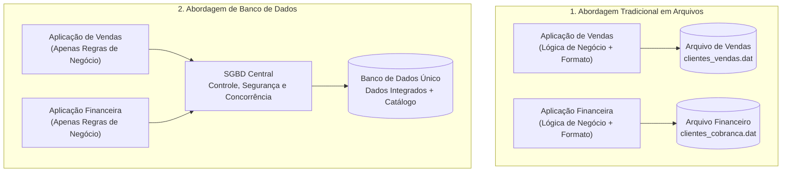

# Abordagem de arquivos vs. abordagem de banco de dados: da fragmentação caótica à gestão centralizada

> **Contexto:** Comparativo fundamental entre o processamento tradicional baseado em sistemas de arquivos e a abordagem integrada de banco de dados, detalhando as patologias históricas superadas e a distinção precisa entre BD (dados) e SGBD (gerenciador).

---

## Introdução

Nos primórdios da computação comercial, antes da invenção dos sistemas modernos de gerenciamento de dados, toda a informação de uma empresa era gravada diretamente em **arquivos individuais mantidos pelo sistema operacional** (como arquivos de texto sequenciais ou registros binários). Cada novo programa de computador criava seus próprios arquivos para atender a uma necessidade imediata e isolada.

Embora esse modelo tenha atendido às primeiras automações corporativas, o crescimento exponencial do volume de informações revelou que a abordagem centrada em arquivos é insustentável para sistemas de médio e grande porte. A falta de integração gerava dados conflitantes, falhas de segurança e um custo imenso de manutenção.

Neste artigo, utilizaremos a **Técnica de Feynman** para contrastar a **abordagem tradicional de arquivos** com a **abordagem de banco de dados**, entender com clareza o que diferencia um **BD** de um **SGBD** e dominar as razões arquiteturais que tornam o SGBD o coração da persistência no software moderno.

---

## 1. A analogia de Feynman: as gavetas trancadas vs. a biblioteca centralizada

Para visualizar a diferença entre os dois paradigmas, imagine o funcionamento administrativo de uma universidade:

```
+------------------------------------------------------------------------------------+
|                         A Metáfora da Gestão de Informações                        |
+------------------------------------------------------------------------------------+
|  ABORDAGEM DE ARQUIVOS (GAVETAS ISOLADAS)  |  ABORDAGEM DE BANCO DE DADOS (BIBLIOTECA)     |
|--------------------------------------------+-----------------------------------------------|
|  Cada setor tem seu próprio gaveteiro      |  Existe um acervo central compartilhado       |
|  O aluno muda de endereço no setor A, mas  |  O aluno atualiza seu endereço uma única vez  |
|  continua com o endereço antigo no setor B |  e todos os setores veem o dado atualizado    |
|  Se duas pessoas tentarem escrever na      |  O bibliotecário-chefe (SGBD) coordena as     |
|  mesma folha, uma sobrescreve a outra      |  leituras e escritas sem conflitos            |
|  Qualquer um com acesso à sala vê tudo     |  Cada setor só tem permissão para visualizar  |
|  (inclusive os salários dos professores)   |  as estantes que lhe dizem respeito           |
+------------------------------------------------------------------------------------+
```

### A abordagem de arquivos (*o arquivador de gavetas trancadas*)
No modelo tradicional de arquivos, cada departamento da empresa possui seus próprios arquivos e seus próprios programas:
* O setor de **matrículas** possui o programa `MatriculaApp` que lê o arquivo `alunos_matricula.dat`;
* O setor **financeiro** possui o programa `FinanceiroApp` que lê o arquivo `alunos_mensalidade.dat`;
* A **biblioteca** possui o programa `BibliotecaApp` que lê o arquivo `alunos_livros.dat`.

Se o aluno altera seu número de telefone na secretaria, apenas o arquivo `alunos_matricula.dat` é modificado. O setor financeiro e a biblioteca continuam com o telefone desatualizado. A informação do mesmo estudante está fragmentada, duplicada e inconsistente.

### A abordagem de banco de dados (*o acervo central gerenciado*)
Na abordagem de banco de dados, todos os programas deixam de manipular arquivos diretamente. Toda a massa de dados é unificada em um único repositório lógico compartilhado (o **Banco de Dados**), e o acesso a esse repositório é rigorosamente intermediado e controlado por um software especializado de alta performance: o **SGBD** (*Sistema Gerenciador de Banco de Dados*).

Quando a secretaria altera o telefone do aluno no banco de dados central, todos os outros sistemas passam a enxergar imediatamente o novo valor em tempo real.

---

## 2. A distinção fundamental: o que é BD, o que é SGBD e o que é SBD?

Um dos erros conceituais mais comuns entre iniciantes é tratar os termos "Banco de Dados" e "SGBD" como se fossem a mesma coisa. Eles desempenham papéis completamente distintos:

```
    [ Usuários / Aplicações ] (Web, Mobile, Desktop, APIs)
                |
                | (Consultas e Comandos SQL)
                v
    +-------------------------------------------------------------+
    |       SGBD (Sistema Gerenciador de Banco de Dados)          |
    |  * Motor de execução e otimizador de consultas              |
    |  * Controle de concorrência e transações (ACID)             |
    |  * Mecanismo de segurança e controle de permissões          |
    |  * Gerenciamento de buffers de memória e logs               |
    +-------------------------------------------------------------+
                |
                | (Leitura e Escrita de Baixo Nível)
                v
    +-------------------------------------------------------------+
    |                 BANCO DE DADOS (BD)                         |
    |  * Coleção estruturada de dados integrados                  |
    |  * Metadados (dicionário de dados / catálogo do sistema)    |
    |  * Relacionamentos lógicos e restrições de integridade      |
    +-------------------------------------------------------------+
```

### 1. Banco de dados (*o conteúdo / os dados*)
* **Definição:** É a **coleção organizada, integrada e logicamente coerente de dados** relacionados que representam aspectos do mundo real (frequentemente chamado na literatura técnica de *mini-mundo* ou *universo de discurso*).
* **Analogia:** É o **acervo de livros** guardado nas estantes de uma biblioteca, ou as receitas anotadas no livro de culinária.
* **Exemplo:** Os registros de clientes, pedidos, itens de venda e pagamentos de um comércio eletrônico.

### 2. Sistema Gerenciador de Banco de Dados (*o software / o motor*)
* **Definição:** É o **pacote de software complexo** que fornece todos os serviços e utilitários necessários para criar, definir (DDL), manipular (DML), consultar, proteger, auditar e manter o banco de dados. O SGBD atua como a camada intermediária protetora entre os programas de aplicação e os arquivos físicos em disco.
* **Analogia:** É o **bibliotecário-chefe**, com sua equipe de segurança, catálogo informatizado e regras de empréstimo.
* **Exemplos práticos de mercado:** PostgreSQL, Oracle Database, Microsoft SQL Server, MySQL, SQLite, MariaDB.

### 3. Sistema de Banco de Dados (*a solução completa*)
* **Definição:** É a união de todos os componentes operando em conjunto: **SGBD + Banco de Dados + Aplicações de Software + Administradores (DBA) e Usuários**.

---

## 3. As sete patologias críticas da abordagem tradicional de arquivos

O abandono da abordagem de arquivos em favor dos bancos de dados foi impulsionado por sete grandes limitações inerentes aos sistemas de arquivos:

### a. Redundância e inconsistência de dados
Em sistemas de arquivos, as informações são duplicadas em vários locais porque diferentes aplicações precisam dos mesmos atributos. Essa redundância consome armazenamento desnecessário e leva inevitavelmente à **inconsistência**: quando o mesmo dado possui valores divergentes em arquivos diferentes.

### b. Forte dependência entre programa e estrutura de dados
No processamento de arquivos, a estrutura de registros é declarada explicitamente dentro do código-fonte da aplicação (por exemplo, estruturas `struct` em C ou registros de tamanho fixo em COBOL). Se o desenvolvedor precisar alterar o tamanho de uma coluna ou adicionar um campo de telefone adicional, **todos os programas que leem aquele arquivo precisam ser reescritos, testados e recompilados**.

### c. Dificuldade de acesso a novos dados e consultas não previstas
Para extrair um relatório ad-hoc (não planejado originalmente), como *"Listar os 10 clientes que mais compraram na última semana"*, era necessário programar uma rotina completa do zero. No SGBD, isso é resolvido instantaneamente com uma única instrução declarativa em SQL (`SELECT ... ORDER BY ... LIMIT 10`).

### d. Isolamento e fragmentação dos dados
Como os dados ficavam espalhados em múltiplos arquivos gravados em formatos proprietários distintos (binário, CSV, texto delimitado), era extremamente complexo escrever softwares que cruzassem dados de diferentes setores da empresa.

### e. Problemas de integridade e regras de negócio dispersas
As restrições de integridade (por exemplo: *"o saldo da conta corrente não pode ser negativo"* ou *"o CPF deve conter 11 dígitos"*) precisavam ser codificadas manualmente dentro de cada programa. Se um novo desenvolvedor criasse um programa secundário e esquecesse de incluir essas validações no código, o arquivo era corrompido com dados inválidos.

### f. Anomalias de acesso concorrente (*perda de atualizações*)
Quando múltiplos usuários tentam ler e atualizar o mesmo arquivo simultaneamente sem um gerenciador transacional, ocorrem anomalias graves:
* **Perda de atualização (*lost update*):** Dois operadores leem o saldo de R$ 1.000 ao mesmo tempo. O primeiro debita R$ 100 e grava R$ 900; o segundo debita R$ 200 e grava R$ 800, sobrescrevendo a gravação do primeiro e sumindo com os R$ 100 debitados.

### g. Problemas de segurança e controle granular de acesso
Os sistemas operacionais tradicionais fornecem segurança apenas no nível do arquivo inteiro (permissão de leitura, escrita ou execução). Não é possível permitir que um atendente veja o nome e telefone do cliente, mas ocultar dele o saldo bancário ou a senha, a menos que esses dados sejam fisicamente segregados em arquivos distintos.

---

## 4. Quadro comparativo direto: arquivos vs. banco de dados

A tabela a seguir resume as principais diferenças estruturais entre as duas abordagens:

| Critério arquitetural | Abordagem centrada em arquivos | Abordagem de banco de dados (SGBD) |
| :--- | :--- | :--- |
| **Armazenamento de dados** | Múltiplos arquivos isolados e dispersos. | Base centralizada, integrada e compartilhada. |
| **Redundância de dados** | Alta e descontrolada. | Mínima, controlada e planejada via normalização. |
| **Consistência** | Baixa (risco constante de dados conflitantes). | Alta (garantida pelo motor do SGBD e restrições). |
| **Dependência programa-dados** | Alta (alteração física exige recompilar código). | Baixa (independência lógica e física total). |
| **Consultas ad-hoc** | Muito difícil (exige novos códigos do zero). | Nativa e simples através da linguagem SQL. |
| **Controle de integridade** | Espalhado no código de cada aplicação. | Centralizado no SGBD (`PRIMARY KEY`, `FOREIGN KEY`, `CHECK`). |
| **Controle de concorrência** | Inexistente ou rudimentar (bloqueio do arquivo todo). | Avançado e granular via controle de transações (ACID). |
| **Segurança e privacidade** | Limitada ao nível do arquivo no sistema operacional. | Granular ao nível de tabela, coluna, linha e visões (*views*). |
| **Recuperação de falhas** | Manual e sujeita a corrupção irreparável. | Automática via logs transacionais (*Rollback / Crash Recovery*). |

---

## 5. As grandes vantagens da abordagem de banco de dados

Ao migrar para uma arquitetura baseada em banco de dados e SGBD, as organizações obtêm benefícios fundamentais:

```
+------------------------------------------------------------------------------------+
|                         Vantagens Centrais do Uso de SGBDs                         |
+------------------------------------------------------------------------------------+
|  VANTAGEM                       |  SIGNIFICADO PRÁTICO NO DESENVOLVIMENTO          |
|---------------------------------+--------------------------------------------------|
|  Autocontenção e metadados      |  O banco guarda sua própria estrutura no         |
|                                 |  catálogo (dicionário de dados)                  |
|  Múltiplas visões dos dados     |  Diferentes usuários enxergam apenas os dados    |
|                                 |  relevantes para seu perfil de acesso (views)    |
|  Transações confiáveis (ACID)   |  Garantia de que operações financeiras ocorrem   |
|                                 |  de forma atômica (ou tudo ou nada)              |
|  Padrão declarativo universal   |  Uso de SQL padronizado pela ISO/ANSI            |
+------------------------------------------------------------------------------------+
```

1. **Natureza autocontida (*self-describing*):** Um banco de dados contém não apenas os dados em si, mas também uma descrição completa de sua própria estrutura e restrições. Essa descrição é armazenada no **catálogo do sistema** (ou dicionário de dados), permitindo que o SGBD funcione com qualquer aplicação sem conhecimento prévio da estrutura dos registros.
2. **Suporte a múltiplas visões (*views*):** Usuários diferentes podem necessitar de perspectivas distintas da mesma base. Um gerente financeiro pode ver o faturamento global, enquanto um vendedor enxerga apenas suas próprias vendas, sem duplicação física dos dados.
3. **Compartilhamento seguro e processamento de transações:** O SGBD garante que transações concorrentes não interfiram umas nas outras, implementando os princípios ACID (Atomicidade, Consistência, Isolamento e Durabilidade).

---

## 6. Diagrama estrutural: fluxo tradicional vs. fluxo com SGBD

O diagrama vertical abaixo demonstra a mudança estrutural de acoplamento entre as duas abordagens:



---

## Referências bibliográficas

### Bibliografia básica
* ELMASRI, Ramez; NAVATHE, Shamkant B. **Sistemas de banco de dados**. 7. ed. São Paulo: Pearson Addison Wesley, 2018. (Capítulo 1: *Bancos de dados e usuários de bancos de dados*). ISBN 9788543025001.
* HEUSER, Carlos Alberto. **Projeto de banco de dados**. 6. ed. Porto Alegre: Bookman, 2009. (Capítulo 1: *Introdução e conceitos gerais*). ISBN 9788577804528.
* SILBERSCHATZ, Abraham; KORTH, Henry F.; SUDARSHAN, S. **Sistema de banco de dados**. 7. ed. Rio de Janeiro: Elsevier, GEN LTC, 2020. (Capítulo 1: *Introdução*). ISBN 9788595157477.

### Bibliografia complementar
* DATE, C. J. **Introdução a sistemas de bancos de dados**. 8. ed. Rio de Janeiro: Elsevier, Campus, 2004. ISBN 9788535212730.
* MACHADO, Felipe Nery Rodrigues. **Banco de dados: projeto e implementação**. 4. ed. São Paulo: Érica, 2020. ISBN 9788536533032.

---

## Artigos relacionados e navegação

* **Artigo anterior:** [[01. Introdução à modelagem de dados e sua importância]]
* **Próximo artigo:** [[03. Níveis de abstração e arquitetura ansi-sparc]]
* **Resumo da disciplina:** [[00. Modelagem de Dados - Resumo]]
* **Glossário da matéria:** [[Glossário de conceitos]]
* **Índice geral do vault:** [[index.md|Página Inicial do Vault]]
