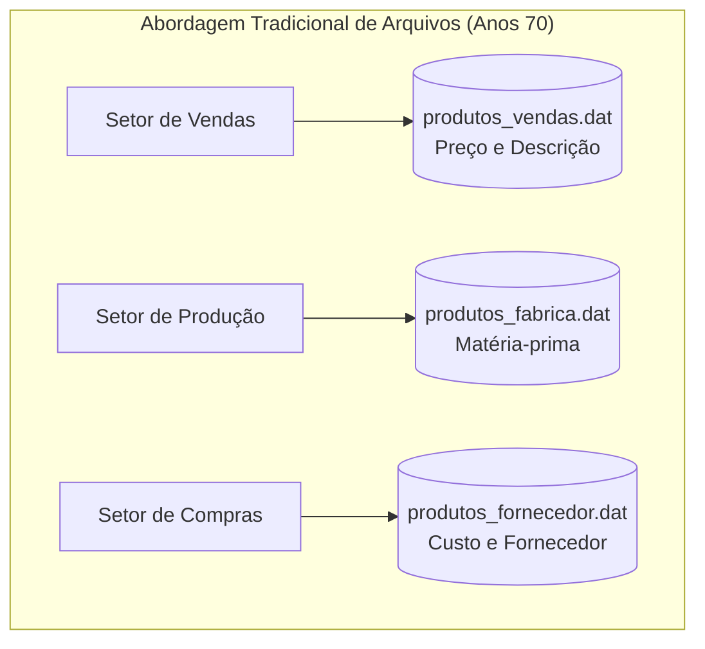
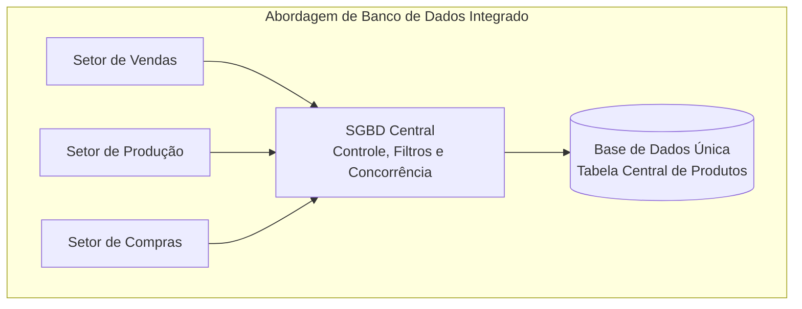
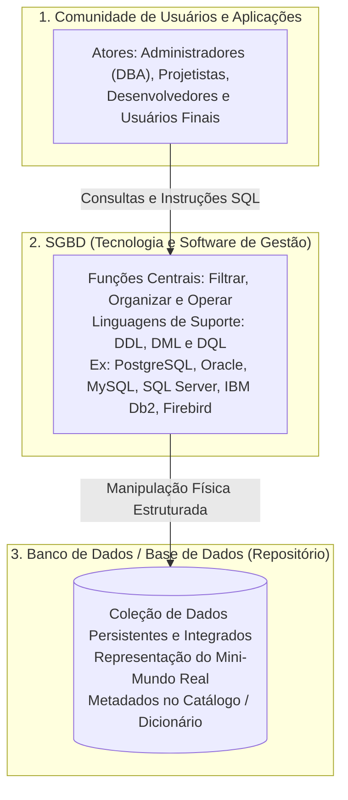
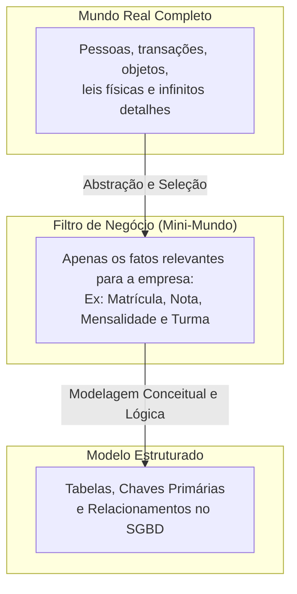

# Abordagem de arquivos vs. abordagem de banco de dados: da fragmentação caótica à gestão centralizada

> **Contexto:** Comparativo fundamental entre o processamento tradicional baseado em sistemas de arquivos e a abordagem integrada de banco de dados, detalhando as patologias históricas superadas, a distinção precisa entre BD e SGBD, os atores no cenário corporativo e as funções centrais da persistência moderna.

---

## Introdução

Nos primórdios da computação comercial, antes da invenção dos sistemas modernos de gerenciamento de dados, toda a informação corporativa era gravada diretamente em **arquivos individuais mantidos pelo sistema operacional** (como arquivos de texto sequenciais ou registros binários no disco). Cada novo programa criado por um engenheiro de software modelava seus próprios arquivos de forma proprietária e isolada para atender a uma necessidade imediata.

Embora esse modelo tenha atendido às primeiras automações na década de 1970, o crescimento do volume de informações revelou que a abordagem centrada em arquivos é insustentável. A falta de integração gerava dados conflitantes, custos exorbitantes de armazenamento e um obstáculo permanente à criação de novas aplicações.

Neste artigo, utilizaremos a **Técnica de Feynman** para contrastar a **abordagem tradicional de arquivos** com a **abordagem de banco de dados**, desconstruir o conceito de **mini-mundo**, compreender a diferença exata entre **BD (base de dados)** e **SGBD (software gerenciador)** e analisar a comunidade de atores que interage com esses dados.

---

## 1. A analogia de Feynman: as gavetas trancadas vs. a biblioteca centralizada

Para visualizar a diferença entre os dois paradigmas, imagine o funcionamento administrativo de uma universidade ou de uma indústria:

| Cenário administrativo | Abordagem de arquivos (gavetas isoladas) | Abordagem de banco de dados (biblioteca gerenciada) |
| :--- | :--- | :--- |
| **Organização do acervo** | Cada setor tem seu próprio gaveteiro trancado. | Existe um acervo central compartilhado e padronizado. |
| **Atualização cadastral** | O aluno altera o endereço em um setor, mas continua desatualizado nos demais. | O aluno atualiza o endereço uma única vez e todos os setores veem o dado novo em tempo real. |
| **Acesso concorrente** | Se dois operadores tentarem escrever na mesma folha, um sobrescreve o outro. | O SGBD coordena leituras e escritas concorrentes sem perda de dados. |
| **Segurança e visibilidade** | Quem abre a sala vê todas as folhas (inclusive dados confidenciais). | Cada perfil de usuário enxerga apenas as visões (*views*) autorizadas para sua função. |

### A abordagem de arquivos (*o arquivador de gavetas trancadas*)
Na década de 1970, as aplicações eram as proprietárias absolutas de seus arquivos. Cada engenheiro ou departamento tinha total liberdade para definir o modelo físico de dados:
* O setor de **vendas** criava sua própria tabela/arquivo de produtos: `produtos_vendas.dat` (armazenando código, descrição e preço de venda);
* O setor de **produção** criava outra tabela/arquivo de produtos: `produtos_fabrica.dat` (armazenando código, matéria-prima e tempo de montagem);
* O setor de **compras** criava uma terceira tabela/arquivo de produtos: `produtos_fornecedor.dat` (armazenando código, fornecedor e custo unitário).

Se o departamento de engenharia alterasse o nome ou a especificação de um produto, a mudança era registrada apenas no arquivo da produção. Vendas e compras continuavam trabalhando com dados obsoletos. A mesma entidade física do mundo real existia em três versões conflitantes.

### A abordagem de banco de dados (*o acervo central integrado*)
Na abordagem de banco de dados, os dados deixam de pertencer a programas individuais e passam a pertencer à **organização como um todo**. Existe uma única base de dados compartilhada, onde a entidade `Produto` é modelada centralmente, integrando atributos de vendas, produção e suprimentos sob a custódia do **SGBD**.

---

## 2. A distinção fundamental: BD vs. SGBD vs. SBD

Um dos pontos mais cobrados na literatura acadêmica e em entrevistas técnicas é a distinção precisa entre os componentes da persistência:

### 1. Banco de dados ou base de dados (*o repositório de dados*)
* **Definição formal:** É uma **coleção de dados logicamente coerente, integrada e persistente**, que modela e reflete um aspecto específico do mundo real (o chamado **mini-mundo** ou *universo de discurso*).
* **Sinônimos:** *Base de dados* e *banco de dados* são usados como sinônimos na prática da engenharia.
* **Escala e complexidade:** Pode variar desde uma base simples embutida em um smartphone (ex.: SQLite) até bancos corporativos distribuídos gerenciados por grandes clusters de servidores em nuvem.
* **Funções essenciais:**
  1. **Armazenar:** Garantir que os dados permaneçam gravados de forma segura e duradoura.
  2. **Buscar:** Permitir localização rápida e recuperação precisa de informações através de chaves e índices.
  3. **Tratar:** Suportar transformações, atualizações, agregações e cálculos sobre os registros.

### 2. Sistema Gerenciador de Banco de Dados — SGBD (*o software de controle*)
* **Definição formal:** É o pacote de software de sistema especializado que incorpora todas as funções operacionais para **definir, construir, manipular, filtrar, organizar, proteger e compartilhar** o banco de dados entre múltiplos usuários e aplicações.
* **Papel:** É a tecnologia que fornece interfaces declarativas (como a linguagem SQL) para que programadores operem os dados sem precisar lidar com ponteiros de baixo nível no disco rígido.
* **Principais tecnologias de mercado:**
  * **Open-source:** PostgreSQL, MySQL, MariaDB, Firebird.
  * **Comerciais / Corporativos:** Oracle Database, Microsoft SQL Server, IBM Db2.

### 3. Sistema de Banco de Dados — SBD (*o ecossistema completo*)
* **Definição:** É a composição de todos os elementos: **o SGBD + o Banco de Dados + as aplicações de software + a comunidade de usuários e infraestrutura**.

---

## 3. Para quem existe o banco de dados? A comunidade de atores

Um banco de dados corporativo não é construído para uma única pessoa; ele atende a uma **comunidade diversificada de usuários**, cada qual com seu papel bem delimitado:

| Papel / Ator | Responsabilidade principal no sistema | Interação com o SGBD |
| :--- | :--- | :--- |
| **Administrador de banco de dados (DBA)** | Gerenciar o banco de dados, autorizar acessos, monitorar desempenho, planejar capacidade e executar rotinas de backup e recuperação. | Comandos DDL, ferramentas administrativas e comandos de segurança/privilégios (`GRANT`, `REVOKE`). |
| **Projetista de banco de dados** | Identificar as necessidades do mini-mundo, criar os modelos conceituais (DER) e lógicos, e definir restrições de integridade. | Diagramas conceituais, normalização e definição de esquemas lógicos. |
| **Analistas e desenvolvedores** | Criar as aplicações de software (web, mobile, APIs) que consomem e gravam dados para os usuários finais. | Comandos DML (consultas, inserções, atualizações) e integração com linguagens (C#, Java, Python). |
| **Usuários finais (*end-users*)** | Utilizar o sistema no dia a dia para realizar suas tarefas de trabalho (atendentes, gerentes, clientes). | Telas do aplicativo e relatórios visuais (não escrevem SQL diretamente). |

---

## 4. As patologias da abordagem de arquivos vs. as vantagens do banco de dados

Todos os graves problemas que inviabilizaram o processamento tradicional em arquivos se transformaram nas **vantagens centrais da abordagem de banco de dados**:

| Problema na abordagem de arquivos | Consequência no sistema | Vantagem correspondente na abordagem de BD |
| :--- | :--- | :--- |
| **Redundância de dados** | O mesmo produto ou cliente é gravado em múltiplos arquivos diferentes. | **Controle centralizado de redundância:** Cada fato é armazenado em um único lugar via normalização. |
| **Custo maior de armazenamento** | Espaço em disco desperdiçado com cópias desnecessárias dos mesmos atributos. | **Otimização de armazenamento:** Menor ocupação física de disco e memória cache. |
| **Inconsistência de dados** | Atualizações não são replicadas em todos os arquivos, gerando dados conflitantes. | **Garantia de consistência:** Uma única atualização reflete instantaneamente para toda a organização. |
| **Dificuldade de reaproveitamento** | Novas aplicações não conseguem consumir dados gravados em formatos proprietários. | **Independência e reuso:** O catálogo do SGBD permite que qualquer novo sistema consulte a base existente. |
| **Dificuldade de acesso aos dados** | Consultas ad-hoc exigiam programar novos códigos do zero em linguagens procedurais. | **Consultas declarativas rápidas:** Consultas complexas executadas instantaneamente via linguagem SQL. |
| **Inexistência de controle central** | Não havia governança, auditoria ou administração centralizada da informação. | **Administração e governança central (DBA):** Políticas unificadas de segurança, integridade e backup. |

---

## 5. O conceito de mini-mundo: a realidade modelada

> *"Todo modelo de dados é uma representação simplificada da realidade."*

Nenhum banco de dados armazena o universo inteiro; ele armazena exclusivamente o **mini-mundo** (também chamado de *universo de discurso*) relevante para os objetivos da instituição:

* **Exemplo de mini-mundo hospitalar:** Para o hospital, a cor favorita do paciente ou seu gosto musical são irrelevantes. O mini-mundo precisa registrar apenas tipo sanguíneo, histórico de alergias, medicamentos prescritos e médico responsável.

---

## Referências bibliográficas

### Bibliografia básica
* ELMASRI, Ramez; NAVATHE, Shamkant B. **Sistemas de banco de dados**. 7. ed. São Paulo: Pearson, 2018. (Capítulo 1: *Bancos de dados e usuários de bancos de dados*, p. 1-28). ISBN 9788543025001.
* HEUSER, Carlos Alberto. **Projeto de banco de dados**. 6. ed. Porto Alegre: Bookman, 2009. (Capítulo 1: *Introdução e conceitos gerais*). ISBN 9788577804528.
* SILBERSCHATZ, Abraham; KORTH, Henry F.; SUDARSHAN, S. **Sistema de banco de dados**. 7. ed. Rio de Janeiro: Elsevier, GEN LTC, 2020. (Capítulo 1: *Introdução*). ISBN 9788595157477.

### Bibliografia complementar
* DATE, C. J. **Introdução a sistemas de bancos de dados**. 8. ed. Rio de Janeiro: Elsevier, Campus, 2004. ISBN 9788535212730.
* MACHADO, Felipe Nery Rodrigues. **Banco de dados: projeto e implementação**. 4. ed. São Paulo: Érica, 2020. ISBN 9788536533032.

---

## Materiais complementares recomendados

* **Conheça mais sobre os tipos de SGBD:** [What is Database & SQL?](https://www.youtube.com/watch?v=FR4QIeZaPeM) — Visão geral introdutória sobre conceitos de bases de dados, mecanismos relacionais e fundamentos de SQL.
* **Aprenda mais sobre a história dos SGBDs:** [History of Databases](https://www.youtube.com/watch?v=KG-mqHoXOXY) — Documentário técnico detalhando a evolução histórica dos sistemas de arquivos nos anos 60 até o surgimento do modelo relacional e dos SGBDs modernos.

---

## Artigos relacionados e navegação

* **Artigo anterior:** [[01. Introdução à modelagem de dados e sua importância]]
* **Próximo artigo:** [[03. Níveis de abstração e arquitetura ansi-sparc]]
* **Resumo da disciplina:** [[00. Modelagem de Dados - Resumo]]
* **Glossário da matéria:** [[Glossário de conceitos]]
* **Índice geral do vault:** [[index.md|Página Inicial do Vault]]
