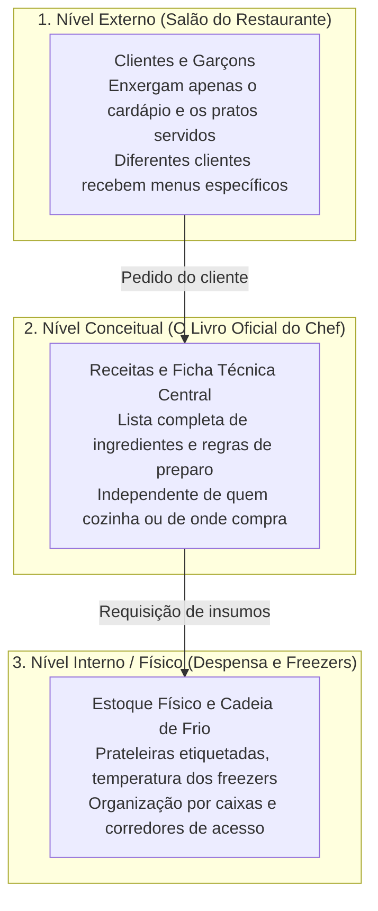
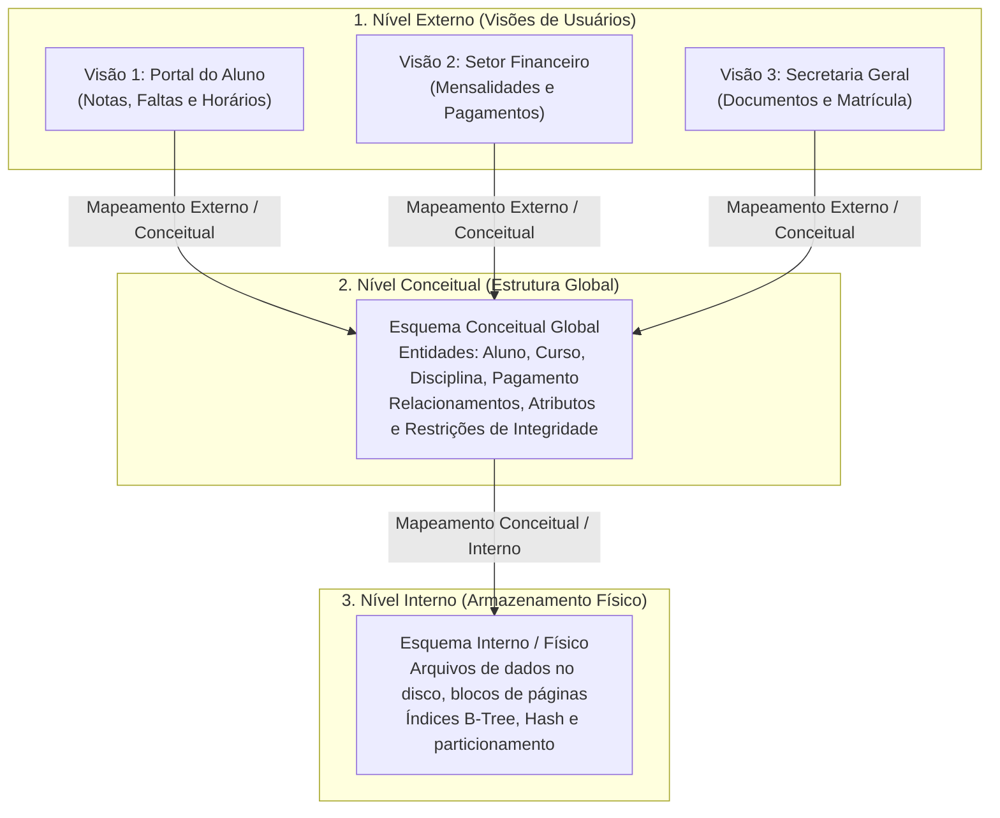
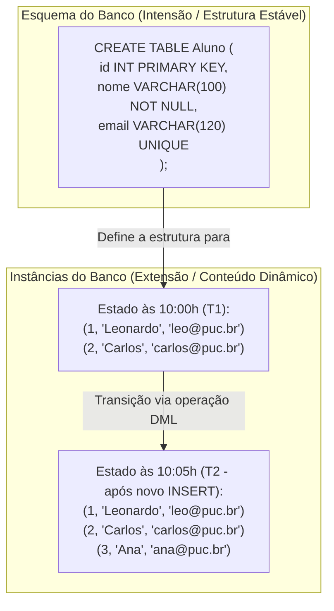

# Níveis de abstração e a arquitetura ansi/sparc: da visão do usuário ao armazenamento físico

> **Contexto:** Estudo detalhado dos três níveis de abstração da arquitetura de bancos de dados proposta pelo comitê ANSI/SPARC, compreendendo o papel dos mapeamentos, os princípios de independência lógica e física de dados, e a distinção crucial entre esquema e instância.

---

## Introdução

Um dos maiores desafios da engenharia de software ao longo das décadas foi isolar as aplicações dos detalhes físicos de como os dados são gravados no hardware. Se um desenvolvedor precisasse reescrever telas e regras de negócio toda vez que o administrador do banco trocasse um disco rígido ou adicionasse um índice de performance, o custo de manutenção de sistemas seria inviável.

Para solucionar definitivamente esse problema de acoplamento, o comitê **ANSI/X3/SPARC** (*Standards Planning and Requirements Committee*) formalizou em 1975 uma proposta arquitetural tripartite que se tornou o alicerce fundamental de todos os Sistemas Gerenciadores de Bancos de Dados (SGBD) modernos.

Neste artigo, utilizaremos a **Técnica de Feynman** para desconstruir os **três níveis da arquitetura ANSI/SPARC**, compreender como ocorrem os **mapeamentos entre níveis**, dominar os conceitos de **independência lógica e física** e entender a diferença vital entre **esquema (estrutura)** e **instância (dados atuais)**.

---

## 1. A analogia de Feynman: o restaurante de alta gastronomia

Para entender os três níveis de abstração sem jargões complexos, imagine o funcionamento de um restaurante sofisticado:

| Nível no restaurante | Equivalente no banco de dados (ANSI/SPARC) | O que é visível | O que é ocultado |
| :--- | :--- | :--- | :--- |
| **O menu na mesa do cliente** | **Nível externo (*visões / views*)** | Apenas os pratos e preços que o cliente tem permissão de pedir. | As receitas secretas de outros pratos e o estoque físico. |
| **O livro de receitas do chef** | **Nível conceitual (*esquema lógico global*)** | A estrutura completa de todas as receitas e regras culinárias. | Em qual gaveta ou prateleira do congelador o saco de sal está guardado. |
| **A despensa refrigerada** | **Nível interno (*esquema físico*)** | A organização física dos alimentos em caixas, freezers e prateleiras. | Quem são os clientes do salão ou qual o layout do cardápio impresso. |

Se o restaurante decidir reorganizar as prateleiras da despensa física ou trocar a marca dos freezers (**nível interno**), o cardápio dos clientes no salão (**nível externo**) não precisa ser reimpresso nem alterado. Essa é a essência da **independência de dados**.

---

## 2. A arquitetura de três esquemas ANSI/SPARC

A arquitetura ANSI/SPARC organiza o banco de dados em três níveis hierárquicos distintos, cada qual definido por um **esquema** (*schema*):

### 1. Nível externo (*esquemas externos ou visões de usuários*)
* **Definição:** É o nível mais próximo dos usuários e desenvolvedores front-end/mobile. Descreve a parte específica do banco de dados que é de interesse para um determinado grupo de usuários, ocultando o restante da base.
* **Características:**
  * Um único banco de dados pode conter dezenas ou centenas de visões externas distintas;
  * Oferece segurança ao impedir que dados sensíveis (ex.: salários, senhas criptografadas) sejam expostos a usuários não autorizados;
  * Simplifica o desenvolvimento, fornecendo dados já filtrados e formatados (veja [[02. Abordagem de arquivos vs. abordagem de banco de dados|Visões SQL]]).

### 2. Nível conceitual (*esquema conceitual global*)
* **Definição:** Descreve a **estrutura lógica completa de todo o banco de dados** para a organização inteira.
* **Características:**
  * Representa todas as entidades, atributos, tipos de dados, relacionamentos e restrições de integridade corporativas (ex.: chaves primárias `PK`, chaves estrangeiras `FK`, restrições `CHECK`);
  * Oculta completamente os detalhes de alocação de baixo nível (como bytes, ponteiros e setores do disco);
  * É modelado através do Diagrama Entidade-Relacionamento (DER) e materializado nas tabelas do modelo relacional.

### 3. Nível interno (*esquema interno ou físico*)
* **Definição:** Descreve a **estrutura física detalhada de armazenamento e caminhos de acesso** aos dados no hardware.
* **Características:**
  * Especifica como os registros são empacotados em blocos de páginas no disco rígido ou SSD;
  * Detalha a criação e organização de índices aceleradores (estruturas B-Tree, índices bitmap ou tabelas hash);
  * Define parâmetros de alocação de espaço (*tablespaces*), compressão de dados e particionamento de arquivos.

---

## 3. Os mapeamentos entre níveis (*mappings*)

Para que uma instrução SQL escrita por um desenvolvedor no nível externo recupere os bytes corretos gravados no disco pelo nível interno, o SGBD executa transformações automáticas chamadas de **mapeamentos**:

1. **Mapeamento externo / conceitual:** O SGBD traduz uma consulta feita sobre uma visão virtual para comandos sobre as tabelas e relacionamentos reais do esquema conceitual.
2. **Mapeamento conceitual / interno:** O SGBD traduz a operação lógica sobre tabelas em solicitações de leitura e escrita de páginas e blocos de arquivos no subsistema de armazenamento.

---

## 4. Independência de dados: lógica vs. física

A maior conquista da arquitetura ANSI/SPARC é a **independência de dados**, definida como a capacidade de modificar o esquema em um determinado nível sem precisar alterar o esquema no nível imediatamente superior.

### a. Independência lógica de dados
* **Definição formal:** É a capacidade de alterar o **esquema conceitual** sem que seja necessário reescrever os **esquemas externos (visões)** ou os **programas de aplicação existentes**.
* **Exemplo prático:** Se a equipe de dados adicionar uma nova coluna `telefone_recado` ou criar uma nova tabela `tb_log_auditoria` no banco, os sistemas antigos que apenas consultam o nome e CPF do aluno continuam funcionando perfeitamente sem alteração de uma única linha de código.

### b. Independência física de dados
* **Definição formal:** É a capacidade de alterar o **esquema interno** (físico) sem que seja necessário alterar o **esquema conceitual** ou as aplicações.
* **Exemplo prático:** Se o DBA decidir mover os arquivos de dados para uma unidade SSD de alta velocidade, reorganizar os blocos em disco ou criar um índice B-Tree na coluna `cpf` para acelerar buscas, o código SQL da aplicação (`SELECT * FROM tb_aluno WHERE cpf = '123'`) e o modelo conceitual permanecem rigorosamente idênticos.

| Tipo de independência | O que é alterado | O que permanece protegido e inalterado | Grau de complexidade |
| :--- | :--- | :--- | :--- |
| **Independência física** | Esquema interno (estruturas de disco, índices, partições, hardware). | Esquema conceitual, esquemas externos e código das aplicações. | Mais fácil de atingir (nativa em quase todos os SGBDs modernos). |
| **Independência lógica** | Esquema conceitual (novas tabelas, novos atributos, redefinição de vínculos). | Esquemas externos e aplicações que não utilizam os elementos modificados. | Mais complexa (exige planejamento cuidadoso de visões e mapeamentos). |

---

## 5. Esquema vs. instância do banco de dados

Uma distinção terminológica clássica na teoria relacional é a separação entre **esquema** (*intensão*) e **instância / estado** (*extensão*):

### O esquema do banco de dados (*intensão*)
* **Definição:** É o **projeto estrutural global**, composto pelas definições das tabelas, tipos de dados, nomes de colunas e regras de integridade.
* **Comportamento:** É estático e raramente sofre alterações ao longo da vida útil do sistema.
* **Analogia:** É a **planta baixa de uma residência** ou a **forma de um bolo**.

### A instância ou estado do banco de dados (*extensão*)
* **Definição:** É o **conjunto real de dados armazenados** no banco de dados em um momento exato no tempo.
* **Comportamento:** É altamente dinâmico e muda continuamente a cada segundo através de operações de inserção (`INSERT`), atualização (`UPDATE`) e exclusão (`DELETE`).
* **Analogia:** São as **pessoas morando dentro da casa** em determinada data, ou o **bolo assado** que acabou de sair da forma.

| Característica | Esquema (*schema / intensão*) | Instância (*instance / estado / extensão*) |
| :--- | :--- | :--- |
| **Natureza** | Estrutural, abstrata e descritiva. | Factual, concreta e dinâmica. |
| **Frequência de mudança** | Rara (ocorre apenas em manutenções e migrações de versão). | Constante (varia a cada transação executada no sistema). |
| **Linguagem associada** | DDL (*Data Definition Language*: `CREATE`, `ALTER`, `DROP`). | DML (*Data Manipulation Language*: `INSERT`, `UPDATE`, `DELETE`). |
| **Localização dos dados** | Catálogo do sistema / dicionário de metadados. | Tabelas e arquivos físicos de dados do banco. |

---

## 6. Síntese conceitual dos três níveis

A tabela a seguir consolida a matriz completa da arquitetura ANSI/SPARC:

| Nível de abstração | Foco principal | Quem utiliza | Elementos manipulados | Independência associada |
| :--- | :--- | :--- | :--- | :--- |
| **Externo** | Visão individual e personalizada para cada perfil de negócio. | Usuários finais, analistas e programadores front-end. | Visões virtuais (*views*), formulários e relatórios. | Protegido pela independência lógica. |
| **Conceitual** | Estrutura lógica global e regras de negócio corporativas. | Projetistas de dados, arquitetos e engenheiros de software. | Entidades, tabelas, atributos, `PK`, `FK`, regras `CHECK`. | Fornece independência lógica e é protegido pela física. |
| **Interno / Físico** | Alocação física, índices e eficiência no hardware. | Administrador de banco de dados (DBA) e motor do SGBD. | Arquivos de dados, páginas de disco, índices B-Tree/Hash. | Fornece independência física às camadas superiores. |

---

## Referências bibliográficas

### Bibliografia básica
* ELMASRI, Ramez; NAVATHE, Shamkant B. **Sistemas de banco de dados**. 7. ed. São Paulo: Pearson, 2018. (Capítulo 2: *Conceitos e arquitetura dos sistemas de banco de dados*, p. 29-58). ISBN 9788543025001.
* HEUSER, Carlos Alberto. **Projeto de banco de dados**. 6. ed. Porto Alegre: Bookman, 2009. (Capítulo 1: *Conceitos gerais e níveis de arquitetura*). ISBN 9788577804528.
* SILBERSCHATZ, Abraham; KORTH, Henry F.; SUDARSHAN, S. **Sistema de banco de dados**. 7. ed. Rio de Janeiro: Elsevier, GEN LTC, 2020. (Capítulo 1 e 2: *Visão geral da arquitetura de dados*). ISBN 9788595157477.

### Bibliografia complementar
* DATE, C. J. **Introdução a sistemas de bancos de dados**. 8. ed. Rio de Janeiro: Elsevier, Campus, 2004. (Capítulo 2: *Arquitetura de sistemas de banco de dados*). ISBN 9788535212730.
* ANSI/X3/SPARC. **Study group on data base management systems: interim report 75-02-08**. FDT Bulletin of ACM SIGMOD, v. 7, n. 2, p. 1-140, 1975.
* MACHADO, Felipe Nery Rodrigues. **Banco de dados: projeto e implementação**. 4. ed. São Paulo: Érica, 2020. ISBN 9788536533032.

---

## Artigos relacionados e navegação

* **Artigo anterior:** [[02. Abordagem de arquivos vs. abordagem de banco de dados]]
* **Próximo artigo:** [[04. Linguagens de banco de dados e perfis profissionais (ad vs. dba)]]
* **Resumo da disciplina:** [[00. Modelagem de Dados - Resumo]]
* **Glossário da matéria:** [[Glossário de conceitos]]
* **Índice geral do vault:** [[index.md|Página Inicial do Vault]]
