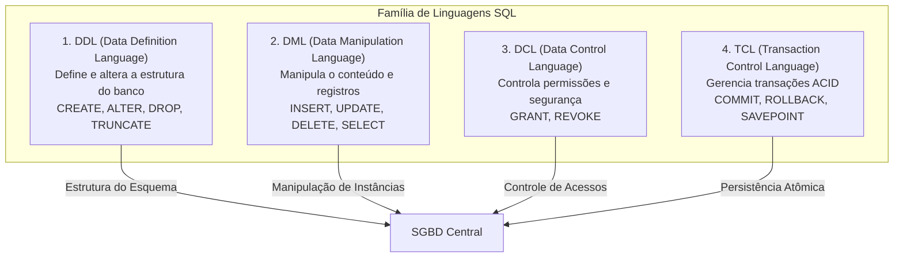
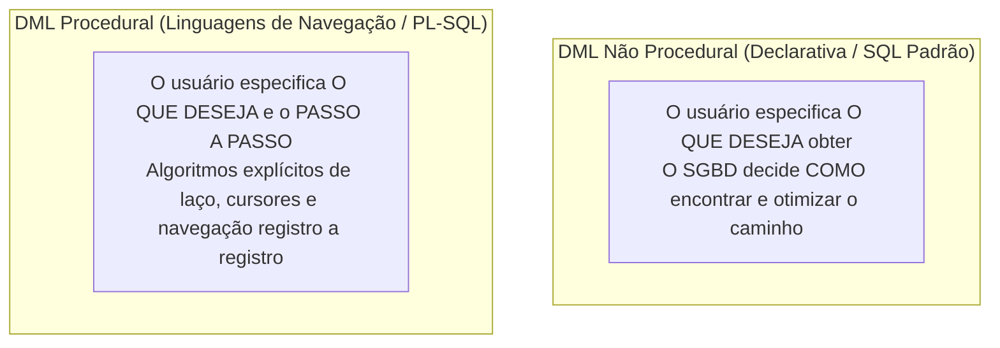
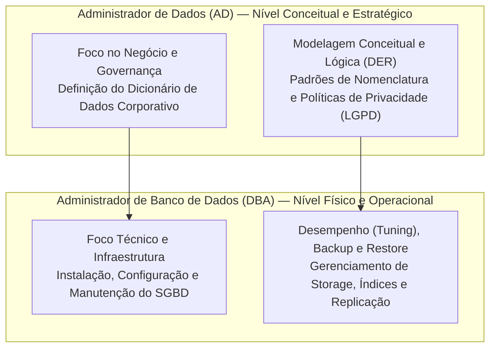

# Linguagens de banco de dados e perfis profissionais: ddl vs. dml e a atuação de ad vs. dba

> **Contexto:** Estudo das categorias de linguagens utilizadas em bancos de dados (com foco na distinção prática entre DDL e DML) e análise detalhada dos papéis profissionais do ecossistema corporativo, diferenciando a atuação estratégica do Administrador de Dados (AD) da atuação técnica e operacional do Administrador de Banco de Dados (DBA).

---

## Introdução

Um Sistema Gerenciador de Banco de Dados (SGBD) não opera sozinho: ele precisa de **linguagens formais padronizadas** para que os seres humanos possam instruí-lo sobre o que criar e como manipular as informações, e depende de **profissionais especializados** para garantir que os dados atendam aos objetivos do negócio com alto desempenho e segurança.

No ecossistema da linguagem SQL e da governança corporativa, duas grandes divisões se destacam:
1. **No âmbito das linguagens:** a separação entre comandos estruturais (**DDL**) e comandos de manipulação cotidiana de registros (**DML**);
2. **No âmbito das carreiras:** a divisão entre a gestão conceitual e estratégica das informações (**AD**) e a administração técnica, física e operacional do servidor (**DBA**).

Neste artigo, utilizaremos a **Técnica de Feynman** para desmistificar essas categorias, entender a diferença entre DML procedural e não procedural, e explorar o panorama de atuação no mercado de trabalho de dados.

---

## 1. As linguagens de banco de dados: ddl vs. dml

Para interagir com as diferentes camadas de um SGBD, a linguagem SQL (*Structured Query Language*) é subdividida em subconjuntos funcionais especializados:



### A analogia de Feynman: o teatro e os atores
* **A DDL (*Data Definition Language*):** É a equipe de cenografia que constrói o palco, fixa as paredes de madeira, instala os refletores de luz e define onde ficam as portas de entrada e saída. Se o palco for alterado, o cenário muda.
* **A DML (*Data Manipulation Language*):** São os atores que sobem no palco, contracenam, entram em cena, mudam de posição e saem do palco ao final do espetáculo. Os atores se movem constantemente sem alterar a estrutura física do teatro.

---

## 2. Detalhamento: DDL vs. DML

| Critério de comparação | DDL (*Data Definition Language*) | DML (*Data Manipulation Language*) |
| :--- | :--- | :--- |
| **Objetivo central** | Definir, alterar e excluir os esquemas estruturais e metadados do banco. | Inserir, consultar, atualizar e excluir os dados reais das tabelas. |
| **Público de uso frequente** | DBAs, arquitetos de dados e engenheiros de infraestrutura. | Desenvolvedores de software (back-end/full-stack), analistas e cientistas de dados. |
| **Frequência de execução** | Rara (durante o projeto inicial, deploys e migrações de versão). | Constante (milhares ou milhões de vezes por segundo nas aplicações). |
| **Comandos fundamentais** | `CREATE`, `ALTER`, `DROP`, `TRUNCATE`, `RENAME`. | `INSERT`, `UPDATE`, `DELETE`, `SELECT` (DQL). |
| **Efeito no catálogo** | Modifica diretamente o dicionário de dados (metadados). | Altera apenas os registros (tuplas) nos arquivos de dados físicos. |

### DDL: Linguagem de Definição de Dados
A DDL é utilizada para criar e modificar o **esquema** do banco de dados (veja [[03. Níveis de abstração e arquitetura ansi-sparc|Esquema vs. Instância]]):
* `CREATE TABLE`: Cria uma nova tabela e suas colunas;
* `ALTER TABLE`: Adiciona uma nova coluna ou altera restrições (`PRIMARY KEY`, `FOREIGN KEY`);
* `DROP TABLE`: Remove permanentemente a tabela e todos os seus dados;
* `CREATE INDEX`: Cria um índice B-Tree para acelerar buscas.

### DML: Linguagem de Manipulação de Dados
A DML permite operar o **conteúdo** armazenado dentro das tabelas criadas pela DDL:
* `INSERT INTO`: Insere novas linhas/registros;
* `UPDATE`: Altera os valores de atributos em registros existentes;
* `DELETE`: Remove registros específicos com base em uma condição (`WHERE`);
* `SELECT`: Consulta e recupera dados filtrados (frequentemente classificado como DQL — *Data Query Language*).

---

## 3. DML procedural vs. DML não procedural (declarativa)

Uma distinção teórica clássica proposta por Edgar F. Codd reside na forma como a linguagem de manipulação instrui o computador:



### a. DML não procedural (*declarativa / alto nível*)
* **Como funciona:** O desenvolvedor declara apenas **o que deseja recuperar**, sem especificar os passos algorítmicos. O otimizador de consultas do SGBD analisa estatísticas, escolhe os índices adequados e decide a estratégia de varredura.
* **Exemplo clássico:** O SQL padrão.
  ```sql
  SELECT nome, salario FROM tb_funcionario WHERE departamento = 'Engenharia';
  ```

### b. DML procedural (*navegacional / baixo nível*)
* **Como funciona:** O programador precisa especificar **o que deseja e exatamente o passo a passo de como navegar** pelos registros (utilizando laços `FOR`/`WHILE`, ponteiros de registro e variáveis de controle).
* **Exemplos clássicos:** Linguagens proprietárias de extensões de SGBD (como PL/SQL no Oracle, T-SQL no SQL Server, PL/pgSQL no PostgreSQL) e os sistemas legados de arquivos e redes dos anos 70.

---

## 4. Perfis profissionais no ecossistema de banco de dados: AD vs. DBA

À medida que o volume e o valor estratégico dos dados corporativos aumentaram, surgiram dois perfis de liderança com responsabilidades complementares: o **Administrador de Dados (AD)** e o **Administrador de Banco de Dados (DBA)**.



### A analogia de Feynman: o urbanista vs. o engenheiro de tráfego
* **O Administrador de Dados (AD):** É o **arquiteto e urbanista da cidade**. Ele define o zoneamento (bairro residencial vs. comercial), planeja onde as avenidas devem passar para conectar as pessoas, cria o plano diretor e estabelece os nomes das ruas. Ele não conserta asfalto nem regula semáforos, mas garante que o desenho da cidade faça sentido.
* **O Administrador de Banco de Dados (DBA):** É o **engenheiro de tráfego e saneamento**. Ele calcula a carga de veículos no asfalto, calibra os tempos dos semáforos em tempo real para evitar congestionamentos (tuning), monitora a rede elétrica (alta disponibilidade), constrói represas de emergência (backup/restore) e impede invasões de segurança.

---

## 5. Matriz comparativa: AD vs. DBA

A tabela a seguir consolida as atribuições práticas de cada profissional:

| Dimensão de atuação | Administrador de Dados (AD) | Administrador de Banco de Dados (DBA) |
| :--- | :--- | :--- |
| **Nível de abstração principal** | Nível conceitual e estratégico (próximo ao negócio). | Nível interno/físico e operacional (próximo ao hardware). |
| **Foco principal** | O significado, a governança e o valor dos dados. | O desempenho, a integridade física e a disponibilidade do SGBD. |
| **Atividades típicas** | - Elicitar requisitos de dados com áreas de negócio.<br>- Construir o Modelo Conceitual (DER).<br>- Definir o dicionário de dados corporativo.<br>- Estabelecer padrões de nomenclatura e metadados.<br>- Assegurar conformidade com leis (LGPD / GDPR). | - Instalar, configurar e atualizar versões de SGBDs.<br>- Monitorar uso de CPU, memória RAM e disco.<br>- Criar rotinas automatizadas de backup e testes de restore.<br>- Otimizar consultas lentas (*query tuning*) e criar índices.<br>- Gerenciar usuários, permissões e alta disponibilidade. |
| **Habilidades essenciais** | Visão de negócios, modelagem conceitual, comunicação interpessoal, governança de dados. | Conhecimento profundo de sistemas operacionais (Linux/Windows), redes, storage, internals de SGBDs e scripting. |
| **Linguagens e ferramentas** | Ferramentas de modelagem CASE (Astah, Erwin, PowerDesigner), catálogos de dados. | SQL avançado, DDL, scripts Bash/PowerShell, ferramentas de monitoramento (Zabbix, Datadog, PGAdmin). |

---

## 6. O panorama moderno de carreiras em dados

Com a evolução para a computação em nuvem e grandes volumes de dados (*Big Data*), o mercado expandiu o ecossistema de funções:

| Perfil profissional | Papel central no ecossistema |
| :--- | :--- |
| **Administrador de Dados (AD)** | Governança, modelagem conceitual, catalogação e alinhamento com as regras de negócio. |
| **Administrador de Banco de Dados (DBA)** | Operação, confiabilidade, alta disponibilidade, replicação e sustentação de SGBDs relacionais e NoSQL. |
| **Engenheiro de Dados (*Data Engineer*)** | Construção de pipelines de ingestão e transformação de dados em larga escala (ETL/ELT), *Data Lakes* e *Data Warehouses*. |
| **Arquiteto de Dados (*Data Architect*)** | Desenho da infraestrutura global de dados da organização, conectando bancos operacionais, nuvem e analytics. |
| **Desenvolvedor Back-End / Full-Stack** | Consumo dos bancos via DML/SQL e ORMs, integrando as regras de negócio das aplicações à persistência. |

---

## Referências bibliográficas

### Bibliografia básica
* ELMASRI, Ramez; NAVATHE, Shamkant B. **Sistemas de banco de dados**. 7. ed. São Paulo: Pearson, 2018. (Capítulo 2: *Linguagens e interfaces de bancos de dados*, p. 34-45). ISBN 9788543025001.
* HEUSER, Carlos Alberto. **Projeto de banco de dados**. 6. ed. Porto Alegre: Bookman, 2009. (Capítulo 1 e 2: *Linguagens de bancos de dados e papéis dos usuários*). ISBN 9788577804528.
* SILBERSCHATZ, Abraham; KORTH, Henry F.; SUDARSHAN, S. **Sistema de banco de dados**. 7. ed. Rio de Janeiro: Elsevier, GEN LTC, 2020. (Capítulo 1: *Usuários e administradores de bancos de dados*). ISBN 9788595157477.

### Bibliografia complementar
* DATE, C. J. **Introdução a sistemas de bancos de dados**. 8. ed. Rio de Janeiro: Elsevier, Campus, 2004. ISBN 9788535212730.
* MACHADO, Felipe Nery Rodrigues. **Banco de dados: projeto e implementação**. 4. ed. São Paulo: Érica, 2020. ISBN 9788536533032.

---

## Artigos relacionados e navegação

* **Artigo anterior:** [[03. Níveis de abstração e arquitetura ansi-sparc]]
* **Próximo artigo:** [[05. Modelagem conceitual e o modelo entidade-relacionamento (mer)]]
* **Resumo da disciplina:** [[00. Modelagem de Dados - Resumo]]
* **Glossário da matéria:** [[Glossário de conceitos]]
* **Índice geral do vault:** [[index.md|Página Inicial do Vault]]
