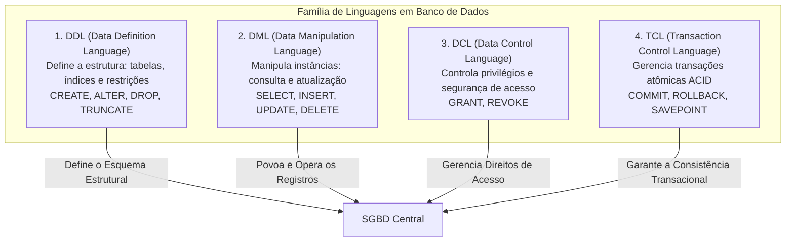
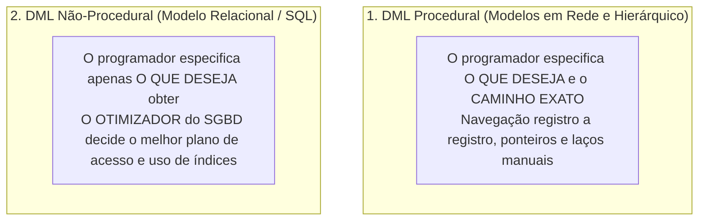
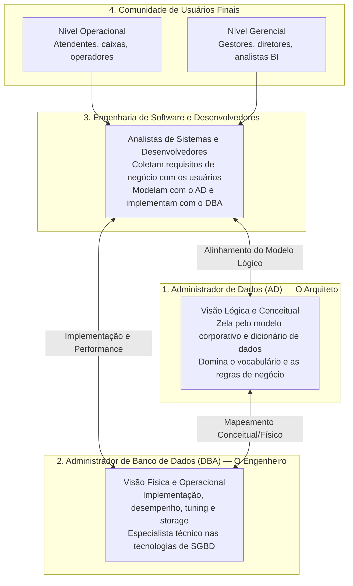

# Linguagens de banco de dados e perfis profissionais: ddl vs. dml e a atuação de ad vs. dba

> **Contexto:** Estudo das categorias de linguagens utilizadas em bancos de dados (com foco na distinção prática entre DDL e DML) e análise detalhada dos papéis profissionais do ecossistema corporativo, diferenciando a atuação estratégica do Administrador de Dados (AD) da atuação técnica e operacional do Administrador de Banco de Dados (DBA).

---

## Introdução

Um Sistema Gerenciador de Banco de Dados (SGBD) não opera de forma isolada: ele depende de **linguagens formais estruturadas** para que desenvolvedores e administradores possam especificar a arquitetura do banco e manipular as informações armazenadas, além de contar com **profissionais especializados** que desempenham diferentes papéis para garantir que os dados atendam aos objetivos do negócio com integridade, segurança e alta performance.

No ecossistema da modelagem de dados e da persistência relacional, duas grandes divisões se destacam:
1. **No âmbito das linguagens:** a separação entre a criação da estrutura de dados (**DDL**) e a manipulação cotidiana dos registros (**DML**);
2. **No âmbito das carreiras e papéis:** a distinção entre a gestão conceitual e estratégica da informação (**AD**) e a administração técnica, física e operacional dos servidores de banco (**DBA**).

Neste artigo, utilizaremos a **Técnica de Feynman** para desmistificar essas categorias, compreender como o otimizador relacional processa consultas não-procedurais e analisar o ecossistema completo de profissionais que viabilizam o ciclo de vida dos dados.

---

## 1. As linguagens de banco de dados: ddl vs. dml

Para interagir com as diferentes camadas da arquitetura de um SGBD, as instruções são categorizadas em subconjuntos funcionais especializados:

### A analogia de Feynman: o palco do teatro e o elenco
* **A DDL (*Data Definition Language*):** É a equipe de engenharia e cenografia que projeta e constrói o palco do teatro, fixa as paredes de alvenaria, instala a fiação elétrica e posiciona os refletores e portas de saída. Essa estrutura física é criada uma única vez e raramente sofre reformas drásticas.
* **A DML (*Data Manipulation Language*):** São os atores que sobem ao palco, contracenam, entram em cena (`INSERT`), trocam de figurino e posição (`UPDATE`), consultam as falas no roteiro (`SELECT`) e saem de cena ao final da peça (`DELETE`). Os atores realizam milhares de movimentos sem alterar as vigas do teatro.

---

## 2. Comparativo aprofundado: DDL vs. DML

A tabela a seguir contrasta os dois núcleos fundamentais de instruções em bancos de dados:

| Critério de comparação | DDL (*Data Definition Language*) | DML (*Data Manipulation Language*) |
| :--- | :--- | :--- |
| **Objetivo central** | Definir, alterar e excluir as estruturas do banco de dados (tabelas, índices, visões, chaves primárias e estrangeiras). | Consultar, incluir, alterar e excluir os dados reais armazenados dentro das tabelas criadas. |
| **Frequência de execução** | **Baixa e estrutural:** executada durante o projeto inicial, implantações (*deploys*) e migrações de versão. | **Altíssima e cotidiana:** executada milhares ou milhões de vezes por segundo pelas aplicações de software. |
| **Público de uso frequente** | Administradores de Banco de Dados (DBA), arquitetos de dados e engenheiros de infraestrutura. | Desenvolvedores de software (back-end, full-stack, mobile), analistas de dados e cientistas de dados. |
| **Impacto no catálogo** | Modifica diretamente o dicionário de dados (metadados do sistema). | Altera apenas o estado/conteúdo das tuplas nos blocos físicos de dados. |
| **Comandos fundamentais** | `CREATE TABLE`, `ALTER TABLE`, `DROP TABLE`, `CREATE INDEX`, `TRUNCATE TABLE`. | `SELECT` (consulta), `INSERT INTO` (inclusão), `UPDATE` (alteração), `DELETE` (exclusão). |

---

## 3. DML procedural vs. DML não-procedural (declarativa)

Uma das maiores revoluções da teoria relacional foi a transição das linguagens de manipulação procedurais para as linguagens puramente declarativas:

### a. DML procedural (*navegacional / baixo nível*)
* **Como funciona:** O desenvolvedor é obrigado a especificar **qual dado quer obter e exatamente o algoritmo de como encontrá-lo**. Era o padrão dos sistemas de banco de dados hierárquicos e em rede dos anos 1960 e 1970.
* **Mecânica:** O código precisava abrir ponteiros de memória, percorrer árvores de ponteiros linha por linha e testar condições manualmente através de laços de repetição.

### b. DML não-procedural (*declarativa / alto nível*)
* **Como funciona:** O desenvolvedor define apenas **o que deseja**, sem especificar o caminho físico de busca. Essa abordagem opera em um nível muito mais alto de abstração.
* **O papel do otimizador de consultas:** O motor do SGBD analisa a instrução SQL, verifica as estatísticas de armazenamento e decide autonomamente qual é o melhor caminho de acesso: se deve realizar uma varredura sequencial na tabela (*table scan*) ou utilizar um índice B-Tree existente. O usuário não precisa controlar os ponteiros físicos do disco (embora possa fornecer dicas explícitas /*+ hints */ quando necessário).
* **Foco da disciplina:** Como o foco do nosso curso é o **modelo relacional**, todas as instruções DML utilizadas na prática são de natureza **não-procedural** (linguagem SQL padronizada).

---

## 4. O ecossistema de profissionais: AD vs. DBA vs. Desenvolvedores

Em ambientes corporativos, a gestão de dados envolve uma cooperação multidisciplinar entre diferentes especialidades técnicas e de negócio:

### O Administrador de Dados (AD) — *O Arquiteto da Informação*
* **Foco:** Perspectiva **lógica, conceitual e de governança** corporativa.
* **Atribuições:**
  * Compreender o vocabulário e a semântica do negócio, definindo o **dicionário de dados corporativo**;
  * Modelar as entidades, atributos e relacionamentos (Diagrama Entidade-Relacionamento);
  * Padronizar nomes de tabelas e campos em toda a empresa, evitando redundâncias conceituais;
  * Garantir a conformidade legal e a privacidade dos dados (LGPD / GDPR).

### O Administrador de Banco de Dados (DBA) — *O Engenheiro de Infraestrutura*
* **Foco:** Perspectiva **física, técnica e operacional** do servidor de banco de dados.
* **Atribuições:**
  * Instalar, configurar e manter os softwares de SGBD (PostgreSQL, Oracle, SQL Server, IBM Db2, MySQL);
  * Criar as estruturas físicas de armazenamento, tabelas, partições e índices (*scripts DDL*);
  * Realizar o ajuste fino de desempenho (*query tuning* e otimização de planos de execução);
  * Planejar e executar rotinas de segurança, backups periódicos e procedimentos de recuperação de desastres (*disaster recovery*);
  * Gerenciar permissões de usuários e alta disponibilidade (replicação e *clustering*).

> **Observação prática de mercado (*Papéis vs. Cargos*):** Em grandes corporações, as funções de AD e DBA costumam ser exercidas por equipes distintas. No entanto, em médias e pequenas empresas ou em times ágeis (DevOps), essas atribuições são **papéis (ou "chapéus")** que podem ser assumidos pelo mesmo profissional de infraestrutura, pelo arquiteto de software ou pelos próprios desenvolvedores sêniores.

### Os analistas de sistemas e desenvolvedores
* **Papel de conexão:** São os profissionais que usufruem do trabalho de ADs e DBAs para construir os sistemas de informação.
* **Fluxo de trabalho integrado:**
  1. Coletam as necessidades de informação junto aos usuários finais;
  2. Trabalham conjuntamente com o **AD** para conceber e refinar o modelo conceitual e lógico de dados;
  3. Trabalham conjuntamente com o **DBA** para criar as tabelas físicas, validar índices e otimizar as consultas DML das aplicações.

### A comunidade de usuários finais
Os usuários finais utilizam os sistemas desenvolvidos e são divididos em dois grandes níveis de atuação:
1. **Nível operacional:** Atendentes, operadores de caixa, balconistas e estoquistas que executam transações cotidianas e repetitivas (inserções e consultas pontuais de pedidos e cadastros);
2. **Nível gerencial e estratégico:** Gestores, diretores e analistas de BI que consomem relatórios consolidados, painéis de indicadores (dashboards) e visões analíticas agregadas para direcionar decisões corporativas.

---

## 5. Síntese comparativa dos perfis profissionais

| Dimensão de análise | Administrador de Dados (AD) | Administrador de Banco de Dados (DBA) |
| :--- | :--- | :--- |
| **Metáfora didática** | O urbanista que planeja o plano diretor da cidade. | O engenheiro de tráfego e saneamento que constrói as vias. |
| **Nível ANSI/SPARC** | Nível Conceitual e Externo. | Nível Interno (Físico). |
| **Foco de preocupação** | *O que* o dado significa e como o negócio se organiza. | *Como* o dado é gravado no hardware com máxima velocidade. |
| **Vínculo principal** | Áreas de negócio, conformidade e governança. | Tecnologia, infraestrutura, sistemas operacionais e hardware. |
| **Ferramentas de trabalho** | Ferramentas CASE de modelagem, catálogos de metadados. | Consoles de SGBD, analisadores de planos de consulta, scripts DDL. |

---

## Referências bibliográficas

### Bibliografia básica
* ELMASRI, Ramez; NAVATHE, Shamkant B. **Sistemas de banco de dados**. 7. ed. São Paulo: Pearson, 2018. (Capítulo 2: *Linguagens e interfaces de bancos de dados*, p. 34-45). ISBN 9788543025001.
* HEUSER, Carlos Alberto. **Projeto de banco de dados**. 6. ed. Porto Alegre: Bookman, 2009. (Capítulo 1 e 2: *Linguagens de bancos de dados e papéis dos usuários*). ISBN 9788577804528.
* SILBERSCHATZ, Abraham; KORTH, Henry F.; SUDARSHAN, S. **Sistema de banco de dados**. 7. ed. Rio de Janeiro: Elsevier, GEN LTC, 2020. (Capítulo 1: *Usuários e administradores de bancos de dados*). ISBN 9788595157477.

### Bibliografia complementar
* DATE, C. J. **Introdução a sistemas de bancos de dados**. 8. ed. Rio de Janeiro: Elsevier, Campus, 2004. ISBN 9788535212730.
* MACHADO, Felipe Nery Rodrigues. **Banco de dados: projeto e implementação**. 4. ed. São Paulo: Érica, 2020. ISBN 9788536533032.

---

## Materiais complementares recomendados

* **Conheça mais sobre as linguagens de banco de dados:** [Introdução à Linguagem SQL - Conceitos Teóricos - DDL, DML, DQL, TCL e DCL](https://www.youtube.com/watch?v=xXf8U9aY_CQ) — Aula teórica detalhada sobre as divisões da linguagem SQL e o papel de cada subconjunto de comandos na gestão de dados.
* **Aprenda mais sobre as responsabilidades de um DBA:** [DBA Roles and Responsibilities](https://www.youtube.com/watch?v=DUwZm7LCVU0) — Visão abrangente sobre a rotina de trabalho, atribuições técnicas e desafios operacionais enfrentados por administradores de banco de dados.

---

## Artigos relacionados e navegação

* **Artigo anterior:** [[03. Níveis de abstração e arquitetura ansi-sparc]]
* **Próximo artigo:** [[05. Níveis do sgbd e as etapas do projeto de banco de dados]]
* **Resumo da disciplina:** [[00. Modelagem de Dados - Resumo]]
* **Glossário da matéria:** [[Glossário de conceitos]]
* **Índice geral do vault:** [[index.md|Página Inicial do Vault]]
