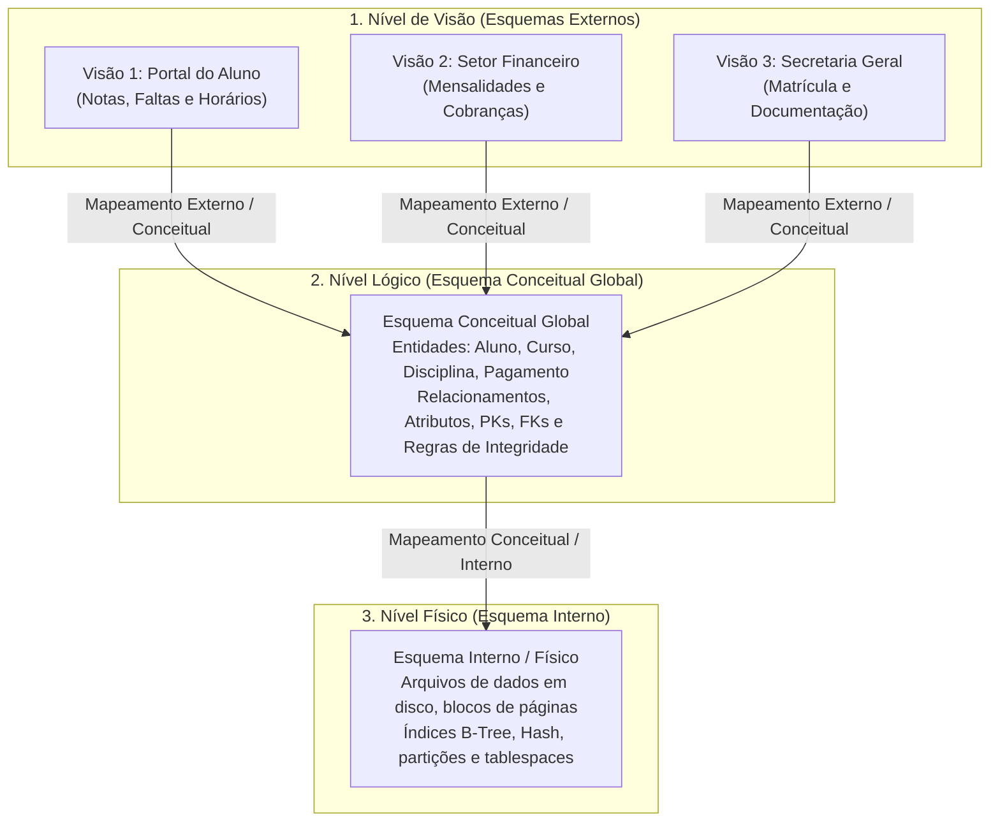
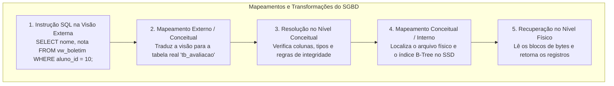
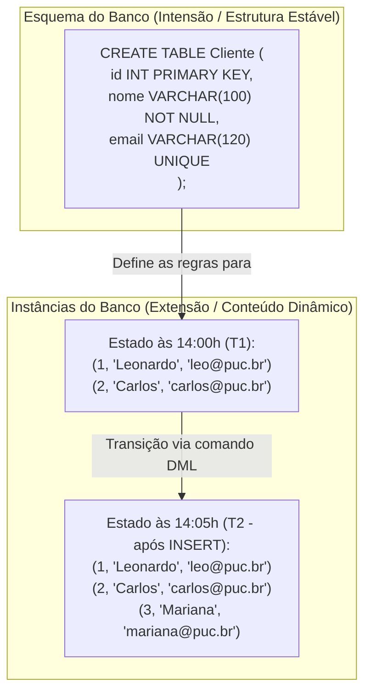
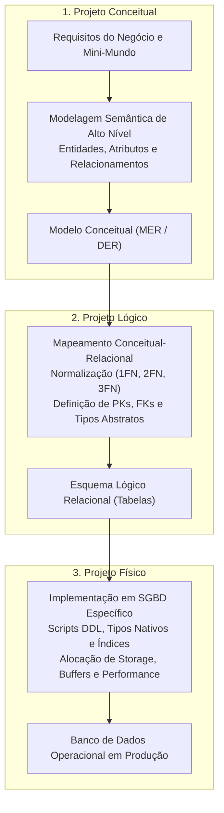

# Níveis do sgbd e etapas do projeto de banco de dados: da visão ao armazenamento físico

> **Contexto:** Estudo aprofundado dos três níveis arquiteturais do SGBD (físico, lógico e de visão) baseados na proposta ANSI/SPARC, consolidação dos princípios de independência lógica e física de dados, e detalhamento completo das três etapas do projeto de banco de dados (conceitual, lógica e física) com seus respectivos participantes.

---

## Introdução

Construir um banco de dados corporativo de alto desempenho não é uma tarefa executada em uma única etapa diretamente no código SQL. Trata-se de um **processo progressivo de engenharia e modelagem**, no qual uma necessidade de negócio do mundo real é gradualmente abstraída, formalizada e implementada em estruturas computacionais seguras e escaláveis.

Para estruturar e proteger esse processo contra acoplamentos excessivos, a Ciência da Computação consolidou dois pilares fundamentais:
1. **Os 3 níveis de abstração do SGBD (Arquitetura ANSI/SPARC):** nível de visão (externo), nível lógico (conceitual) e nível físico (interno), garantindo a **independência lógica e física de dados**;
2. **As 3 etapas do projeto de banco de dados:** o **Projeto Conceitual**, o **Projeto Lógico** e o **Projeto Físico**, delimitando com precisão os papéis, as entradas e as saídas de cada fase.

Neste artigo, utilizaremos a **Técnica de Feynman** para articular esses níveis, dominar as transformações entre esquemas e compreender a esteira completa percorrida pelos profissionais de tecnologia.

---

## 1. As analogias de Feynman: o restaurante e o projeto automotivo

Para compreender os níveis de abstração e as etapas de engenharia sem jargões complexos, analisamos duas metáforas complementares:

### A analogia dos 3 níveis de SGBD: o restaurante de alta gastronomia
* **Nível de visão (*salão / menu do cliente*):** Cada cliente enxerga apenas o cardápio com os pratos e preços que lhe são permitidos pedir. O cliente não vê as receitas de outros pratos nem o estoque físico.
* **Nível lógico (*livro de receitas do chef*):** A ficha técnica oficial contendo todos os ingredientes, proporções e regras de preparo de todos os pratos do restaurante. Independe de qual fornecedor vendeu o insumo ou em qual gaveta ele está guardado.
* **Nível físico (*despensa e freezers subterrâneos*):** A organização dos alimentos em prateleiras etiquetadas, a temperatura dos freezers e os corredores de acesso. Se o restaurante reorganizar a despensa física, o cardápio dos clientes no salão não precisa ser reimpresso.

---

### A analogia das 3 etapas do projeto de BD: o design automotivo
* **1. Projeto conceitual (*o design do veículo*):** O designer esboça a forma aerodinâmica, a quantidade de assentos, a capacidade do porta-malas e o conforto dos passageiros, pensando exclusivamente nas necessidades do motorista (independente de qual fábrica montará o carro).
* **2. Projeto lógico (*a planta técnica de engenharia*):** Os engenheiros mecânicos desenham a planta formal com as medidas exatas de cada peça, o chassi, o sistema de freios e a transmissão padronizada (o modelo relacional de tabelas e conexões).
* **3. Projeto físico (*a linha de montagem da fábrica*):** A fábrica define os robôs de solda, o tipo de liga de aço, o motor a combustão/elétrico e a calibragem de esteiras para produzir o carro com máxima eficiência e segurança.

---

## 2. Os três níveis de abstração do SGBD (ANSI/SPARC)

Proposta pelo comitê ANSI/X3/SPARC em 1975, essa arquitetura tripartite isola as aplicações de usuário das complexidades de baixo nível do hardware:

### 1. Nível de visão (*esquemas externos / views*)
* **Função:** Fornecer janelas customizadas para grupos específicos de usuários e aplicações, simplificando consultas e blindando dados confidenciais (ex.: salários ou senhas).
* **Uso:** Analistas, programadores front-end/mobile e usuários operacionais e gerenciais.

### 2. Nível lógico (*esquema conceitual global*)
* **Função:** Descrever a estrutura lógica completa de todo o banco de dados corporativo. Representa todas as entidades, tipos de dados, chaves primárias (`PK`), chaves estrangeiras (`FK`) e restrições semânticas do negócio.
* **Uso:** Administradores de Dados (AD), arquitetos de software e projetistas de banco.

### 3. Nível físico (*esquema interno*)
* **Função:** Descrever como os dados são empacotados e alocados fisicamente no hardware. Gerencia caminhos de acesso, blocos de páginas no SSD, estruturas de arquivos e índices aceleradores (B-Tree/Hash).
* **Uso:** Administradores de Banco de Dados (DBA) e o motor interno do SGBD.

---

## 3. Os mapeamentos entre níveis e a independência de dados

Para que uma consulta disparada na camada de visão recupere os bytes físicos corretos gravados no disco, o SGBD realiza **mapeamentos automáticos**:

### As duas garantias fundamentais de independência

| Tipo de independência | De onde para onde | O que é alterado | O que permanece protegido | Exemplo prático |
| :--- | :--- | :--- | :--- | :--- |
| **Independência lógica** | Do **nível conceitual** para o **nível externo**. | O esquema lógico global (novas tabelas, novas colunas ou regras). | As visões externas e aplicações existentes que não utilizam esses novos dados. | Adicionar uma nova tabela `tb_teleconsulta` no hospital sem precisar alterar o módulo de recepção tradicional. |
| **Independência física** | Do **nível físico** para o **nível conceitual**. | As estruturas internas (troca de HDD por SSD, criação de índices B-Tree, particionamento). | O esquema lógico e todos os comandos SQL das aplicações. | O DBA cria um índice B-Tree na coluna `cpf`; as consultas continuam idênticas, porém executam mais rápido. |

---

## 4. Esquema vs. instância do banco de dados

Uma distinção terminológica clássica estabelecida pela teoria relacional é a separação entre a estrutura do banco e seus dados dinâmicos:

* **Esquema (*intensão / schema*):** A definição estrutural formal do banco (tabelas, colunas, restrições). É criado via DDL e raramente sofre alterações ao longo da vida útil do software.
* **Instância (*extensão / estado / instance*):** O conjunto real de dados armazenados nas tabelas em um instante específico no tempo. É manipulado via DML e muda constantemente a cada transação executada.

---

## 5. As três etapas do projeto de banco de dados

O ciclo de vida do desenvolvimento de dados articula-se em três etapas progressivas e interdependentes:

---

## 6. Participantes e artefatos de cada etapa

A colaboração multidisciplinar é a chave para o sucesso de cada fase do projeto:

| Etapa do projeto | Foco e artefato principal | Dependência tecnológica | Principais participantes |
| :--- | :--- | :--- | :--- |
| **1. Projeto Conceitual** | **Artefato:** Diagrama Entidade-Relacionamento (DER/MER). **Foco:** Compreender a semântica do mini-mundo e registrar regras de negócio. | **Independência total:** não depende de tecnologia nem de software SGBD. | - Usuários de negócio e clientes. - Analistas de Sistemas. - Administrador de Dados (AD). |
| **2. Projeto Lógico** | **Artefato:** Esquema Relacional de Tabelas. **Foco:** Transformar o DER em tabelas normalizadas (1FN, 2FN, 3FN) com PKs e FKs. | **Independente de SGBD**, mas vinculado ao paradigma Relacional. | - Projetistas de Banco de Dados. - Arquitetos de Software. - Desenvolvedores Back-End. |
| **3. Projeto Físico** | **Artefato:** Scripts DDL executáveis e banco em produção. **Foco:** Criar tabelas nativas, dimensionar índices B-Tree, storage e tuning. | **Dependência total:** vinculado ao SGBD específico (PostgreSQL, Oracle, SQL Server) e hardware. | - Administrador de Banco de Dados (DBA). - Engenheiros de Infraestrutura e DevOps. |

---

## Referências bibliográficas

### Bibliografia básica
* HEUSER, Carlos Alberto. **Projeto de banco de dados**. 6. ed. Porto Alegre: Bookman, 2009. (Capítulo 1: *Conceitos gerais e níveis de arquitetura*; Capítulo 2: *O modelo entidade-relacionamento* e Capítulo 3: *O projeto lógico*). ISBN 9788577804528.
* ELMASRI, Ramez; NAVATHE, Shamkant B. **Sistemas de banco de dados**. 7. ed. São Paulo: Pearson, 2018. (Capítulo 2: *Conceitos e arquitetura dos sistemas de banco de dados*, p. 29-58; Capítulo 3: *Modelagem de dados conceitual*). ISBN 9788543025001.
* SILBERSCHATZ, Abraham; KORTH, Henry F.; SUDARSHAN, S. **Sistema de banco de dados**. 7. ed. Rio de Janeiro: Elsevier, GEN LTC, 2020. (Capítulo 1 e 2: *Visão geral da arquitetura e projeto de dados*). ISBN 9788595157477.

### Bibliografia complementar
* DATE, C. J. **Introdução a sistemas de bancos de dados**. 8. ed. Rio de Janeiro: Elsevier, Campus, 2004. (Capítulo 2: *Arquitetura de sistemas de banco de dados*). ISBN 9788535212730.
* ANSI/X3/SPARC. **Study group on data base management systems: interim report 75-02-08**. FDT Bulletin of ACM SIGMOD, v. 7, n. 2, p. 1-140, 1975.
* MACHADO, Felipe Nery Rodrigues. **Banco de dados: projeto e implementação**. 4. ed. São Paulo: Érica, 2020. ISBN 9788536533032.

---

## Artigos relacionados e navegação

* **Artigo anterior:** [[03. Linguagens de banco de dados (ddl e dml) e perfis profissionais]]
* **Próximo artigo:** [[05. Modelagem conceitual e o modelo entidade-relacionamento (mer)]]
* **Resumo da disciplina:** [[00. Modelagem de Dados - Resumo]]
* **Glossário da matéria:** [[Glossário de conceitos]]
* **Índice geral do vault:** [[index.md|Página Inicial do Vault]]
