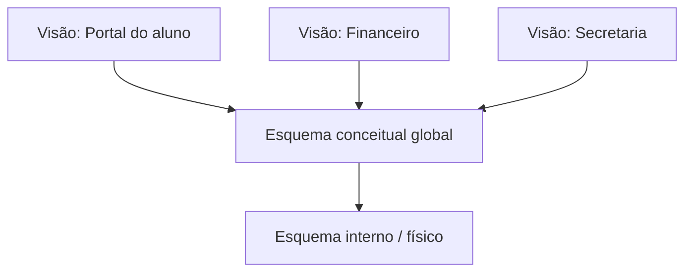

# Níveis do sgbd e etapas do projeto de banco de dados: da visão ao armazenamento físico

> **Contexto:** Estudo aprofundado dos três níveis arquiteturais do SGBD (físico, lógico e de visão) baseados na proposta ANSI/SPARC, consolidação dos princípios de independência lógica e física de dados, e detalhamento completo das etapas do projeto de banco de dados (levantamento de requisitos, projeto conceitual, lógico e físico) com seus respectivos participantes.

---

## Abstração e projeto de banco de dados

Construir um banco de dados corporativo de alto desempenho não é uma tarefa executada em uma única etapa diretamente no código SQL. Trata-se de um **processo progressivo de engenharia e modelagem**, no qual uma necessidade de negócio do mundo real é gradualmente abstraída, formalizada e implementada em estruturas computacionais seguras e escaláveis.

Para estruturar e proteger esse processo contra acoplamentos excessivos, a Ciência da Computação consolidou dois pilares fundamentais: 1. **Os 3 níveis de abstração do SGBD (Arquitetura ANSI/SPARC):** nível de visão (externo), nível lógico (conceitual) e nível físico (interno), garantindo a **independência lógica e física de dados**; 2. **As etapas do projeto de banco de dados:** o **Levantamento de Requisitos**, o **Projeto Conceitual**, o **Projeto Lógico** e o **Projeto Físico**, delimitando com precisão os papéis, as entradas e as saídas de cada fase. Neste artigo, utilizaremos a **Técnica de Feynman** para articular esses níveis, dominar as transformações entre esquemas e compreender a esteira completa percorrida pelos profissionais de tecnologia.

---

**Restaurante e projeto automotivo como analogias.**

Para compreender os níveis de abstração e as etapas de engenharia sem jargões complexos, analisamos duas metáforas complementares:

**A analogia dos 3 níveis de SGBD: o restaurante de alta gastronomia.**
* **Nível de visão (*salão / menu do cliente*):** Cada cliente enxerga apenas o cardápio com os pratos e preços que lhe são permitidos pedir. Os clientes normalmente só precisam de uma fração do banco de dados (depende do que realmente importa para a função de cada um).
* **Nível lógico (*livro de receitas do chef*):** A ficha técnica oficial contendo todos os ingredientes, proporções e regras de preparo de todos os pratos do restaurante. É o principal campo de atuação do **Administrador de Dados (AD)**, definindo quais dados estão armazenados para a organização inteira.
* **Nível físico (*despensa e freezers subterrâneos*):** A organização concreta dos alimentos no servidor local ou na nuvem, tratando de prateleiras, espaço em disco e temperatura dos freezers. É o principal campo de atuação do **Administrador de Banco de Dados (DBA)**.

| Nível | Foco | Exemplo da analogia |
| :--- | :--- | :--- |
| Externo | Visões específicas para usuários e aplicações | Menu disponível ao cliente |
| Conceitual | Estrutura lógica global do banco | Livro de receitas e regras do restaurante |
| Interno | Organização física e acesso aos dados | Despensa e infraestrutura física |

---

**A analogia das etapas do projeto de BD: o design automotivo.**
* **1. Levantamento de requisitos e projeto conceitual (*o design do veículo*):** O designer e a equipe de produto conversam com motoristas, passageiros e gestores para entender necessidades de conforto, capacidade de carga e aerodinâmica, produzindo o esboço semântico da solução.
* **2. Projeto lógico (*a planta técnica de engenharia*):** Os engenheiros mecânicos desenham a planta formal com as medidas exatas de cada peça, o chassi, o sistema de freios e a transmissão padronizada, escolhendo a categoria de propulsão (o modelo relacional de tabelas e conexões).
* **3. Projeto físico (*a linha de montagem da fábrica*):** A fábrica define os robôs de solda, o tipo de liga de aço, a alocação de espaço e a calibragem de esteiras para produzir o carro com máxima eficiência e segurança no chão de fábrica.

---

## Níveis externo, conceitual e interno do SGBD

Proposta pelo comitê ANSI/X3/SPARC em 1975, essa arquitetura tripartite divide o sistema em três níveis de abstração para facilitar o entendimento do funcionamento do SGBD e desacoplar o usuário do hardware:

**Nível externo / visão (*esquemas externos*).**
* **Público:** Próximo dos usuários finais das aplicações e dos programadores de interface.
* **Função:** Apresenta a visão de cada usuário (ou grupo de usuários). Como os usuários normalmente só precisam de uma parte específica da base, o nível externo filtra e disponibiliza apenas os dados que realmente importam para aquele perfil de negócio, ocultando informações irrelevantes ou sensíveis.

**Nível conceitual / lógico (*esquema conceitual global*).**
* **Público:** Principal nível de atuação do **Administrador de Dados (AD)** e dos arquitetos de software.
* **Função:** Descreve **quais dados estão armazenados** em toda a organização e quais os relacionamentos lógicos existentes entre eles, de forma unificada e independente de detalhes de hardware.

**Nível interno / físico (*esquema interno*).**
* **Público:** Nível concreto no servidor local ou na nuvem, sendo o principal foco de atuação do **Administrador de Banco de Dados (DBA)**.
* **Função:** Gerencia como os dados estão fisicamente gravados, controlando alocação de espaço em disco, arquivos de dados, estruturas de diretórios e criação de índices para otimização de performance.

---

## Mapeamentos e independência lógica e física

A independência de dados é a garantia de que modificações realizadas em um nível inferior não provocam quebras nos níveis superiores:

| Tipo de independência | O que pode mudar | O que se busca preservar |
| :--- | :--- | :--- |
| Lógica | Estrutura conceitual do banco | Visões e aplicações que não dependem da mudança |
| Física | Organização interna, índices e armazenamento | Esquema conceitual e consultas da aplicação |

**Independência física de dados.**
* **Onde ocorre:** Entre o **nível físico** e o **nível conceitual**.
* **Regra:** Alterações no nível físico **não devem impactar o nível conceitual e muito menos o nível externo**.
* **Exemplos práticos de aula:**
  1. **Migração de versão do SGBD:** A equipe atualiza o PostgreSQL da versão 15 para a 16 ou migra o banco para um servidor em nuvem; o modelo conceitual e o código das aplicações continuam intactos.
  2. **Criação de índices para performance:** O DBA cria um novo índice B-Tree em uma coluna de busca frequente para acelerar relatórios; as instruções SQL das aplicações permanecem idênticas, apenas executando de forma mais rápida.

**Independência lógica de dados.**
* **Onde ocorre:** Entre o **nível conceitual** e o **nível externo (visão)**.
* **Regra:** Alterações no nível conceitual **não devem impactar o nível externo/visual** das aplicações já existentes.
* **Exemplo prático de aula:**
  * **Adição de novos campos solicitados por um departamento:** O setor de RH solicita a inclusão do campo `telefone_emergencia` na tabela de funcionários. Essa modificação conceitual não impacta nem quebra as telas e visões dos usuários de outros setores (como o módulo de vendas ou expedição), que continuam operando normalmente.

---

## Esquema e instância do banco de dados

Uma distinção terminológica clássica estabelecida pela teoria relacional é a separação entre a estrutura do banco e seus dados dinâmicos:

| Conceito | Significado | Exemplo |
| :--- | :--- | :--- |
| Esquema | Estrutura definida para o banco | Definição de tabela, tipos e restrições |
| Instância | Estado dos dados em um momento | Linhas existentes antes e depois de um `INSERT` |

* **Esquema (*intensão / schema*):** A definição estrutural formal do banco (tabelas, colunas, restrições). É criado via DDL e raramente sofre alterações ao longo da vida útil do software.
* **Instância (*extensão / estado / instance*):** O conjunto real de dados armazenados nas tabelas em um instante específico no tempo. É manipulado via DML e muda constantemente a cada transação executada.

---

## Requisitos, projeto conceitual, lógico e físico

O desenvolvimento de um banco de dados profissional percorre quatro etapas sequenciais bem articuladas:

---

**Participantes e artefatos de cada etapa.**

A colaboração multidisciplinar é a chave para o sucesso de cada fase do projeto:

| Etapa do projeto | Foco e artefato principal | Dependência tecnológica | Principais participantes |
| :--- | :--- | :--- | :--- |
| **1. Levantamento de Requisitos** | **Artefato:** Documento de requisitos de dados. **Foco:** Mapear as diferentes necessidades de informação de usuários operacionais, gestores e analistas. | **Zero:** independente de tecnologia. | - Usuários finais (operacionais e gerenciais). - Gestores de negócio. - Analistas de Sistemas. |
| **2. Projeto Conceitual** | **Artefato:** Diagrama Entidade-Relacionamento (DER/MER). **Foco:** Definir que tipo de informação precisa existir na base, com semântica de alto nível. | **Zero:** independente de software de SGBD. | - Administrador de Dados (AD). - Engenheiros de Software. - Analistas de Sistemas. |
| **3. Projeto Lógico** | **Artefato:** Esquema Relacional de Tabelas. **Foco:** Transformar o DER em tabelas estruturadas, escolher a categoria do SGBD e aplicar normalização (1FN, 2FN, 3FN). | **Independente de SGBD específico**, mas vinculado à categoria/paradigma (Relacional). | - Projetistas de Banco de Dados. - Administrador de Dados (AD) / DBA. - Arquitetos e Desenvolvedores. |
| **4. Projeto Físico** | **Artefato:** Scripts DDL executáveis e banco operacional. **Foco:** Definir como os dados serão fisicamente armazenados no servidor ou na nuvem, criando índices e dimensionando storage. | **Dependência total:** vinculado ao SGBD específico (PostgreSQL, Oracle, SQL Server) e infraestrutura. | - Administrador de Banco de Dados (DBA). - Engenheiros de Infraestrutura e DevOps. |

---

## Referências bibliográficas

### Bibliografia básica
* HEUSER, Carlos Alberto. **Projeto de banco de dados**. 6. ed. Porto Alegre: Bookman, 2009. (Capítulo 1: *Conceitos gerais e níveis de arquitetura*; Capítulo 2: *O modelo entidade-relacionamento* e Capítulo 3: *O projeto lógico*). ISBN 9788577804528.
* ELMASRI, Ramez; NAVATHE, Shamkant B. **Sistemas de banco de dados**. 7. ed. São Paulo: Pearson, 2018. (Para entender melhor a importância da tecnologia de BD, sugere-se a leitura dos Capítulos 1, 2 e 3 deste livro digital disponível na biblioteca da PUC Minas). ISBN 9788543025001.
* SILBERSCHATZ, Abraham; KORTH, Henry F.; SUDARSHAN, S. **Sistema de banco de dados**. 7. ed. Rio de Janeiro: Elsevier, GEN LTC, 2020. (Capítulo 1 e 2: *Visão geral da arquitetura e projeto de dados*). ISBN 9788595157477.

### Bibliografia complementar
* DATE, C. J. **Introdução a sistemas de bancos de dados**. 8. ed. Rio de Janeiro: Elsevier, Campus, 2004. (Capítulo 2: *Arquitetura de sistemas de banco de dados*). ISBN 9788535212730.
* ANSI/X3/SPARC. **Study group on data base management systems: interim report 75-02-08**. FDT Bulletin of ACM SIGMOD, v. 7, n. 2, p. 1-140, 1975.
* MACHADO, Felipe Nery Rodrigues. **Banco de dados: projeto e implementação**. 4. ed. São Paulo: Érica, 2020. ISBN 9788536533032.
* [What is Database & SQL?](https://www.youtube.com/watch?v=FR4QIeZaPeM) — Vídeo introdutório sobre conceitos fundamentais de banco de dados e linguagem SQL.
* [Modelo de Entidade-Relacionamento](https://www.youtube.com/watch?v=_y31cFi_ByY) — Videoaula sobre os conceitos do modelo entidade-relacionamento (MER/DER).
* [Modelo E-R Estendido](https://www.youtube.com/watch?v=JFw0D8zZBVs) — Videoaula sobre o modelo entidade-relacionamento estendido (EER).

---

## Materiais complementares recomendados

* **Conheça mais sobre as etapas do projeto de banco de dados:** [Etapas de um projeto de BD](https://www.youtube.com/watch?v=dm5S1hTgc5s) — Vídeo didático detalhando a passagem do levantamento de requisitos para o projeto conceitual, lógico e físico.
* **What is Database & SQL?:** [What is Database & SQL?](https://www.youtube.com/watch?v=FR4QIeZaPeM) — Visão geral introdutória sobre conceitos de banco de dados e comandos SQL.
* **Modelo de Entidade-Relacionamento:** [Modelo de Entidade-Relacionamento](https://www.youtube.com/watch?v=_y31cFi_ByY) — Videoaula didática sobre entidades, atributos e relacionamentos.
* **Modelo E-R Estendido:** [Modelo E-R Estendido](https://www.youtube.com/watch?v=JFw0D8zZBVs) — Videoaula detalhando as extensões conceituais, especialização e generalização.

---

## Artigos relacionados

* **Artigo anterior:** [[03. Linguagens de banco de dados (ddl e dml) e perfis profissionais]]
* **Próximo artigo:** [[05. Modelagem de entidades e tipos de atributos]]
* **Resumo da disciplina:** [[00. Modelagem de Dados - Resumo]]
* **Glossário da matéria:** [[Glossário de conceitos]]
* **Índice geral do vault:** [[index.md|Página Inicial do Vault]]
