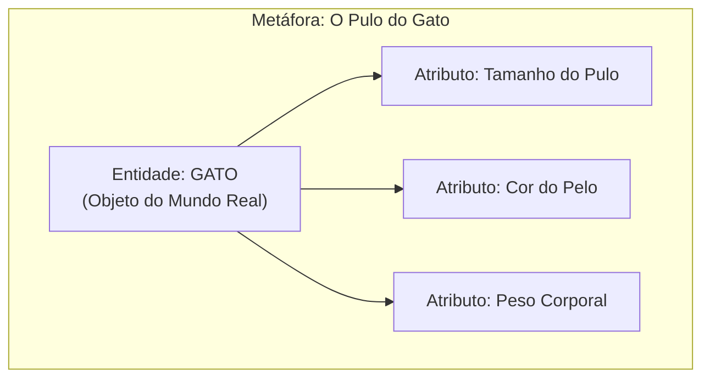
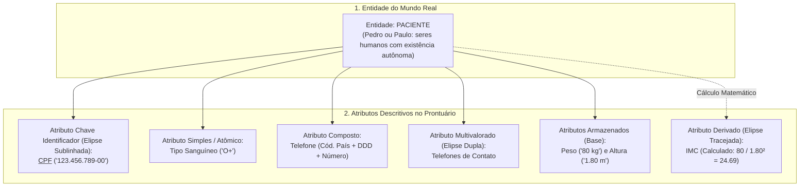
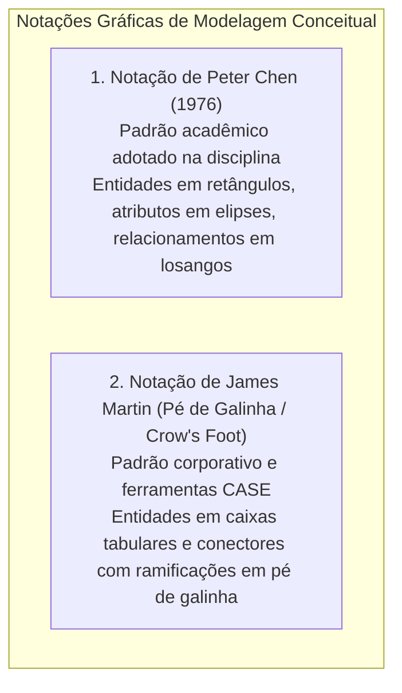
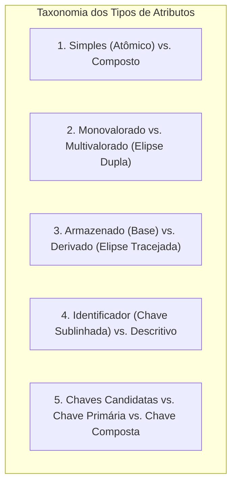
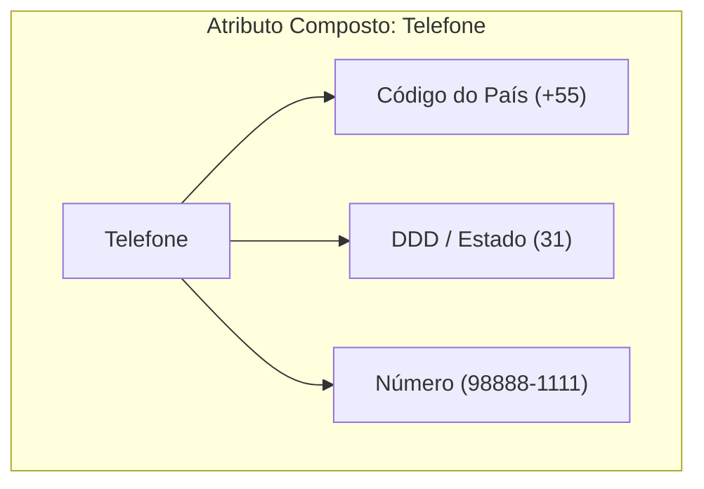
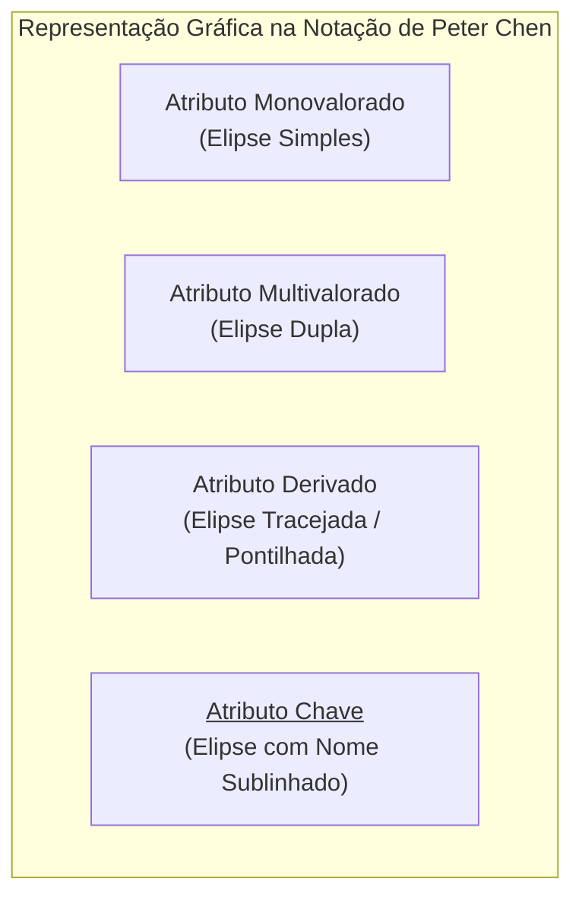
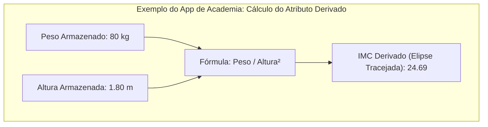

# Modelagem de entidades e tipos de atributos: a anatomia conceitual dos dados

> **Contexto:** Introdução à modelagem conceitual de dados no paradigma relacional, explorando sua perspectiva histórica desde os anos 60 até Peter Chen (1976), a diferenciação formal entre entidades e instâncias, e a taxonomia exaustiva de atributos (simples, compostos, monovalorados, multivalorados, derivados, chaves candidatas e compostas).

---

## Introdução

A modelagem de dados é uma **coleção de ferramentas conceituais e visuais** destinada a descrever os dados, suas relações semânticas, seus relacionamentos e suas restrições de consistência. Trata-se de um método estruturado de análise no qual engenheiros de software e administradores de dados conduzem reuniões e entrevistas com os usuários de negócio para capturar regras organizacionais e traduzi-las em estruturas lógicas sólidas.

Os primeiros modelos conceituais surgiram na década de 1960. Embora existam modelos pós-relacionais, orientados a objetos, em grafos e documentais (NoSQL), o foco central da disciplina é a **modelagem voltada para bancos de dados relacionais**.

A notação gráfica adotada como padrão acadêmico neste curso é a notação clássica de **Peter Chen (1976)**. No mercado corporativo, existem outras notações amplamente difundidas, como a notação de **James Martin (*Engenharia de Informação / Pé de Galinha - Crow's Foot*)**, IDEF1X e a modelagem de classes UML.

Neste artigo, utilizaremos a **Técnica de Feynman** para compreender o papel do Modelo Entidade-Relacionamento (MER), distinguir entidades de suas instâncias e dissecar todos os tipos de atributos que compõem o Diagrama Entidade-Relacionamento (DER).

---

## 1. A analogia de Feynman: o gato e o prontuário

Para memorizar a distinção fundamental entre entidades e atributos sem esforço, utilizamos duas metáforas intuitivas:

### A metáfora do "pulo do gato"
* **A entidade (*o gato*):** É o ser ou objeto concreto do mundo real.
* **Os atributos (*o tamanho do pulo, a cor do pelo, a raça, o peso*):** São as propriedades que medem, qualificam e descrevem as características daquele gato específico.

---

### A analogia hospitalar: o paciente e o prontuário
No contexto corporativo de um hospital:

---

## 2. O Modelo Entidade-Relacionamento (MER) e o DER

O **Modelo Entidade-Relacionamento (MER)** é um modelo conceitual de alta capacidade semântica, focado exclusivamente nos dados que precisam ser armazenados no sistema. 

A partir do MER, produz-se o **Diagrama Entidade-Relacionamento (DER)**, um artefato gráfico e visual que pode ser facilmente apresentado e validado diretamente com os usuários finais e tomadores de decisão da empresa antes de qualquer linha de código SQL ser escrita.

---

## 3. Conceito formal: entidade vs. instância

* **Entidade (*tipo de entidade*):** Representa um conjunto de objetos, pessoas, conceitos ou eventos do mundo real que compartilham os mesmos atributos. No modelo de Peter Chen, é representada graficamente por um **retângulo**.
  * *Exemplos concretos:* `Cliente`, `Funcionario`, `Medicamento`.
  * *Exemplos conceituais/abstratos:* `Nota Fiscal`, `Historico Escolar`, `Extrato Bancario`, `Venda`.
* **Instância (*ocorrência / registro*):** É uma entidade específica e individualizada dentro do conjunto.
  * *Exemplo:* "Pedro" e "Paulo" são duas **instâncias** distintas do tipo de entidade `Cliente`.

### Conexão direta com Programação Orientada a Objetos (POO)
* O **Tipo de Entidade** no banco de dados corresponde a uma **Classe** no código C# ou Java (`public class Cliente { ... }`).
* A **Instância** no banco de dados corresponde a um **Objeto** instanciado em memória (`Cliente pedro = new Cliente("Pedro");`).

---

## 4. Taxonomia detalhada dos tipos de atributos

Os atributos são as propriedades que qualificam as entidades e são classificados de acordo com sua estrutura, cardinalidade e forma de obtenção:

---

### 1. Atributos simples (atômicos) vs. atributos compostos

* **Atributo simples (*atômico / indivisível*):** Não pode ser dividido em partes menores sem perder sua semântica fundamental.
  * *Exemplos de aula:* `preco`, `cpf`, `tipo_sanguineo`, `salario`.
* **Atributo composto:** Pode ser decomposto em subatributos menores e independentes, permitindo consultas ao todo ou a partes específicas.
  * *Exemplo 1 (Telefone decomposto):* O atributo `telefone` dividido em `codigo_pais` (+55), `codigo_estado_ddd` (31) e `numero_telefone` (98888-1111).
  * *Exemplo 2 (Endereço):* O atributo `endereco` dividido em `logradouro`, `numero`, `bairro`, `cidade`, `estado` e `cep`.

---

### 2. Atributos monovalorados vs. multivalorados

* **Atributo monovalorado (*univalorado*):** Possui um único valor associado para cada ocorrência da entidade.
  * *Notação de Chen:* Representado por uma **elipse simples**.
  * *Exemplos:* `cpf`, `data_nascimento`, `peso`.
* **Atributo multivalorado:** Pode conter um conjunto de valores (zero, um ou vários) para a mesma ocorrência da entidade.
  * *Notação de Chen:* Representado visualmente por uma **elipse dupla** (dois contornos circulares).
  * *Exemplos:* `telefones` (o cliente possui telefone residencial, celular pessoal e comercial), `habilidades_tecnicas`, `medicamentos_alergicos`.

---

### 3. Atributos armazenados (base) vs. atributos derivados (calculados)

* **Atributo armazenado (*base*):** O dado é gravado fisicamente nas tabelas do banco de dados, pois não pode ser deduzido matematicamente a partir de outros registros.
  * *Exemplos:* `data_nascimento`, `peso`, `altura`, `preco_unitario`.
* **Atributo derivado (*calculado / deduzido*):** O valor não precisa ser gravado permanentemente no disco, pois é calculado dinamicamente pelo sistema a partir de outros atributos armazenados ou de funções do sistema.
  * *Notação de Chen:* Representado por uma **elipse pontilhada / tracejada**.
  * *Exemplo 1 (App de academia):* O atributo `imc` (Índice de Massa Corporal) é calculado instantaneamente pela fórmula:
    $$\text{IMC} = \frac{\text{peso}}{\text{altura}^2}$$
  * *Exemplo 2:* O atributo `idade` calculado a partir da `data_nascimento` e da data atual do sistema (`CURRENT_DATE`).
  * *Exemplo 3:* O `valor_total_pedido` calculado pela soma das linhas de itens (`quantidade` $\times$ `preco_unitario`).

---

### 4. Atributos chave, chaves candidatas e chaves compostas

* **Atributo chave (*identificador*):** É o atributo cujos valores são **únicos e exclusivos** para cada ocorrência da entidade, garantindo que nenhuma duplicata exista no banco.
  * *Notação de Chen:* Representado por uma **elipse com o nome sublinhado / grifado** (ex.: <u>`cpf`</u> ou <u>`numero_matricula`</u>).
* **Chaves candidatas:** Ocorrem quando uma entidade possui **mais de um atributo com capacidade de identificação exclusiva**. Cabe ao projetista de banco de dados escolher a melhor opção para ser a **Chave Primária (*Primary Key - PK*)**, deixando as demais como chaves alternativas/únicas (`UNIQUE`).
  * *Exemplo de entidade `Funcionario`:* `cpf`, `email` e `numero_matricula` são todas chaves candidatas; a empresa pode eleger `numero_matricula` como chave primária oficial.
* **Chave composta:** Ocorre quando um único atributo não é suficiente para garantir a unicidade, exigindo a **combinação de dois ou mais atributos** para individualizar a entidade.
  * *Exemplo 1 de aula:* Localização em almoxarifado definida pela junção de `numero_chave` + `numero_prateleira`.
  * *Exemplo 2:* Passagem aérea identificada por `numero_voo` + `data_partida` + `numero_assento`.

---

## 5. Matriz comparativa de atributos no modelo de Chen

| Tipo de atributo | Notação visual no DER de Chen | Exemplo prático de aula | Comportamento no SGBD Relacional |
| :--- | :--- | :--- | :--- |
| **Simples (Atômico)** | Elipse simples sólida. | `preco`, `cpf`, `tipo_sanguineo`. | Coluna nativa única (`DECIMAL`, `VARCHAR`). |
| **Composto** | Elipse conectada a subelipses. | `telefone` (país + DDD + número). | Desmembrado em colunas separadas na mesma tabela. |
| **Monovalorado** | Elipse simples sólida. | `data_nascimento`, `peso`. | Uma célula com valor único. |
| **Multivalorado** | **Elipse dupla**. | `telefones_contato`, `habilidades`. | Convertido em **tabela relacional associada** com `FK` (1FN). |
| **Derivado** | **Elipse tracejada / pontilhada**. | `imc` (peso/altura²), `idade`. | Calculado dinamicamente via `SELECT`, `VIEW` ou `GENERATED AS`. |
| **Chave Identificadora** | **Elipse com texto sublinhado**. | <u>`cpf`</u>, <u>`codigo_matricula`</u>. | Chave primária (`PRIMARY KEY`) com índice exclusivo. |
| **Chave Composta** | Múltiplas elipses sublinhadas. | <u>`numero_chave`</u> + <u>`prateleira`</u>. | `PRIMARY KEY (numero_chave, prateleira)`. |

---

## Referências bibliográficas

### Bibliografia básica
* HEUSER, Carlos Alberto. **Projeto de banco de dados**. 6. ed. Porto Alegre: Bookman, 2009. (Capítulo 2: *O modelo entidade-relacionamento*, p. 19-48). ISBN 9788577804528.
* ELMASRI, Ramez; NAVATHE, Shamkant B. **Sistemas de banco de dados**. 7. ed. São Paulo: Pearson, 2018. (Capítulo 3: *Modelagem de dados usando o modelo entidade-relacionamento*, p. 59-90). ISBN 9788543025001.
* SILBERSCHATZ, Abraham; KORTH, Henry F.; SUDARSHAN, S. **Sistema de banco de dados**. 7. ed. Rio de Janeiro: Elsevier, GEN LTC, 2020. (Capítulo 6: *Projeto de banco de dados usando o modelo E-R*). ISBN 9788595157477.

### Bibliografia complementar
* CHEN, Peter Pin-Shan. **The entity-relationship model: toward a unified view of data**. ACM Transactions on Database Systems (TODS), v. 1, n. 1, p. 9-36, 1976.
* MARTIN, James. **Information engineering, book II: planning and analysis**. Englewood Cliffs: Prentice Hall, 1990.
* DATE, C. J. **Introdução a sistemas de bancos de dados**. 8. ed. Rio de Janeiro: Elsevier, Campus, 2004. ISBN 9788535212730.

---

## Materiais complementares recomendados

* **Conheça mais sobre a modelagem de banco de dados com ferramentas de mercado:** [Diagrama Entidade Relacionamento](https://www.youtube.com/watch?v=XCkd27GtZoM) — Apresentação prática sobre a elaboração e estruturação de DERs em projetos reais.
* **Explore os recursos visuais de modelagem DER na ferramenta gratuita:** [Draw.io](http://www.draw.io/) — Software online e gratuito para criação de diagramas conceituais na notação de Peter Chen e Pé de Galinha.
* **Aprenda sobre a Notação Pé de Galinha de James Martin:** [Wikipedia: Crow's foot notation](https://en.wikipedia.org/wiki/Crow%27s_foot_notation) — Panorama comparativo da notação corporativa de James Martin utilizada na Engenharia de Informação.

---

## Artigos relacionados e navegação

* **Artigo anterior:** [[04. Níveis do sgbd e etapas do projeto de banco de dados]]
* **Próximo artigo:** [[06. Relacionamentos, cardinalidade e restrições estruturais no mer]]
* **Resumo da disciplina:** [[00. Modelagem de Dados - Resumo]]
* **Glossário da matéria:** [[Glossário de conceitos]]
* **Índice geral do vault:** [[index.md|Página Inicial do Vault]]
