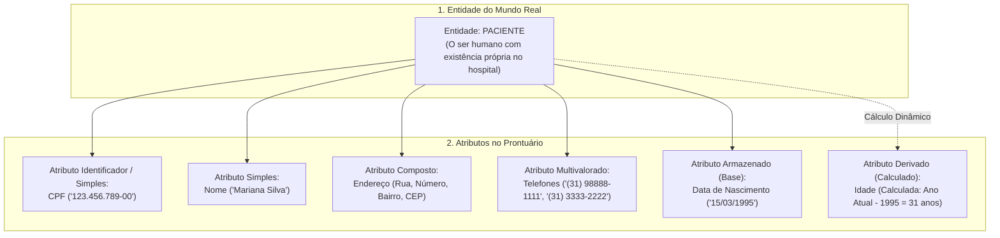
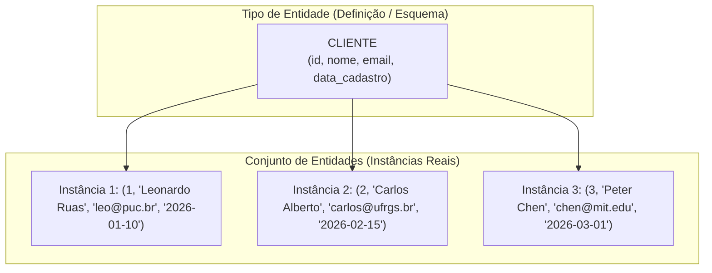
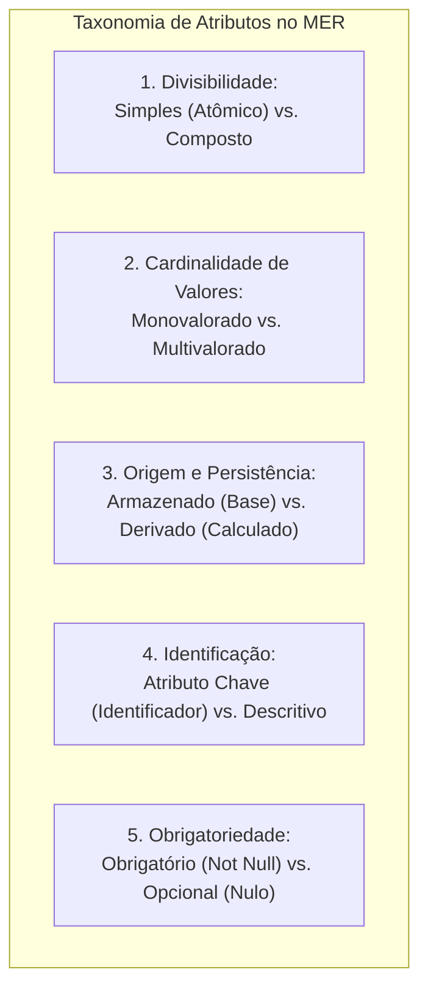
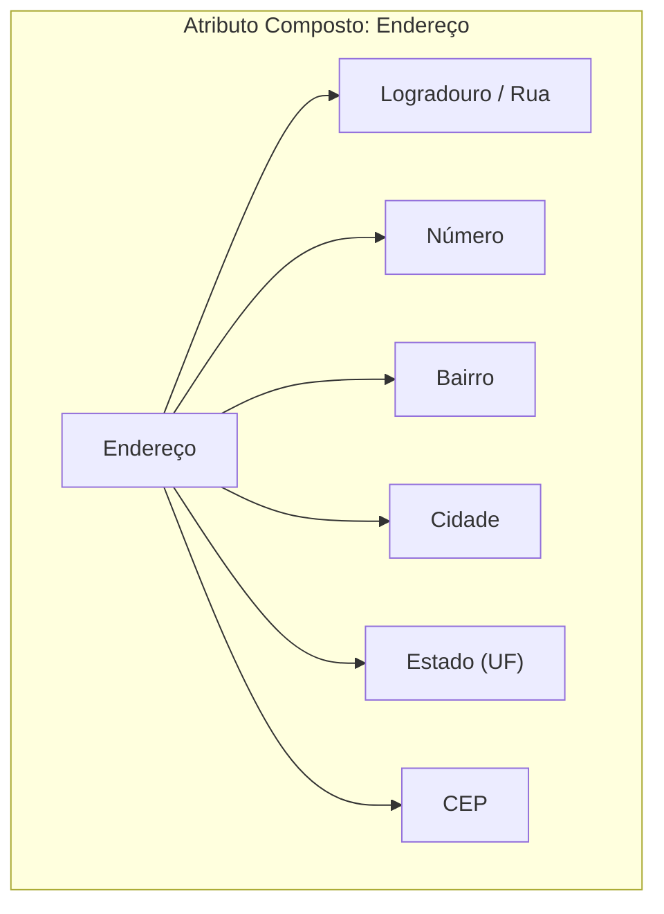
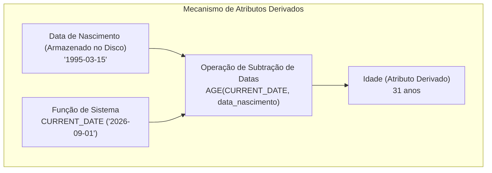
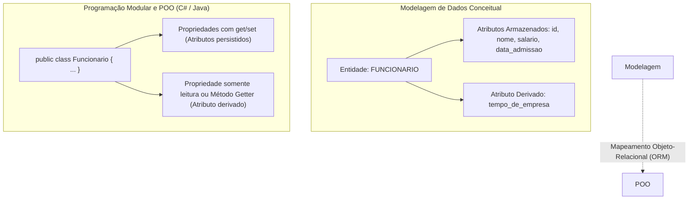

# Modelagem de entidades e tipos de atributos: a anatomia conceitual dos dados

> **Contexto:** Introdução à modelagem conceitual de dados no paradigma relacional, explorando sua evolução histórica desde Peter Chen (1976), a diferenciação fundamental entre entidades e instâncias, e a taxonomia exaustiva de tipos de atributos (simples, compostos, monovalorados, multivalorados, derivados, identificadores e nulos).

---

## Introdução

Na construção de qualquer sistema de software duradouro, a etapa mais crítica não é escrever comandos SQL ou criar tabelas no SGBD, mas sim **compreender e modelar fielmente a realidade do negócio**. Uma modelagem conceitual deficiente gera bancos de dados frágeis, propensos a redundâncias, inconsistências e manutenções caras.

Para transpor os elementos do mundo real (*mini-mundo*) para o universo computacional, a modelagem conceitual fundamenta-se no **Modelo Entidade-Relacionamento (MER)**, proposto por Peter Chen em 1976. O núcleo dessa representação reside em dois blocos de construção elementares:
1. **As entidades:** os objetos, seres, lugares ou conceitos que possuem existência distinta e sobre os quais a organização necessita registrar dados;
2. **Os atributos:** as características, propriedades e dados descritivos que qualificam e individualizam essas entidades.

Neste artigo, utilizaremos a **Técnica de Feynman** para desconstruir a anatomia das entidades, entender o papel estratégico da modelagem conceitual e categorizar todos os tipos de atributos que sustentam a integridade dos bancos de dados relacionais.

---

## 1. A analogia de Feynman: o prontuário médico e o paciente

Para entender a relação entre entidades e atributos sem recorrer a jargões abstratos, imagine a recepção de um hospital geral:



### O modelo mental
* **A entidade (*o paciente*):** É o sujeito concreto do mundo real. O hospital não cria a pessoa física, mas precisa representá-la internamente.
* **Os atributos (*os campos do prontuário*):** São as informações que descrevem esse paciente.
  * O **CPF** é um atributo identificador atômico (único);
  * O **endereço** é um atributo composto (formado por rua, número e CEP);
  * Os **telefones de contato** são atributos multivalorados (a pessoa pode ter celular particular, comercial e residencial);
  * A **idade** é um atributo derivado (não precisa ser digitada nem gravada permanentemente, pois o sistema a deduz instantaneamente a partir da data de nascimento).

---

## 2. O papel estratégico da modelagem de dados

A modelagem de dados atua como a **linguagem franca** entre as áreas de negócio (que conhecem os processos) e a equipe de desenvolvimento (que implementa as soluções técnicas).


### Por que não pular direto para o código SQL?
1. **Compreensão profunda das regras de negócio:** Permite descobrir restrições essenciais (ex.: *"um cliente pode realizar compras sem possuir cadastro prévio?"*) antes de gastar tempo codificando;
2. **Independência tecnológica:** O modelo conceitual independe do SGBD que será utilizado (PostgreSQL, Oracle, MySQL ou MariaDB), permitindo focar estritamente na lógica do domínio;
3. **Redução drástica de custos:** Corrigir uma falha conceitual durante a modelagem custa ordens de grandeza menos do que reestruturar tabelas populadas com milhões de registros em ambiente de produção.

---

## 3. Conceito formal: entidade vs. conjunto de entidades

Na literatura clássica de banco de dados (Elmasri & Navathe, Heuser), faz-se uma distinção rigorosa entre a definição da classe e suas ocorrências factuais:



| Termo conceitual | Significado formal | Analogia em Programação Orientada a Objetos (POO) |
| :--- | :--- | :--- |
| **Entidade (*Entity*)** | Uma ocorrência específica e individualizada do mundo real com existência própria (ex.: o cliente Leonardo Ruas). | **Objeto / Instância** (`new Cliente(...)`). |
| **Tipo de Entidade (*Entity Type*)** | A estrutura descritiva que define o conjunto de propriedades comuns compartilhadas por todas as entidades semelhantes (ex.: o conceito geral de `Cliente`). | **Classe** (`public class Cliente { ... }`). |
| **Conjunto de Entidades (*Entity Set*)** | A coleção completa de todas as instâncias daquela entidade armazenadas no banco em um momento específico. | **Coleção / Lista de Objetos** (`List<Cliente>`). |

---

## 4. Taxonomia exaustiva dos tipos de atributos

Os atributos fornecem a semântica e os dados concretos que descrevem as entidades. Eles são classificados de acordo com sua divisibilidade, cardinalidade, origem e obrigatoriedade:



---

### 1. Atributos simples (atômicos) vs. atributos compostos

* **Atributo simples (*atômico*):** É indivisível. Não pode ser decomposto em subpartes menores sem perder o seu significado fundamental no domínio do negócio.
  * *Exemplos:* `cpf`, `idade`, `genero`, `salario`.
* **Atributo composto:** É formado por uma composição hierárquica de múltiplos atributos menores, permitindo que a aplicação consulte o bloco completo ou cada elemento isoladamente.
  * *Exemplo clássico:* `endereco` $\to$ decomposto em `logradouro`, `numero`, `complemento`, `bairro`, `cidade`, `estado` e `cep`.
  * *Exemplo de nome completo:* `nome_completo` $\to$ decomposto em `primeiro_nome`, `nome_do_meio` e `sobrenome`.



---

### 2. Atributos monovalorados (univalorados) vs. multivalorados

* **Atributo monovalorado (*univalorado*):** Possui um **único valor** associado a uma entidade específica em um determinado momento.
  * *Exemplos:* `cpf`, `data_nascimento`, `peso`, `codigo_matricula`.
* **Atributo multivalorado:** Pode conter um **conjunto de valores** (zero, um ou múltiplos) para a mesma entidade.
  * *Notação no MER de Chen:* Representado visualmente por uma **elipse dupla**.
  * *Exemplos:* `telefones` (um cliente pode possuir múltiplos números de contato), `idiomas_falados`, `habilidades_tecnicas`.

> **Conexão com o Modelo Relacional:** Em tabelas relacionais clássicas, a **Primeira Forma Normal (1FN)** proíbe a existência de atributos multivalorados na mesma coluna (como armazenar `"319999-1111, 313333-2222"` em uma única célula de texto). Na fase de projeto lógico, atributos multivalorados são transformados em uma **nova tabela associada** com chave estrangeira (`FK`).

---

### 3. Atributos armazenados (base) vs. atributos derivados (calculados)

* **Atributo armazenado (*base*):** O dado é gravado fisicamente nas tabelas do banco de dados, pois não pode ser deduzido a partir de nenhuma outra informação existente.
  * *Exemplos:* `data_nascimento`, `quantidade_itens`, `preco_unitario_tabela`.
* **Atributo derivado (*calculado / deduzido*):** O valor não precisa ser gravado permanentemente no disco; ele é calculado algoritmicamente em tempo de execução a partir de outros atributos armazenados ou de funções do sistema.
  * *Notação no MER de Chen:* Representado por uma **elipse tracejada**.
  * *Exemplo 1:* `idade` calculada a partir de `data_nascimento` e da data atual do sistema (`CURRENT_DATE`).
  * *Exemplo 2:* `valor_total_item` calculado multiplicando `quantidade` $\times$ `preco_unitario`.
  * *Exemplo 3:* `total_alunos_matriculados` calculado pela função de agregação `COUNT(*)` sobre a tabela de matrículas.



---

### 4. Atributos chave (identificadores) vs. descritivos

* **Atributo chave (*identificador*):** É o atributo (ou conjunto de atributos) cujos valores são **únicos e inequívocos** para cada entidade dentro do conjunto, permitindo distinguir uma entidade de todas as outras.
  * *Notação no MER de Chen:* O nome do atributo aparece sublinhado dentro da elipse (ex.: <u>`cpf`</u> ou <u>`codigo_produto`</u>).
  * *Classificação:*
    * **Chave simples:** Formada por um único atributo (ex.: `id_cliente`).
    * **Chave composta:** Formada pela combinação de dois ou mais atributos para garantir a unicidade (ex.: `numero_voo` + `data_partida`).
* **Atributo descritivo (*não-chave*):** Representa características informativas da entidade sem a função de garantir unicidade (ex.: `nome`, `descricao`, `cor`).

---

### 5. Atributos obrigatórios vs. opcionais (nulos)

* **Atributo obrigatório:** Exige o preenchimento de um valor válido no momento da inserção da entidade no banco (`NOT NULL`).
  * *Exemplos:* `id_usuario`, `email`, `senha_hash`.
* **Atributo opcional (*nulo / NULL*):** Pode assumir o valor especial `NULL` quando a informação for desconhecida, inexistente ou não aplicável para aquela instância específica.
  * *Exemplo de valor inaplicável:* O campo `numero_cnh` para um cliente que não possui habilitação para dirigir.
  * *Exemplo de valor desconhecido:* O campo `telefone_comercial` quando o cliente ainda não informou o contato.

---

### 6. Atributos complexos

* **Definição formal:** É a combinação estruturada de **atributos compostos que contêm atributos multivalorados**, ou atributos multivalorados cujos elementos são compostos.
* **Exemplo real:** Uma entidade `Pessoa` que possui o atributo complexo `historico_residencial`, onde cada moradia anterior é composta por `(logradouro, cidade, cep, data_inicio, data_fim)`.

---

## 5. Matriz comparativa de tipos de atributos

A tabela a seguir consolida as categorias de atributos, suas características e representações:

| Categoria do atributo | Critério distintivo | Exemplo prático | Mapeamento no modelo relacional (SQL) |
| :--- | :--- | :--- | :--- |
| **Simples (Atômico)** | Indivisível em partes menores. | `salario`, `cpf`, `genero`. | Coluna nativa única (`NUMERIC(10,2)`). |
| **Composto** | Decomposto em múltiplos subatributos. | `endereco` (rua, número, bairro). | Mapeado em múltiplas colunas individuais na mesma tabela. |
| **Monovalorado** | Um único valor por entidade. | `data_admissao`. | Coluna padrão (`DATE`). |
| **Multivalorado** | Múltiplos valores por entidade. | `telefones`, `especialidades`. | Convertido em uma **nova tabela relacional separada** com `FK`. |
| **Armazenado (Base)** | Gravado fisicamente no disco. | `data_nascimento`. | Coluna persistida na tabela. |
| **Derivado (Calculado)** | Calculado a partir de outros dados. | `idade`, `valor_total`. | Implementado via consulta SQL (`SELECT ...`), Visão (`VIEW`) ou coluna gerada (`GENERATED ALWAYS AS`). |
| **Identificador (Chave)** | Garante a unicidade da instância. | <u>`id_pedido`</u>, <u>`codigo_isbn`</u>. | Chave primária (`PRIMARY KEY`) com restrição `UNIQUE` e `NOT NULL`. |
| **Opcional (Nulo)** | Pode assumir ausência de valor (`NULL`). | `complemento_endereco`. | Coluna com restrição `NULL` permitida. |

---

## 6. Ponte interdisciplinar: da modelagem de dados à programação modular

A modelagem conceitual de entidades e atributos reflete diretamente na arquitetura de software orientada a objetos:



### Correspondência prática em código
* **Entidade $\to$ Classe:** Uma entidade `Funcionario` torna-se a classe `Funcionario` em C# ou Java (veja [[01. Programacao Modular/02. Classes e objetos|Classes e objetos]]).
* **Atributos simples/armazenados $\to$ Atributos privados e propriedades:** `id`, `nome`, `salario` tornam-se propriedades com `get` e `set`.
* **Atributos derivados $\to$ Propriedades calculadas (*read-only*):** O atributo derivado `tempo_de_empresa` não vira um campo persistido, mas um método ou propriedade com cálculo dinâmico:
  ```csharp
  // Exemplo em C# (Programação Modular): Atributo Derivado
  public int TempoDeEmpresaAnos => DateTime.Today.Year - DataAdmissao.Year;
  ```

---

## Referências bibliográficas

### Bibliografia básica
* HEUSER, Carlos Alberto. **Projeto de banco de dados**. 6. ed. Porto Alegre: Bookman, 2009. (Capítulo 2: *O modelo entidade-relacionamento*, p. 19-48). ISBN 9788577804528.
* ELMASRI, Ramez; NAVATHE, Shamkant B. **Sistemas de banco de dados**. 7. ed. São Paulo: Pearson, 2018. (Capítulo 3: *Modelagem de dados usando o modelo entidade-relacionamento*, p. 59-90). ISBN 9788543025001.
* SILBERSCHATZ, Abraham; KORTH, Henry F.; SUDARSHAN, S. **Sistema de banco de dados**. 7. ed. Rio de Janeiro: Elsevier, GEN LTC, 2020. (Capítulo 6: *Projeto de banco de dados usando o modelo E-R*). ISBN 9788595157477.

### Bibliografia complementar
* CHEN, Peter Pin-Shan. **The entity-relationship model: toward a unified view of data**. ACM Transactions on Database Systems (TODS), v. 1, n. 1, p. 9-36, 1976.
* DATE, C. J. **Introdução a sistemas de bancos de dados**. 8. ed. Rio de Janeiro: Elsevier, Campus, 2004. (Capítulo 12: *Modelagem semântica*). ISBN 9788535212730.
* MACHADO, Felipe Nery Rodrigues. **Banco de dados: projeto e implementação**. 4. ed. São Paulo: Érica, 2020. ISBN 9788536533032.

---

## Artigos relacionados e navegação

* **Artigo anterior:** [[04. Níveis do sgbd e etapas do projeto de banco de dados]]
* **Próximo artigo:** [[06. Relacionamentos, cardinalidade e restrições estruturais no mer]]
* **Resumo da disciplina:** [[00. Modelagem de Dados - Resumo]]
* **Glossário da matéria:** [[Glossário de conceitos]]
* **Índice geral do vault:** [[index.md|Página Inicial do Vault]]
