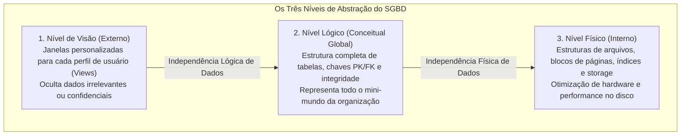
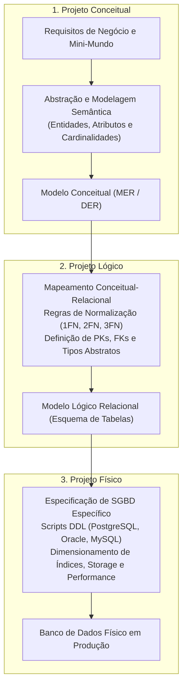

# Níveis do sgbd e as etapas do projeto de banco de dados: da visão ao armazenamento físico

> **Contexto:** Estudo da articulação entre os níveis do SGBD (físico, lógico e de visão), aprofundamento prático na independência lógica e física de dados, e detalhamento completo das três etapas do projeto de banco de dados (conceitual, lógica e física) com seus respectivos participantes.

---

## Introdução

Construir um banco de dados robusto não é uma atividade que ocorre em uma única etapa direta no computador. Trata-se de um **processo de engenharia progressivo**, no qual uma necessidade difusa de negócio é gradualmente refinada, formalizada e transformada em estruturas computacionais de alto desempenho.

Para estruturar esse processo, a Ciência da Computação estabelece dois pilares fundamentais:
1. **Os 3 níveis arquiteturais do SGBD:** nível de visão (externo), nível lógico (conceitual) e nível físico (interno), sustentados pelas garantias de **independência lógica e física**;
2. **As 3 etapas clássicas do projeto de banco de dados:** o **Projeto Conceitual**, o **Projeto Lógico** e o **Projeto Físico**, definindo claramente quem são os participantes e quais artefatos são produzidos em cada fase.

Neste artigo, utilizaremos a **Técnica de Feynman** para compreender como esses níveis se articulam, dominar o ciclo de vida do projeto de banco de dados e identificar os papéis desempenhados por cada profissional da equipe.

---

## 1. A analogia de Feynman: o projeto de um automóvel

Para visualizar a esteira completa que vai da ideia de negócio até a máquina real, imagine o processo de criação de um novo veículo:

| Etapa no automóvel | Etapa no banco de dados | O que é produzido | Quem participa |
| :--- | :--- | :--- | :--- |
| **O esboço do designer** | **Projeto conceitual** | Modelo Conceitual (DER) com entidades, atributos e relacionamentos de negócio. | Usuários de negócio, Analistas de Sistemas e Administrador de Dados (AD). |
| **A planta técnica das peças** | **Projeto lógico** | Modelo Lógico Relacional (tabelas, colunas, tipos, `PK`, `FK` e normalização). | Projetista de Banco de Dados, Arquiteto de Software e Desenvolvedores. |
| **A fábrica de montagem** | **Projeto físico** | Scripts DDL executáveis, alocação de storage, criação de índices B-Tree e tuning. | Administrador de Banco de Dados (DBA) e Engenheiros de Infraestrutura. |

---

## 2. Os três níveis do SGBD e a independência de dados

A arquitetura do SGBD organiza o acesso e a representação dos dados em três níveis concêntricos, garantindo que mudanças em uma camada não propaguem quebras para as camadas superiores:

### Funções dos 3 níveis do SGBD
1. **Nível de visão (*esquema externo*):** Fornece interfaces e consultas simplificadas adaptadas às necessidades de grupos específicos de usuários (ex.: visão de faturamento para o financeiro vs. visão de notas para o aluno). Garante segurança e isolamento.
2. **Nível lógico (*esquema conceitual*):** Centraliza a lógica corporativa inteira. Descreve quais dados estão armazenados e quais os relacionamentos e regras de validação existentes, sem se preocupar com bytes ou hardware.
3. **Nível físico (*esquema interno*):** Controla o modo como os dados residem na infraestrutura física (SSD, memórias buffers, partições de disco e algoritmos de indexação).

---

## 3. Desmistificando as duas independências de dados

A independência de dados é a imunidade que uma camada superior possui em relação a alterações realizadas na camada inferior:

### a. Independência lógica de dados
* **De onde para onde:** Do **nível conceitual (lógico)** para o **nível externo (visão)**.
* **Significado:** Capacidade de modificar o esquema conceitual (como adicionar novas entidades, novas colunas ou novos relacionamentos) sem obrigar a reescrita das aplicações ou visões existentes que não utilizam esses novos elementos.
* **Exemplo real:** O sistema do hospital ganha uma nova funcionalidade de telemedicina (com uma nova tabela `tb_teleconsulta`). O módulo de agendamento presencial tradicional da recepção continua operando perfeitamente sem precisar de nenhuma manutenção.

### b. Independência física de dados
* **De onde para onde:** Do **nível físico (interno)** para o **nível conceitual (lógico)**.
* **Significado:** Capacidade de modificar as estruturas de armazenamento físico, caminhos de acesso, índices ou o próprio hardware do servidor sem precisar alterar o esquema conceitual ou o código SQL das aplicações.
* **Exemplo real:** O DBA decide criar um índice B-Tree na coluna `cpf` e mover a tabela para uma unidade SSD de alta performance. O comando da aplicação (`SELECT nome FROM tb_cliente WHERE cpf = '123'`) não sofre alteração alguma, passando apenas a executar com maior velocidade.

---

## 4. As três etapas do projeto de banco de dados

O desenvolvimento de uma base de dados estruturada percorre três etapas sequenciais e articuladas:

---

## 5. Detalhamento e participantes de cada etapa

### Etapa 1: Projeto Conceitual
* **Objetivo:** Capturar a semântica da realidade do negócio e produzir uma descrição de alto nível das entidades e regras do mini-mundo, **totalmente independente de software ou tecnologia de SGBD**.
* **Artefato gerado:** O Modelo Entidade-Relacionamento (MER), expresso graficamente através do Diagrama Entidade-Relacionamento (DER).
* **Participantes essenciais:**
  * **Usuários de negócio e clientes:** Fornecem os requisitos e explicam as regras de funcionamento da empresa;
  * **Analistas de sistemas / Engenheiros de requisitos:** Elicitam as necessidades de informação;
  * **Administrador de Dados (AD):** Constrói o modelo conceitual e valida a semântica no dicionário de dados corporativo.

### Etapa 2: Projeto Lógico
* **Objetivo:** Transformar o modelo conceitual abstrato em um **modelo computacional formal**, adaptado ao paradigma de banco escolhido (no nosso caso, o **Modelo Relacional**).
* **Atividades fundamentais:**
  * Mapear entidades em tabelas e atributos em colunas;
  * Definir chaves primárias (`PK`) e chaves estrangeiras (`FK`);
  * Aplicar as regras de normalização (1FN, 2FN, 3FN) para eliminar redundâncias e prevenir anomalias;
  * Especificar tipos conceituais de dados (inteiro, texto, data, decimal).
* **Artefato gerado:** O Esquema Relacional (diagrama de tabelas com chaves e cardinalidades lógicas).
* **Participantes essenciais:**
  * **Projetistas de banco de dados e arquitetos de software:** Executam o mapeamento e a normalização;
  * **Desenvolvedores sêniores:** Alinham o esquema com as entidades e classes da aplicação (POO).

### Etapa 3: Projeto Físico
* **Objetivo:** Implementar o modelo lógico em um **SGBD específico** (PostgreSQL, Oracle, SQL Server, MySQL), ajustando as estruturas de dados para atingir o melhor desempenho operacional e segurança.
* **Atividades fundamentais:**
  * Escrever e executar os scripts DDL (`CREATE TABLE`, `CREATE INDEX`, `ALTER TABLE`);
  * Escolher tipos de dados nativos da tecnologia (ex.: `VARCHAR`, `INT`, `NUMERIC`, `TEXT`, `TIMESTAMP`);
  * Definir estratégias de indexação (índices B-Tree, Hash, GIN) para as consultas mais críticas;
  * Configurar alocação de arquivos de dados (*tablespaces*), partições de tabelas e parâmetros de memória buffer.
* **Artefato gerado:** Banco de Dados físico implementado e operacional no servidor SGBD.
* **Participantes essenciais:**
  * **Administrador de Banco de Dados (DBA):** Lidera a implementação, alocação de recursos e testes de carga;
  * **Engenheiros de infraestrutura e DevOps:** Configuram os servidores, discos e segurança de rede.

---

## 6. Matriz de consolidação das etapas do projeto de BD

A tabela a seguir resume a articulação completa do ciclo de modelagem:

| Dimensão de análise | 1. Projeto Conceitual | 2. Projeto Lógico | 3. Projeto Físico |
| :--- | :--- | :--- | :--- |
| **Nível de abstração** | Mais alto (alto nível semântico). | Intermediário (estrutural lógico). | Mais baixo (físico/máquina). |
| **Dependência de SGBD** | **Zero:** independente de tecnologia. | Independente do software, mas depende do paradigma (Relacional). | **Total:** depende do SGBD e do sistema operacional. |
| **Principal ferramenta** | Diagrama Entidade-Relacionamento (DER). | Esquema de Tabelas Relacionais e Normalização. | Scripts DDL SQL, analisadores de planos de execução. |
| **Liderança técnica** | Administrador de Dados (AD) e Analistas. | Projetista de Banco e Arquitetos. | Administrador de Banco de Dados (DBA). |
| **Entrada $\to$ Saída** | Requisitos do negócio $\to$ DER conceitual. | DER $\to$ Tabelas relacionais normalizadas. | Tabelas lógicas $\to$ Banco físico em produção. |

---

## Referências bibliográficas

### Bibliografia básica
* HEUSER, Carlos Alberto. **Projeto de banco de dados**. 6. ed. Porto Alegre: Bookman, 2009. (Capítulo 2: *O modelo entidade-relacionamento* e Capítulo 3: *O projeto lógico*). ISBN 9788577804528.
* ELMASRI, Ramez; NAVATHE, Shamkant B. **Sistemas de banco de dados**. 7. ed. São Paulo: Pearson, 2018. (Capítulo 2: *Arquitetura e etapas de projeto* e Capítulo 3: *Modelagem de dados conceitual*). ISBN 9788543025001.
* SILBERSCHATZ, Abraham; KORTH, Henry F.; SUDARSHAN, S. **Sistema de banco de dados**. 7. ed. Rio de Janeiro: Elsevier, GEN LTC, 2020. (Capítulo 1 e 2: *Visão geral do processo de projeto*). ISBN 9788595157477.

### Bibliografia complementar
* DATE, C. J. **Introdução a sistemas de bancos de dados**. 8. ed. Rio de Janeiro: Elsevier, Campus, 2004. ISBN 9788535212730.
* MACHADO, Felipe Nery Rodrigues. **Banco de dados: projeto e implementação**. 4. ed. São Paulo: Érica, 2020. ISBN 9788536533032.

---

## Artigos relacionados e navegação

* **Artigo anterior:** [[04. Linguagens de banco de dados e perfis profissionais (ad vs. dba)]]
* **Próximo artigo:** [[06. Modelagem conceitual e o modelo entidade-relacionamento (mer)]]
* **Resumo da disciplina:** [[00. Modelagem de Dados - Resumo]]
* **Glossário da matéria:** [[Glossário de conceitos]]
* **Índice geral do vault:** [[index.md|Página Inicial do Vault]]
