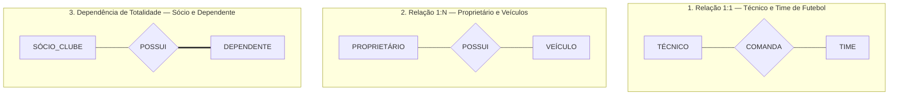
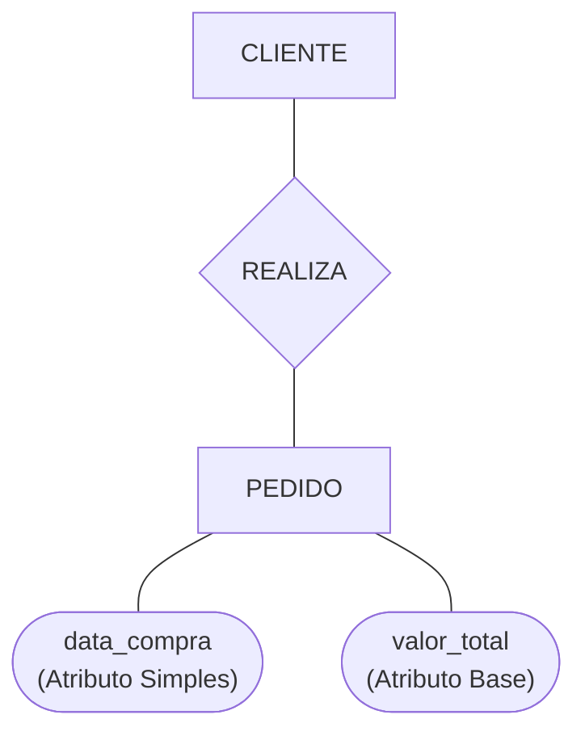
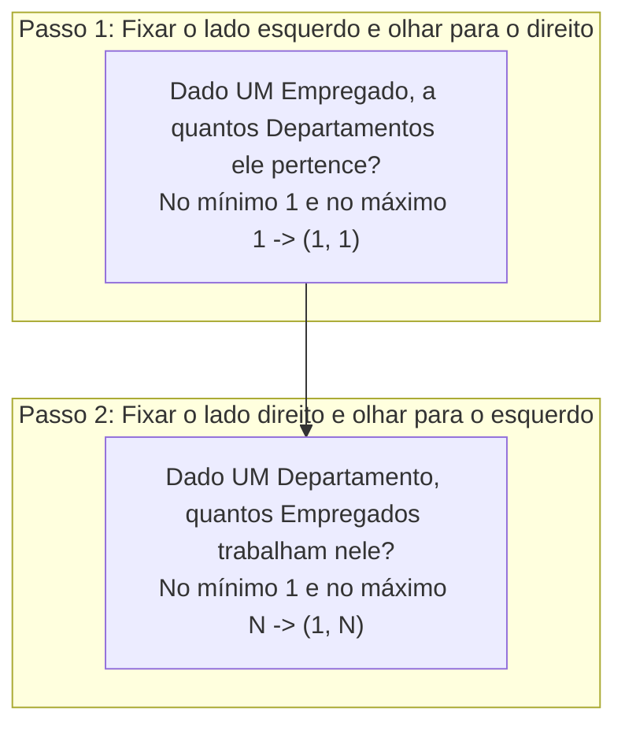
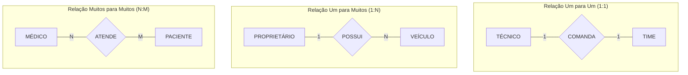
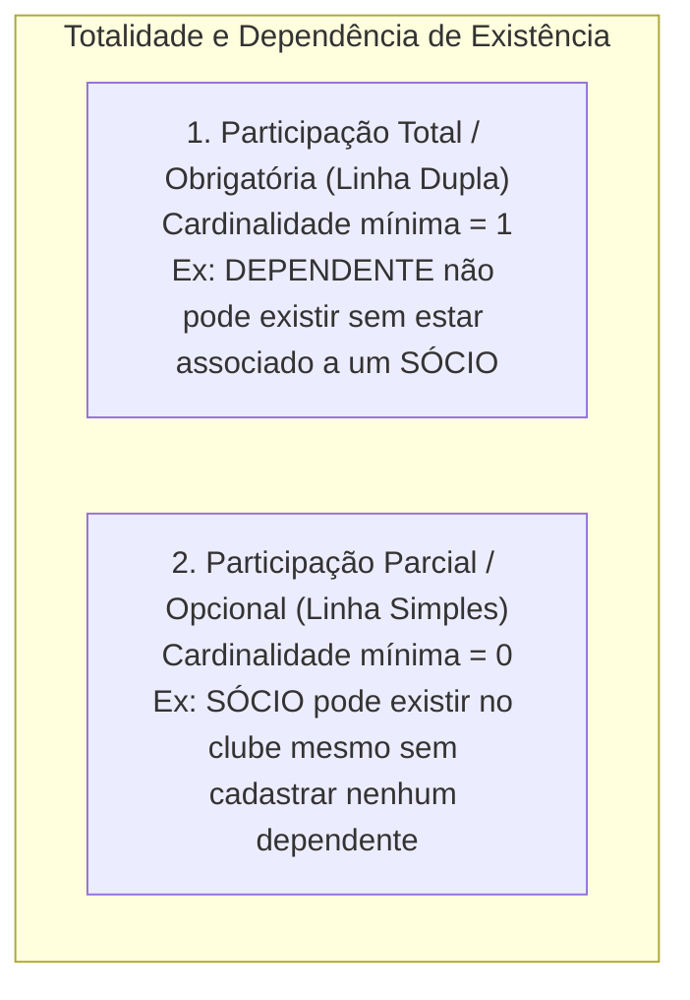
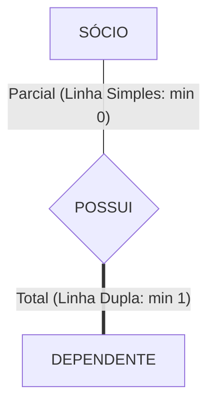
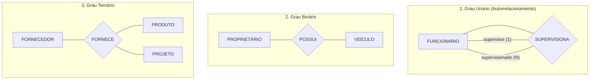
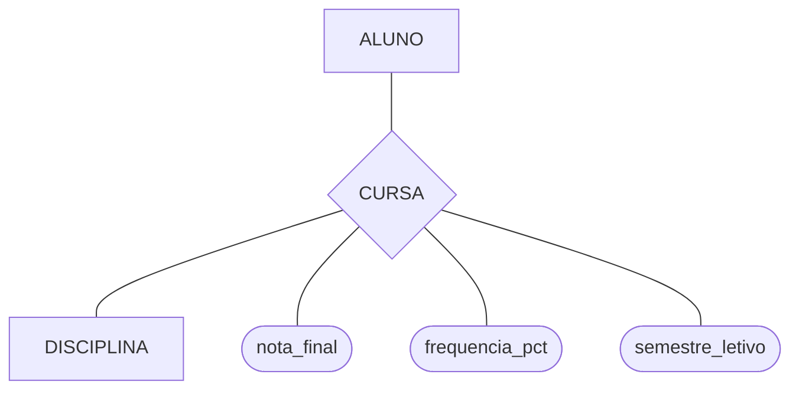

# Modelagem de relacionamentos, cardinalidade e restrições de participação: a dinâmica semântica do mer

> **Contexto:** Estudo aprofundado dos relacionamentos no Modelo Entidade-Relacionamento (MER) fundamentado na Teoria dos Conjuntos, explorando o conceito de relacionamentos como pontes entre entidades, a técnica prática de leitura de cardinalidades (fixar um lado e perguntar ao outro), o mapeamento 1:1, 1:N e N:M, as restrições de totalidade (dependência de existência) e os atributos em associações.

---

## Introdução

No mundo real, as entidades não existem de forma isolada: clientes realizam compras, técnicos comandam times, proprietários possuem veículos e sócios cadastram dependentes. No **Modelo Entidade-Relacionamento (MER)**, os relacionamentos funcionam como verdadeiras **pontes semânticas** que conectam e dão sentido aos dados armazenados.

Fundamentados na **Teoria Matemática dos Conjuntos**, os relacionamentos representam associações lógicas entre instâncias de diferentes entidades (ou da mesma entidade). Para que essa modelagem expresse com exatidão as regras do negócio, é necessário calibrar duas propriedades estruturais indispensáveis:
1. **A cardinalidade máxima ($1:1$, $1:N$, $N:M$):** a quantidade máxima de ocorrências que uma entidade pode se associar à outra;
2. **A totalidade ou participação ($min = 0$ ou $min = 1$):** se a existência de uma entidade depende compulsoriamente do relacionamento com outra (*participação total/obrigatória vs. parcial/opcional*).

Neste artigo, utilizaremos a **Técnica de Feynman** para aprender o método infalível de leitura de cardinalidades, dominar a notação de losangos de Peter Chen e modelar regras corporativas sem ambiguidades.

---

## 1. As analogias de Feynman: pontes semânticas e exemplos reais

Para memorizar os tipos de relacionamentos sem esforço, analisamos as associações clássicas do cotidiano:

### Modelos mentais intuitivos
1. **Técnico e Time de Futebol ($1:1$):**
   * *Regra:* Um técnico comanda no máximo um time profissional por vez, e cada time possui exatamente um técnico principal contratado.
2. **Proprietário e Veículos ($1:N$):**
   * *Regra:* Um proprietário pode possuir vários veículos registrados em seu nome ($N$), mas cada veículo pertence a um único proprietário na documentação oficial ($1$).
3. **Sócio e Dependentes (*Totalidade / Dependência de Existência*):**
   * *Regra:* Um dependente só existe no clube se estiver estritamente vinculado a um sócio titular (*participação total com linha dupla*). Se o sócio cancelar o plano, os dependentes não podem existir sozinhos no cadastro.

---

## 2. A representação visual no DER de Chen: o losango

Na notação clássica de Peter Chen (1976), o relacionamento é representado por um **losango**, posicionado entre as entidades e rotulado com verbos que indicam o sentido natural da leitura:

> **Dica prática de modelagem (*Sentido de leitura*):** Sempre nomeie o losango com verbos ativos no sentido natural de leitura do negócio (ex.: `CLIENTE` $\to$ `REALIZA` $\to$ `PEDIDO`, `PROPRIETÁRIO` $\to$ `POSSUI` $\to$ `VEÍCULO`, `VEÍCULO` $\to$ `PERTENCE_A` $\to$ `PROPRIETÁRIO`).

---

## 3. O método infalível de leitura: fixar um lado e perguntar ao outro

Para determinar a cardinalidade mínima e máxima de qualquer relacionamento sem cometer equívocos, aplica-se a técnica em dois passos:

### Como interpretar os números:
* O **primeiro valor** representa o **mínimo (totalidade / participação)**:
  * $0$: Participação **parcial / opcional** (a instância pode existir sem o relacionamento);
  * $1$: Participação **total / obrigatória** (a instância depende do relacionamento para existir).
* O **segundo valor** representa o **máximo (cardinalidade máxima)**:
  * $1$: Associação individual;
  * $N$ ou $M$: Múltiplas associações permitidas.

---

## 4. Classificação por cardinalidade máxima: 1:1, 1:N e N:M

A cardinalidade máxima define o teto de associações possíveis entre as instâncias:

| Tipo de cardinalidade | Descrição formal | Exemplo de negócio |
| :--- | :--- | :--- |
| **Um para Um ($1:1$)** | Cada ocorrência de A associa-se a no máximo uma de B, e vice-versa. | `Técnico` *comanda* `Time` / `Cidadão` *possui* `CPF`. |
| **Um para Muitos ($1:N$)** | Uma ocorrência de A associa-se a várias de B, mas cada B liga-se a apenas um A. | `Proprietário` *possui* `Veículos` / `Departamento` *aloca* `Funcionários`. |
| **Muitos para Um ($N:1$)** | É a visão inversa do relacionamento $1:N$. | Vários `Veículos` *pertencem a* um único `Proprietário`. |
| **Muitos para Muitos ($N:M$)** | Múltiplas ocorrências de A associam-se livremente a múltiplas de B. | `Médicos` *atendem* `Pacientes` / `Alunos` *cursam* `Disciplinas`. |

---

## 5. Restrições de participação e totalidade: dependência de existência

A totalidade especifica se a existência de uma entidade no banco de dados depende compulsoriamente de estar associada a outra:

### a. Participação total (*linha dupla no DER de Chen*)
* **Conceito:** Toda e qualquer instância daquela entidade deve obrigatoriamente participar do relacionamento.
* **Exemplo de aula:** A entidade `DEPENDENTE` possui participação total no relacionamento `Possui` com `SÓCIO`. Não faz sentido cadastrar um dependente órfão no sistema do clube.

### b. Participação parcial (*linha simples no DER de Chen*)
* **Conceito:** A entidade pode existir independentemente de possuir registros associados.
* **Exemplo de aula:** A entidade `SÓCIO` possui participação parcial no relacionamento `Possui` com `DEPENDENTE` (um sócio solteiro pode se associar ao clube sem incluir dependentes).

---

## 6. Grau do relacionamento e autorrelacionamento

O grau indica quantas entidades participam simultaneamente da mesma associação:

### Autorrelacionamento (*Grau Unário*)
Ocorre quando instâncias da mesma entidade se relacionam entre si, desempenhando **papéis (*roles*)** distintos:
* Na entidade `FUNCIONARIO`, um funcionário atua no papel de **supervisor** ($1$) e outros funcionários atuam no papel de **supervisionados** ($N$).

---

## 7. Atributos no próprio relacionamento

Quando uma propriedade só passa a existir a partir da união factual de duas entidades, ela deve ser modelada diretamente no **losango**:

* A `nota_final` não pertence exclusivamente ao aluno (ele tem notas variadas em diferentes matérias) nem à disciplina (que possui notas de dezenas de alunos). A nota pertence à **associação `CURSA`**.

---

## 8. Matriz comparativa das regras estruturais do MER

| Conceito estrutural | Notação visual no DER de Chen | Exemplo de aula | Regra de integridade |
| :--- | :--- | :--- | :--- |
| **Relacionamento** | Losango sólido `{"NOME"}`. | `PROPRIETÁRIO` *possui* `VEÍCULO`. | Conexão semântica entre conjuntos. |
| **Cardinalidade $1:1$** | Rótulos `1` nas duas pontas. | `Técnico` *comanda* `Time`. | Um técnico para um time. |
| **Cardinalidade $1:N$** | Rótulo `1` em uma ponta e `N` na outra. | `Proprietário` *possui* `Veículos`. | Um proprietário para vários veículos. |
| **Cardinalidade $N:M$** | Rótulos `N` e `M` nas pontas. | `Médicos` *atendem* `Pacientes`. | Múltiplas consultas cruzadas. |
| **Totalidade (Obrigatória)** | **Linha dupla** (`===`). | `Dependente` ligado a `Sócio`. | $min = 1$: dependência de existência. |
| **Parcialidade (Opcional)** | **Linha simples** (`---`). | `Sócio` ligado a `Dependente`. | $min = 0$: existência independente. |
| **Atributo de Associação** | Elipse conectada ao losango. | `nota_final` no vínculo `CURSA`. | Propriedade válida apenas no par `(A, B)`. |

---

## Referências bibliográficas

### Bibliografia básica
* HEUSER, Carlos Alberto. **Projeto de banco de dados**. 6. ed. Porto Alegre: Bookman, 2009. (Capítulo 2: *O modelo entidade-relacionamento*, p. 19-48). ISBN 9788577804528.
* ELMASRI, Ramez; NAVATHE, Shamkant B. **Sistemas de banco de dados**. 7. ed. São Paulo: Pearson, 2018. (Capítulo 3: *Tipos de relacionamentos, papéis e restrições estruturais*, p. 65-85). ISBN 9788543025001.
* SILBERSCHATZ, Abraham; KORTH, Henry F.; SUDARSHAN, S. **Sistema de banco de dados**. 7. ed. Rio de Janeiro: Elsevier, GEN LTC, 2020. (Capítulo 6: *Conjuntos de relacionamentos e restrições de mapeamento*). ISBN 9788595157477.

### Bibliografia complementar
* CHEN, Peter Pin-Shan. **The entity-relationship model: toward a unified view of data**. ACM Transactions on Database Systems (TODS), v. 1, n. 1, p. 9-36, 1976.
* DATE, C. J. **Introdução a sistemas de bancos de dados**. 8. ed. Rio de Janeiro: Elsevier, Campus, 2004. ISBN 9788535212730.
* MACHADO, Felipe Nery Rodrigues. **Banco de dados: projeto e implementação**. 4. ed. São Paulo: Érica, 2020. ISBN 9788536533032.

---

## Materiais complementares recomendados

* **Aprofunde a modelagem de relacionamentos e cardinalidades:** [Diagrama ER - cardinalidade de relacionamento 1:1](https://www.youtube.com/watch?v=LXQi-h6IfCU) — Aula prática detalhando a identificação de cardinalidades e leitura de restrições em diagramas ER.

---

## Artigos relacionados e navegação

* **Artigo anterior:** [[05. Modelagem de entidades e tipos de atributos]]
* **Próximo artigo:** [[07. Entidades fracas, especialização e generalização no mer estendido]]
* **Resumo da disciplina:** [[00. Modelagem de Dados - Resumo]]
* **Glossário da matéria:** [[Glossário de conceitos]]
* **Índice geral do vault:** [[index.md|Página Inicial do Vault]]
