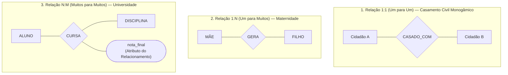
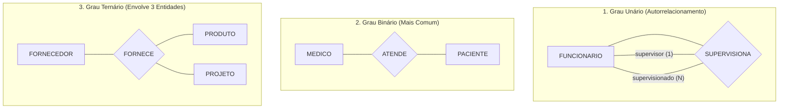
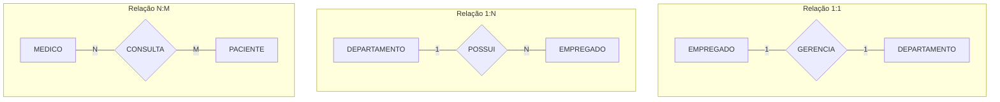
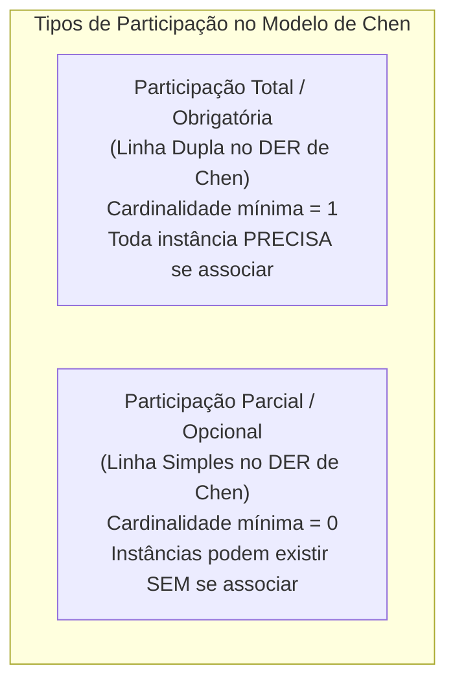
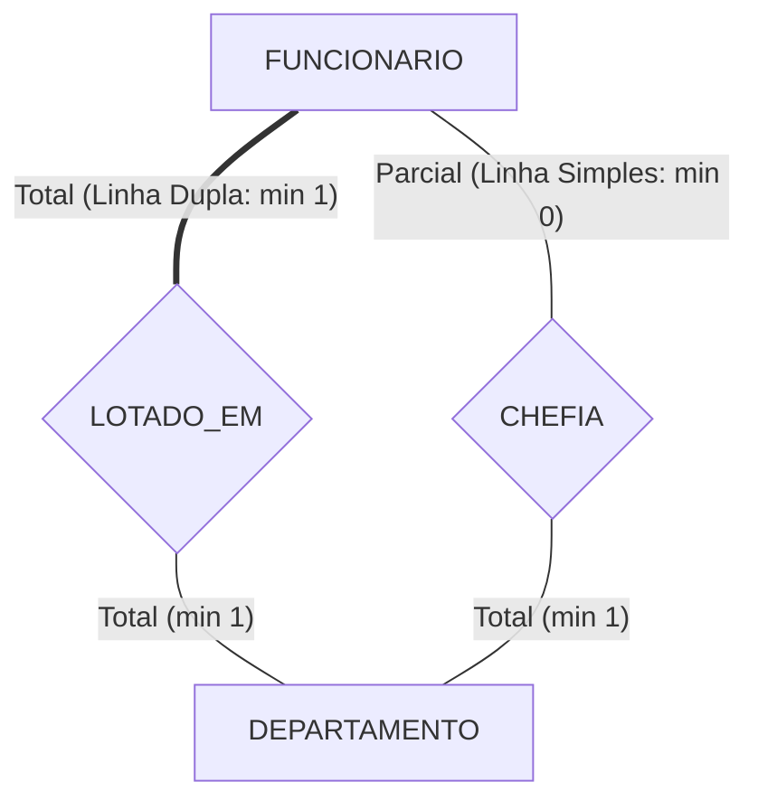
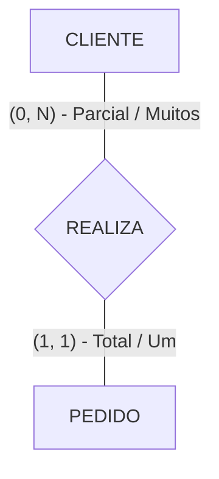

# Modelagem de relacionamentos, cardinalidade e restrições de participação: a dinâmica semântica do mer

> **Contexto:** Estudo aprofundado dos relacionamentos no Modelo Entidade-Relacionamento (MER), abrangendo o grau de associações (unárias, binárias e ternárias), a classificação por cardinalidade máxima (1:1, 1:N, N:M), as restrições de existência e participação (total vs. parcial), os atributos em relacionamentos e os autorrelacionamentos com papéis.

---

## Introdução

No mundo real, as entidades não existem isoladas: clientes realizam compras, médicos atendem pacientes, professores ministram disciplinas e funcionários gerenciam departamentos. No **Modelo Entidade-Relacionamento (MER)**, a cola semântica que une as entidades são os **relacionamentos**.

Um relacionamento é a representação conceitual de uma associação entre duas ou mais entidades do mini-mundo. Para que essa associação reflita com precisão as regras de negócio da organização, o projetista de banco de dados precisa definir duas dimensões estruturais fundamentais:
1. **A cardinalidade máxima ($1:1$, $1:N$, $N:M$):** quantas instâncias de uma entidade podem se associar a instâncias da outra entidade;
2. **A participação ou totalidade (mínima $0$ ou $1$):** se a existência de uma instância depende compulsoriamente da existência de outra associada (*participação total/obrigatória vs. parcial/opcional*).

Neste artigo, utilizaremos a **Técnica de Feynman** para desconstruir os relacionamentos, dominar a notação de losangos de Peter Chen e aprender como modelar restrições estruturais com fidelidade.

---

## 1. As analogias de Feynman: casamento, maternidade e matrícula

Para internalizar as regras de cardinalidade e participação sem memorizações mecânicas, analisamos três relações clássicas do mundo real:

### Modelos mentais intuitivos
1. **Casamento Civil ($1:1$ — Parcial / Opcional):**
   * *Cardinalidade:* Um cidadão só pode ser casado com, no máximo, 1 outro cidadão ($1:1$).
   * *Participação:* Nem todo cidadão é obrigado a ser casado (*participação parcial/opcional — cardinalidade mínima 0*).
2. **Maternidade Biológica ($1:N$ — Total para o Filho):**
   * *Cardinalidade:* Uma mãe pode gerar múltiplos filhos ($N$), mas cada filho biológico possui exatamente uma única mãe ($1$).
   * *Participação:* Toda pessoa tem obrigatoriamente uma mãe biológica (*participação total/obrigatória — cardinalidade mínima 1*), mas nem toda mulher precisa ter filhos (*participação parcial*).
3. **Matrícula Escolar ($N:M$ com Atributo no Relacionamento):**
   * *Cardinalidade:* Um aluno pode cursar várias disciplinas ($N$) e uma disciplina é cursada por vários alunos ($M$).
   * *Atributo da associação:* A `nota_final` não pertence exclusivamente ao aluno (ele tem notas diferentes em matérias distintas) nem à disciplina (que possui notas de vários alunos), mas sim ao **vínculo de matrícula entre os dois**.

---

## 2. A anatomia gráfica do relacionamento no DER de Chen

Na notação de Peter Chen (1976), os relacionamentos são representados por um **losango** conectado por linhas retas às entidades participantes:

---

## 3. Grau do relacionamento: unário, binário e ternário

O **grau de um relacionamento** indica o número de tipos de entidades que participam da associação:

### 1. Relacionamento unário (*autorrelacionamento*)
* Ocorre quando instâncias da **mesma entidade** se relacionam entre si desempenhando diferentes papéis (*roles*).
* *Exemplo clássico:* Um funcionário atua como `supervisor` de outros funcionários `supervisionados`.
* *Outro exemplo:* Uma peça que é `composta_por` outras subpeças (estrutura de montagem de produto / *Bill of Materials*).

### 2. Relacionamento binário
* É o tipo mais frequente na modelagem corporativa, conectando **duas entidades distintas** (ex.: `Cliente` e `Pedido`, `Autor` e `Livro`).

### 3. Relacionamento ternário (ou de grau superior $N$)
* Envolve **três ou mais entidades simultaneamente** para que a semântica da transação fique completa.
* *Exemplo real:* O relacionamento `Fornece` une `Fornecedor`, `Produto` e `Projeto` (determinado fornecedor fornece um produto específico para um projeto específico).

---

## 4. Cardinalidade máxima: 1:1, 1:N e N:M

A cardinalidade máxima especifica o **limite superior** de associações que uma instância pode manter:

### 1. Relacionamento Um para Um ($1:1$)
* Cada instância da entidade A associa-se a no máximo uma instância da entidade B, e vice-versa.
* *Exemplo:* Um `Empregado` gerencia no máximo um `Departamento`, e cada `Departamento` tem apenas um `Empregado` como gerente.

### 2. Relacionamento Um para Muitos ($1:N$)
* Uma instância da entidade A pode se associar a múltiplas instâncias da entidade B, mas cada instância de B associa-se a no máximo uma instância de A.
* *Exemplo:* Um `Departamento` possui múltiplos `Empregados` ($N$), mas cada `Empregado` é lotado em apenas um `Departamento` ($1$).

### 3. Relacionamento Muitos para Muitos ($N:M$)
* Uma instância de A pode se associar a várias de B, e uma instância de B pode se associar a várias de A.
* *Exemplo:* Um `Medico` atende múltiplos `Pacientes` ($N$), e um `Paciente` pode ser atendido por múltiplos `Medicos` ($M$) de especialidades diferentes.

---

## 5. Restrições de participação e totalidade (cardinalidade mínima)

A **participação** (ou restrição de existência) define se todas as instâncias de uma entidade precisam obrigatoriamente participar do relacionamento:

### a. Participação total (*restrição de existência / dependência obrigatória*)
* **Definição:** Toda ocorrência da entidade precisa obrigatoriamente participar de pelo menos uma instância do relacionamento (cardinalidade mínima $= 1$).
* **Notação de Peter Chen:** Representada por uma **linha dupla** conectando a entidade ao losango.
* **Exemplo real:** Em uma empresa, todo `Funcionario` deve pertencer obrigatoriamente a um `Departamento`. Não pode existir funcionário "sem departamento".

### b. Participação parcial (*opcional*)
* **Definição:** Algumas ocorrências da entidade podem não participar do relacionamento (cardinalidade mínima $= 0$).
* **Notação de Peter Chen:** Representada por uma **linha simples**.
* **Exemplo real:** Nem todo `Funcionario` gerencia um `Departamento` (a maioria é apenas liderada).

---

## 6. A notação estrutural $(min, max)$

Uma alternativa moderna e muito precisa introduzida na literatura para expressar cardinalidade e totalidade simultaneamente é a **notação de limites $(min, max)$**:

$$\text{Entidade } A \quad \xrightarrow{\quad (min_A, max_A) \quad} \quad \text{Relacionamento} \quad \xleftarrow{\quad (min_B, max_B) \quad} \quad \text{Entidade } B$$

* $min = 0$: Participação **parcial / opcional**;
* $min \ge 1$: Participação **total / obrigatória**;
* $max = 1$: Associação individual;
* $max = N$ ou $*$: Múltiplas associações.

* **Leitura estrutural do exemplo:**
  * Um `CLIENTE` realiza no mínimo $0$ e no máximo $N$ pedidos $(0, N)$ — *o cliente pode se cadastrar e ainda não ter comprado nada*;
  * Um `PEDIDO` pertence obrigatoriamente a no mínimo $1$ e no máximo $1$ cliente $(1, 1)$ — *não existe pedido anônimo sem cliente associado*.

---

## 7. Atributos em relacionamentos

Quando uma informação só passa a existir a partir do momento em que duas entidades se conectam, ela deve ser modelada como um **atributo do próprio relacionamento** (e não de nenhuma das entidades isoladas):

* Onde colocar a `nota_final`?
  * Na entidade `ALUNO`? Não, pois o aluno cursa várias disciplinas e teria múltiplas notas diferentes.
  * Na entidade `DISCIPLINA`? Não, pois a disciplina tem dezenas de alunos matriculados com notas distintas.
  * **No relacionamento `CURSA`:** Correto! A nota qualifica o par específico `(Aluno, Disciplina)`.

---

## 8. Matriz comparativa das regras estruturais do MER

| Conceito | Símbolo no DER de Chen | Significado semântico | Exemplo prático de negócio |
| :--- | :--- | :--- | :--- |
| **Relacionamento** | Losango sólido. | Associação lógica entre entidades. | `Cliente` *compra* `Produto`. |
| **Cardinalidade $1:1$** | Rótulo `1` em ambas as pontas. | Associação singular bidirecional. | `Pessoa` *possui* `Passaporte`. |
| **Cardinalidade $1:N$** | Rótulo `1` em uma ponta e `N` na outra. | Um elemento associa-se a vários. | `Turma` *contém* `Alunos`. |
| **Cardinalidade $N:M$** | Rótulo `N` e `M` nas pontas. | Múltiplos elementos associam-se livremente. | `Médico` *atende* `Paciente`. |
| **Participação Total** | **Linha dupla** (ou $min \ge 1$). | Existência obrigatória no vínculo. | Todo `ItemPedido` precisa de um `Pedido`. |
| **Participação Parcial** | **Linha simples** (ou $min = 0$). | Existência opcional no vínculo. | Nem todo `Cliente` fez `Pedido`. |
| **Atributo de Relacionamento** | Elipse ligada ao losango. | Dado que descreve a associação. | `data_contratacao`, `nota`. |

---

## Referências bibliográficas

### Bibliografia básica
* HEUSER, Carlos Alberto. **Projeto de banco de dados**. 6. ed. Porto Alegre: Bookman, 2009. (Capítulo 2: *O modelo entidade-relacionamento*, p. 19-48). ISBN 9788577804528.
* ELMASRI, Ramez; NAVATHE, Shamkant B. **Sistemas de banco de dados**. 7. ed. São Paulo: Pearson, 2018. (Capítulo 3: *Tipos de relacionamentos, papéis e restrições estruturais*, p. 65-85). ISBN 9788543025001.
* SILBERSCHATZ, Abraham; KORTH, Henry F.; SUDARSHAN, S. **Sistema de banco de dados**. 7. ed. Rio de Janeiro: Elsevier, GEN LTC, 2020. (Capítulo 6: *Conjuntos de relacionamentos e restrições de mapeamento*). ISBN 9788595157477.

### Bibliografia complementar
* CHEN, Peter Pin-Shan. **The entity-relationship model: toward a unified view of data**. ACM Transactions on Database Systems (TODS), v. 1, n. 1, p. 9-36, 1976.
* DATE, C. J. **Introdução a sistemas de bancos de dados**. 8. ed. Rio de Janeiro: Elsevier, Campus, 2004. ISBN 9788535212730.
* MACHADO, Felipe Nery Rodrigues. **Banco de dados: projeto e implementação**. 4. ed. São Paulo: Érica, 2020. ISBN 9788536533032.

---

## Artigos relacionados e navegação

* **Artigo anterior:** [[05. Modelagem de entidades e tipos de atributos]]
* **Próximo artigo:** [[07. Entidades fracas, especialização e generalização no mer estendido]]
* **Resumo da disciplina:** [[00. Modelagem de Dados - Resumo]]
* **Glossário da matéria:** [[Glossário de conceitos]]
* **Índice geral do vault:** [[index.md|Página Inicial do Vault]]
