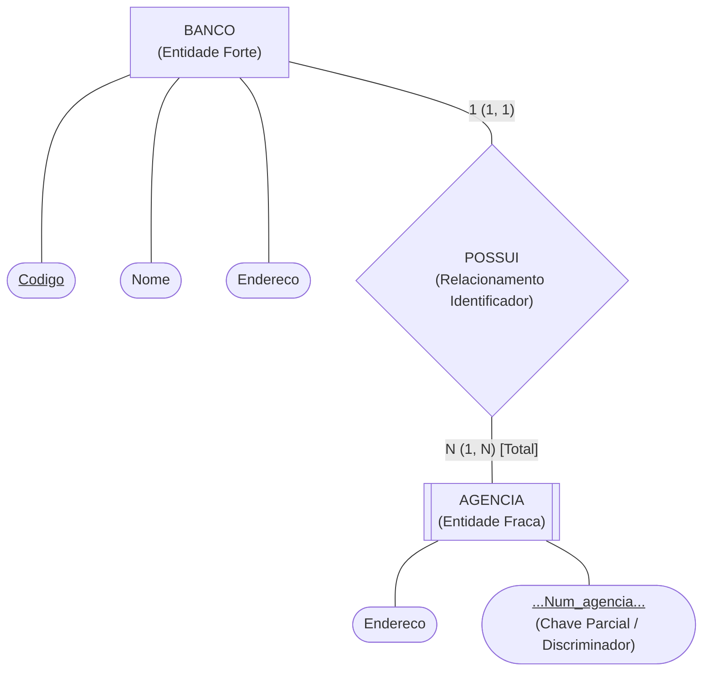
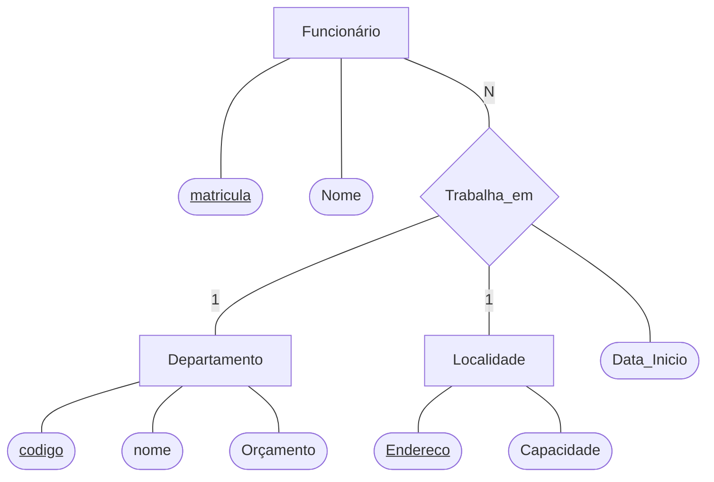
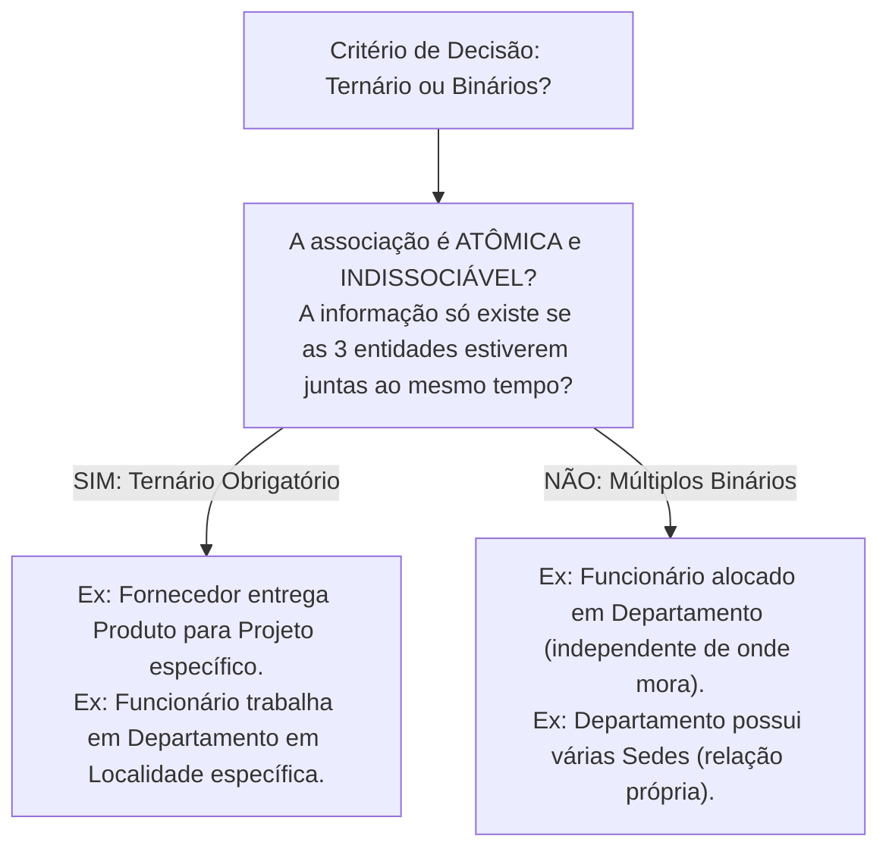

# Modelo de entidades e relacionamentos estendido: entidades fracas, ternárias e abstrações avançadas

> **Contexto:** Estudo do Modelo Entidade-Relacionamento Estendido (EER / MER Estendido) integrando os exemplos oficiais de aula da PUC Minas: entidades fortes vs. fracas (Banco e Agência), atributos em relacionamentos N:M (Funcionário e Projeto com função), relacionamentos ternários de Grau 3 (Funcionário, Departamento e Localidade com leitura de pares de ocorrências), critérios de decisão entre binário e ternário, e noções de especialização e generalização com herança.

---

## Introdução

À medida que os sistemas de informação modernos tornam-se mais complexos, o Modelo Entidade-Relacionamento básico proposto em 1976 precisou ser expandido. Surgiu então o **Modelo Entidade-Relacionamento Estendido (EER - *Enhanced Entity-Relationship*)**, que incorporou conceitos de abstração avançada, modelagem de dependências existenciais complexas e conexões semânticas de ordem superior.

Nesta sessão, abordamos três grandes pilares do MER Estendido com base nas aulas da PUC Minas:
1. **Entidades fortes (*regulares*) vs. Entidades fracas (*dependentes*):** como modelar elementos que não possuem chave primária própria e dependem da existência de outra entidade (exemplo clássico: `Banco` e `Agência`);
2. **Atributos em relacionamentos $N:M$:** propriedades que pertencem exclusivamente à associação entre entidades (exemplo: `Funcionário` atua em `Projeto` exercendo uma `Função`);
3. **Modelagem de relacionamentos de grau superior (Binários vs. Ternários):** como ler e calibrar cardinalidades em associações de Grau 3 (exemplo: `Funcionário`, `Departamento` e `Localidade`) e a regra de ouro para decidir quando usar binário ou ternário.

---

## 1. Entidades fortes (*regulares*) vs. entidades fracas (*dependentes*)

Nem todas as entidades do mundo real possuem independência existencial ou atributos suficientes para gerar uma chave primária própria e única no universo global.

### a. A metáfora do depósito bancário (Feynman)
> Imagine que um amigo lhe peça: *"Por favor, faça um depósito para mim na Agência 1045"*. 
> Imediatamente você perguntará: *"Mas em qual banco?"*.
> 
> O número `1045` sozinho não tem significado global, pois tanto o Banco do Brasil, o Itaú, a Caixa Econômica quanto o Bradesco podem ter uma agência de número `1045`. A `AGÊNCIA` **não tem vida própria**: ela precisa compulsoriamente estar atrelada a uma entidade forte (`BANCO`) para que sua identidade seja estabelecida.

---

### b. Anatomia e representação gráfica no DER de Chen (Slide Oficial de Aula)

No DER de Peter Chen, os elementos dependentes são representados por **contornos duplos**:

| Elemento no DER | Símbolo gráfico de Chen | Função no modelo | Exemplo de aula |
| :--- | :--- | :--- | :--- |
| **Entidade forte (*regular*)** | Retângulo simples | Possui chave primária autossuficiente (`Codigo`). | `BANCO` |
| **Entidade fraca (*dependente*)** | **Retângulo duplo** | Não possui chave primária própria; depende da entidade forte. | `AGENCIA` |
| **Relacionamento identificador** | **Losango duplo** | Vínculo estrutural que transfere a chave da dona para a fraca. | `POSSUI` |
| **Chave parcial (*discriminador*)** | Elipse com **sublinhado tracejado** | Diferencia as agências subordinadas a um mesmo banco. | `Num_agencia` |
| **Participação da fraca** | **Linha dupla** (compulsória) | Toda agência precisa pertencer a um banco ($min = 1$). | `===` |

> **Formação da Chave Primária:** No banco de dados relacional (modelo lógico), a chave primária da tabela `Agencia` será uma **chave composta**: `(Codigo_Banco + Num_agencia)`.

---

## 2. Atributos em relacionamentos $N:M$ (Slide Oficial de Aula)

Quando uma informação só passa a existir a partir da conjunção factual de duas entidades em uma associação Muitos para Muitos ($N:M$), essa propriedade deve ser ligada diretamente ao **losango do relacionamento**.

### O caso real: Funcionário atua em Projeto

Considere o relacionamento `atua` entre `Funcionário` e `Projeto`:
* Um funcionário possui `Matrícula` (chave primária) e `Nome`.
* Um projeto possui `Código` (chave primária) e `Título`.
* Um funcionário atua em $1$ a $N$ projetos `(1, n)`.
* Um projeto pode contar com $0$ a $N$ funcionários `(0, n)`.

### Onde alocar o atributo `Função`?
* **Poderia ficar em `Funcionário`?** Não, pois o mesmo colaborador (ex.: Maria) pode atuar como *desenvolvedora* no Projeto Alpha e como *líder técnica* no Projeto Beta.
* **Poderia ficar em `Projeto`?** Não, pois um mesmo projeto possui dezenas de profissionais desempenhando funções distintas (*arquiteto*, *tester*, *designer*).
* **No relacionamento `atua`:** Correto! A `Função` descreve exatamente o papel desempenhado por aquele funcionário específico naquele projeto específico.

---

## 3. Grau do relacionamento: binário vs. ternário (Grau 3)

O **grau de um relacionamento** indica a quantidade de entidades conectadas pelo mesmo losango.

* **Grau 2 (Binário):** Conecta exatamente 2 entidades (ex.: `Funcionário` e `Projeto`).
* **Grau 3 (Ternário):** Conecta **3 entidades simultaneamente** para que a transação ou alocação semântica do mini-mundo fique completa.
* **Grau $N$ ($N$-ário):** Conexões com 4 ou mais entidades (raras na prática devido à complexidade).

---

## 4. Análise aprofundada do relacionamento ternário de aula

Analisamos a estrutura conceitual do slide de aula da PUC Minas que modela a alocação de pessoal:

### Como fazer a leitura da cardinalidade no ternário (*Pares de ocorrências*)
Em um relacionamento ternário, para determinar a cardinalidade de uma das entidades, deve-se **fixar um par de ocorrências das outras duas entidades**:

> **A regra do "1" destacado no slide de aula:**
> *"O número **1** na linha de `Localidade` expressa que: Cada par de ocorrências **(Funcionário, Departamento)** está associado a no máximo uma única localidade."*

* **Leitura prática do mini-mundo:**
  1. Se pegarmos o funcionário *Carlos* trabalhando no *Departamento Financeiro*, esse vínculo ocorre em apenas **1** localidade física (ex.: *Filial Belo Horizonte*);
  2. A `Data_Inicio` representa o momento em que aquele funcionário iniciou o trabalho naquele departamento naquela localidade específica.

---

## 5. Como decidir entre relacionamento ternário ou múltiplos binários?

Um dos maiores desafios de projeto é saber quando um problema exige um relacionamento ternário ou se pode ser decomposto em associações binárias simples.

### O teste da perda semântica (Regra de ouro)
Se você decompor uma associação ternária em dois ou três relacionamentos binários independentes e **perder a rastreabilidade da transação**, o ternário é obrigatório.

* **Cenário de Fornecimento:** Se tivermos `Fornecedor-Produto` e `Produto-Projeto` separados, saberemos quais produtos a empresa compra e quais projetos existem, mas **não saberemos qual fornecedor entregou o lote utilizado em determinado projeto**. O ternário é indispensável para preservar o histórico semântico sem inconsistências.

---

## 6. Critérios de decisão: atributo vs. entidade separada

| Situação no mini-mundo | Decisão recomendada | Justificativa técnica |
| :--- | :--- | :--- |
| Dado atômico, monovalorado e sem atributos próprios (ex.: `peso`, `cor`, `data_nasc`). | **Modelar como Atributo**. | Simplicidade estrutural; não gera redundância. |
| Dado multivalorado ou que possui propriedades próprias (ex.: `Editora` com `cnpj` e `telefone`). | **Promover a Entidade Independente**. | Evita anomalias de atualização e normaliza a base. |
| Dado compartilhado por múltiplos registros (ex.: `Cidade`, `Categoria`, `Departamento`). | **Promover a Entidade com Relacionamento**. | Garante consistência e integridade referencial. |

---

## 7. Matriz comparativa dos recursos do MER Estendido

| Elemento conceitual | Símbolo no DER de Chen | Exemplo oficial de aula | Regra estrutural de integridade |
| :--- | :--- | :--- | :--- |
| **Entidade forte (*regular*)** | Retângulo simples. | `BANCO`, `Funcionário`. | Possui chave primária própria (`Codigo`, `Matricula`). |
| **Entidade fraca (*dependente*)** | **Retângulo duplo**. | `AGENCIA`. | Chave composta = chave da dona + discriminador. |
| **Relacionamento identificador** | **Losango duplo**. | `POSSUI` (Banco $\to$ Agência). | Transfere a chave identificadora da entidade forte. |
| **Chave parcial (*discriminador*)** | Elipse com texto sublinhado tracejado. | `Num_agencia`. | Identifica a ocorrência fraca dentro da mesma dona. |
| **Atributo de relacionamento** | Elipse ligada ao losango. | `Função` (no vínculo `atua`). | Dado exclusivo da combinação do par $(N:M)$. |
| **Relacionamento ternário** | Losango ligado a 3 entidades. | `Trabalha_em` (Func, Depto, Loc). | Associação atômica lida por pares de ocorrências. |

---

## Referências bibliográficas

### Bibliografia básica
* HEUSER, Carlos Alberto. **Projeto de banco de dados**. 6. ed. Porto Alegre: Bookman, 2009. (Capítulo 3: *Extensões ao modelo entidade-relacionamento*, p. 49-78). ISBN 9788577804528.
* ELMASRI, Ramez; NAVATHE, Shamkant B. **Sistemas de banco de dados**. 7. ed. São Paulo: Pearson, 2018. (Capítulo 4: *Modelagem de dados conceituais aprimorada: o modelo EER*, p. 86-118). ISBN 9788543025001.
* SILBERSCHATZ, Abraham; KORTH, Henry F.; SUDARSHAN, S. **Sistema de banco de dados**. 7. ed. Rio de Janeiro: Elsevier, GEN LTC, 2020. (Capítulo 6: *Recursos estendidos do modelo E-R*, p. 205-235). ISBN 9788595157477.

### Bibliografia complementar
* CHEN, Peter Pin-Shan. **The entity-relationship model: toward a unified view of data**. ACM Transactions on Database Systems (TODS), v. 1, n. 1, p. 9-36, 1976.
* DATE, C. J. **Introdução a sistemas de bancos de dados**. 8. ed. Rio de Janeiro: Elsevier, Campus, 2004. ISBN 9788535212730.
* MACHADO, Felipe Nery Rodrigues. **Banco de dados: projeto e implementação**. 4. ed. São Paulo: Érica, 2020. ISBN 9788536533032.

---

## Materiais complementares recomendados

* **Conheça mais sobre entidades fracas, fortes e associativas:** [O que são entidades forte, fraca e associativa?](https://www.youtube.com/watch?v=ppJkFuqPU8k) — Vídeo explicativo sobre a diferenciação prática entre entidades regulares (fortes), entidades dependentes de identificação (fracas) e entidades associativas no MER.

---

## Artigos relacionados e navegação

* **Artigo anterior:** [[06. Modelagem de relacionamentos, cardinalidade e restrições de participação]]
* **Próximo artigo:** [[08. Mapeamento do modelo conceitual (mer) para o modelo logico relacional]]
* **Resumo da disciplina:** [[00. Modelagem de Dados - Resumo]]
* **Glossário da matéria:** [[Glossário de conceitos]]
* **Índice geral do vault:** [[index.md|Página Inicial do Vault]]
