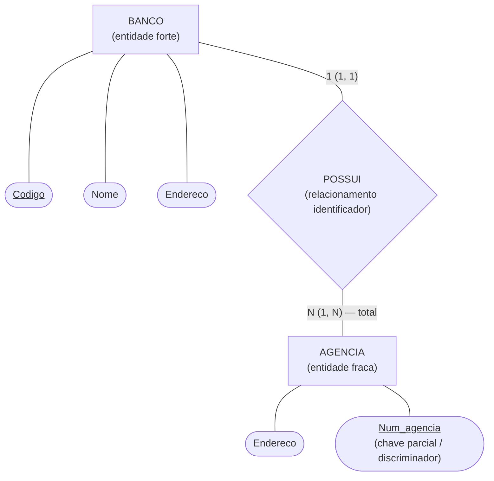
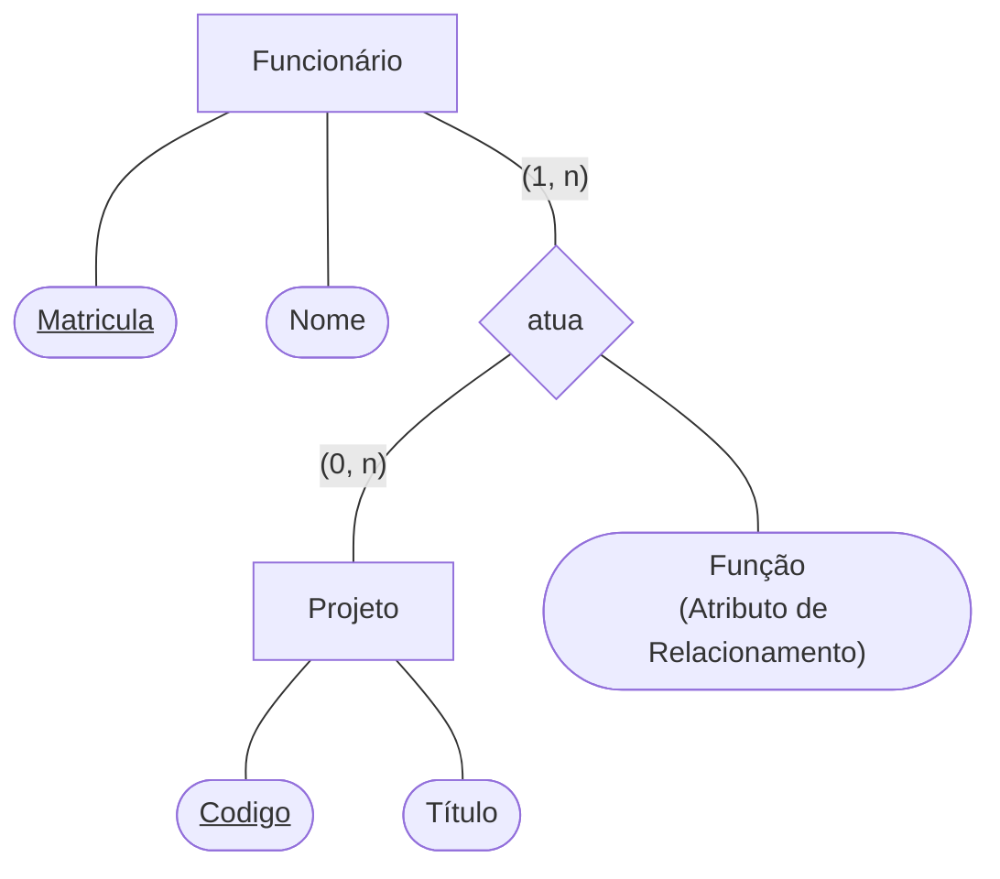
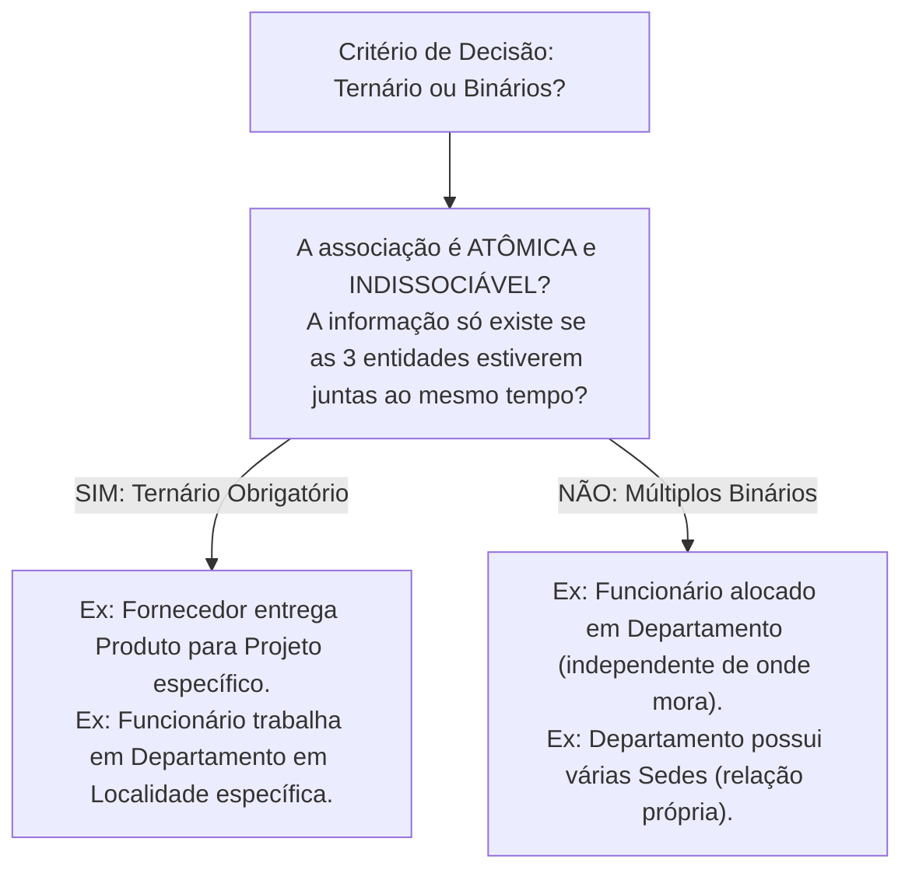
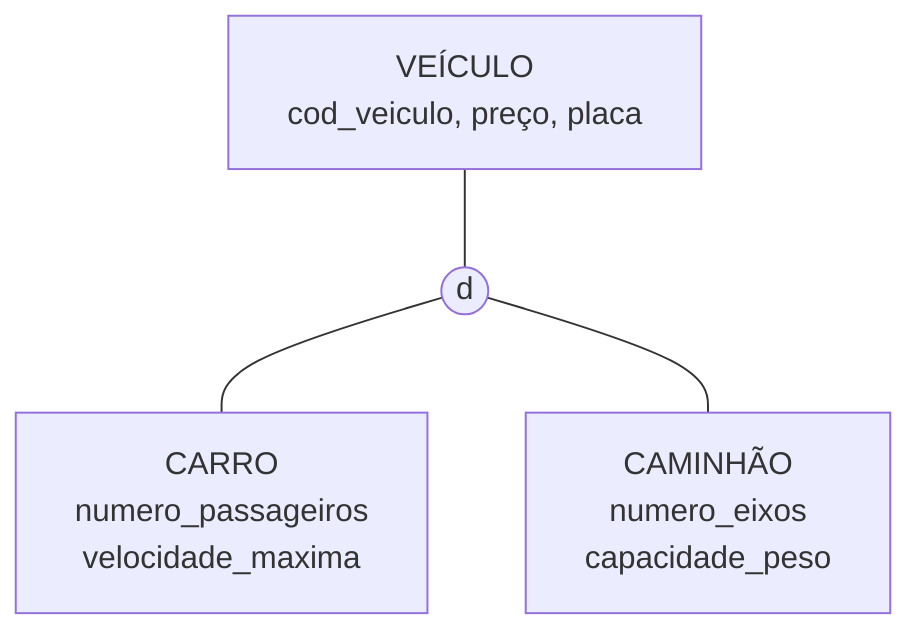

# Modelo de entidades e relacionamentos estendido: entidades fracas, relacionamentos ternários e supertipos/subtipos

> **Contexto:** Estudo do Modelo Entidade-Relacionamento Estendido (EER / MER Estendido) integrando os exemplos de aula da PUC Minas: entidades fortes e fracas, atributos em relacionamentos N:M, relacionamentos ternários, supertipos e subtipos, generalização e especialização, herança, disjunção e sobreposição, além de totalidade e parcialidade nas hierarquias.

---

## Introdução

À medida que os sistemas de informação modernos tornam-se mais complexos, o Modelo Entidade-Relacionamento básico proposto em 1976 precisou ser expandido. Surgiu então o **Modelo Entidade-Relacionamento Estendido (EER - *Enhanced Entity-Relationship*)**, que incorporou conceitos de abstração avançada, modelagem de dependências existenciais complexas e conexões semânticas de ordem superior.

Nesta sessão, abordamos quatro grandes pilares do MER Estendido com base nas aulas da PUC Minas:
1. **Entidades fortes (*regulares*) vs. Entidades fracas (*dependentes*):** como modelar elementos que não possuem chave primária própria e dependem da existência de outra entidade (exemplo clássico: `Banco` e `Agência`);
2. **Atributos em relacionamentos $N:M$:** propriedades que pertencem exclusivamente à associação entre entidades (exemplo: `Funcionário` atua em `Projeto` exercendo uma `Função`);
3. **Modelagem de relacionamentos de grau superior (binários vs. ternários):** como ler e calibrar cardinalidades em associações de grau 3 (exemplo: `Funcionário`, `Departamento` e `Localidade`) e a regra de decisão entre binário e ternário;
4. **Supertipos, subtipos e restrições de especialização:** como separar propriedades gerais e específicas, interpretar herança, distinguir generalização de especialização e combinar disjunção/sobreposição com totalidade/parcialidade.

---

## 1. Entidades fortes (*regulares*) vs. entidades fracas (*dependentes*)

Nem todas as entidades do mundo real possuem independência existencial ou atributos suficientes para gerar uma chave primária própria e única no universo global.

### a. A metáfora do depósito bancário (Feynman)
> Imagine que um amigo lhe peça: *"Por favor, faça um depósito para mim na Agência 1045"*. 
> Imediatamente você perguntará: *"Mas em qual banco?"*.
> 
> O número `1045` sozinho não tem significado global, pois tanto o Banco do Brasil, o Itaú, a Caixa Econômica quanto o Bradesco podem ter uma agência de número `1045`. A `AGÊNCIA` **não tem vida própria**: ela precisa compulsoriamente estar atrelada a uma entidade forte (`BANCO`) para que sua identidade seja estabelecida.

---

### b. Anatomia e representação gráfica no DER de Chen (Slide Oficial de Aula)

No DER de Peter Chen, os elementos dependentes são representados por **contornos duplos**:

| Elemento no DER | Símbolo gráfico de Chen | Função no modelo | Exemplo de aula |
| :--- | :--- | :--- | :--- |
| **Entidade forte (*regular*)** | Retângulo simples | Possui chave primária autossuficiente (`Codigo`). | `BANCO` |
| **Entidade fraca (*dependente*)** | **Retângulo duplo** | Não possui chave primária própria; depende da entidade forte. | `AGENCIA` |
| **Relacionamento identificador** | **Losango duplo** | Vínculo estrutural que transfere a chave da dona para a fraca. | `POSSUI` |
| **Chave parcial (*discriminador*)** | Elipse com **sublinhado tracejado** | Diferencia as agências subordinadas a um mesmo banco. | `Num_agencia` |
| **Participação da fraca** | **Linha dupla** (compulsória) | Toda agência precisa pertencer a um banco ($min = 1$). | `===` |

> **Formação da Chave Primária:** No banco de dados relacional (modelo lógico), a chave primária da tabela `Agencia` será uma **chave composta**: `(Codigo_Banco + Num_agencia)`.

---

## 2. Atributos em relacionamentos $N:M$ (Slide Oficial de Aula)

Quando uma informação só passa a existir a partir da conjunção factual de duas entidades em uma associação Muitos para Muitos ($N:M$), essa propriedade deve ser ligada diretamente ao **losango do relacionamento**.

### O caso real: Funcionário atua em Projeto

Considere o relacionamento `atua` entre `Funcionário` e `Projeto`:
* Um funcionário possui `Matrícula` (chave primária) e `Nome`.
* Um projeto possui `Código` (chave primária) e `Título`.
* Um funcionário atua em $1$ a $N$ projetos `(1, n)`.
* Um projeto pode contar com $0$ a $N$ funcionários `(0, n)`.

### Onde alocar o atributo `Função`?
* **Poderia ficar em `Funcionário`?** Não, pois o mesmo colaborador (ex.: Maria) pode atuar como *desenvolvedora* no Projeto Alpha e como *líder técnica* no Projeto Beta.
* **Poderia ficar em `Projeto`?** Não, pois um mesmo projeto possui dezenas de profissionais desempenhando funções distintas (*arquiteto*, *tester*, *designer*).
* **No relacionamento `atua`:** Correto! A `Função` descreve exatamente o papel desempenhado por aquele funcionário específico naquele projeto específico.

---

## 3. Grau do relacionamento: binário vs. ternário (Grau 3)

O **grau de um relacionamento** indica a quantidade de entidades conectadas pelo mesmo losango.

* **Grau 2 (Binário):** Conecta exatamente 2 entidades (ex.: `Funcionário` e `Projeto`).
* **Grau 3 (Ternário):** Conecta **3 entidades simultaneamente** para que a transação ou alocação semântica do mini-mundo fique completa.
* **Grau $N$ ($N$-ário):** Conexões com 4 ou mais entidades (raras na prática devido à complexidade).

---

## 4. Análise aprofundada do relacionamento ternário de aula

Analisamos a estrutura conceitual do slide de aula da PUC Minas que modela a alocação de pessoal:

### Como fazer a leitura da cardinalidade no ternário (*Pares de ocorrências*)
Em um relacionamento ternário, para determinar a cardinalidade de uma das entidades, deve-se **fixar um par de ocorrências das outras duas entidades**:

> **A regra do "1" destacado no slide de aula:**
> *"O número **1** na linha de `Localidade` expressa que: Cada par de ocorrências **(Funcionário, Departamento)** está associado a no máximo uma única localidade."*

* **Leitura prática do mini-mundo:**
  1. Se pegarmos o funcionário *Carlos* trabalhando no *Departamento Financeiro*, esse vínculo ocorre em apenas **1** localidade física (ex.: *Filial Belo Horizonte*);
  2. A `Data_Inicio` representa o momento em que aquele funcionário iniciou o trabalho naquele departamento naquela localidade específica.

---

## 5. Como decidir entre relacionamento ternário ou múltiplos binários?

Um dos maiores desafios de projeto é saber quando um problema exige um relacionamento ternário ou se pode ser decomposto em associações binárias simples.

### O teste da perda semântica (Regra de ouro)
Se você decompor uma associação ternária em dois ou três relacionamentos binários independentes e **perder a rastreabilidade da transação**, o ternário é obrigatório.

* **Cenário de Fornecimento:** Se tivermos `Fornecedor-Produto` e `Produto-Projeto` separados, saberemos quais produtos a empresa compra e quais projetos existem, mas **não saberemos qual fornecedor entregou o lote utilizado em determinado projeto**. O ternário é indispensável para preservar o histórico semântico sem inconsistências.

---

## 6. Critérios de decisão: atributo vs. entidade separada

| Situação no mini-mundo | Decisão recomendada | Justificativa técnica |
| :--- | :--- | :--- |
| Dado atômico, monovalorado e sem atributos próprios (ex.: `peso`, `cor`, `data_nasc`). | **Modelar como Atributo**. | Simplicidade estrutural; não gera redundância. |
| Dado multivalorado ou que possui propriedades próprias (ex.: `Editora` com `cnpj` e `telefone`). | **Promover a Entidade Independente**. | Evita anomalias de atualização e normaliza a base. |
| Dado compartilhado por múltiplos registros (ex.: `Cidade`, `Categoria`, `Departamento`). | **Promover a Entidade com Relacionamento**. | Garante consistência e integridade referencial. |

---

## 7. Supertipos e subtipos: separar o geral do específico

Na modelagem de supertipos e subtipos, o objetivo é separar aquilo que pertence a uma categoria mais geral daquilo que só vale para grupos específicos dessa categoria.

* **Supertipo:** entidade mais geral, que concentra atributos e relacionamentos compartilhados.
* **Subtipo:** entidade mais específica, que representa um subconjunto das ocorrências do supertipo e acrescenta características próprias.
* **Herança:** uma ocorrência de um subtipo herda os atributos e os relacionamentos definidos no supertipo.

A pergunta de controle é simples: **"X é um tipo de Y?"**. Se a resposta fizer sentido no domínio, pode haver relação de subtipo. `Carro` é um `Veículo`. `Caminhão` é um `Veículo`. Já `Endereço` não é uma `Pessoa`: nesse caso, normalmente existe um relacionamento entre entidades, e não uma hierarquia de supertipo/subtipo.

### O exemplo de aula: veículo, carro e caminhão

Antes da generalização, `CARRO` e `CAMINHÃO` podem aparecer como entidades independentes e repetir atributos como `preço`, `placa` e identificador do veículo. O modelo percebe essa repetição e extrai o que é comum para `VEÍCULO`.

| Nível | Atributos do exemplo | Leitura |
| :--- | :--- | :--- |
| `VEÍCULO` | `cod_veiculo`, `preço`, `placa` | Propriedades compartilhadas por todos os veículos. |
| `CARRO` | `numero_passageiros`, `velocidade_maxima` | Propriedades específicas dos carros. |
| `CAMINHÃO` | `numero_eixos`, `capacidade_peso` | Propriedades específicas dos caminhões. |

> **Leitura de Feynman:** é como retirar informações repetidas de duas fichas e colocá-las em uma ficha-mãe. As fichas de `CARRO` e `CAMINHÃO` passam a guardar apenas o que realmente as diferencia. O círculo com `d` representa a restrição de disjunção; as linhas não têm setas porque a hierarquia não descreve um fluxo.

Essa abstração reduz **redundância conceitual** no DER e deixa explícita a regra de que carro e caminhão compartilham uma mesma identidade mais geral: ambos são veículos.

---

## 8. Generalização e especialização

Generalização e especialização descrevem movimentos opostos de raciocínio sobre a mesma hierarquia.

| Processo | Direção do raciocínio | Pergunta típica | Exemplo |
| :--- | :--- | :--- | :--- |
| **Generalização** | Do específico para o geral | "O que estas entidades têm em comum?" | `CARRO` + `CAMINHÃO` → `VEÍCULO`. |
| **Especialização** | Do geral para o específico | "Quais grupos deste tipo precisam de propriedades próprias?" | `CLIENTE` → `CLIENTE ESPECIAL`. |

Na **generalização**, começamos com conceitos separados e reconhecemos características compartilhadas. Na **especialização**, começamos com um conceito amplo e criamos subtipos para representar diferenças relevantes no domínio.

A aula relaciona essa ideia à classificação biológica: várias espécies compartilham propriedades que permitem reuni-las em categorias mais gerais. Esse modelo mental também antecipa uma estrutura encontrada na orientação a objetos, mas os dois modelos têm propósitos distintos.

---

## 9. Disjunção e sobreposição: em quantos subtipos uma ocorrência pode estar?

A primeira restrição da especialização responde: **uma mesma ocorrência do supertipo pode pertencer simultaneamente a mais de um subtipo?**

### Disjunção: símbolo `d`

Uma especialização é **disjunta** quando uma ocorrência pode pertencer a **no máximo um** dos subtipos daquela especialização.

No exemplo de aula, `VEÍCULO` é especializado em `CARRO` e `CAMINHÃO`. Se a regra do domínio disser que um veículo não pode ser classificado nas duas categorias ao mesmo tempo, a especialização é disjunta.

### Sobreposição: símbolo `o`

Uma especialização é **sobreposta** quando uma mesma ocorrência pode pertencer simultaneamente a mais de um subtipo.

Um exemplo é `PESSOA` especializada em `FUNCIONÁRIO` e `CLIENTE`: uma pessoa pode trabalhar em um banco e também ser cliente desse banco.

O exemplo de `PEÇA` também depende da regra de negócio. Se existirem os subtipos `PEÇA FABRICADA` e `PEÇA FORNECIDA` e uma mesma peça puder pertencer às duas categorias, a especialização é sobreposta.

> O símbolo `d` ou `o` não descreve se a classificação é obrigatória. Ele responde apenas quantos subtipos podem conter a mesma ocorrência.

---

## 10. Totalidade e parcialidade: toda ocorrência precisa ser classificada?

A segunda restrição responde outra pergunta: **toda ocorrência do supertipo precisa pertencer a pelo menos um subtipo?**

* **Totalidade:** toda ocorrência do supertipo precisa estar em pelo menos um subtipo. Na notação apresentada em aula, usa-se **linha dupla**.
* **Parcialidade:** podem existir ocorrências do supertipo que não pertencem a nenhum dos subtipos apresentados. Na notação de aula, usa-se **linha simples**.

Essa dimensão é independente de disjunção e sobreposição. Por isso, existem quatro combinações:

| Combinação | Regra |
| :--- | :--- |
| **Disjunta e total** | Toda ocorrência pertence a exatamente um dos subtipos. |
| **Disjunta e parcial** | Uma ocorrência pode não pertencer a subtipo algum; se pertencer, será a apenas um. |
| **Sobreposta e total** | Toda ocorrência pertence a pelo menos um subtipo e pode pertencer a vários. |
| **Sobreposta e parcial** | Uma ocorrência pode não pertencer a nenhum subtipo ou pode pertencer a vários. |

Uma forma rápida de resolver exercícios é separar as duas perguntas:

1. **Pode estar em mais de um subtipo?** Sim = sobreposição; não = disjunção.
2. **Precisa estar em algum subtipo?** Sim = totalidade; não = parcialidade.

---

## 11. O exemplo de funcionário: duas especializações sobre o mesmo supertipo

O segundo exemplo de aula mostra uma ideia importante: **um mesmo supertipo pode participar de mais de uma especialização**, porque cada especialização pode representar uma dimensão diferente do domínio.

### Especialização por função: disjunta e parcial

`FUNCIONÁRIO` é especializado em `SECRETÁRIA`, `TÉCNICO` e `ENGENHEIRO`.

* É **disjunta** se um funcionário só puder ocupar uma dessas categorias dentro dessa classificação.
* É **parcial** porque pode existir funcionário que não pertença a nenhuma delas. O slide apresenta `GERENTE` fora desse conjunto.

### Especialização por forma de pagamento: disjunta e total

`FUNCIONÁRIO` também é especializado em `FUNCIONÁRIO MENSAL` e `FUNCIONÁRIO HORISTA`.

* É **disjunta** se um funcionário não puder ser mensal e horista ao mesmo tempo.
* É **total** se todo funcionário precisar ser classificado em uma dessas formas de pagamento.

O exemplo ainda mostra que subtipos podem acrescentar **relacionamentos**, e não apenas atributos. `GERENTE` participa do relacionamento `GERENCIA` com `PROJETO`, enquanto `FUNCIONÁRIO HORISTA` participa de `PERTENCE_A` com `SINDICATO`.

Isso reforça a definição de herança no MER Estendido: o subtipo recebe os atributos e relacionamentos do supertipo e pode acrescentar estrutura própria.

### Matriz de leitura das restrições

| Pergunta | Resposta possível | Restrição |
| :--- | :--- | :--- |
| Uma ocorrência pode pertencer a mais de um subtipo? | Não | Disjunção (`d`) |
| Uma ocorrência pode pertencer a mais de um subtipo? | Sim | Sobreposição (`o`) |
| Toda ocorrência precisa pertencer a algum subtipo? | Sim | Totalidade, linha dupla |
| Toda ocorrência precisa pertencer a algum subtipo? | Não | Parcialidade, linha simples |

---

## 12. Ponte conceitual com orientação a objetos

O professor apresenta supertipos e subtipos como um conceito que antecipa ideias usadas depois na orientação a objetos. A aproximação é útil:

| MER Estendido | Orientação a objetos |
| :--- | :--- |
| Supertipo | Superclasse / classe base |
| Subtipo | Subclasse / classe derivada |
| Herança de atributos e relacionamentos | Herança de estado e comportamento |
| Generalização | Extração de uma abstração comum |
| Especialização | Criação de tipos mais específicos |

A equivalência, porém, não é perfeita. O **DER modela a estrutura conceitual dos dados e as regras do domínio**. Uma **hierarquia de classes modela tipos de software, estado e comportamento**. Um bom DER pode inspirar classes, mas não deve ser convertido mecanicamente em código.

Essa ponte aparece diretamente em [[01. Programacao Modular/15. Herança (generalização, especialização e extensibilidade modular)|Herança em programação modular]], onde generalização e especialização passam do modelo conceitual para hierarquias de classes.

---

## 13. Matriz comparativa dos recursos do MER Estendido

| Elemento conceitual | Símbolo no DER de Chen | Exemplo oficial de aula | Regra estrutural de integridade |
| :--- | :--- | :--- | :--- |
| **Entidade forte (*regular*)** | Retângulo simples. | `BANCO`, `Funcionário`. | Possui chave primária própria (`Codigo`, `Matricula`). |
| **Entidade fraca (*dependente*)** | **Retângulo duplo**. | `AGENCIA`. | Chave composta = chave da dona + discriminador. |
| **Relacionamento identificador** | **Losango duplo**. | `POSSUI` (Banco $\to$ Agência). | Transfere a chave identificadora da entidade forte. |
| **Chave parcial (*discriminador*)** | Elipse com texto sublinhado tracejado. | `Num_agencia`. | Identifica a ocorrência fraca dentro da mesma dona. |
| **Atributo de relacionamento** | Elipse ligada ao losango. | `Função` (no vínculo `atua`). | Dado exclusivo da combinação do par $(N:M)$. |
| **Relacionamento ternário** | Losango ligado a 3 entidades. | `Trabalha_em` (Func, Depto, Loc). | Associação atômica lida por pares de ocorrências. |
| **Supertipo** | Entidade geral ligada à especialização. | `VEÍCULO`, `FUNCIONÁRIO`. | Concentra atributos e relacionamentos herdados pelos subtipos. |
| **Subtipo** | Entidade específica abaixo do supertipo. | `CARRO`, `CAMINHÃO`, `FUNCIONÁRIO HORISTA`. | Representa subconjunto do supertipo e pode acrescentar propriedades próprias. |
| **Disjunção** | Círculo com `d`. | `CARRO` ou `CAMINHÃO`. | Uma ocorrência pertence a no máximo um subtipo da especialização. |
| **Sobreposição** | Círculo com `o`. | `FUNCIONÁRIO` e `CLIENTE`. | Uma ocorrência pode pertencer simultaneamente a vários subtipos. |
| **Totalidade** | Linha dupla entre supertipo e especialização. | `FUNCIONÁRIO` → mensal ou horista. | Toda ocorrência deve estar em pelo menos um subtipo. |
| **Parcialidade** | Linha simples entre supertipo e especialização. | `FUNCIONÁRIO` → secretária, técnico ou engenheiro. | Podem existir ocorrências fora dos subtipos apresentados. |

---

## Referências bibliográficas

### Bibliografia básica
* HEUSER, Carlos Alberto. **Projeto de banco de dados**. 6. ed. Porto Alegre: Bookman, 2009. (Capítulo 3: *Extensões ao modelo entidade-relacionamento*, p. 49-78). ISBN 9788577804528.
* ELMASRI, Ramez; NAVATHE, Shamkant B. **Sistemas de banco de dados**. 7. ed. São Paulo: Pearson, 2018. (Capítulo 4: *Modelagem de dados conceituais aprimorada: o modelo EER*, p. 86-118). ISBN 9788543025001.
* SILBERSCHATZ, Abraham; KORTH, Henry F.; SUDARSHAN, S. **Sistema de banco de dados**. 7. ed. Rio de Janeiro: Elsevier, GEN LTC, 2020. (Capítulo 6: *Recursos estendidos do modelo E-R*, p. 205-235). ISBN 9788595157477.

### Bibliografia complementar
* CHEN, Peter Pin-Shan. **The entity-relationship model: toward a unified view of data**. ACM Transactions on Database Systems (TODS), v. 1, n. 1, p. 9-36, 1976.
* DATE, C. J. **Introdução a sistemas de bancos de dados**. 8. ed. Rio de Janeiro: Elsevier, Campus, 2004. ISBN 9788535212730.
* MACHADO, Felipe Nery Rodrigues. **Banco de dados: projeto e implementação**. 4. ed. São Paulo: Érica, 2020. ISBN 9788536533032.

---

## Materiais complementares recomendados

* **Conheça mais sobre entidades fracas, fortes e associativas:** [O que são entidades forte, fraca e associativa?](https://www.youtube.com/watch?v=ppJkFuqPU8k) — Vídeo explicativo sobre a diferenciação prática entre entidades regulares (fortes), entidades dependentes de identificação (fracas) e entidades associativas no MER.

---

## Artigos relacionados e navegação

* **Artigo anterior:** [[06. Modelagem de relacionamentos, cardinalidade e restrições de participação]]
* **Próximo artigo:** [[08. Conceitos do modelo relacional e chave primária]]
* **Resumo da disciplina:** [[00. Modelagem de Dados - Resumo]]
* **Glossário da matéria:** [[Glossário de conceitos]]
* **Índice geral do vault:** [[index.md|Página Inicial do Vault]]
