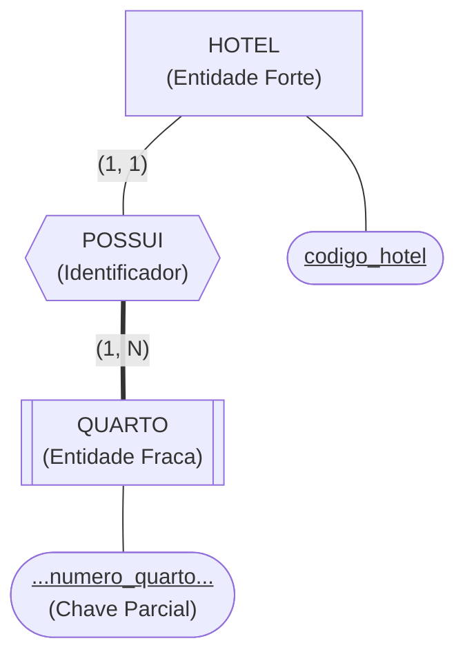
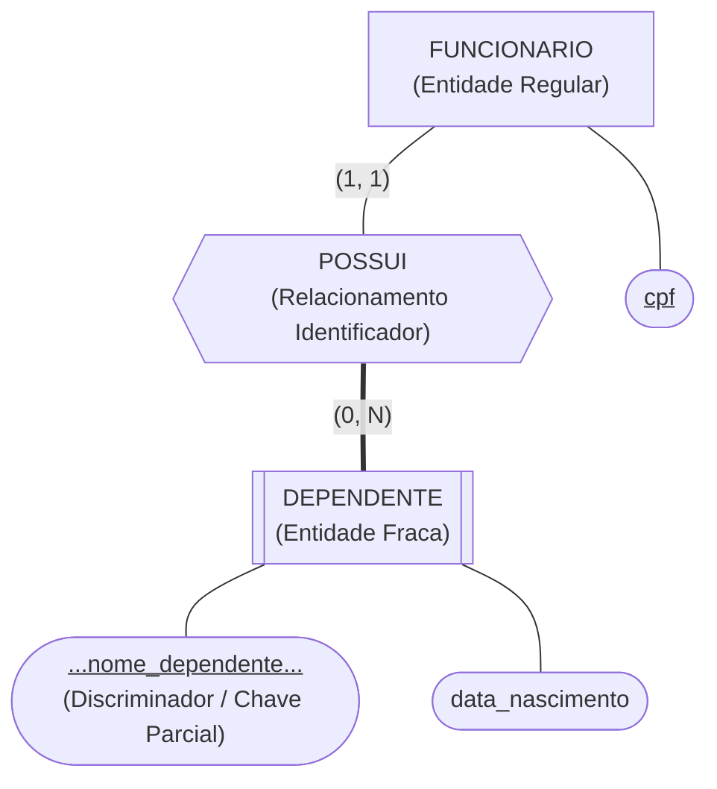
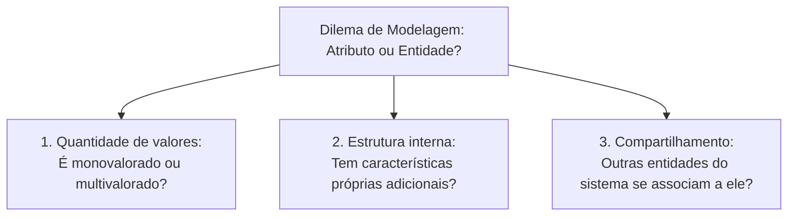
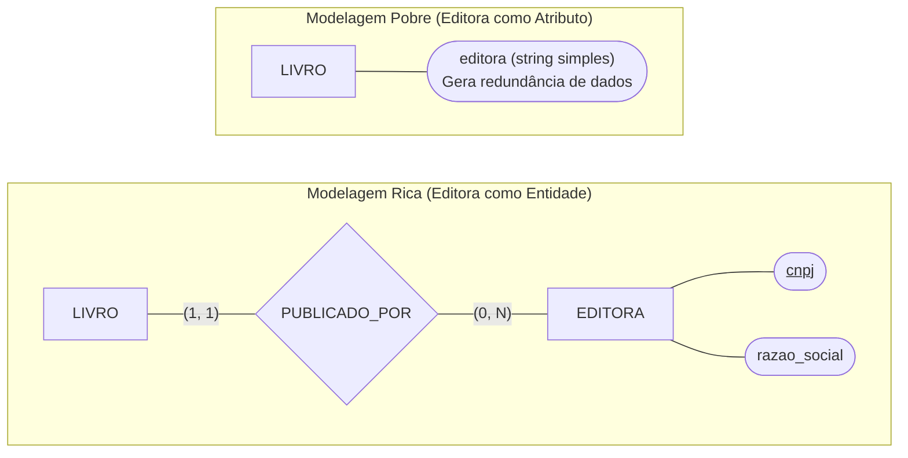
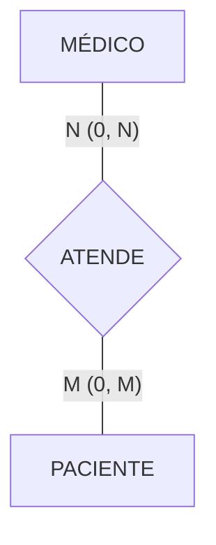
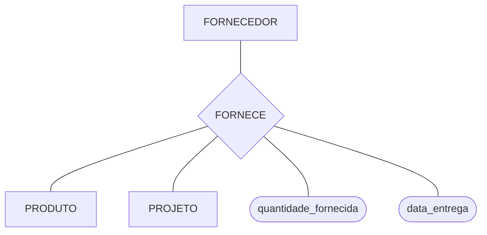
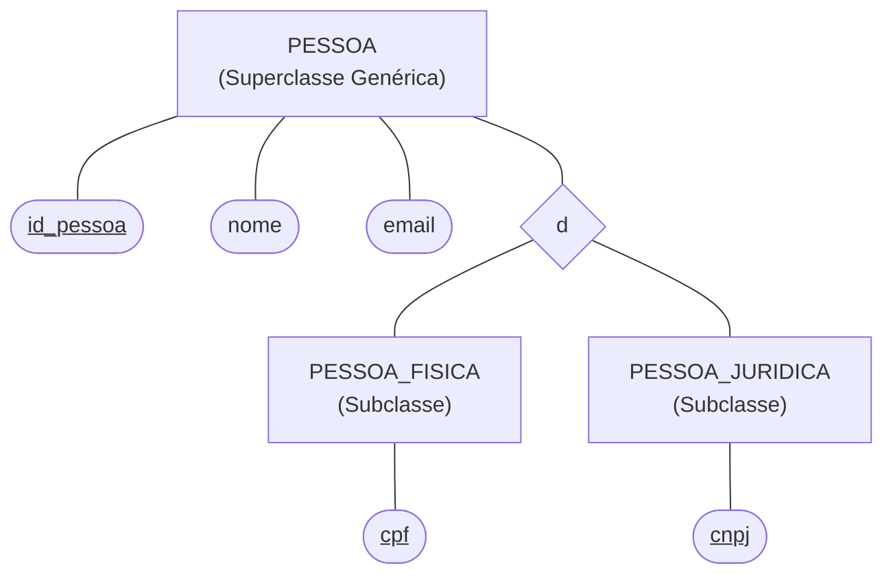

# Modelo de entidades e relacionamentos estendido: entidades fracas, ternárias e abstrações avançadas

> **Contexto:** Estudo do Modelo Entidade-Relacionamento Estendido (EER / MER Estendido), aprofundando a diferenciação entre entidades fortes e entidades fracas, a chave parcial (discriminador), o relacionamento identificador, as regras de modelagem para atributos vs. relacionamentos, a distinção semântica entre relacionamentos binários e ternários, e as noções de especialização e generalização com herança de atributos.

---

## Introdução

À medida que os sistemas de informação modernos tornam-se mais complexos, o Modelo Entidade-Relacionamento básico proposto em 1976 precisou ser expandido. Surgiu então o **Modelo Entidade-Relacionamento Estendido (EER - *Enhanced Entity-Relationship*)**, que incorporou conceitos de abstração avançada, modelagem de dependências existenciais complexas e conexões semânticas de ordem superior.

Nesta sessão, abordamos três grandes pilares do MER Estendido:
1. **Entidades fortes (*regulares*) vs. Entidades fracas (*dependentes*):** como modelar elementos que não possuem chave primária própria e dependem da existência de outra entidade;
2. **Critérios de decisão de projeto:** diretrizes claras para saber quando uma informação do negócio deve ser modelada como um **atributo** ou como uma **entidade separada ligada por relacionamento**;
3. **Modelagem de relacionamentos de grau superior (Binários vs. Ternários):** quando usar uma associação tripartite sem quebrar a semântica do mini-mundo.

---

## 1. As analogias de Feynman: o crachá do hóspede e o quarto de hotel

Para compreender entidades fracas e dependência de identificação sem decoreba técnica, analisamos duas metáforas do cotidiano:

### a. O quarto de hotel e o prédio do hotel
* **O cenário:** Imagine o quarto número `302`. Se dissermos apenas "Quarto 302", ninguém sabe onde ele fica no mundo. Ele pode existir no Hotel Copacabana Palace no Rio ou no Hotel Ibis em Belo Horizonte.
* **A entidade forte (*dona / proprietária*):** `HOTEL` (possui `cnpj` ou `codigo_hotel` único no país).
* **A entidade fraca (*dependente de identificação*):** `QUARTO` (possui apenas um identificador parcial/discriminador: `numero_quarto`).
* **A chave completa:** Para localizar o quarto no banco, precisamos obrigatoriamente da chave composta: `(codigo_hotel + numero_quarto)`.

---

### b. O dependente do plano de saúde corporativo
* **A entidade forte:** `FUNCIONARIO` (identificado exclusivamente pelo `cpf`).
* **A entidade fraca:** `DEPENDENTE` (identificado apenas pelo `nome_dependente` ou `grau_parentesco` relativo àquele funcionário).
* Se o funcionário sair da empresa, os registros dos seus dependentes deixam de fazer sentido no plano corporativo.

---

## 2. Anatomia gráfica da entidade fraca no DER de Chen

Na notação clássica de Peter Chen para o MER Estendido, a representação visual possui símbolos específicos de **duplo contorno**:

| Elemento conceitual | Representação visual em Chen | Sintaxe textual | Significado semântico |
| :--- | :--- | :--- | :--- |
| **Entidade forte (*regular*)** | Retângulo de linha simples | `[HOTEL]` | Possui chave primária própria e existência independente. |
| **Entidade fraca** | **Retângulo duplo** | `[[QUARTO]]` | Não possui chave primária completa; depende de uma entidade forte. |
| **Relacionamento identificador** | **Losango duplo** | `{{POSSUI}}` | Conecta a entidade fraca à sua entidade proprietária (*dona*). |
| **Chave parcial (*discriminador*)** | Elipse com **linha tracejada sob o texto** | `([<u>...num...</u>])` | Atributo que distingue instâncias da entidade fraca ligadas à mesma entidade forte. |
| **Participação da entidade fraca** | **Linha dupla** (total compulsória) | `===` | Toda instância fraca depende compulsoriamente da forte ($min = 1$). |

---

## 3. Critérios de projeto: quando representar como atributo ou como relacionamento?

Um dos dilemas mais comuns dos projetistas de banco de dados no nível conceitual é decidir: *"Isso deve ser um simples atributo ou uma nova entidade conectada por relacionamento?"*.

### Guia prático de decisão (Regras de ouro)

#### 1. Mantenha como atributo se:
* For um dado atômico, monovalorado e puramente descritivo;
* Não possuir atributos próprios derivados nem históricos associados;
* Não for referenciado por nenhuma outra entidade do mini-mundo.
* *Exemplo:* `cor_veiculo`, `data_nascimento`, `peso`.

#### 2. Promova a uma nova entidade ligada por relacionamento se:
* **Possuir atributos próprios:** Se você precisa guardar o endereço, telefone e responsável de uma `Editora`, ela não pode ser um mero atributo de texto `editora` na tabela `Livro`; ela deve ser uma entidade `EDITORA`.
* **For multivalorado com ciclo de vida independente:** Múltiplos telefones de contato ou múltiplas competências técnicas (`HABILIDADE`).
* **For compartilhado por múltiplos registros:** Vários livros compartilham a mesma editora ou vários alunos cursam a mesma disciplina (`DEPARTAMENTO`, `CIDADE`, `CATEGORIA`).

---

## 4. Relacionamentos binários vs. ternários

O grau de um relacionamento define a quantidade de entidades conectadas pelo mesmo losango. A transição de associações binárias para ternárias deve ser fundamentada na semântica da regra de negócio.

### a. Relacionamento binário
* Conecta exatamente duas entidades. Representa a esmagadora maioria dos casos em sistemas comerciais.

---

### b. Relacionamento ternário
* Conecta **três entidades simultaneamente**. É indispensável quando a ocorrência do relacionamento só é válida na **interseção combinada das três partes**.

#### Por que não substituir o ternário por três relacionamentos binários?
Se dividíssemos `FORNECE` em três binários independentes:
1. `Fornecedor Fornece Produto`
2. `Fornecedor Atende Projeto`
3. `Projeto Usa Produto`

**A perda semântica:** Saberíamos quais produtos a empresa compra e quais projetos existem, mas **perderíamos o rastreamento exato** de *qual fornecedor entregou qual lote de produto para qual projeto específico*. O relacionamento ternário amarra a tripla `(Fornecedor, Produto, Projeto)` como uma transação atômica única.

---

## 5. Especialização e generalização (herança de atributos no EER)

O MER Estendido introduz os conceitos de **Generalização (Superclasse / Entidade Genérica)** e **Especialização (Subclasse / Entidade Especializada)**, permitindo herança direta de atributos e relacionamentos (análogo à POO):

### Regras estruturais da especialização
1. **Herança de atributos:** `PESSOA_FISICA` e `PESSOA_JURIDICA` herdam automaticamente `id_pessoa`, `nome` e `email` da superclasse `PESSOA`, além de possuírem seus atributos específicos (`cpf` e `cnpj`).
2. **Classificação das restrições:**
   * **Disjunção (*Disjointness*):**
     * **Disjunta (`d`):** Uma instância só pode pertencer a uma subclasse por vez (uma pessoa ou é física ou é jurídica).
     * **Sobreposição (*Overlap - `o`*):** Uma instância pode pertencer a múltiplas subclasses simultaneamente (um funcionário pode ser simultaneamente `PROFESSOR` e `PESQUISADOR`).
   * **Completude (*Completeness*):**
     * **Total (Linha dupla):** Toda ocorrência da superclasse deve obrigatoriamente pertencer a uma subclasse.
     * **Parcial (Linha simples):** Pode existir uma ocorrência na superclasse que não pertença a nenhuma subclasse especializada.

---

## 6. Matriz comparativa dos recursos do MER Estendido

| Elemento conceitual | Símbolo no DER de Chen | Exemplo clássico | Regra de integridade |
| :--- | :--- | :--- | :--- |
| **Entidade regular (forte)** | Retângulo simples `[HOTEL]`. | `HOTEL`, `CLIENTE`. | Possui chave primária autossuficiente. |
| **Entidade dependente (fraca)** | Retângulo duplo `[[QUARTO]]`. | `QUARTO`, `DEPENDENTE`. | Chave composta = chave da dona + chave parcial. |
| **Relacionamento identificador** | Losango duplo `{{POSSUI}}`. | `HOTEL` *possui* `QUARTO`. | Vínculo de identificação da entidade fraca. |
| **Chave parcial (discriminador)** | Elipse com texto sublinhado tracejado. | `numero_quarto`. | Diferencia instâncias da mesma entidade dona. |
| **Relacionamento ternário** | Losango ligado a 3 entidades. | `FORNECEDOR`-`PRODUTO`-`PROJETO`. | Transação combinada tripartite atômica. |
| **Especialização / Generalização** | Círculo com triângulo (`d` ou `o`). | `PESSOA` $\to$ `PF` / `PJ`. | Herança de atributos e relacionamentos. |

---

## Referências bibliográficas

### Bibliografia básica
* HEUSER, Carlos Alberto. **Projeto de banco de dados**. 6. ed. Porto Alegre: Bookman, 2009. (Capítulo 3: *Extensões ao modelo entidade-relacionamento*, p. 49-78). ISBN 9788577804528.
* ELMASRI, Ramez; NAVATHE, Shamkant B. **Sistemas de banco de dados**. 7. ed. São Paulo: Pearson, 2018. (Capítulo 4: *Modelagem de dados conceituais aprimorada: o modelo EER*, p. 86-118). ISBN 9788543025001.
* SILBERSCHATZ, Abraham; KORTH, Henry F.; SUDARSHAN, S. **Sistema de banco de dados**. 7. ed. Rio de Janeiro: Elsevier, GEN LTC, 2020. (Capítulo 6: *Recursos estendidos do modelo E-R*, p. 205-235). ISBN 9788595157477.

### Bibliografia complementar
* CHEN, Peter Pin-Shan. **The entity-relationship model: toward a unified view of data**. ACM Transactions on Database Systems (TODS), v. 1, n. 1, p. 9-36, 1976.
* BATINI, Carlo; CERI, Stefano; NAVATHE, Shamkant B. **Conceptual database design: an entity-relationship approach**. Redwood City: Benjamin/Cummings, 1992. ISBN 9780805302448.
* DATE, C. J. **Introdução a sistemas de bancos de dados**. 8. ed. Rio de Janeiro: Elsevier, Campus, 2004. ISBN 9788535212730.

---

## Artigos relacionados e navegação

* **Artigo anterior:** [[06. Modelagem de relacionamentos, cardinalidade e restrições de participação]]
* **Próximo artigo:** [[08. Mapeamento do modelo conceitual (mer) para o modelo logico relacional]]
* **Resumo da disciplina:** [[00. Modelagem de Dados - Resumo]]
* **Glossário da matéria:** [[Glossário de conceitos]]
* **Índice geral do vault:** [[index.md|Página Inicial do Vault]]
