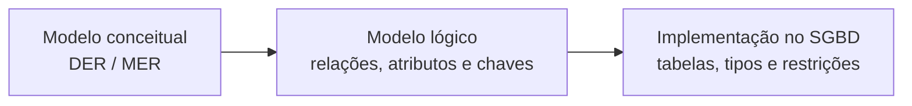
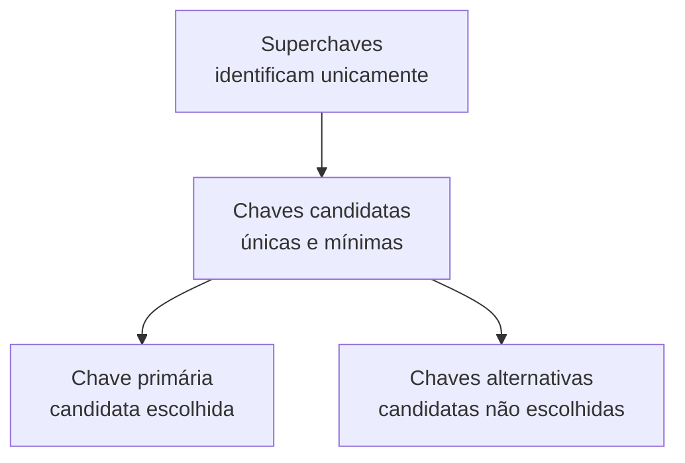
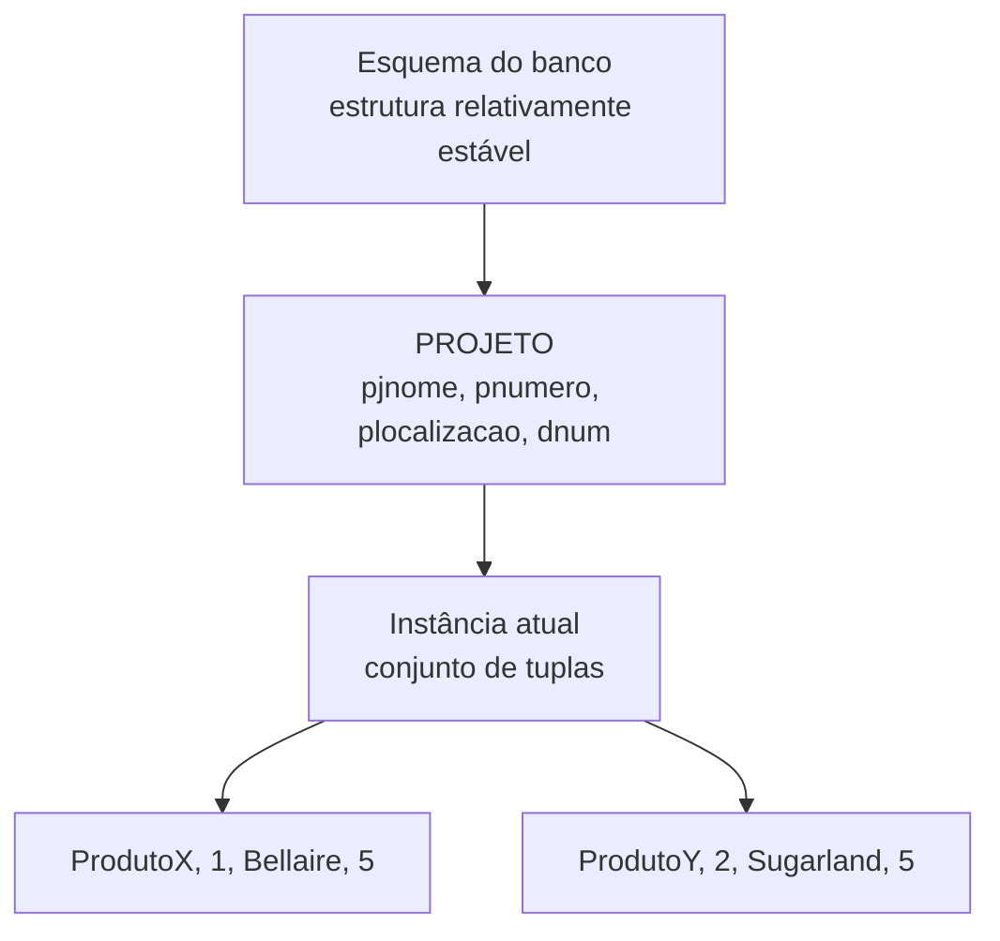

# Conceitos do modelo relacional e chave primária

> **Contexto:** Sessão da PUC Minas intitulada **"Conceitos do Modelo Relacional e Chave Primária"**, que inicia o estudo do projeto de bancos de dados relacionais. A aula apresenta a origem do modelo relacional em Edgar F. Codd, a passagem do esquema conceitual para estruturas tabulares e os conceitos de relação, tupla, atributo, domínio, esquema de relação, instância, chave candidata, chave primária, chave alternativa e chave composta.

---

## 1. De um DER para um banco relacional

Até aqui, a modelagem esteve concentrada principalmente em representar o **mini-mundo** por meio de entidades, atributos, relacionamentos, cardinalidades e especializações. O próximo passo é transformar essa descrição conceitual em uma estrutura que um SGBD relacional consiga armazenar. No modelo relacional, a organização central passa a ser feita por **relações**, que na prática são apresentadas como tabelas. A ideia pode ser vista como uma mudança de pergunta:

* No DER perguntamos: **"quais entidades existem e como elas se relacionam?"**
* No modelo relacional perguntamos: **"como esses dados serão organizados em relações com atributos, tuplas e chaves?"**

O modelo relacional é, portanto, uma etapa essencial entre a compreensão do domínio e sua implementação em SQL.

---

## 2. Codd e a origem do modelo relacional

Edgar F. Codd, pesquisador da IBM, publicou em **1970** o artigo *A Relational Model of Data for Large Shared Data Banks*. A proposta apresentou um modelo baseado em relações matemáticas e buscava separar a maneira como o usuário pensa os dados da forma física como esses dados são armazenados. Naquele momento, o modelo era principalmente uma **proposta teórica**. Isso é um pouco diferente de dizer que "não havia máquinas capazes de executá-lo": computadores e sistemas de bancos de dados já existiam, mas ainda não havia uma implementação industrial madura do modelo relacional proposto por Codd. A IBM iniciou o projeto **System R em 1973** para testar o modelo relacional em uma implementação de grande porte. O trabalho desenvolvido ao longo da década de 1970 também ajudou a consolidar SQL. Na década de 1980, produtos relacionais comerciais ganharam espaço, como o IBM DB2, lançado em 1983.

Apesar de diferentes fornecedores possuírem implementações, dialetos e decisões técnicas próprias, produtos relacionais compartilham uma base conceitual comum: relações, atributos, tuplas, domínios, chaves e operações sobre conjuntos de dados.

> **Ajuste histórico importante:** a data de 1974 pode aparecer associada a trabalhos e protótipos do período, mas o programa System R da IBM começou em 1973. O artigo fundador de Codd é de 1970.

---

## 3. Por que "relacional"?

O termo **relacional** vem da noção matemática de **relação**, ligada à teoria dos conjuntos. Uma relação pode ser entendida, de forma inicial, como um **conjunto de tuplas que obedecem à mesma estrutura**. No uso cotidiano de bancos de dados, é comum dizer:

> relação ≈ tabela

Essa aproximação é muito útil para aprender, mas existe uma diferença formal. Uma relação matemática é um **conjunto**, portanto não possui tuplas duplicadas e não depende da ordem das linhas. Uma tabela SQL pode permitir linhas duplicadas caso nenhuma restrição impeça isso. Por isso, "tabela" é a materialização prática mais próxima da relação, mas os dois conceitos não são rigorosamente idênticos. Também é importante não confundir **relação** com **relacionamento**:

* **Relação**, no modelo relacional: estrutura formada por atributos e tuplas.
* **Relacionamento**, no MER/DER: associação semântica entre tipos de entidades.

---

## 4. Anatomia de uma relação

Considere uma relação simplificada de empregados:

| SSN | primeiro_nome | sobrenome | data_nascimento | sexo | salario | dno |
| :--- | :--- | :--- | :--- | :--- | ---: | ---: |
| 123456789 | John | Smith | 1965-01-09 | M | 30000 | 5 |
| 333445555 | Franklin | Wong | 1955-12-08 | M | 40000 | 5 |
| 999887777 | Alicia | Zelaya | 1968-01-19 | F | 25000 | 4 |

Essa estrutura contém os componentes fundamentais do modelo relacional.

### Relação

A **relação** é o conjunto de dados estruturado segundo um mesmo esquema. No exemplo, a relação poderia se chamar `EMPREGADO`.

### Tupla

Uma **tupla** representa uma ocorrência da relação. Na visualização tabular, corresponde a uma linha. A tupla:

`(123456789, John, Smith, 1965-01-09, M, 30000, 5)`

representa um empregado específico. Na teoria relacional:

* as tuplas de uma relação são distintas;
* a ordem das tuplas não possui significado lógico;
* mover uma linha para cima ou para baixo não altera a relação.

Essa última regra é importante: se uma consulta precisa de uma ordem específica, essa ordenação deve ser solicitada explicitamente, por exemplo com `ORDER BY` em SQL.

### Atributo

Um **atributo** é uma característica descrita pela relação. Em uma tabela, aparece como o cabeçalho de uma coluna. No exemplo: `SSN`, `primeiro_nome`, `data_nascimento`, `sexo` e `salario` são atributos. A interseção entre uma tupla e um atributo deve conter **um único valor atômico** naquele ponto da relação.

---

## 5. Grau de uma relação

O **grau de uma relação** é a quantidade de atributos presentes em seu esquema. Se temos:

`EMPREGADO(SSN, primeiro_nome, sobrenome, data_nascimento, sexo, salario, dno)`

existem sete atributos. Logo:

> **grau de EMPREGADO = 7**

Na notação geral:

`R(A1, A2, ..., An)`

temos:

* `R`: nome da relação;
* `A1, A2, ..., An`: atributos;
* `n`: quantidade de atributos;
* portanto, `n` é o **grau da relação**.

### Cuidado com a palavra "grau"

Esse termo já apareceu anteriormente em [[06. Modelagem de relacionamentos, cardinalidade e restrições de participação|modelagem de relacionamentos]], mas com outro significado.

| Contexto | O que "grau" significa |
| :--- | :--- |
| Relacionamento no MER | Número de tipos de entidades participantes do relacionamento. |
| Relação no modelo relacional | Número de atributos da relação. |

Assim, um relacionamento ternário no MER possui grau 3 porque conecta três tipos de entidades. Já uma relação com dez colunas possui grau 10.

---

## 6. Esquema de relação: a estrutura

O **esquema de relação** descreve a estrutura estável da relação. A notação geral é:

`R(A1, A2, ..., An)`

Um exemplo concreto:

`DEPARTAMENTO(dnome, dnumero, gerssn, gerdata_inicio)`

O esquema informa **como a relação é definida**, e não quais dados ela contém neste momento. Podemos pensar no esquema como a planta de uma casa: ele define os cômodos e sua organização, mas não diz quem está sentado no sofá agora. No banco de dados, o esquema inclui principalmente:

* nome da relação;
* nomes dos atributos;
* domínios ou tipos esperados;
* chaves;
* restrições estruturais.

---

## 7. Instância de uma relação: os dados existentes agora

Enquanto o esquema representa a estrutura, a **instância da relação** representa o conjunto atual de tuplas armazenadas. A notação pode ser escrita como:

`r(R) = { t1, t2, ..., tm }`

onde:

* `R` é o esquema da relação;
* `r(R)` é uma instância de `R`;
* `t1, t2, ..., tm` são as tuplas existentes naquele momento;
* `m` é a quantidade atual de tuplas.

É melhor usar `m` para o número de tuplas e `n` para o número de atributos, evitando misturar duas medidas diferentes.

### Esquema versus instância

| Conceito | Pergunta que responde | Exemplo |
| :--- | :--- | :--- |
| **Esquema** | "Como esta relação é estruturada?" | `DEPARTAMENTO(dnome, dnumero, gerssn, gerdata_inicio)` |
| **Instância** | "Quais tuplas existem agora?" | Pesquisa, Administração, Sede administrativa etc. |

O esquema tende a mudar pouco. A instância muda constantemente com inserções, alterações e exclusões. Essa distinção retoma [[04. Níveis do sgbd e etapas do projeto de banco de dados|esquema e instância]] vistos anteriormente, agora aplicada diretamente ao modelo relacional.

---

## 8. Domínio: quais valores fazem sentido para um atributo?

Um **domínio** é o conjunto de valores válidos que um atributo pode assumir. Por exemplo:

* `sexo`: valores permitidos pelo domínio definido para o sistema;
* `salario`: números decimais não negativos dentro das regras da organização;
* `data_nascimento`: datas válidas, possivelmente limitadas por regras do domínio;
* `dnumero`: identificadores válidos de departamento.

Formalmente, para um atributo `Ai`:

`t[Ai] ∈ dom(Ai)`

Isso significa: o valor do atributo `Ai` em uma determinada tupla deve pertencer ao domínio permitido para esse atributo.

### Domínio não é apenas tipo de dado

Esse é um ponto importante da aula. Um **tipo físico** informa como o SGBD representa o valor: texto, inteiro, decimal, data etc. O **domínio lógico** informa quais valores fazem sentido naquele contexto. Por exemplo:

| Elemento | Exemplo |
| :--- | :--- |
| Tipo físico | `CHAR(1)` |
| Domínio lógico | `{'M', 'F'}` em um exemplo didático que adote apenas esses valores |
| Valor armazenado | `'M'` |

Dois atributos podem usar o mesmo tipo físico e possuir domínios completamente diferentes.

### O que significa `CHAR(1)`?

`CHAR` é um tipo textual de comprimento fixo. O número entre parênteses informa quantos caracteres o campo comporta. Assim:

* `CHAR(1)`: um caractere;
* `CHAR(2)`: dois caracteres;
* `CHAR(10)`: dez caracteres.

Um caractere pode ser uma letra, um algarismo ou outro símbolo permitido pela codificação usada pelo banco. Portanto, `CHAR(1)` descreve **forma de armazenamento**, não a regra lógica completa do atributo. É justamente por isso que domínio e tipo não devem ser tratados como sinônimos.

---

## 9. Valores nulos

Um atributo pode, dependendo das regras do esquema, admitir `NULL`. `NULL` representa **ausência de um valor conhecido ou aplicável**. Ele não significa:

* zero;
* string vazia `''`;
* espaço em branco `' '`;
* número negativo;
* valor falso.

Por exemplo, se a data de desligamento de um empregado ainda não existe porque ele continua trabalhando, o valor pode ser nulo caso o modelo permita. A interpretação exata depende da regra do domínio: em alguns casos `NULL` pode significar "desconhecido"; em outros, "não aplicável". Por isso, ele deve ser usado de forma deliberada.

---

## 10. Chaves: como identificar uma tupla sem ambiguidade?

Em uma relação, precisamos conseguir identificar uma tupla de maneira inequívoca. Considere:

`USUARIO(id, cpf, email, nome)`

Suponha que as regras do sistema garantam que `id`, `cpf` e `email` sejam individualmente únicos. Isso significa que existem várias formas possíveis de identificar um usuário.

### Superchave

Uma **superchave** é qualquer conjunto de atributos capaz de identificar uma tupla de forma única. Exemplos:

* `{id}`;
* `{cpf}`;
* `{email}`;
* `{id, email}`;
* `{id, cpf, email}`.

Os últimos exemplos conseguem identificar unicamente uma tupla, mas possuem atributos desnecessários.

### Chave candidata

Uma **chave candidata** é uma superchave que possui duas propriedades:

1. **Unicidade:** identifica no máximo uma tupla.
2. **Minimalidade:** nenhum atributo pode ser retirado sem perder a unicidade.

No exemplo: `{id}`, `{cpf}` e `{email}` podem ser chaves candidatas. Já `{id, email}` não é candidata se `id` sozinho já identifica o usuário. Ela não é mínima.

> **Minimalidade não significa "ter poucos caracteres".** Significa não possuir atributos logicamente redundantes na composição da chave.

---

## 11. Chave primária e chaves alternativas

Entre as chaves candidatas, uma é escolhida como **chave primária**. No exemplo:

`USUARIO(id, cpf, email, nome)`

podemos escolher:

> chave primária = `id`

As demais chaves candidatas passam a ser chamadas de **chaves alternativas**:

> chaves alternativas = `cpf`, `email`

Portanto:

A chave primária não é a única forma válida de localizar um registro. Se `email` for uma chave alternativa e sua unicidade estiver garantida pelo banco, é perfeitamente possível pesquisar um usuário por email. A escolha da chave primária define o **identificador principal da relação**, mas não elimina os outros identificadores válidos. Há uma distinção útil aqui:

* **Chave:** conceito lógico de identidade e integridade.
* **Índice:** estrutura física usada para acelerar certas buscas.

Um SGBD frequentemente cria índices para chaves primárias e restrições de unicidade, mas chave e índice não são o mesmo conceito.

---

## 12. Chave primária composta

Uma chave primária não precisa ser formada por um único atributo. Considere:

`MATRICULA(aluno_id, disciplina_id, semestre, nota)`

Se a regra disser que um aluno pode cursar uma mesma disciplina novamente em outro semestre, nenhum dos três primeiros atributos identifica sozinho uma matrícula. A identificação pode depender da combinação:

`(aluno_id, disciplina_id, semestre)`

Nesse caso, temos uma **chave primária composta**. A regra de minimalidade continua valendo:

* retirar `aluno_id`: várias matrículas diferentes podem permanecer iguais;
* retirar `disciplina_id`: idem;
* retirar `semestre`: uma repetição da disciplina em outro semestre ficaria indistinguível.

Logo, os três atributos são necessários para a identidade da tupla naquele modelo.

---

## 13. Como escolher uma chave primária?

Nem toda chave candidata possui a mesma qualidade prática como chave primária. Em geral, é desejável que a chave escolhida seja:

* estável ao longo do tempo;
* pequena;
* simples de comparar;
* sempre preenchida;
* pouco sujeita a mudanças nas regras de negócio.

Por exemplo, um email pode ser único, mas uma pessoa pode trocar de email. Um identificador interno criado pelo sistema tende a ser mais estável. Isso não significa que identificadores artificiais sejam sempre superiores. A decisão depende do domínio. A pergunta importante é:

> **"Qual identificador continuará representando esta mesma ocorrência mesmo se outros dados dela mudarem?"**

---

## 14. Esquema e instâncias do exemplo da aula

O slide da PUC apresenta um esquema relacional composto por relações como:

* `EMPREGADO`;
* `DEPARTAMENTO`;
* `DEPTO_LOCALIZACOES`;
* `PROJETO`;
* `TRABALHA_EM`;
* `DEPENDENTE`.

No esquema, vemos apenas nomes de relações e seus atributos:

`PROJETO(pjnome, pnumero, plocalizacao, dnum)`

Depois, o slide de instâncias mostra as tuplas efetivamente existentes em algumas dessas relações. Essa comparação visual resume a diferença:

O esquema continua sendo `PROJETO(pjnome, pnumero, plocalizacao, dnum)` mesmo quando projetos são inseridos ou removidos.

---

## 15. Modelo mental para prova

Uma forma curta de reconstruir os conceitos é pensar em uma planilha, mas impondo regras formais:

| Pergunta | Conceito |
| :--- | :--- |
| Qual é a estrutura completa? | Relação |
| O que uma linha representa? | Tupla |
| O que uma coluna representa? | Atributo |
| Quantos atributos existem? | Grau da relação |
| Quais valores são permitidos em um atributo? | Domínio |
| Como a relação é definida? | Esquema de relação |
| Quais tuplas existem neste momento? | Instância da relação |
| Quais atributos podem identificar unicamente uma tupla de forma mínima? | Chaves candidatas |
| Qual candidata foi escolhida como identificador principal? | Chave primária |
| O que acontece com as candidatas não escolhidas? | Tornam-se chaves alternativas |
| E se vários atributos forem necessários juntos? | Chave composta |

A sequência conceitual é:

`relação → atributos + tuplas → domínios → esquema/instância → chaves candidatas → chave primária`

---

## 16. Pontos que costumam gerar confusão

* **Relação não é relacionamento.** Relação é a estrutura do modelo relacional; relacionamento é uma associação no MER.
* **Tabela e relação são aproximações, não identidade formal.** Relações são conjuntos e não contêm tuplas duplicadas; uma tabela SQL pode conter duplicatas se o esquema permitir.
* **Ordem das linhas não faz parte da relação.** A posição visual de uma tupla não possui significado lógico.
* **Grau não é quantidade de linhas.** Grau é o número de atributos. A quantidade de tuplas de uma instância é outra medida, frequentemente chamada de cardinalidade da relação.
* **Tipo não é domínio.** `CHAR(1)` diz como um valor textual é representado; o domínio determina quais valores são válidos.
* **Chave candidata não é qualquer conjunto único.** Ela precisa ser única e mínima.
* **Chave primária não é a única chave pesquisável.** Chaves alternativas também identificam tuplas, desde que a restrição de unicidade seja preservada. ---
## 17. Ponte para SQL

Esses conceitos serão materializados diretamente em SQL. No nível conceitual e lógico, dizemos:

* relação;
* atributo;
* domínio;
* chave primária;
* chave alternativa;
* chave composta.

Na implementação, isso aparece por meio de recursos como:

* tabelas e colunas;
* tipos de dados;
* `PRIMARY KEY`;
* `UNIQUE`;
* `NOT NULL`;
* restrições de integridade.

A disciplina de [[03. Manipulacao de Dados SQL/00. Manipulacao de Dados SQL - Resumo|Manipulação de dados SQL]] trabalha justamente com a camada em que essas decisões passam a ser expressas na linguagem do SGBD.

---

## Referências bibliográficas

### Bibliografia básica
* ELMASRI, Ramez; NAVATHE, Shamkant B. **Sistemas de banco de dados**. 7. ed. São Paulo: Pearson Addison Wesley, 2018.
* HEUSER, Carlos Alberto. **Projeto de banco de dados**. 6. ed. Porto Alegre: Bookman, 2009.
* SILBERSCHATZ, Abraham; KORTH, Henry F.; SUDARSHAN, S. **Sistema de banco de dados**. 7. ed. Rio de Janeiro: Elsevier, GEN LTC, 2020.

### Bibliografia complementar
* CODD, Edgar F. **A relational model of data for large shared data banks**. Communications of the ACM, v. 13, n. 6, p. 377-387, 1970.
* IBM. **Edgar F. Codd: the inventor made relational databases possible**. IBM History.
* IBM. **What is a relational database?** IBM Think.

---

## Materiais complementares recomendados

* **Conheça mais sobre os conceitos dos BDs relacionais:** [Relational Database Concepts](https://www.youtube.com/watch?v=NvrpuBAMddw) *(legendas disponíveis)*.

---

## Artigos relacionados e navegação

* **Artigo anterior:** [[07. Modelo de entidades e relacionamentos estendido]]
* **Próximo artigo:** [[09. Integridade referencial e chave estrangeira]]
* **Resumo da disciplina:** [[00. Modelagem de Dados - Resumo]]
* **Glossário da matéria:** [[Glossário de conceitos]]
* **Índice geral do vault:** [[index.md|Página Inicial do Vault]]
