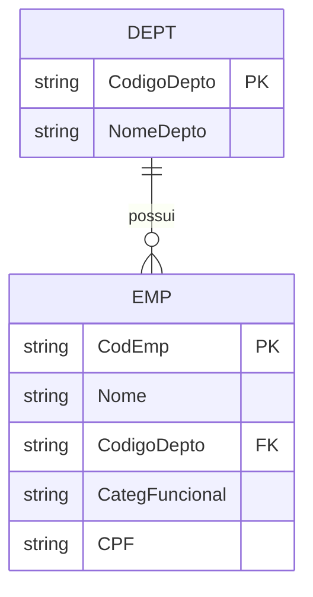

# Integridade referencial e chave estrangeira

> **Contexto:** Sessão da PUC Minas sobre **integridade referencial e chave estrangeira**, aprofundando como relações do modelo relacional são conectadas por chaves e como o SGBD preserva a consistência dos dados durante operações de inclusão, alteração e exclusão. A aula distingue integridade de domínio, de entidade, de chave e referencial e introduz ações como restrição, cascata, definição de nulo e valor padrão.

---

## 1. Do relacionamento do DER para a chave estrangeira

No modelo conceitual, duas entidades podem estar ligadas por um **relacionamento**. Quando esse modelo é transformado em um esquema relacional, uma das formas mais importantes de materializar essa ligação é a **chave estrangeira** (*foreign key*, FK).

Há um ajuste conceitual importante na formulação "a chave estrangeira é a implementação física de um relacionamento". A FK pertence ao **esquema lógico relacional**. Ela descreve uma regra entre relações. Depois, o SGBD implementa e fiscaliza essa regra na base de dados.

Em um relacionamento 1:N, a regra mais comum é:

> a chave primária da relação que está do lado **1** aparece como chave estrangeira na relação que está do lado **N**.

No exemplo da aula:

* `DEPT` representa departamentos;
* `EMP` representa empregados;
* `DEPT.CodigoDepto` identifica cada departamento;
* `EMP.CodigoDepto` informa a qual departamento cada empregado está associado.



O valor `D1` na coluna `EMP.CodigoDepto` não descreve o departamento inteiro. Ele funciona como uma **referência** para a tupla de `DEPT` cuja chave primária também vale `D1`.

---

## 2. O que é uma chave estrangeira?

Considere dois esquemas de relação:

`R1(A1, A2, ..., An)`

e

`R2(B1, B2, ..., Bm)`

Um conjunto de atributos de `R1` pode ser declarado como **chave estrangeira** quando seus valores fazem referência a uma chave identificadora de `R2`.

Em uma formulação simples, alinhada à aula:

> **Uma chave estrangeira é um atributo ou conjunto de atributos de uma relação que referencia a chave primária de outra relação.**

De forma mais geral, SQL permite que uma FK referencie uma chave candidata que tenha uma restrição de unicidade apropriada, não obrigatoriamente apenas a PK. Para o modelo mental inicial, porém, pensar em **FK → PK** é uma boa aproximação.

### A metáfora do "estrangeiro"

O nome ajuda:

* a **chave primária** pertence à relação em que identifica a tupla;
* a **chave estrangeira** contém esse identificador em outra relação.

Ela está "fora de casa", carregando um valor cuja autoridade de identificação vem da relação referenciada.

No exemplo:

`DEPT.CodigoDepto = D1`

é a chave do departamento Compras.

Quando aparece:

`EMP.CodigoDepto = D1`

o mesmo valor está sendo usado em `EMP` para dizer:

> "este empregado pertence ao departamento identificado por D1".

---

## 3. Relação referenciada e relação referenciadora

As duas relações exercem papéis diferentes.

| Papel | Também chamado de | No exemplo |
| :--- | :--- | :--- |
| Relação que possui a chave referenciada | tabela pai / relação referenciada | `DEPT` |
| Relação que contém a FK | tabela filha / relação referenciadora | `EMP` |

A direção lógica é:

`EMP.CodigoDepto → DEPT.CodigoDepto`

Isso significa que `EMP` depende de `DEPT` para interpretar corretamente os valores de `CodigoDepto`.

Essa é uma **dependência referencial**. Ela não deve ser confundida automaticamente com o conceito de **entidade fraca** do MER Estendido. Uma entidade fraca possui uma dependência de identificação específica; uma tabela com FK pode continuar tendo chave própria e existência independente.

---

## 4. Lendo o exemplo da aula

O slide mostra:

### DEPT

| CodigoDepto | NomeDepto |
| :--- | :--- |
| D1 | Compras |
| D2 | Engenharia |
| D3 | Vendas |

### EMP

| CodEmp | Nome | CodigoDepto | CategFuncional | CPF |
| :--- | :--- | :--- | :--- | :--- |
| E1 | Souza | D1 |  | 132.121.331-20 |
| E2 | Santos | D2 | C5 | 891.221.111-11 |
| E3 | Silva | D2 | C5 | 341.511.775-45 |
| E5 | Soares | D1 | C2 | 631.692.754-88 |

A coluna `EMP.CodigoDepto` é FK.

A leitura de uma linha fica:

> Souza possui `CodigoDepto = D1`. Consultando `DEPT`, `D1` identifica Compras. Portanto, Souza está associado ao departamento de Compras.

Observe também que `D1` aparece em mais de um empregado. Isso é esperado: a FK **não precisa ser única** em `EMP`. Vários empregados podem apontar para o mesmo departamento.

Essa repetição é justamente o que permite representar um relacionamento **1:N**.

---

## 5. Toda tabela precisa ter chave primária?

Aqui vale separar teoria relacional de SQL.

### No projeto lógico

Uma relação precisa possuir alguma forma de distinguir suas tuplas. Em um bom projeto relacional, identificamos uma ou mais **chaves candidatas** e escolhemos uma delas como chave primária.

Mesmo quando nenhuma coluna isolada é suficiente, uma combinação de atributos pode formar uma chave composta.

### Em SQL

A linguagem permite criar uma tabela sem declarar `PRIMARY KEY`. Portanto, tecnicamente, **nem toda tabela SQL é obrigada pelo SGBD a ter uma PK**.

Isso não significa que seja uma boa escolha de projeto. Se as linhas representam ocorrências que precisam ser individualizadas, a ausência de uma chave identificadora costuma gerar problemas de duplicidade, atualização e referência.

> **Modelo mental:** SQL deixa você criar uma tabela sem PK; o projeto relacional normalmente deve procurar uma forma estável de identificar cada tupla.

---

## 6. Uma tabela pode ter várias chaves estrangeiras?

Sim.

Uma relação pode ter:

* nenhuma chave estrangeira;
* uma chave estrangeira;
* várias chaves estrangeiras;
* uma chave estrangeira formada por várias colunas.

Considere:

`PEDIDO(id_pedido, id_cliente, id_vendedor, id_endereco_entrega)`

Essa relação pode conter três FKs diferentes:

* `id_cliente → CLIENTE.id_cliente`;
* `id_vendedor → FUNCIONARIO.id_funcionario`;
* `id_endereco_entrega → ENDERECO.id_endereco`.

Também existe **chave estrangeira composta**. Se a chave referenciada for formada por dois atributos, a FK correspondente também precisa carregar a combinação necessária.

Em relacionamentos N:M, é comum surgir uma tabela associativa com duas ou mais FKs. Por exemplo:

`MATRICULA(aluno_id, disciplina_id)`

pode conter:

* `aluno_id → ALUNO.id`;
* `disciplina_id → DISCIPLINA.id`.

Esses dois atributos podem, inclusive, formar juntos a chave primária da tabela associativa.

---

## 7. A chave estrangeira pode ser nula?

Pode, dependendo da regra de negócio.

A frase "a chave estrangeira não pode ser nula" só é verdadeira quando a associação for **obrigatória** e a coluna tiver sido definida como `NOT NULL`.

Se a participação for opcional, a FK pode admitir `NULL`.

Exemplo:

`EMP(id, nome, gerente_id)`

Se nem todo empregado tiver gerente, `gerente_id` pode ser nulo.

A regra de integridade referencial fica:

> uma FK deve conter um valor que exista na chave referenciada **ou**, se o esquema permitir participação opcional, pode ser `NULL`.

Isso conecta diretamente o modelo relacional às restrições de participação vistas no MER:

* participação obrigatória tende a produzir FK `NOT NULL`;
* participação opcional pode permitir FK nula.

---

## 8. O que são restrições de integridade?

Uma base de dados coerente não é apenas um conjunto de valores armazenados. Ela possui **regras que definem quais estados do banco são válidos**.

Essas regras são chamadas de **restrições de integridade**.

A aula trabalha quatro grupos:

1. integridade de domínio;
2. integridade de entidade;
3. integridade de chave;
4. integridade referencial.

Elas precisam continuar verdadeiras depois de operações de:

* inclusão;
* alteração;
* exclusão.

Em outras palavras, uma operação só deve ser confirmada se o estado resultante do banco continuar válido.

---

## 9. Integridade de domínio

A **integridade de domínio** exige que cada valor armazenado seja válido para o atributo em que aparece.

Isso envolve o tipo e também as regras lógicas definidas para o domínio.

Exemplos:

* uma data precisa ser uma data válida;
* um salário não pode assumir valores proibidos pela regra do sistema;
* um código de estado pode aceitar apenas valores previstos;
* uma nota pode ser limitada ao intervalo de 0 a 100.

Se o domínio de `salario` estabelece que o valor deve ser maior ou igual ao mínimo admitido pela aplicação, tentar gravar um valor inferior viola essa restrição.

> **Domínio responde:** "este valor é permitido nesta coluna?"

---

## 10. Integridade de entidade

A **integridade de entidade** estabelece que nenhum componente da chave primária pode ser nulo.

A razão é direta: a PK existe para identificar uma tupla.

Se tivermos:

`EMP(CodEmp, Nome, CodigoDepto)`

e `CodEmp` for a PK, uma linha com:

`CodEmp = NULL`

não teria um identificador válido.

Para uma PK composta:

`MATRICULA(aluno_id, disciplina_id)`

nenhum dos componentes que formam a chave primária pode ser nulo.

> **Integridade de entidade responde:** "cada tupla possui uma identidade definida?"

---

## 11. Integridade de chave

A **integridade de chave** exige que os valores de uma chave candidata sejam únicos entre as tuplas da relação.

No caso da chave primária:

| CodEmp | Nome |
| :--- | :--- |
| E1 | Souza |
| E2 | Santos |

inserir outro empregado com `CodEmp = E1` violaria a unicidade da chave.

Para uma chave composta, a unicidade vale para a **combinação completa**.

Por exemplo:

`MATRICULA(aluno_id, disciplina_id)`

pode permitir:

* `(A1, D1)`;
* `(A1, D2)`;

mas não duas ocorrências idênticas de `(A1, D1)` se essa combinação for a chave.

> **Integridade de chave responde:** "duas tuplas estão tentando usar a mesma identidade?"

---

## 12. Integridade referencial

A **integridade referencial** garante que uma referência não aponte para algo inexistente.

No exemplo:

`EMP.CodigoDepto → DEPT.CodigoDepto`

se um empregado possui:

`CodigoDepto = D2`

precisa existir uma tupla correspondente em `DEPT` com:

`CodigoDepto = D2`.

Uma tentativa de inserir:

`EMP(E9, "Lima", D99, ...)`

deve ser rejeitada se `D99` não existir em `DEPT`.

A forma curta é:

> **FK não nula → valor correspondente deve existir na chave referenciada.**

Isso evita **registros órfãos**.

---

## 13. As quatro integridades lado a lado

| Integridade | O que protege | Exemplo de violação |
| :--- | :--- | :--- |
| **Domínio** | Validade de cada valor | Salário ou código fora dos valores admitidos |
| **Entidade** | Existência de identidade | PK com `NULL` |
| **Chave** | Unicidade da identidade | Duas tuplas com a mesma PK |
| **Referencial** | Validade das referências entre relações | FK `D99` sem departamento `D99` |

Uma forma de memorizar é acompanhar a escala da regra:

`valor → tupla → identidade → ligação entre tuplas`

---

## 14. O que acontece em uma inclusão?

Ao inserir uma nova tupla, diferentes restrições podem ser verificadas ao mesmo tempo.

Imagine:

`EMP(E6, "Costa", D4, C3, ...)`

O SGBD pode precisar verificar:

1. **Domínio:** os valores possuem tipos e faixas permitidas?
2. **Entidade:** a PK está preenchida?
3. **Chave:** `E6` já existe?
4. **Referencial:** existe `DEPT.CodigoDepto = D4`?

Se `D4` não existir e `CodigoDepto` não puder ser nulo, a inclusão é rejeitada.

O ponto importante é que a operação de inclusão precisa preservar **todas as restrições relevantes**, não apenas uma.

---

## 15. O que acontece em uma exclusão?

Excluir uma tupla da relação referenciada pode deixar FKs sem destino.

Imagine:

`DEPT(D1, "Compras")`

e dois empregados:

`EMP(E1, "Souza", D1)`  
`EMP(E5, "Soares", D1)`

Se tentarmos excluir `D1`, o banco precisa decidir o que fazer com os empregados que ainda apontam para esse departamento.

É aqui que entram as **ações referenciais**.

### RESTRICT

A exclusão é bloqueada enquanto existirem tuplas referenciando o registro.

> "Você não pode apagar Compras porque ainda existem empregados associados a D1."

Esse comportamento preserva a informação e obriga a aplicação ou o usuário a resolver as dependências primeiro.

### CASCADE

A operação é propagada para as tuplas dependentes.

Em `ON DELETE CASCADE`, excluir `D1` pode excluir também todas as linhas de `EMP` que referenciam `D1`.

É poderoso e perigoso: uma exclusão pode se propagar por várias relações.

### SET NULL

As FKs das tuplas dependentes são alteradas para `NULL`.

Isso só funciona se a FK admitir nulo.

Depois da exclusão de D1:

`EMP(E1, "Souza", NULL)`

passaria a significar que o empregado não possui departamento associado naquele momento.

### SET DEFAULT

A FK recebe um valor padrão previamente definido.

Por exemplo, poderia existir um departamento especial:

`D0 = "Não alocado"`

e a exclusão de um departamento poderia mover as referências para `D0`.

O valor padrão precisa continuar obedecendo às regras do esquema, inclusive à integridade referencial.

---

## 16. RESTRICT e NO ACTION são sempre iguais?

Em muitos cenários práticos, `RESTRICT` e `NO ACTION` produzem o mesmo resultado visível: a operação é rejeitada se quebrar uma referência.

Há, porém, uma diferença conceitual de momento de verificação em implementações que suportam restrições adiáveis:

* `RESTRICT` tende a impedir a ação imediatamente;
* `NO ACTION` pode permitir que a verificação ocorra no momento definido para a restrição, frequentemente ao fim da instrução ou transação.

Para esta unidade, o principal modelo mental é:

> ambas servem para evitar que uma operação deixe referências inválidas; detalhes de temporização dependem do SGBD.

---

## 17. O que acontece em uma alteração?

Uma atualização pode afetar vários tipos de integridade.

### Alterando um valor comum

Se:

`salario = 1000`

viola o domínio definido para `salario`, a alteração deve ser rejeitada.

### Alterando uma FK

Se um empregado passa de:

`CodigoDepto = D1`

para:

`CodigoDepto = D3`

o banco verifica se `D3` existe.

Se tentarmos alterar para `D99`, a integridade referencial é violada.

### Alterando a chave referenciada

Se `DEPT.CodigoDepto` mudar de `D1` para `DX`, todas as FKs que ainda contêm `D1` precisam ser tratadas.

As opções podem incluir:

* bloquear a alteração;
* propagar a mudança com `ON UPDATE CASCADE`;
* definir as FKs como `NULL`;
* atribuir um valor padrão.

---

## 18. Matriz das operações e restrições

| Operação | Domínio | Entidade / chave | Referencial |
| :--- | :---: | :---: | :---: |
| Inserir tupla na relação filha | Verifica | Verifica | Verifica a FK |
| Inserir tupla na relação pai | Verifica | Verifica | Depende das FKs que a própria relação possua |
| Alterar valor comum | Verifica | Se fizer parte de uma chave | Se fizer parte de uma FK |
| Alterar FK na relação filha | Verifica | Normalmente não afeta PK | Verifica novo valor |
| Alterar chave referenciada no pai | Verifica | Verifica unicidade | Pode afetar todas as filhas |
| Excluir tupla filha | Não é o foco | Não é o foco | Normalmente não quebra esta referência |
| Excluir tupla pai referenciada | Não é o foco | Não é o foco | Pode bloquear ou disparar ação referencial |

A integridade não está ligada a um único comando. O SGBD avalia **quais restrições são relevantes para o dado que está sendo modificado**.

---

## 19. A dependência entre departamento e empregado

A pergunta "isso é uma dependência?" tem uma resposta importante.

Sim, existe uma **dependência referencial**:

`EMP` possui valores que só são válidos se encontrarem correspondência em `DEPT`.

Mas o efeito dessa dependência depende da regra de negócio.

Se `EMP.CodigoDepto` for:

* `NOT NULL` e `RESTRICT`, todo empregado precisa permanecer ligado a um departamento existente;
* anulável com `SET NULL`, o empregado pode continuar existindo mesmo que seu departamento seja removido;
* configurado com `CASCADE`, a exclusão do departamento pode eliminar os empregados associados.

Portanto, a FK estabelece a ligação; as restrições adicionais definem **o quanto a existência de uma tupla depende da outra**.

Isso é diferente de afirmar que `EMP` seja uma entidade fraca. Um empregado pode possuir sua própria PK e ainda conter uma FK para departamento.

---

## 20. Como isso aparece em SQL?

Um esquema simplificado poderia ser definido assim:

```sql
CREATE TABLE Dept (
    CodigoDepto CHAR(2) PRIMARY KEY,
    NomeDepto   VARCHAR(50) NOT NULL
);

CREATE TABLE Emp (
    CodEmp          CHAR(2) PRIMARY KEY,
    Nome            VARCHAR(80) NOT NULL,
    CodigoDepto     CHAR(2),
    CategFuncional  CHAR(2),
    CPF             VARCHAR(14) UNIQUE,

    FOREIGN KEY (CodigoDepto)
        REFERENCES Dept(CodigoDepto)
        ON UPDATE CASCADE
        ON DELETE SET NULL
);
```

Nesse exemplo:

* `PRIMARY KEY` garante identidade e unicidade;
* `NOT NULL` torna um atributo obrigatório;
* `UNIQUE` cria uma restrição de unicidade;
* `FOREIGN KEY` declara a referência;
* `REFERENCES` informa qual chave é referenciada;
* `ON UPDATE` e `ON DELETE` definem o comportamento diante de alterações na relação pai.

Os recursos exatos disponíveis variam entre SGBDs. `SET DEFAULT`, por exemplo, não é suportado da mesma maneira por todos os produtos.

---

## 21. Do relacionamento conceitual para a regra relacional

A FK também ajuda a enxergar a passagem entre as etapas do projeto.

No MER:

> Departamento **possui** Empregado.

No modelo relacional:

> `EMP.CodigoDepto` referencia `DEPT.CodigoDepto`.

No SQL:

> `FOREIGN KEY (CodigoDepto) REFERENCES Dept(CodigoDepto)`.

São três maneiras de observar a mesma regra em níveis diferentes:


Essa passagem será essencial no mapeamento completo de modelos conceituais para esquemas relacionais.

---

## 22. Modelo mental para prova

| Pergunta | Resposta curta |
| :--- | :--- |
| O que uma FK faz? | Referencia a chave identificadora de outra relação. |
| Em um 1:N, onde costuma ficar a FK? | No lado N. |
| A FK precisa ser única? | Não. Várias tuplas podem apontar para a mesma chave pai. |
| A FK pode ser `NULL`? | Sim, se a associação for opcional e a coluna admitir nulo. |
| Uma tabela pode ter várias FKs? | Sim. |
| Uma FK pode ser composta? | Sim. |
| Toda tabela SQL é obrigada a declarar PK? | Não, embora um bom projeto normalmente defina uma chave para identificar as tuplas. |
| Integridade de domínio verifica o quê? | Se o valor é admitido pelo atributo. |
| Integridade de entidade verifica o quê? | Se a PK está totalmente preenchida. |
| Integridade de chave verifica o quê? | Se a chave continua única. |
| Integridade referencial verifica o quê? | Se a referência aponta para uma chave existente ou é nula quando permitido. |
| O que `RESTRICT` faz? | Bloqueia a operação que quebraria referências. |
| O que `CASCADE` faz? | Propaga a alteração ou exclusão. |
| O que `SET NULL` faz? | Torna a FK nula. |
| O que `SET DEFAULT` faz? | Substitui a FK por um valor padrão válido. |

A sequência mais útil é:

`PK identifica → FK referencia → integridade valida → ações referenciais protegem as atualizações`

---

## 23. Pontos que costumam gerar confusão

**FK não é uma cópia do registro pai.** Ela copia apenas o valor necessário para referenciar a chave.

**FK não precisa ser única.** Em um relacionamento 1:N, é esperado que várias linhas filhas possuam o mesmo valor de FK.

**FK não é obrigatoriamente NOT NULL.** A nulidade depende da participação e das regras do esquema.

**Ter FK não transforma automaticamente uma tabela em entidade fraca.** São conceitos diferentes.

**CASCADE não significa apenas "atualizar automaticamente".** Em uma exclusão, pode significar excluir várias tuplas dependentes.

**SET DEFAULT não inventa um registro pai.** O valor padrão ainda precisa ser compatível com as restrições existentes.

**Integridade referencial não substitui as outras integridades.** Uma FK pode apontar para um departamento válido e, ao mesmo tempo, a própria tupla conter um salário fora do domínio ou uma PK duplicada.

---

## Referências bibliográficas

### Bibliografia básica
* ELMASRI, Ramez; NAVATHE, Shamkant B. **Sistemas de banco de dados**. 7. ed. São Paulo: Pearson Addison Wesley, 2018.
* HEUSER, Carlos Alberto. **Projeto de banco de dados**. 6. ed. Porto Alegre: Bookman, 2009.
* SILBERSCHATZ, Abraham; KORTH, Henry F.; SUDARSHAN, S. **Sistema de banco de dados**. 7. ed. Rio de Janeiro: Elsevier, GEN LTC, 2020.

### Bibliografia complementar
* DATE, C. J. **Introdução a sistemas de bancos de dados**. 8. ed. Rio de Janeiro: Elsevier, Campus, 2004.
* CODD, Edgar F. **A relational model of data for large shared data banks**. Communications of the ACM, v. 13, n. 6, p. 377-387, 1970.

---

## Artigos relacionados e navegação

* **Artigo anterior:** [[08. Conceitos do modelo relacional e chave primária]]
* **Resumo da disciplina:** [[00. Modelagem de Dados - Resumo]]
* **Glossário da matéria:** [[Glossário de conceitos]]
* **Índice geral do vault:** [[index.md|Página Inicial do Vault]]
