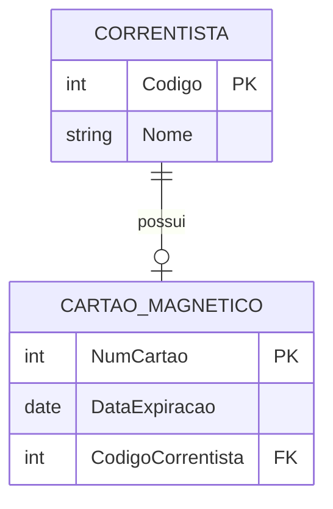
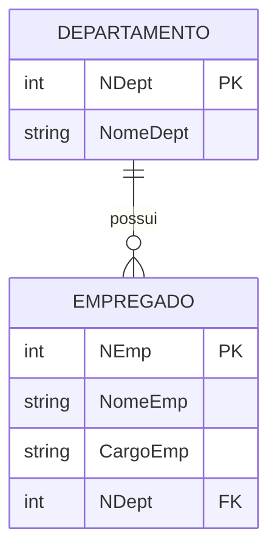
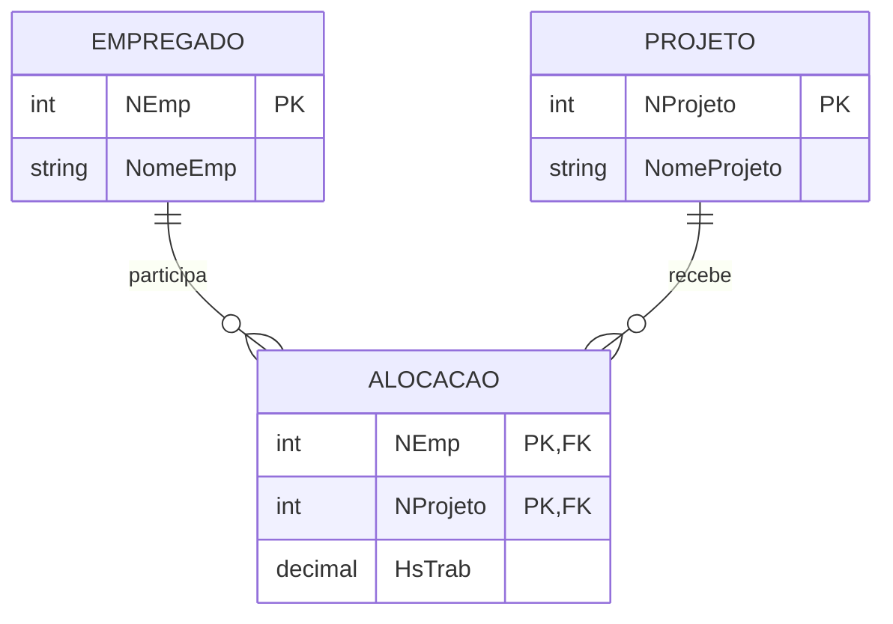
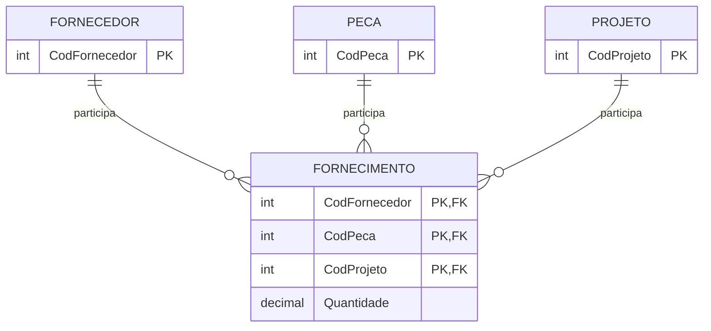
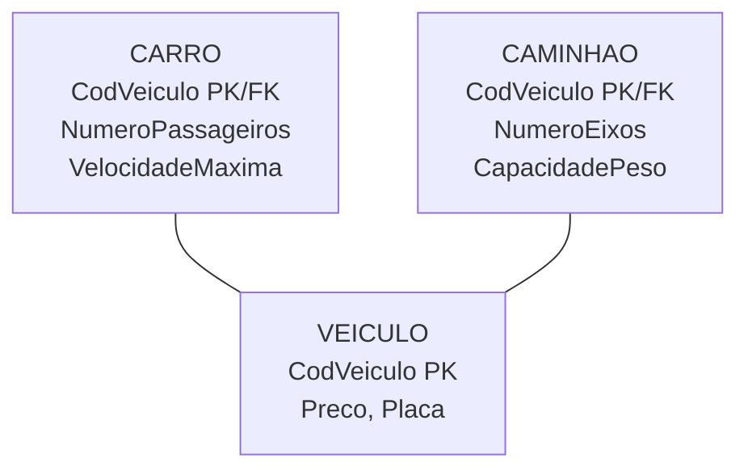

# Mapeamento de relacionamentos: 1:1, 1:N, N:N, N-ário e hierarquias

> **Contexto:** Sessão da PUC Minas sobre o mapeamento do DER para o modelo relacional. O foco está em transformar relacionamentos 1:1, 1:N, N:N e N-ários em relações, chaves primárias e chaves estrangeiras, além de comparar estratégias para mapear hierarquias de generalização e especialização.

## Introdução

No artigo anterior, vimos como entidades e atributos mudam de forma quando passamos do DER para o modelo relacional. Agora o problema é outro: **como preservar os relacionamentos do modelo conceitual usando tabelas e chaves?** A regra não é igual para todas as cardinalidades. Em alguns casos, basta levar uma chave primária para outra tabela como chave estrangeira. Em outros, o próprio relacionamento precisa se transformar em uma nova tabela. A pergunta que organiza esta sessão é: **onde a informação do relacionamento precisa ficar para que o esquema relacional preserve a mesma regra de negócio do DER?** A resposta depende principalmente de quatro elementos:

1. cardinalidade do relacionamento;
2. participação total ou parcial;
3. existência de atributos no relacionamento;
4. restrições de identidade e unicidade.

## 1. Um procedimento geral de mapeamento

Antes de decorar regras isoladas, vale seguir sempre a mesma sequência.

### Passo 1: identificar a cardinalidade

O relacionamento é 1:1, 1:N, N:N ou N-ário?

### Passo 2: observar a participação

Algum dos lados possui participação total? Isso importa principalmente em 1:1, porque ajuda a escolher em qual tabela colocar a FK sem criar valores nulos desnecessários.

### Passo 3: localizar os atributos do relacionamento

Se o relacionamento possui atributos próprios, como `HorasTrabalhadas`, `DataInicio` ou `Quantidade`, eles também precisam encontrar um lugar no esquema relacional.

### Passo 4: decidir como representar a ligação

A ligação será representada por uma FK em uma tabela existente ou por uma nova tabela que representa o relacionamento.

### Passo 5: definir as restrições

Depois da estrutura, ainda precisamos definir PK, FK, `UNIQUE`, `NOT NULL` e eventualmente ações referenciais. A cardinalidade do DER não se preserva apenas copiando valores. Ela precisa ser traduzida em **restrições do modelo relacional**.

## 2. Mapeamento de relacionamento 1:1

Em um relacionamento **1:1**, cada ocorrência de A está associada a no máximo uma ocorrência de B, e cada ocorrência de B está associada a no máximo uma ocorrência de A. Considere:

* `CORRENTISTA(Codigo, Nome)`;
* `CARTAO_MAGNETICO(NumCartao, DataExpiracao)`.

Suponha que cada cartão pertença a exatamente um correntista, cada correntista possua no máximo um cartão e todo cartão participe obrigatoriamente do relacionamento. Uma boa solução é colocar a PK de `CORRENTISTA` como FK em `CARTAO_MAGNETICO`:

`CORRENTISTA(Codigo PK, Nome)`

`CARTAO_MAGNETICO(NumCartao PK, DataExpiracao, CodigoCorrentista FK UNIQUE NOT NULL)`

A referência é:

`CARTAO_MAGNETICO.CodigoCorrentista → CORRENTISTA.Codigo`

## 3. Por que escolher o lado de participação total no 1:1?

A anotação da aula diz para escolher a entidade que possui **participação total** no relacionamento. A lógica é evitar uma coluna preenchida com muitos valores nulos. No exemplo, se todo cartão precisa estar ligado a um correntista, mas nem todo correntista precisa ter cartão, colocar a FK em `CARTAO_MAGNETICO` produz uma estrutura natural:

* toda linha de cartão possui um correntista;
* correntistas sem cartão continuam existindo sem necessidade de `NULL` em uma coluna de cartão.

Se fizéssemos o contrário:

`CORRENTISTA(Codigo, Nome, NumCartao FK)`

correntistas sem cartão precisariam armazenar `NULL` em `NumCartao`. **Regra prática:** em 1:1, quando apenas um lado possui participação total, esse lado costuma ser o melhor lugar para receber a FK. Se os dois lados tiverem participação total, qualquer um pode receber a FK. Em alguns domínios, também pode ser razoável fundir as duas estruturas em uma única relação, desde que isso preserve o significado e o ciclo de vida das entidades.

## 4. Só a FK é suficiente para garantir 1:1?

Não. Se `CARTAO_MAGNETICO.CodigoCorrentista` for apenas uma FK, nada impediria que vários cartões apontassem para o mesmo correntista. Isso produziria um relacionamento 1:N na prática. Para preservar o **1:1**, a FK precisa ser também **única**:

`CodigoCorrentista FK UNIQUE`

Assim:

* FK garante que o correntista exista;
* `UNIQUE` garante que o mesmo correntista não apareça em vários cartões;
* `NOT NULL`, quando necessário, traduz a participação total.

A cardinalidade do DER aparece como uma combinação de restrições.

## 5. E os atributos de um relacionamento 1:1?

Se o relacionamento possuir atributos próprios, eles normalmente acompanham a FK para a tabela escolhida. Imagine CORRENTISTA 1:1 CARTAO com atributo `DataEmissao` no relacionamento. Se a FK foi colocada em `CARTAO_MAGNETICO`, o atributo também pode ir para lá:

`CARTAO_MAGNETICO(NumCartao, DataExpiracao, CodigoCorrentista FK UNIQUE, DataEmissao)`

Isso funciona porque cada cartão participa de no máximo uma ocorrência daquele relacionamento.

## 6. Mapeamento de relacionamento 1:N

No relacionamento **1:N**, a regra é mais direta: a PK da tabela do lado **1** é levada como FK para a tabela do lado **N**. Considere:

`DEPARTAMENTO(NDept PK, NomeDept)`

`EMPREGADO(NEmp PK, NomeEmp, CargoEmp)`

Se um departamento pode possuir vários empregados, mas cada empregado pertence a no máximo um departamento, a FK deve ficar em `EMPREGADO`:

`EMPREGADO(NEmp PK, NomeEmp, CargoEmp, NDept FK)`

A referência correta é:

`EMPREGADO.NDept → DEPARTAMENTO.NDept`

**Correção da anotação:** não é `NEmp → NDept`. `NEmp` identifica o empregado. A FK é `EMPREGADO.NDept`, que referencia `DEPARTAMENTO.NDept`.

## 7. Por que a FK fica no lado N?

Imagine o departamento D1 com cem empregados. Se tentássemos guardar empregados na tabela `DEPARTAMENTO`, precisaríamos de algo como `Empregado1, Empregado2, Empregado3...`, criando uma quantidade arbitrária de colunas. Quando colocamos `NDept` em `EMPREGADO`, cada empregado guarda apenas uma referência para o seu departamento:

| NEmp | NomeEmp | NDept |
| :--- | :--- | :--- |
| E1 | Souza | D1 |
| E2 | Santos | D1 |
| E3 | Silva | D2 |

A repetição de `D1` é esperada e representa naturalmente o lado N. Se a participação do empregado no departamento for total, `NDept` deve ser `NOT NULL`. Se for parcial, pode admitir `NULL`.

## 8. Atributos de relacionamento em 1:N

Se um relacionamento 1:N possuir atributos próprios, eles normalmente migram para o lado N junto com a FK. Exemplo: DEPARTAMENTO 1:N EMPREGADO, relacionamento LOTACAO, atributo `DataInicio`. Como cada empregado está ligado a no máximo um departamento nesse relacionamento, podemos mapear:

`EMPREGADO(NEmp, NomeEmp, NDept FK, DataInicioLotacao)`

O atributo `DataInicioLotacao` descreve a associação daquele empregado com aquele departamento.

## 9. Mapeamento de relacionamento N:N

Em um relacionamento **N:N**, uma FK em apenas uma das tabelas não é suficiente. Imagine:

* um empregado pode trabalhar em vários projetos;
* um projeto pode possuir vários empregados.

A solução é: **criar uma nova relação para representar as ocorrências do relacionamento.** Considere:

`EMPREGADO(NEmp PK, NomeEmp)`

`PROJETO(NProjeto PK, NomeProjeto)`

Criamos:

`ALOCACAO(NEmp FK, NProjeto FK, HsTrab)`

A tabela `ALOCACAO` é frequentemente chamada de relação associativa, tabela associativa, tabela de junção, `junction table` ou `bridge table`.

## 10. As duas FKs viram uma PK composta?

Frequentemente, sim. No exemplo:

`ALOCACAO(NEmp, NProjeto, HsTrab)`

temos:

* `NEmp → EMPREGADO.NEmp`;
* `NProjeto → PROJETO.NProjeto`.

Cada coluna é uma **FK independente**. Se a regra de negócio disser que cada par empregado-projeto só pode aparecer uma vez, então:

`PK = (NEmp, NProjeto)`

Isso significa que as mesmas colunas exercem dois papéis simultâneos:

* individualmente, são FKs;
* juntas, formam uma PK composta.

A PK composta impede repetir a mesma combinação empregado-projeto.

## 11. A PK do N:N é sempre exatamente as duas FKs?

Não necessariamente. A combinação das FKs é a solução mais comum quando **uma ocorrência do relacionamento é identificada pelo par de participantes**. Mas imagine que o mesmo empregado possa ser alocado várias vezes ao mesmo projeto em períodos diferentes:

`ALOCACAO(NEmp, NProjeto, DataInicio, HsTrab)`

Agora o par `(NEmp, NProjeto)` não é suficiente. Uma possibilidade seria:

`PK = (NEmp, NProjeto, DataInicio)`

Outra seria criar uma chave artificial, como `IdAlocacao PK`, e manter uma restrição de unicidade coerente com a regra de negócio. **A PK deve representar a identidade da ocorrência do relacionamento, e não ser escolhida mecanicamente só porque existem duas FKs.**

## 12. Onde ficam os atributos do relacionamento N:N?

Na nova tabela. Esse é justamente o caso de `HsTrab`. Horas trabalhadas não pertencem apenas ao empregado, porque E1 pode trabalhar 10 horas em P1 e 4 horas em P2. Também não pertencem apenas ao projeto, porque P1 pode receber 10 horas de E1 e 20 horas de E2. `HsTrab` descreve o **par empregado-projeto**. Por isso:

`ALOCACAO(NEmp, NProjeto, HsTrab)`

é o lugar correto. Essa é uma das formas mais úteis de reconhecer que um atributo pertence ao relacionamento: seu valor só faz sentido quando sabemos **quais ocorrências estão sendo associadas**.

## 13. Mapeamento de relacionamento N-ário

Um relacionamento é **N-ário** quando envolve mais de duas entidades simultaneamente. No caso ternário: FORNECEDOR fornece PEÇA para PROJETO. A ocorrência é o fato completo: **Fornecedor F forneceu Peça P para Projeto J.** O mapeamento cria uma nova relação:

`FORNECIMENTO(CodFornecedor FK, CodPeca FK, CodProjeto FK, Quantidade)`

A regra geral é:

1. criar uma relação para o relacionamento;
2. levar para ela as chaves das entidades participantes como FKs;
3. incluir os atributos do relacionamento;
4. determinar uma chave capaz de identificar cada ocorrência.

## 14. A PK de um relacionamento N-ário usa todas as FKs?

**Muitas vezes**, mas não é uma regra absoluta. No exemplo:

`FORNECIMENTO(CodFornecedor, CodPeca, CodProjeto, Quantidade)`

se cada combinação fornecedor-peça-projeto puder aparecer apenas uma vez, então:

`PK = (CodFornecedor, CodPeca, CodProjeto)`

Mas as cardinalidades podem criar uma chave menor. Imagine uma regra: para cada combinação de peça e projeto, existe no máximo um fornecedor. Nesse domínio, `(CodPeca, CodProjeto)` já determina `CodFornecedor`. Logo, a chave da relação pode não precisar incluir todas as FKs. **Regra mais precisa:** em N-ários, todas as entidades participantes fornecem FKs; a PK deve ser derivada das restrições de cardinalidade e da identidade real da ocorrência.

## 15. Um relacionamento ternário pode sempre ser quebrado em binários?

Não. Essa formulação precisa de cuidado. Às vezes um relacionamento ternário pode ser substituído por estruturas binárias **se houver regras de negócio adicionais que preservem exatamente a mesma semântica**. Mas, em geral, decompor um ternário em três relacionamentos binários pode perder informação. Considere o fato: Fornecedor F1 fornece Peça P1 para Projeto J1. Se guardarmos apenas:

* F1 fornece P1;
* F1 atende J1;
* P1 é usada em J1;

as três relações binárias não dizem necessariamente que **F1 fornece especificamente P1 para J1**. Ao combinar dados binários, podemos inclusive gerar associações que nunca existiram no relacionamento ternário original. **Modelo mental:** um relacionamento ternário representa uma afirmação sobre três participantes ao mesmo tempo. Três afirmações sobre pares não são necessariamente equivalentes. Por isso, a decomposição deve ser demonstrada pela semântica do domínio, e não feita automaticamente.

## 16. Resumo das regras para relacionamentos

| Relacionamento | Transformação mais comum | Onde fica a FK? | Onde ficam atributos do relacionamento? |
| :--- | :--- | :--- | :--- |
| **1:1** | Levar uma PK para a outra relação | Preferencialmente no lado de participação total | Junto da FK |
| **1:N** | Levar a PK do lado 1 para o lado N | Na relação do lado N | Na relação do lado N |
| **N:N** | Criar nova relação associativa | Nova relação recebe as duas FKs | Na nova relação |
| **N-ário** | Criar nova relação | Nova relação recebe uma FK de cada participante | Na nova relação |

A participação, a unicidade e as cardinalidades ainda determinam `NOT NULL`, `UNIQUE` e a composição da PK.

## 17. Mapeamento de generalização e especialização

O MER Estendido permite modelar um supertipo e seus subtipos. Retomando o exemplo: **VEICULO**

* `CodVeiculo`;
* `Preco`;
* `Placa`.

**CARRO**

* `NumeroPassageiros`;
* `VelocidadeMaxima`.

**CAMINHAO**

* `NumeroEixos`;
* `CapacidadePeso`.

No DER, `CARRO` e `CAMINHAO` herdam os atributos de `VEICULO`. No modelo relacional não existe uma única tradução obrigatória. A aula apresenta três grandes estratégias.

## 18. Estratégia 1: uma única tabela para toda a hierarquia

A primeira estratégia concentra supertipo e subtipos em uma única relação:

`VEICULO(CodVeiculo, Preco, Placa, Tipo, NumeroPassageiros, VelocidadeMaxima, NumeroEixos, CapacidadePeso)`

Exemplo:

| CodVeiculo | Placa | Tipo | NumeroPassageiros | VelocidadeMaxima | NumeroEixos | CapacidadePeso |
| :--- | :--- | :--- | ---: | ---: | ---: | ---: |
| V1 | AAA1 | CARRO | 5 | 180 | NULL | NULL |
| V2 | BBB2 | CAMINHAO | NULL | NULL | 3 | 12000 |

O atributo `Tipo` funciona como **discriminador**.

### Vantagens

* apenas uma tabela;
* consultas ao conjunto inteiro de veículos são simples;
* não exige JOIN para reconstruir um objeto completo.

### Desvantagens

* vários valores `NULL` nos atributos específicos;
* regras de consistência ficam mais complexas;
* a tabela pode ficar larga quando existem muitos subtipos;
* um único discriminador funciona naturalmente para especializações **disjuntas**, mas não representa bem sobreposição.

Em especialização sobreposta, uma ocorrência pode estar em vários subtipos. Nesse caso, seriam necessários múltiplos indicadores, como `EhCarro` e `EhCaminhao`, ou outra estratégia de modelagem. A formulação "ficar só com VEICULO e esquecer os subtipos" é simplificada demais. Os subtipos não desaparecem semanticamente: seus atributos e sua classificação são **absorvidos pela tabela única**.

## 19. Estratégia 2: criar apenas tabelas para os subtipos

Aqui a tabela do supertipo não é criada. Os atributos gerais são repetidos em cada subtipo:

`CARRO(CodVeiculo, Preco, Placa, NumeroPassageiros, VelocidadeMaxima)`

`CAMINHAO(CodVeiculo, Preco, Placa, NumeroEixos, CapacidadePeso)`

### Vantagens

* cada tabela contém apenas ocorrências daquele subtipo;
* consultar um carro completo não exige JOIN;
* não há colunas específicas de outros subtipos preenchidas com `NULL`.

### Desvantagens

* atributos do supertipo são repetidos na estrutura das tabelas;
* uma consulta a "todos os veículos" exige combinar os subtipos;
* se houver sobreposição, os dados gerais da mesma ocorrência podem ser duplicados em mais de uma tabela;
* não há onde armazenar uma ocorrência que seja apenas `VEICULO`, sem pertencer a subtipo algum.

Esse último ponto produz uma restrição decisiva: **a estratégia de somente subtipos exige uma especialização total para representar todas as ocorrências do supertipo.** Se a especialização for parcial, existe a possibilidade de um veículo não ser carro nem caminhão. Sem a tabela `VEICULO`, essa ocorrência não teria onde ser armazenada.

## 20. Estratégia 3: supertipo e subtipos em tabelas separadas

Esta é a estratégia que mais preserva explicitamente a estrutura do MER Estendido. Criamos:

`VEICULO(CodVeiculo PK, Preco, Placa)`

`CARRO(CodVeiculo PK/FK, NumeroPassageiros, VelocidadeMaxima)`

`CAMINHAO(CodVeiculo PK/FK, NumeroEixos, CapacidadePeso)`

A chave dos subtipos exerce simultaneamente dois papéis:

`CARRO.CodVeiculo → VEICULO.CodVeiculo`

`CAMINHAO.CodVeiculo → VEICULO.CodVeiculo`

Ou seja, é PK do subtipo e FK para o supertipo.

Uma ocorrência de carro é reconstruída juntando `VEICULO + CARRO` pelo mesmo `CodVeiculo`.

### Vantagens

* atributos comuns ficam em um único lugar;
* atributos específicos ficam apenas nos subtipos;
* representa especializações totais ou parciais;
* representa estruturas disjuntas ou sobrepostas;
* reduz duplicação dos atributos do supertipo.

### Desvantagens

* consultar um subtipo completo normalmente exige JOIN;
* inserções podem envolver mais de uma tabela;
* restrições de totalidade e disjunção podem exigir mecanismos adicionais para serem fiscalizadas no SGBD.

## 21. Como totalidade e sobreposição afetam a escolha?

As restrições vistas no [[07. Modelo de entidades e relacionamentos estendido|MER Estendido]] não desaparecem no mapeamento.

### Especialização parcial

Se algumas ocorrências podem permanecer apenas no supertipo, a estratégia "somente subtipos" não é suficiente.

### Especialização total

Se toda ocorrência pertence a pelo menos um subtipo, as três estratégias podem ser consideradas, dependendo das demais restrições.

### Especialização disjunta

Se uma ocorrência só pode pertencer a um subtipo, a tabela única com um campo discriminador `Tipo` funciona de forma natural.

### Especialização sobreposta

Se a mesma ocorrência pode pertencer a vários subtipos, um único `Tipo` não é suficiente. A estratégia supertipo + subtipos representa a sobreposição de maneira especialmente clara: o mesmo `CodVeiculo` pode aparecer em mais de uma tabela de subtipo.

## 22. Comparando as três estratégias

| Estratégia | Estrutura | Vantagem principal | Principal custo | Limitação importante |
| :--- | :--- | :--- | :--- | :--- |
| **Tabela única** | Uma relação com atributos gerais e específicos | Poucos JOINs | Muitos `NULL` e regras condicionais | Sobreposição exige vários indicadores |
| **Somente subtipos** | Uma relação completa para cada subtipo | Leitura direta por subtipo | Repetição dos atributos gerais | Não representa especialização parcial |
| **Supertipo + subtipos** | Uma tabela geral + uma para cada subtipo | Maior fidelidade estrutural e menor redundância | Mais JOINs | Regras de disjunção/totalidade podem exigir controles adicionais |

Não existe uma estratégia universalmente melhor. A escolha depende das restrições conceituais e dos padrões de uso do banco.

## 23. Modelo mental para toda a sessão

O mapeamento pode ser lembrado pela seguinte lógica:

`1:1 → escolher um lado`

`1:N → FK vai para N`

`N:N → relacionamento vira tabela`

`N-ário → relacionamento vira tabela com FKs dos participantes`

`generalização/especialização → escolher como distribuir atributos gerais e específicos`

Mas a versão realmente segura inclui as restrições: **cardinalidade decide a estrutura; participação decide obrigatoriedade; identidade decide a chave; semântica decide se a tradução preserva o DER.**

## 24. Pontos que costumam gerar confusão

* **Em 1:1, uma FK sozinha não garante 1:1.** É preciso preservar também a unicidade do valor referenciador.
* **Em 1:N, a FK fica no lado N.** No exemplo da aula, é `EMPREGADO.NDept → DEPARTAMENTO.NDept`.
* **Em N:N, a nova tabela representa ocorrências do relacionamento.** Ela recebe as FKs das entidades participantes e os atributos próprios do relacionamento.
* **Duas FKs podem formar juntas uma PK composta.** Isso ocorre quando o par de participantes identifica unicamente a ocorrência do relacionamento.
* **A PK de uma tabela associativa não é obrigatoriamente apenas as FKs.** A identidade depende da regra de negócio.
* **Em N-ários, todas as entidades fornecem FKs, mas nem sempre todas precisam compor a PK.** As cardinalidades determinam a chave mínima.
* **Um relacionamento ternário não deve ser quebrado automaticamente em binários.** A decomposição pode perder a semântica do fato ternário e produzir combinações espúrias.
* **Na tabela única de uma hierarquia, os subtipos não foram "esquecidos".** Eles foram incorporados à mesma relação por atributos específicos e mecanismos de discriminação.
* **Na estratégia somente subtipos, os atributos do supertipo não desaparecem.** Eles são projetados para cada tabela de subtipo.
* **A estratégia somente subtipos não representa corretamente uma especialização parcial.** Ocorrências pertencentes apenas ao supertipo ficariam sem tabela.
## Referências bibliográficas

### Bibliografia básica
* HEUSER, Carlos Alberto. **Projeto de banco de dados**. 6. ed. Porto Alegre: Bookman, 2009.
* ELMASRI, Ramez; NAVATHE, Shamkant B. **Sistemas de banco de dados**. 7. ed. São Paulo: Pearson Addison Wesley, 2018.
* SILBERSCHATZ, Abraham; KORTH, Henry F.; SUDARSHAN, S. **Sistema de banco de dados**. 7. ed. Rio de Janeiro: Elsevier, GEN LTC, 2020.

### Bibliografia complementar
* DATE, C. J. **Introdução a sistemas de bancos de dados**. 8. ed. Rio de Janeiro: Elsevier, Campus, 2004.
* CHEN, Peter Pin-Shan. **The entity-relationship model: toward a unified view of data**. ACM Transactions on Database Systems, v. 1, n. 1, p. 9-36, 1976.

## Artigos relacionados e navegação

* **Artigo anterior:** [[10. Mapeamento de entidades e atributos]]
* **Próximo artigo:** [[12. 1ª, 2ª e 3ª formas normais]]
* **Resumo da disciplina:** [[00. Modelagem de Dados - Resumo]]
* **Glossário da matéria:** [[Glossário de conceitos]]
* **Índice geral do vault:** [[index.md|Página Inicial do Vault]]
