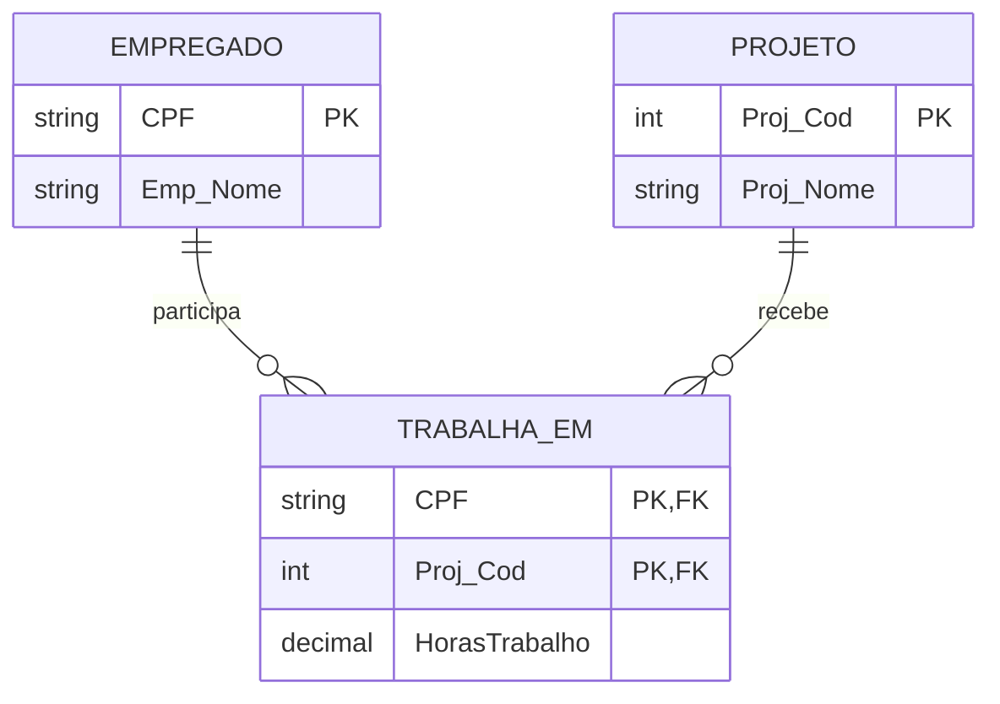
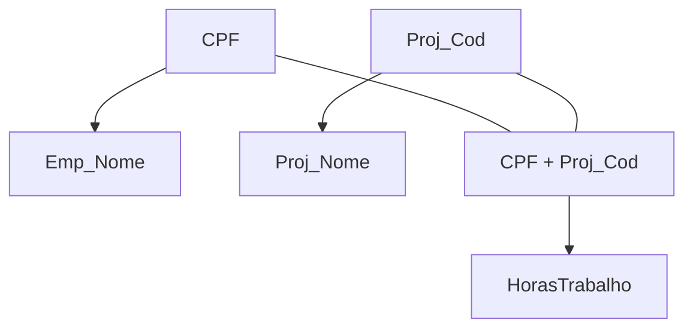
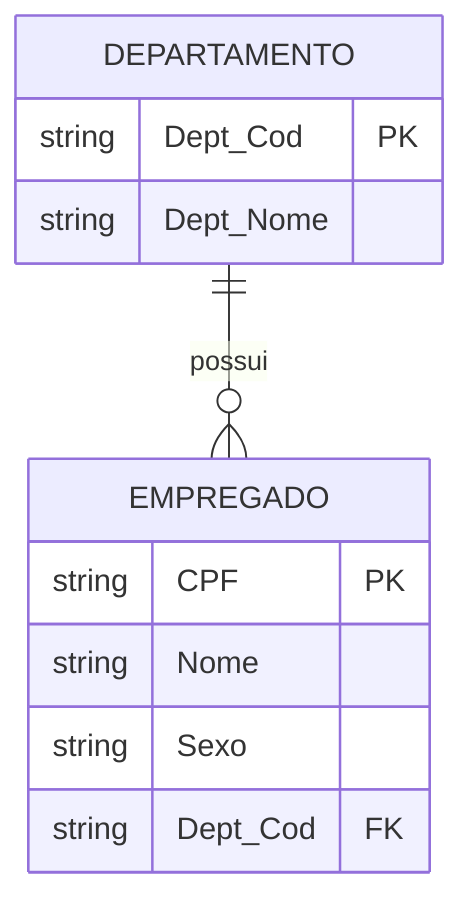

# 1ª, 2ª e 3ª formas normais: atomicidade, dependências funcionais e redução de redundância

> **Contexto:** Conjunto de sessões da PUC Minas sobre normalização de bancos de dados. O artigo reúne a 1ª, 2ª e 3ª Formas Normais para mostrar o encadeamento entre atomicidade, dependências parciais e dependências transitivas, sempre com foco na redução de redundância e de anomalias de inserção, atualização e exclusão.

---

## Introdução

Até aqui, aprendemos a transformar entidades, atributos e relacionamentos do DER em relações, chaves primárias e chaves estrangeiras. Isso produz um esquema relacional, mas ainda não garante que esse esquema esteja **bem estruturado**. É possível criar tabelas que funcionam, aceitam dados e até preservam chaves, mas carregam informação repetida de forma desnecessária. Essa repetição aumenta a chance de erros durante inserções, alterações e exclusões. A **normalização** entra justamente como uma etapa de avaliação da estrutura.

> **Normalizar é verificar se cada relação está armazenando os fatos no lugar adequado, com o mínimo de redundância estrutural possível e sem criar dependências desnecessárias entre informações diferentes.**

A analogia da aula com o carro novo funciona bem: antes da entrega, o produto passa por verificações de qualidade. Na normalização, fazemos algo parecido com o esquema relacional: submetemos as relações a um conjunto de testes e, quando necessário, reorganizamos sua estrutura.

---

## 1. O que é normalização?

A normalização é um processo sistemático de análise de relações baseado em suas **dependências** e em propriedades formais do modelo relacional. Ela busca principalmente:

* reduzir redundância;
* evitar inconsistências;
* diminuir anomalias de atualização;
* tornar mais claras as dependências entre os atributos;
* separar fatos diferentes que foram colocados indevidamente na mesma relação.

A definição anotada em aula resume bem o objetivo:

> processo para avaliar e corrigir estruturas de tabelas de modo a minimizar redundâncias de dados e, com isso, reduzir a probabilidade de anomalias.

Autores como Rob e Coronel, Puga et al. e Elmasri e Navathe apresentam a normalização como uma técnica central do projeto lógico de bancos relacionais.

---

## 2. Normalização não significa simplesmente "criar mais tabelas"

É comum enxergar o resultado da normalização e concluir que sua função é dividir uma tabela grande em várias menores. Isso descreve o efeito, não o princípio. A pergunta correta não é:

> "quantas tabelas eu consigo criar?"

É:

> **"quais fatos dependem de quais identificadores?"**

Quando dois conjuntos de atributos descrevem fatos com dependências diferentes, mantê-los na mesma relação pode gerar redundância. A decomposição acontece para que cada relação represente um conjunto coerente de fatos. Por isso, uma tabela grande não é automaticamente ruim e uma base cheia de tabelas pequenas não é automaticamente normalizada.

---

## 3. O que são anomalias?

Uma estrutura redundante pode gerar três tipos clássicos de problema.

### Anomalia de atualização

A mesma informação aparece em várias linhas e precisa ser alterada em todas. Se o nome do projeto `SistemaRH` estiver repetido em 40 alocações e for renomeado, 40 linhas precisariam ser alteradas. Se uma ficar para trás, o banco passa a conter versões contraditórias do mesmo fato.

### Anomalia de inserção

Para inserir um fato, somos obrigados a informar outro fato que ainda não existe. Se dados do projeto estiverem guardados apenas na tabela de alocações, talvez não seja possível cadastrar um projeto novo enquanto nenhum empregado estiver alocado nele.

### Anomalia de exclusão

Ao excluir uma ocorrência, apagamos acidentalmente outro fato que gostaríamos de preservar. Se o último empregado sair de um projeto e a única linha com o nome do projeto for excluída, podemos perder também a informação de que aquele projeto existe. Essas anomalias são sinais de que fatos diferentes foram misturados na mesma relação.

---

## 4. 1ª Forma Normal: uma posição deve conter um único valor

A **1ª Forma Normal (1FN)** é a porta de entrada da normalização. Na abordagem didática usada na disciplina:

> **uma relação está na 1FN quando cada atributo contém valores atômicos e não existem grupos repetitivos ou coleções de valores dentro de uma mesma posição.**

"Atômico" significa que, para aquele domínio e para os usos previstos, o valor é tratado como uma unidade indivisível pelo modelo. Em uma relação:

| CPF | Nome | Telefone |
| :--- | :--- | :--- |
| 111 | Ana | 31999990000 |
| 222 | Bruno | 31988880000 |

cada posição contém um único valor.

---

## 5. Exemplo que viola a 1FN

Considere:

| CPF | Nome | Telefone |
| :--- | :--- | :--- |
| 111 | Ana | 31999990000, 3133334444 |
| 222 | Bruno | 31988880000 |

A célula `Telefone` da primeira linha contém **dois valores**. Isso cria vários problemas:

* quantos telefones cabem ali?
* como pesquisar um telefone específico?
* como aplicar unicidade?
* como referenciar um dos telefones?
* como ordenar ou validar cada número individualmente?

Outra versão igualmente problemática seria:

| CPF | Nome | Telefone1 | Telefone2 | Telefone3 |
| :--- | :--- | :--- | :--- | :--- |
| 111 | Ana | ... | ... | NULL |

Nesse caso, criamos um grupo repetitivo e impomos artificialmente um limite máximo.

---

## 6. Como corrigir o telefone multivalorado

A solução é separar o fato "pessoa possui telefone" em outra relação.

`PESSOA(CPF PK, Nome)`

`TELEFONE_PESSOA(CPF FK, Telefone)`

Uma forma natural de identificar as linhas da relação de telefones é:

`PK = (CPF, Telefone)`

Então:

| CPF | Telefone |
| :--- | :--- |
| 111 | 31999990000 |
| 111 | 3133334444 |
| 222 | 31988880000 |

Aqui aparece uma correção importante das notas:

> **CPF sozinho não pode ser a PK da tabela de telefones se uma mesma pessoa pode possuir vários telefones.**

Se `CPF` fosse a única PK, não poderíamos inserir dois telefones para a mesma pessoa. A combinação `(CPF, Telefone)` resolve isso quando o mesmo número não deve se repetir para a mesma pessoa. Outra possibilidade de projeto seria utilizar uma chave artificial própria e manter as restrições de unicidade adequadas. Essa transformação também retoma o mapeamento de [[10. Mapeamento de entidades e atributos|atributos multivalorados]] visto anteriormente.

---

## 7. Atributo multivalorado não vira vetor

Quando um atributo é multivalorado no mundo real, a 1FN não pede que os vários valores sejam agrupados em uma coleção dentro da mesma célula. Por exemplo, se um cliente possui três endereços, esta estrutura continua inadequada para a leitura relacional da 1FN:

`CLIENTE(CPF, Nome, Enderecos)`

com um valor como:

`Enderecos = [EnderecoA, EnderecoB, EnderecoC]`

Usar um vetor, lista ou array apenas muda a forma técnica de guardar a coleção. Conceitualmente, a célula ainda contém **vários valores do atributo Endereco**. A solução relacional é representar cada ocorrência do atributo multivalorado como uma tupla própria:

`CLIENTE(CPF PK, Nome)`

`ENDERECO_CLIENTE(CPF FK, Endereco)`

Assim:

| CPF | Endereco |
| :--- | :--- |
| 111 | EnderecoA |
| 111 | EnderecoB |
| 111 | EnderecoC |

O ponto central é:

> **a 1FN não proíbe que uma entidade possua vários valores para uma característica; ela exige que esses valores não sejam empacotados dentro de uma única posição da relação.**

Por isso, a existência de uma chave primária simples ou composta não determina se a relação está em 1FN. Uma tabela pode ter PK simples e ainda violar a 1FN se armazenar coleções, listas ou múltiplos valores dentro de uma célula.

---

## 8. "Atômico" depende do domínio

Atomicidade não significa necessariamente "não pode ser dividido em pedaços fisicamente". Uma data como:

`2026-09-09`

poderia ser separada em ano, mês e dia, mas em muitos modelos ela é tratada corretamente como um único valor do domínio `DATE`. Da mesma forma, um CPF possui dígitos individuais, mas normalmente é tratado como um identificador único. Portanto:

> **atômico significa indivisível para as operações e regras relevantes daquele modelo, e não indivisível no mundo físico.**

Essa distinção evita interpretar a 1FN como uma obrigação de quebrar qualquer valor em suas menores partes possíveis.

---

## 9. A 1FN e o modelo relacional formal

Há uma nuance teórica importante. Na formulação clássica do modelo relacional, uma relação já pressupõe valores pertencentes a domínios e uma estrutura sem grupos repetitivos. Por isso, alguns autores tratam relações propriamente ditas como já satisfazendo a 1FN. Em cursos de projeto de banco de dados, porém, a 1FN é normalmente ensinada como um **teste prático de transformação** de estruturas ainda não normalizadas para relações com valores atômicos. Para prova e exercícios da disciplina, a leitura operacional é:

> encontrar atributos multivalorados, grupos repetitivos ou células com múltiplos valores e reorganizá-los em relações adequadas.

---

## 10. O conceito que prepara a 2FN: dependência funcional

A 2FN exige entender **dependência funcional**. A notação é:

`X → Y`

Lê-se:

> **X determina funcionalmente Y**

ou:

> **Y é funcionalmente dependente de X.**

Isso significa:

> para cada valor de X, existe no máximo um valor correspondente de Y dentro daquela relação válida.

Exemplo:

`CPF → Emp_Nome`

Se CPF identifica uma pessoa, um determinado CPF determina qual é o nome daquela pessoa. Outro exemplo:

`ISBN → TituloLivro`

Um determinado ISBN identifica uma edição específica e, portanto, determina seu título correspondente.

> **Correção da notação das notas:** escrevemos `X → Y` quando **Y depende de X**, não o contrário.

---

## 11. Dependência funcional não é causalidade

A seta `→` não quer dizer que X "causa" Y.

`CPF → Nome`

não significa que o CPF causou o nome da pessoa. Ela expressa uma restrição sobre os dados:

> duas tuplas que tenham o mesmo CPF não podem discordar quanto ao nome que é funcionalmente determinado por esse CPF, considerando a regra adotada pelo modelo.

É uma relação lógica entre atributos.

---

## 12. Chave e dependência funcional

Uma chave candidata determina todos os atributos de uma relação. Se:

`EMPREGADO(CPF, Nome, DataNascimento)`

e `CPF` é uma chave candidata, então:

`CPF → Nome, DataNascimento`

A chave é capaz de identificar a tupla inteira. É justamente essa ideia que a 2FN vai refinar:

> **os atributos não-chave dependem da chave inteira ou apenas de um pedaço dela?**

---

## 13. O exemplo da aula para a 2FN

A tabela mostrada no slide possui:

| CPF | Proj_Cod | HorasTrabalho | Emp_Nome | Proj_Nome |
| :--- | :--- | ---: | :--- | :--- |
| 1111 | 200 | 50 | Maria Silva | Rede Wi-Fi corporativa |
| 2222 | 201 | 15 | João Xavier | SistemaRH |
| 3333 | 201 | 40 | Roberto Costa | SistemaRH |
| 4444 | 281 | 280 | José Pereira | ServiceDesk |
| 3333 | 282 | 45 | Roberto Costa | SistemaAgendamento |

O fato representado é:

> **um empregado trabalha determinada quantidade de horas em determinado projeto.**

A identidade natural dessa ocorrência é a combinação:

`PK = (CPF, Proj_Cod)`

porque precisamos saber **qual empregado + qual projeto**.

---

## 14. Quais dependências existem nessa tabela?

A partir das regras do domínio:

`CPF → Emp_Nome`

O nome do empregado depende apenas do CPF. Também:

`Proj_Cod → Proj_Nome`

O nome do projeto depende apenas do código do projeto. Mas:

`(CPF, Proj_Cod) → HorasTrabalho`

As horas dependem da combinação dos dois. Isso fica muito visível com Roberto Costa. Ele aparece em dois projetos:

| CPF | Proj_Cod | HorasTrabalho | Emp_Nome | Proj_Nome |
| :--- | :--- | ---: | :--- | :--- |
| 3333 | 201 | 40 | Roberto Costa | SistemaRH |
| 3333 | 282 | 45 | Roberto Costa | SistemaAgendamento |

`Emp_Nome` continua sendo Roberto Costa porque depende apenas do CPF. `HorasTrabalho` muda porque depende do **par empregado-projeto**.

---

## 15. O que é dependência parcial?

Uma **dependência parcial** ocorre quando um atributo não-chave depende apenas de uma **parte própria de uma chave composta**, em vez de depender da chave inteira. Na tabela da aula:

`PK = (CPF, Proj_Cod)`

mas:

`CPF → Emp_Nome`

e:

`Proj_Cod → Proj_Nome`

Logo:

* `Emp_Nome` depende apenas de `CPF`, uma parte da PK;
* `Proj_Nome` depende apenas de `Proj_Cod`, outra parte da PK.

Essas são dependências parciais. Já:

`(CPF, Proj_Cod) → HorasTrabalho`

é uma dependência da chave inteira.

---

## 16. 2ª Forma Normal

Na formulação didática:

> **uma relação está na 2FN quando está na 1FN e nenhum atributo não-chave depende apenas de parte de uma chave composta.**

Uma formulação mais precisa é:

> **uma relação está na 2FN quando está na 1FN e todo atributo não-primo é totalmente funcionalmente dependente de cada chave candidata.**

Um **atributo primo** é um atributo que participa de pelo menos uma chave candidata. A ideia central é a mesma: eliminar dependências parciais.

---

## 17. A 2FN só existe quando a PK é composta?

A anotação da aula está muito próxima do modelo mental útil para exercícios:

> se a PK é simples, não existe "parte da PK" da qual um atributo possa depender parcialmente.

Por isso, em exercícios introdutórios, uma relação com **uma única chave candidata simples** já satisfaz automaticamente a condição de ausência de dependência parcial e pode seguir para a próxima forma normal. Há uma nuance formal:

* a 2FN considera **chaves candidatas**, não apenas a PK escolhida;
* se houver outras chaves candidatas compostas, elas também precisam ser analisadas.

Para a maioria dos exercícios desta unidade, porém, a regra prática é:

> **PK simples → não há dependência parcial dessa PK; analisar a próxima forma normal.**

---

## 18. Como normalizar o exemplo para a 2FN

Começamos com:

`TRABALHO(CPF, Proj_Cod, HorasTrabalho, Emp_Nome, Proj_Nome)`

PK:

`(CPF, Proj_Cod)`

Dependências:

`CPF → Emp_Nome`

`Proj_Cod → Proj_Nome`

`(CPF, Proj_Cod) → HorasTrabalho`

Separamos os fatos de acordo com suas dependências.

### EMPREGADO

`EMPREGADO(CPF PK, Emp_Nome)`

### PROJETO

`PROJETO(Proj_Cod PK, Proj_Nome)`

### TRABALHA_EM

`TRABALHA_EM(CPF PK/FK, Proj_Cod PK/FK, HorasTrabalho)`

A PK de `TRABALHA_EM` é composta:

`PK = (CPF, Proj_Cod)`

E as referências são:

`TRABALHA_EM.CPF → EMPREGADO.CPF`

`TRABALHA_EM.Proj_Cod → PROJETO.Proj_Cod`

Observe como isso coincide com o mapeamento de um relacionamento N:N estudado no artigo anterior. A normalização não está inventando outro domínio. Ela está chegando a uma estrutura em que cada fato fica associado à chave que realmente o determina.

---

## 19. O que foi removido da tabela original?

Não perdemos informação. A tabela original repetia:

* nome do empregado em todas as suas alocações;
* nome do projeto em todas as alocações daquele projeto.

Depois da decomposição: `EMPREGADO` guarda o fato:

> CPF determina nome do empregado.

`PROJETO` guarda:

> código do projeto determina nome do projeto.

`TRABALHA_EM` guarda:

> o par empregado-projeto determina as horas trabalhadas.

Quando precisamos ver tudo junto, fazemos uma consulta combinando as relações pelas FKs. Ou seja, **eliminamos redundância sem eliminar fatos**.

---

## 20. As anomalias desaparecem no exemplo normalizado

### Atualização

Antes, mudar `SistemaRH` exigia alterar todas as linhas desse projeto. Depois:

`PROJETO(201, "Sistema de RH")`

é alterada em um único lugar.

### Inserção

Antes, talvez fosse impossível registrar um projeto sem empregado. Depois, podemos inserir diretamente em `PROJETO`.

### Exclusão

Antes, excluir a última alocação de um projeto poderia apagar o único registro com seu nome. Depois, excluir uma linha de `TRABALHA_EM` não elimina automaticamente a existência do projeto. A estrutura normalizada separa fatos com ciclos de vida diferentes.

---

## 21. 1FN e 2FN lado a lado

| Forma normal | Pergunta principal | Problema procurado | Correção típica |
| :--- | :--- | :--- | :--- |
| **1FN** | Cada posição contém um único valor adequado ao domínio? | Atributos multivalorados, grupos repetitivos, múltiplos valores em uma célula | Criar relações/linhas próprias para os valores repetidos |
| **2FN** | Todo atributo não-chave depende da chave composta inteira? | Dependência parcial | Separar atributos que dependem apenas de parte da chave |

Uma sequência prática é:

`estrutura de valores → dependências da chave`

Primeiro verificamos a atomicidade. Depois verificamos se a chave composta está realmente determinando os atributos da relação como um todo.

---

## 22. Um procedimento para resolver exercícios de 2FN

Quando receber uma tabela, siga esta ordem:

### 1. Identifique a chave candidata ou PK

Pergunte:

> qual atributo ou combinação identifica unicamente uma linha?

### 2. Veja se a chave é composta

Se for simples, a dependência parcial daquela chave não pode ocorrer. Se for composta, continue.

### 3. Liste os atributos não-chave

No exemplo:

* `HorasTrabalho`;
* `Emp_Nome`;
* `Proj_Nome`.

### 4. Pergunte de que cada atributo realmente depende

* `Emp_Nome` precisa de CPF e projeto? Não. CPF basta.
* `Proj_Nome` precisa de empregado e projeto? Não. `Proj_Cod` basta.
* `HorasTrabalho` precisa dos dois? Sim.

### 5. Separe as dependências parciais

Crie relações em que os determinantes se tornem as chaves adequadas.

### 6. Preserve as ligações com FKs

A decomposição não deve impedir que os fatos sejam recombinados.

---

## 23. Um diagrama das dependências do exemplo

Esse diagrama expõe visualmente o problema:

* dois atributos dependem de apenas um componente da chave;
* apenas `HorasTrabalho` depende naturalmente do par completo.

---

## 24. O conceito que prepara a 3FN: dependência transitiva

Depois de eliminar dependências parciais na 2FN, a próxima pergunta é:

> **existe algum atributo não-chave que determina outro atributo não-chave?**

Quando isso acontece dentro de uma cadeia que parte da chave, pode existir uma **dependência transitiva**. Considere:

`EMPREGADO(CPF, Nome, Sexo, Dept_Cod, Dept_Nome)`

com `CPF` como chave primária. As regras do domínio podem ser representadas assim:

`CPF → Nome, Sexo, Dept_Cod`

e:

`Dept_Cod → Dept_Nome`

Como `CPF` determina `Dept_Cod`, e `Dept_Cod` determina `Dept_Nome`, temos também:

`CPF → Dept_Nome`

mas essa dependência acontece **por intermédio de `Dept_Cod`**. A cadeia é:

`CPF → Dept_Cod → Dept_Nome`

Por isso dizemos que `Dept_Nome` é **transitivamente dependente** da chave.

---

## 25. 3ª Forma Normal

Na formulação didática usada em exercícios:

> **uma relação está na 3FN quando está na 2FN e nenhum atributo não-chave depende transitivamente de uma chave por meio de outro atributo não-chave.**

Isso corrige uma formulação que pode aparecer de maneira confusa nas anotações. O problema da 3FN não é um atributo que **pertence à chave** ser transitivamente dependente dela. O teste está voltado para atributos que não fazem parte da identidade e que foram colocados na relação embora dependam de outro fato não-chave. Uma formulação formal mais precisa é:

> para toda dependência funcional não trivial `X → A`, ou `X` é uma superchave, ou `A` é um atributo primo.

Para esta disciplina, o modelo mental mais útil continua sendo:

> **2FN remove dependências de pedaços da chave; 3FN remove dependências entre atributos não-chave que criam uma cadeia a partir da chave.**

---

## 26. O exemplo EMPREGADO e DEPARTAMENTO

Considere novamente:

| CPF | Nome | Sexo | Dept_Cod | Dept_Nome |
| :--- | :--- | :--- | :--- | :--- |
| 111 | Ana | F | D1 | Compras |
| 222 | Bruno | M | D2 | Engenharia |
| 333 | Carla | F | D1 | Compras |

A chave é simples:

`CPF`

Então não existe dependência parcial da PK e, assumindo 1FN, a tabela pode satisfazer a 2FN. Mas há outro problema:

`Dept_Cod → Dept_Nome`

O nome do departamento não depende diretamente da identidade do empregado. Ele descreve o **departamento**. Como consequência, `Compras` aparece repetido em todas as linhas de empregados do departamento D1. Se Compras mudar de nome para Suprimentos, todas essas linhas teriam de ser atualizadas. Isso recria a anomalia de atualização que a normalização tenta evitar.

---

## 27. Como corrigir o exemplo para a 3FN

Separamos os dois fatos.

### EMPREGADO

`EMPREGADO(CPF PK, Nome, Sexo, Dept_Cod FK)`

### DEPARTAMENTO

`DEPARTAMENTO(Dept_Cod PK, Dept_Nome)`

A referência é:

`EMPREGADO.Dept_Cod → DEPARTAMENTO.Dept_Cod`

Agora:

`CPF → Nome, Sexo, Dept_Cod`

fica em `EMPREGADO`. E:

`Dept_Cod → Dept_Nome`

fica em `DEPARTAMENTO`. `Dept_Nome` deixa de ser repetido para cada empregado.

A decomposição preserva a ligação entre os fatos, mas cada relação passa a guardar os atributos determinados por sua própria chave.

---

## 28. O teste prático da 3FN

Uma heurística útil para exercícios é olhar os **atributos não-chave entre si**. Pergunte:

> "algum atributo não-chave determina outro atributo não-chave?"

Se a resposta for sim, investigue a cadeia de dependências. No exemplo:

`CPF → Dept_Cod`

`Dept_Cod → Dept_Nome`

Logo: `CPF → Dept_Nome` de forma transitiva. A heurística ajuda, mas não substitui a definição formal. O ponto central é descobrir se um atributo está na tabela por depender **da chave daquela relação** ou se está ali apenas porque depende de outro atributo não-chave.

---

## 29. Como 1FN, 2FN e 3FN se encadeiam

As formas normais são cumulativas. Para estar na 3FN, uma relação precisa antes satisfazer a 2FN. Para estar na 2FN, precisa antes satisfazer a 1FN.

| Forma normal | Pergunta central | Dependência/problema eliminado |
| :--- | :--- | :--- |
| **1FN** | Cada posição contém um único valor do domínio? | Valores multivalorados e grupos repetitivos |
| **2FN** | Cada atributo não-chave depende da chave composta inteira? | Dependência parcial |
| **3FN** | Um atributo não-chave depende de outro atributo não-chave na cadeia da chave? | Dependência transitiva |

O caminho mental pode ser resumido assim:

`1FN: valor → 2FN: chave inteira → 3FN: somente a chave`

Uma formulação clássica para memorizar a intenção, sem tratá-la como definição formal completa, é:

> **cada atributo deve depender da chave, da chave inteira e de nada além da chave.**

---

## 30. A 3FN é o fim da normalização?

Para muitos projetos de aplicações, a **3FN é um ponto de parada prático muito comum**. É por isso que em disciplinas introdutórias costuma aparecer a ideia de que "a tabela está normalizada" quando chega à 3FN. Tecnicamente, porém, existem formas normais posteriores e critérios mais fortes, como:

* **BCNF** (Forma Normal de Boyce-Codd);
* **4FN**;
* **5FN**.

Essas formas tratam situações mais específicas envolvendo determinantes, dependências multivaloradas e dependências de junção. Portanto, dizer que as formas posteriores "não são utilizadas" é forte demais. Uma formulação melhor é:

> **3FN resolve a maior parte dos problemas encontrados em projetos relacionais comuns; formas superiores aparecem com menor frequência em aplicações introdutórias, mas continuam relevantes quando o esquema apresenta dependências mais complexas.**

Para o escopo desta disciplina, 3FN funciona como o principal objetivo de normalização.

---

## 31. Pontos que costumam gerar confusão

**Normalização não é apenas reduzir o tamanho da tabela.** O objetivo é alinhar fatos e dependências. **1FN não significa quebrar todo valor em pedaços mínimos.** Atomicidade depende do domínio e das operações relevantes. **Uma coluna com "telefone1, telefone2" em uma mesma célula viola a leitura didática da 1FN.** Repetir `Telefone1`, `Telefone2` e `Telefone3` também é uma estrutura inadequada. **Na relação de telefones, CPF sozinho não pode ser PK se uma pessoa tiver vários telefones.** A chave pode ser composta, como `(CPF, Telefone)`.

**A seta de dependência funcional é `X → Y` quando Y depende de X.**

**Dependência funcional não significa causalidade.** É uma restrição lógica entre valores.

**2FN exige primeiro 1FN.**

**Dependência parcial só faz sentido em relação a uma chave composta.** Um atributo depende de um subconjunto próprio da chave.

**Na formulação formal, analisamos todas as chaves candidatas, não apenas a PK escolhida.**

**`Emp_Nome` e `Proj_Nome` não pertencem à tabela de alocação.** Eles descrevem empregado e projeto separadamente. **`HorasTrabalho` pertence à associação.** Seu valor depende do empregado e do projeto em conjunto. **A 3FN não procura dependência parcial.** Esse problema já foi tratado na 2FN. **Uma dependência entre dois atributos não-chave é um sinal para investigar a 3FN.** O problema aparece quando essa dependência forma uma cadeia transitiva a partir da chave. **Atingir 3FN é um objetivo prático comum, não o limite matemático da normalização.** BCNF, 4FN e 5FN continuam existindo para casos mais específicos.

---

## 32. Modelo mental para prova

A forma mais curta de reconstruir os conceitos é:

> **1FN: um valor por posição.**

> **2FN: se a chave é composta, nenhum atributo não-chave pode depender só de um pedaço dela.**

> **3FN: nenhum atributo não-chave deve depender de outro atributo não-chave em uma cadeia transitiva a partir da chave.**

No exemplo:

`CPF → Emp_Nome`

`Proj_Cod → Proj_Nome`

`(CPF, Proj_Cod) → HorasTrabalho`

Logo, se `(CPF, Proj_Cod)` é a PK, `Emp_Nome` e `Proj_Nome` violam a 2FN e precisam migrar para suas próprias relações. Depois da 2FN, o teste seguinte é procurar cadeias como `Chave → atributo não-chave → outro atributo não-chave`. Esse é o padrão típico que a 3FN procura eliminar.

---

## Referências bibliográficas

### Bibliografia básica
* ELMASRI, Ramez; NAVATHE, Shamkant B. **Sistemas de banco de dados**. 7. ed. São Paulo: Pearson Addison Wesley, 2018.
* HEUSER, Carlos Alberto. **Projeto de banco de dados**. 6. ed. Porto Alegre: Bookman, 2009.
* SILBERSCHATZ, Abraham; KORTH, Henry F.; SUDARSHAN, S. **Sistema de banco de dados**. 7. ed. Rio de Janeiro: Elsevier, GEN LTC, 2020.

### Referências citadas no material da aula
* ROB; CORONEL. Referência sobre normalização e redução de redundância citada no material da disciplina, 1993.
* PUGA et al. Referência sobre normalização citada no material da disciplina, 2014.
* ELMASRI; NAVATHE. Referência citada no material da disciplina para formas normais e dependências funcionais, 2010.

---

## Materiais complementares recomendados

* **Saiba mais sobre a normalização de BD:** [Formas de Normalização de Banco de Dados](https://www.youtube.com/watch?v=XPj82D6G3lI).

---

## Artigos relacionados e navegação

* **Artigo anterior:** [[11. Mapeamento de relacionamentos]]
* **Próximo artigo:** [[13. Bancos de dados não-relacionais]]
* **Resumo da disciplina:** [[00. Modelagem de Dados - Resumo]]
* **Glossário da matéria:** [[Glossário de conceitos]]
* **Índice geral do vault:** [[index.md|Página Inicial do Vault]]
