# Bancos de dados não-relacionais: hierárquico, rede, orientado a objetos e NoSQL

> **Contexto:** Sessão da PUC Minas que amplia o estudo para além do modelo relacional. O artigo apresenta modelos hierárquicos, de rede, orientados a objetos e famílias NoSQL, comparando como cada paradigma organiza dados, representa associações e realiza consultas.

---

## Introdução

Até aqui, a disciplina esteve concentrada principalmente no **modelo relacional**: relações, tuplas, atributos, chaves, integridade, mapeamento do DER e normalização.

Mas um SGBD não é definido apenas por "guardar dados". Ele precisa adotar algum **modelo de dados**, isto é, um conjunto de conceitos que determina:

* como os dados são estruturados;
* como os vínculos entre eles são representados;
* quais operações podem ser realizadas;
* como a aplicação navega ou consulta essas estruturas.

Quando escolhemos um SGBD relacional, como Oracle Database, PostgreSQL, SQL Server ou MySQL, estamos escolhendo um produto cuja base conceitual principal é o **modelo relacional**.

Outros SGBDs adotam modelos diferentes.

A pergunta central deste artigo é:

> **se não organizarmos o banco principalmente como relações normalizadas conectadas por PKs e FKs, quais outras formas existem de representar e recuperar dados?**

---

## 1. Modelo de dados e produto não são a mesma coisa

É importante separar:

* **modelo de dados:** conjunto de conceitos abstratos;
* **SGBD:** software que implementa um ou mais modelos;
* **produto:** implementação concreta com recursos próprios.

Por exemplo, PostgreSQL é classificado principalmente como um **SGBD objeto-relacional**. Ele preserva o núcleo relacional, mas incorpora recursos que extrapolam o modelo relacional clássico, como tipos definidos pelo usuário, arrays, herança de tabelas e estruturas complexas.

Portanto:

> escolher um produto normalmente significa adotar um modelo predominante, mas produtos modernos podem combinar ideias de vários paradigmas.

---

# Parte I: modelos pré-relacionais e orientados a objetos

## 2. Modelo hierárquico

O **modelo hierárquico** foi um dos primeiros modelos de banco de dados usados comercialmente.

Sua estrutura principal é uma **árvore**:

* cada registro possui no máximo um pai;
* um registro pai pode possuir vários filhos;
* a estrutura representa naturalmente relações 1:N.

Um exemplo clássico é:

> um cliente possui uma ou mais contas bancárias.

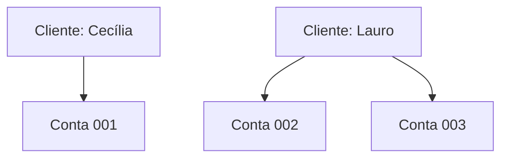

Cecília possui uma conta. Lauro possui duas.

A árvore torna essa representação muito direta.

---

## 3. IBM IMS e o contexto histórico

O exemplo histórico mais conhecido de SGBD hierárquico é o **IBM IMS** (*Information Management System*).

Seu desenvolvimento começou no fim da década de 1960 e o modelo hierárquico ganhou grande importância comercial durante os anos 1970.

O contexto ajuda a entender sua estrutura.

Antes dos SGBDs modernos, aplicações trabalhavam muito diretamente com arquivos. Certos padrões de acesso se repetiam:

> abrir um registro, localizar seus dependentes, percorrer uma sequência conhecida.

O modelo hierárquico formalizou esse tipo de navegação em estruturas controladas pelo SGBD.

---

## 4. A dificuldade do N:N no modelo hierárquico

Árvores funcionam muito bem quando cada filho possui apenas um pai.

O problema aparece quando a mesma ocorrência precisa estar associada a vários pais.

Considere:

> um fabricante produz várias peças e uma peça pode ser produzida por vários fabricantes.

Isso é N:N.

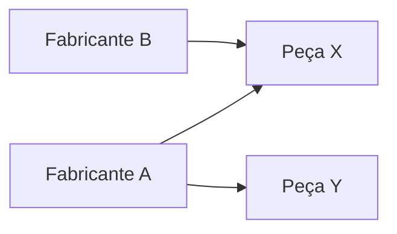

A peça X teria dois "pais". Isso deixa de ser uma árvore simples.

Sistemas hierárquicos possuem técnicas para contornar situações assim, mas o modelo deixa de representar esse tipo de associação com a naturalidade que oferece para 1:N.

---

## 5. DML procedural e navegação hierárquica

Em modelos hierárquicos, o acesso costuma ser **navegacional**.

A aplicação precisa conhecer um caminho:

> cliente → contas → movimentações

Ela não descreve apenas "o que quer"; frequentemente precisa indicar **como chegar até o dado**.

Esse é o sentido de uma **DML procedural ou navegacional**.

Compare:

### Navegacional

> encontre o cliente C1, percorra seus filhos do tipo Conta e depois percorra as movimentações da conta selecionada.

### Declarativa

Em SQL, a consulta tende a dizer:

> quero os dados que satisfazem estas condições.

O SGBD decide o plano de execução.

Essa diferença foi uma das grandes mudanças trazidas pelo modelo relacional.

---

## 6. Modelo de rede

O **modelo de rede** surgiu para representar associações mais flexíveis do que uma árvore hierárquica.

Em vez de cada registro possuir no máximo um pai, registros podem participar de diferentes ligações.

Historicamente, o modelo ficou associado às propostas do **CODASYL** e ao conceito de registros conectados por conjuntos (*sets*) do tipo proprietário-membro.

Uma visualização simplificada é:

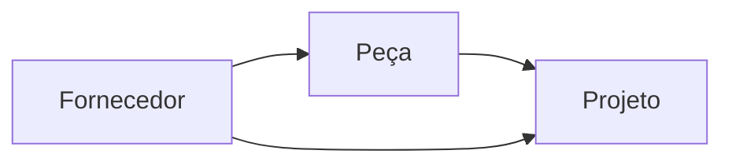

Essa estrutura é mais próxima de uma rede de registros do que de uma árvore.

---

## 7. Ponteiros, conjuntos e navegação no modelo de rede

Uma maneira didática de imaginar o modelo de rede é pensar em listas de registros conectadas por referências.

Por exemplo:

> EMPREGADO → participa de → PROJETO

e:

> PROJETO → pertence a → DEPARTAMENTO

A aplicação pode navegar de um registro para outro seguindo vínculos previamente definidos.

Isso oferece flexibilidade, mas gera uma consequência importante:

> a aplicação precisa conhecer bastante da estrutura de navegação do banco.

Por isso, o modelo de rede também está fortemente associado a **DML procedural**.

---

## 8. Por que a manipulação se torna complexa?

Considere a pergunta:

> quais empregados trabalham em projetos do departamento de tecnologia?

Em um modelo navegacional, a aplicação pode precisar:

1. localizar o departamento;
2. navegar para seus projetos;
3. percorrer os vínculos entre projetos e empregados;
4. coletar os registros encontrados.

A consulta fica acoplada ao caminho estrutural.

No modelo relacional, a mesma pergunta tende a ser expressa declarativamente por relações e condições de junção.

Essa redução do acoplamento entre **pergunta** e **caminho físico/lógico de navegação** foi uma das razões da ascensão do modelo relacional.

---

## 9. Modelo de banco de dados orientado a objetos

Um **banco de dados orientado a objetos** procura armazenar objetos de maneira mais próxima ao modelo utilizado por linguagens orientadas a objetos.

Em vez de transformar necessariamente uma estrutura de objetos em tabelas, o SGBD pode trabalhar diretamente com conceitos como:

* objetos;
* classes;
* identidade de objeto;
* atributos complexos;
* referências entre objetos;
* herança;
* encapsulamento, dependendo do produto.

Essa abordagem teve aplicações importantes em domínios nos quais os dados são estruturalmente complexos.

---

## 10. Onde bancos orientados a objetos aparecem?

Historicamente, bancos orientados a objetos foram associados a nichos como:

* CAD e engenharia;
* geoprocessamento;
* telecomunicações;
* simulações;
* aplicações científicas;
* multimídia;
* aplicações médicas com estruturas complexas;
* jogos e ambientes de objetos persistentes.

O motivo é simples: nesses domínios, transformar grafos complexos de objetos em dezenas de tabelas relacionais pode criar um custo de mapeamento considerável.

---

## 11. OID: identidade de objeto

No paradigma orientado a objetos, a identidade não precisa ser representada principalmente por uma chave de negócio armazenada em uma coluna.

Um SGBD OO pode fornecer um **OID** (*Object Identifier*).

O OID identifica o objeto de forma independente dos valores de seus atributos.

Imagine:

```text
Objeto Cliente
OID: #98273
nome: "Ana"
email: "ana@example.com"
```

Se o email mudar, o objeto continua sendo o mesmo porque sua identidade é mantida pelo OID.

Esse conceito se aproxima da ideia de **identidade de objeto** em programação orientada a objetos.

---

## 12. E PK e FK em bancos OO?

A afirmação "bancos OO não têm PK e FK" funciona como contraste didático, mas é absoluta demais.

O ponto conceitual é:

> **PK e FK não são os mecanismos centrais de identidade e associação do modelo orientado a objetos.**

Objetos podem ser identificados por OIDs e podem guardar **referências diretas a outros objetos**.

Por exemplo:

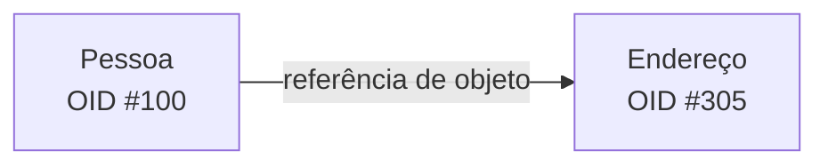

Em um modelo relacional, essa ligação normalmente seria materializada com uma FK.

---

## 13. Herança nativa

Outra diferença importante é a possibilidade de representar hierarquias de classes diretamente.

Considere:

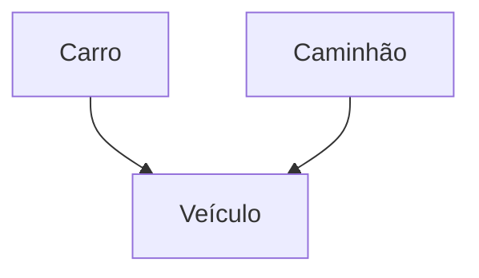

Em um banco orientado a objetos, essa herança pode ser parte nativa do modelo.

No modelo relacional, vimos que a mesma estrutura precisa ser **mapeada** por alguma estratégia:

* tabela única;
* apenas tabelas de subtipos;
* supertipo + subtipos.

Essa diferença conecta diretamente este assunto à [[01. Programacao Modular/15. Herança (generalização, especialização e extensibilidade modular)|herança em Programação Modular]] e ao [[11. Mapeamento de relacionamentos|mapeamento de generalização/especialização]].

---

## 14. PostgreSQL é um banco orientado a objetos?

Não no sentido de um **OODBMS puro**.

PostgreSQL é normalmente classificado como **objeto-relacional**.

Isso significa:

> mantém tabelas, relações, SQL, PKs e FKs como base, mas adiciona recursos inspirados em modelos de tipos e objetos.

Entre esses recursos estão tipos definidos pelo usuário, arrays, tipos compostos e herança de tabelas.

Exemplos históricos mais diretamente associados a bancos orientados a objetos incluem:

* ObjectStore;
* ObjectDB;
* O2.

A categoria objeto-relacional surgiu justamente como tentativa de incorporar maior riqueza estrutural sem abandonar o ecossistema relacional e SQL.

---

# Parte II: NoSQL

## 15. O que significa NoSQL?

O termo **NoSQL** passou a designar uma família heterogênea de bancos que não utiliza o modelo relacional tradicional como única forma principal de organização.

A expansão desses sistemas está ligada a necessidades como:

* grandes volumes de dados;
* crescimento de aplicações web;
* redes sociais;
* IoT;
* dados semiestruturados;
* esquemas muito variáveis;
* distribuição geográfica;
* necessidade de escalabilidade horizontal.

A interpretação mais usada hoje para o nome é:

> **Not Only SQL**, ou "não apenas SQL".

Isso enfatiza que NoSQL não significa necessariamente "SQL proibido". Alguns sistemas não usam SQL; outros oferecem linguagens semelhantes ou interfaces compatíveis com partes dele.

---

## 16. SQL: o que é mesmo?

**SQL** significa **Structured Query Language**.

É a linguagem padronizada mais associada aos bancos relacionais.

Ela permite:

* definir estruturas: `CREATE TABLE`, `ALTER TABLE`;
* consultar dados: `SELECT`;
* inserir, alterar e excluir: `INSERT`, `UPDATE`, `DELETE`;
* definir restrições;
* controlar permissões;
* gerenciar transações, dependendo do comando e do SGBD.

Uma característica fundamental é seu caráter predominantemente **declarativo**.

Em vez de descrever detalhadamente o caminho para encontrar os registros, dizemos **qual resultado queremos**, e o SGBD escolhe um plano de execução.

Por exemplo:

```sql
SELECT Nome
FROM Empregado
WHERE Departamento = 'D1';
```

A consulta especifica o resultado lógico. Ela não manda o SGBD percorrer um ponteiro específico, abrir uma lista e seguir determinada sequência física.

---

## 17. NoSQL e dados não estruturados

É comum associar NoSQL a "dados não estruturados", mas essa frase precisa de precisão.

Muitos bancos NoSQL trabalham principalmente com dados **semiestruturados**.

Um documento JSON, por exemplo, possui estrutura:

```json
{
  "nome": "Ana",
  "emails": [
    "ana@exemplo.com",
    "ana.trabalho@empresa.com"
  ],
  "endereco": {
    "cidade": "Belo Horizonte",
    "uf": "MG"
  }
}
```

Ele não é uma sequência sem forma. Há campos, arrays e objetos aninhados.

O que muda é que o esquema pode ser **mais flexível** e não precisa obrigatoriamente ser uniforme entre todos os registros.

---

## 18. Por que aplicações web impulsionaram NoSQL?

Aplicações de internet passaram a lidar com combinações como:

* milhões ou bilhões de eventos;
* perfis com campos diferentes;
* feeds e mensagens;
* telemetria;
* logs;
* relacionamentos sociais;
* catálogos muito variáveis;
* sistemas distribuídos por várias regiões.

Em muitos desses cenários, exigir um esquema relacional centralizado e altamente uniforme pode gerar atrito.

NoSQL surgiu como uma família de respostas diferentes para problemas diferentes.

> **Não existe um único "modelo NoSQL".**

É justamente por isso que aprender MongoDB não significa automaticamente saber Cassandra ou Neo4j.

---

## 19. Escalabilidade horizontal

Um dos conceitos associados ao crescimento de NoSQL é a **escalabilidade horizontal**.

Há duas formas simplificadas de aumentar capacidade.

### Escala vertical

Usar uma máquina maior:

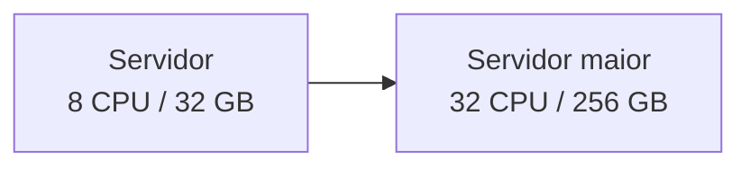

### Escala horizontal

Distribuir o trabalho entre várias máquinas:

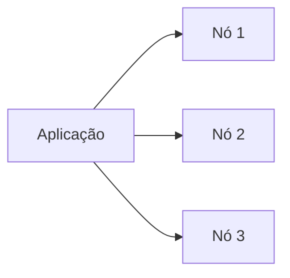

Sistemas NoSQL foram frequentemente projetados desde cedo pensando em **particionamento**, **replicação** e operação distribuída em vários nós.

Isso combina bem com infraestrutura de nuvem, em que novos nós podem ser adicionados conforme a carga cresce.

---

# Parte III: principais famílias NoSQL

## 20. Chave-valor

Um armazenamento **chave-valor** é uma das estruturas mais simples.

A ideia é:

> uma chave identifica um valor associado.

Formalmente:

`chave → valor`

Exemplo:

```text
"user:1001" → {"nome":"Ana","plano":"premium"}
"user:1002" → {"nome":"Bruno","plano":"free"}
```

Diagrama:

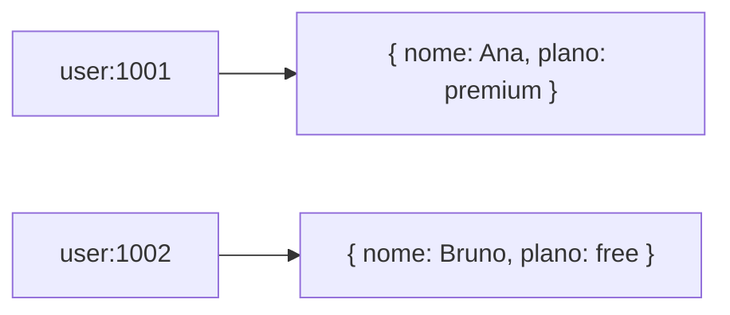

A operação típica é:

* inserir/atualizar um valor por chave;
* recuperar o valor pela chave;
* remover a chave.

É um modelo eficiente quando o padrão principal de acesso já conhece o identificador.

Exemplos de produtos ou serviços associados ao modelo incluem Redis e Amazon DynamoDB, embora produtos modernos frequentemente ofereçam recursos além do chave-valor puro.

---

## 21. Documentos

O modelo de **documentos** armazena registros como estruturas autocontidas, frequentemente semelhantes a JSON.

Exemplo:

```json
{
  "_id": 1001,
  "nome": "Ana",
  "telefone": ["31999990000", "3133334444"],
  "preferencias": {
    "idioma": "pt-BR",
    "tema": "escuro"
  }
}
```

Um segundo documento da mesma coleção pode ter campos diferentes:

```json
{
  "_id": 1002,
  "nome": "Bruno",
  "empresa": "Acme",
  "cargo": "Analista"
}
```

Isso mostra três características importantes:

* documentos não precisam ter exatamente os mesmos campos;
* podem conter arrays;
* podem conter objetos aninhados.

Representação visual:

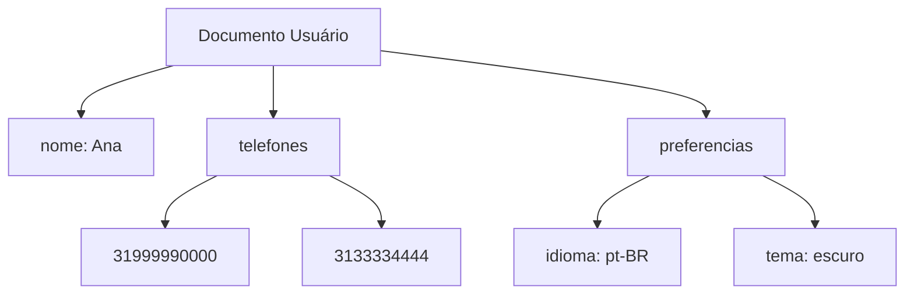

MongoDB é um exemplo conhecido dessa família.

---

## 22. Por que um array é aceitável em documentos se violava a 1FN?

Essa comparação é importante.

Na 1FN, estávamos avaliando uma **relação do modelo relacional**.

O modelo de documentos segue regras diferentes.

Quando MongoDB armazena:

```json
{
  "telefones": ["31999990000", "3133334444"]
}
```

não está tentando representar uma relação em 1FN.

Portanto:

> **as formas normais são regras de projeto do modelo relacional; não são leis universais para todos os modelos de banco de dados.**

Isso não significa que arrays sejam sempre uma boa escolha em documentos. A estrutura ainda deve ser definida conforme padrões de consulta, atualização e consistência.

---

## 23. Wide-column ou famílias de colunas

O modelo frequentemente chamado na aula de **colunar** é mais precisamente chamado, neste contexto, de **wide-column** ou **famílias de colunas**.

Essa distinção é importante porque "banco colunar" também pode designar bancos analíticos que armazenam fisicamente dados por coluna, o que é outro conceito.

Sistemas como **Google Bigtable**, Apache HBase e Apache Cassandra são associados à família wide-column.

Uma representação simplificada:

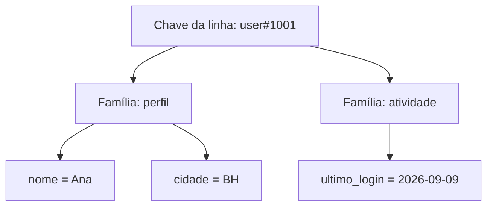

A estrutura agrupa colunas relacionadas em **famílias de colunas**.

---

## 24. Linha, coluna e timestamp no Bigtable

No modelo conceitual do Bigtable, um valor pode ser identificado aproximadamente por uma combinação como:

`(row key, column, timestamp) → valor`

O timestamp permite manter múltiplas **versões** de uma célula.

Exemplo simplificado:

```text
(user#1001, perfil:nome, 10:00) → "Ana"
(user#1001, perfil:nome, 12:00) → "Ana Paula"
```

Visualmente:

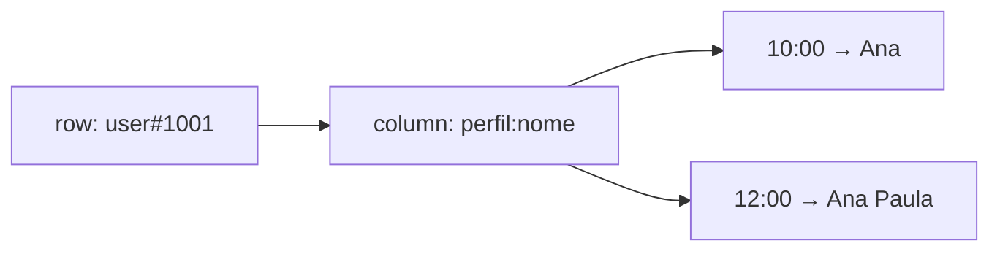

Isso é bem diferente da ideia relacional de uma célula simples identificada por linha e coluna em uma tabela.

---

## 25. Grafos

Bancos de **grafos** tratam relacionamentos como elementos centrais do modelo.

Uma estrutura típica possui:

* **nós**: entidades ou objetos;
* **arestas**: relações entre nós;
* **propriedades**: atributos de nós e, em muitos modelos, também das arestas.

Exemplo de rede social:

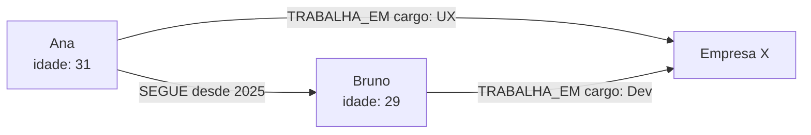

Nesse modelo, os relacionamentos não são apenas "setas desenhadas".

Eles podem possuir **tipo** e **propriedades** próprias.

Por exemplo:

> Ana --SEGUE desde 2025--> Bruno

O ano pode ser uma propriedade da aresta.

Neo4j é um exemplo conhecido dessa família.

---

## 26. "Atributos são relacionamentos" em grafos?

Essa anotação precisa de ajuste.

Em bancos de grafos de propriedades:

* nós podem possuir atributos/propriedades;
* arestas representam relacionamentos;
* arestas também podem possuir propriedades.

Então:

> **atributos não são sinônimos de relacionamentos.**

Exemplo:

* nó Pessoa: `nome = "Ana"`;
* aresta TRABALHA_EM: `desde = 2024`.

A grande diferença é que o relacionamento se torna um elemento de primeira classe do banco.

---

## 27. Motores de busca

Motores de busca como Elasticsearch e OpenSearch também costumam ser incluídos em classificações amplas do ecossistema NoSQL.

Eles são especializados em:

* indexação de documentos;
* busca textual;
* relevância;
* filtros;
* agregações;
* análise de logs e eventos.

Representação simplificada:

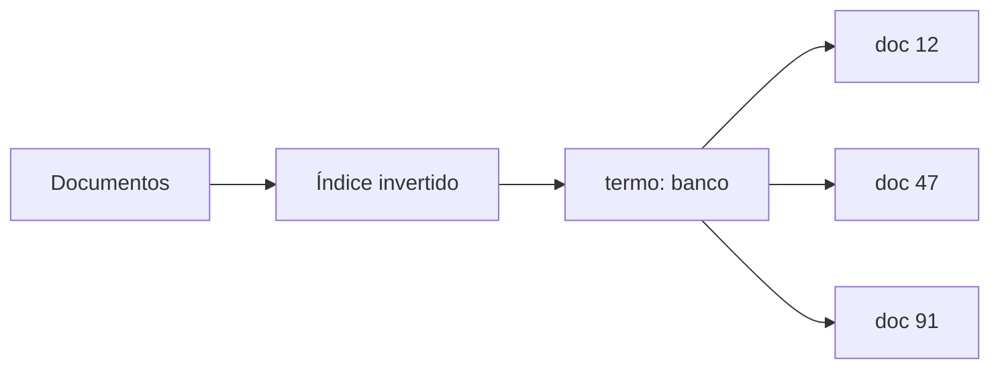

Um **índice invertido** associa termos aos documentos em que aparecem, permitindo localizar rapidamente conteúdo textual.

Essa categoria é mais especializada que um banco de propósito geral.

---

## 28. As famílias NoSQL lado a lado

| Família | Estrutura central | Pergunta que resolve bem | Exemplos |
| :--- | :--- | :--- | :--- |
| **Chave-valor** | chave → valor | "Dada esta chave, qual é o valor?" | Redis, DynamoDB |
| **Documentos** | documentos flexíveis e aninhados | "Quero guardar uma estrutura agregada semelhante a JSON" | MongoDB, Couchbase |
| **Wide-column** | linhas esparsas + famílias de colunas | "Preciso distribuir grande volume por chaves e famílias de atributos" | Bigtable, Cassandra, HBase |
| **Grafos** | nós + arestas + propriedades | "Quero explorar relações e caminhos" | Neo4j |
| **Motor de busca** | documentos + índices invertidos | "Quais documentos correspondem melhor a estes termos?" | Elasticsearch, OpenSearch |

Essas famílias não são apenas formatos diferentes de uma mesma tecnologia.

Elas adotam modelos, operações, garantias e padrões de consulta diferentes.

---

## 29. Por que aprender um NoSQL não ensina automaticamente os outros?

No ecossistema relacional existe uma base conceitual compartilhada muito forte:

* tabelas;
* chaves;
* relações;
* integridade;
* SQL, apesar das diferenças de dialeto.

Aprender PostgreSQL ajuda bastante ao migrar para MySQL, SQL Server ou Oracle porque muitos princípios continuam reconhecíveis.

NoSQL é um rótulo que agrupa tecnologias **muito diferentes**.

Saber MongoDB ensina bastante sobre documentos, mas não fornece automaticamente o modelo mental necessário para:

* percorrer grafos no Neo4j;
* modelar partições no Cassandra;
* trabalhar com chave-valor no Redis;
* construir consultas de busca no Elasticsearch.

Por isso:

> **NoSQL é uma família de modelos, não um único modelo alternativo ao relacional.**

---

## 30. Relacional versus NoSQL: a escolha não é ideológica

Não existe uma regra:

> "relacional é antigo e NoSQL é moderno"

nem:

> "NoSQL substituiu SQL".

Os modelos resolvem problemas diferentes e frequentemente convivem na mesma arquitetura.

Um sistema pode usar:

* PostgreSQL para transações financeiras;
* Redis para cache;
* Elasticsearch para busca;
* Neo4j para relações complexas;
* MongoDB para documentos de estrutura variável.

Essa combinação é frequentemente chamada de **persistência poliglota**: usar diferentes tecnologias de armazenamento conforme a natureza de cada problema.

---

## 31. Modelo mental para prova

Uma forma rápida de reconstruir o conteúdo:

| Modelo | Estrutura mental |
| :--- | :--- |
| **Hierárquico** | árvore pai → filhos |
| **Rede** | registros conectados por caminhos navegáveis |
| **Orientado a objetos** | objetos + OID + referências + herança |
| **Chave-valor** | chave → valor |
| **Documentos** | JSON flexível e aninhado |
| **Wide-column** | linhas + famílias de colunas + versões |
| **Grafos** | nós + arestas + propriedades |
| **Busca** | documentos + índice invertido |

E uma segunda sequência:

`hierárquico/rede → navegação procedural`

`relacional → relações + consulta declarativa`

`OO → identidade e referências de objeto`

`NoSQL → vários modelos especializados e frequentemente distribuídos`

---

## 32. Pontos que costumam gerar confusão

**Não-relacional não é sinônimo de NoSQL.** Modelos hierárquico, de rede e orientado a objetos também não são relacionais e possuem histórias próprias.

**O modelo hierárquico representa 1:N naturalmente, mas N:N é mais difícil porque uma árvore pressupõe um único pai por nó.**

**O modelo de rede histórico não é igual aos bancos de grafos modernos.** Ambos representam conexões, mas têm modelos, linguagens e objetivos diferentes.

**PostgreSQL não é um OODBMS puro.** É um SGBD objeto-relacional.

**OID não é apenas outro nome para PK.** Ele representa identidade de objeto fornecida pelo sistema, independente dos valores de negócio.

**NoSQL não significa necessariamente dado sem estrutura.** Documentos JSON são semiestruturados.

**NoSQL não significa "sem SQL".** "Not Only SQL" é a expansão mais usada do termo e várias tecnologias oferecem linguagens declarativas próprias.

**Wide-column não é a mesma coisa que banco analítico colunar.** No contexto de Bigtable e Cassandra, estamos falando de famílias de colunas.

**Arrays em documentos não "violam a 1FN".** A 1FN pertence ao modelo relacional; um banco de documentos segue outro modelo.

**Em grafos, propriedades não são relacionamentos.** Nós e arestas podem possuir propriedades, enquanto as arestas representam as associações.

**Uma tecnologia NoSQL não ensina automaticamente outra.** MongoDB, Cassandra, Redis e Neo4j têm modelos mentais e operações centrais diferentes.

---

## Referências bibliográficas

### Bibliografia básica
* ELMASRI, Ramez; NAVATHE, Shamkant B. **Sistemas de banco de dados**. 7. ed. São Paulo: Pearson, 2018.
* SILBERSCHATZ, Abraham; KORTH, Henry F.; SUDARSHAN, S. **Sistema de banco de dados**. 7. ed. Rio de Janeiro: Elsevier, GEN LTC, 2020.

### Referências complementares
* CODASYL. **Database Task Group Report**. Referência histórica para o modelo de rede.
* CHANG, Fay et al. **Bigtable: a distributed storage system for structured data**. Google, 2006.
* SGBDs e famílias citados ao longo do artigo: IBM IMS, PostgreSQL, ObjectStore, O2, MongoDB, Redis, DynamoDB, Bigtable, Cassandra, HBase, Neo4j, Elasticsearch e OpenSearch.

---

## Materiais complementares recomendados

* **Leitura:** ELMASRI, Ramez; NAVATHE, Shamkant B. **Sistemas de banco de dados**. 7. ed. São Paulo: Pearson, 2018. Consultar os capítulos sobre orientação a objetos e sistemas objeto-relacionais na [Biblioteca da PUC Minas](http://bib.pucminas.br/pergamum/biblioteca/index.php).
* **Apresentação da disciplina:** [Banco de Dados Não-Relacionais - Parte 1](https://pucminas.instructure.com/courses/68977/files/6615514?wrap=1).
* **Download da apresentação:** [Banco de Dados Não-Relacionais - Parte 1](https://pucminas.instructure.com/courses/68977/files/6615514/download?download_frd=1).
* **Apresentação da disciplina:** [Banco de Dados Não-Relacionais - Parte 2](https://pucminas.instructure.com/courses/68977/files/6615796?wrap=1).
* **MongoDB:** [MongoDB in 5 Minutes with Eliot Horowitz](https://www.youtube.com/watch?v=EE8ZTQxa0AM) *(legendas disponíveis)*.

---

## Artigos relacionados e navegação

* **Artigo anterior:** [[12. 1ª, 2ª e 3ª formas normais]]
* **Resumo da disciplina:** [[00. Modelagem de Dados - Resumo]]
* **Glossário da matéria:** [[Glossário de conceitos]]
* **Índice geral do vault:** [[index.md|Página Inicial do Vault]]
