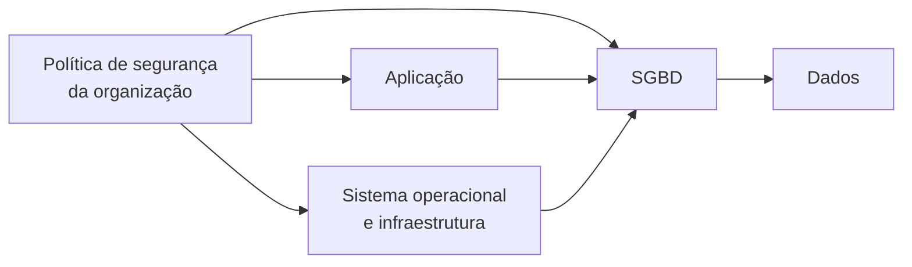
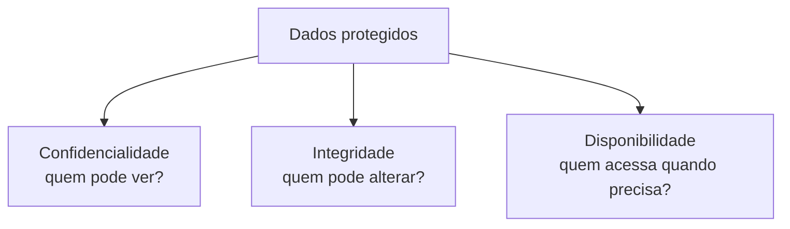

# Segurança de banco de dados: confidencialidade, integridade e disponibilidade

> **Contexto:** Sessão final do Microfundamento de Modelagem de Dados da PUC Minas. O artigo apresenta os três objetivos clássicos da segurança da informação aplicados ao banco de dados, confidencialidade, integridade e disponibilidade, e mostra por que a proteção do BD depende também da aplicação, do sistema operacional, da infraestrutura e das políticas organizacionais.

---

## Introdução

Ao longo da disciplina, tratamos dados como estrutura, representação, relacionamento, chave, dependência e fonte de informação.

No momento em que esses dados passam a representar clientes, funcionários, transações, estratégias, prontuários, notas, pesquisas ou decisões de negócio, aparece outra pergunta:

> **quem pode acessar, alterar ou impedir o acesso a essas informações?**

Segurança de banco de dados não é um recurso isolado do SGBD.

Ela depende de uma cadeia:



Uma camada vulnerável pode comprometer as demais.

---

## 1. "Dados são o novo petróleo"?

A frase **"dados são o novo petróleo"** é usada para destacar o valor econômico e estratégico dos dados.

A comparação funciona em um aspecto:

> dados brutos precisam ser selecionados, combinados, contextualizados e analisados para gerar valor.

Uma organização pode usar dados para conhecer clientes, detectar fraude, prever demanda, avaliar políticas, aperfeiçoar produtos, produzir conhecimento e automatizar decisões.

Mas a analogia tem limites. Petróleo é um recurso físico, finito e consumível. Dados podem ser copiados, compartilhados e reutilizados sem desaparecerem do local original.

Essa característica aumenta inclusive o risco de segurança: **um vazamento não retira o dado da empresa; cria uma cópia fora do seu controle**.

Por isso, dados podem ser simultaneamente ativo corporativo, ativo estratégico, obrigação regulatória e fonte de risco.

---

## 2. Os três objetivos da segurança

Considere três incidentes:

1. uma planilha salarial é divulgada para pessoas não autorizadas;
2. valores da folha são alterados indevidamente;
3. o sistema de folha fica indisponível no dia do pagamento.

Nos três casos houve falha de segurança, mas o objetivo violado foi diferente.

Os três pilares clássicos são:

> **Confidencialidade + Integridade + Disponibilidade**

Também conhecidos como **tríade CIA**, a partir de *Confidentiality, Integrity, Availability*.

---

## 3. Confidencialidade ou sigilo

A **confidencialidade** estabelece que informações só devem ser acessadas ou reveladas a pessoas, sistemas e processos autorizados.

Pergunta central:

> **quem pode conhecer este dado?**

Exemplos de informações que podem exigir sigilo:

* salário de funcionário;
* prontuário de paciente;
* dados bancários;
* estratégia comercial;
* informação de pesquisa ainda não publicada;
* nota individual de estudante;
* credenciais e segredos de autenticação.

Uma violação pode gerar exposição indevida, fraude, dano reputacional, perda de confiança e responsabilização jurídica ou regulatória.

---

## 4. Confidencialidade depende de contexto

Nem todo dado possui o mesmo nível de sensibilidade.

| Informação | Possível nível de exposição |
| :--- | :--- |
| Calendário acadêmico | Público |
| Contato institucional de setor | Público |
| Nota individual de aluno | Restrito |
| Dados funcionais internos | Acesso conforme finalidade |
| Credenciais de acesso | Altamente restrito |

Segurança começa por compreender **qual informação existe, qual sua sensibilidade e quem precisa dela**.

---

## 5. Integridade

Na segurança da informação, **integridade** significa preservar a correção, a consistência e a legitimidade das informações.

Pergunta central:

> **quem pode modificar este dado e por qual processo?**

Um dado não deveria ser alterado por usuário sem autorização, modificado acidentalmente sem detecção ou corrompido silenciosamente.

Exemplo:

> um usuário consegue alterar o próprio salário diretamente no banco.

A confidencialidade pode ter sido preservada, pois o dado não foi revelado a terceiros, mas a **integridade foi comprometida**.

---

## 6. Integridade de segurança e integridade relacional

A palavra "integridade" já apareceu em:

* integridade de domínio;
* integridade de chave;
* integridade de entidade;
* integridade referencial.

Essas são **restrições de consistência do modelo relacional**.

A integridade como objetivo de segurança é mais ampla. Ela envolve garantir que alterações sejam autorizadas, corretas, rastreáveis e consistentes.

Uma atualização pode respeitar todas as FKs e tipos e ainda ser indevida porque foi feita por uma pessoa sem permissão.

---

## 7. O impacto de perder integridade

Imagine um sistema de estoque.

O valor correto é:

`Quantidade = 150`

Um erro ou ataque altera para:

`Quantidade = 1500`

O sistema continua funcionando e o valor pode até obedecer ao tipo definido no banco.

Mesmo assim, compras, relatórios e previsões passam a usar uma informação falsa.

> **dados disponíveis e confidenciais ainda podem ser inúteis se não forem confiáveis.**

---

## 8. Disponibilidade

A **disponibilidade** significa que dados e serviços devem estar acessíveis aos usuários e sistemas autorizados quando forem necessários.

Pergunta central:

> **quem tem autorização consegue acessar no momento necessário?**

Exemplos de perda de disponibilidade:

* banco fora do ar;
* servidor ou disco com falha;
* ataque de negação de serviço;
* ransomware;
* interrupção de rede;
* saturação de recursos;
* erro de configuração.

Segurança envolve permitir acesso legítimo, não apenas bloquear acesso indevido.

---

## 9. Como aumentar a disponibilidade?

Disponibilidade pode envolver:

* backups;
* replicação;
* redundância;
* monitoramento;
* failover;
* recuperação de desastre;
* capacidade adequada;
* proteção contra ataques;
* testes de restauração;
* planos de continuidade.

Um backup que nunca foi testado não garante recuperação.

Uma réplica também não substitui necessariamente backup: uma exclusão ou corrupção pode ser propagada para as réplicas.

---

## 10. A tríade CIA em uma única situação

Considere um prontuário.

### Confidencialidade

Somente pessoas e sistemas autorizados devem acessá-lo.

### Integridade

Um resultado de exame não deve ser alterado indevidamente.

### Disponibilidade

O profissional autorizado precisa consultá-lo quando estiver atendendo o paciente.



Nenhum dos três pilares sozinho é suficiente.

---

## 11. Segurança em camadas

Um SGBD pode estar corretamente configurado e ainda ser comprometido por outra camada.

A segurança precisa considerar:

* segurança física;
* rede;
* sistema operacional;
* SGBD;
* aplicação;
* autenticação;
* autorização;
* pessoas e processos;
* política organizacional.

Essa abordagem é conhecida como **defesa em profundidade**.

---

## 12. Segurança física

Servidores e infraestrutura precisam ser protegidos contra:

* acesso físico não autorizado;
* furto;
* incêndio;
* inundação;
* falhas elétricas;
* danos deliberados;
* descarte inadequado de mídias.

Em nuvem, parte dessa responsabilidade é do provedor, mas a organização continua responsável por configurar corretamente recursos, identidades e permissões.

---

## 13. Política de segurança

Uma **política de segurança** define regras organizacionais para proteção da informação.

Ela pode estabelecer:

* quem acessa quais recursos;
* classificação de dados;
* requisitos de autenticação;
* concessão e revogação de privilégios;
* retenção de logs;
* procedimentos de backup;
* resposta a incidentes;
* revisão periódica de acessos;
* responsabilidades.

O SGBD implementa parte dessas decisões, mas **não inventa sozinho a política da organização**.

---

# Parte II: controle de acesso

## 14. Autenticação e autorização

Dois conceitos precisam ser separados.

### Autenticação

Responde:

> **quem é você?**

Exemplos: senha, certificado, chave, autenticação multifator e identidade federada.

### Autorização

Responde:

> **o que você pode fazer?**

Exemplos: consultar tabela, inserir registro, alterar coluna, executar função ou administrar usuários.

Uma pessoa autenticada não deve automaticamente receber acesso a tudo.

---

## 15. Princípio do menor privilégio

O **menor privilégio** (*least privilege*) estabelece que cada usuário ou serviço deve receber apenas os poderes necessários para executar sua função.

Uma aplicação que apenas consulta catálogo, por exemplo, não precisa de privilégios para excluir tabelas.

Quanto maior o privilégio concedido, maior o dano potencial de um erro, credencial comprometida ou ataque.

---

## 16. Controle de acesso discricionário

No **controle de acesso discricionário** (*Discretionary Access Control*, DAC), permissões são concedidas conforme regras de propriedade e autorização.

Em SGBDs, isso aparece frequentemente na concessão de privilégios a usuários, grupos e papéis.

```sql
GRANT SELECT ON Aluno TO professor;
REVOKE UPDATE ON Aluno FROM professor;
```

---

## 17. DCL: GRANT e REVOKE

**DCL** significa **Data Control Language**.

É a categoria tradicionalmente usada para comandos de controle de privilégios.

### GRANT

Concede privilégio:

```sql
GRANT SELECT, INSERT
ON Matricula
TO secretaria;
```

### REVOKE

Retira privilégio:

```sql
REVOKE INSERT
ON Matricula
FROM secretaria;
```

O conjunto exato de privilégios varia entre SGBDs.

---

## 18. Papéis e RBAC

Conceder permissões usuário por usuário pode se tornar difícil de administrar.

Em vez disso, podemos criar um papel:

```text
ROLE professor
    → privilégios necessários
```

e associar usuários a ele.

Isso se aproxima do **RBAC** (*Role-Based Access Control*), em que permissões são agrupadas segundo funções organizacionais.

---

## 19. Controle de acesso obrigatório

No **controle de acesso obrigatório** (*Mandatory Access Control*, MAC), o acesso decorre de uma política central que usuários individuais não podem simplesmente alterar.

Objetos e sujeitos podem receber classificações.

```text
Documento A → CONFIDENCIAL
Documento B → SECRETO

Usuário X → autorização até CONFIDENCIAL
Usuário Y → autorização até SECRETO
```

Esse modelo aparece historicamente associado a ambientes com regras rígidas de classificação.

---

## 20. DAC, RBAC e MAC

| Modelo | Ideia central | Exemplo mental |
| :--- | :--- | :--- |
| **DAC** | Privilégios concedidos discricionariamente | `GRANT SELECT` |
| **RBAC** | Permissões agrupadas por papel | papel `professor` |
| **MAC** | Política central e classificação | `SECRETO`, `CONFIDENCIAL` |

Produtos podem combinar mecanismos.

---

# Parte III: LGPD e proteção de dados

## 21. LGPD

A **Lei nº 13.709, de 14 de agosto de 2018**, conhecida como **Lei Geral de Proteção de Dados Pessoais (LGPD)**, disciplina o tratamento de dados pessoais por pessoas naturais e jurídicas, de direito público ou privado.

O texto oficial está disponível no [Planalto](https://www.planalto.gov.br/ccivil_03/_ato2015-2018/2018/lei/l13709compilado.htm).

A lei busca proteger direitos fundamentais de liberdade, privacidade e livre desenvolvimento da personalidade.

Para o banco de dados, uma consequência central é:

> **armazenar um dado pessoal não autoriza qualquer tratamento desse dado.**

O tratamento precisa respeitar fundamento jurídico, finalidade, necessidade e demais regras aplicáveis.

---

## 22. LGPD não é apenas "não vazar dados"

Proteção de dados envolve o ciclo de tratamento.

A LGPD alcança operações como:

* coleta;
* acesso;
* armazenamento;
* utilização;
* compartilhamento;
* alteração;
* eliminação.

Um banco pode estar tecnicamente protegido contra invasão e ainda conter tratamento incompatível com finalidade, necessidade, base legal ou direitos do titular.

---

## 23. Direitos do titular e eliminação de dados

A LGPD prevê, conforme as condições legais, direitos como:

* confirmação da existência de tratamento;
* acesso;
* correção;
* anonimização, bloqueio ou eliminação de dados desnecessários, excessivos ou tratados irregularmente;
* portabilidade;
* eliminação de dados tratados com consentimento, observadas exceções;
* informação sobre compartilhamento;
* revogação do consentimento.

Isso deve ser distinguido da expressão **"direito ao esquecimento"**.

O STF decidiu no Tema 786 que um direito ao esquecimento entendido como poder geral de impedir a divulgação de fatos verídicos e licitamente obtidos apenas pela passagem do tempo é incompatível com a Constituição.

> **Os direitos de eliminação previstos na LGPD não são sinônimo de um direito geral ao esquecimento.**

---

## 24. Intimidade, privacidade, honra e imagem

Dados podem revelar hábitos, saúde, relações pessoais, condição financeira, localização, perfil profissional e características pessoais.

Por isso, um incidente pode afetar:

* privacidade;
* intimidade;
* honra;
* imagem;
* autonomia da pessoa.

Segurança de dados é, portanto, questão técnica, jurídica e de governança.

---

# Parte IV: criptografia e proteção técnica

## 25. O que é criptografia?

**Criptografia** transforma informação de forma que ela não seja compreensível sem a chave ou mecanismo apropriado.

Ela pode proteger dados:

* **em trânsito**, durante comunicação;
* **em repouso**, quando armazenados;
* em campos específicos.

A pergunta correta não é apenas "o banco está criptografado?", mas também:

* o quê?
* em qual etapa?
* com qual algoritmo?
* onde ficam as chaves?
* quem pode usá-las?
* como ocorre rotação?

---

## 26. Criptografia simétrica e assimétrica

### Simétrica

Usa uma chave secreta para criptografar e descriptografar e é eficiente para grandes volumes de dados.

### Assimétrica

Usa um par relacionado:

* chave pública;
* chave privada.

É importante em troca de chaves, autenticação, certificados e assinaturas digitais.

Sistemas modernos frequentemente combinam os dois modelos.

> **Criptografia de banco não significa que cada campo seja cifrado diretamente com chave pública e privada.**

---

## 27. Hash não é criptografia reversível

Senhas merecem uma distinção.

Em geral, aplicações não devem armazenar senhas de forma reversivelmente criptografada para depois recuperá-las.

O padrão é usar uma **função de derivação apropriada para senhas**, com salt e parâmetros de custo.

```text
senha digitada
     ↓
função de derivação
     ↓
valor armazenado
```

No login, compara-se o valor derivado.

---

## 28. Certificados e assinaturas digitais

### Certificado digital

Associa uma identidade a uma chave pública dentro de uma infraestrutura de confiança.

### Assinatura digital

Permite verificar autenticidade e integridade de um conteúdo utilizando mecanismos de chave assimétrica.

Uma assinatura digital não serve principalmente para esconder o conteúdo, mas para permitir verificar sua origem e se houve alteração.

---

# Parte V: auditoria e rastreabilidade

## 29. Trilha de auditoria

Uma **trilha de auditoria** registra eventos relevantes para reconstruir ações realizadas no sistema.

Pode guardar:

* usuário;
* horário;
* operação;
* objeto afetado;
* origem;
* valor anterior e posterior, quando configurado;
* sucesso ou falha.

Ela ajuda a responder:

> **quem fez o quê e quando?**

---

## 30. Log de auditoria não é o mesmo que log de transações

### Log de transações

Serve a mecanismos internos do SGBD, como recuperação, redo/undo e atomicidade.

### Trilha de auditoria

É orientada à investigação e responsabilização: usuário, ação, horário, recurso e contexto.

Os dois podem se relacionar, mas têm objetivos diferentes.

---

## 31. Para que serve auditoria?

Uma trilha pode ajudar a:

* investigar incidente;
* identificar uso indevido;
* detectar padrões suspeitos;
* compreender atualização incorreta;
* produzir evidências;
* reconstruir sequência de eventos;
* apoiar conformidade.

Auditoria não impede sozinha um ataque. Seu papel central é **detecção, rastreabilidade e investigação**.

Os próprios logs também precisam ser protegidos.

---

## 32. O papel do DBA

O DBA possui papel importante por administrar recursos altamente privilegiados.

Entre suas responsabilidades podem estar:

* contas e privilégios;
* configuração do SGBD;
* backup e restauração;
* auditoria;
* atualizações e correções;
* criptografia e chaves, conforme a arquitetura;
* monitoramento;
* resposta a incidentes.

Mas segurança é responsabilidade compartilhada entre DBA, desenvolvimento, infraestrutura, segurança da informação, gestores e usuários.

---

# Parte VI: autorização na aplicação e no banco

## 33. Quando a autorização depende do registro

Imagine:

`NOTA(AlunoId, DisciplinaId, Valor)`

Todos os alunos usam a mesma tabela, mas cada aluno deve consultar apenas as **próprias notas**.

Conceder apenas:

```sql
GRANT SELECT ON Nota TO aluno;
```

seria amplo demais se desse acesso à relação inteira.

A autorização precisa considerar:

> usuário atual só pode acessar linhas cujo `AlunoId` corresponda à sua identidade.

Esse é um exemplo de **controle em nível de linha**.

---

## 34. Isso só pode ser feito na aplicação?

Não.

A anotação de aula de que autorização por registro precisa existir apenas na aplicação é forte demais para os SGBDs atuais.

Há várias estratégias.

### Aplicação

```sql
SELECT *
FROM Nota
WHERE AlunoId = :usuarioAtual;
```

### Views

Uma view pode restringir quais dados são expostos.

### Segurança em nível de linha

Alguns SGBDs oferecem mecanismos nativos, como:

* PostgreSQL Row-Level Security;
* SQL Server Row-Level Security;
* Oracle Virtual Private Database.

O banco pode impor filtros mesmo se a aplicação esquecer de adicioná-los.

> **Em dados sensíveis, combinar autorização na aplicação e controles do banco pode criar defesa em profundidade.**

---

## 35. Segurança não é apenas impedir acesso

Um sistema seguro precisa considerar diferentes etapas:

| Etapa | Pergunta |
| :--- | :--- |
| Identificação | Quem tenta acessar? |
| Autenticação | Essa identidade é verdadeira? |
| Autorização | O que ela pode fazer? |
| Validação | A operação respeita regras? |
| Criptografia | O dado está protegido? |
| Auditoria | Conseguimos reconstruir o ocorrido? |
| Backup | Conseguimos recuperar? |
| Disponibilidade | O serviço permanece acessível? |
| Governança | O tratamento é permitido e necessário? |

Por isso, segurança de banco de dados não cabe apenas em `GRANT` e `REVOKE`.

---

## 36. Modelo mental para prova

A tríade:

`Confidencialidade → quem pode ver?`

`Integridade → quem pode alterar e como garantir correção?`

`Disponibilidade → quem tem autorização consegue acessar quando precisa?`

Controle de acesso:

`Autenticação → quem é?`

`Autorização → o que pode fazer?`

`GRANT → concede`

`REVOKE → retira`

Modelos:

`DAC → concessão discricionária`

`RBAC → permissões por papel`

`MAC → política central e classificação`

Camadas:

`política → aplicação → SO/infraestrutura → SGBD → dados`

---

## 37. Pontos que costumam gerar confusão

**Confidencialidade não é integridade.** Um dado pode continuar secreto e mesmo assim ter sido alterado indevidamente.

**Integridade de segurança é mais ampla que integridade referencial.** FKs preservam consistência relacional, não autorização.

**Disponibilidade também é segurança.** Bloquear acesso legítimo pode ser crítico.

**Autenticação não é autorização.** Saber quem é o usuário não define tudo que ele pode fazer.

**GRANT e REVOKE não esgotam o controle de acesso.** Papéis, views e políticas por linha podem complementar privilégios.

**Criptografia e hash não são sinônimos.**

**Chave pública e privada não são necessariamente usadas para criptografar cada campo do banco.**

**Log de transações e trilha de auditoria possuem objetivos diferentes.**

**LGPD não é apenas uma lei contra vazamentos.** Ela regula o tratamento de dados pessoais.

**Eliminação de dados na LGPD não equivale a um direito geral ao esquecimento.**

**Controle por registro não precisa existir apenas na aplicação.** SGBDs modernos podem oferecer segurança em nível de linha.

---

## Referências e legislação

### Legislação
* BRASIL. **Lei nº 13.709, de 14 de agosto de 2018. Lei Geral de Proteção de Dados Pessoais (LGPD).** [Texto compilado no Planalto](https://www.planalto.gov.br/ccivil_03/_ato2015-2018/2018/lei/l13709compilado.htm).

### Bibliografia básica
* ELMASRI, Ramez; NAVATHE, Shamkant B. **Sistemas de banco de dados**. 7. ed. São Paulo: Pearson, 2018.
* SILBERSCHATZ, Abraham; KORTH, Henry F.; SUDARSHAN, S. **Sistema de banco de dados**. 7. ed. Rio de Janeiro: Elsevier, GEN LTC, 2020.

### Referência jurídica complementar
* SUPREMO TRIBUNAL FEDERAL. **Tema 786 da repercussão geral, RE 1.010.606/RJ.** Direito ao esquecimento e liberdade de expressão/informação.

---

## Materiais complementares recomendados

* **LGPD e segurança de dados:** [Conheça a lei LGPD: Como funciona a privacidade e segurança de dados?](https://www.youtube.com/watch?v=gbfijd3G2GU).

---

## Artigos relacionados e navegação

* **Artigo anterior:** [[13. Bancos de dados não-relacionais]]
* **Resumo da disciplina:** [[00. Modelagem de Dados - Resumo]]
* **Glossário da matéria:** [[Glossário de conceitos]]
* **Índice geral do vault:** [[index.md|Página Inicial do Vault]]
