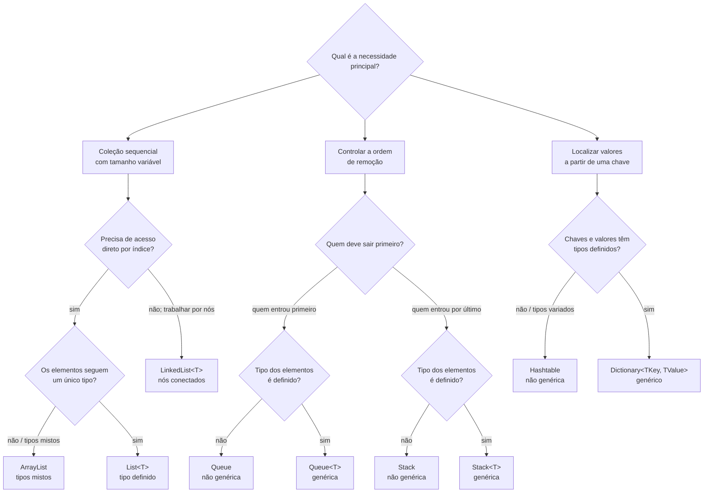

# Algoritmos e estruturas de dados

## Visão geral

O estudo da disciplina começou pelas coleções não genéricas e genéricas do .NET e agora avança para a organização interna das estruturas de dados. `ArrayList` introduz uma coleção redimensionável; `Queue` e `Stack` mostram comportamentos FIFO e LIFO; `Hashtable` trabalha com pares chave–valor e hashing; as coleções genéricas acrescentam contratos de tipo. Na Unidade 2, o foco passa a incluir listas lineares e flexíveis, árvores binárias e tabelas hash como modelos de implementação e análise.

A parte de classes, objetos e referências retoma conceitos já estudados em [[01. Programacao Modular/00. Programação modular - Resumo|Programação modular]], agora aplicados ao comportamento de objetos armazenados em coleções. A sintaxe de repetição usada para percorrer coleções também se conecta ao guia [[00. Sintaxe Multilinguagem/03. Estruturas de repetição (while, for, do-while)|Estruturas de repetição e iteração]].

## Mapa de conteúdo

- [x] [[01. ArrayList, referências e operações em coleções|01. ArrayList, referências e operações em coleções]] — capacidade e quantidade, `foreach`, operações da coleção, referências de objetos, ordenação e pesquisa.
- [x] [[02. Queue e Stack (filas, pilhas, FIFO e LIFO)|02. Queue e Stack (filas, pilhas, FIFO e LIFO)]] — ordem de entrada e saída, FIFO, LIFO, `Enqueue`, `Dequeue`, `Push`, `Pop` e `Peek`.
- [x] [[03. Hashtable (chave, valor, hashing e colisões)|03. Hashtable (chave, valor, hashing e colisões)]] — pares chave–valor, função hash, acesso por chave, colisões e operações de consulta.
- [x] [[04. Coleções genéricas em C# (List, LinkedList, Queue, Stack e Dictionary)|04. Coleções genéricas em C#]] — type safety, boxing/unboxing, `List<T>`, `LinkedList<T>`, filas e pilhas tipadas, `Dictionary<TKey, TValue>` e comparação genérica.
- [x] [[05. Listas lineares e flexíveis, árvores binárias e tabelas hash|05. Listas lineares e flexíveis, árvores binárias e tabelas hash]] — armazenamento sequencial e encadeado, nós e referências, árvores binárias, notação `Θ`, `lg n` e visão estrutural de tabelas hash.
- [x] [[06. Lista linear (array, contador, inserção e remoção)|06. Lista linear: array, contador, inserção e remoção]] — implementação sequencial com `array + n`, deslocamentos em inserção e remoção, limites de posição e remoção lógica versus física.
- [x] [[07. Classes autorreferenciais e células encadeadas|07. Classes autorreferenciais e células encadeadas]] — referências entre objetos do mesmo tipo, classe `Celula`, atributo `prox`, `null` e base para listas flexíveis.
- [x] [[08. Lista flexível (nó cabeça, inserção, remoção e percurso)|08. Lista flexível: nó cabeça, inserção, remoção e percurso]] — `primeiro` e `ultimo`, nó cabeça, percurso por `prox`, inserções e remoções nas extremidades e por posição.
- [x] [[09. Árvore binária de pesquisa (estrutura, busca e operações)|09. Árvore binária de pesquisa: estrutura, busca e operações]] — raiz, pais e filhos, folhas, subárvores, altura, pesquisa, percursos, inserção, remoção e extremos.
- [x] [[10. Árvores AVL (balanceamento e rotações)|10. Árvores AVL: balanceamento e rotações]] — fator de balanceamento, rotações simples e duplas, escolha da rotação e princípio de balanceamento AVL.

**Unidade 1 concluída; Unidade 2 em andamento:** os quatro primeiros artigos consolidam a primeira unidade. Os artigos 05 a 08 cobrem os modelos internos de listas lineares e flexíveis; o artigo 09 aprofunda árvores binárias de pesquisa e suas operações; o artigo 10 introduz balanceamento e árvores AVL.

## Pontos centrais até agora

As estruturas estudadas resolvem problemas diferentes. `ArrayList` prioriza uma coleção sequencial cujo tamanho pode variar. `Queue` e `Stack` restringem a ordem de remoção: filas seguem FIFO e pilhas seguem LIFO. `Hashtable` organiza o acesso por meio de chaves associadas a valores. As versões genéricas preservam esses comportamentos, mas acrescentam um contrato de tipo: `List<T>` tipa listas sequenciais, `LinkedList<T>` organiza nós conectados, `Queue<T>` e `Stack<T>` mantêm FIFO/LIFO com tipo definido, e `Dictionary<TKey, TValue>` tipa chaves e valores separadamente.

A Unidade 2 acrescenta uma nova camada de análise: além de saber usar a coleção, passa a importar **como ela organiza seus dados internamente**. Listas lineares usam armazenamento sequencial baseado em array; listas flexíveis usam nós conectados por referências; árvores organizam nós hierarquicamente; tabelas hash usam uma função de transformação para aproximar uma chave da região onde seu valor está armazenado.

Na implementação de uma lista linear, o array representa a capacidade física e um contador `n` define a quantidade lógica de elementos. Inserções no início ou no meio deslocam elementos para a direita; remoções nessas posições deslocam os seguintes para a esquerda. A lista considera válidas apenas as posições de `0` até `n - 1`, o que diferencia remoção lógica do valor que ainda pode permanecer fisicamente no array.

A passagem da lista linear para a lista flexível introduz classes autorreferenciais. Uma célula guarda um elemento e uma referência `prox` para outra célula do mesmo tipo. Esse encadeamento permite formar sequências sem depender de posições contíguas em um array.

Na lista flexível, `primeiro` e `ultimo` controlam as extremidades, enquanto um nó cabeça funciona como sentinela. O percurso deixa de usar índices e passa a avançar por referências (`i = i.prox`). Inserções e remoções alteram conexões entre células; em uma lista simplesmente encadeada, remover no fim exige caminhar até o penúltimo nó.

Nas árvores binárias de pesquisa, a organização hierárquica permite decidir entre esquerda e direita a cada comparação. A altura passa a determinar o custo das operações: árvores balanceadas podem manter pesquisa, inserção e remoção próximas de `Θ(log n)`, enquanto uma árvore degenerada pode se aproximar de `Θ(n)`. As árvores AVL acrescentam um fator de balanceamento por nó e rotações para corrigir desníveis após alterações.

### Quando usar cada estrutura

O primeiro critério é o **comportamento da estrutura**: sequência, ordem de remoção ou acesso por chave. Depois entra a tipagem. Quando os elementos seguem um contrato de tipo conhecido, as versões genéricas (`List<T>`, `Queue<T>`, `Stack<T>` e `Dictionary<TKey, TValue>`) preservam o mesmo modelo com segurança de tipagem e menos casts. `LinkedList<T>` entra quando a sequência é organizada por nós conectados, sem acesso direto por índice. As versões não genéricas permanecem úteis para compreender o modelo e permitem maior mistura de tipos, como estudado em `ArrayList`, `Queue`, `Stack` e `Hashtable`.

`Count` aparece como medida da quantidade de elementos armazenados em diferentes coleções, enquanto `Capacity` foi estudada especificamente em `ArrayList` e `List<T>`. Métodos como `Clear`, `Contains` e `Peek` ganham significado de acordo com a estrutura em que são usados.

Ao armazenar objetos de classes criadas pelo programa, a leitura da coleção depende também do conceito de referência. Duas variáveis podem apontar para a mesma instância e, quando os elementos precisam ser ordenados ou pesquisados segundo um atributo específico, o critério de comparação precisa ser definido explicitamente.

Como apoio de sintaxe, permanece disponível a nota [[Recordando C# e arrays|Recordando C# e arrays]].

## Glossário

Os conceitos acumulados nesta disciplina estão consolidados em [[Glossário de conceitos|Glossário de conceitos]], com links diretos para as seções em que cada termo é explicado.

## Autores e pioneiros citados na disciplina

| Autor | Contribuição no contexto da disciplina | Artigos relacionados | Perfil |
| --- | --- | --- | --- |
| Harvey M. Deitel | Coautor de obras didáticas de programação adotadas como referência básica para C# e fundamentos de programação. | [[04. Coleções genéricas em C# (List, LinkedList, Queue, Stack e Dictionary)|Coleções genéricas em C#]] e conteúdos da unidade 1 | [Deitel & Associates](https://deitel.com/about/) |
| John Sharp | Autor de obras didáticas sobre Visual C# e desenvolvimento na plataforma .NET, adotado como referência básica da unidade. | Conteúdos da unidade 1 | [Microsoft Press](https://www.microsoftpressstore.com/authors/bio.aspx?a=04A3A18F-CB1C-471B-9D23-49881ABCBFD5) |

## Referências bibliográficas

### Bibliografia básica

- MICROSOFT. **Documentação oficial da linguagem C#**. Disponível em: [https://docs.microsoft.com/pt-br/dotnet/csharp/](https://docs.microsoft.com/pt-br/dotnet/csharp/).
- DEITEL, Harvey M. et al. **C#: como programar**. Pearson. Acesso restrito pela Biblioteca PUC Minas: [Pergamum](http://bib.pucminas.br/pergamum/biblioteca_s/acesso_login.php?cod_acervo_acessibilidade=5000802&acesso=aHR0cHM6Ly9taWRkbGV3YXJlLWJ2LmFtNC5jb20uYnIvU1NPL3B1Y21pbmFzLzk3ODg1MzQ2MTQ1OTc=&label=acesso%20restrito).
- SHARP, John. **Microsoft Visual C# 2008**. Porto Alegre: Bookman, 2014. Acesso restrito pela Biblioteca PUC Minas: [Pergamum](http://bib.pucminas.br/pergamum/biblioteca_s/acesso_login.php?cod_acervo_acessibilidade=5016211&acesso=aHR0cHM6Ly9pbnRlZ3JhZGEubWluaGFiaWJsaW90ZWNhLmNvbS5ici9ib29rcy85Nzg4NTc3ODAzOTU4&label=acesso%20restrito).

### Bibliografia complementar e materiais indicados

- MICROSOFT. **Visual Studio**. Disponível em: [https://visualstudio.microsoft.com/pt-br/](https://visualstudio.microsoft.com/pt-br/).
- REPLIT. **Replit**. Disponível em: [https://replit.com](https://replit.com).
- Material de aula sobre `ArrayList`, referências e comparação de objetos.
- Material de aula sobre `Queue`, `Stack`, FIFO, LIFO e operações de fila e pilha.
- Material de aula sobre `Hashtable`, chave–valor, função hash e colisões.
- Material de aula sobre coleções genéricas, `List<T>`, `LinkedList<T>`, `Queue<T>`, `Stack<T>`, `Dictionary<TKey, TValue>`, `IComparer<T>`, boxing e unboxing.
- MICROSOFT. **Generics in .NET**. Microsoft Learn. Disponível em: [https://docs.microsoft.com/pt-br/dotnet/standard/generics/](https://docs.microsoft.com/pt-br/dotnet/standard/generics/).
- MICROSOFT. **List<T> Class**. Microsoft Learn. Disponível em: [https://docs.microsoft.com/pt-br/dotnet/api/system.collections.generic.list-1?view=net-5.0](https://docs.microsoft.com/pt-br/dotnet/api/system.collections.generic.list-1?view=net-5.0).
- MICROSOFT. **LinkedList<T> Class**. Microsoft Learn. Disponível em: [https://docs.microsoft.com/pt-br/dotnet/api/system.collections.generic.linkedlist-1?view=net-5.0](https://docs.microsoft.com/pt-br/dotnet/api/system.collections.generic.linkedlist-1?view=net-5.0).
- MICROSOFT. **Dictionary<TKey,TValue> Class**. Microsoft Learn. Disponível em: [https://docs.microsoft.com/pt-br/dotnet/api/system.collections.generic.dictionary-2?view=net-5.0](https://docs.microsoft.com/pt-br/dotnet/api/system.collections.generic.dictionary-2?view=net-5.0).
- MICROSOFT. **IComparer<T> Interface**. Microsoft Learn. Disponível em: [https://docs.microsoft.com/pt-br/dotnet/api/system.collections.generic.icomparer-1?view=net-5.0](https://docs.microsoft.com/pt-br/dotnet/api/system.collections.generic.icomparer-1?view=net-5.0).
- MICROSOFT. **Queue Class**. Microsoft Learn. Disponível em: [https://docs.microsoft.com/pt-br/dotnet/api/system.collections.queue?view=net-5.0](https://docs.microsoft.com/pt-br/dotnet/api/system.collections.queue?view=net-5.0).
- MICROSOFT. **Stack Class**. Microsoft Learn. Disponível em: [https://docs.microsoft.com/pt-br/dotnet/api/system.collections.stack?view=net-5.0](https://docs.microsoft.com/pt-br/dotnet/api/system.collections.stack?view=net-5.0).
- MICROSOFT. **Hashtable Class**. Microsoft Learn. Disponível em: [https://docs.microsoft.com/pt-br/dotnet/api/system.collections.hashtable?view=net-5.0](https://docs.microsoft.com/pt-br/dotnet/api/system.collections.hashtable?view=net-5.0).
- GOMES, F. M. **Pré-cálculo: operações, equações, funções e trigonometria**. Cengage Learning Brasil, 2018. Material complementar para revisão de logaritmos. Acesso restrito pela Biblioteca PUC Minas: [Pergamum](http://bib.pucminas.br/pergamum/biblioteca_s/acesso_login.php?cod_acervo_acessibilidade=5216860&acesso=aHR0cHM6Ly9pbnRlZ3JhZGEubWluaGFiaWJsaW90ZWNhLmNvbS5ici9ib29rcy85Nzg4NTIyMTI3OTAw&label=acesso%20restrito).
- STEWART, James. **Cálculo: volume 1**. 8. ed. São Paulo: Cengage Learning, 2017. Material complementar para revisão de logaritmos. Acesso restrito pela Biblioteca PUC Minas: [Pergamum](http://bib.pucminas.br/pergamum/biblioteca_s/acesso_login.php?cod_acervo_acessibilidade=5033340&acesso=aHR0cHM6Ly9pbnRlZ3JhZGEubWluaGFiaWJsaW90ZWNhLmNvbS5ici9ib29rcy85Nzg4NTIyMTI2ODU5&label=acesso%20restrito).
- VISUALGO. **Binary Search Trees**. Visualizador interativo de pesquisa, inserção, remoção e percursos em árvores binárias: [https://visualgo.net/en/bst](https://visualgo.net/en/bst).
- UNIVERSITY OF SAN FRANCISCO. **Binary Search Trees**. Visualizador de operações em árvores binárias de pesquisa: [https://www.cs.usfca.edu/~galles/visualization/BST.html](https://www.cs.usfca.edu/~galles/visualization/BST.html).
- UNIVERSITY OF SAN FRANCISCO. **AVL Trees**. Visualizador de inserções e balanceamento em árvores AVL: [https://www.cs.usfca.edu/~galles/visualization/AVLtree.html](https://www.cs.usfca.edu/~galles/visualization/AVLtree.html).

## Guia de estudos com LLM

Para estudar esta matéria usando inteligência artificial, consulte [[Prompts de Estudo (LLM)|Prompts de estudo (LLM)]]. Os prompts devem usar este resumo, os artigos numerados e o [[Glossário de conceitos|glossário]] como referências primárias do conteúdo efetivamente estudado.
