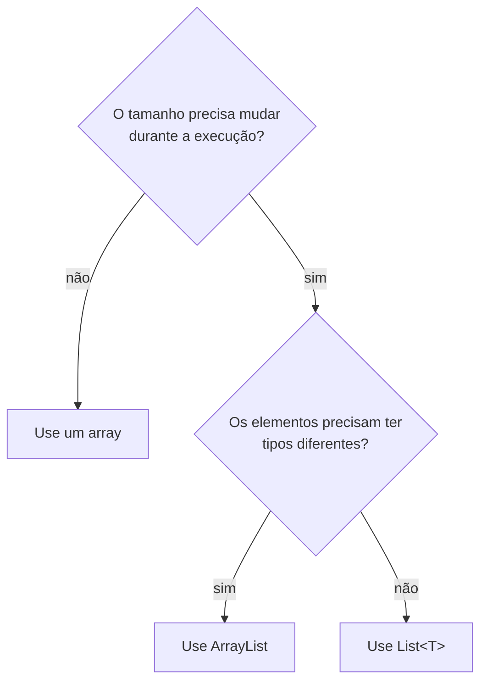

# ArrayList, referências e operações em coleções

> **Contexto:** Este artigo introduz a `ArrayList` como coleção redimensionável de `System.Collections`, relacionando capacidade, quantidade de elementos, iteração com `foreach`, operações de inserção e remoção, referências de objetos e comparação para ordenação e pesquisa.

Uma `ArrayList` é uma coleção cujo tamanho pode crescer conforme novos elementos são adicionados. Isso a diferencia de um array tradicional, cujo tamanho é definido na criação. A coleção também pode armazenar objetos de tipos diferentes, porque seus elementos são tratados como `object`.

Para utilizar `ArrayList`, é necessário importar o namespace `System.Collections`:

```csharp
using System.Collections;
```

A criação da coleção usa a palavra reservada `new`. A inserção de elementos é feita por métodos como `Add` e `Insert`:

```csharp
ArrayList lista = new ArrayList();
lista.Add(10);
lista.Add("texto");
```

## Array e ArrayList

Um **array** e uma **ArrayList** armazenam vários elementos, mas fazem escolhas diferentes sobre tamanho e tipos.

| Característica | Array | ArrayList |
| --- | --- | --- |
| **Tamanho** | Fixo depois da criação | Pode crescer e diminuir durante a execução |
| **Tipos dos elementos** | Todos os elementos seguem o tipo declarado do array | Armazena elementos como `object`, podendo receber tipos diferentes |
| **Acesso por índice** | Sim | Sim |
| **Quantidade de elementos** | Definida pelo tamanho do array | Disponível em `Count` |
| **Espaço reservado** | Coincide com o tamanho criado | É controlado por `Capacity` |
| **Inserção e remoção** | Exigem manipulação manual ou criação de outro array | Possui métodos como `Add`, `Insert`, `Remove` e `RemoveAt` |
| **Redimensionamento** | Exige criar outra estrutura com novo tamanho | É feito internamente pela própria coleção quando necessário |

Em C#:

```csharp
int[] numeros = new int[3];

numeros[0] = 10;
numeros[1] = 20;
numeros[2] = 30;
```

Nesse caso, `numeros` continua com três posições. Para armazenar um quarto elemento, seria necessário criar outro array com maior capacidade e copiar os valores existentes.

Com `ArrayList`, a coleção pode crescer:

```csharp
ArrayList numeros = new ArrayList();

numeros.Add(10);
numeros.Add(20);
numeros.Add(30);
numeros.Add(40);
```

A diferença central pode ser resumida assim: **o array reserva uma quantidade fixa de posições; a `ArrayList` administra internamente uma capacidade que pode aumentar conforme novos elementos são adicionados**.

### Quando usar ArrayList

A decisão pode ser reduzida a duas perguntas: o tamanho precisa mudar durante a execução? E os elementos precisam ter tipos diferentes?



No contexto deste conteúdo, `ArrayList` faz sentido quando a quantidade de elementos pode variar e a coleção precisa aceitar objetos tratados como `object`. Se todos os elementos pertencem ao mesmo tipo, as coleções genéricas oferecem uma alternativa com verificação de tipo mais forte; esse tema aparece em [[01. Programacao Modular/20. Tipos genéricos (generics, type safety e coleções homogêneas)|Tipos genéricos]].

A nota [[Recordando C# e arrays#Arrays (fileira de armários numerados)|Recordando C# e arrays]] detalha o funcionamento dos arrays e o acesso por índice.

## Capacidade e quantidade de elementos

Duas propriedades ajudam a entender o estado de uma `ArrayList`: `Capacity` e `Count`. Elas representam coisas diferentes.

**`Count`** informa quantos elementos estão efetivamente armazenados. **`Capacity`** informa quantos elementos a estrutura consegue comportar antes de precisar ampliar seu espaço interno.

Quando a capacidade não é definida na criação, a coleção começa com `Capacity = 0`. Ao inserir o primeiro elemento, a capacidade passa para 4. Quando esse espaço se esgota e um novo elemento precisa ser inserido, a capacidade é ampliada. Nesse crescimento automático, ela passa de 4 para 8, depois para 16 e assim por diante.

```csharp
using System;
using System.Collections;

class Program
{
    static void Main()
    {
        ArrayList lista = new ArrayList();

        Console.WriteLine(
            "Capacity: {0} / Count: {1}",
            lista.Capacity,
            lista.Count
        );

        lista.Add(1);

        Console.WriteLine(
            "Capacity: {0} / Count: {1}",
            lista.Capacity,
            lista.Count
        );
    }
}
```

Nesse exemplo, a primeira impressão mostra capacidade e quantidade iguais a zero. Depois de `Add(1)`, a coleção possui um elemento, então `Count` passa a 1, enquanto `Capacity` passa a 4.

Também é possível definir uma capacidade inicial:

```csharp
ArrayList lista = new ArrayList(10);
```

Nesse caso, a coleção já é criada com capacidade para 10 elementos. A capacidade e a quantidade continuam independentes: uma coleção com `Capacity = 10` pode ter `Count = 0`, `Count = 3` ou `Count = 10`.

## Percorrendo a coleção com foreach

O comando `foreach` percorre os elementos de uma coleção sem exigir o controle manual de um índice. Enquanto um `for` costuma trabalhar explicitamente com uma variável de controle, o `foreach` entrega cada elemento da coleção, um por vez. A sintaxe geral e a comparação com `for`, `while` e `do-while` estão consolidadas em [[00. Sintaxe Multilinguagem/03. Estruturas de repetição (while, for, do-while)#Iteração direta sobre coleções (`foreach`)|Estruturas de repetição e iteração]].

```csharp
ArrayList lista = new ArrayList();

lista.Add(10);
lista.Add(20);
lista.Add(30);

foreach (object elemento in lista)
{
    Console.WriteLine(elemento);
}
```

Quando sabemos que os elementos representam números inteiros, podemos converter cada objeto durante a iteração:

```csharp
int soma = 0;

foreach (object elemento in lista)
{
    soma += (int)elemento;
}
```

Uma aplicação simples combina `for` e `foreach`: primeiro lê cinco números inteiros, adiciona cada valor à coleção e calcula a média; depois percorre novamente a `ArrayList` para mostrar somente os valores maiores que essa média.

```csharp
using System;
using System.Collections;

class Program
{
    static void Main()
    {
        ArrayList numeros = new ArrayList();
        double soma = 0;

        for (int i = 0; i < 5; i++)
        {
            int numero = int.Parse(Console.ReadLine());
            numeros.Add(numero);
            soma += numero;
        }

        double media = soma / numeros.Count;

        foreach (object elemento in numeros)
        {
            int numero = (int)elemento;

            if (numero > media)
            {
                Console.WriteLine(numero);
            }
        }
    }
}
```

A combinação mostra duas formas diferentes de repetição: o `for` controla quantas leituras serão feitas, enquanto o `foreach` percorre os elementos que já estão armazenados.

## Inserção, remoção e consulta

Os métodos da `ArrayList` podem ser entendidos por função, em vez de memorizados como uma lista isolada.

| Operação | Método | Efeito |
| --- | --- | --- |
| Inserir no final | `Add` | Insere um objeto e retorna a posição em que ele foi adicionado. |
| Inserir em uma posição | `Insert` | Insere um objeto no índice especificado. |
| Remover por valor | `Remove` | Remove a primeira ocorrência do objeto especificado. |
| Remover por índice | `RemoveAt` | Remove o objeto armazenado no índice especificado. |
| Remover um intervalo | `RemoveRange` | Remove uma quantidade de elementos a partir de um índice. |
| Limpar a coleção | `Clear` | Remove todos os elementos sem reduzir automaticamente a capacidade. |
| Verificar presença | `Contains` | Informa se um objeto está presente na coleção. |
| Localizar a primeira ocorrência | `IndexOf` | Retorna o índice da primeira ocorrência encontrada. |
| Localizar a última ocorrência | `LastIndexOf` | Retorna o índice da última ocorrência encontrada. |

Os nomes dos métodos seguem **PascalCase**, como é comum nos membros públicos da biblioteca .NET: `RemoveAt`, `IndexOf`, `LastIndexOf` e `RemoveRange`.

Um exemplo reúne inserções e remoções:

```csharp
ArrayList lista = new ArrayList();

lista.Add(15);
lista.Add(3.14);
lista.Add("texto");

lista.Insert(2, 125);

lista.Remove(3.14);
lista.RemoveAt(0);
```

`Insert`, `RemoveAt` e `RemoveRange` dependem de posições válidas. Tentar operar sobre uma posição que não existe produz uma exceção.

Depois de `Clear()`, `Count` passa a zero, mas a capacidade pode permanecer maior que zero:

```csharp
lista.Clear();

Console.WriteLine(lista.Count);
Console.WriteLine(lista.Capacity);
```

### Alterando um elemento

Como a `ArrayList` permite acesso por índice, um elemento pode ser **substituído diretamente**:

```csharp
ArrayList nomes = new ArrayList();

nomes.Add("Ana");
nomes.Add("Bruno");
nomes.Add("Carla");

nomes[1] = "Carlos";
```

A posição `1` deixa de armazenar `"Bruno"` e passa a armazenar `"Carlos"`.

No caso de `string`, a ideia correta é falar em **substituição**, porque strings em C# são imutáveis: o conteúdo da string existente não é alterado; outra string passa a ocupar aquela posição.

Quando a coleção armazena um objeto mutável, há outra possibilidade. Se a `ArrayList` guarda uma referência para um objeto `Aluno`, alterar uma propriedade desse objeto altera o próprio objeto referenciado:

```csharp
Aluno aluno = new Aluno("Ana", 1, "ana@email.com");

ArrayList alunos = new ArrayList();
alunos.Add(aluno);

aluno.Nome = "Maria";
```

A coleção continua guardando a mesma referência, mas o objeto agora possui `Nome = "Maria"`. Essa diferença entre **substituir o elemento da coleção** e **modificar o objeto referenciado** é importante nas demais estruturas estudadas também.

## Reorganização, conversão e pesquisa

Outros métodos alteram a ordem dos elementos, convertem a coleção ou ajustam sua capacidade.

| Método | Função |
| --- | --- |
| `Reverse` | Inverte a ordem dos elementos, podendo atuar sobre toda a coleção ou sobre um intervalo. |
| `Sort` | Ordena os elementos. |
| `ToArray` | Copia os elementos para um array. |
| `TrimToSize` | Ajusta `Capacity` para a quantidade de elementos atualmente armazenada. |
| `BinarySearch` | Realiza uma pesquisa binária e retorna a posição encontrada ou um valor negativo quando não encontra o elemento. |

Considere uma coleção que chegou a `Capacity = 32`, mas atualmente contém 21 elementos. Depois de `TrimToSize()`, a capacidade é ajustada para 21:

```csharp
lista.TrimToSize();

Console.WriteLine(lista.Count);
Console.WriteLine(lista.Capacity);
```

A conversão para array cria outra estrutura com os elementos da coleção:

```csharp
object[] vetor = lista.ToArray();
```

`Reverse`, `Sort`, `ToArray`, `TrimToSize` e `BinarySearch` podem ser combinados para observar como ordem, representação, capacidade e localização de elementos mudam durante a execução.

## Classes, objetos e referências

Quando uma classe é criada, ela define quais dados e comportamentos seus objetos terão. Uma classe `Aluno`, por exemplo, pode definir matrícula, nome e e-mail. Um objeto é uma instância dessa classe.

```csharp
class Aluno
{
    public int Matricula;
    public string Nome;
    public string Email;

    public Aluno(string nome, int matricula, string email)
    {
        Nome = nome;
        Matricula = matricula;
        Email = email;
    }

    public void Mostrar()
    {
        Console.WriteLine(
            "{0} / {1} / {2}",
            Nome,
            Matricula,
            Email
        );
    }
}
```

Ao trabalhar com objetos de classe, uma variável guarda uma **referência** ao objeto. Por isso, duas variáveis podem apontar para a mesma instância:

```csharp
Aluno a1 = new Aluno("Ana", 1, "ana@email.com");
Aluno a2 = a1;

a2.Matricula = 3;

a1.Mostrar();
a2.Mostrar();
```

`a1` e `a2` são duas variáveis diferentes, mas ambas referenciam o mesmo objeto. Quando `a2.Matricula` é alterada, o objeto compartilhado muda; por isso, a alteração também é observada ao acessar o objeto por `a1`.

Essa ideia é importante quando uma `ArrayList` armazena objetos:

```csharp
ArrayList alunos = new ArrayList();

Aluno joao = new Aluno("João", 10, "joao@email.com");
alunos.Add(joao);

Console.WriteLine(alunos.Contains(joao));
```

Quando a mesma referência de `Aluno` adicionada à coleção é consultada por `Contains` ou `IndexOf`, ela é encontrada. Quando outro objeto é criado com os mesmos valores, ele continua sendo uma instância diferente.

> **Precisão conceitual:** nessa implementação de `Aluno`, a classe não define uma regra própria de igualdade. Por isso, duas instâncias com os mesmos atributos continuam sendo objetos distintos para essas comparações.

## Ordenação e pesquisa de objetos

Com números ou strings, existe um critério de ordenação conhecido. Com objetos de uma classe criada pelo programador, é necessário determinar qual atributo será usado na comparação. Um aluno pode ser ordenado por matrícula, nome ou outro campo.

Uma classe comparadora para `Aluno` resolve esse problema definindo explicitamente o critério de ordenação. O comparador recebe dois objetos, converte-os para `Aluno` e compara o atributo escolhido. Aqui, o critério é o nome.

```csharp
using System.Collections;

class ComparaAlunoPorNome : IComparer
{
    public int Compare(object x, object y)
    {
        Aluno aluno1 = (Aluno)x;
        Aluno aluno2 = (Aluno)y;

        return string.Compare(aluno1.Nome, aluno2.Nome);
    }
}
```

O comparador pode então ser usado na ordenação:

```csharp
ArrayList alunos = new ArrayList();

alunos.Add(new Aluno("Maria", 11, "maria@email.com"));
alunos.Add(new Aluno("Ana", 12, "ana@email.com"));
alunos.Add(new Aluno("João", 13, "joao@email.com"));

ComparaAlunoPorNome comparador = new ComparaAlunoPorNome();

alunos.Sort(comparador);
```

A mesma lógica de comparação pode ser usada na pesquisa binária:

```csharp
Aluno procurado = new Aluno("João", 0, "");

int posicao = alunos.BinarySearch(procurado, comparador);

Console.WriteLine(posicao);
```

O ponto central é que a coleção não consegue adivinhar qual atributo de um objeto representa sua ordem. Quando os elementos são objetos definidos pelo programa, o critério de comparação precisa ser explicitado.

## Pontos que costumam gerar confusão

- **`Capacity` não é a quantidade de elementos.** `Capacity` representa o espaço disponível; `Count` representa quantos elementos estão armazenados.
- **`new` não insere um elemento na coleção.** `new` cria um objeto; `Add` e `Insert` fazem inserções na `ArrayList`.
- **`Clear` não implica capacidade zero.** Os elementos são removidos, mas a capacidade reservada pode ser mantida.
- **Duas variáveis podem apontar para o mesmo objeto.** Alterar o objeto por uma referência faz a mudança aparecer também quando ele é acessado pela outra.
- **Dois objetos com os mesmos atributos não são necessariamente o mesmo objeto.** Criar outra instância de `Aluno` com os mesmos valores produz outra referência.
- **Ordenar objetos exige um critério.** Para `Aluno`, é necessário dizer se a comparação será feita por nome, matrícula ou outro atributo.
- **Os métodos públicos aparecem em PascalCase.** Exemplos: `Add`, `RemoveAt`, `IndexOf`, `TrimToSize` e `BinarySearch`.
