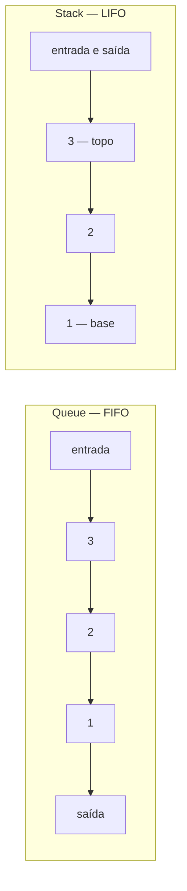
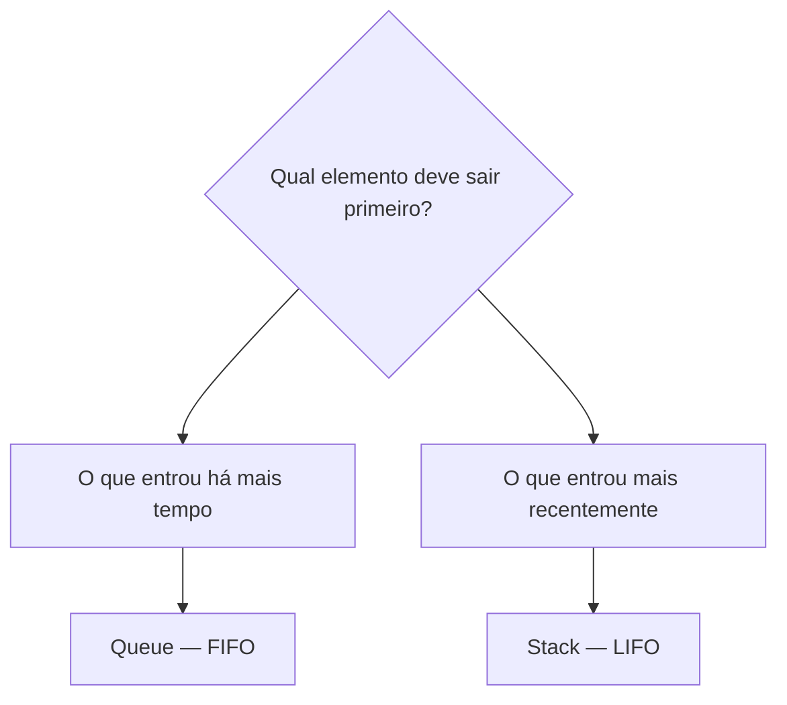

# Queue e Stack: filas, pilhas, FIFO e LIFO

> **Contexto:** `Queue` e `Stack` são coleções de `System.Collections` que armazenam vários elementos, mas impõem regras diferentes para decidir qual elemento será removido primeiro. A diferença central está na ordem de entrada e saída: filas seguem FIFO; pilhas seguem LIFO.

Para utilizar essas estruturas, é necessário importar `System.Collections`:

```csharp
using System.Collections;
```

## Queue e Stack representam ordens diferentes

Uma `Queue` representa uma **fila**. O primeiro elemento inserido é também o primeiro a ser removido. Essa regra é chamada **FIFO** (*First In, First Out*).

Pense em uma **fila de espera** em um banco, cinema ou atendimento. Quem chega primeiro ocupa a frente da fila e, portanto, tende a ser atendido primeiro. Quem chega depois entra no final. A lógica é exatamente a mesma: **primeiro a entrar, primeiro a sair**.

Uma `Stack` representa uma **pilha**. O último elemento inserido é o primeiro a ser removido. Essa regra é chamada **LIFO** (*Last In, First Out*).

Pense em uma **pilha de pratos**. Cada novo prato é colocado no topo. Quando alguém retira um prato, pega justamente o que foi colocado por último, porque os pratos anteriores estão abaixo dele. A lógica é: **último a entrar, primeiro a sair**.

| Estrutura | Modelo | Entrada | Saída | Próximo a sair |
| --- | --- | --- | --- | --- |
| `Queue` | FIFO | `Enqueue` | `Dequeue` | Elemento mais antigo |
| `Stack` | LIFO | `Push` | `Pop` | Elemento mais recente |

A diferença pode ser visualizada assim:



Se os valores `1`, `2` e `3` forem inseridos nessa ordem, `Queue` remove primeiro o `1`, enquanto `Stack` remove primeiro o `3`.

## Inserindo e removendo elementos

Na fila, `Enqueue` insere um objeto e `Dequeue` remove e retorna o próximo objeto da fila:

```csharp
Queue fila = new Queue();

fila.Enqueue(1);
fila.Enqueue(2);
fila.Enqueue(3);

object removido = fila.Dequeue();

Console.WriteLine(removido); // 1
```

O método `Enqueue` recebe **um objeto por chamada**. Se vários valores já estiverem armazenados em um array ou outra coleção, é possível percorrê-los com `foreach` e enfileirar cada elemento:

```csharp
int[] numeros = { 1, 2, 3 };

Queue fila = new Queue();

foreach (int numero in numeros)
{
    fila.Enqueue(numero);
}
```

Nesse caso, o código adiciona vários valores à fila, mas `Enqueue` continua sendo executado individualmente para cada elemento. O `foreach` apenas automatiza a repetição das chamadas.

Na pilha, `Push` insere um objeto e `Pop` remove e retorna o objeto que está no topo:

```csharp
Stack pilha = new Stack();

pilha.Push(1);
pilha.Push(2);
pilha.Push(3);

object removido = pilha.Pop();

Console.WriteLine(removido); // 3
```

A sintaxe muda porque cada estrutura representa uma operação diferente. Em uma fila, inserir significa **enfileirar**; em uma pilha, inserir significa **empilhar**.

## Operações em comum entre Queue e Stack

As duas coleções oferecem operações em comum:

| Método ou propriedade | Efeito |
| --- | --- |
| `Peek` | Retorna o próximo objeto a ser removido, sem removê-lo. |
| `Contains` | Informa se a estrutura contém determinado objeto. |
| `Clear` | Remove todos os elementos armazenados. |
| `Count` | Informa quantos elementos existem atualmente na estrutura. |

`Peek` é especialmente útil porque respeita a regra de cada estrutura. Na fila, ele mostra o elemento mais antigo; na pilha, mostra o elemento mais recente:

```csharp
Queue fila = new Queue();
fila.Enqueue(1);
fila.Enqueue(2);
fila.Enqueue(3);

Console.WriteLine(fila.Peek()); // 1

Stack pilha = new Stack();
pilha.Push(1);
pilha.Push(2);
pilha.Push(3);

Console.WriteLine(pilha.Peek()); // 3
```

`Clear` esvazia a coleção. O objeto `Queue` ou `Stack` continua existindo e pode receber novos elementos; o que passa a zero é a quantidade de elementos armazenados:

```csharp
fila.Clear();

Console.WriteLine(fila.Count); // 0

fila.Enqueue(10);
Console.WriteLine(fila.Count); // 1
```

Neste conteúdo, o estado das duas estruturas é acompanhado por `Count`. A propriedade `Capacity`, estudada em `ArrayList`, não faz parte do conjunto de propriedades apresentado aqui.

## Queue<T> e Stack<T>: mesma regra, tipo definido

As versões genéricas preservam exatamente os modelos FIFO e LIFO. A diferença é que o tipo passa a ser declarado na própria coleção, por meio de `System.Collections.Generic`:

```csharp
using System.Collections.Generic;

Queue<int> fila = new Queue<int>();
fila.Enqueue(1);
int primeiro = fila.Dequeue();

Stack<int> pilha = new Stack<int>();
pilha.Push(1);
int topo = pilha.Pop();
```

`Queue<int>` só aceita inteiros e `Dequeue` já devolve `int`; `Stack<int>` segue a mesma lógica com `Pop`. Métodos como `Peek`, `Contains`, `Clear` e a propriedade `Count` continuam disponíveis. A genericidade muda a **tipagem**, não a ordem de remoção. A comparação completa com as demais coleções está em [[04. Coleções genéricas em C# (List, LinkedList, Queue, Stack e Dictionary)#Queue<T> e Stack<T> preservam FIFO e LIFO|Coleções genéricas em C#]].

## Alterando elementos em Queue e Stack

`Queue` e `Stack` não oferecem acesso direto por índice. Portanto, não existe uma operação equivalente a `fila[1] = "novo"` ou `pilha[1] = "novo"`.

Isso acontece porque essas estruturas foram desenhadas para restringir o acesso aos elementos conforme sua regra de ordem. Em uma fila, o acesso operacional acontece pela frente; em uma pilha, pelo topo.

Se o elemento armazenado for uma `string`, não é possível modificar aquele valor no meio da estrutura. Como `string` é imutável, seria necessário remover os elementos necessários, substituir o valor e reconstruir a estrutura preservando a ordem desejada.

Por exemplo, esta operação não altera um elemento "no lugar":

```csharp
Queue fila = new Queue();

fila.Enqueue("Ana");
fila.Enqueue("Bruno");

string nome = (string)fila.Dequeue();
nome = "Maria";
fila.Enqueue(nome);
```

O valor `"Ana"` foi retirado da frente e `"Maria"` foi inserido no final. A ordem da fila mudou.

Com objetos mutáveis, a situação é diferente. A estrutura armazena a referência ao objeto, então o próprio objeto pode ser modificado sem removê-lo da coleção:

```csharp
Aluno aluno = new Aluno("Ana", 1, "ana@email.com");

Queue fila = new Queue();
fila.Enqueue(aluno);

aluno.Nome = "Maria";
```

A fila continua apontando para o mesmo objeto `Aluno`, agora com o nome alterado. O mesmo raciocínio vale para uma `Stack`.

## Comparando o mesmo conjunto de operações

O contraste fica mais claro quando as duas estruturas recebem os mesmos valores:

```csharp
using System;
using System.Collections;

class Program
{
    static void Main()
    {
        Queue fila = new Queue();
        Stack pilha = new Stack();

        for (int i = 1; i <= 5; i++)
        {
            fila.Enqueue(i);
            pilha.Push(i);
        }

        Console.WriteLine($"Fila — Count: {fila.Count}");
        Console.WriteLine($"Fila — próximo: {fila.Peek()}");
        Console.WriteLine($"Fila — removido: {fila.Dequeue()}");

        Console.WriteLine($"Pilha — Count: {pilha.Count}");
        Console.WriteLine($"Pilha — próximo: {pilha.Peek()}");
        Console.WriteLine($"Pilha — removido: {pilha.Pop()}");
    }
}
```

As duas coleções possuem cinco elementos, mas o resultado da remoção é diferente. A fila remove `1`; a pilha remove `5`.

## Escolhendo entre fila e pilha

A escolha depende da ordem exigida pelo problema:



Uma fila faz sentido quando a ordem de atendimento deve seguir a ordem de chegada. Uma pilha faz sentido quando o trabalho precisa acontecer na ordem inversa à entrada, sempre começando pelo item mais recente.

## Pontos que costumam gerar confusão

- **FIFO e LIFO descrevem a ordem de remoção.** Em `Queue`, sai primeiro quem entrou primeiro; em `Stack`, sai primeiro quem entrou por último.
- **`Peek` não remove o elemento.** Ele apenas mostra qual objeto seria retirado pela próxima operação de remoção.
- **`Dequeue` pertence à fila; `Pop` pertence à pilha.** Ambos removem e retornam um objeto, mas obedecem ordens diferentes.
- **`Enqueue` pertence à fila; `Push` pertence à pilha.** Ambos inserem elementos, mas representam operações distintas.
- **`Clear` esvazia a estrutura, não destrói a variável.** Depois de limpar, a coleção pode receber novos elementos.
- **`Count` mede os elementos armazenados.** Depois de `Clear`, seu valor passa a zero.
