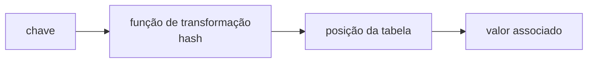
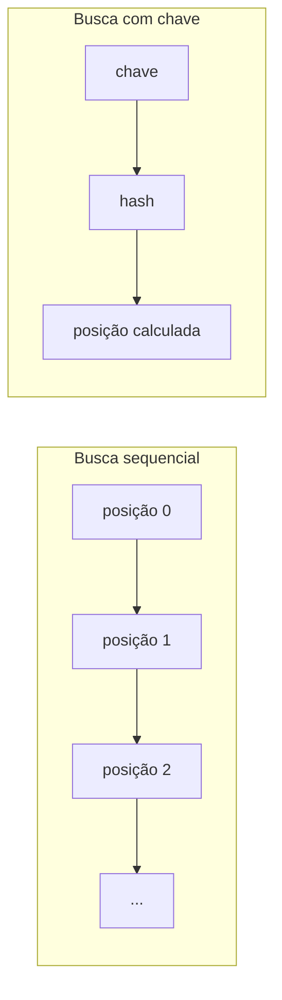
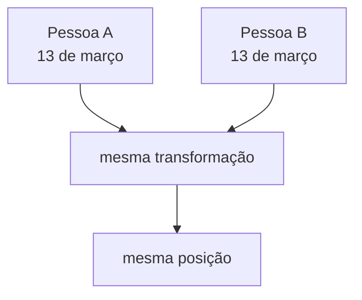
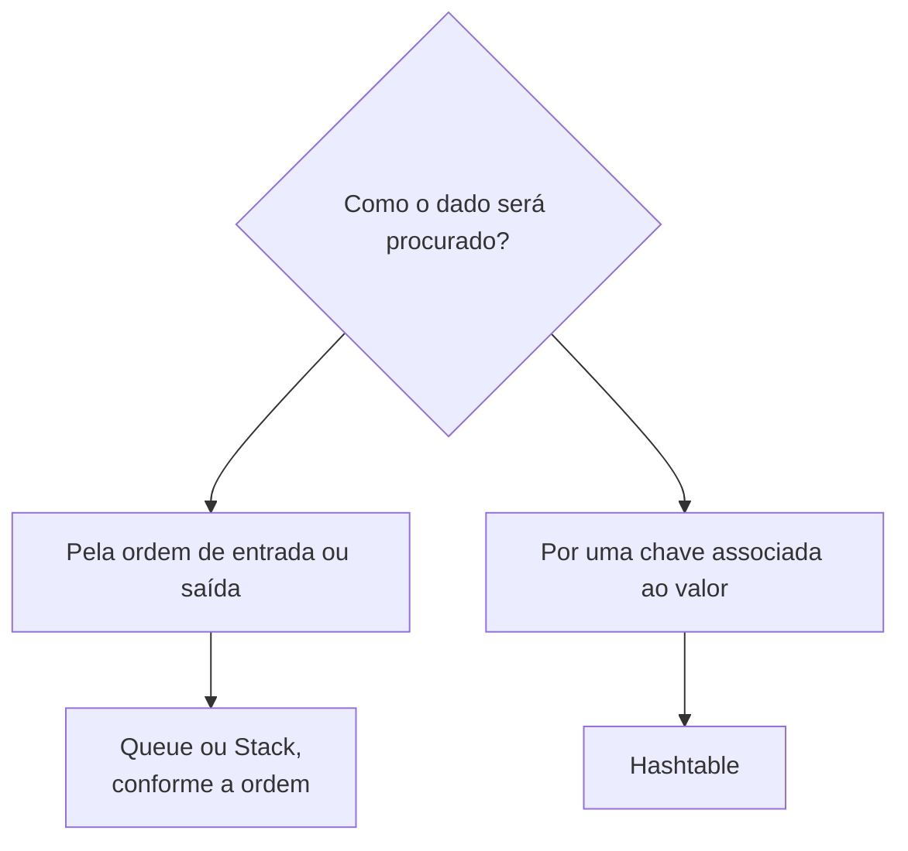

# Hashtable: chave, valor, hashing e colisões

> **Contexto:** `Hashtable` organiza dados como pares de chave e valor. Em vez de procurar sequencialmente por todas as posições de uma coleção, a estrutura usa uma função de transformação para associar uma chave a uma posição da tabela, permitindo localizar dados de forma eficiente.

Para utilizar `Hashtable`, é necessário importar `System.Collections`:

```csharp
using System.Collections;
```

## Chave e valor

Uma `Hashtable` funciona como uma estrutura de dicionário ou mapa. Cada elemento é armazenado como um **par chave–valor**:

```text
chave 1 → "João"
chave 2 → "Maria"
chave 3 → "José"
```

A chave identifica o elemento e serve como ponto de partida para encontrá-lo. O valor é o dado associado a essa chave.

Em C#:

```csharp
Hashtable tabela = new Hashtable();

tabela.Add(1, "João");
tabela.Add(2, "Maria");
tabela.Add(3, "José");
```

Diferentemente de uma lista, em que a posição costuma ser percorrida ou acessada diretamente por índice, a `Hashtable` é organizada para procurar a partir de uma chave.

## Da chave até uma posição da tabela

O modelo apresentado para a `Hashtable` pode ser entendido como uma transformação:



A função recebe uma chave e determina em qual posição da tabela o elemento deve ser procurado ou armazenado.

O exemplo de aniversários ajuda a visualizar essa ideia. Imagine uma tabela com 366 posições, uma para cada dia possível do ano. Uma pessoa nascida em 5 de janeiro pode ser associada à posição correspondente a esse dia; outra nascida em 13 de março será direcionada a outra posição. Para procurar uma pessoa, a mesma transformação indica diretamente onde procurar.

A vantagem desse modelo aparece quando comparamos a busca com uma coleção percorrida posição por posição:



A intenção da tabela hash é evitar uma varredura linear completa quando a chave permite determinar onde o dado deve ser procurado.

## Colisões

O modelo encontra um problema quando mais de um elemento é direcionado para a mesma posição. Essa situação é chamada **colisão**.

No exemplo dos aniversários, duas pessoas podem nascer no mesmo dia. Se o dia do aniversário for usado para determinar a posição, as duas serão direcionadas para a mesma entrada da tabela.



O conteúdo denomina esse problema **colisão primária**: a posição calculada para uma nova inserção já está ocupada. A resolução das colisões é tratada como uma etapa posterior; aqui, o importante é reconhecer por que elas podem acontecer.

## Operações principais

Os métodos apresentados para `Hashtable` trabalham com os pares chave–valor:

| Método ou propriedade | Efeito |
| --- | --- |
| `Add` | Insere um par chave–valor. |
| `Remove` | Remove o elemento associado a uma chave. |
| `Clear` | Remove todos os elementos da tabela. |
| `Contains` | Verifica se existe um elemento com determinada chave. |
| `ContainsKey` | Verifica se existe determinada chave. |
| `ContainsValue` | Verifica se existe determinado valor. |
| `Count` | Informa quantos pares estão armazenados. |

Um exemplo reúne essas operações:

```csharp
using System;
using System.Collections;

class Program
{
    static void Main()
    {
        Hashtable tabela = new Hashtable();

        tabela.Add(1, 10);
        tabela.Add(2, 20);
        tabela.Add(3, 30);
        tabela.Add(4, 40);
        tabela.Add(5, 50);

        Console.WriteLine(tabela.Count);
        Console.WriteLine(tabela.ContainsKey(1));
        Console.WriteLine(tabela.ContainsKey(5));
        Console.WriteLine(tabela.ContainsValue(50));

        tabela.Remove(1);

        Console.WriteLine(tabela.ContainsKey(1));

        tabela.Clear();

        Console.WriteLine(tabela.Count);
    }
}
```

Depois de `Remove(1)`, a chave `1` deixa de existir na tabela. Depois de `Clear()`, `Count` passa a zero.

### Alterando o valor associado a uma chave

Na `Hashtable`, o valor pode ser substituído diretamente a partir da chave:

```csharp
Hashtable tabela = new Hashtable();

tabela.Add(1, "Ana");
tabela.Add(2, "Bruno");

tabela[2] = "Carlos";
```

A chave `2` continua sendo a mesma, mas o valor associado a ela passa de `"Bruno"` para `"Carlos"`.

Como `string` é imutável em C#, essa operação não modifica a string `"Bruno"`; ela substitui o valor associado à chave por outra string.

> **Precisão conceitual:** ao usar o indexador `tabela[chave] = valor`, uma chave existente tem seu valor substituído. Se a chave ainda não existir, uma nova associação é criada.

Quando o valor armazenado é um objeto mutável, também é possível modificar o próprio objeto sem substituir a associação chave–valor:

```csharp
Aluno aluno = new Aluno("Ana", 1, "ana@email.com");

Hashtable tabela = new Hashtable();
tabela.Add(1, aluno);

aluno.Nome = "Maria";
```

A chave `1` continua associada à mesma referência de `Aluno`, mas o estado desse objeto foi alterado.

## Dictionary<TKey, TValue>: versão genérica do mapeamento

`Dictionary<TKey, TValue>` mantém o modelo chave–valor de `Hashtable`, mas declara separadamente o tipo das chaves e o tipo dos valores:

```csharp
using System.Collections.Generic;

Dictionary<int, string> nomes = new Dictionary<int, string>();

nomes.Add(1, "Ana");
nomes.Add(2, "Bruno");
```

Assim, uma chave de tipo inesperado ou um valor incompatível é rejeitado pela tipagem. Além de `Add`, `Remove`, `Clear`, `ContainsKey`, `ContainsValue` e `Count`, a versão genérica oferece `TryGetValue`, que informa se a chave existe e disponibiliza o valor correspondente pelo parâmetro `out`:

```csharp
if (nomes.TryGetValue(2, out string nome))
{
    Console.WriteLine(nome);
}
```

Ao percorrer a estrutura, cada par é representado por `KeyValuePair<TKey, TValue>`. `Keys` expõe as chaves e `Values` expõe os valores. O artigo [[04. Coleções genéricas em C# (List, LinkedList, Queue, Stack e Dictionary)#Dictionary<TKey, TValue> tipa separadamente chave e valor|Coleções genéricas em C#]] também diferencia `Dictionary<TKey, TValue>` de `SortedDictionary<TKey, TValue>` e mostra dicionários aninhados.

## Quando o modelo de Hashtable faz sentido

A ideia central da `Hashtable` é usar uma chave para chegar ao valor associado:



`Queue` e `Stack` organizam elementos principalmente pela ordem em que entram e saem. `Hashtable` organiza o acesso a partir da associação entre uma chave e um valor. É essa diferença de objetivo que justifica tratá-las em artigos separados.

## Pontos que costumam gerar confusão

- **A chave não é o valor.** A chave identifica e localiza; o valor é o dado associado.
- **Hashtable não segue FIFO nem LIFO.** Seu modelo é de mapeamento chave–valor, não de ordem de entrada e saída.
- **A função de transformação determina onde procurar.** A chave é convertida em uma posição da tabela.
- **Colisão significa disputa por uma posição.** Mais de um elemento pode ser direcionado para a mesma posição da tabela.
- **`ContainsKey` e `ContainsValue` fazem perguntas diferentes.** Um verifica a presença de uma chave; o outro verifica a presença de um valor.
- **`Remove` trabalha a partir da chave.** A remoção elimina o elemento associado à chave informada.
