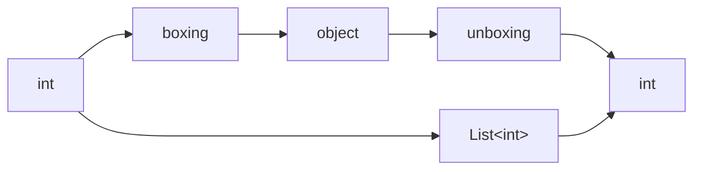
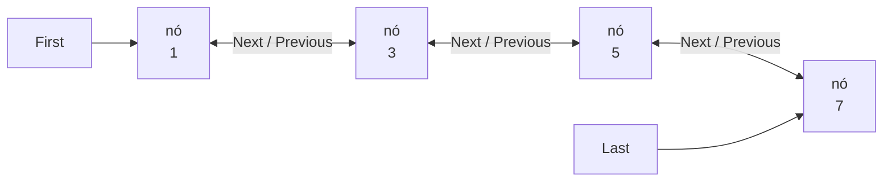
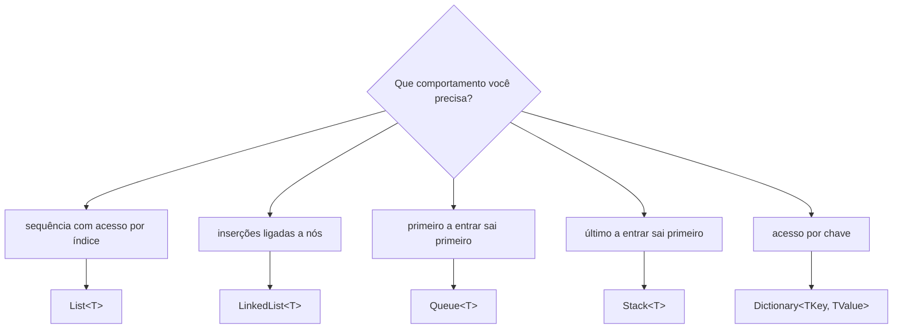

# Coleções genéricas em C#: List, LinkedList, Queue, Stack e Dictionary

> **Contexto:** As coleções genéricas mantêm a ideia das estruturas já estudadas, mas acrescentam um contrato de tipo. Em vez de armazenar tudo como `object`, a coleção declara antecipadamente que tipo aceita. Isso torna erros de tipo detectáveis na compilação, reduz conversões manuais e evita boxing/unboxing desnecessário para tipos de valor.

Para usar as coleções genéricas de C#, o namespace principal é:

```csharp
using System.Collections.Generic;
```

A leitura transversal da sintaxe está em [[00. Sintaxe Multilinguagem/14. Tipos genéricos e polimorfismo paramétrico (Generics, TypeVar, Any, Templates)#Generics parametrizam tipos sem duplicar a lógica|Tipos genéricos e polimorfismo paramétrico]]. As estruturas que aparecem aqui retomam diretamente [[01. ArrayList, referências e operações em coleções|ArrayList]], [[02. Queue e Stack (filas, pilhas, FIFO e LIFO)|Queue e Stack]] e [[03. Hashtable (chave, valor, hashing e colisões)|Hashtable]].

## O tipo entre sinais de menor e maior funciona como um contrato

Em uma coleção genérica, o tipo aparece entre `< >`. O `T` pode ser lido como “o tipo que será definido quando eu usar esta classe”:

```csharp
List<int> numeros = new List<int>();
List<string> nomes = new List<string>();
List<Aluno> alunos = new List<Aluno>();
```

A classe é a mesma, `List<T>`, mas cada variável escolhe um tipo concreto. Depois dessa escolha, a coleção mantém o contrato. Uma `List<int>` aceita inteiros; uma `List<Aluno>` aceita objetos `Aluno`.

```csharp
List<int> numeros = new List<int>();

numeros.Add(10);
numeros.Add(20);

// numeros.Add("trinta"); // erro de compilação
```

Esse comportamento reduz a flexibilidade de misturar tipos livremente, mas aumenta a segurança. A coleção não precisa esperar a execução para descobrir que um elemento não possui o tipo esperado.

Uma coleção não genérica como `ArrayList` trabalha com `object` e pode receber valores diferentes:

```csharp
ArrayList itens = new ArrayList();

itens.Add(10);
itens.Add(3.14);
itens.Add("texto");
itens.Add(new Aluno("Ana", 1, "ana@email.com"));
```

Já uma coleção genérica normalmente representa um domínio homogêneo:

```csharp
List<Aluno> alunos = new List<Aluno>();
```

Isso não significa que genéricos só funcionem com tipos simples. `T` pode representar `int`, `string`, uma classe criada pelo programa ou outro tipo compatível com o contrato definido.

## Segurança de tipos, menos casts e boxing/unboxing

A vantagem mais visível dos genéricos é a **segurança de tipagem**. Quando uma coleção já sabe qual tipo contém, a leitura também devolve esse tipo. Com `ArrayList`, um valor recuperado é tratado como `object` e pode exigir conversão:

```csharp
ArrayList lista = new ArrayList();
lista.Add(10);

int numero = (int)lista[0];
```

Com `List<int>`, a conversão desaparece:

```csharp
List<int> lista = new List<int>();
lista.Add(10);

int numero = lista[0];
```

Isso deixa o código mais curto e reutilizável, mas há também uma diferença de execução importante para tipos de valor como `int`, `double` e `char`. Ao entrar em uma coleção baseada em `object`, esses valores podem passar por **boxing**, isto é, são empacotados como `object`. Quando voltam ao tipo de valor, ocorre **unboxing**. Coleções genéricas como `List<int>` evitam esse ciclo nas operações comuns.



Assim, as vantagens principais se conectam: **segurança de tipos**, **menos casts**, **código mais limpo e reutilizável** e **menos sobrecarga de boxing/unboxing quando tipos de valor são armazenados**.

## As estruturas anteriores reaparecem em versões tipadas

As coleções genéricas preservam os modelos mentais das estruturas anteriores. O que muda principalmente é que o tipo passa a fazer parte da declaração.

| Estrutura estudada | Coleção genérica relacionada | Contrato de tipo |
| --- | --- | --- |
| `ArrayList` | `List<T>` | Um tipo de elemento |
| lista ligada | `LinkedList<T>` | Um tipo de elemento |
| `Queue` | `Queue<T>` | Um tipo de elemento |
| `Stack` | `Stack<T>` | Um tipo de elemento |
| `Hashtable` | `Dictionary<TKey, TValue>` | Um tipo de chave e um tipo de valor |

`List<T>` é a contraparte genérica mais próxima de `ArrayList`: continua sendo uma coleção sequencial redimensionável com acesso por índice. `LinkedList<T>` também é uma lista genérica, mas usa outra organização interna: seus elementos ficam em nós conectados por referências.

Em `List<T>`, muitos nomes já vistos continuam disponíveis: `Add`, `Insert`, `Remove`, `RemoveAt`, `Clear`, `Contains`, `IndexOf`, `LastIndexOf`, `Reverse`, `Sort`, `ToArray`, `BinarySearch`, `Count` e `Capacity`. Para reduzir capacidade excedente, `List<T>` usa `TrimExcess`, em papel semelhante ao `TrimToSize` estudado em `ArrayList`.

```csharp
List<Aluno> alunos = new List<Aluno>();

alunos.Add(new Aluno("Ana", 1, "ana@email.com"));
alunos.Insert(0, new Aluno("Bruno", 2, "bruno@email.com"));

Aluno primeiro = alunos[0];
```

Como a lista já é `List<Aluno>`, o indexador devolve `Aluno` diretamente. Não é necessário recuperar `object` e depois convertê-lo.

### Comparação tipada com IComparer<T>

A lógica de comparação também ganha uma versão genérica. Em vez de implementar `IComparer` e receber dois `object`, o comparador informa o tipo que sabe comparar:

```csharp
class ComparaAlunoPorNome : IComparer<Aluno>
{
    public int Compare(Aluno x, Aluno y)
    {
        return string.Compare(x.Nome, y.Nome);
    }
}
```

O mesmo comparador pode ser usado por `Sort` e `BinarySearch`:

```csharp
ComparaAlunoPorNome comparador = new ComparaAlunoPorNome();

alunos.Sort(comparador);

Aluno procurado = new Aluno("João", 0, "");
int posicao = alunos.BinarySearch(procurado, comparador);
```

A pesquisa binária pressupõe que a lista esteja ordenada de acordo com o mesmo critério usado na busca. Se a ordenação for por nome, a busca também deve comparar por nome.

## LinkedList<T> organiza elementos como nós conectados

`LinkedList<T>` representa uma **lista ligada**. Em uma `List<T>`, os elementos são tratados como uma sequência indexável; em uma lista ligada, cada elemento pertence a um **nó** que mantém referências para outros nós.

Uma boa analogia é uma composição de vagões. Os vagões não precisam estar “colados” em posições consecutivas de memória; o encadeamento é mantido pelas referências entre os nós. Em .NET, `LinkedList<T>` é duplamente ligada: cada `LinkedListNode<T>` possui `Value`, `Next` e `Previous`, enquanto a coleção expõe `First` e `Last`.



As posições são criadas conforme novos nós são adicionados. Quando um nó é removido e deixa de ser referenciado, ele pode posteriormente ser recuperado pelo coletor de lixo.

As operações principais trabalham com o início, o fim ou uma referência de nó já encontrada:

| Operação | Método ou propriedade |
| --- | --- |
| Inserir no início | `AddFirst` |
| Inserir no fim | `AddLast` |
| Inserir antes de um nó | `AddBefore` |
| Inserir depois de um nó | `AddAfter` |
| Encontrar primeira ocorrência | `Find` |
| Encontrar última ocorrência | `FindLast` |
| Remover um valor ou nó | `Remove` |
| Remover o primeiro nó | `RemoveFirst` |
| Remover o último nó | `RemoveLast` |
| Primeiro nó | `First` |
| Último nó | `Last` |
| Quantidade | `Count` |

```csharp
LinkedList<string> meses = new LinkedList<string>();

meses.AddLast("março");
meses.AddLast("junho");
meses.AddFirst("janeiro");

LinkedListNode<string> marco = meses.Find("março");

meses.AddBefore(marco, "fevereiro");
meses.AddAfter(marco, "abril");
```

O ponto importante é que `LinkedList<T>` não oferece acesso direto por índice como `List<T>`. Para inserir antes ou depois de um ponto específico, normalmente obtemos primeiro um `LinkedListNode<T>` e usamos essa referência.

## Queue<T> e Stack<T> preservam FIFO e LIFO

As versões genéricas de fila e pilha mantêm exatamente as regras já estudadas. `Queue<T>` continua seguindo FIFO e `Stack<T>` continua seguindo LIFO. A diferença é que inserções, consultas e remoções já trabalham com o tipo definido.

```csharp
Queue<int> fila = new Queue<int>();

fila.Enqueue(1);
fila.Enqueue(2);
fila.Enqueue(3);

int proximo = fila.Peek();
int removido = fila.Dequeue();
```

```csharp
Stack<int> pilha = new Stack<int>();

pilha.Push(1);
pilha.Push(2);
pilha.Push(3);

int proximo = pilha.Peek();
int removido = pilha.Pop();
```

Os métodos `Clear`, `Contains` e a propriedade `Count` também permanecem. O ganho conceitual está na tipagem: uma `Queue<int>` não aceita uma `string`, e `Dequeue` já devolve `int`.

A comparação completa entre FIFO e LIFO continua em [[02. Queue e Stack (filas, pilhas, FIFO e LIFO)#Queue e Stack representam ordens diferentes|Queue e Stack: filas, pilhas, FIFO e LIFO]].

## Dictionary<TKey, TValue> tipa separadamente chave e valor

`Dictionary<TKey, TValue>` é a versão genérica do modelo de dicionário chave–valor. Ele possui **dois parâmetros de tipo** porque chave e valor cumprem papéis diferentes:

```csharp
Dictionary<int, string> alunos = new Dictionary<int, string>();

alunos.Add(1, "Ana");
alunos.Add(2, "Bruno");
```

A chave pode ter um tipo e o valor, outro. Também podemos armazenar objetos:

```csharp
Dictionary<int, Aluno> alunos = new Dictionary<int, Aluno>();
```

> **Precisão conceitual:** dizer que chave e valor “podem ser de qualquer tipo” significa que **os tipos podem ser escolhidos livremente na declaração**. Não significa que uma mesma instância possa misturar tipos arbitrariamente. Em `Dictionary<string, int>`, todas as chaves devem ser `string` e todos os valores devem ser `int` enquanto aquela instância mantiver esse tipo.

```csharp
Dictionary<string, int> notas = new Dictionary<string, int>();

notas.Add("Ana", 10);
notas.Add("Bruno", 8);

// notas.Add(3, "Carla"); // erro: chave deveria ser string e valor deveria ser int
```

Portanto, `Dictionary<TKey, TValue>` é genérico justamente porque `TKey` e `TValue` são parâmetros: podemos escolher combinações como `Dictionary<string, int>`, `Dictionary<int, Aluno>` ou `Dictionary<string, string>`, mas a combinação escolhida passa a ser o contrato daquela coleção.

As operações centrais retomam o que já foi estudado em `Hashtable`:

| Operação | Recurso |
| --- | --- |
| Inserir par | `Add(chave, valor)` |
| Acessar ou substituir por chave | `dicionario[chave]` |
| Remover por chave | `Remove` |
| Verificar chave | `ContainsKey` |
| Verificar valor | `ContainsValue` |
| Tentar obter sem assumir que existe | `TryGetValue` |
| Obter chaves | `Keys` |
| Obter valores | `Values` |
| Quantidade de pares | `Count` |
| Limpar | `Clear` |

`TryGetValue` combina duas respostas: informa se a chave existe e, quando existe, disponibiliza o valor pelo parâmetro `out`.

```csharp
Dictionary<int, string> nomes = new Dictionary<int, string>();

nomes.Add(1, "Ana");
nomes.Add(2, "Bruno");

if (nomes.TryGetValue(2, out string nome))
{
    Console.WriteLine(nome);
}
```

Ao percorrer o dicionário, cada item é um `KeyValuePair<TKey, TValue>`:

```csharp
foreach (KeyValuePair<int, string> item in nomes)
{
    Console.WriteLine($"{item.Key} — {item.Value}");
}
```

`Keys` permite percorrer apenas as chaves e `Values` apenas os valores.

### SortedDictionary e dicionários aninhados

`SortedDictionary<TKey, TValue>` mantém o modelo chave–valor, mas organiza a enumeração por chave segundo o comparador usado. Ele não deve ser confundido com `Dictionary<TKey, TValue>`, cujo objetivo principal é o acesso por chave, não manter chaves em ordem de classificação.

Dicionários também podem armazenar outros dicionários. Isso permite representar estruturas em dois níveis, como **disciplina → aluno → nota**:

```csharp
Dictionary<string, Dictionary<string, double>> notas =
    new Dictionary<string, Dictionary<string, double>>();

notas["Algoritmos"] = new Dictionary<string, double>();
notas["Algoritmos"]["Ana"] = 8.5;
notas["Algoritmos"]["Bruno"] = 7.0;
```

O primeiro dicionário localiza a disciplina; o segundo, associado a essa disciplina, localiza a nota de cada aluno.

## Escolhendo a coleção pelo comportamento necessário

A escolha continua dependendo do problema, e não apenas do fato de todas as estruturas serem genéricas:



O parâmetro genérico resolve **qual tipo** cada coleção aceita. A estrutura escolhida resolve **como os elementos serão organizados e acessados**. São decisões diferentes.

## Pontos que costumam gerar confusão

- **Genérico não significa “aceita qualquer coisa ao mesmo tempo”.** `T` é um parâmetro que será substituído por um tipo concreto; depois disso, a coleção mantém esse contrato.
- **`List<T>` e `LinkedList<T>` não são a mesma estrutura.** As duas são genéricas, mas `List<T>` é indexável e `LinkedList<T>` trabalha com nós ligados.
- **`List<T>` é a contraparte genérica mais próxima de `ArrayList`.** `LinkedList<T>` é outra forma de lista, não apenas uma `ArrayList` com tipo.
- **`TrimExcess` não muda `Count`.** Ele reduz capacidade excedente; não remove os elementos armazenados.
- **Boxing e unboxing importam especialmente para tipos de valor.** O problema aparece quando valores como `int` precisam circular como `object`.
- **`Queue<T>` continua FIFO e `Stack<T>` continua LIFO.** A genericidade muda a tipagem, não a regra de remoção.
- **`Dictionary<TKey, TValue>` possui dois parâmetros de tipo.** `TKey` e `TValue` podem ser escolhidos separadamente na declaração, mas, depois de definidos, todas as entradas daquela instância devem respeitar esses tipos.
- **`TryGetValue` não é apenas uma busca.** Ele retorna um booleano e, quando encontra a chave, também entrega o valor pelo `out`.
- **Ordenar e pesquisar objetos exige um critério coerente.** Ao usar `IComparer<T>`, `Sort` e `BinarySearch` precisam concordar sobre a regra de comparação.
