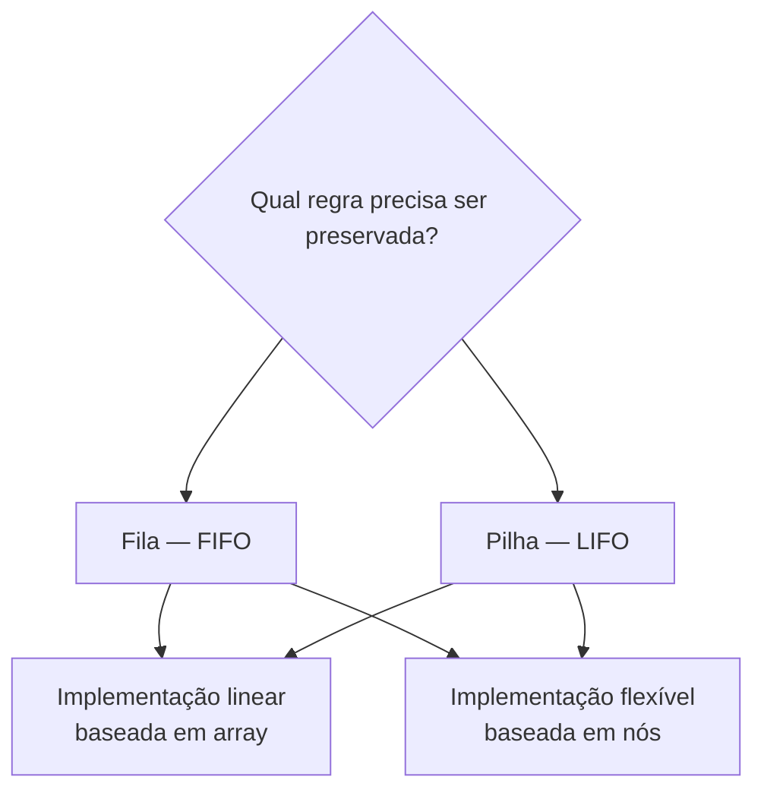
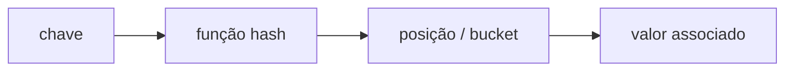
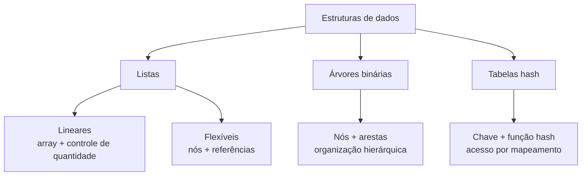

# Listas lineares e flexíveis, árvores binárias e tabelas hash

> **Contexto:** Depois de estudar coleções prontas do C#, o foco passa para a forma como estruturas de dados podem ser organizadas internamente. Esta introdução compara listas lineares e flexíveis e apresenta os modelos de árvores binárias e tabelas hash que serão aprofundados na sequência.

## Da coleção pronta à estrutura interna

Conhecer uma classe como `ArrayList`, `List<T>` ou `LinkedList<T>` permite usar uma estrutura de dados. Entender sua organização interna permite perceber **por que certas operações são rápidas, lentas, simples ou custosas**.

A partir daqui, três famílias ganham destaque:

- **listas**, que podem usar armazenamento linear ou flexível;
- **árvores binárias**, organizadas em nós conectados;
- **tabelas hash**, que usam uma função de transformação para localizar dados.

Esses modelos não substituem as coleções estudadas anteriormente. Eles explicam os princípios usados por muitas delas.

## Listas lineares e flexíveis

Uma **lista linear** organiza seus elementos em um bloco sequencial de memória baseado em um array. Além do array, a implementação mantém alguma forma de controle da quantidade de elementos armazenados.

`ArrayList` e `List<T>` seguem esse modelo. Quando o espaço reservado se esgota e a estrutura permite crescimento, uma estratégia possível é criar um array interno maior, copiar os elementos para ele e abandonar o armazenamento anterior.

Esse funcionamento explica a diferença já estudada entre `Count` e `Capacity`: `Count` mede quantos elementos existem; `Capacity` indica quanto espaço está reservado antes de ser necessário ampliar o armazenamento.

Uma **lista flexível** não depende de um bloco sequencial de posições. Cada elemento pertence a uma célula ou nó que guarda o valor e uma referência usada para alcançar outra célula. `LinkedList<T>` é um exemplo desse modelo.

![[Pasted image 20260927171700.png]]

*Exemplo de lista flexível: uma referência inicial alcança a primeira célula, e cada célula permite chegar à seguinte.*

A imagem ajuda a visualizar por que os elementos podem estar “espalhados” na memória: a sequência lógica é mantida pelas referências, não pela proximidade física entre as células.

### Comparando os dois modelos

| Critério | Lista linear | Lista flexível |
| --- | --- | --- |
| **Organização** | Elementos em armazenamento sequencial baseado em array | Elementos em nós conectados por referências |
| **Acesso a uma posição** | Direto por índice | Exige percorrer referências até alcançar o nó |
| **Memória por elemento** | Armazena principalmente o elemento | Armazena o elemento e referências estruturais |
| **Mudança de tamanho** | Pode exigir criação de um array maior e cópia | Cresce pela criação e conexão de novos nós |
| **Exemplos em C#** | `ArrayList`, `List<T>` | `LinkedList<T>` |

O ganho da lista linear está principalmente na simplicidade e no acesso direto por posição. A lista flexível favorece cenários em que o tamanho varia e a estrutura precisa crescer por novos nós sem depender de um bloco contínuo de armazenamento.

> **Precisão conceitual:** dizer que uma lista flexível “cresce mais facilmente” não significa que todas as operações nela sejam mais rápidas. O custo depende da operação e de onde o elemento está. A principal diferença estrutural é que ela cresce por nós conectados, enquanto a lista linear depende de armazenamento sequencial.

## Filas e pilhas podem usar ambos os modelos

Fila e pilha descrevem **regras de acesso**, e não obrigatoriamente uma forma específica de armazenamento.

Uma fila precisa preservar FIFO: primeiro a entrar, primeiro a sair. Uma pilha precisa preservar LIFO: último a entrar, primeiro a sair. Essas regras podem ser implementadas tanto sobre uma estrutura linear quanto sobre uma estrutura flexível.



Isso conecta diretamente esta unidade ao que já foi estudado em [[02. Queue e Stack (filas, pilhas, FIFO e LIFO)|Queue e Stack]]: FIFO e LIFO definem o comportamento; linear e flexível descrevem formas possíveis de implementação.

## Árvores binárias

Uma árvore é uma estrutura formada por **nós** conectados por **arestas**. Diferentemente de uma lista, em que os elementos formam uma sequência, uma árvore organiza relações hierárquicas.

![[Pasted image 20260927171720.png]]

*Exemplo de árvore: as bolinhas representam nós e as ligações entre elas representam arestas.*

Árvores são estruturas flexíveis: novos nós são criados sob demanda e conectados por referências. Em uma árvore binária, cada nó pode se relacionar com, no máximo, dois filhos.

Inserção, remoção e pesquisa podem ser muito eficientes quando a altura da árvore permanece pequena em relação à quantidade de nós.

### O que significa Θ(log n)

A notação **Θ** descreve uma ordem de crescimento de custo. `log₂ n`, também escrito `lg n`, cresce lentamente mesmo quando `n` aumenta bastante.

Se uma árvore tiver 1024 nós:

```text
lg 1024 = 10
```

porque:

```text
2¹⁰ = 1024
```

Assim, uma estrutura cuja altura seja proporcional a `lg n` pode exigir aproximadamente dez níveis de navegação para trabalhar com 1024 elementos.

> **Nota lateral — por que logaritmo aparece aqui?**  
> Em análise de estruturas de dados, `log₂(n)` pode ser lido como **“quantas vezes é possível dividir o problema por 2 até chegar a 1?”**. Essa ideia aparece quando cada decisão reduz aproximadamente pela metade a quantidade de possibilidades restantes.
>
> Para `n = 1024`:
>
> ```text
> 1024 → 512 → 256 → 128 → 64 → 32 → 16 → 8 → 4 → 2 → 1
> ```
>
> Foram necessárias dez divisões por 2, por isso `log₂(1024) = 10`. A relação com potências é inversa: `2¹⁰ = 1024`.
>
> Esse crescimento é lento. Mesmo aumentando muito a quantidade de elementos:
>
> | n | log₂(n) |
> | ---: | ---: |
> | 8 | 3 |
> | 16 | 4 |
> | 32 | 5 |
> | 1.024 | 10 |
> | 1.048.576 | 20 |
>
> A ideia prática é: **se uma operação consegue descartar aproximadamente metade das possibilidades a cada etapa, o logaritmo tende a aparecer na análise do custo**.

> **Precisão conceitual:** `Θ(log n)` não é garantido para qualquer árvore binária. Esse comportamento depende de a árvore manter altura logarítmica, como ocorre em árvores suficientemente balanceadas. Uma árvore muito desbalanceada pode se aproximar de uma lista e exigir `Θ(n)` passos no pior caso.

## Tabelas hash

Uma tabela hash combina duas ideias:

- um armazenamento interno, normalmente baseado em array;
- uma **função hash**, que transforma uma chave em informação usada para determinar onde procurar o valor.

O modelo geral pode ser visualizado assim:



Essa organização permite evitar uma busca sequencial por todos os elementos. Quando o espalhamento das chaves funciona bem, operações de acesso podem ocorrer em tempo aproximadamente constante.

O principal problema aparece quando chaves diferentes são direcionadas para a mesma região de armazenamento. Essa situação é uma **colisão**, tema já introduzido em [[03. Hashtable (chave, valor, hashing e colisões)#Colisões|Hashtable]] e que passa a ser importante na implementação da estrutura.

> **Precisão conceitual:** o acesso `Θ(1)` em tabelas hash deve ser entendido como comportamento esperado em condições adequadas de distribuição e tratamento de colisões. Colisões podem aumentar o trabalho necessário. Além disso, embora a posição interna da tabela seja numérica, as chaves públicas de `Hashtable` e `Dictionary<TKey, TValue>` em C# não precisam ser inteiros.

## Mapa dos modelos desta unidade



O eixo conceitual da unidade passa a ser menos “qual método da coleção eu chamo?” e mais **“como a organização interna da estrutura determina o custo e o comportamento das operações?”**.

## Pontos que costumam gerar confusão

- **Linear e flexível descrevem organização interna.** FIFO e LIFO descrevem regras de acesso; são dimensões diferentes.
- **Lista flexível não significa acesso direto.** Para alcançar uma posição, normalmente é necessário seguir referências entre nós.
- **`Capacity` faz sentido em estruturas baseadas em armazenamento reservado.** Uma lista encadeada cresce por novos nós e não trabalha com a mesma ideia pública de capacidade.
- **Árvore binária não implica automaticamente `Θ(log n)`.** Esse custo depende da altura da árvore.
- **Tabela hash não elimina colisões.** A implementação precisa lidar com diferentes chaves que acabam competindo por uma mesma região.
- **Chave de Hashtable não é posição de lista.** O hash é usado internamente para localizar o armazenamento; a chave pública pode ter outros tipos.
