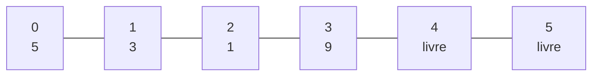

# Lista linear: implementação com array e contador

> **Contexto:** Uma lista linear ou sequencial pode ser implementada diretamente sobre um array. O array fornece o espaço de armazenamento; um contador indica quantas posições pertencem de fato à lista. Inserções e remoções precisam manter os elementos válidos consecutivos entre os índices `0` e `n - 1`.

## O modelo central: array + contador

A estrutura possui dois estados essenciais:

```csharp
private int[] array;
private int n;
```

O `array` determina o espaço físico disponível. O contador `n` informa quantos elementos estão logicamente armazenados.

Se:

```text
n = 4
```

então os elementos válidos estão obrigatoriamente nas posições:

```text
0, 1, 2 e 3
```

A posição `4` é a primeira posição livre.

Essa distinção é fundamental: **o tamanho do array e a quantidade de elementos da lista não são a mesma coisa**.



Nesse exemplo, o array tem capacidade para seis valores, mas `n = 4`.

## Inserção exige preservar a sequência

Antes de inserir, a implementação precisa verificar se ainda existe espaço. Na versão de capacidade fixa estudada aqui, uma lista cheia rejeita novas inserções.

### Inserir no fim

Inserir no fim é o caso mais simples. O novo elemento ocupa exatamente a primeira posição livre, isto é, `array[n]`.

```csharp
array[n] = valor;
n++;
```

Se a lista contém:

```text
[5, 3, 1]   n = 3
```

a inserção de `9` no fim produz:

```text
[5, 3, 1, 9]   n = 4
```

### Inserir no início

Para inserir na posição `0`, os elementos existentes precisam ser deslocados uma posição para a direita. O deslocamento deve começar pelo final; caso contrário, um valor seria sobrescrito antes de ser copiado.

```csharp
for (int i = n; i > 0; i--)
{
    array[i] = array[i - 1];
}

array[0] = valor;
n++;
```

O movimento é:

```text
antes:   [5, 3, 1, _]
          ↓  ↓  ↓
depois:  [_, 5, 3, 1]
```

Só então o novo valor ocupa a posição inicial.

### Inserir em uma posição

A inserção em uma posição intermediária segue a mesma regra. Se o novo valor deve entrar em `pos`, apenas os elementos entre `pos` e o fim lógico precisam ser deslocados.

```csharp
for (int i = n; i > pos; i--)
{
    array[i] = array[i - 1];
}

array[pos] = valor;
n++;
```

A posição precisa satisfazer:

```text
0 ≤ pos ≤ n
```

`pos = n` é permitido porque equivale a inserir no fim. Uma posição maior que `n` criaria um buraco entre os elementos válidos.

## Remoção fecha o espaço deixado

Remover um elemento produz o movimento inverso: os elementos posteriores precisam ser deslocados para a esquerda para manter a lista contínua.

### Remover no início

O elemento da posição `0` é guardado para ser retornado. Depois, a quantidade lógica é reduzida e os elementos seguintes são deslocados.

```csharp
int resposta = array[0];
n--;

for (int i = 0; i < n; i++)
{
    array[i] = array[i + 1];
}

return resposta;
```

Visualmente:

```text
antes:   [5, 3, 7, 4, 1, 9]
          X  ←  ←  ←  ←  ←

depois:  [3, 7, 4, 1, 9, 9]
          └──── elementos válidos ────┘
```

O segundo `9` pode continuar fisicamente no array. Isso não significa que existam dois `9` na lista.

### Remover no fim

Nesse caso não há deslocamento. Basta reduzir `n` e retornar o elemento que ocupava a última posição válida.

```csharp
n--;
return array[n];
```

O detalhe importante é a ordem: primeiro `n` diminui; depois `array[n]` aponta para o antigo último elemento.

### Remover de uma posição

Para remover de uma posição intermediária, primeiro o valor é guardado. Em seguida, `n` diminui e os elementos posteriores avançam uma posição para a esquerda.

```csharp
int resposta = array[pos];
n--;

for (int i = pos; i < n; i++)
{
    array[i] = array[i + 1];
}

return resposta;
```

Uma remoção válida exige:

```text
0 ≤ pos < n
```

## Remoção lógica e remoção física

A implementação deixa clara uma diferença importante entre **o conteúdo físico do array** e **o conteúdo lógico da lista**.

Considere:

```text
array = [3, 7, 4, 1, 9, 9]
n = 5
```

Fisicamente, o último `9` ainda está armazenado na posição `5`. Logicamente, porém, a lista termina na posição `n - 1`, isto é, na posição `4`.

Portanto:

```text
lista lógica = [3, 7, 4, 1, 9]
                               ↑
                         última posição válida
```

O valor fora do intervalo `0 .. n - 1` é irrelevante para a estrutura. Ele pode ser entendido como **lixo lógico**: permanece no espaço físico, mas não pertence mais à lista.

> **Regra mental:** quem determina onde a lista termina é o contador `n`, não o conteúdo que por acaso ainda existe nas posições restantes do array.

Esse princípio também explica por que `Mostrar` deve percorrer somente:

```csharp
for (int i = 0; i < n; i++)
```

e nunca o array inteiro.

## Implementação completa

A classe abaixo reúne o comportamento estudado: capacidade fixa, dois construtores, inserção no início/fim/posição, remoção no início/fim/posição e exibição dos elementos válidos.

```csharp
using System;

public class Lista
{
    private int[] array;
    private int n;

    public Lista() : this(6)
    {
    }

    public Lista(int tamanho)
    {
        array = new int[tamanho];
        n = 0;
    }

    private void VerificarEspaco()
    {
        if (n >= array.Length)
            throw new InvalidOperationException("Lista cheia.");
    }

    private void VerificarNaoVazia()
    {
        if (n == 0)
            throw new InvalidOperationException("Lista vazia.");
    }

    public void InserirInicio(int valor)
    {
        VerificarEspaco();

        for (int i = n; i > 0; i--)
            array[i] = array[i - 1];

        array[0] = valor;
        n++;
    }

    public void InserirFim(int valor)
    {
        VerificarEspaco();

        array[n] = valor;
        n++;
    }

    public void Inserir(int valor, int pos)
    {
        VerificarEspaco();

        if (pos < 0 || pos > n)
            throw new ArgumentOutOfRangeException(nameof(pos));

        for (int i = n; i > pos; i--)
            array[i] = array[i - 1];

        array[pos] = valor;
        n++;
    }

    public int RemoverInicio()
    {
        VerificarNaoVazia();

        int resposta = array[0];
        n--;

        for (int i = 0; i < n; i++)
            array[i] = array[i + 1];

        return resposta;
    }

    public int RemoverFim()
    {
        VerificarNaoVazia();

        n--;
        return array[n];
    }

    public int Remover(int pos)
    {
        VerificarNaoVazia();

        if (pos < 0 || pos >= n)
            throw new ArgumentOutOfRangeException(nameof(pos));

        int resposta = array[pos];
        n--;

        for (int i = pos; i < n; i++)
            array[i] = array[i + 1];

        return resposta;
    }

    public void Mostrar()
    {
        for (int i = 0; i < n; i++)
            Console.Write($"{array[i]} ");

        Console.WriteLine();
    }
}
```

A implementação usa exceções para interromper operações inválidas. O ponto central, porém, é independente da forma de tratamento do erro: a lista precisa impedir inserções além de sua capacidade e remoções fora da região lógica ocupada.

## Conexões com ArrayList e List<T>

A lista implementada aqui possui **capacidade fixa**. Quando `n == array.Length`, não há espaço para continuar.

`ArrayList` e `List<T>`, estudadas anteriormente, automatizam o crescimento do armazenamento interno. Quando necessário, passam a trabalhar com um array maior e preservam os elementos já armazenados.

Isso permite separar duas ideias:

| Estrutura | Armazenamento | Quando enche |
| --- | --- | --- |
| Lista linear didática | array + contador | rejeita nova inserção |
| `ArrayList` | array interno redimensionável | aumenta a capacidade |
| `List<T>` | array interno redimensionável e tipado | aumenta a capacidade |

O mecanismo de deslocamento, entretanto, continua relevante: inserir ou remover no início ou no meio de uma estrutura sequencial exige reorganizar os elementos posteriores.

## Pontos que costumam gerar confusão

- **`n` não é a capacidade do array.** É a quantidade de elementos logicamente armazenados.
- **Se `n = 4`, a última posição válida é `3`.** Os índices começam em zero.
- **Inserção no início ou no meio desloca para a direita.** O percurso precisa começar pelo final para não sobrescrever valores ainda necessários.
- **Remoção no início ou no meio desloca para a esquerda.** Isso fecha o espaço deixado pelo elemento removido.
- **Remover logicamente não exige apagar fisicamente o valor antigo.** Tudo que está depois de `n - 1` deixa de pertencer à lista.
- **Inserir em `pos = n` é válido.** É equivalente a inserir no fim; `pos > n` criaria um buraco.
- **Remover em `pos = n` é inválido.** A última posição existente é `n - 1`.
