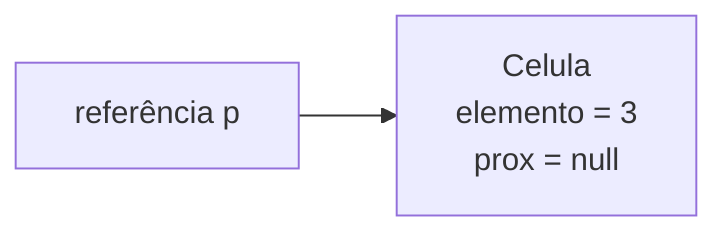
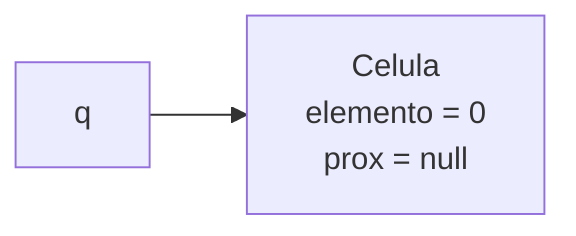
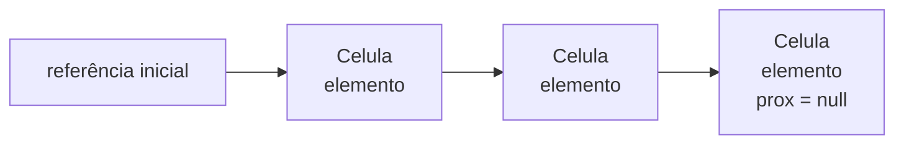

# Classes autorreferenciais e células encadeadas

> **Contexto:** Depois de implementar uma lista linear sobre um array, o próximo passo é entender a estrutura básica usada em listas flexíveis: objetos que guardam uma informação e uma referência para outro objeto do mesmo tipo.

## O que é uma classe autorreferencial

Em C#, uma variável de tipo classe guarda uma referência para um objeto. Ao criar:

```csharp
Aluno a = new Aluno();
```

`a` é uma referência usada para acessar o objeto criado pelo `new`.

Uma **classe autorreferencial** aplica essa mesma ideia dentro da própria classe: um de seus atributos possui o mesmo tipo da classe e, por isso, pode referenciar outro objeto desse mesmo tipo.

O modelo estudado é uma classe `Celula` com dois atributos:

- `elemento`, que guarda a informação da célula;
- `prox`, que guarda uma referência para outra `Celula`.

```csharp
public class Celula
{
    public int elemento;
    public Celula prox;
}
```

A autorreferência está em `prox`, porque esse atributo possui o mesmo tipo da classe em que foi declarado.

## Uma célula guarda valor e referência

Cada objeto `Celula` pode ser entendido como duas partes: uma para o valor e outra para a referência da próxima célula.



O campo `elemento` guarda o valor. O campo `prox` pode referenciar outra célula ou permanecer em `null`, quando não existe uma próxima célula.

A ideia corresponde ao que, em C e C++, seria descrito com um ponteiro para outra estrutura do mesmo tipo. Em C#, o encadeamento é representado por referências entre objetos.

## Construtores da célula

A classe pode oferecer um construtor sem parâmetro e outro que recebe o valor inicial do elemento.

```csharp
public class Celula
{
    public int elemento;
    public Celula prox;

    public Celula()
    {
        elemento = 0;
        prox = null;
    }

    public Celula(int valor)
    {
        elemento = valor;
        prox = null;
    }
}
```

Nos dois casos, `prox` começa com `null`, porque a nova célula ainda não referencia outra célula. Quando um valor é informado, ele ocupa `elemento`; sem valor informado, o exemplo usa `0`.

## Criando objetos e referências

Considere:

```csharp
Celula p = new Celula(3);
```

O `new Celula(3)` cria uma célula com `elemento = 3` e `prox = null`; a variável `p` guarda a referência para esse objeto.


No caso:

```csharp
Celula q = new Celula();
```

o construtor sem parâmetro produz `elemento = 0` e `prox = null`.



O ponto importante é separar **a variável que guarda a referência** do **objeto criado pelo `new`**.

## Da célula para uma lista flexível

A utilidade da autorreferência aparece quando uma célula pode referenciar outra. O campo `prox` fornece o mecanismo necessário para encadear objetos e, com isso, construir uma lista flexível.



Cada objeto continua sendo uma célula, mas as referências formam uma sequência lógica entre eles. Essa ideia se conecta ao `LinkedListNode<T>` visto anteriormente em `LinkedList<T>`, em que os nós também armazenam valores e referências para outros nós.

## Pontos que costumam gerar confusão

- **A variável não é o objeto.** Uma variável de tipo classe guarda uma referência usada para acessar o objeto criado pelo `new`.
- **Autorreferencial não significa que o objeto aponta obrigatoriamente para ele mesmo.** Significa que a classe possui um atributo capaz de referenciar outro objeto do mesmo tipo.
- **`prox` pode ser `null`.** Isso representa a ausência de uma próxima célula.
- **`elemento` e `prox` têm funções diferentes.** Um guarda o dado; o outro estabelece a ligação com outra célula.
- **A sequência não depende de posições contíguas em um array.** A relação entre as células é construída pelas referências.