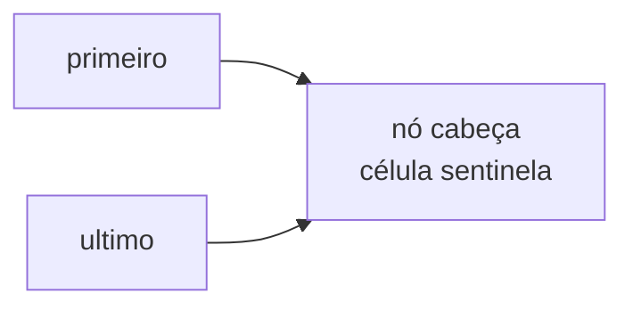
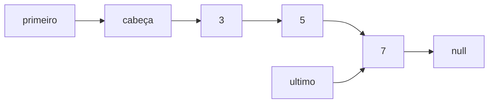
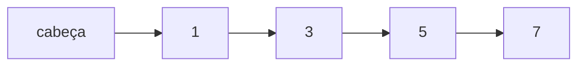
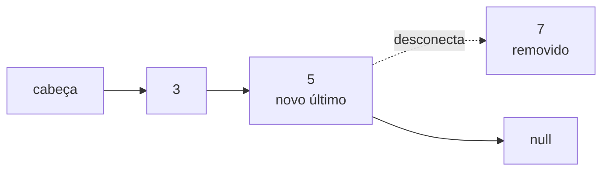

# Lista flexível: nó cabeça, inserção, remoção e percurso

> **Contexto:** A lista flexível, também chamada de lista encadeada ou lista ligada, usa células criadas sob demanda e conectadas por referências. Depois de definir uma classe autorreferencial `Celula`, a implementação passa a controlar o início e o fim da estrutura e a encadear ou desconectar células conforme os elementos são inseridos e removidos.

## O modelo central: primeiro, último e nó cabeça

A lista mantém duas referências principais:

```csharp
private Celula primeiro;
private Celula ultimo;
```

`primeiro` referencia o início estrutural da lista e `ultimo` referencia a última célula. Na implementação estudada, existe ainda um **nó cabeça**: uma célula vazia, também chamada de célula sentinela, que não representa um elemento fornecido pelo usuário.

No construtor, uma única célula é criada e as duas referências apontam para ela:

```csharp
primeiro = new Celula();
ultimo = primeiro;
```



Quando `primeiro == ultimo`, a lista está vazia: existe apenas o nó cabeça. O valor físico guardado nessa célula não faz parte da lista lógica.

O nó cabeça simplifica a implementação porque fornece uma referência inicial estável. Os elementos úteis começam sempre em `primeiro.prox`.

## Inserção e percurso pelas células

### Inserir no fim

A inserção no fim cria uma nova célula depois de `ultimo` e, em seguida, move `ultimo` para a célula recém-criada.

```csharp
ultimo.prox = new Celula(elemento);
ultimo = ultimo.prox;
```

Depois de inserir `3`, `5` e `7`, a estrutura pode ser visualizada assim:



Cada inserção aloca uma nova célula e conecta essa célula à estrutura. Diferentemente da lista linear baseada em array, as células não precisam ocupar posições contíguas de memória; a ordem lógica é mantida pelas referências.

### Mostrar os elementos

Na lista linear, o percurso era feito aumentando um índice. Na lista flexível, o percurso acontece mudando uma referência de célula.

```csharp
for (Celula i = primeiro.prox; i != null; i = i.prox)
{
    Console.Write($"{i.elemento} ");
}
```

A expressão:

```csharp
i = i.prox;
```

cumpre o papel que um `i++` exercia no percurso de um array: em vez de avançar para o próximo índice, a referência passa a apontar para a próxima célula.

### Inserir no início

Para inserir no início, uma nova célula é criada entre o nó cabeça e o primeiro elemento útil.

```csharp
Celula tmp = new Celula(elemento);
tmp.prox = primeiro.prox;
primeiro.prox = tmp;

if (primeiro == ultimo)
    ultimo = tmp;
```

A ordem das conexões importa: primeiro a nova célula aponta para o antigo primeiro elemento; depois o nó cabeça passa a apontar para a nova célula.



Na versão apresentada, a referência temporária pode receber `null` ao final apenas por organização. Como ela é uma variável local, isso não é necessário para o funcionamento do método.

## Remover no fim exige caminhar até o penúltimo nó

Em uma lista simplesmente encadeada, cada célula conhece apenas a próxima. A última célula não guarda uma referência para quem veio antes dela.

Por isso, remover o último elemento exige começar no nó cabeça e caminhar até a célula imediatamente anterior a `ultimo`:

```csharp
Celula i;

for (i = primeiro; i.prox != ultimo; i = i.prox)
{
}
```

Quando o laço termina, `i` referencia a penúltima célula. A remoção então pode ser concluída:

```csharp
int elemento = ultimo.elemento;
ultimo = i;
ultimo.prox = null;

return elemento;
```



A célula desconectada deixa de integrar a estrutura. Quando não houver outras referências relevantes para ela, pode ficar elegível para coleta de lixo.

## Remover no início e preservar o nó cabeça

A primeira versão discutida para remoção no início move `primeiro` para a célula seguinte. Com isso, o antigo nó cabeça é desconectado e a célula que continha o primeiro valor útil passa a funcionar como o novo nó cabeça. O valor continua fisicamente nessa célula, mas deixa de ser considerado elemento da lista porque o percurso começa em `primeiro.prox`.

Em seguida, o exercício propõe uma segunda estratégia: **preservar fisicamente o nó cabeça e desconectar a primeira célula útil**.

```csharp
Celula tmp = primeiro.prox;
primeiro.prox = primeiro.prox.prox;

int elemento = tmp.elemento;
tmp.prox = null;

return elemento;
```

Se a estrutura for:

```text
cabeça → 3 → 5 → 7 → null
```

a remoção física do primeiro elemento útil produz:

```text
cabeça → 5 → 7 → null
           
3 → null
```

Essa segunda forma mantém a célula sentinela fixa e remove efetivamente a célula que armazenava o primeiro valor.

> **Precisão de implementação:** a transcrição explica o mecanismo com vários elementos na lista. No caso em que existe apenas um elemento útil, uma implementação completa também precisa fazer `ultimo` voltar a apontar para `primeiro` depois da remoção.

## Inserção e remoção por posição

Nas operações posicionais, o nó cabeça não conta como posição da lista. O primeiro elemento útil ocupa a posição `0`, o seguinte a posição `1` e assim por diante.

### Inserir em uma posição

Se a lista contém:

```text
cabeça → 3 → 5 → 7
          0    1    2
```

inserir `6` na posição `2` significa colocar uma nova célula entre `5` e `7`.

Casos especiais podem reutilizar métodos já existentes:

```csharp
if (pos == 0)
    InserirInicio(elemento);
else if (pos == tamanho)
    InserirFim(elemento);
```

Para uma posição intermediária, uma referência caminha até a célula imediatamente anterior ao ponto de inserção:

```csharp
Celula i = primeiro;

for (int j = 0; j < pos; j++)
    i = i.prox;

Celula tmp = new Celula(elemento);
tmp.prox = i.prox;
i.prox = tmp;
```

O resultado para `6` na posição `2` é:

```text
cabeça → 3 → 5 → 6 → 7
          0    1    2    3
```

### Remover de uma posição

A remoção intermediária segue o mesmo princípio: caminhar até a célula anterior àquela que será removida, guardar uma referência temporária para o alvo e refazer a conexão pulando essa célula.

```csharp
Celula i = primeiro;

for (int j = 0; j < pos; j++)
    i = i.prox;

Celula tmp = i.prox;
int elemento = tmp.elemento;

i.prox = tmp.prox;
tmp.prox = null;

return elemento;
```

Para posição `0`, usa-se `RemoverInicio`; para a última posição, usa-se `RemoverFim`. Posições negativas ou maiores que os limites válidos devem ser rejeitadas.

## Implementação integrada

A transcrição utiliza um método `Tamanho()` para validar posições, mas informa que sua implementação seria apresentada em um vídeo posterior. Para deixar o exemplo abaixo executável, o método de contagem foi acrescentado como complemento: ele percorre apenas as células úteis e conta quantas existem.

```csharp
using System;

public class Celula
{
    public int elemento;
    public Celula prox;

    public Celula()
    {
        elemento = 0;
        prox = null;
    }

    public Celula(int elemento)
    {
        this.elemento = elemento;
        prox = null;
    }
}

public class ListaFlexivel
{
    private Celula primeiro;
    private Celula ultimo;

    public ListaFlexivel()
    {
        primeiro = new Celula();
        ultimo = primeiro;
    }

    public void InserirFim(int elemento)
    {
        ultimo.prox = new Celula(elemento);
        ultimo = ultimo.prox;
    }

    public void InserirInicio(int elemento)
    {
        Celula tmp = new Celula(elemento);
        tmp.prox = primeiro.prox;
        primeiro.prox = tmp;

        if (primeiro == ultimo)
            ultimo = tmp;
    }

    public void Inserir(int elemento, int pos)
    {
        int tamanho = Tamanho();

        if (pos < 0 || pos > tamanho)
            throw new ArgumentOutOfRangeException(nameof(pos));

        if (pos == 0)
        {
            InserirInicio(elemento);
            return;
        }

        if (pos == tamanho)
        {
            InserirFim(elemento);
            return;
        }

        Celula i = primeiro;

        for (int j = 0; j < pos; j++)
            i = i.prox;

        Celula tmp = new Celula(elemento);
        tmp.prox = i.prox;
        i.prox = tmp;
    }

    public int RemoverInicio()
    {
        VerificarNaoVazia();

        Celula tmp = primeiro.prox;
        primeiro.prox = tmp.prox;

        if (tmp == ultimo)
            ultimo = primeiro;

        int elemento = tmp.elemento;
        tmp.prox = null;

        return elemento;
    }

    public int RemoverFim()
    {
        VerificarNaoVazia();

        Celula i;

        for (i = primeiro; i.prox != ultimo; i = i.prox)
        {
        }

        int elemento = ultimo.elemento;
        ultimo = i;
        ultimo.prox = null;

        return elemento;
    }

    public int Remover(int pos)
    {
        int tamanho = Tamanho();

        if (pos < 0 || pos >= tamanho)
            throw new ArgumentOutOfRangeException(nameof(pos));

        if (pos == 0)
            return RemoverInicio();

        if (pos == tamanho - 1)
            return RemoverFim();

        Celula i = primeiro;

        for (int j = 0; j < pos; j++)
            i = i.prox;

        Celula tmp = i.prox;
        int elemento = tmp.elemento;

        i.prox = tmp.prox;
        tmp.prox = null;

        return elemento;
    }

    public int Tamanho()
    {
        int tamanho = 0;

        for (Celula i = primeiro.prox; i != null; i = i.prox)
            tamanho++;

        return tamanho;
    }

    public void Mostrar()
    {
        for (Celula i = primeiro.prox; i != null; i = i.prox)
            Console.Write($"{i.elemento} ");

        Console.WriteLine();
    }

    private void VerificarNaoVazia()
    {
        if (primeiro == ultimo)
            throw new InvalidOperationException("Lista vazia.");
    }
}
```

## Da lista linear para a lista flexível

As duas implementações oferecem operações parecidas, mas organizam os dados de forma diferente.

| Aspecto | Lista linear | Lista flexível |
| --- | --- | --- |
| Estrutura básica | array + contador | células + referências |
| Crescimento | depende da capacidade do array | cria novas células conforme necessário |
| Percurso | índice | referência `prox` |
| Inserção no meio | desloca elementos | refaz conexões |
| Remoção no meio | desloca elementos | desconecta uma célula e refaz conexões |
| Último elemento | acessível por índice | referência `ultimo` |
| Voltar a partir de um nó | depende do índice | não é possível diretamente nesta lista simplesmente encadeada |

Essa implementação expõe o mecanismo que uma estrutura pronta como `LinkedList<T>` abstrai: criar nós, conectar referências e manter as extremidades consistentes.

## Pontos que costumam gerar confusão

- **O nó cabeça não é um elemento da lista.** Ele é uma célula sentinela usada para simplificar a implementação.
- **Lista vazia não significa `primeiro == null`.** Nesta implementação, `primeiro` e `ultimo` apontam para o mesmo nó cabeça.
- **`primeiro.prox` é o primeiro elemento útil.** As posições começam nessa célula, não no nó cabeça.
- **Avançar na lista significa trocar de referência.** O equivalente conceitual de `i++` é `i = i.prox`.
- **Remover no fim exige encontrar o penúltimo nó.** Como a lista é simplesmente encadeada, não existe referência direta para o nó anterior.
- **Desconectar uma célula é diferente de deslocar elementos.** Na lista flexível, as conexões são alteradas; os demais valores não precisam ser copiados para outras células.
- **Atribuir `null` a uma referência temporária local não é necessário para o algoritmo.** O conteúdo destaca isso como uma escolha de organização do código.
- **A primeira versão de `RemoverInicio` troca fisicamente o nó cabeça; a segunda preserva a sentinela.** Em ambos os casos, a lógica da lista depende de começar os elementos úteis em `primeiro.prox`.