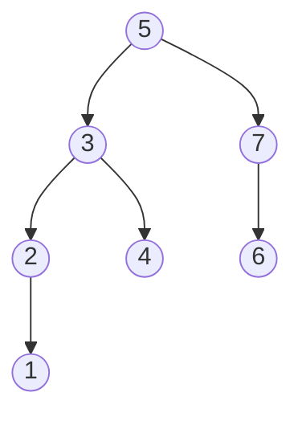
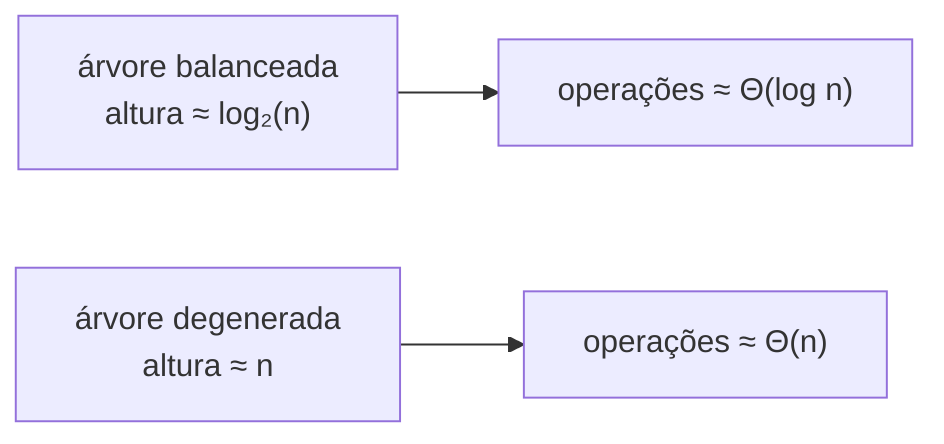
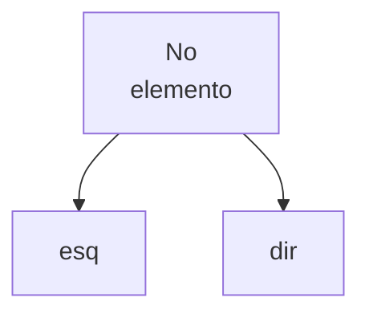
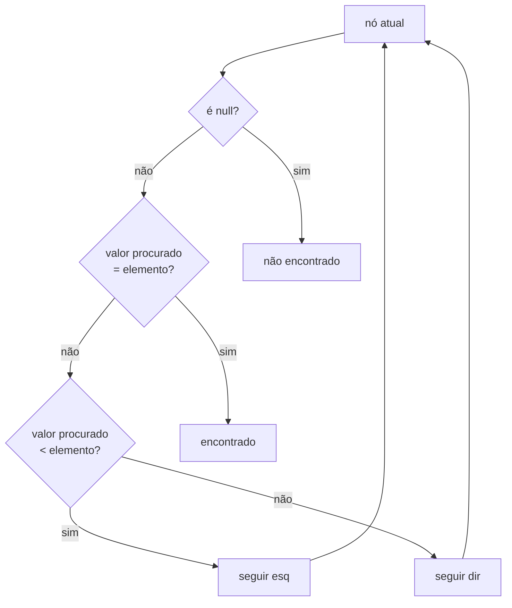
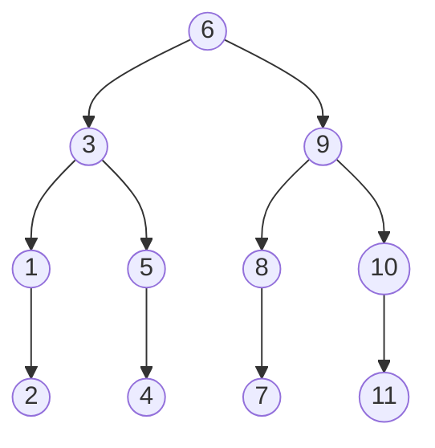
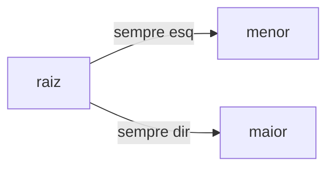
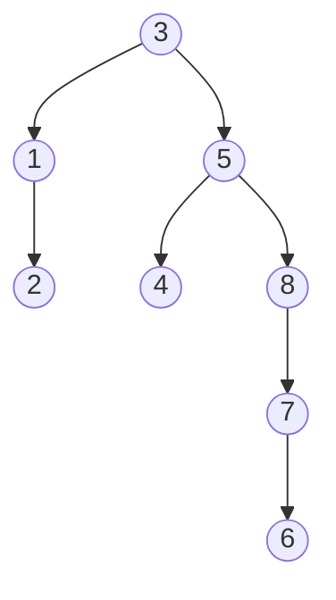
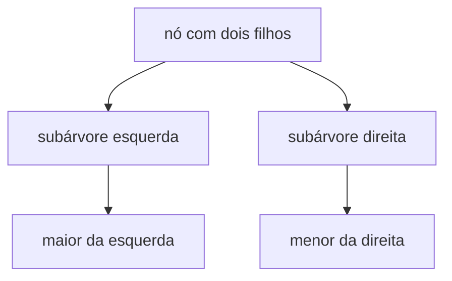

# Árvore binária de pesquisa: estrutura, busca e operações

> **Contexto:** Depois de listas lineares e flexíveis, as árvores introduzem uma organização hierárquica. Nesta etapa, o foco está em árvores binárias de pesquisa: cada nó possui no máximo dois filhos e mantém valores menores à esquerda e maiores à direita.

## Estrutura e vocabulário da árvore

Uma árvore é formada por um conjunto finito de **nós** (ou vértices) conectados por **arestas**. Em uma árvore binária, cada nó possui zero, um ou dois filhos.

Os principais termos são:

- **raiz:** primeiro nó da estrutura e ponto de partida das operações;
- **pai e filho:** relação entre um nó e os nós diretamente abaixo dele;
- **nó interno:** nó que possui pelo menos um filho;
- **folha ou nó externo:** nó sem filhos;
- **subárvore:** um nó acompanhado de todos os seus descendentes;
- **nível:** distância em arestas a partir da raiz, que ocupa o nível `0`;
- **altura:** número de arestas no maior caminho entre a raiz e uma folha.

Um exemplo de árvore binária é:



Nessa árvore, `5` é a raiz. Os nós `5`, `3`, `7` e `2` são internos; `1`, `4` e `6` são folhas. A subárvore de `3` contém `3`, `2`, `1` e `4`. A altura da árvore é `3`, pois o caminho mais longo entre a raiz `5` e uma folha contém três arestas.

## Árvore binária de pesquisa

Uma **árvore binária de pesquisa** organiza os valores segundo uma regra adicional:

```text
valores menores  ←  nó  →  valores maiores
```

Essa propriedade vale para cada nó e para suas subárvores. Assim, a organização não depende apenas de cada filho imediato: todos os valores da subárvore esquerda devem ser menores que o nó, e todos os da subárvore direita devem ser maiores.

> **Convenção desta unidade:** a partir deste ponto, as árvores binárias trabalhadas são consideradas árvores binárias de pesquisa, salvo indicação contrária.

## Altura e custo das operações

Pesquisa, inserção e remoção percorrem caminhos na árvore e, por isso, seu custo depende da **altura**.

Em uma árvore balanceada com `n` nós, a altura cresce aproximadamente de forma logarítmica e as operações básicas podem ter custo proporcional a `Θ(log n)` no pior caso. Para `1024` elementos, `log₂(1024) = 10`, o que corresponde a aproximadamente dez decisões ao longo de um caminho.

Em uma árvore degenerada, formada praticamente como uma cadeia linear, a altura pode se aproximar de `n`. Nesse caso, o custo das mesmas operações pode chegar a `Θ(n)`.



> **Leitura importante:** o ganho não vem simplesmente de a estrutura ser uma árvore. Ele depende de a altura permanecer pequena.

## O nó em C#

Um nó de árvore é uma classe autorreferencial, assim como a célula de uma lista encadeada. A diferença é que agora existem duas referências: uma para o filho esquerdo e outra para o filho direito.

```csharp
class No
{
    public int elemento;
    public No esq, dir;

    public No(int elemento)
    {
        this.elemento = elemento;
        this.esq = null;
        this.dir = null;
    }

    public No(int elemento, No esq, No dir)
    {
        this.elemento = elemento;
        this.esq = esq;
        this.dir = dir;
    }
}
```

Visualmente:



## Pesquisa segue uma decisão por nó

A pesquisa começa na raiz e repete três perguntas:

1. O nó atual é `null`? Então o elemento não existe.
2. O valor procurado é igual ao valor do nó? Então a pesquisa terminou com sucesso.
3. O valor procurado é menor? Vá para a esquerda. Se for maior, vá para a direita.



Em uma árvore com raiz `6`, procurar `4` pode visitar:

```text
6 → 3 → 5 → 4
```

Já procurar um valor inexistente como `7,5` pode seguir:

```text
6 → 9 → 8 → 7 → null
```

Chegar a `null` significa que o valor não está na árvore. Pela propriedade de pesquisa, se ele existisse, teria de estar exatamente naquele caminho.

## Percursos: em ordem, pós-ordem e pré-ordem

Percorrer uma árvore significa visitar todos os seus nós. A ordem da visita depende de quando o nó atual é processado em relação às suas subárvores.

Considere:



### Em ordem ou central

A sequência é:

```text
esquerda → nó → direita
```

Para uma árvore binária de pesquisa, esse percurso apresenta os valores em ordem crescente:

```text
1, 2, 3, 4, 5, 6, 7, 8, 9, 10, 11
```

### Pós-ordem ou pós-fixado

A sequência é:

```text
esquerda → direita → nó
```

No mesmo exemplo:

```text
2, 1, 4, 5, 3, 7, 8, 11, 10, 9, 6
```

A raiz é visitada por último porque suas duas subárvores são processadas antes dela.

### Pré-ordem ou pré-fixado

A sequência é:

```text
nó → esquerda → direita
```

No exemplo:

```text
6, 3, 1, 2, 5, 4, 9, 8, 7, 10, 11
```

A raiz aparece primeiro porque o nó é processado antes de suas subárvores.

## Menor e maior elemento

A propriedade de pesquisa torna os extremos fáceis de localizar:

- para encontrar o **menor** elemento, caminhe continuamente para a esquerda;
- para encontrar o **maior** elemento, caminhe continuamente para a direita.



## Inserção é uma pesquisa até encontrar null

Inserir usa praticamente a mesma lógica da pesquisa. A árvore é percorrida segundo as comparações até que a referência correspondente seja `null`; esse ponto é a posição de inserção.

```text
novo < nó  → seguir esquerda
novo > nó  → seguir direita
chegou a null → inserir
```

No modelo estudado, valores repetidos não são inseridos. Uma implementação que aceite repetições precisa definir explicitamente se valores iguais seguem para a esquerda ou para a direita.

Por exemplo, inserindo sucessivamente:

```text
3, 5, 1, 8, 2, 4, 7, 6
```

obtém-se:



## Remoção depende da quantidade de filhos

A remoção começa com uma pesquisa pelo elemento. Depois de encontrá-lo, existem três casos.

### Nó folha

Se o nó não possui filhos, basta desconectá-lo da árvore.

### Nó com um filho

Se existe apenas um filho, o pai do nó removido passa a apontar diretamente para esse filho.

```text
pai → nó → filho

vira

pai ─────→ filho
```

### Nó com dois filhos

Com dois filhos, o valor removido precisa ser substituído sem quebrar a propriedade de pesquisa. O material apresenta duas opções equivalentes:

- usar o **maior elemento da subárvore esquerda**;
- usar o **menor elemento da subárvore direita**.

Esses valores são, respectivamente, o predecessor e o sucessor imediatos adequados dentro da ordenação da árvore.



Depois de escolher o substituto, a célula original desse valor também precisa ser removida de sua posição anterior.

## Pontos que costumam gerar confusão

- **Árvore binária e árvore binária de pesquisa não são sinônimos em geral.** Nesta unidade, porém, o material passa a tratar as árvores binárias seguintes como árvores de pesquisa.
- **Folha não é sinônimo de nó sem dois filhos.** Uma folha possui zero filhos; um nó com apenas um filho continua sendo interno.
- **Altura conta arestas, não nós.** A raiz sozinha tem altura `0` segundo a convenção usada no material.
- **`Θ(log n)` depende da altura permanecer logarítmica.** Uma árvore em cadeia pode chegar a `Θ(n)`.
- **Em ordem só produz sequência crescente porque a árvore é de pesquisa.** O percurso por si só não ordena uma árvore arbitrária.
- **Inserir e pesquisar usam a mesma lógica de decisão.** A inserção termina quando a pesquisa encontra uma referência `null`.
- **Remover um nó com dois filhos não significa escolher qualquer descendente.** O substituto deve preservar a regra menores à esquerda e maiores à direita.