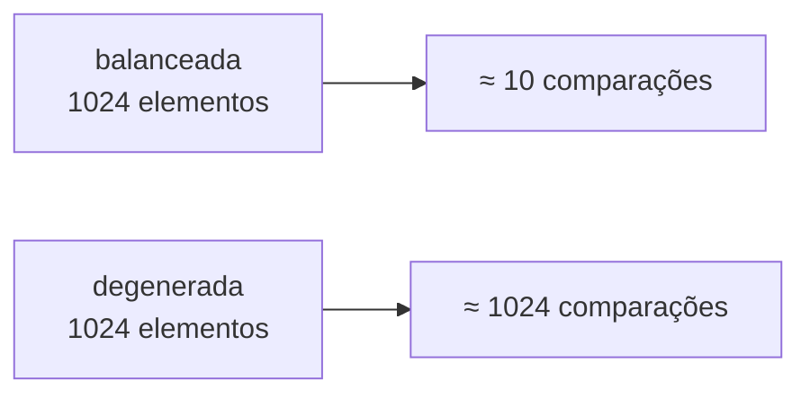
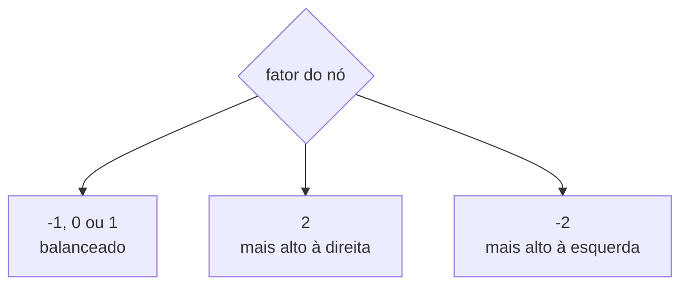
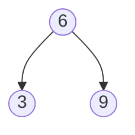
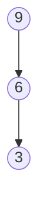
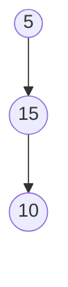
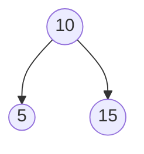
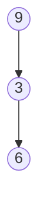
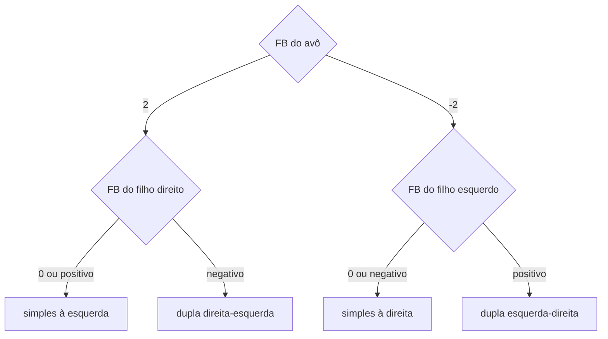

# Árvores AVL: balanceamento, fator e rotações

> **Contexto:** Árvores binárias de pesquisa são eficientes quando sua altura permanece pequena. O balanceamento busca impedir que a estrutura se transforme em uma cadeia linear, preservando custos próximos de `Θ(log n)` nas operações de pesquisa, inserção e remoção.

## Por que balancear a árvore

Em uma árvore binária de pesquisa balanceada, um caminho entre a raiz e uma folha tende a crescer de forma logarítmica. Com `1024` elementos, isso corresponde a aproximadamente `10` decisões em um caminho. Em uma árvore degenerada com a mesma quantidade de elementos, o caminho pode chegar a aproximadamente `1024` nós.



Por isso, o balanceamento afeta não apenas a pesquisa: inserção e remoção também começam por um percurso de pesquisa e dependem da altura da estrutura.

## Fator de balanceamento

No material, o **fator de balanceamento** de um nó é calculado como:

```text
FB = altura da subárvore direita - altura da subárvore esquerda
```

Uma árvore é considerada balanceada quando todos os nós possuem fator:

```text
-1, 0 ou 1
```

Assim:

- `FB = 0`: as duas subárvores têm a mesma altura;
- `FB = 1`: a direita possui uma unidade a mais;
- `FB = -1`: a esquerda possui uma unidade a mais;
- `FB = 2`: há dois níveis a mais à direita e o nó precisa ser rebalanceado;
- `FB = -2`: há dois níveis a mais à esquerda e o nó precisa ser rebalanceado.



Depois de uma inserção ou remoção, os fatores são verificados no caminho entre a folha alterada e a raiz. O primeiro nó encontrado com fator `2` ou `-2` é o ponto em que uma rotação deve corrigir o desbalanceamento.

## A rotação acontece no sentido contrário ao excesso

A regra geral é:

```text
árvore pesada à direita  → rotacionar para a esquerda
árvore pesada à esquerda → rotacionar para a direita
```

Ou seja:

- `FB = 2` indica excesso à direita e exige uma rotação cujo resultado final é para a esquerda;
- `FB = -2` indica excesso à esquerda e exige uma rotação cujo resultado final é para a direita.

A rotação reorganiza referências sem perder a propriedade de pesquisa: valores menores continuam à esquerda e valores maiores continuam à direita.

## Rotação simples à esquerda

Esse caso aparece quando o nó desbalanceado e seu filho mais alto seguem a mesma direção para a direita.

Antes:


O nó `3` possui dois níveis a mais à direita. A rotação ocorre para a esquerda:



O antigo filho `6` passa a ocupar a posição central; `3` torna-se filho esquerdo e `9`, filho direito.

Um exemplo de inserção que produz esse caso é:

```text
5, 10, 15
```

Depois da inserção de `15`, o nó `5` fica pesado à direita e uma rotação simples à esquerda o rebalanceia.

## Rotação simples à direita

É o caso espelhado: o nó desbalanceado e seu filho mais alto seguem a mesma direção para a esquerda.

Antes:



A rotação para a direita produz:


O antigo filho `6` torna-se o novo centro da subárvore.

## Quando a rotação precisa ser dupla

A rotação dupla ocorre quando a direção entre **avô e pai** é diferente da direção entre **pai e filho**. Visualmente, os três nós formam um “V” ou um zigue-zague.

Existem dois casos:

- **direita-esquerda:** a árvore está pesada à direita, mas o filho direito está inclinado para a esquerda;
- **esquerda-direita:** a árvore está pesada à esquerda, mas o filho esquerdo está inclinado para a direita.

Nesses casos, uma primeira rotação alinha os três nós e a segunda realiza o balanceamento propriamente dito.

## Rotação dupla direita-esquerda

Considere as inserções:

```text
5, 15, 10
```

A estrutura fica:



O excesso está à direita de `5`, mas o caminho vira para a esquerda em `15`. Primeiro ocorre uma rotação para a direita no pai `15`; depois, uma rotação para a esquerda no avô `5`.

O resultado é:



## Rotação dupla esquerda-direita

É o caso espelhado. Quando o nó está pesado à esquerda, mas o filho esquerdo está inclinado para a direita, primeiro rotaciona-se o pai para a esquerda e depois o avô para a direita.



Depois das duas rotações:


Nos dois tipos de rotação dupla, o nó que estava no meio dos três valores termina como raiz local da subárvore.

## Como escolher entre rotação simples e dupla

Com a convenção `altura da direita - altura da esquerda`, o material resume a decisão assim:

| Fator do avô | Lado mais alto | Fator do filho desse lado | Rotação |
| ---: | --- | ---: | --- |
| `2` | direita | `0` ou positivo | simples à esquerda |
| `2` | direita | negativo | dupla direita-esquerda |
| `-2` | esquerda | `0` ou negativo | simples à direita |
| `-2` | esquerda | positivo | dupla esquerda-direita |

A primeira informação define para qual lado a árvore está “pesada”. O fator do filho indica se o caminho continua na mesma direção ou muda de direção.



## Árvore AVL

A AVL é apresentada como uma árvore binária de pesquisa que preserva o balanceamento após inserções e remoções. Para cada nó, o fator deve permanecer em `-1`, `0` ou `1`.

Quando uma alteração faz algum nó atingir `2` ou `-2`, o algoritmo identifica esse nó no caminho de volta até a raiz e aplica uma das quatro rotações.

```text
inserir/remover
      ↓
atualizar alturas e fatores no caminho até a raiz
      ↓
algum FB = 2 ou -2?
      ↓ sim
identificar alinhamento
      ↓
rotação simples ou dupla
```

O objetivo não é deixar a árvore perfeitamente simétrica. O objetivo é limitar a diferença de altura das subárvores de cada nó a uma unidade.

## Exemplo de raciocínio em uma AVL

Se uma inserção produz:

```text
avô: FB = 2
filho direito: FB = -1
```

o avô está pesado à direita, mas o filho está inclinado para a esquerda. Os sinais indicam mudança de direção, portanto o caso é **direita-esquerda**, com rotação dupla.

Se, por outro lado:

```text
avô: FB = -2
filho esquerdo: FB = -1
```

avô e filho seguem a mesma direção para a esquerda. O caso é uma **rotação simples à direita**.

## Pontos que costumam gerar confusão

- **Balanceada não significa perfeitamente simétrica.** Diferenças de altura de uma unidade ainda são permitidas.
- **Neste material, o fator é direita menos esquerda.** Portanto, fator positivo indica excesso à direita e fator negativo indica excesso à esquerda.
- **A direção da rotação é contrária ao lado mais alto.** Excesso à direita leva a uma rotação final para a esquerda; excesso à esquerda leva a uma rotação final para a direita.
- **Rotação dupla aparece quando o caminho muda de direção.** Avô-pai e pai-filho não estão alinhados.
- **A primeira rotação da dupla alinha os nós.** A segunda realiza o balanceamento final.
- **As rotações não podem quebrar a propriedade de pesquisa.** Menores permanecem à esquerda e maiores, à direita.
- **AVL não exige fator zero em todos os nós.** Os fatores válidos são `-1`, `0` e `1`.