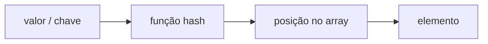
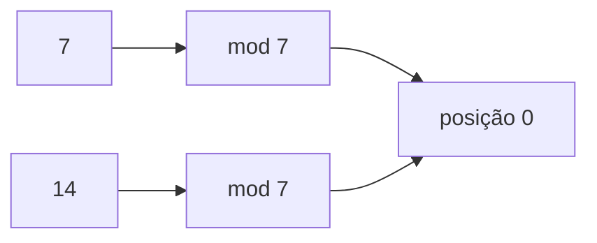
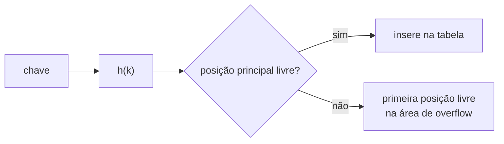
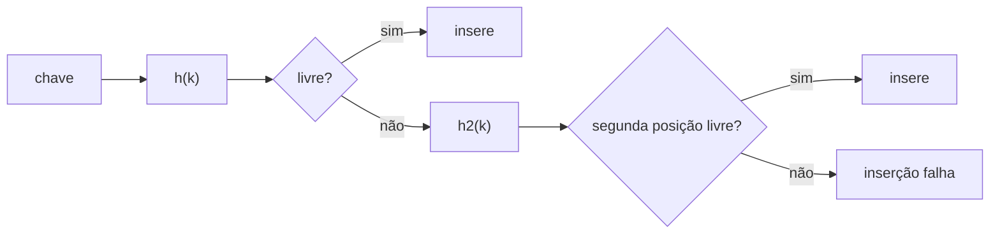
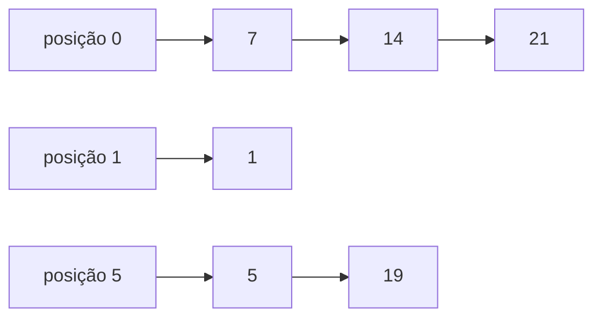
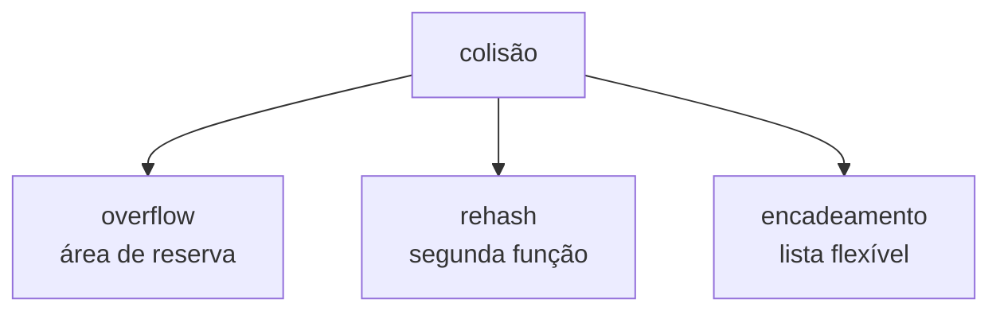

# Tabela hash: função de transformação e tratamento de colisões

> **Contexto:** A tabela hash combina um array com uma função de transformação que converte um valor ou chave em uma posição da tabela. O objetivo é chegar diretamente à região em que um elemento deve estar, evitando percorrer toda a estrutura.

## A ideia central: valor → função hash → posição

Uma tabela hash é formada por:

- um **array**, que armazena os elementos;
- uma **função de transformação** ou função hash, que calcula a posição associada ao valor.



Quando a distribuição funciona bem, a pesquisa pode ocorrer com custo esperado próximo de `Θ(1)`: a função calcula a posição e a estrutura verifica diretamente aquele ponto.

Esse ganho depende do projeto da tabela. Uma função que concentra muitos valores nas mesmas posições produz colisões e aumenta a quantidade de comparações necessárias.

## Função de transformação

A função recebe uma chave e devolve um índice válido do array. Um modelo simples usado nos exemplos é:

```text
h(k) = k mod m
```

em que:

- `k` é a chave numérica;
- `m` é o tamanho da tabela;
- `mod` retorna o resto da divisão inteira.

Se `m = 7`:

```text
5 mod 7  = 5
7 mod 7  = 0
14 mod 7 = 0
19 mod 7 = 5
```

Os valores `7` e `14` produzem a mesma posição, assim como `5` e `19`. Isso gera colisões.

### Transformando uma chave não numérica

O material também mostra uma possibilidade para nomes: somar os códigos numéricos dos caracteres e aplicar módulo pelo tamanho da tabela.

```text
k = soma dos códigos dos caracteres
h(k) = k mod m
```

Por exemplo, se a soma dos caracteres de um nome resultar em `534` e a tabela tiver tamanho `13`:

```text
534 mod 13 = 1
```

A chave textual foi transformada em uma posição numérica.

> **No modelo teórico apresentado, as chaves usadas pela função hash são tratadas numericamente.** Em C#, `Hashtable` e `Dictionary<TKey, TValue>` abstraem esse detalhe e permitem chaves de outros tipos.

## Exemplo com datas de aniversário

Um exemplo intuitivo usa uma tabela com `366` posições, uma para cada dia possível do ano. A data de nascimento é transformada no índice correspondente ao dia do ano.

Para `5 de janeiro`, por exemplo:

```text
0 dias anteriores + 5 - 1 = posição 4
```

Para `13 de março`, considerando fevereiro com 29 dias:

```text
31 + 29 + 13 - 1 = posição 72
```

O `-1` existe porque arrays em C# começam no índice `0`.

Esse exemplo mostra uma propriedade importante de uma boa função hash: valores do domínio devem ser distribuídos de forma coerente pelas posições disponíveis.

## Colisão: quando valores diferentes chegam à mesma posição

Uma **colisão primária** acontece quando duas chaves diferentes são transformadas na mesma posição.



A posição já ocupada não elimina a necessidade de armazenar o segundo elemento. Por isso, a implementação precisa definir uma estratégia de tratamento.

O material apresenta três técnicas:

1. hash direto com área de reserva (`overflow`);
2. hash direto com rehash;
3. hash indireto com lista flexível simples.

## Hash direto com área de reserva

A tabela é dividida conceitualmente em duas regiões: uma área principal e uma área extra reservada apenas para colisões.



Com uma área principal de tamanho `7` e três posições de reserva:

```text
índices principais: 0 1 2 3 4 5 6
overflow:           7 8 9
```

Inserindo `5, 7, 14, 21, 19`:

```text
5 mod 7  = 5  → posição 5
7 mod 7  = 0  → posição 0
14 mod 7 = 0  → colisão → overflow 7
21 mod 7 = 0  → colisão → overflow 8
19 mod 7 = 5  → colisão → overflow 9
```

A pesquisa começa pela posição principal. Se ali houver outro valor com a mesma chave, a área de reserva precisa ser percorrida.

No exemplo:

| Pesquisa | Comparações |
| --- | ---: |
| `5` | 1 |
| `21` | 3 |
| `19` | 4 |
| `6` inexistente | 1 |

Se a posição principal correspondente a `6` está vazia, já é possível concluir que o valor não foi inserido.

### Limite da área de reserva

A área de overflow tem tamanho finito. Se ela encher, novas colisões não podem ser tratadas por essa estratégia. Isso indica que o tamanho da tabela ou a função de transformação podem ter sido mal dimensionados para o conjunto de dados.

## Hash direto com rehash

No rehash, não existe uma área separada. Quando a primeira posição está ocupada, uma segunda função fornece uma nova tentativa.

Nos exemplos:

```text
h(k)  = k mod m
h2(k) = (k + 1) mod m
```



Para uma tabela de tamanho `7`:

```text
14 mod 7 = 0       → posição 0 ocupada
(14 + 1) mod 7 = 1 → segunda tentativa na posição 1
```

Esse mecanismo dá uma nova chance, mas não garante inserção. Um valor pode falhar se tanto a posição de `h(k)` quanto a de `h2(k)` estiverem ocupadas.

O material usa `5, 7, 14, 21, 19, 1` para mostrar inclusive um efeito importante: um elemento deslocado por rehash pode ocupar a posição que seria a posição principal natural de outro valor.

No exemplo de pesquisa:

| Pesquisa | Comparações |
| --- | ---: |
| `5` | 1 |
| `21` inexistente | 2 |
| `19` | 2 |
| `6` inexistente | 2 |

## Hash indireto com lista flexível

Nessa estratégia, cada posição da tabela funciona como ponto de entrada para uma lista flexível. Valores que geram a mesma chave ficam encadeados no mesmo índice.



Com `m = 7`:

```text
7, 14 e 21 → chave 0
5 e 19     → chave 5
1          → chave 1
```

A vantagem é que, enquanto houver memória disponível, novas colisões podem continuar sendo armazenadas na lista associada ao índice.

A desvantagem aparece quando muitos elementos caem na mesma posição: pesquisar nesse índice passa a exigir percorrer sua lista, aproximando o comportamento de uma busca linear.

No exemplo:

| Pesquisa | Comparações |
| --- | ---: |
| `5` | 1 |
| `21` | 3 |
| `19` | 2 |
| `6` inexistente | 1 |

## Comparando as três estratégias

| Estratégia | Onde fica a colisão | Vantagem principal | Limite principal |
| --- | --- | --- | --- |
| Área de reserva | região extra do próprio array | implementação direta | overflow pode encher |
| Rehash | outra posição da mesma tabela | não exige estrutura auxiliar | número de tentativas é limitado no modelo estudado |
| Lista flexível | lista associada ao índice | trata várias colisões enquanto houver memória | busca piora se uma lista ficar muito grande |



## Projeto da tabela e distribuição das chaves

A eficiência depende de distribuir bem os elementos. Uma tabela pequena demais ou uma função que concentra grande parte das chaves em poucas posições aumenta colisões.

O material destaca alguns critérios de projeto:

- escolher o tamanho da tabela com atenção;
- evitar funções que concentrem valores em poucas posições;
- distribuir os elementos de forma tão uniforme quanto possível;
- considerar tamanhos primos como uma possibilidade para reduzir padrões de colisão em determinadas funções;
- entender que o pior caso pode se aproximar de uma busca linear quando muitas chaves colidem.

Portanto, `Θ(1)` representa o comportamento desejado e esperado de uma tabela bem projetada, não a garantia de que toda pesquisa em qualquer tabela hash fará exatamente uma comparação.

## Conexão com Hashtable e Dictionary

Na Unidade 1, `Hashtable` e `Dictionary<TKey, TValue>` já apareciam como coleções prontas de chave e valor. Este artigo desce uma camada de abstração: mostra o tipo de estrutura interna e o problema de colisão que essas coleções precisam tratar.

```text
Unidade 1: usar Hashtable / Dictionary
                    ↓
Unidade 2: entender array + hash + colisões
```

Assim como ocorreu com `List<T>` e `LinkedList<T>`, a Unidade 2 expõe parte da mecânica que o framework normalmente esconde.

## Pontos que costumam gerar confusão

- **A função hash não retorna o elemento.** Ela retorna uma posição ou região em que o elemento deve ser procurado.
- **`mod` é o resto da divisão inteira.** Ele aparece nos exemplos para limitar o resultado ao intervalo válido do array.
- **Colisão não significa erro da função.** É esperado que valores diferentes possam gerar a mesma posição; a estrutura precisa saber tratá-los.
- **`Θ(1)` não significa literalmente uma comparação em todos os casos.** Colisões podem exigir verificações adicionais.
- **Uma posição vazia pode encerrar uma pesquisa em alguns modelos.** Se a posição principal nunca recebeu elementos com aquela chave, o valor não está na estrutura.
- **Rehash e encadeamento são estratégias diferentes.** O rehash procura outra posição do array; o encadeamento mantém vários elementos ligados ao mesmo índice.
- **Uma função hash ruim destrói a vantagem da tabela.** Se quase tudo cair na mesma posição, a pesquisa pode se aproximar de um percurso linear.