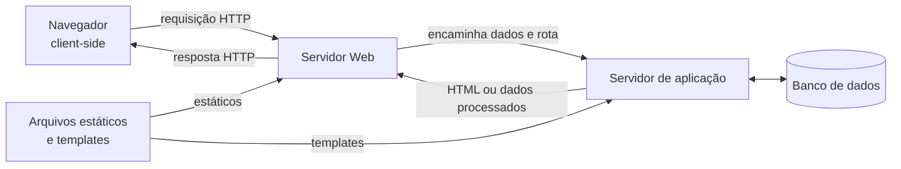
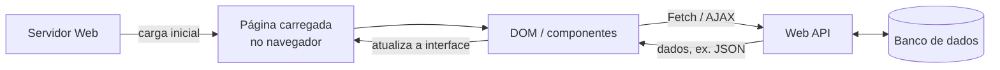

# Tipos de aplicações Web e estratégias de renderização

> **Contexto:** Este artigo separa dois eixos que costumam ser confundidos em aplicações Web: o modelo de navegação e atualização da interface, como MPA e SPA, e a estratégia de renderização, como CSR, SSR e SSG. A base continua sendo a comunicação cliente-servidor por HTTP.

A ideia central é distinguir duas perguntas. A primeira é **como a navegação acontece e como a interface é atualizada**, o que ajuda a diferenciar MPA e SPA. A segunda é **onde e quando o HTML é produzido**, o que leva a estratégias como CSR, SSR e SSG. Essas dimensões podem se combinar: uma SPA pode receber HTML inicial via SSR, e uma MPA pode usar JavaScript para atualizar partes da página sem recarregamento completo.

## Base da comunicação Web

Antes de comparar tipos de aplicação, é preciso entender como navegador e servidor se encontram. Uma aplicação Web continua baseada na relação cliente-servidor estudada em [[05. Desenvolvimento Web Back-End/01. Arquitetura de software e cliente-servidor|Arquitetura de software e cliente-servidor]]: o navegador atua como cliente, envia requisições e recebe respostas de um servidor.

### IP, porta, transporte e HTTP

Uma analogia útil é pensar em um prédio. O **endereço IP** identifica a máquina na rede, como o endereço do prédio; a **porta** identifica um ponto de comunicação dentro daquela máquina, como a porta de um apartamento; o **protocolo de transporte** define como os dados chegam de uma extremidade à outra; e o **HTTP** define como cliente e servidor estruturam a conversa no nível da Web.

A porta **80** é a porta padrão associada ao HTTP, enquanto a **443** é a porta padrão do HTTPS. Isso não significa que um servidor Web precise usar somente essas portas. Em desenvolvimento, aplicações podem escutar em portas como 3000, 5173 ou 8080 porque processos diferentes podem compartilhar a mesma máquina usando portas distintas.

Em um modelo introdutório, HTTP/1.1 e HTTP/2 podem ser entendidos sobre **TCP**, que fornece comunicação confiável e orientada a conexão. HTTP/3 usa QUIC sobre UDP, portanto “HTTP usa TCP” é uma simplificação útil apenas para parte da Web atual.

Quando front-end e back-end aparecem em portas diferentes durante o desenvolvimento, isso normalmente significa apenas que estão sendo executados por processos diferentes. A presença de duas portas não transforma automaticamente a aplicação em SPA, MPA, monólito ou sistema distribuído.

## O que significa renderizar uma interface

**Renderização** é o processo de transformar código, dados e componentes na interface que o usuário consegue visualizar. Na Web, esse trabalho pode acontecer principalmente no navegador, no servidor ou antes mesmo de uma requisição existir.

Quando o navegador recebe HTML, ele interpreta o documento e constrói uma representação em memória chamada **DOM (Document Object Model)**. O DOM organiza os elementos como uma árvore de objetos. JavaScript pode ler e modificar essa estrutura, alterando partes da interface sem precisar substituir o documento inteiro.

### Templates e renderização no servidor

Uma aplicação não precisa manter um arquivo HTML final para cada situação possível. O servidor pode utilizar **templates**, que combinam uma estrutura fixa com espaços preenchidos por dados durante a execução.

Em uma arquitetura MVC, por exemplo, um **controller** pode coordenar a requisição e uma **view** pode gerar a representação devolvida ao cliente. Isso descreve responsabilidades lógicas e não determina, por si só, se a aplicação é monolítica ou distribuída.

### Topologia e tiers

A **topologia** descreve como nós, serviços ou componentes estão dispostos e conectados. Um **tier**, por outro lado, representa uma separação física ou de implantação. Os conceitos podem se relacionar, mas respondem a perguntas diferentes: topologia mostra **como os elementos se conectam**; tier mostra **onde eles executam**.

## Modelos de navegação: MPA e SPA

MPA e SPA descrevem principalmente **como a navegação e a atualização da interface são organizadas**. Elas não dizem, sozinhas, onde o HTML foi renderizado.

### Multi-Page Application (MPA)

Uma **Multi-Page Application (MPA)** organiza a navegação principal em múltiplos documentos. Ao acessar outra página ou rota, o navegador normalmente solicita um novo documento ao servidor.

O modelo mental é:

> em uma MPA, mudar de página costuma significar pedir outro documento.

Uma MPA pode usar JavaScript, componentes dinâmicos e requisições assíncronas. O que caracteriza o modelo tradicional é que as principais mudanças de rota continuam associadas à troca de documento.

Quando o servidor produz o HTML de cada rota, um fluxo possível é:

O desenho não exige dois servidores físicos. “Servidor Web” e “servidor de aplicação” representam responsabilidades que podem estar juntas ou separadas. O ponto principal é que o servidor pode montar uma representação completa antes de responder ao navegador.

### Single-Page Application (SPA)

Uma **Single-Page Application (SPA)** mantém um documento principal e usa código executado no cliente para atualizar a interface durante a navegação. Em vez de solicitar uma página HTML completamente nova a cada mudança, a aplicação altera o DOM e busca apenas os dados ou recursos necessários.

O modelo mental é:

> em uma SPA, o documento principal permanece e a aplicação troca ou atualiza partes da interface.

Uma analogia útil é pensar em um palco: o palco continua o mesmo, mas cenários e elementos são trocados conforme a interação.

React, Vue e Blazor podem participar da construção de interfaces com comportamento de SPA, embora cada tecnologia também ofereça ou possa participar de outros modelos de renderização.

### Requisições assíncronas, AJAX e Fetch

**AJAX** significa *Asynchronous JavaScript and XML* (“JavaScript e XML assíncronos”). Ele não é uma linguagem, biblioteca ou protocolo específico, mas uma **abordagem para fazer requisições ao servidor em segundo plano e atualizar apenas partes da página, sem recarregar o documento inteiro**.

O nome surgiu em uma época em que `XMLHttpRequest` e XML eram muito usados para essa comunicação. Hoje, o mesmo padrão pode ser implementado com a **Fetch API**, e os dados costumam ser trocados em formatos como JSON. Por isso, o “XML” do nome AJAX não significa que XML seja obrigatório.

Uma SPA costuma usar esse tipo de comunicação para buscar dados sem trocar o documento principal. O comportamento essencial é este: a interface permanece carregada enquanto o navegador solicita dados ao servidor e, quando a resposta chega, atualiza apenas o trecho necessário.

JSON aparece com frequência nesse fluxo porque é um formato comum para troca de dados, mas uma API pode responder em outros formatos.

### MPA e SPA não são extremos absolutos

Na prática, aplicações podem misturar comportamentos. Uma MPA pode atualizar componentes de forma assíncrona; uma SPA pode receber HTML inicial produzido pelo servidor.

| Aspecto | MPA tradicional | SPA tradicional |
| --- | --- | --- |
| Navegação principal | Novo documento por rota | Atualização da interface no mesmo documento |
| HTML inicial | Frequentemente completo ou quase completo | Pode ser mínimo e complementado pelo cliente |
| Atualização parcial | Possível | Central ao modelo |
| JavaScript no cliente | Pode ter papel menor ou amplo | Normalmente tem papel central |
| Backend | Pode gerar páginas e dados | Frequentemente fornece dados por APIs |
| Recarregamento completo | Mais comum | Menos comum na navegação interna |

Por isso, **MPA e SPA descrevem principalmente navegação**, não estratégia de renderização.

## Estratégias de renderização: CSR, SSR e SSG

CSR, SSR e SSG respondem a outra pergunta: **onde ou quando o HTML é produzido?**

### Client-side rendering (CSR)

No **Client-Side Rendering (CSR)**, o navegador recebe os recursos da aplicação e o JavaScript produz ou atualiza a interface no cliente.

Esse modelo favorece interfaces altamente interativas, mas pode exigir que o navegador baixe, interprete e execute mais JavaScript antes de exibir o conteúdo principal.

CSR é muito associado a SPAs, mas os termos não são sinônimos: **SPA descreve navegação; CSR descreve o local principal da renderização.**

### Server-side rendering (SSR)

No **Server-Side Rendering (SSR)**, o servidor produz o HTML correspondente à requisição e envia esse resultado já renderizado ao navegador.

Esse comportamento aparece em MPAs tradicionais, mas também pode ser usado para fornecer o HTML inicial de uma aplicação que continuará interativa no cliente.

#### Hidratação

Na **hidratação**, o navegador já possui o HTML produzido no servidor. O runtime JavaScript inicializa no cliente a árvore de componentes e o estado esperados para aquele mesmo conteúdo e conecta essa lógica aos nós DOM existentes, incluindo eventos e comportamento interativo, em vez de recriar toda a interface do zero.

Para que o processo funcione corretamente, a estrutura esperada pelo código no cliente precisa corresponder ao HTML produzido no servidor. Quando há divergência relevante entre os dois, pode ocorrer um *hydration mismatch*, exigindo correção ou nova renderização de partes da interface.

Uma aplicação pode, portanto, combinar:

1. HTML inicial produzido no servidor;
2. conteúdo exibido pelo navegador;
3. JavaScript carregado no cliente;
4. hidratação;
5. navegação posterior com comportamento de SPA.

### CSR e SSR no carregamento inicial

A comparação entre SSR e uma SPA tradicional com CSR fica mais clara observando a ordem do trabalho.

| Etapa do carregamento inicial | SPA com CSR | SSR |
| :--- | :--- | :--- |
| Primeira resposta | HTML inicial + JavaScript | HTML já contendo o conteúdo renderizado |
| Busca de dados | Frequentemente ocorre no navegador após carregar a aplicação | Pode ocorrer no servidor antes da resposta |
| Montagem inicial da interface | Principalmente no navegador | Principalmente no servidor |
| JavaScript posterior | Inicializa e controla a aplicação | Pode hidratar a interface para torná-la interativa |
| Resultado percebido | Conteúdo útil depende da execução cliente | Conteúdo pode chegar pronto na primeira resposta |

No CSR, parte importante da montagem acontece **depois que os recursos chegam ao navegador**. No SSR, parte desse trabalho é feita **antes de o HTML ser enviado**. Isso pode permitir que o conteúdo inicial apareça mais cedo, embora o servidor também tenha trabalho adicional para processar e renderizar a resposta.

Uma forma curta de memorizar é:

> **CSR:** o navegador recebe as peças e monta a interface.  
> **SSR:** o servidor monta o HTML e o navegador recebe uma representação pronta para exibir.

Depois da carga inicial, uma SPA pode oferecer navegação interna rápida porque não precisa substituir o documento completo a cada mudança de rota.

### SSR, rastreamento e SEO

SSR não é necessário para que um mecanismo de busca consiga indexar qualquer página com JavaScript. O Google consegue executar JavaScript em muitas páginas. Ainda assim, conteúdo presente diretamente no HTML inicial tende a reduzir dependências adicionais para rastreamento e pode melhorar a previsibilidade da indexação.

Por isso, SSR e pré-renderização podem ajudar tanto no desempenho percebido quanto em SEO, mas “sem SSR o conteúdo não é indexado” é uma simplificação incorreta.

### Static Site Generation (SSG)

No **Static Site Generation (SSG)**, o HTML é produzido antecipadamente, normalmente durante o processo de build, em vez de ser gerado do zero para cada requisição.

Depois do build, um servidor ou CDN pode entregar arquivos já prontos. Esse modelo funciona bem para conteúdos conhecidos previamente e que não precisam mudar a cada acesso, como documentação, páginas institucionais, portfólios e artigos.

SSG não significa ausência de JavaScript. Uma página pode ser pré-gerada e ainda receber comportamento interativo no cliente.

Next.js é um exemplo de framework que oferece SSG, mas o framework também suporta outras estratégias; portanto, **Next.js não é sinônimo de SSG**.

## Navegação e renderização são eixos independentes

A distinção central do artigo pode ser resumida assim:

| Conceito | Pergunta que responde | Ideia principal |
| --- | --- | --- |
| **MPA** | Como a navegação principal é organizada? | Múltiplos documentos |
| **SPA** | Como a interface navega sem trocar o documento principal? | Atualizações no mesmo documento |
| **CSR** | Onde a interface é renderizada? | Navegador |
| **SSR** | Onde o HTML é produzido para a requisição? | Servidor |
| **SSG** | Quando o HTML é produzido? | Antes da requisição, normalmente no build |

Esses conceitos podem ser combinados. Exemplos:

- uma MPA pode usar SSR para gerar cada página;
- uma SPA pode usar CSR para montar a interface no navegador;
- uma SPA pode receber HTML inicial via SSR e depois continuar por hidratação;
- uma página gerada por SSG pode carregar JavaScript e se tornar interativa no cliente.

Frameworks modernos frequentemente combinam estratégias por rota ou componente, em vez de obrigar a aplicação inteira a usar um único modelo.

## Backend, APIs e separação da interface

Quando a interface busca dados sem solicitar uma página inteira, é comum que o backend exponha **APIs**. A API fornece dados ou operações; o front-end decide como apresentar o resultado.

Essa separação reduz a dependência entre a representação visual e a lógica do servidor. O mesmo backend pode atender uma interface Web, um aplicativo mobile ou outro cliente, desde que todos respeitem o contrato da API.

Isso se conecta ao desacoplamento estudado em [[01. Programacao Modular/04. Programação orientada a objetos e acoplamento|Programação Modular]]: separar responsabilidades pode facilitar evolução independente, embora introduza contratos de comunicação e novos elementos de infraestrutura.

## Web 2.0 como contexto histórico

**Web 2.0** é um termo histórico usado para descrever a fase em que aplicações Web passaram a enfatizar participação do usuário, colaboração e interfaces mais dinâmicas. Ele ajuda a entender a transição de páginas predominantemente documentais para aplicações cada vez mais interativas.

Web 2.0 não é um estilo arquitetural nem uma estratégia de renderização específica. Aplicações com forte interação podem ser construídas com diferentes combinações de MPA, SPA, CSR, SSR e SSG.

## Pontos que costumam gerar confusão

- **Porta 80 não é “a porta da Web” obrigatória.** É a porta padrão do HTTP; HTTPS usa 443 e aplicações podem usar outras portas.
- **TCP e HTTP atuam em níveis diferentes.** TCP transporta dados; HTTP define mensagens e semântica da comunicação Web. HTTP/3 usa QUIC sobre UDP.
- **DOM não é HTML.** O HTML é interpretado pelo navegador e dá origem a uma representação em memória que scripts podem manipular.
- **Renderização não significa recarregar a página.** Uma parte da interface pode ser atualizada no cliente.
- **SPA não significa “uma única tela”.** Pode ter várias rotas e estados de interface usando um documento principal.
- **SPA não exige uma tecnologia chamada AJAX.** Requisições assíncronas podem ser feitas com Fetch ou abstrações de frameworks.
- **MPA também pode fazer atualizações assíncronas.** Isso não a transforma automaticamente em SPA.
- **MPA e SPA descrevem principalmente navegação; CSR, SSR e SSG descrevem renderização.**
- **CSR e SPA não são sinônimos.** Uma SPA pode receber HTML inicial via SSR.
- **SSR não serve apenas para SEO.** Também muda onde o trabalho de renderização inicial acontece.
- **SSG não é sinônimo de Next.js.** Next.js suporta diferentes estratégias.
- **Controller não torna uma aplicação monolítica.** Controller é uma responsabilidade lógica; monólito descreve agrupamento e implantação.
- **Topologia e tier não são sinônimos.** Topologia descreve disposição e conexões; tier descreve separação física ou de implantação.

## Referências complementares

- MDN Web Docs. [*Port*](https://developer.mozilla.org/en-US/docs/Glossary/Port).
- MDN Web Docs. [*Single-page application (SPA)*](https://developer.mozilla.org/en-US/docs/Glossary/SPA).
- MDN Web Docs. [*AJAX*](https://developer.mozilla.org/en-US/docs/Glossary/AJAX) e [*Fetch API*](https://developer.mozilla.org/en-US/docs/Web/API/Fetch_API).
- MDN Web Docs. [*Document Object Model (DOM)*](https://developer.mozilla.org/en-US/docs/Web/API/Document_Object_Model).
- web.dev. [*Rendering on the Web*](https://web.dev/articles/rendering-on-the-web).
- Google Search Central. [*JavaScript SEO basics*](https://developers.google.com/search/docs/crawling-indexing/javascript/javascript-seo-basics).
- Next.js Documentation. [*Client-side Rendering*](https://nextjs.org/docs/pages/building-your-application/rendering/client-side-rendering) e [*Static Site Generation*](https://nextjs.org/docs/pages/building-your-application/rendering/static-site-generation).
- Microsoft Learn. [*ASP.NET Core Blazor*](https://learn.microsoft.com/aspnet/core/blazor).
