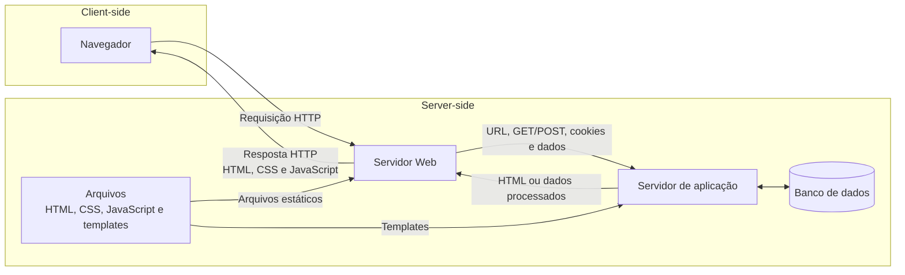
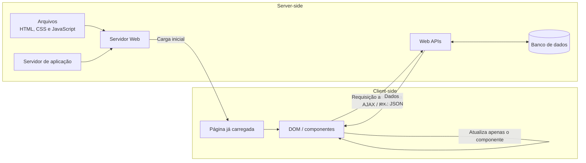

```mermaid
flowchart TB
    subgraph CSR ["SPA com CSR — carregamento inicial"]
        C1["Navegador pede a página"] --> C2["Recebe HTML inicial"]
        C2 --> C3["Baixa JavaScript"]
        C3 --> C4["Executa a aplicação"]
        C4 --> C5["Busca dados necessários"]
        C5 --> C6["Monta a interface no DOM"]
        C6 --> C7["Conteúdo útil aparece"]
    end

    subgraph SSR ["SSR — carregamento inicial"]
        S1["Navegador pede a página"] --> S2["Servidor busca os dados"]
        S2 --> S3["Servidor monta o HTML"]
        S3 --> S4["Navegador recebe HTML com conteúdo"]
        S4 --> S5["Conteúdo útil aparece"]
        S5 --> S6["JavaScript hidrata a interface"]
    end
```

# Tipos de aplicações Web e estratégias de renderização

O conteúdo desta aula mistura duas perguntas diferentes que precisam ser separadas para evitar confusão. A primeira é **como a aplicação organiza a navegação e a atualização da interface**, o que ajuda a distinguir uma aplicação de múltiplas páginas (MPA) de uma aplicação de página única (SPA). A segunda é **onde e quando o HTML da interface é produzido**, o que leva a estratégias como client-side rendering (CSR), server-side rendering (SSR) e static site generation (SSG).

Essas dimensões podem se combinar. Uma SPA não precisa ser exclusivamente CSR, assim como uma aplicação renderizada no servidor não precisa ser necessariamente uma MPA tradicional. Frameworks modernos combinam estratégias conforme a necessidade de cada rota ou componente.

Este artigo reorganiza as anotações da aula em uma síntese própria, evitando reproduzir literalmente o material disponibilizado pela PUC e corrigindo simplificações que poderiam gerar modelos mentais errados.

## Antes de MPA e SPA: como navegador e servidor se encontram

Uma aplicação Web continua baseada na relação cliente-servidor estudada em [[05. Desenvolvimento Web Back-End/01. Arquitetura de software e cliente-servidor|Arquitetura de software e cliente-servidor]]. O navegador atua como cliente e envia requisições para um servidor. Esse servidor pode devolver arquivos prontos, gerar HTML, fornecer dados para uma interface ou delegar parte do processamento a outros serviços.

### IP, porta, TCP e HTTP

Uma forma simples de visualizar a comunicação é pensar em um prédio.

- O **endereço IP** identifica a máquina na rede, como o endereço do prédio.
- A **porta** identifica um ponto de comunicação dentro daquela máquina, como a porta de um apartamento.
- O **protocolo de transporte** define como os dados são transportados entre as extremidades.
- O **HTTP** define como cliente e servidor estruturam a conversa no nível da Web.

A porta **80** é a porta padrão associada ao HTTP e a porta **443** é a porta padrão do HTTPS. Isso não significa que um servidor Web só possa funcionar nessas portas. Em desenvolvimento é comum encontrar aplicações em portas como 3000, 5173, 8080 ou outras, porque diferentes processos podem escutar portas diferentes na mesma máquina.

No modelo introdutório da disciplina, o transporte pode ser entendido a partir do **TCP**, usado tradicionalmente por HTTP/1.1 e HTTP/2. O TCP organiza uma comunicação confiável e orientada a conexão entre dois pontos. Uma ressalva técnica é que HTTP/3 utiliza QUIC sobre UDP, portanto “HTTP usa TCP” é uma simplificação válida apenas para parte importante, mas não toda, da Web atual.

### Por que às vezes aparecem duas portas durante o desenvolvimento?

Isso não é uma característica obrigatória de SPA. É comum porque o front-end e o back-end podem estar executando como processos separados. Por exemplo, um servidor de desenvolvimento do front-end pode estar em uma porta e uma API em outra. Em produção, esses componentes podem continuar separados ou aparecer para o usuário por uma única origem, dependendo da infraestrutura adotada.

A presença de várias portas, portanto, não diz sozinha qual é a arquitetura da aplicação.

## Renderizar significa produzir a interface que o usuário vê

**Renderização** é o processo de transformar código, dados e componentes em uma interface visível. Na Web, o resultado final precisa chegar ao navegador em uma forma que ele consiga apresentar.

Quando o navegador recebe HTML, ele o interpreta e constrói uma representação em memória chamada **DOM (Document Object Model)**. O DOM funciona como uma árvore de elementos da página. O JavaScript pode ler e modificar essa árvore, alterando conteúdo, estrutura e comportamento sem necessariamente solicitar uma página HTML completamente nova ao servidor.

Esse é um dos fundamentos da Web dinâmica: depois que o documento inicial chega, o navegador pode atualizar partes da interface em resposta a ações do usuário ou a novos dados.

## Templates e renderização no servidor

Uma aplicação não precisa armazenar uma página HTML final pronta para cada situação. O servidor pode usar **templates**, isto é, modelos de interface que contêm partes fixas e espaços que serão preenchidos com dados durante a execução.

Em uma aplicação server-side tradicional, uma requisição pode passar por uma camada responsável por interpretar a ação solicitada, obter ou transformar dados e selecionar a representação que será devolvida. Em arquiteturas MVC, essa responsabilidade costuma envolver um **controller** e uma **view**, mas a presença de um controller não significa automaticamente que o sistema seja monolítico.

Um controller é uma responsabilidade lógica. Monolítico, por outro lado, descreve principalmente como a aplicação é agrupada e implantada, como visto em [[05. Desenvolvimento Web Back-End/02. Estilos arquiteturais - camadas, monolítico e cliente-servidor|Estilos arquiteturais]]. Portanto, uma aplicação com controllers pode ser monolítica, distribuída ou parte de uma solução híbrida.

### Topologia não é a mesma coisa que tier

A aula também menciona a possibilidade de organizar componentes do servidor por uma **topologia**. Topologia descreve como nós, serviços ou componentes estão dispostos e conectados. Já um **tier** representa uma separação física ou de implantação.

Os conceitos se relacionam, mas não são equivalentes: os tiers ajudam a identificar onde partes da solução executam; a topologia ajuda a visualizar como essas partes estão organizadas e se comunicam.

## Multi-Page Application (MPA)

Uma **Multi-Page Application (MPA)** é uma aplicação em que a navegação normalmente envolve solicitar ao servidor um novo documento para cada página ou rota principal. O usuário clica em um link ou envia um formulário, o navegador realiza uma requisição e o servidor responde com outra página HTML.

Isso não significa que uma MPA seja completamente estática. Ela pode usar JavaScript, componentes dinâmicos e requisições assíncronas para atualizar partes específicas da tela. O que caracteriza o modelo tradicional é que a navegação principal continua baseada em múltiplos documentos.

Em termos de modelo mental:

> em uma MPA, mudar de página costuma significar pedir outro documento ao servidor.

Como o servidor pode entregar uma página já composta com seu conteúdo principal, MPAs tendem a oferecer uma estrutura direta para navegação, URLs e conteúdo inicial. Também podem aproveitar frameworks server-side e sistemas de gerenciamento de conteúdo de maneira simples.

Por outro lado, uma navegação que exige uma nova resposta HTML completa pode repetir o envio de partes da interface que pouco mudaram, como cabeçalho e rodapé, e introduzir esperas entre páginas. Isso pode ser mitigado com cache, CDNs e atualizações assíncronas de partes da interface.

### Leitura do diagrama da aula: aplicação Web tradicional

O diagrama apresentado em aula separa explicitamente **client-side** e **server-side**. O navegador envia uma requisição HTTP ao servidor Web. O servidor Web pode servir arquivos estáticos diretamente ou encaminhar os dados da requisição para o servidor de aplicação. O servidor de aplicação consulta arquivos de template e banco de dados, produz o conteúdo necessário e devolve o resultado ao servidor Web, que responde ao cliente.

O ponto principal do desenho não é memorizar que sempre existirão dois servidores físicos. **Servidor Web** e **servidor de aplicação** representam responsabilidades que podem estar separadas ou reunidas na mesma infraestrutura. O desenho ajuda a enxergar que, no modelo tradicional, a montagem da página tende a acontecer predominantemente no lado do servidor antes da resposta chegar ao navegador.

## Single-Page Application (SPA)

Uma **Single-Page Application (SPA)** carrega um documento principal e usa código executado no cliente para alterar a interface durante a navegação. Em vez de pedir uma página HTML inteiramente nova a cada interação, a aplicação modifica partes do DOM e busca os dados necessários para produzir o novo estado da tela.

O modelo mental é:

> em uma SPA, o documento principal permanece e a aplicação troca ou atualiza partes da interface.

Isso explica a comparação feita em aula com peças de Lego: a estrutura básica já está disponível e os componentes podem ser substituídos, atualizados ou preenchidos conforme a navegação.

React e Vue são exemplos de tecnologias frequentemente usadas na construção de SPAs. O nome anotado como “Blaze da Microsoft” provavelmente se refere ao **Blazor**, framework Web da Microsoft baseado em .NET. Blazor pode funcionar com diferentes modelos de renderização e não deve ser reduzido apenas à ideia de SPA.

### SPA sempre usa AJAX?

Não. **AJAX** é um nome histórico para a técnica de realizar requisições assíncronas a partir do navegador e atualizar partes da página sem recarregá-la por inteiro. Ele foi associado inicialmente a `XMLHttpRequest`, mas aplicações modernas usam com frequência a **Fetch API** e abstrações oferecidas pelos próprios frameworks.

Uma SPA normalmente precisa trocar dados com servidores sem fazer uma navegação completa, mas isso não obriga a aplicação a usar uma tecnologia chamada “AJAX”. O importante é a comunicação assíncrona. Além de requisições HTTP tradicionais, aplicações podem empregar outros mecanismos quando o problema exigir.

O indicador de *loading* que aparece em muitas interfaces é uma consequência comum desse fluxo: o componente já existe na tela, mas ainda aguarda uma resposta assíncrona para exibir os dados.

### Leitura do diagrama da aula: SPA

No segundo diagrama, o carregamento inicial ainda passa por um servidor Web e pode envolver um servidor de aplicação para entregar HTML, CSS e JavaScript. A diferença aparece depois: a interface no navegador passa a buscar **dados** separadamente em APIs e usa esses dados para atualizar apenas partes da página.

A imagem da aula usa os rótulos **AJAX** e **JSON**. Eles devem ser entendidos como exemplos típicos do fluxo. AJAX representa a ideia de fazer requisições assíncronas sem recarregar a página inteira; hoje isso pode ser implementado com `fetch()` ou abstrações de frameworks. JSON é um formato muito comum para transportar dados, mas a API poderia responder em outro formato.

A diferença visual entre os dois diagramas é justamente esta: no modelo tradicional, a resposta principal tende a trazer uma página já montada; na SPA, depois da carga inicial, o navegador mantém a página e pede dados para atualizar partes específicas da interface.

## MPA e SPA são extremos de um espectro

Na prática, aplicações modernas podem misturar características dos dois modelos. Uma MPA pode atualizar alguns componentes de forma assíncrona, enquanto uma aplicação com comportamento de SPA pode receber HTML inicial produzido pelo servidor.

Por isso, a oposição “MPA = servidor” e “SPA = cliente” é útil apenas como introdução. Ela não descreve todas as combinações possíveis.

| Aspecto | MPA tradicional | SPA tradicional |
| --- | --- | --- |
| Navegação principal | Novo documento por rota | Atualização da interface no mesmo documento |
| HTML inicial | Frequentemente gerado ou servido pelo servidor | Pode ser mínimo e complementado pelo cliente |
| Atualização parcial | Possível | É parte central do modelo |
| JavaScript no cliente | Pode ser pequeno ou amplo | Normalmente tem papel central |
| Backend | Pode gerar páginas e dados | Frequentemente fornece dados por APIs |
| Recarregamento completo | Mais comum | Menos comum durante a navegação interna |

## Client-side rendering (CSR)

No **Client-Side Rendering (CSR)**, o navegador recebe os recursos necessários e o JavaScript produz ou atualiza a interface no cliente. O navegador manipula o DOM e monta o conteúdo que o usuário vê.

O CSR favorece interfaces altamente interativas porque, após o carregamento inicial, partes da tela podem ser atualizadas sem solicitar um documento completo. O custo é que o navegador precisa baixar e executar JavaScript suficiente para produzir a interface, o que pode aumentar o tempo até o conteúdo aparecer em dispositivos ou redes mais lentas.

CSR é muito associado a SPAs, mas os termos não são sinônimos. **SPA descreve principalmente o comportamento de navegação da aplicação; CSR descreve onde ocorre a renderização.**

## Server-side rendering (SSR)

No **Server-Side Rendering (SSR)**, o servidor produz o HTML associado a uma requisição e envia esse resultado já renderizado ao navegador.

Em uma MPA tradicional, esse comportamento é comum: cada navegação pode gerar uma nova página no servidor. Em frameworks modernos, porém, SSR também pode ser usado para entregar o primeiro HTML de uma aplicação que depois continua interativa no cliente.

Quando o navegador recebe HTML renderizado pelo servidor e, em seguida, o JavaScript assume os componentes para torná-los interativos, ocorre um processo geralmente chamado **hidratação**.

Portanto, uma SPA moderna pode ter:

1. HTML inicial produzido no servidor;
2. conteúdo exibido rapidamente pelo navegador;
3. JavaScript carregado no cliente;
4. hidratação dos componentes;
5. navegação posterior com comportamento de SPA.

Isso mostra por que a afirmação “SPA é client-side e MPA é server-side” é insuficiente.

### Por que o carregamento inicial de SSR pode ser mais rápido que o de uma SPA?

Quando a PUC afirma que aplicações SSR têm carregamento inicial mais rápido que aplicações SPA, a comparação faz mais sentido se **SPA** for entendida como uma **SPA tradicional com CSR**.

Em uma SPA com CSR, o navegador pode receber inicialmente apenas uma estrutura HTML pequena. Antes de mostrar o conteúdo principal, ele ainda precisa baixar o JavaScript da aplicação, interpretar e executar esse código, possivelmente buscar dados no servidor e então montar a interface no DOM. Há, portanto, mais trabalho no cliente antes de o usuário enxergar o conteúdo útil.

No SSR, o servidor realiza parte desse trabalho antes de enviar a resposta. Ele pode buscar os dados necessários, montar o HTML e devolvê-lo já com o conteúdo da página. Assim que o navegador recebe esse HTML, ele já consegue começar a interpretá-lo e exibi-lo. O JavaScript necessário para a interatividade pode chegar depois e realizar a hidratação.

O ponto central é a ordem do trabalho. No CSR, grande parte da montagem acontece **depois que a resposta chega ao navegador**. No SSR, grande parte da montagem acontece **antes da resposta chegar ao navegador**, permitindo que o primeiro conteúdo visível apareça mais cedo.

Isso não significa que SSR seja sempre “muito mais rápido”. O servidor também precisa processar a requisição e renderizar o HTML, o que pode aumentar o tempo até a primeira resposta. Em uma aplicação pequena, muito bem otimizada ou já em cache, uma SPA com CSR pode carregar rapidamente. A vantagem do SSR está principalmente em reduzir o trabalho necessário no cliente antes da primeira exibição de conteúdo.

Uma forma curta de memorizar é:

> **CSR:** primeiro chegam as peças; depois o navegador monta a página.  
> **SSR:** o servidor monta a página; o navegador já recebe algo que consegue mostrar.

Depois do carregamento inicial, a comparação muda: uma SPA pode oferecer navegação interna muito rápida justamente porque não precisa solicitar e renderizar uma página completa a cada mudança de rota.

### SSR é necessário para o Google indexar?

Não exatamente. O Google atualmente executa JavaScript ao processar muitas páginas e consegue indexar conteúdo renderizado no cliente. Entretanto, essa renderização adiciona uma etapa ao processo e nem todos os rastreadores executam JavaScript da mesma forma.

SSR e pré-renderização continuam sendo estratégias úteis porque colocam o conteúdo diretamente no HTML inicial, o que pode favorecer desempenho percebido, rastreamento e previsibilidade de indexação. Assim, a ideia da aula de que SSR ajuda SEO faz sentido, mas “sem SSR o Google não indexa” seria uma simplificação excessiva.

## Static Site Generation (SSG)

No **Static Site Generation (SSG)**, o HTML é produzido antecipadamente, normalmente durante o processo de build, em vez de ser montado do zero a cada requisição.

O servidor ou CDN pode então entregar arquivos já prontos. Isso costuma funcionar muito bem para conteúdo que muda pouco ou que pode ser conhecido antes da visita, como documentação, páginas institucionais, portfólios e artigos.

SSG não significa que a página precise permanecer sem JavaScript. O HTML pode ser pré-gerado e depois receber interatividade no cliente.

A anotação “SSG — Next.js” deve ser lida como **Next.js é uma tecnologia que oferece geração estática**, e não como “SSG é Next.js”. O mesmo framework também suporta outras estratégias de renderização.

## CSR, SSR e SSG não são três tipos mutuamente exclusivos de aplicação

O ponto mais importante desta aula é separar estrutura de navegação de estratégia de renderização.

| Conceito | Pergunta que responde | Momento/local principal |
| --- | --- | --- |
| **MPA** | Como a navegação entre páginas é organizada? | Múltiplos documentos |
| **SPA** | Como a interface navega sem trocar o documento principal? | Atualizações no cliente |
| **CSR** | Onde a interface é renderizada? | Navegador |
| **SSR** | Onde o HTML é produzido para a requisição? | Servidor, em tempo de requisição |
| **SSG** | Quando o HTML é produzido? | Antes da requisição, normalmente no build |

Uma aplicação real pode combinar vários desses termos. Um framework moderno pode gerar algumas rotas estaticamente, renderizar outras no servidor e depois executar componentes interativos no cliente.

## Backend, APIs e separação da interface

Quando uma SPA atualiza partes da interface sem solicitar uma página inteira, é comum que o backend exponha **APIs** que devolvem dados. A interface solicita esses dados e decide como apresentá-los.

Esse desenho aumenta a separação entre interface e servidor: o backend não precisa necessariamente conhecer qual componente visual exibirá cada dado. Ele fornece uma representação dos dados ou uma operação, e o front-end utiliza a resposta.

Isso se conecta aos conceitos de desacoplamento já estudados em [[01. Programacao Modular/04. Programação orientada a objetos e acoplamento|Programação Modular]]. Separar responsabilidades pode facilitar evolução independente, mas também introduz novos contratos de comunicação e mais elementos para administrar.

## Web 2.0 como contexto histórico

O termo **Web 2.0** é usado historicamente para descrever uma fase em que aplicações Web passaram a enfatizar maior participação do usuário, colaboração e interfaces mais dinâmicas. Ele ajuda a contextualizar a mudança de páginas predominantemente documentais para aplicações mais interativas.

Web 2.0, porém, não é um estilo arquitetural específico. Uma aplicação com forte interação do usuário pode ser construída com diferentes arquiteturas e estratégias de renderização.

## Pontos que costumam gerar confusão

- **Porta 80 não é “a porta da Web” obrigatória.** É a porta padrão do HTTP; HTTPS usa 443 e aplicações podem escutar outras portas.
- **TCP e HTTP atuam em níveis diferentes.** TCP transporta fluxos de dados; HTTP define mensagens e semântica da comunicação Web. HTTP/3 é uma exceção importante ao modelo “HTTP sobre TCP”.
- **DOM não é HTML.** O HTML é interpretado pelo navegador e dá origem a uma representação em memória que scripts podem manipular.
- **Renderização não significa necessariamente recarregar a página.** Um componente pode ser atualizado no cliente.
- **SPA não significa “uma única tela”.** Pode ter várias rotas e estados de interface, embora use um documento principal.
- **SPA não exige AJAX como tecnologia específica.** Requisições assíncronas podem ser feitas hoje com Fetch ou abstrações dos frameworks.
- **MPA também pode usar AJAX ou Fetch.** Atualização parcial não transforma automaticamente uma aplicação em SPA.
- **CSR, SSR e SSG são estratégias de renderização; MPA e SPA descrevem sobretudo a organização da navegação.**
- **SSR não é necessário apenas para SEO.** Também influencia desempenho inicial, disponibilidade do conteúdo e arquitetura de execução.
- **Google consegue executar JavaScript, mas isso não elimina as vantagens de SSR ou pré-renderização para rastreamento e desempenho.**
- **Next.js não é sinônimo de SSG.** Ele pode combinar renderização estática, dinâmica e no cliente.
- **Blazor é o nome do framework da Microsoft anotado na aula.**
- **Ter controller não torna uma aplicação monolítica.** Controller é uma responsabilidade lógica; monólito é uma decisão de agrupamento e implantação.
- **Topologia e tier não são sinônimos.** Topologia descreve disposição e conexões; tier descreve separação física ou de implantação.

## Referências complementares

- MDN Web Docs. [*Port*](https://developer.mozilla.org/en-US/docs/Glossary/Port).
- MDN Web Docs. [*Single-page application (SPA)*](https://developer.mozilla.org/en-US/docs/Glossary/SPA).
- MDN Web Docs. [*AJAX*](https://developer.mozilla.org/en-US/docs/Glossary/AJAX) e [*Fetch API*](https://developer.mozilla.org/en-US/docs/Web/API/Fetch_API).
- MDN Web Docs. [*Document Object Model (DOM)*](https://developer.mozilla.org/en-US/docs/Web/API/Document_Object_Model).
- web.dev. [*Rendering on the Web*](https://web.dev/articles/rendering-on-the-web).
- Google Search Central. [*JavaScript SEO basics*](https://developers.google.com/search/docs/crawling-indexing/javascript/javascript-seo-basics).
- Next.js Documentation. [*Client-side Rendering*](https://nextjs.org/docs/pages/building-your-application/rendering/client-side-rendering) e [*Static Site Generation*](https://nextjs.org/docs/pages/building-your-application/rendering/static-site-generation).
- Microsoft Learn. [*ASP.NET Core Blazor*](https://learn.microsoft.com/aspnet/core/blazor).
