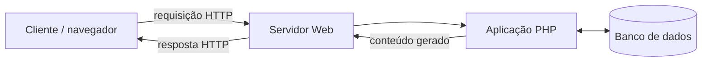

# Linguagens de programação back-end e PHP

> **Contexto:** Este artigo apresenta o papel das linguagens de programação no back-end com foco principal em PHP. A partir dele, são estudados execução server-side, processamento de formulários, linguagem de script, compilação e interpretação, tipagem, servidor Web, runtime, banco de dados, WAMP e templates. Outras linguagens aparecem apenas como comparação para deixar mais claros os conceitos usados no ecossistema PHP.

Uma aplicação back-end precisa de algum programa executando no servidor que consiga receber uma requisição, interpretar o que foi solicitado, processar dados e produzir uma resposta. Diferentes linguagens podem cumprir esse papel, mas aqui o **PHP** funciona como referência concreta para entender como esse processamento acontece.

## PHP no back-end

**PHP** significa **PHP: Hypertext Preprocessor**. É uma linguagem de programação de propósito geral muito associada ao desenvolvimento Web server-side e pode ser incorporada diretamente em documentos HTML.

O PHP permite produzir conteúdo dinâmico no servidor com pouca cerimônia. Um arquivo pode combinar HTML e trechos PHP, e o navegador recebe apenas o resultado da execução.

Por exemplo:

```php
<!DOCTYPE html>
<html lang="pt-BR">
<body>
    <h1><?php echo "Conteúdo gerado no servidor"; ?></h1>
</body>
</html>
```

O navegador não recebe a instrução `echo`. Ele recebe algo equivalente a:

```html
<h1>Conteúdo gerado no servidor</h1>
```

Essa distinção é central para entender o **server-side**: o código PHP executa no servidor antes de a resposta chegar ao cliente.

**O que o PHP faz dentro de uma aplicação Web.**

O papel do programa server-side pode ser resumido em cinco etapas:

1. receber ou participar do processamento de uma requisição HTTP;
2. interpretar os dados enviados pelo cliente;
3. executar regras e operações da aplicação;
4. acessar arquivos, serviços ou banco de dados quando necessário;
5. produzir uma resposta para o cliente.

A resposta não precisa ser obrigatoriamente HTML. Dependendo da aplicação, pode ser HTML, JSON, XML, um arquivo, uma imagem ou outro tipo de conteúdo.



Esse fluxo continua o modelo cliente-servidor estudado em [[05. Desenvolvimento Web Back-End/01. Arquitetura de software e cliente-servidor|Arquitetura de software e cliente-servidor]].

### PHP e dados de formulários

PHP também pode processar dados enviados por formulários. Em uma aplicação Web, o navegador pode enviar dados utilizando métodos HTTP como **GET** e **POST**, e o PHP disponibiliza mecanismos próprios para acessar essas informações.

Em PHP, é comum encontrar:

- `$_GET` para parâmetros recebidos pela URL em uma requisição GET;
- `$_POST` para dados enviados no corpo de uma requisição POST.

GET e POST não existem apenas para formulários, mas formulários HTML são um contexto introdutório comum para estudá-los.

## Execução do PHP no servidor

Apache, PHP e MySQL costumam aparecer juntos, mas exercem responsabilidades diferentes.

| Componente | Papel |
| --- | --- |
| **Apache** | Servidor Web: recebe requisições HTTP e entrega respostas ou encaminha processamento |
| **PHP** | Linguagem e runtime usados para executar a lógica da aplicação |
| **MySQL** | Sistema gerenciador de banco de dados |
| **Navegador** | Cliente que envia requisições e interpreta a resposta |

O **runtime** é o ambiente responsável por executar o programa e fornecer os serviços necessários durante sua execução. No caso do PHP, é ele que executa o código da aplicação no servidor.

O servidor Web não é apenas um “servidor de arquivos”. Ele pode servir arquivos estáticos, mas também encaminhar requisições para uma aplicação dinâmica. Da mesma forma, um servidor HTTP pode devolver vários tipos de conteúdo, como já visto em [[05. Desenvolvimento Web Back-End/01. Arquitetura de software e cliente-servidor|Arquitetura de software e cliente-servidor]].

### O que é WAMP?

**WAMP** é um acrônimo usado para uma pilha de desenvolvimento formada por:

- **W**indows;
- **A**pache;
- **M**ySQL ou outro banco compatível da mesma família;
- **P**HP.

Esses componentes poderiam ser instalados separadamente, mas a pilha WAMP facilita a criação de um ambiente local de desenvolvimento PHP no Windows.

O ponto principal não é decorar o instalador, mas entender que uma aplicação PHP precisa de um ambiente capaz de receber requisições Web e executar o código PHP.

**PHP como linguagem de script.**

“Linguagem de script” e “linguagem de programação” não são categorias opostas. **PHP é uma linguagem de programação** e também é tradicionalmente chamada de **linguagem de script**.

O termo *script* costuma descrever mais o modo de uso e de execução do que uma categoria rígida de linguagem. Historicamente, scripts são programas executados por um ambiente ou interpretador para automatizar tarefas, controlar aplicações ou produzir resultados dinamicamente.

Portanto, **“linguagem de script” não significa “não é linguagem de programação”**. PHP, JavaScript e Python podem ser chamados de linguagens de script em determinados contextos e continuam sendo linguagens de programação.

### Compilação e interpretação

Outra distinção importante é entre linguagens compiladas e interpretadas.

Em um modelo **compilado**, o código-fonte passa por uma etapa de tradução antes da execução. Essa tradução pode gerar código de máquina ou alguma representação intermediária.

Em um modelo **interpretado**, um runtime lê e executa o programa por meio de um mecanismo de interpretação durante a execução.

Essa oposição não é absoluta. Linguagens modernas frequentemente utilizam modelos híbridos.

| Modelo | Fluxo simplificado | Exemplos de ideia |
| --- | --- | --- |
| **Compilação nativa** | fonte → compilador → código de máquina → execução | C e C++ em cenários tradicionais |
| **Interpretação** | fonte → runtime/intérprete → execução | modelo didático clássico de scripting |
| **Máquina virtual** | fonte → código intermediário → runtime/VM → execução | Java e C# |
| **JIT** | código intermediário ou fonte → compilação durante a execução | runtimes modernos de Java, .NET e JavaScript |

No caso de **C#**, por exemplo, o código normalmente é compilado para uma representação intermediária e executado pelo runtime .NET, que pode aplicar compilação JIT ou outras estratégias. Isso conecta este conteúdo ao [[00. Sintaxe Multilinguagem/00. Evolução das linguagens e genealogia do C (C, C++, Java, C#, JS, Python)|guia de evolução das linguagens]].

### O modelo de execução não determina visibilidade do código

O fato de uma linguagem utilizar interpretação não determina se o código-fonte será visível ao usuário.

Em PHP, o código-fonte fica no servidor e o navegador recebe apenas a saída produzida.

Também não é correto dizer que erros são necessariamente “mais fáceis de checar” em linguagens interpretadas. Compiladores e runtimes podem detectar problemas em momentos diferentes: alguns antes da execução, outros apenas quando determinado caminho do programa é executado.

## Tipagem no PHP

A tipagem responde a uma pergunta diferente de compilação versus interpretação.

Em uma linguagem de **tipagem estática**, o tipo associado a uma variável ou expressão é verificado principalmente antes da execução. Em uma linguagem de **tipagem dinâmica**, o tipo dos valores é determinado e verificado principalmente durante a execução.

| Linguagem | Tipagem predominante |
| --- | --- |
| **PHP** | Dinâmica |
| **JavaScript** | Dinâmica |
| **C#** | Estática, com recursos específicos como `dynamic` |
| **Java** | Estática |

Isso se conecta diretamente a [[00. Sintaxe Multilinguagem/01. Variáveis, tipos e atribuição|Variáveis, tipos e atribuição]].

### Tipagem estática/dinâmica e forte/fraca são eixos diferentes

É comum ouvir que PHP é “fracamente tipado” e C# é “fortemente tipado”, mas esses termos não são equivalentes a dinâmica e estática.

**Estática/dinâmica** descreve principalmente **quando** os tipos são verificados. Já **forte/fraca** costuma tentar descrever o quanto a linguagem permite conversões implícitas ou mistura valores de tipos diferentes, mas essa classificação varia entre autores.

A distinção mais segura é:

- PHP: **tipagem dinâmica**, com coerções automáticas em vários contextos;
- C#: **tipagem estática**, com regras mais rígidas de compatibilidade de tipos.

## Desempenho e portabilidade

Associar “desempenho” diretamente a compilação e “portabilidade” à tipagem dinâmica é uma simplificação.

Um programa compilado nativamente pode ter alto desempenho, mas uma linguagem com runtime também pode ser muito rápida. Da mesma forma, portabilidade depende do ecossistema, do runtime, das bibliotecas e da disponibilidade da plataforma.

PHP é portátil porque seu runtime está disponível em vários sistemas operacionais. C# também pode ser portátil com .NET, apesar de ser estaticamente tipado.

## Templates Web e PHP

**Templates Web** são mecanismos usados para gerar conteúdo dinâmico. Um template é uma estrutura de página que contém HTML e pontos onde dados e lógica de apresentação serão inseridos.

Uma analogia simples é pensar em uma mala direta: o layout permanece estável, mas determinados campos são preenchidos conforme os dados de cada execução.

Um template pode usar:

- valores recuperados de banco de dados;
- estruturas de repetição;
- condições;
- componentes ou fragmentos reutilizáveis.

No PHP, a própria linguagem pode ser embutida em HTML e atuar como mecanismo de template. Em ecossistemas mais estruturados, frameworks costumam oferecer mecanismos específicos para essa função. No ASP.NET Core MVC, o **Razor** cumpre esse papel nas views/templates.

A comparação sintática entre PHP e Razor — inserção de valores, blocos de código, condições e repetições — está em [[00. Sintaxe Multilinguagem/16. Templates server-side e sintaxe incorporada (Razor e PHP)|Templates server-side e sintaxe incorporada]].

### Quando o template começa a concentrar lógica demais

Existe um trade-off importante: quanto mais lógica é colocada dentro do template, mais ele começa a se comportar como código de aplicação.

Um template inicialmente simples pode acabar contendo loops, condicionais, acesso a dados, regras de negócio e chamadas a funções. Quando isso acontece, a separação entre apresentação e lógica pode ficar confusa.

O ponto arquitetural é preservar responsabilidades claras: templates devem concentrar principalmente a composição da interface, enquanto regras de negócio tendem a ficar em componentes próprios. Essa preocupação se conecta à modularidade e ao acoplamento estudados em [[01. Programacao Modular/04. Programação orientada a objetos e acoplamento|Programação Modular]].

## Ecossistema e comparação com outras linguagens

Algumas características ajudaram a popularizar PHP:

- pode ser executado em diferentes sistemas operacionais;
- tem curva de entrada relativamente simples;
- pode ser misturado diretamente com HTML;
- é software livre e de código aberto;
- possui ampla integração com bancos de dados;
- suporta programação procedural e orientação a objetos;
- foi construído historicamente em torno da geração de conteúdo Web dinâmico.

Esses pontos explicam por que PHP foi uma porta de entrada importante para desenvolvimento back-end e continua presente em muitos sistemas e plataformas.

**Comparação com outras linguagens back-end.**

PHP não define sozinho o que é back-end. Outras linguagens podem ocupar o mesmo papel de servidor, mas cada ecossistema organiza execução, tipos, ferramentas e integração Web de maneira diferente.

Alguns eixos ajudam nessa comparação:

| Característica | Pergunta principal | Comparação |
| --- | --- | --- |
| **Modelo de execução** | Como o programa é executado? | PHP, JavaScript e C# usam runtimes e estratégias diferentes |
| **Sistema de tipos** | Quando e como os tipos são verificados? | PHP é dinâmico; C# é predominantemente estático |
| **Portabilidade** | Em quais ambientes o runtime está disponível? | PHP e .NET podem executar em diferentes plataformas |
| **Integração Web** | Como a linguagem participa de requisições e respostas? | PHP é fortemente associado a aplicações Web server-side |
| **Acesso a dados** | Como a aplicação conversa com bancos e serviços? | Cada ecossistema oferece bibliotecas e frameworks próprios |
| **Templates** | Como HTML e conteúdo dinâmico são combinados? | PHP pode ser embutido em HTML; ASP.NET Core utiliza Razor |

A função dessa comparação é mostrar que conceitos como runtime, tipagem, servidor Web e templates ultrapassam o PHP, sem retirar dele o papel central deste artigo.

## Pontos que costumam gerar confusão

- **PHP significa PHP: Hypertext Preprocessor.**
- **PHP é uma linguagem de programação**, mesmo quando chamada de linguagem de script.
- **O usuário não recebe o código PHP.** O PHP executa no servidor e o cliente recebe a saída.
- **GET e POST são métodos HTTP**, não recursos exclusivos do PHP.
- **Apache, PHP e MySQL não são a mesma coisa.** Servidor Web, runtime da linguagem e banco de dados exercem funções diferentes.
- **WAMP é uma pilha de desenvolvimento, não uma linguagem ou framework.**
- **Script versus programa não é a mesma oposição que interpretado versus compilado.**
- **Compilado versus interpretado não é uma divisão absoluta.** Runtimes modernos podem combinar estratégias.
- **Tipagem dinâmica não significa ausência de tipos.**
- **Tipagem estática/dinâmica e forte/fraca são eixos diferentes.**
- **Portabilidade não é consequência de tipagem dinâmica.**
- **Um servidor Web não serve apenas arquivos.** Ele também pode encaminhar requisições para aplicações dinâmicas.
- **Templates não devem concentrar indiscriminadamente toda a lógica da aplicação.**

## Referências complementares

- PHP Documentation. [*PHP Manual*](https://www.php.net/manual/pt_BR/index.php).
