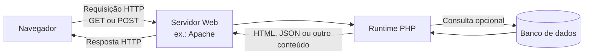

# Linguagens de programação back-end e PHP

Uma aplicação back-end precisa executar algum programa capaz de receber uma requisição, interpretar o que foi solicitado, aplicar regras e produzir uma resposta. Essa resposta pode ser uma página HTML, dados em JSON, um arquivo, uma imagem ou outro conteúdo adequado ao protocolo e ao tipo de aplicação.

O conteúdo desta aula usa o PHP como primeira linguagem para observar esse processo. Além da linguagem em si, a aula introduz diferenças entre compilação e interpretação, tipagem estática e dinâmica, funcionamento de servidores Web e uso de templates para produzir conteúdo dinâmico.

## O papel de uma linguagem no back-end

O navegador não executa o código PHP que está no servidor. Ele envia uma requisição HTTP e recebe apenas o resultado produzido pela aplicação.

Em um fluxo simples, podemos pensar assim:



O servidor Web recebe a requisição e pode servir arquivos estáticos diretamente ou encaminhar a execução para o ambiente PHP. O código PHP roda no servidor, pode acessar dados, executar regras e gerar a saída que será enviada ao navegador.

Essa ideia continua o modelo cliente-servidor estudado em [[05. Desenvolvimento Web Back-End/01. Arquitetura de software e cliente-servidor|Arquitetura de software e cliente-servidor]].

## PHP

**PHP** significa **PHP: Hypertext Preprocessor**. É uma linguagem de programação de propósito geral muito associada ao desenvolvimento Web no lado do servidor e pode ser incorporada diretamente em documentos HTML.

A anotação “PHP Hypertext Process” deve ser corrigida: o nome recursivo oficial é **PHP: Hypertext Preprocessor**.

O PHP ganhou relevância justamente porque permite produzir conteúdo dinâmico no servidor com pouca cerimônia. Um arquivo pode misturar HTML e trechos PHP, e o servidor envia ao cliente apenas o resultado da execução.

Por exemplo:

```php
<!DOCTYPE html>
<html lang="pt-BR">
<body>
    <h1><?php echo "Conteúdo gerado no servidor"; ?></h1>
</body>
</html>
```

O navegador não recebe a instrução `echo`. Ele recebe algo equivalente a:

```html
<h1>Conteúdo gerado no servidor</h1>
```

Essa distinção é fundamental para entender o que significa **server-side**: o código da aplicação é executado antes de a resposta chegar ao cliente.

## PHP e dados de formulários

A aula também relaciona PHP ao processamento de dados enviados por formulários. Em uma aplicação Web, o navegador pode enviar dados utilizando métodos HTTP como **GET** e **POST**, e o PHP disponibiliza mecanismos próprios para acessar esses dados.

Em PHP, é comum encontrar:

- `$_GET` para parâmetros recebidos pela URL em uma requisição GET;
- `$_POST` para dados enviados no corpo de uma requisição POST.

GET e POST não existem apenas para formulários, mas formulários HTML são um contexto introdutório muito comum para estudá-los.

## Linguagem de script e linguagem de programação

A aula contrapõe “script” e “linguagem de programação”, mas essa divisão precisa ser lida com cuidado. **PHP é uma linguagem de programação** e também é tradicionalmente chamada de **linguagem de script**.

O termo *script* costuma descrever mais o modo de uso e de execução do que uma categoria rígida de linguagem. Historicamente, scripts são programas executados por um ambiente ou interpretador para automatizar tarefas, controlar aplicações ou gerar resultados dinamicamente.

Portanto:

> “linguagem de script” não significa “não é linguagem de programação”.

PHP, JavaScript e Python são frequentemente chamados de linguagens de script em determinados contextos, mas são linguagens de programação completas.

## Compilado versus interpretado

Outro ponto da aula é a diferença entre linguagens compiladas e interpretadas.

Em um modelo **compilado**, o código-fonte passa por uma etapa de tradução antes da execução. Essa tradução pode gerar código de máquina ou alguma representação intermediária.

Em um modelo **interpretado**, um runtime lê e executa o programa por meio de um mecanismo de interpretação durante a execução.

A oposição, porém, não é absoluta. Linguagens modernas frequentemente usam modelos híbridos.

| Modelo | Fluxo simplificado | Exemplos de ideia |
| --- | --- | --- |
| **Compilação nativa** | fonte → compilador → código de máquina → execução | C e C++ em cenários tradicionais |
| **Interpretação** | fonte → runtime/intérprete → execução | modelo didático clássico de scripting |
| **Máquina virtual** | fonte → código intermediário → runtime/VM → execução | Java e C# |
| **JIT** | código intermediário ou fonte → compilação durante a execução | runtimes modernos de Java, .NET e JavaScript |

No caso de **C#**, por exemplo, o código normalmente é compilado para uma representação intermediária e executado pelo runtime .NET, que pode aplicar compilação JIT ou outras estratégias. Isso conecta este conteúdo ao que já foi estudado no [[00. Sintaxe Multilinguagem/00. Evolução das linguagens e genealogia do C (C, C++, Java, C#, JS, Python)|guia de evolução das linguagens]].

### Uma correção importante das anotações

A frase “no interpretado o usuário tem acesso ao código” não é uma regra. O fato de uma linguagem utilizar interpretação não determina se o código-fonte é visível ao usuário.

Em PHP, por exemplo, o código-fonte fica no servidor e o navegador recebe apenas a saída produzida.

Também não é correto dizer que erros são necessariamente “mais fáceis de checar” em linguagens interpretadas. Tanto compiladores quanto runtimes podem detectar erros em momentos diferentes: alguns antes da execução, outros apenas quando determinado caminho do programa é executado.

## Tipagem estática versus dinâmica

A tipagem responde a outra pergunta, diferente de compilação versus interpretação.

Em uma linguagem de **tipagem estática**, o tipo associado a uma variável ou expressão é verificado principalmente antes da execução. Em uma linguagem de **tipagem dinâmica**, o tipo dos valores é determinado e verificado durante a execução.

A comparação da aula pode ser refinada assim:

| Linguagem | Tipagem predominante |
| --- | --- |
| **PHP** | Dinâmica |
| **JavaScript** | Dinâmica |
| **C#** | Estática, com recursos específicos como `dynamic` |
| **Java** | Estática |

Isso se conecta diretamente a [[00. Sintaxe Multilinguagem/01. Variáveis, tipos e atribuição|Variáveis, tipos e atribuição]].

### “Forte” e “fraca” não são sinônimos de estática e dinâmica

É comum ouvir que PHP é “fracamente tipado” e C# é “fortemente tipado”, mas esses termos não são equivalentes a dinâmica e estática.

**Estática/dinâmica** descreve principalmente **quando** os tipos são verificados. Já **forte/fraca** costuma tentar descrever o quanto a linguagem permite conversões implícitas ou mistura valores de tipos diferentes, mas essa classificação varia bastante entre autores.

Para esta disciplina, a distinção mais segura é:

- PHP: **tipagem dinâmica**, com coerções automáticas em vários contextos;
- C#: **tipagem estática**, com regras mais rígidas de compatibilidade de tipos.

## Desempenho e portabilidade não são o mesmo eixo da tipagem

As anotações associam “desempenho” a compilação e “portabilidade” ao dinamismo. Existe alguma intuição histórica por trás disso, mas não é uma regra técnica.

Um programa compilado nativamente pode ter alto desempenho, mas uma linguagem com runtime também pode ser muito rápida. Da mesma forma, portabilidade depende do ecossistema, do runtime, das bibliotecas e da disponibilidade da plataforma — não de a linguagem ser dinamicamente tipada.

PHP é portátil porque seu runtime está disponível em vários sistemas operacionais. C# também pode ser portátil com .NET, apesar de ser estaticamente tipado.

## Servidor Web, PHP e banco de dados têm papéis diferentes

Nas anotações aparecem Apache, PHP e MySQL juntos. Eles costumam ser instalados como uma pilha, mas exercem responsabilidades diferentes.

| Componente | Papel |
| --- | --- |
| **Apache** | Servidor Web: recebe requisições HTTP e entrega respostas ou encaminha processamento |
| **PHP** | Linguagem e runtime usados para executar a lógica da aplicação |
| **MySQL** | Sistema gerenciador de banco de dados |
| **Navegador** | Cliente que envia requisições e interpreta a resposta |

O servidor Web não é apenas um “servidor de arquivos”. Ele pode servir arquivos estáticos, mas também encaminhar requisições para uma aplicação dinâmica.

Da mesma forma, a resposta não precisa ser somente HTML, JSON ou XML. Um servidor HTTP pode devolver muitos tipos de conteúdo, como já vimos em [[05. Desenvolvimento Web Back-End/01. Arquitetura de software e cliente-servidor|Arquitetura de software e cliente-servidor]].

## O que é WAMP?

A aula cita o WampServer. **WAMP** é um acrônimo usado para uma pilha de desenvolvimento formada por:

- **W**indows;
- **A**pache;
- **M**ySQL ou outro banco compatível da mesma família;
- **P**HP.

Isso significa que WAMP é especificamente associado ao Windows. Ele reúne componentes que poderiam ser instalados separadamente para facilitar a criação de um ambiente local de desenvolvimento PHP.

O importante conceitualmente não é decorar o instalador, mas entender que uma aplicação PHP precisa de um ambiente capaz de receber requisições Web e executar o código PHP.

## Templates Web

A PUC introduz **templates Web** como mecanismo para gerar conteúdo dinâmico. Um template é uma estrutura de página que contém HTML e pontos onde dados e lógica de apresentação serão inseridos.

A analogia mais simples é pensar em um formulário de mala direta: o layout é fixo, mas determinados campos são preenchidos conforme os dados de cada execução.

Um template pode usar:

- valores recuperados de banco de dados;
- estruturas de repetição;
- condições;
- componentes ou fragmentos reutilizáveis.

No PHP, a própria linguagem pode ser embutida dentro de HTML e atuar como mecanismo de template. Em ecossistemas mais estruturados, frameworks costumam oferecer mecanismos específicos para essa função. A aula antecipa que o ASP.NET Core MVC utilizará o **Razor** como mecanismo de views/templates.

### Quando o template começa a virar programa

A aula também chama atenção para um trade-off interessante: quanto mais lógica é colocada dentro do template, mais ele começa a se comportar como código de aplicação.

Um template inicialmente simples pode acabar contendo:

- loops;
- condicionais;
- acesso a dados;
- regras de negócio;
- chamadas a funções.

Quando isso acontece, a separação entre apresentação e lógica pode ficar confusa. O ponto arquitetural é preservar responsabilidades claras: templates devem concentrar principalmente a composição da interface, enquanto regras de negócio tendem a ficar em componentes próprios.

Essa preocupação se conecta à modularidade e ao acoplamento estudados em [[01. Programacao Modular/04. Programação orientada a objetos e acoplamento|Programação Modular]].

## Por que PHP foi tão usado na Web?

A aula destaca algumas características que ajudaram a popularizar PHP:

- pode ser executado em diferentes sistemas operacionais;
- tem curva de entrada relativamente simples;
- pode ser misturado diretamente com HTML;
- é software livre e de código aberto;
- possui ampla integração com bancos de dados;
- suporta programação procedural e orientação a objetos;
- foi construído historicamente em torno da geração de conteúdo Web dinâmico.

Esses pontos explicam por que PHP foi uma porta de entrada importante para desenvolvimento back-end e continua presente em muitos sistemas e plataformas.

## Pontos que costumam gerar confusão

- **PHP significa PHP: Hypertext Preprocessor**, não “PHP Hypertext Process”.
- **PHP é uma linguagem de programação**, mesmo quando chamada de linguagem de script.
- **Script versus programa não é a mesma oposição que interpretado versus compilado.**
- **Compilado versus interpretado não é uma divisão absoluta.** Java, C#, JavaScript moderno e outros runtimes usam estratégias híbridas.
- **O usuário não recebe o código PHP.** O PHP executa no servidor e o cliente recebe a saída.
- **Tipagem dinâmica não significa ausência de tipos.** Os valores continuam tendo tipos, mas a verificação ocorre principalmente em execução.
- **Tipagem estática/dinâmica e forte/fraca são eixos diferentes.**
- **Portabilidade não é consequência de tipagem dinâmica.**
- **Apache, PHP e MySQL não são a mesma coisa.** Servidor Web, runtime da linguagem e banco de dados exercem funções diferentes.
- **Um servidor Web não serve apenas arquivos.** Ele também pode encaminhar requisições para aplicações dinâmicas.
- **GET e POST são métodos HTTP**, não recursos exclusivos do PHP.
- **Templates não devem concentrar indiscriminadamente toda a lógica da aplicação.**

## Referências complementares

- PHP Documentation. [*PHP Manual*](https://www.php.net/manual/pt_BR/index.php).
