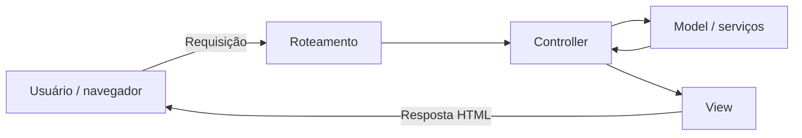
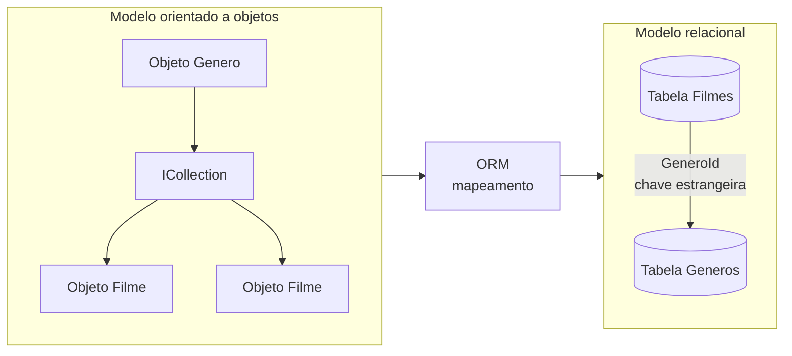
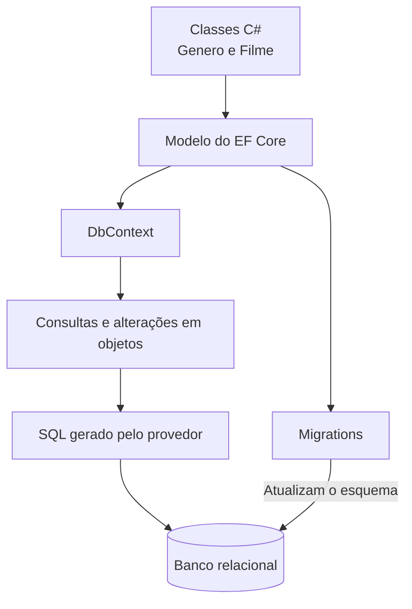
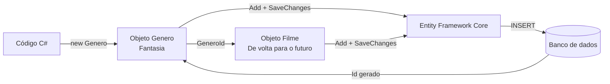

# Frameworks Web, MVC e mapeamento objeto-relacional

> **Contexto:** Este artigo organiza três ideias que aparecem juntas no desenvolvimento Web, mas cumprem papéis diferentes. Primeiro, **frameworks Web** fornecem infraestrutura e convenções reutilizáveis; depois, o **MVC** organiza responsabilidades entre Model, View e Controller; por fim, o **ORM** resolve a ponte entre objetos da aplicação e bancos relacionais, usando o Entity Framework Core como exemplo no ecossistema .NET.

Um **framework Web** é um conjunto organizado de componentes, convenções e mecanismos que fornece uma estrutura para desenvolver aplicações Web. Uma analogia útil é pensar em um esqueleto: em vez de começar cada sistema do zero, o framework já oferece partes recorrentes da arquitetura e define pontos nos quais o código da aplicação será encaixado.

A ideia central é que um framework não é apenas uma coleção de funções prontas. Ele influencia a estrutura da aplicação, a organização dos arquivos, a forma de receber requisições, o roteamento, a validação, a persistência, a apresentação e até a maneira como partes do sistema conversam entre si.

A palavra **framework** também aparece em negócios, estratégia e Service Design, mas com outro sentido. Nos dois contextos existe a ideia de uma estrutura reutilizável para não começar do zero: em Service Design, um framework pode organizar etapas, perguntas ou dimensões de análise; em software, organiza código, fluxo de execução e componentes. A diferença é que um framework de software também é **infraestrutura executável**: ele participa efetivamente da execução da aplicação, enquanto frameworks de negócios são, em geral, estruturas conceituais ou metodológicas para orientar análise e decisão.

## 1. Frameworks Web: estrutura reutilizável

### O que um framework Web oferece?

Desenvolver uma aplicação Web envolve problemas que aparecem repetidamente: interpretar URLs, validar dados, autenticar usuários, controlar sessões, acessar bancos de dados, gerar HTML, lidar com erros e testar comportamentos. Um framework tenta transformar parte desses problemas recorrentes em infraestrutura reutilizável.

Frameworks Web costumam oferecer recursos como:

- componentes de software reutilizáveis;
- estratégias de apresentação e controle;
- autenticação e validação;
- roteamento e manipulação de URLs;
- gerenciamento de sessão;
- integração com comunicação assíncrona;
- mecanismos de acesso e mapeamento de dados;
- geração de código repetitivo;
- suporte a testes;
- mecanismos de layout e templates.

Isso se conecta diretamente à ideia de **reutilização arquitetural**: o framework não reutiliza apenas pequenas funções, mas uma forma de organizar o sistema.

### Framework versus biblioteca

Uma forma útil de entender por que o framework “determina a estrutura” é compará-lo com uma biblioteca.

Com uma **biblioteca**, normalmente o seu código decide quando chamar a funcionalidade externa. Com um **framework**, grande parte do fluxo já é controlada pela infraestrutura, e o desenvolvedor fornece componentes que serão chamados nos pontos previstos por ela.

A diferença pode ser resumida assim:

> em uma biblioteca, seu código chama a biblioteca; em um framework, o framework frequentemente chama o seu código.

Essa característica explica por que frameworks costumam impor convenções de pastas, classes, nomes, ciclo de vida e pontos de extensão.

### Frameworks server-centric e browser-centric

Frameworks Web podem adotar abordagens mais centradas no servidor ou mais centradas no navegador.

#### Server-centric

Um framework **server-centric** concentra grande parte do processamento no servidor. O servidor recebe a requisição, executa controllers ou handlers, consulta dados e produz a resposta.

ASP.NET Core MVC, Django e Laravel são exemplos de frameworks usados frequentemente nesse tipo de arquitetura, embora todos possam participar de soluções híbridas.

#### Browser-centric

Um framework **browser-centric** coloca uma parcela maior da lógica de interface no navegador. O cliente gerencia componentes, estado e interações e conversa com o servidor principalmente para obter ou enviar dados.

Angular e Vue são exemplos de tecnologias orientadas fortemente à construção da aplicação no cliente.

Essa distinção não é absoluta. Aplicações modernas podem usar renderização no servidor, hidratação e componentes client-side no mesmo sistema, como visto em [[05. Desenvolvimento Web Back-End/03. Tipos de aplicações Web e estratégias de renderização|Tipos de aplicações Web e estratégias de renderização]].

### Frameworks horizontais e verticais

A distinção entre frameworks **horizontais** e **verticais** ajuda a responder uma pergunta prática: **o que exatamente está sendo reutilizado pelo framework?**

Um **framework horizontal** reutiliza infraestrutura técnica que aparece em muitos tipos de sistema, independentemente do domínio. Ele tende a resolver problemas como:

- roteamento;
- autenticação e autorização;
- validação;
- injeção de dependência;
- acesso a dados;
- geração de respostas;
- logging e tratamento de erros.

ASP.NET Core, Django e Laravel são exemplos de frameworks usados de forma horizontal: nenhum deles pressupõe, por si só, que a aplicação seja uma loja, um hospital ou um sistema acadêmico. Eles oferecem mecanismos genéricos sobre os quais o domínio será modelado.

Um **framework vertical**, por outro lado, já incorpora conhecimento de um domínio ou problema mais específico. Em vez de oferecer apenas infraestrutura, ele pode trazer conceitos, fluxos e regras recorrentes daquele contexto.

Exemplos:

| Contexto vertical | Conceitos que poderiam vir prontos |
| --- | --- |
| Comércio eletrônico | produto, catálogo, carrinho, pedido, checkout, estoque |
| CMS/publicação | conteúdo, página, autor, revisão, publicação |
| Saúde | paciente, atendimento, prontuário, prescrição |
| Educação | curso, matrícula, turma, avaliação |

A diferença fica mais clara comparando as perguntas que cada tipo de framework responde:

| Tipo | Pergunta principal | Consequência |
| --- | --- | --- |
| **Horizontal** | “Que infraestrutura técnica quase toda aplicação precisa?” | Dá mais liberdade para modelar o domínio, mas exige construir mais regras específicas da aplicação. |
| **Vertical** | “Que estruturas e regras se repetem dentro deste domínio?” | Pode acelerar muito o desenvolvimento, mas incorpora mais pressupostos sobre como aquele domínio deve funcionar. |

Essa distinção é útil para decisões de arquitetura porque ajuda a avaliar **quanto do problema já vem resolvido**, **quanto de liberdade a aplicação mantém** e **quanto ela ficará acoplada às abstrações do framework**.

Por exemplo, em uma aplicação de comércio eletrônico, usar apenas ASP.NET Core significa receber infraestrutura genérica e ainda precisar modelar `Produto`, `Pedido`, `Carrinho` e checkout. Já uma solução vertical de e-commerce poderia entregar parte dessas estruturas prontas, reduzindo trabalho inicial, mas também impondo decisões sobre como catálogo, pedido ou estoque são representados.

A classificação não é rígida. Um mesmo ecossistema pode usar um **núcleo horizontal** e acrescentar **módulos verticais** por cima dele. Por isso, a distinção não serve tanto para decorar categorias, mas para identificar **em que nível a reutilização está acontecendo: infraestrutura genérica ou conhecimento de domínio**.

### Benefícios e trade-offs

Frameworks podem acelerar o desenvolvimento porque já incorporam soluções amadurecidas para problemas recorrentes. Isso pode melhorar consistência, reutilização, validação e testabilidade.

Há, porém, um trade-off. Um framework mal compreendido ou mal utilizado pode gerar complexidade, dependências desnecessárias e até perda de desempenho. O fato de uma solução já existir no framework não significa que ela seja automaticamente adequada para qualquer contexto.

Frameworks amplamente usados e de código aberto também se beneficiam de uma comunidade maior testando, encontrando problemas e propondo correções. Isso não garante qualidade por si só, mas reduz a necessidade de uma equipe reconstruir e amadurecer toda a infraestrutura sozinha.

## 2. MVC: organização de responsabilidades

Depois de entender o framework como infraestrutura, o próximo passo é separar **como a aplicação organiza responsabilidades**. O MVC não é sinônimo de framework: ele é um padrão que pode ser implementado por diferentes frameworks.

### Model, View e Controller

O **MVC (Model-View-Controller)** é um padrão arquitetural que separa responsabilidades em três grupos principais.

- **Model:** representa dados, estado e regras relacionadas ao domínio da aplicação.
- **View:** representa a apresentação entregue ao usuário.
- **Controller:** recebe a entrada associada à requisição, coordena o processamento e decide qual resposta ou view deve ser produzida.

Um fluxo simplificado pode ser representado assim:



O MVC não significa que toda regra de negócio deva ficar dentro do Controller. A separação fica mais clara quando se distingue **regra de negócio** de **coordenação da requisição**.

Uma **regra de negócio** expressa algo que precisa continuar verdadeiro independentemente de a operação ter sido disparada por uma página Web, uma API, um teste automatizado ou outro tipo de interface. Exemplos: “uma conta não pode sacar mais do que o saldo disponível”, “um pedido cancelado não pode ser faturado” ou “uma matrícula só pode ser confirmada se houver vaga”.

Quando a regra pertence diretamente ao comportamento de uma entidade, ela pode ficar no próprio **Model de domínio**. Por exemplo:

```csharp
public class ContaBancaria
{
    public decimal Saldo { get; private set; }

    public void Sacar(decimal valor)
    {
        if (valor <= 0)
        {
            throw new ArgumentException(
                "O valor do saque deve ser positivo.");
        }

        if (valor > Saldo)
        {
            throw new InvalidOperationException(
                "Saldo insuficiente.");
        }

        Saldo -= valor;
    }
}
```

Nesse caso, a regra “não permitir saque maior que o saldo” está dentro de `ContaBancaria` porque é uma regra sobre **o que uma conta bancária pode ou não pode fazer**. O objeto protege o próprio estado: qualquer parte da aplicação que chamar `Sacar()` estará sujeita à mesma regra.

O Controller teria outra responsabilidade:

```csharp
public IActionResult Sacar(int id, decimal valor)
{
    var conta = _context.Contas.Find(id);

    if (conta is null)
    {
        return NotFound();
    }

    conta.Sacar(valor);
    _context.SaveChanges();

    return RedirectToAction("Details", new { id });
}
```

Aqui o Controller:

1. recebe os dados da requisição;
2. localiza a entidade necessária;
3. chama a operação que contém a regra de negócio;
4. coordena a persistência;
5. escolhe a resposta HTTP ou a próxima View.

O Controller **não deveria precisar conhecer a fórmula interna da regra**. Se ele próprio verificasse saldo, alterasse propriedades e repetisse essa lógica em várias actions, a regra ficaria espalhada pela camada Web.

### Model não significa apenas “classe com propriedades”

Em exemplos introdutórios, é comum encontrar Models que funcionam quase apenas como estruturas de dados:

```csharp
public class Pessoa
{
    public int Id { get; set; }
    public string Nome { get; set; } = string.Empty;
}
```

Mas o papel conceitual de Model no MVC é mais amplo. O Model pode representar **dados, estado e comportamento do domínio**. Uma entidade pode, portanto, possuir métodos que garantem regras e invariantes, em vez de expor todas as propriedades para alteração livre.

Isso também explica por que Model não é sinônimo de tabela. Uma tabela armazena dados; um objeto de domínio pode, além de guardar estado, definir **como esse estado pode mudar validamente**.

### Quando a regra não cabe em uma única entidade

Nem toda lógica de negócio pertence naturalmente a um único Model. Algumas operações coordenam várias entidades, repositórios ou serviços externos. Nesses casos, é comum existir um **serviço de aplicação** ou outra camada responsável pelo caso de uso.

Por exemplo, uma operação de compra pode precisar:

- validar um pedido;
- verificar estoque;
- calcular preço;
- registrar pagamento;
- atualizar diferentes entidades.

Colocar toda essa sequência dentro de um Controller faria a camada Web acumular regras que não dependem de HTTP. Um serviço pode coordenar o caso de uso, enquanto as entidades continuam protegendo suas próprias regras internas.

Um modelo mental útil é:

| Responsabilidade | Onde tende a ficar |
| --- | --- |
| Receber parâmetros HTTP, selecionar action e resposta | Controller |
| Regra que pertence a uma entidade | Model de domínio |
| Coordenação de um caso de uso envolvendo várias partes | Serviço/camada de aplicação |
| Persistência e rastreamento de entidades | EF Core / `DbContext` |
| Apresentação | View |

Assim, o Controller funciona mais como **orquestrador da requisição Web** do que como lugar central das regras de negócio. Ele conecta entrada HTTP, operações da aplicação e resposta, enquanto o comportamento do domínio permanece reutilizável fora da interface Web.

O [[05. Desenvolvimento Web Back-End/06. Model, validação e persistência no ASP.NET Core MVC#2. Model no ASP.NET Core MVC|artigo 06]] aprofunda a diferença entre Model, entidade persistente e DTO.

O ASP.NET Core MVC implementa esse padrão e oferece, entre outros recursos, roteamento, model binding, validação, injeção de dependência e a view engine Razor.

### Razor

**Razor** é a sintaxe de marcação usada pelo ASP.NET Core para combinar HTML com código C# dentro de templates e views. Em projetos MVC, esses arquivos normalmente usam a extensão `.cshtml`.

O HTML continua sendo escrito normalmente, e o caractere `@` indica a transição para uma expressão ou bloco C#. Assim, uma view pode inserir valores do Model, executar condições, percorrer coleções e decidir quais trechos de HTML serão produzidos.

No fluxo do ASP.NET Core MVC, o **Controller** seleciona uma View e fornece os dados necessários; o **Razor** processa a view no servidor e gera o HTML final; o navegador recebe esse HTML pronto. Portanto, o cliente não recebe o código C# nem as instruções Razor usadas para produzir a página.

Essa distinção é importante: **Razor não é o MVC inteiro e não é um framework front-end como React ou Vue**. Ele ocupa principalmente a camada de apresentação, funcionando como a sintaxe usada para construir views dinâmicas no ecossistema .NET.

A lógica é semelhante aos templates discutidos no [[05. Desenvolvimento Web Back-End/04. Linguagens de programação back-end e PHP#8. Templates Web e PHP|artigo 04]]: uma estrutura HTML é combinada com dados e lógica de apresentação para produzir uma resposta dinâmica. A sintaxe Razor também aparece em Razor Pages e Blazor, mas o modelo de execução desses recursos não é necessariamente o mesmo do MVC server-side.

Como Razor tende a aparecer diretamente em projetos ASP.NET Core MVC com Views, o [[05. Desenvolvimento Web Back-End/05.1. Bônus - Razor na prática no ASP.NET Core MVC#1. Onde Razor entra no projeto|artigo bônus de Razor na prática]] mostra a estrutura de arquivos `.cshtml`, `@model`, `Model`, condicionais, `foreach`, Tag Helpers, formulários, validação, layouts e partial views.

### Roteamento

**Roteamento** é o mecanismo que associa uma URL e outras características da requisição a uma parte da aplicação capaz de processá-la.

Por exemplo, uma requisição como:

`GET /filmes/42`

pode ser encaminhada a uma ação responsável por buscar o filme de identificador 42.

O roteamento é a ponte entre o endereço solicitado pelo cliente e o código que deve responder àquela solicitação. Frameworks Web normalmente fornecem infraestrutura para declarar e interpretar essas rotas.

### Scaffolding e geração de CRUD

A criação automática de uma estrutura inicial de código costuma aparecer como **scaffolding**.

Scaffolding usa informações de um modelo e templates do framework para gerar uma estrutura inicial de código. Em uma aplicação CRUD, por exemplo, ele pode gerar controllers, views ou páginas com operações para:

- criar;
- consultar;
- editar;
- excluir registros.

Isso acelera trabalho repetitivo, mas o código gerado continua sendo código da aplicação e precisa ser entendido, validado e adaptado. Scaffolding não substitui decisões de arquitetura nem conhecimento do domínio.

## 3. ORM: ponte entre objetos e banco relacional

MVC organiza responsabilidades da aplicação; ORM resolve outro problema: **como representar no banco relacional os objetos manipulados pelo código**. As duas ideias podem aparecer na mesma aplicação, mas não são a mesma coisa.

### O que é mapeamento objeto-relacional

A sigla correta é **ORM (Object-Relational Mapping)**, ou **mapeamento objeto-relacional**.

O problema que o ORM tenta reduzir nasce do fato de que código orientado a objetos e bancos relacionais representam informação de maneiras diferentes.

No código C#, podemos pensar em objetos, classes, referências e coleções. No banco relacional, trabalhamos com tabelas, linhas, colunas, chaves primárias e chaves estrangeiras.

Esse desencaixe costuma ser chamado de **impedância objeto-relacional**.



O ORM funciona como uma camada de tradução entre esses dois modelos.

### ORM não significa “não existe SQL”

A frase “com ORM não preciso usar SQL” precisa de uma ressalva.

O desenvolvedor pode deixar de escrever manualmente grande parte do SQL cotidiano, porque o ORM transforma operações feitas no código em consultas e comandos para o banco. Entretanto, o banco continua sendo relacional e SQL continua existindo por baixo dessa abstração.

Conhecer SQL continua importante para:

- compreender o que o ORM está gerando;
- investigar problemas de desempenho;
- escrever consultas complexas quando necessário;
- entender chaves, relacionamentos, índices e restrições;
- diagnosticar erros no banco.

ORM reduz a quantidade de SQL escrito diretamente; ele não elimina o modelo relacional.

## 4. Entity Framework Core: ORM no ecossistema .NET

**Entity Framework Core (EF Core)** é o ORM moderno do ecossistema .NET. Ele implementa, de forma concreta, a ponte apresentada na seção anterior: classes e objetos C# são mapeados para estruturas persistidas em bancos de dados.

O exemplo usa duas entidades, **Genero** e **Filme**, com uma relação de um gênero para muitos filmes.

### Relacionamento 1:N: gênero e filme

O exemplo abaixo organiza de forma direta uma relação 1:N entre `Genero` e `Filme`.

```csharp
public class Genero
{
    public int Id { get; set; }

    // Descricao é uma string não anulável.
    // string.Empty é uma string real, mas vazia ("").
    // Assim, a propriedade já começa com um valor não nulo.
    public string Descricao { get; set; } = string.Empty;

    // A coleção também já nasce com um valor real: uma lista vazia.
    // Isso significa "zero filmes neste momento", e não "a coleção não existe".
    // Por isso, é possível chamar Filmes.Add(...) sem testar null antes.
    public ICollection<Filme> Filmes { get; set; } = new List<Filme>();
}

public class Filme
{
    public int Id { get; set; }

    // Mesmo raciocínio de Descricao:
    // Titulo começa como uma string válida e vazia, não como null.
    public string Titulo { get; set; } = string.Empty;

    // GeneroId é a chave estrangeira.
    // Como int é um tipo de valor, seu valor padrão é 0 até receber outro valor.
    public int GeneroId { get; set; }

    // Genero é uma propriedade de navegação não anulável.
    // Ela ainda não está recebendo um objeto Genero neste ponto do código;
    // esse valor pode ser atribuído pela aplicação ou materializado pelo EF Core.
    //
    // null! significa:
    // - null: o valor inicial realmente é nulo;
    // - !: suprime o aviso do compilador sobre nullable reference types.
    //
    // O ! não cria um Genero e não impede NullReferenceException
    // se a propriedade for acessada antes de receber um objeto.
    public Genero Genero { get; set; } = null!;
}
```

A diferença central é que `string.Empty` e `new List<Filme>()` criam **valores reais e não nulos** desde a inicialização. Já `null!` continua sendo `null` naquele momento; o operador `!` apenas informa ao compilador que o código assume a responsabilidade de garantir que a propriedade seja preenchida antes do uso.

A propriedade `GeneroId` representa a chave estrangeira no lado “muitos”. A propriedade `Genero` permite navegar do filme para seu gênero. Já `ICollection<Filme>` representa a coleção de filmes associada a um gênero.

No EF Core, esse relacionamento pode ser descoberto por convenção. Neste exemplo, a propriedade de navegação `Genero` e a propriedade `GeneroId` seguem um padrão que o EF Core consegue reconhecer como relacionamento e chave estrangeira correspondente. Por isso, o atributo `[ForeignKey]` não é obrigatório aqui.

#### Qual é a convenção que o EF Core está reconhecendo?

Considere estas duas propriedades de `Filme`:

```csharp
public int GeneroId { get; set; }
public Genero Genero { get; set; } = null!;
```

O EF Core consegue associá-las porque o nome da chave estrangeira segue o padrão:

`<nome da propriedade de navegação> + Id`

Neste caso:

`Genero` + `Id` → `GeneroId`

A leitura é:

- `Genero` é a **propriedade de navegação** para um objeto da classe `Genero`;
- `GeneroId` é a propriedade que guarda a **chave estrangeira** correspondente;
- essa chave estrangeira aponta para a chave primária da entidade relacionada, normalmente `Genero.Id`.

Portanto, estas duas coisas não são equivalentes:

```csharp
GeneroId
```

é uma **propriedade de `Filme`** que armazena o valor da chave estrangeira.

Já:

```csharp
Genero.Id
```

é uma **expressão de acesso**: significa “pegue o objeto `Genero` associado e leia a propriedade `Id` dele”.

Uma forma de visualizar é:

```text
Genero.Id
   ↑
   │ chave primária da entidade Genero
   │
Filme.GeneroId
   ↑
   │ chave estrangeira armazenada em Filme
   │
Filme.Genero
   ↑
propriedade de navegação
```

Como `GeneroId` segue a convenção esperada, isto costuma ser suficiente:

```csharp
public int GeneroId { get; set; }
public Genero Genero { get; set; } = null!;
```

Sem precisar escrever:

```csharp
[ForeignKey(nameof(GeneroId))]
public Genero Genero { get; set; } = null!;
```

Se a propriedade tiver um nome que não segue a convenção, por exemplo:

```csharp
public int CodigoDoGenero { get; set; }
public Genero Genero { get; set; } = null!;
```

o vínculo pode precisar ser declarado explicitamente, por atributo ou pela Fluent API:

```csharp
[ForeignKey(nameof(CodigoDoGenero))]
public Genero Genero { get; set; } = null!;
```

No exemplo completo mais adiante, `[ForeignKey(nameof(GeneroId))]` aparece apenas para deixar o vínculo **explícito no código**; ele é redundante neste caso convencional. Em outros ORMs, o mesmo relacionamento pode ser declarado de formas diferentes. A comparação entre EF Core e ORMs do ecossistema JavaScript/TypeScript está em [[00. Sintaxe Multilinguagem/17. ORM e mapeamento objeto-relacional em C# e JavaScript-TypeScript#9. Convenção versus configuração explícita|ORM: convenção versus configuração explícita]].

#### O que é `ICollection<Filme>`?

`ICollection<T>` é uma interface de coleção do .NET.

No exemplo, `ICollection<Filme>` significa que um objeto `Genero` pode manter uma coleção de objetos `Filme`. No EF Core, essa propriedade funciona como uma **propriedade de navegação de coleção**, representando o lado “muitos” de uma relação 1:N.

Há **uma única propriedade de coleção** em `Genero`: `Filmes`. Ela pode conter **zero, um ou vários objetos `Filme`**. Portanto, quando um diagrama mostra dois objetos `Filme`, isso representa apenas dois elementos possíveis dentro da mesma coleção — não duas propriedades `ICollection<Filme>`.

Ela não é a chave estrangeira. A chave estrangeira está em `Filme.GeneroId`. A coleção é a forma orientada a objetos de navegar pelo relacionamento.

Essa distinção conecta diretamente o conteúdo com [[02. Modelagem de Dados/11. Mapeamento de relacionamentos#6. Mapeamento de relacionamento 1:N|Mapeamento de relacionamento 1:N]].

### `DbContext`: contexto de trabalho com o banco

`DbContext` é a classe central do Entity Framework Core para representar uma **sessão de trabalho da aplicação com o modelo persistente**. Ele não é o banco de dados, não é o Controller e não é simplesmente uma conexão SQL. É o objeto que o EF Core usa para reunir, durante uma unidade de trabalho, tudo o que precisa saber para consultar entidades, acompanhar mudanças nelas e persistir essas mudanças.

A forma mais útil de entendê-lo é separar quatro responsabilidades:

| Responsabilidade | O que o `DbContext` faz |
| --- | --- |
| **Conhecer o modelo** | Sabe quais entidades fazem parte daquele contexto e como elas se relacionam. |
| **Servir de ponto de entrada para consultas** | Expõe conjuntos como `DbSet<Filme>` e coordena a execução das consultas por meio do provider. |
| **Rastrear entidades** | Mantém registro, por padrão, dos objetos carregados e do estado deles, como inalterado, adicionado, modificado ou removido. |
| **Coordenar a persistência** | Em `SaveChanges()`, verifica as alterações rastreadas e pede ao provider que gere e execute os comandos necessários no banco. |

Isso significa que o `DbContext` fica **entre o código orientado a objetos e a infraestrutura de persistência**. A aplicação manipula objetos C#; o contexto acompanha esses objetos e coordena sua tradução para operações do banco.

#### `DbContext`, `AppDbContext` e `_context` não são a mesma coisa

Há três níveis que aparecem com nomes parecidos:

| Nome | O que representa |
| --- | --- |
| `DbContext` | Classe base fornecida pelo EF Core. |
| `AppDbContext` ou `ApplicationDbContext` | Classe criada pela aplicação e herdada de `DbContext`, na qual são definidos os conjuntos de entidades e a configuração necessária. |
| `_context` | Uma instância concreta daquele contexto sendo usada por uma parte da aplicação, como um Controller. |

Por isso, quando aparece:

```csharp
private readonly AppDbContext _context;
```

`AppDbContext` é o **tipo**; `_context` é a **referência para uma instância** desse tipo.

#### O que acontece em uma consulta e em um `SaveChanges()`

Considere:

```csharp
var filme = _context.Filmes.Find(42);

filme.Titulo = "Novo título";

_context.SaveChanges();
```

O fluxo é:

1. `_context.Filmes` dá acesso ao conjunto de entidades `Filme` conhecido pelo contexto;
2. `Find(42)` faz o EF Core localizar a entidade de chave 42, usando o banco quando necessário;
3. o objeto `Filme` retornado passa a ser conhecido pelo mecanismo de rastreamento do contexto;
4. alterar `filme.Titulo` modifica o objeto C# em memória;
5. `SaveChanges()` compara o estado rastreado, identifica que aquela entidade foi modificada e coordena a geração de um `UPDATE`;
6. o provider traduz essa operação para o dialeto do banco utilizado e o banco executa o comando.

O `DbContext` não decidiu **por que** o filme deveria ser alterado nem **qual resposta HTTP** deveria ser enviada. Essas decisões pertencem ao fluxo da aplicação. O contexto apenas coordenou a leitura, o acompanhamento do objeto e sua persistência.

#### Por que ele não é o Controller?

No MVC, o **Controller coordena a requisição**: recebe a entrada, decide quais operações da aplicação precisam acontecer e escolhe a resposta. O `DbContext` tem uma responsabilidade bem mais específica: **coordenar o trabalho do EF Core com dados persistentes**.

Um fluxo simplificado é:

`requisição → Controller → DbContext / serviços de dados → banco`

e, na volta:

`banco → DbContext / serviços de dados → Controller → View ou resposta`

Portanto, o Controller pode **usar** um `DbContext`, mas o `DbContext` não substitui o Controller.

#### O que o `DbContext` também não é

- **Não é o banco de dados:** os dados persistentes continuam no banco.
- **Não é a connection string:** a connection string é apenas uma configuração usada para localizar e acessar o banco.
- **Não é uma conexão permanentemente aberta:** o EF Core pode abrir e fechar conexões conforme necessário por meio do provider.
- **Não é um `DbSet<T>`:** o contexto pode expor vários `DbSet<T>`, um para cada tipo de entidade relevante.
- **Não deveria concentrar regras de negócio:** seu papel principal é coordenar o modelo e a persistência.

Assim, a expressão **contexto de dados** faz sentido porque aquela instância reúne o estado necessário para uma unidade de trabalho: quais entidades estão sendo manipuladas, como elas se relacionam, quais mudanças ocorreram e como essas mudanças serão persistidas.

#### `DbSet<T>`: conjunto de entidades

Um `DbSet<T>` é o **ponto de acesso tipado que um `DbContext` oferece para trabalhar com entidades de um determinado tipo**. Se o contexto possui `DbSet<Filme> Filmes`, isso significa que o EF Core conhece entidades `Filme` dentro daquele modelo e permite iniciar consultas e operações de persistência sobre elas.

Um contexto para o exemplo poderia ser:

```csharp
using Microsoft.EntityFrameworkCore;

public class AppDbContext : DbContext
{
    public AppDbContext(DbContextOptions<AppDbContext> options)
        : base(options)
    {
    }

    public DbSet<Genero> Generos => Set<Genero>();
    public DbSet<Filme> Filmes => Set<Filme>();
}
```

Nesse código:

- `DbSet<Genero>` é o ponto de acesso às entidades `Genero`;
- `DbSet<Filme>` é o ponto de acesso às entidades `Filme`;
- `Generos` e `Filmes` são propriedades do `AppDbContext`;
- o tipo entre `< >` informa **qual entidade** aquele conjunto representa.

Uma forma útil de ler:

```csharp
_context.Filmes
```

é:

> “quero trabalhar, dentro deste contexto, com o conjunto de entidades do tipo `Filme`”.

Isso não significa que todos os filmes existentes no banco estejam carregados em memória.

##### `DbSet<T>` não é uma lista nem um estado do React

A comparação com um `state` do React pode parecer intuitiva porque ambos lidam com dados, mas tecnicamente representam coisas diferentes.

No React:

```javascript
const [filmes, setFilmes] = useState([]);
```

`filmes` é um **valor de estado mantido em memória** pelo componente naquele momento.

Já no EF Core:

```csharp
_context.Filmes
```

`Filmes` é um **conjunto consultável de entidades** conhecido pelo `DbContext`. Ele funciona mais como uma porta de entrada tipada para consultar ou marcar operações sobre entidades `Filme` do que como um recipiente com todos os registros carregados.

Por exemplo:

```csharp
var filmes = _context.Filmes.ToList();
```

Aqui, `_context.Filmes` define a origem da consulta. A chamada a `ToList()` faz a consulta ser executada e **materializa** o resultado como objetos `Filme` em memória.

O modelo mental é:

`DbSet<Filme> → consulta → banco → objetos Filme em memória`

e não:

`DbSet<Filme> = todos os filmes já armazenados em memória`.

##### Consultar, adicionar e remover

O mesmo `DbSet<T>` também oferece operações para trabalhar com entidades daquele tipo:

```csharp
var filme = _context.Filmes.Find(42);

_context.Filmes.Add(novoFilme);
_context.Filmes.Remove(filme);

_context.SaveChanges();
```

Essas chamadas possuem papéis diferentes:

- `Find(42)` procura uma entidade pela chave, podendo primeiro verificar entidades já rastreadas pelo contexto antes de consultar o banco;
- `Add(novoFilme)` informa ao contexto que uma nova entidade deve ser inserida;
- `Remove(filme)` informa que uma entidade deve ser removida;
- `SaveChanges()` é o momento em que o `DbContext` coordena a persistência dessas mudanças no banco.

Portanto, `Add` e `Remove` não significam, por si só, que o SQL já foi executado naquele instante. Elas alteram o **estado rastreado** das entidades; a persistência é coordenada posteriormente pelo `DbContext`.

##### `DbSet<T>` não é literalmente a tabela

É tentador dizer que `DbSet<Filme>` “é a tabela Filmes”, porque em um mapeamento simples uma entidade `Filme` pode corresponder a uma tabela `Filmes`. Mas essa equivalência é apenas um modelo mental inicial.

O `DbSet<Filme>` representa o **conjunto de entidades `Filme` no modelo do EF Core**. O provider e o mapeamento determinam como essas entidades correspondem à estrutura persistida. Por isso:

- `DbSet<T>` pertence ao **modelo de objetos do EF Core**;
- a tabela pertence ao **modelo relacional do banco**;
- o ORM faz a ponte entre os dois.

A relação entre as peças fica assim:

`DbContext → DbSet<Filme> → consulta/operação sobre Filme → provider → banco`

O `DbContext` coordena a unidade de trabalho; o `DbSet<T>` delimita **com qual tipo de entidade** aquela operação começa.

#### Configuração do contexto: `OnConfiguring` e injeção de dependência

`OnConfiguring(DbContextOptionsBuilder optionsBuilder)` pode configurar o provedor e a conexão diretamente dentro do contexto.

Em aplicações ASP.NET Core modernas, também é comum configurar o contexto por **injeção de dependência** no `Program.cs`, deixando a conexão fora da classe:

```csharp
builder.Services.AddDbContext<AppDbContext>(options =>
    options.UseSqlServer(
        builder.Configuration.GetConnectionString("DefaultConnection")));
```

Os dois mecanismos existem. A configuração via injeção de dependência costuma separar melhor a infraestrutura da classe de contexto.

A configuração por injeção de dependência — incluindo `ApplicationDbContext`, `DbContextOptions<TContext>`, registro com `AddDbContext`, `Program.cs` e a forma como o contexto chega ao Controller — é aprofundada no [[05. Desenvolvimento Web Back-End/06. Model, validação e persistência no ASP.NET Core MVC#5. Injeção de dependência: como o contexto chega ao Controller|artigo 06 — injeção de dependência e configuração do contexto]].

### Migrations: evolução do esquema

Uma **migration** registra uma mudança no modelo que precisa ser refletida no esquema do banco.

Se a aplicação começa com `Genero` e depois ganha `Filme`, ou se uma propriedade nova é adicionada, o EF Core pode comparar o estado do modelo com o histórico de migrations e gerar operações para transformar o banco.

No fluxo da CLI do .NET:

```bash
dotnet ef migrations add Inicial
dotnet ef database update
```

O primeiro comando cria arquivos de migration. O segundo aplica as migrations pendentes ao banco.

A migration pode gerar operações equivalentes a DDL, como criação ou alteração de tabelas, chaves e colunas. Durante o uso normal da aplicação, inserções, atualizações e exclusões geradas pelo ORM correspondem a operações de manipulação de dados.

### Fluxo conceitual do EF Core



A ideia importante é não confundir as camadas: as classes representam o domínio no código; o EF Core mantém o mapeamento; o provedor gera comandos adequados ao banco; e o banco continua armazenando tabelas e relacionamentos.

## 5. Exemplo completo: gênero e filme com EF Core

O exemplo reúne o fluxo completo de ponta a ponta: criar as entidades `Genero` e `Filme`, representar o relacionamento 1:N, configurar um `DbContext`, gerar uma migration, criar o banco e inserir registros.

O código abaixo consolida entidades, relacionamento, contexto, configuração e persistência em uma única sequência.

### Código completo em um único bloco

```csharp
using System;
using System.Collections.Generic;
using System.ComponentModel.DataAnnotations;
using System.ComponentModel.DataAnnotations.Schema;
using Microsoft.EntityFrameworkCore;

// -------------------------
// Entidade Genero
// -------------------------
public class Genero
{
    [Key]
    public int Id { get; set; }

    public string Descricao { get; set; } = string.Empty;

    // Um gênero pode possuir vários filmes.
    public ICollection<Filme> Filmes { get; set; } = new List<Filme>();
}

// -------------------------
// Entidade Filme
// -------------------------
public class Filme
{
    [Key]
    public int Id { get; set; }

    public string Titulo { get; set; } = string.Empty;

    // Chave estrangeira armazenada na tabela de filmes.
    public int GeneroId { get; set; }

    [ForeignKey(nameof(GeneroId))]
    public Genero Genero { get; set; } = null!;
}

// -------------------------
// Contexto da aplicação
// -------------------------
public class ApplicationContext : DbContext
{
    public DbSet<Genero> Generos => Set<Genero>();
    public DbSet<Filme> Filmes => Set<Filme>();

    // protected:
    // o método faz parte da API de herança de DbContext.
    // Ele pode ser acessado pela própria classe e por classes derivadas,
    // mas não é um método público para qualquer parte da aplicação chamar.
    //
    // override:
    // DbContext já possui um método virtual chamado OnConfiguring.
    // Aqui, ApplicationContext fornece sua própria implementação desse método.
    //
    // void:
    // o método não devolve um valor. Ele configura o objeto optionsBuilder
    // recebido como parâmetro.
    //
    // OnConfiguring:
    // é um ponto de configuração do ciclo de vida do DbContext.
    // O EF Core o chama ao preparar as opções daquele contexto.
    protected override void OnConfiguring(
        // DbContextOptionsBuilder é o TIPO do parâmetro.
        // Ele reúne as opções que estão sendo construídas para o contexto.
        //
        // optionsBuilder é o NOME da variável recebida pelo método.
        // É por meio dela que configuramos provider, connection string
        // e outras opções do EF Core.
        DbContextOptionsBuilder optionsBuilder)
    {
        // UseSqlServer(...) informa que este contexto usará
        // o provider do SQL Server e recebe a connection string.
        // Este é um exemplo com SQL Server Express no Windows.
        optionsBuilder.UseSqlServer(
            @"Server=.\SQLEXPRESS;
              Database=ExemploOrm;
              Trusted_Connection=True;
              TrustServerCertificate=True;");
    }
}

// -------------------------
// Programa
// -------------------------
public class Program
{
    public static void Main()
    {
        using var contexto = new ApplicationContext();

        var genero = new Genero
        {
            Descricao = "Fantasia"
        };

        contexto.Generos.Add(genero);

        // O INSERT é enviado ao banco.
        // Depois disso, o Id gerado pelo banco passa
        // a estar disponível no objeto genero.
        contexto.SaveChanges();

        var filme = new Filme
        {
            Titulo = "De volta para o futuro",
            GeneroId = genero.Id
        };

        contexto.Filmes.Add(filme);
        contexto.SaveChanges();

        Console.WriteLine(
            $"Filme cadastrado: {filme.Titulo} — gênero: {genero.Descricao}");
    }
}
```

### O que acontece nesse código?

O fluxo pode ser lido em quatro etapas.

1. **As classes modelam os objetos.** `Genero` e `Filme` são classes C# comuns. A propriedade `GeneroId` representa a chave estrangeira, enquanto `Genero` e `Filmes` são propriedades de navegação.
2. **O `ApplicationContext` apresenta essas entidades ao EF Core.** Os dois `DbSet<T>` indicam quais conjuntos de entidades fazem parte do modelo persistente.
3. **A migration transforma o modelo em estrutura de banco.** A partir das classes e do mapeamento, o EF Core consegue gerar operações para criar as tabelas, colunas, chave primária e chave estrangeira.
4. **A aplicação manipula objetos e o ORM traduz as operações.** O código adiciona um objeto `Genero`, salva, recebe seu `Id`, cria um `Filme` relacionado e salva novamente. O EF Core produz o SQL necessário para persistir essas alterações.



### Migration antes da primeira execução

No Visual Studio/Windows, os comandos podem ser executados no **Package Manager Console**:

```powershell
Add-Migration Inicial
Update-Database
```

O primeiro comando cria os arquivos que descrevem a alteração do esquema. O segundo aplica essa migration e cria ou atualiza o banco.

No macOS, o fluxo equivalente pela CLI é:

```bash
dotnet ef migrations add Inicial
dotnet ef database update
```

### Pacotes necessários

Para um projeto atual usando SQL Server pela CLI:

```bash
dotnet add package Microsoft.EntityFrameworkCore.SqlServer
dotnet add package Microsoft.EntityFrameworkCore.Design
dotnet tool install --global dotnet-ef
```

No Visual Studio/Windows, o fluxo pode usar as ferramentas do Entity Framework pelo Package Manager Console. No macOS, a combinação `Microsoft.EntityFrameworkCore.Design` + `dotnet-ef` é a forma equivalente para executar migrations pela linha de comando.

### O detalhe mais importante do exemplo

O ponto pedagógico do vídeo não é simplesmente “criar duas tabelas”. É mostrar a mudança de abstração:

> o desenvolvedor trabalha principalmente com **objetos C#**; o ORM traduz essas operações para o **modelo relacional**.

Quando o código executa:

```csharp
contexto.Generos.Add(genero);
contexto.SaveChanges();
```

a aplicação não contém um `INSERT INTO Generos ...` escrito manualmente. O EF Core observa a entidade adicionada, utiliza o mapeamento e gera o comando adequado para o banco.

Isso explica a ideia de reduzir a **impedância objeto-relacional**: o desenvolvedor continua pensando em objetos e relacionamentos do domínio, enquanto o ORM faz a ponte com tabelas, chaves e comandos SQL.

## 6. Como as três partes se conectam

O artigo pode ser resumido como uma sequência de responsabilidades:

| Camada de raciocínio | Pergunta principal | Exemplo estudado |
| --- | --- | --- |
| **Framework Web** | Que infraestrutura e convenções sustentam a aplicação? | ASP.NET Core |
| **MVC** | Como separar entrada, apresentação e dados/regras? | Model, View e Controller |
| **ORM** | Como objetos do código se relacionam com tabelas do banco? | Entity Framework Core |

Essas partes se complementam sem serem equivalentes. ASP.NET Core pode fornecer a infraestrutura da aplicação; MVC pode organizar o fluxo entre requisição, controller, model e view; EF Core pode cuidar da persistência. O [[05. Desenvolvimento Web Back-End/06. Model, validação e persistência no ASP.NET Core MVC|artigo 06]] aprofunda justamente a integração prática entre Model, validação, `ApplicationDbContext`, injeção de dependência e persistência.

## 7. Tutorial: configurar EF Core no Visual Studio Code no macOS

No macOS, o caminho mais simples para praticar os conceitos deste artigo é usar **Visual Studio Code + C# Dev Kit + .NET SDK + EF Core + SQLite**. Essa combinação evita depender de SQL Server Express ou LocalDB, que são caminhos específicos do Windows, e mantém os conceitos centrais de entidades, `DbContext`, `DbSet<T>`, migrations e persistência.

O objetivo deste tutorial é terminar com um projeto C# que:

1. abre normalmente no Visual Studio Code;
2. reconhece e executa código C#;
3. usa Entity Framework Core;
4. cria um banco SQLite local;
5. gera e aplica migrations pela CLI do .NET.

### 7.1. Instalar o suporte a C# no Visual Studio Code

Abra o Visual Studio Code e acesse **Extensions** com `⇧⌘X`. Procure por **C# Dev Kit**, publicado pela Microsoft, e instale a extensão.

O C# Dev Kit adiciona suporte mais completo a projetos .NET, incluindo navegação pela solução, IntelliSense, execução, depuração e integração com o SDK.

Se o .NET SDK ainda não estiver instalado, abra a Command Palette com `⇧⌘P`, procure por **Welcome: Open Walkthrough** e abra **Get Started with C# Dev Kit**. Em **Set up your environment**, escolha **Install .NET SDK**.

Depois da instalação, feche e abra novamente o terminal integrado do VS Code e verifique:

```bash
dotnet --info
```

O comando precisa exibir informações sobre o SDK instalado. Para desenvolver aplicações, é necessário o **SDK**, e não apenas o runtime.

### 7.2. Criar um projeto de teste

O exemplo deste artigo pode ser praticado em uma aplicação de console simples.

Pela Command Palette (`⇧⌘P`):

1. execute **.NET: New Project**;
2. escolha **Console App**;
3. dê ao projeto um nome como `ExemploOrm`;
4. escolha a pasta em que ele será criado.

Também é possível fazer a mesma operação pelo terminal integrado:

```bash
dotnet new console -n ExemploOrm
cd ExemploOrm
code .
```

A partir deste ponto, os próximos comandos devem ser executados **dentro da pasta do projeto**, onde está o arquivo `.csproj`.

### 7.3. Instalar as ferramentas do EF Core

O comando `dotnet ef` é uma ferramenta da CLI do Entity Framework Core usada para operações de desenvolvimento, como criar migrations e atualizar o banco.

Instale a ferramenta global:

```bash
dotnet tool install --global dotnet-ef
```

Se ela já estiver instalada e precisar ser atualizada:

```bash
dotnet tool update --global dotnet-ef
```

Verifique:

```bash
dotnet ef
```

Em macOS, ferramentas globais do .NET ficam normalmente em `$HOME/.dotnet/tools`. O SDK costuma adicionar esse diretório ao `PATH`. Se `dotnet ef` não for encontrado mesmo após a instalação, feche e reabra o terminal; se necessário, confirme se esse diretório está no `PATH`.

### 7.4. Instalar os pacotes do projeto

Para usar EF Core com SQLite, adicione dois pacotes NuGet ao projeto:

```bash
dotnet add package Microsoft.EntityFrameworkCore.Sqlite
dotnet add package Microsoft.EntityFrameworkCore.Design
```

Os dois cumprem papéis diferentes:

| Pacote | Papel |
| --- | --- |
| `Microsoft.EntityFrameworkCore.Sqlite` | Provider que permite ao EF Core trabalhar com SQLite. |
| `Microsoft.EntityFrameworkCore.Design` | Recursos necessários para operações de desenvolvimento, incluindo migrations pela CLI. |

O EF Core não é instalado como um “programa separado” dentro do VS Code. Os pacotes são dependências do **projeto .NET**, enquanto o VS Code funciona como editor e ambiente de desenvolvimento.

### 7.5. Configurar o `DbContext` para SQLite

O exemplo completo anterior usa `UseSqlServer(...)`. Para o caminho local no Mac, troque essa configuração por SQLite:

```csharp
public class ApplicationContext : DbContext
{
    public DbSet<Genero> Generos => Set<Genero>();
    public DbSet<Filme> Filmes => Set<Filme>();

    protected override void OnConfiguring(
        DbContextOptionsBuilder optionsBuilder)
    {
        optionsBuilder.UseSqlite(
            "Data Source=exemplo.db");
    }
}
```

A leitura dessa configuração é:

- `UseSqlite(...)` seleciona o provider SQLite;
- `Data Source=exemplo.db` informa o arquivo que será usado como banco;
- quando o banco for criado, `exemplo.db` aparecerá dentro da estrutura local do projeto.

O restante da lógica de `DbContext`, `DbSet<T>`, entidades, relacionamentos e `SaveChanges()` continua conceitualmente igual ao exemplo com SQL Server.

### 7.6. Criar a primeira migration

Com as classes e o contexto definidos, execute:

```bash
dotnet ef migrations add Inicial
```

Esse comando compara o modelo conhecido pelo EF Core e cria arquivos que descrevem como o esquema correspondente deve ser construído.

Depois, aplique a migration:

```bash
dotnet ef database update
```

Após esses comandos, o projeto normalmente passa a conter:

```text
ExemploOrm/
├── Migrations/
├── exemplo.db
├── ExemploOrm.csproj
└── Program.cs
```

A pasta `Migrations` contém o histórico das alterações de esquema. O arquivo `exemplo.db` é o banco SQLite local.

### 7.7. Executar a aplicação

No terminal integrado:

```bash
dotnet run
```

Se o código usar `Add(...)` e `SaveChanges()`, o EF Core utilizará o `DbContext`, o provider SQLite e o banco `exemplo.db` para persistir as entidades.

O fluxo completo fica:

```text
VS Code
  ↓
projeto C#
  ↓
DbContext / DbSet<T>
  ↓
Entity Framework Core
  ↓
provider SQLite
  ↓
exemplo.db
```

O Visual Studio Code não substitui nenhuma dessas partes: ele é o ambiente em que o projeto é editado e executado. O EF Core continua sendo a camada de ORM, e o SQLite continua sendo o banco.

### 7.8. Se o projeto precisar usar SQL Server

Se for obrigatório reproduzir um ambiente com SQL Server, o provider muda:

```bash
dotnet add package Microsoft.EntityFrameworkCore.SqlServer
dotnet add package Microsoft.EntityFrameworkCore.Design
```

No Visual Studio Code, a extensão oficial **SQL Server (mssql)** da Microsoft permite conectar, explorar objetos e executar consultas em SQL Server no macOS. Ela pode ser instalada em **Extensions** (`⇧⌘X`) procurando por `mssql`.

Para executar um SQL Server local no Mac, a extensão MSSQL também oferece uma experiência de **Local SQL Server Container** quando Docker Desktop, ou equivalente, está executando contêineres Linux. Esse caminho adiciona mais infraestrutura e não é necessário para compreender os fundamentos de ORM; para os exemplos deste artigo, SQLite é suficiente.

### 7.9. Checklist de instalação

Ao terminar, estes comandos devem funcionar no terminal integrado do VS Code:

```bash
dotnet --info
dotnet ef
dotnet build
dotnet run
```

E o projeto deve possuir:

- C# Dev Kit instalado no VS Code;
- .NET SDK reconhecido;
- provider do EF Core instalado;
- `Microsoft.EntityFrameworkCore.Design`;
- `dotnet-ef`;
- um `DbContext` configurado;
- uma migration criada;
- um banco local atualizado.

### Referências para instalação

- [.NET no macOS — Microsoft Learn](https://learn.microsoft.com/pt-br/dotnet/core/install/macos)
- [C# no Visual Studio Code — VS Code](https://code.visualstudio.com/docs/csharp/get-started)
- [Ferramentas do EF Core pela CLI — Microsoft Learn](https://learn.microsoft.com/pt-br/ef/core/cli/dotnet)
- [Provider SQLite do EF Core — Microsoft Learn](https://learn.microsoft.com/en-us/ef/core/providers/sqlite/)
- [Extensão MSSQL para Visual Studio Code — Microsoft Learn](https://learn.microsoft.com/pt-br/sql/tools/visual-studio-code-extensions/mssql/mssql-extension-visual-studio-code)


## Pontos que costumam gerar confusão

- **Framework não é apenas uma biblioteca de funções.** Ele também define estrutura, fluxo e pontos de extensão.
- **Framework de software e framework de Service Design compartilham a ideia de estrutura reutilizável, mas um é infraestrutura executável e o outro é principalmente metodológico.**
- **Server-centric e browser-centric não são categorias absolutas.** Aplicações modernas podem combinar os dois lados.
- **Framework horizontal resolve problemas amplos; vertical incorpora necessidades de um domínio específico.**
- **MVC separa responsabilidades em Model, View e Controller.**
- **Razor é o nome correto do mecanismo de views/templates do ASP.NET Core.**
- **Scaffolding gera código inicial, não uma solução final pronta para produção.**
- **A sigla correta é ORM, não OMR.**
- **ORM reduz a necessidade de escrever SQL manualmente, mas não elimina SQL nem o modelo relacional.**
- **`ICollection<Filme>` é uma coleção de navegação, não uma chave estrangeira.**
- **`GeneroId` representa a FK no exemplo; `Genero` é a navegação para a entidade relacionada.**
- **`DbContext` coordena o trabalho do EF Core com o banco.**
- **`DbSet<T>` representa um conjunto de entidades do modelo; não deve ser confundido literalmente com a tabela física.**
- **Migrations registram mudanças no modelo e as aplicam ao esquema do banco.**
- **EF Core funciona no macOS; SSMS não.**
- **No macOS, a CLI `dotnet ef` substitui o fluxo de Package Manager Console mostrado em muitos tutoriais Windows.**

## Referências complementares

- Microsoft Learn. [*Visão geral do ASP.NET Core MVC*](https://learn.microsoft.com/pt-br/aspnet/core/mvc/overview).
- Microsoft Learn. [*Instalando o Entity Framework Core*](https://learn.microsoft.com/pt-br/ef/core/get-started/overview/install).
- Microsoft Learn. [*Introdução aos relacionamentos no Entity Framework Core*](https://learn.microsoft.com/pt-br/ef/core/modeling/relationships).
- Microsoft Learn. [*Relações um para muitos no Entity Framework Core*](https://learn.microsoft.com/pt-br/ef/core/modeling/relationships/one-to-many).
- Microsoft Learn. [*Instalar .NET no macOS*](https://learn.microsoft.com/pt-br/dotnet/core/install/macos).
- Microsoft Learn. [*Extensão MSSQL para Visual Studio Code*](https://learn.microsoft.com/pt-br/sql/tools/visual-studio-code-extensions/mssql/mssql-extension-visual-studio-code).
- Microsoft Learn. [*Contêiner local do SQL Server*](https://learn.microsoft.com/pt-br/sql/tools/visual-studio-code-extensions/mssql/mssql-local-container).

