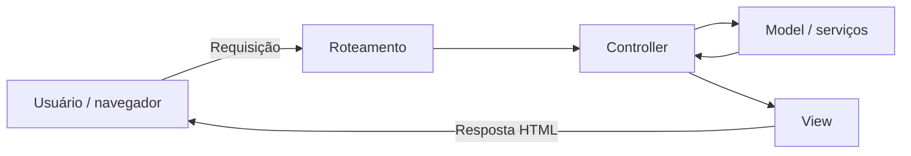
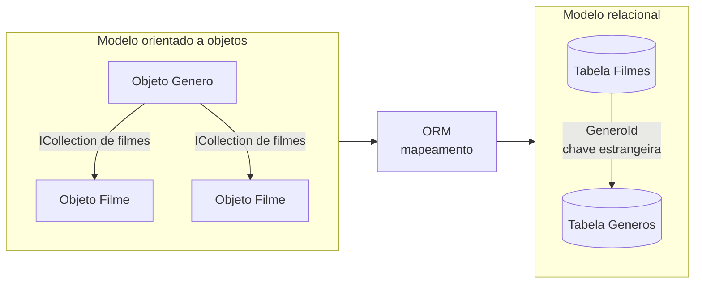
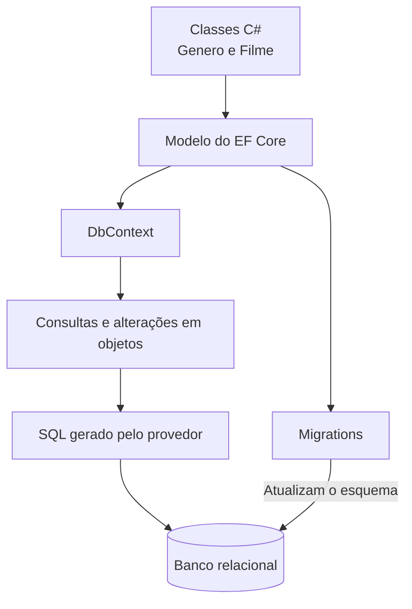

# Frameworks Web, MVC e mapeamento objeto-relacional

Um **framework Web** é um conjunto organizado de componentes, convenções e mecanismos que fornece uma estrutura para desenvolver aplicações Web. A analogia do “esqueleto” usada na aula funciona bem: em vez de começar cada sistema do zero, o framework já oferece partes recorrentes da arquitetura e define pontos nos quais o código da aplicação será encaixado.

A ideia central deste conteúdo é que um framework não é apenas uma coleção de funções prontas. Ele influencia a estrutura da aplicação, a organização dos arquivos, a forma de receber requisições, o roteamento, a validação, a persistência, a apresentação e até a maneira como partes do sistema conversam entre si.

## O que um framework Web oferece?

Desenvolver uma aplicação Web envolve problemas que aparecem repetidamente: interpretar URLs, validar dados, autenticar usuários, controlar sessões, acessar bancos de dados, gerar HTML, lidar com erros e testar comportamentos. Um framework tenta transformar parte desses problemas recorrentes em infraestrutura reutilizável.

Entre os recursos citados na aula estão:

- componentes de software reutilizáveis;
- estratégias de apresentação e controle;
- autenticação e validação;
- roteamento e manipulação de URLs;
- gerenciamento de sessão;
- integração com comunicação assíncrona;
- mecanismos de acesso e mapeamento de dados;
- geração de código repetitivo;
- suporte a testes;
- mecanismos de layout e templates.

Isso se conecta diretamente à ideia de **reutilização arquitetural**: o framework não reutiliza apenas pequenas funções, mas uma forma de organizar o sistema.

## Framework versus biblioteca

Uma forma útil de entender por que o framework “determina a estrutura” é compará-lo com uma biblioteca.

Com uma **biblioteca**, normalmente o seu código decide quando chamar a funcionalidade externa. Com um **framework**, grande parte do fluxo já é controlada pela infraestrutura, e o desenvolvedor fornece componentes que serão chamados nos pontos previstos por ela.

A diferença pode ser resumida assim:

> em uma biblioteca, seu código chama a biblioteca; em um framework, o framework frequentemente chama o seu código.

Essa característica explica por que frameworks costumam impor convenções de pastas, classes, nomes, ciclo de vida e pontos de extensão.

## Frameworks server-centric e browser-centric

A aula separa frameworks em abordagens centradas no servidor e no navegador.

### Server-centric

Um framework **server-centric** concentra grande parte do processamento no servidor. O servidor recebe a requisição, executa controllers ou handlers, consulta dados e produz a resposta.

ASP.NET Core MVC, Django e Laravel são exemplos de frameworks usados frequentemente nesse tipo de arquitetura, embora todos possam participar de soluções híbridas.

### Browser-centric

Um framework **browser-centric** coloca uma parcela maior da lógica de interface no navegador. O cliente gerencia componentes, estado e interações e conversa com o servidor principalmente para obter ou enviar dados.

Angular e Vue são exemplos de tecnologias orientadas fortemente à construção da aplicação no cliente.

Essa distinção não é absoluta. Aplicações modernas podem usar renderização no servidor, hidratação e componentes client-side no mesmo sistema, como visto em [[05. Desenvolvimento Web Back-End/03. Tipos de aplicações Web e estratégias de renderização|Tipos de aplicações Web e estratégias de renderização]].

## Frameworks horizontais e verticais

A disciplina também apresenta a distinção entre frameworks **horizontais** e **verticais**.

Um framework horizontal resolve problemas que aparecem em muitos domínios diferentes. Autenticação, roteamento, validação, persistência e geração de páginas são necessidades comuns tanto em uma loja quanto em um sistema acadêmico.

Um framework vertical é voltado a um domínio ou problema mais específico e já incorpora conceitos daquele contexto. Um framework especializado em comércio eletrônico, por exemplo, poderia trazer estruturas prontas para catálogo, carrinho, pedidos e checkout.

Essa classificação é útil didaticamente, mas não é uma taxonomia universal e rígida. Um mesmo ecossistema pode combinar uma infraestrutura horizontal com módulos verticais específicos.

## Relação com frameworks de negócios e Service Design

A palavra **framework** também aparece em negócios, estratégia e Service Design, mas não significa exatamente a mesma coisa.

Existe uma semelhança abstrata: nos dois casos, um framework fornece uma estrutura reutilizável para não começar o raciocínio do zero. Um framework de Service Design pode organizar etapas, perguntas ou dimensões de análise; um framework de software organiza código, fluxo de execução e componentes.

A diferença principal é que um framework de software é também **infraestrutura executável**. Ele participa efetivamente da execução da aplicação. Um framework de negócios é, em geral, uma estrutura conceitual ou metodológica para orientar análise e decisão.

## Benefícios e trade-offs

A aula destaca que frameworks aceleram o desenvolvimento porque já incorporam soluções amadurecidas para problemas recorrentes. Isso pode melhorar consistência, reutilização, validação e testabilidade.

Há, porém, um trade-off. Um framework mal compreendido ou mal utilizado pode gerar complexidade, dependências desnecessárias e até perda de desempenho. O fato de uma solução já existir no framework não significa que ela seja automaticamente adequada para qualquer contexto.

Frameworks amplamente usados e de código aberto também se beneficiam de uma comunidade maior testando, encontrando problemas e propondo correções. Isso não garante qualidade por si só, mas reduz a necessidade de uma equipe reconstruir e amadurecer toda a infraestrutura sozinha.

## MVC: Model, View e Controller

Um dos padrões arquiteturais citados na aula é o **MVC (Model-View-Controller)**. Ele separa responsabilidades em três grupos principais.

- **Model:** representa dados, estado e regras relacionadas ao domínio da aplicação.
- **View:** representa a apresentação entregue ao usuário.
- **Controller:** recebe a entrada associada à requisição, coordena o processamento e decide qual resposta ou view deve ser produzida.

Um fluxo simplificado pode ser representado assim:



O MVC não significa que toda regra de negócio deva ficar dentro do controller. Em aplicações bem organizadas, controllers tendem a coordenar o fluxo enquanto regras mais complexas ficam em modelos, serviços ou outras camadas.

O ASP.NET Core MVC implementa esse padrão e oferece, entre outros recursos, roteamento, model binding, validação, injeção de dependência e a view engine Razor.

## Razor

**Razor** é o mecanismo de templates/views usado no ecossistema ASP.NET Core.

Razor permite combinar HTML com expressões C# para produzir conteúdo dinâmico no servidor. A ideia é semelhante à discussão de templates do [[05. Desenvolvimento Web Back-End/04. Linguagens de programação back-end e PHP|artigo 04]], mas aplicada ao ecossistema .NET.

## Roteamento

**Roteamento** é o mecanismo que associa uma URL e outras características da requisição a uma parte da aplicação capaz de processá-la.

Por exemplo, uma requisição como:

`GET /filmes/42`

pode ser encaminhada a uma ação responsável por buscar o filme de identificador 42.

O roteamento é a ponte entre o endereço solicitado pelo cliente e o código que deve responder àquela solicitação. Frameworks Web normalmente fornecem infraestrutura para declarar e interpretar essas rotas.

## Scaffolding e geração de CRUD

A “criação automática de código” citada na aula costuma aparecer como **scaffolding**.

Scaffolding usa informações de um modelo e templates do framework para gerar uma estrutura inicial de código. Em uma aplicação CRUD, por exemplo, ele pode gerar controllers, views ou páginas com operações para:

- criar;
- consultar;
- editar;
- excluir registros.

Isso acelera trabalho repetitivo, mas o código gerado continua sendo código da aplicação e precisa ser entendido, validado e adaptado. Scaffolding não substitui decisões de arquitetura nem conhecimento do domínio.

## ORM: mapeamento objeto-relacional

A sigla correta é **ORM (Object-Relational Mapping)**, ou **mapeamento objeto-relacional**.

O problema que o ORM tenta reduzir nasce do fato de que código orientado a objetos e bancos relacionais representam informação de maneiras diferentes.

No código C#, podemos pensar em objetos, classes, referências e coleções. No banco relacional, trabalhamos com tabelas, linhas, colunas, chaves primárias e chaves estrangeiras.

Esse desencaixe costuma ser chamado de **impedância objeto-relacional**.



O ORM funciona como uma camada de tradução entre esses dois modelos.

## ORM não significa “não existe SQL”

A frase “com ORM não preciso usar SQL” precisa de uma ressalva.

O desenvolvedor pode deixar de escrever manualmente grande parte do SQL cotidiano, porque o ORM transforma operações feitas no código em consultas e comandos para o banco. Entretanto, o banco continua sendo relacional e SQL continua existindo por baixo dessa abstração.

Conhecer SQL continua importante para:

- compreender o que o ORM está gerando;
- investigar problemas de desempenho;
- escrever consultas complexas quando necessário;
- entender chaves, relacionamentos, índices e restrições;
- diagnosticar erros no banco.

ORM reduz a quantidade de SQL escrito diretamente; ele não elimina o modelo relacional.

## Entity Framework Core

**Entity Framework Core (EF Core)** é o ORM moderno do ecossistema .NET. Ele permite mapear classes C# para estruturas persistidas em bancos de dados e trabalhar com essas entidades por meio de objetos e consultas no código.

Na aula, o exemplo usa duas entidades: **Genero** e **Filme**, com uma relação de um gênero para muitos filmes.

### Modelo reconstruído a partir das anotações

O exemplo abaixo não reproduz o tutorial do professor passo a passo; ele reorganiza o mesmo modelo conceitual de forma mais direta.

```csharp
public class Genero
{
    public int Id { get; set; }
    public string Descricao { get; set; } = string.Empty;

    public ICollection<Filme> Filmes { get; set; } = new List<Filme>();
}

public class Filme
{
    public int Id { get; set; }
    public string Titulo { get; set; } = string.Empty;

    public int GeneroId { get; set; }
    public Genero Genero { get; set; } = null!;
}
```

A propriedade `GeneroId` representa a chave estrangeira no lado “muitos”. A propriedade `Genero` permite navegar do filme para seu gênero. Já `ICollection<Filme>` representa a coleção de filmes associada a um gênero.

No EF Core, esse relacionamento pode ser descoberto por convenção. Por isso, um atributo `[ForeignKey]` não é obrigatoriamente necessário quando os nomes seguem as convenções reconhecidas pelo framework.

## O que é `ICollection<Filme>`?

`ICollection<T>` é uma interface de coleção do .NET.

No exemplo, `ICollection<Filme>` significa que um objeto `Genero` pode manter uma coleção de objetos `Filme`. No EF Core, essa propriedade funciona como uma **propriedade de navegação de coleção**, representando o lado “muitos” de uma relação 1:N.

Ela não é a chave estrangeira. A chave estrangeira está em `Filme.GeneroId`. A coleção é a forma orientada a objetos de navegar pelo relacionamento.

Essa distinção conecta diretamente o conteúdo com [[02. Modelagem de Dados/00. Modelagem de Dados - Resumo|Modelagem de Dados]].

## O que é `DbContext`?

`DbContext` é a classe central do EF Core para coordenar a interação entre a aplicação e o banco de dados.

Uma classe de contexto normalmente:

- conhece quais tipos de entidade fazem parte do modelo;
- mantém informações sobre configuração da conexão e do provedor;
- rastreia alterações feitas nos objetos;
- executa consultas;
- coordena a persistência das mudanças com `SaveChanges()`.

Uma analogia útil é pensar no `DbContext` como uma **mesa de trabalho entre o código e o banco**. Durante aquela unidade de trabalho, a aplicação consulta entidades, altera objetos e, quando decide salvar, o contexto transforma as mudanças em operações para o banco.

## O que é `DbSet<T>`?

Um `DbSet<T>` representa o conjunto de entidades de determinado tipo que o contexto consegue consultar e persistir.

Um contexto para o exemplo poderia ser:

```csharp
using Microsoft.EntityFrameworkCore;

public class AppDbContext : DbContext
{
    public AppDbContext(DbContextOptions<AppDbContext> options)
        : base(options)
    {
    }

    public DbSet<Genero> Generos => Set<Genero>();
    public DbSet<Filme> Filmes => Set<Filme>();
}
```

É tentador dizer que `DbSet<Filme>` “é a tabela Filmes”, mas isso é uma simplificação. Ele representa o conjunto de entidades `Filme` no modelo do EF Core; o mapeamento desse conjunto para uma tabela faz parte da configuração do ORM.

## `OnConfiguring` e configuração do contexto

Nas anotações, o professor utiliza `OnConfiguring(DbContextOptionsBuilder optionsBuilder)`. Esse método pode configurar o provedor e a conexão diretamente dentro do contexto.

Em aplicações ASP.NET Core modernas, também é comum configurar o contexto por **injeção de dependência** no `Program.cs`, deixando a conexão fora da classe:

```csharp
builder.Services.AddDbContext<AppDbContext>(options =>
    options.UseSqlServer(
        builder.Configuration.GetConnectionString("DefaultConnection")));
```

Os dois mecanismos existem. A configuração via injeção de dependência costuma separar melhor a infraestrutura da classe de contexto.

## Migrations

Uma **migration** registra uma mudança no modelo que precisa ser refletida no esquema do banco.

Se a aplicação começa com `Genero` e depois ganha `Filme`, ou se uma propriedade nova é adicionada, o EF Core pode comparar o estado do modelo com o histórico de migrations e gerar operações para transformar o banco.

No fluxo da CLI do .NET:

```bash
dotnet ef migrations add Inicial
dotnet ef database update
```

O primeiro comando cria arquivos de migration. O segundo aplica as migrations pendentes ao banco.

A migration pode gerar operações equivalentes a DDL, como criação ou alteração de tabelas, chaves e colunas. Durante o uso normal da aplicação, inserções, atualizações e exclusões geradas pelo ORM correspondem a operações de manipulação de dados.

## Fluxo conceitual do EF Core



A ideia importante é não confundir as camadas: as classes representam o domínio no código; o EF Core mantém o mapeamento; o provedor gera comandos adequados ao banco; e o banco continua armazenando tabelas e relacionamentos.

## Usando EF Core no macOS

### O que funciona

O .NET possui suporte a macOS e as ferramentas de linha de comando do EF Core, incluindo `dotnet ef`, funcionam em Windows, Linux e macOS.

Os pacotes dependem do banco utilizado. Para SQL Server, por exemplo:

```bash
dotnet add package Microsoft.EntityFrameworkCore.SqlServer
dotnet add package Microsoft.EntityFrameworkCore.Design
dotnet tool install --global dotnet-ef
```

O pacote `Microsoft.EntityFrameworkCore.Tools` visto em alguns tutoriais está associado principalmente ao **Package Manager Console do Visual Studio no Windows**. No macOS, o caminho mais direto é usar a CLI `dotnet ef` com o pacote `Microsoft.EntityFrameworkCore.Design`.

### E o SQL Server Management Studio?

O **SQL Server Management Studio (SSMS)** é somente para Windows. Portanto, o passo do professor que usa SSMS não pode ser reproduzido literalmente no macOS.

No Mac, uma alternativa atual da Microsoft é o **Visual Studio Code com a extensão MSSQL**, que suporta macOS Intel e Apple Silicon e permite conectar, consultar e explorar bancos SQL Server.

Se for necessário rodar SQL Server localmente, a própria extensão MSSQL oferece uma experiência de contêiner local em macOS quando Docker Desktop, ou equivalente, está executando contêineres Linux.

### Caminho mais simples para estudar ORM no Mac

Se o objetivo imediato for entender EF Core, classes, `DbContext`, `DbSet`, relacionamentos e migrations, SQLite reduz bastante a infraestrutura porque funciona localmente e de forma multiplataforma:

```bash
dotnet add package Microsoft.EntityFrameworkCore.Sqlite
dotnet add package Microsoft.EntityFrameworkCore.Design
dotnet tool install --global dotnet-ef
```

O modelo C# e os conceitos de ORM permanecem praticamente os mesmos. O que muda principalmente é o **provider** usado pelo EF Core.

Se a atividade da PUC exigir especificamente SQL Server, então vale manter `Microsoft.EntityFrameworkCore.SqlServer` e conectar a um SQL Server em contêiner, remoto ou em nuvem.

## Pontos que costumam gerar confusão

- **Framework não é apenas uma biblioteca de funções.** Ele também define estrutura, fluxo e pontos de extensão.
- **Framework de software e framework de Service Design compartilham a ideia de estrutura reutilizável, mas um é infraestrutura executável e o outro é principalmente metodológico.**
- **Server-centric e browser-centric não são categorias absolutas.** Aplicações modernas podem combinar os dois lados.
- **Framework horizontal resolve problemas amplos; vertical incorpora necessidades de um domínio específico.**
- **MVC separa responsabilidades em Model, View e Controller.**
- **Razor é o nome correto do mecanismo de views/templates do ASP.NET Core.**
- **Scaffolding gera código inicial, não uma solução final pronta para produção.**
- **A sigla correta é ORM, não OMR.**
- **ORM reduz a necessidade de escrever SQL manualmente, mas não elimina SQL nem o modelo relacional.**
- **`ICollection<Filme>` é uma coleção de navegação, não uma chave estrangeira.**
- **`GeneroId` representa a FK no exemplo; `Genero` é a navegação para a entidade relacionada.**
- **`DbContext` coordena o trabalho do EF Core com o banco.**
- **`DbSet<T>` representa um conjunto de entidades do modelo; não deve ser confundido literalmente com a tabela física.**
- **Migrations registram mudanças no modelo e as aplicam ao esquema do banco.**
- **EF Core funciona no macOS; SSMS não.**
- **No macOS, a CLI `dotnet ef` substitui o fluxo de Package Manager Console mostrado em muitos tutoriais Windows.**

## Referências complementares

- Microsoft Learn. [*Visão geral do ASP.NET Core MVC*](https://learn.microsoft.com/pt-br/aspnet/core/mvc/overview).
- Microsoft Learn. [*Instalando o Entity Framework Core*](https://learn.microsoft.com/pt-br/ef/core/get-started/overview/install).
- Microsoft Learn. [*Introdução aos relacionamentos no Entity Framework Core*](https://learn.microsoft.com/pt-br/ef/core/modeling/relationships).
- Microsoft Learn. [*Relações um para muitos no Entity Framework Core*](https://learn.microsoft.com/pt-br/ef/core/modeling/relationships/one-to-many).
- Microsoft Learn. [*Instalar .NET no macOS*](https://learn.microsoft.com/pt-br/dotnet/core/install/macos).
- Microsoft Learn. [*Extensão MSSQL para Visual Studio Code*](https://learn.microsoft.com/pt-br/sql/tools/visual-studio-code-extensions/mssql/mssql-extension-visual-studio-code).
- Microsoft Learn. [*Contêiner local do SQL Server*](https://learn.microsoft.com/pt-br/sql/tools/visual-studio-code-extensions/mssql/mssql-local-container).
