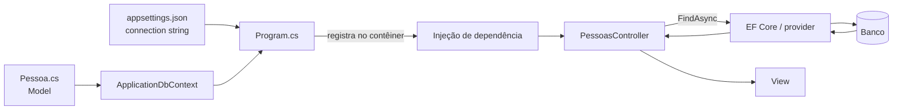

# Model, validação e persistência no ASP.NET Core MVC

> **Contexto:** O [[05. Desenvolvimento Web Back-End/05. Frameworks Web, MVC e mapeamento objeto-relacional#4. Entity Framework Core: ORM no ecossistema .NET|artigo 05]] definiu ORM, Entity Framework Core, `DbContext`, `DbSet<T>` e migrations. Este artigo evita repetir essas definições e se concentra em outra pergunta: **como essas peças são integradas dentro de uma aplicação ASP.NET Core MVC?** O foco passa pelo Model, Data Annotations, `ApplicationDbContext`, injeção de dependência, configuração em `Program.cs`, connection string e uso do contexto dentro de um Controller.

A sequência central é:

`Model → ApplicationDbContext → registro em Program.cs → injeção no Controller → consulta/persistência → resposta MVC`

## 1. Mapa do fluxo

Antes do código, vale separar o papel de cada peça:

| Peça | Papel neste artigo |
| --- | --- |
| `Pessoa` | Model usado pela aplicação e, neste exemplo, também mapeado pelo EF Core. |
| Data Annotations | Metadados aplicados ao Model para apresentação, validação e alguns aspectos de mapeamento. |
| `ApplicationDbContext` | Classe da aplicação que especializa `DbContext` e declara o modelo persistente. |
| `DbSet<Pessoa>` | Ponto de acesso tipado às entidades `Pessoa`. |
| `Program.cs` | Registra o contexto no contêiner de injeção de dependência e configura o provider. |
| Connection string | Informa ao provider como localizar e acessar o banco. |
| Controller | Recebe uma instância do contexto e a usa para coordenar operações da requisição. |
| Migration | Mantém o esquema do banco coerente com a evolução do modelo persistente. |

A distinção mais importante é de responsabilidade: **o Controller coordena a requisição; o `DbContext` coordena o trabalho do EF Core com entidades persistentes**. Um pode usar o outro, mas não cumprem o mesmo papel.

## 2. Model no ASP.NET Core MVC

No MVC, **Model** representa dados, estado e regras manipulados pela aplicação. Um exemplo simples:

```csharp
public class Pessoa
{
    public int Id { get; set; }
    public string Nome { get; set; } = string.Empty;
    public string Email { get; set; } = string.Empty;
}
```

Essa classe é primeiro um **tipo C#**. Ela não nasce sendo uma tabela. Quando o Entity Framework Core passa a incluí-la no modelo persistente, suas propriedades podem ser mapeadas para uma estrutura relacional.

Também não é correto usar **Model** como sinônimo universal de “entidade do banco”. Em uma aplicação maior podem coexistir:

- entidades persistentes;
- modelos de domínio;
- DTOs;
- view models.

Neste exemplo, `Pessoa` é simples o suficiente para atuar ao mesmo tempo como Model do MVC e entidade persistida.

### DTO: transportar dados não é o mesmo que persistir uma entidade

Um **DTO (Data Transfer Object)** é criado principalmente para transportar os dados necessários a uma operação ou fronteira do sistema.

```csharp
public class CriarPessoaDto
{
    public string Nome { get; set; } = string.Empty;
    public string Email { get; set; } = string.Empty;
}
```

Um DTO pode conter apenas parte dos dados de uma entidade e não precisa ser mapeado pelo EF Core. A distinção é:

- **entidade persistente:** representa algo que o mecanismo de persistência acompanha e armazena;
- **DTO:** representa os dados que precisam atravessar uma operação ou fronteira.

## 3. Data Annotations: metadados e validação

Antes de olhar os colchetes, é importante separar quatro coisas que aparecem juntas no código: **classe, propriedade, tipo e Data Annotation**.

A classe funciona como um **modelo de uma entidade ou objeto da aplicação**. Ela reúne os dados e comportamentos que pertencem àquele conceito. Dentro dela, cada propriedade representa uma informação que o objeto possui, e o tipo da propriedade define que espécie de valor pode ser armazenada ali.

Por exemplo:

```csharp
public class Pessoa
{
    // Id é uma propriedade do tipo int.
    public int Id { get; set; }

    // Nome é uma propriedade do tipo string.
    public string Nome { get; set; } = string.Empty;

    // Email também é uma propriedade do tipo string.
    public string Email { get; set; } = string.Empty;
}
```

A leitura pode ser organizada assim:

| Elemento | Exemplo | O que define |
| --- | --- | --- |
| **Classe** | `Pessoa` | Qual entidade ou objeto está sendo modelado. |
| **Propriedade** | `Nome` | Qual informação aquela entidade possui. |
| **Tipo** | `string` | Que tipo de valor aquela propriedade aceita. |
| **Data Annotation** | `[Required]` | Regra ou metadado adicional sobre a classe ou propriedade. |

Portanto, `string` e `[Required]` não fazem a mesma coisa. O tipo responde **“que valor pode existir aqui?”**; a Data Annotation acrescenta informações como **“esse valor é obrigatório?”**, **“qual o tamanho máximo?”**, **“como deve ser exibido?”** ou **“essa propriedade é uma chave?”**.

### Atributo do C# não é a mesma coisa que propriedade da classe

Em C#, aquilo que aparece entre colchetes, como:

```csharp
[Required]
[MaxLength(100)]
```

é tecnicamente um **Attribute**. Data Annotations são um conjunto de Attributes usados para acrescentar metadados.

Já `Id`, `Nome` e `Email` são **propriedades** da classe.

Essa distinção ajuda porque, em português, a palavra “atributo” também pode ser usada informalmente para falar de dados de um objeto. No código C#, porém:

- `Nome` é uma **propriedade**;
- `[Required]` é um **Attribute/Data Annotation** aplicado à propriedade.

### Data Annotations acrescentam parâmetros e metadados

**Data Annotations** são Attributes .NET colocados sobre classes ou propriedades. Frameworks como ASP.NET Core MVC e EF Core podem interpretar esses metadados para finalidades diferentes.

Veja o mesmo Model agora com Data Annotations:

```csharp
using System.ComponentModel.DataAnnotations;

public class Pessoa
{
    [Key]
    public int Id { get; set; }

    [Display(Name = "Nome")]
    [Required(ErrorMessage = "Obrigatório informar o nome.")]
    [MaxLength(100, ErrorMessage = "Máximo de 100 caracteres.")]
    public string Nome { get; set; } = string.Empty;

    [Display(Name = "E-mail")]
    [Required(ErrorMessage = "Obrigatório informar o e-mail.")]
    [EmailAddress(ErrorMessage = "Informe um e-mail válido.")]
    public string Email { get; set; } = string.Empty;
}
```

| Atributo | Papel principal |
| --- | --- |
| `[Key]` | Identifica explicitamente a propriedade usada como chave quando necessário. |
| `[Display]` | Fornece metadados de apresentação, como o nome exibido para o campo. |
| `[Required]` | Define que um valor é obrigatório na validação do modelo. |
| `[MaxLength]` | Limita o comprimento aceito e também pode influenciar o mapeamento relacional. |
| `[EmailAddress]` | Valida se o valor possui formato de endereço de e-mail. |

Alguns Attributes recebem **argumentos** para configurar seu comportamento. Por exemplo:

```csharp
[MaxLength(100)]
```

O `100` é um argumento passado ao `MaxLengthAttribute`: ele informa o limite máximo.

Também existem argumentos nomeados:

```csharp
[Display(Name = "Nome completo")]
[Required(ErrorMessage = "O nome é obrigatório.")]
```

Nesse caso:

- `Name = "Nome completo"` configura a propriedade `Name` do `DisplayAttribute`;
- `ErrorMessage = "O nome é obrigatório."` configura a mensagem usada pelo `RequiredAttribute`.

Em:

```csharp
[MaxLength(
    100,
    ErrorMessage = "Máximo de 100 caracteres.")]
```

há dois tipos de argumento no mesmo Attribute:

- `100` é um **argumento posicional**;
- `ErrorMessage = ...` é um **argumento nomeado**.

Então a leitura completa de uma propriedade pode ser:

```csharp
[Required]
[MaxLength(100)]
public string Nome { get; set; } = string.Empty;
```

> `Nome` é uma propriedade da classe `Pessoa`; seu tipo é `string`; ela começa com uma string vazia; e as Data Annotations acrescentam as regras de que o valor é obrigatório e deve respeitar o comprimento máximo de 100 caracteres.

A mesma sintaxe de Attribute não significa que todos tenham a mesma finalidade. Alguns participam de apresentação, outros de validação e outros podem influenciar persistência.

### `DataType.EmailAddress` não valida o formato por si só

```csharp
[DataType(DataType.EmailAddress)]
```

indica um **tipo semântico de dado**, útil principalmente para apresentação e geração de interface. Isso é diferente de:

```csharp
[EmailAddress]
```

que participa da validação do formato do valor.

Portanto:

- `DataType.EmailAddress` → metadado semântico;
- `EmailAddress` → regra de validação.

## 4. `ApplicationDbContext`: especializando o `DbContext` para a aplicação

O funcionamento genérico de `DbContext` e `DbSet<T>` está detalhado no [[05. Desenvolvimento Web Back-End/05. Frameworks Web, MVC e mapeamento objeto-relacional#DbContext: contexto de trabalho com o banco|artigo 05 — DbContext e DbSet]]. Aqui importa entender como uma aplicação ASP.NET Core cria **seu próprio tipo de contexto**.

```csharp
using Microsoft.EntityFrameworkCore;

public class ApplicationDbContext : DbContext
{
    public ApplicationDbContext(
        DbContextOptions<ApplicationDbContext> options)
        : base(options)
    {
    }

    public DbSet<Pessoa> Pessoas => Set<Pessoa>();
}
```

A leitura é:

- `ApplicationDbContext : DbContext` → a classe da aplicação herda a infraestrutura do EF Core;
- `DbContextOptions<ApplicationDbContext> options` → o construtor recebe as opções já preparadas especificamente para esse tipo de contexto;
- `: base(options)` → essas opções são encaminhadas ao construtor de `DbContext`;
- `DbSet<Pessoa> Pessoas` → o contexto expõe o ponto de acesso às entidades `Pessoa`.

Essa organização permite que a configuração do banco fique fora da própria classe. Em vez de `ApplicationDbContext` decidir sozinho qual servidor ou provider usar, o ASP.NET Core pode fornecer essas opções por injeção de dependência.

### Quando aparece `IdentityDbContext<ApplicationUser>`

Se a aplicação utiliza **ASP.NET Core Identity**, o contexto pode herdar de:

```csharp
public class ApplicationDbContext
    : IdentityDbContext<ApplicationUser>
{
    // ...
}
```

`IdentityDbContext` continua sendo um `DbContext`, mas já incorpora o modelo necessário para persistir usuários, papéis, claims e outras estruturas do Identity.

Por isso podem surgir tabelas como `AspNetUsers`, `AspNetRoles` e `AspNetUserClaims` além das entidades próprias da aplicação.

Essa herança **não é obrigatória para usar EF Core**. Se Identity não fizer parte da aplicação, o contexto pode herdar diretamente de `DbContext`.

## 5. Injeção de dependência: como o contexto chega ao Controller

Em ASP.NET Core, o Controller normalmente não cria o contexto manualmente com `new`. Ele declara a dependência no construtor:

```csharp
public class PessoasController : Controller
{
    private readonly ApplicationDbContext _context;

    public PessoasController(ApplicationDbContext context)
    {
        _context = context;
    }
}
```

Linha por linha:

- `private readonly ApplicationDbContext _context;` → campo que guardará a referência ao contexto;
- `ApplicationDbContext context` → parâmetro solicitado pelo construtor;
- `_context = context;` → a instância recebida é armazenada no campo.

Isso é **injeção por construtor**. O Controller declara “preciso de um `ApplicationDbContext`”; o contêiner de serviços do ASP.NET Core resolve e fornece essa dependência.

O fluxo é diferente de:

```csharp
var contexto = new ApplicationDbContext(...);
```

Nesse segundo caso, a própria classe ficaria responsável por conhecer todos os detalhes necessários para construir a dependência.

### Registrando o contexto em `Program.cs`

Para que o contêiner consiga fornecer `ApplicationDbContext`, o tipo precisa ser registrado:

```csharp
var connectionString =
    builder.Configuration.GetConnectionString("DefaultConnection")
    ?? throw new InvalidOperationException(
        "Connection string 'DefaultConnection' não encontrada.");

builder.Services.AddDbContext<ApplicationDbContext>(options =>
    options.UseSqlServer(connectionString));
```

Aqui acontecem duas coisas diferentes:

1. `AddDbContext<ApplicationDbContext>(...)` registra o tipo no contêiner de injeção de dependência;
2. `UseSqlServer(connectionString)` configura o provider do EF Core e informa qual connection string deve ser usada.

`AddDbContext` não executa uma consulta ao banco. Ele prepara a infraestrutura necessária para que instâncias do contexto possam ser criadas quando a aplicação precisar delas.

### Connection string e `appsettings.json`

A **connection string** é uma configuração usada pelo provider para localizar e acessar o banco.

```json
{
  "ConnectionStrings": {
    "DefaultConnection": "Server=SEU_SERVIDOR;Database=SeuBanco;Trusted_Connection=True;"
  }
}
```

Depois:

```csharp
builder.Configuration.GetConnectionString("DefaultConnection")
```

busca o valor associado àquela chave.

`DefaultConnection` não é uma palavra reservada: é apenas o nome escolhido para a configuração. Se o nome mudar no JSON, o código precisa solicitar a mesma chave.

Uma connection string com:

```text
Server=(localdb)\mssqllocaldb;...
```

usa SQL Server LocalDB, específico do Windows. Para configurar EF Core no macOS com Visual Studio Code, SQLite ou SQL Server por outro ambiente, use o [[05. Desenvolvimento Web Back-End/05. Frameworks Web, MVC e mapeamento objeto-relacional#7. Tutorial: configurar EF Core no Visual Studio Code no macOS|tutorial do artigo 05]].

### Identity possui configuração própria

Chamadas como:

```csharp
.AddEntityFrameworkStores<ApplicationDbContext>()
.AddDefaultTokenProviders();
```

pertencem ao **ASP.NET Core Identity**. Elas não são necessárias apenas porque a aplicação usa EF Core.

A separação é:

- EF Core → persistência e mapeamento objeto-relacional;
- Identity → infraestrutura de identidade, autenticação e dados relacionados, que pode usar EF Core como persistência.

## 6. Controller usando o contexto

Depois que o contexto foi registrado e injetado, o Controller pode utilizá-lo para iniciar uma consulta.

```csharp
public async Task<IActionResult> Details(int id)
{
    var pessoa = await _context.Pessoas.FindAsync(id);

    if (pessoa is null)
    {
        return NotFound();
    }

    return View(pessoa);
}
```

O que acontece:

1. o roteamento encaminha a requisição para `PessoasController.Details`;
2. o ASP.NET Core cria ou resolve o Controller e fornece o `ApplicationDbContext`;
3. `_context.Pessoas` acessa o `DbSet<Pessoa>`;
4. `FindAsync(id)` procura uma entidade pela chave primária;
5. se nada for encontrado, `NotFound()` produz uma resposta HTTP correspondente;
6. se a entidade existir, `View(pessoa)` entrega esse Model para a View.

O Controller continua coordenando a requisição. O `ApplicationDbContext` continua coordenando o acesso do EF Core à persistência.

`Find(id)` também existe em forma síncrona:

```csharp
Pessoa? pessoa = _context.Pessoas.Find(id);
```

Para consultas por outros campos ou critérios mais complexos, normalmente entram consultas LINQ.

## 7. Onde entram as migrations neste fluxo?

Migrations não precisam ser redefinidas aqui: sua função e os comandos correspondentes já estão em [[05. Desenvolvimento Web Back-End/05. Frameworks Web, MVC e mapeamento objeto-relacional#Migrations: evolução do esquema|Migrations: evolução do esquema]].

Neste artigo, o ponto importante é **onde elas entram na integração**:

`Model + configuração do EF Core → migration → esquema do banco`

Quando `Pessoa` passa a fazer parte do modelo persistente ou suas propriedades mudam, migrations registram as alterações de esquema necessárias. O Controller não cria migrations durante uma requisição; elas fazem parte da evolução e preparação do banco.

Se `ApplicationDbContext` herdar de `IdentityDbContext`, o modelo do contexto inclui tanto as entidades da aplicação quanto as entidades do Identity. A migration pode, portanto, refletir ambas no esquema.

## 8. Exemplo integrado

Os arquivos abaixo mostram a integração completa sem redefinir novamente cada conceito isolado.

### `Pessoa.cs`

```csharp
using System.ComponentModel.DataAnnotations;

namespace ExemploMvc.Models;

public class Pessoa
{
    [Key]
    public int Id { get; set; }

    [Display(Name = "Nome")]
    [Required(ErrorMessage = "Obrigatório informar o nome.")]
    [MaxLength(100)]
    public string Nome { get; set; } = string.Empty;

    [Display(Name = "E-mail")]
    [Required(ErrorMessage = "Obrigatório informar o e-mail.")]
    [EmailAddress(ErrorMessage = "Informe um e-mail válido.")]
    public string Email { get; set; } = string.Empty;
}
```

### `ApplicationDbContext.cs`

```csharp
using ExemploMvc.Models;
using Microsoft.EntityFrameworkCore;

namespace ExemploMvc.Data;

public class ApplicationDbContext : DbContext
{
    public ApplicationDbContext(
        DbContextOptions<ApplicationDbContext> options)
        : base(options)
    {
    }

    public DbSet<Pessoa> Pessoas => Set<Pessoa>();
}
```

### `Program.cs`

```csharp
using ExemploMvc.Data;
using Microsoft.EntityFrameworkCore;

var builder = WebApplication.CreateBuilder(args);

var connectionString =
    builder.Configuration.GetConnectionString("DefaultConnection")
    ?? throw new InvalidOperationException(
        "Connection string 'DefaultConnection' não encontrada.");

builder.Services.AddControllersWithViews();

builder.Services.AddDbContext<ApplicationDbContext>(options =>
    options.UseSqlServer(connectionString));

var app = builder.Build();

app.UseHttpsRedirection();
app.UseStaticFiles();
app.UseRouting();

app.MapControllerRoute(
    name: "default",
    pattern: "{controller=Home}/{action=Index}/{id?}");

app.Run();
```

Em projetos ASP.NET Core atuais, esse arquivo usa **top-level statements**: o compilador gera o ponto de entrada equivalente ao `Main` tradicional.

### `PessoasController.cs`

```csharp
using ExemploMvc.Data;
using Microsoft.AspNetCore.Mvc;

namespace ExemploMvc.Controllers;

public class PessoasController : Controller
{
    private readonly ApplicationDbContext _context;

    public PessoasController(ApplicationDbContext context)
    {
        _context = context;
    }

    public async Task<IActionResult> Details(int id)
    {
        var pessoa = await _context.Pessoas.FindAsync(id);

        if (pessoa is null)
        {
            return NotFound();
        }

        return View(pessoa);
    }
}
```

### `appsettings.json`

```json
{
  "ConnectionStrings": {
    "DefaultConnection": "Server=SEU_SERVIDOR;Database=SeuBanco;Trusted_Connection=True;"
  }
}
```

O encadeamento pode ser lido diretamente nos arquivos:



## 9. `Startup.cs` e `Program.cs`: o que mudou?

Em versões anteriores do ASP.NET Core, o registro de serviços aparecia frequentemente em `Startup.cs`:

```csharp
public void ConfigureServices(IServiceCollection services)
{
    services.AddDbContext<ApplicationDbContext>(options =>
        options.UseSqlServer(
            Configuration.GetConnectionString("DefaultConnection")));
}
```

Em projetos atuais, a mesma responsabilidade costuma ficar em `Program.cs`.

| Estrutura anterior | Estrutura atual | Conceito que permanece |
| --- | --- | --- |
| `Startup.ConfigureServices` | Registro de serviços em `Program.cs` | O contexto precisa ser registrado no contêiner. |
| Configuração recuperada por `Configuration` | `builder.Configuration` | A aplicação continua separando configuração de código. |
| Controller recebendo dependências | Controller recebendo dependências | Injeção por construtor continua com a mesma ideia. |

O importante não é decorar dois formatos de inicialização, mas reconhecer a responsabilidade estável: **configurar serviços, registrar o contexto e permitir que o contêiner forneça as dependências**.

## Pontos que costumam gerar confusão

- **Model não é sinônimo de tabela.** Uma classe C# só passa a participar do modelo persistente quando o mecanismo de persistência a inclui nesse papel.
- **DTO não é automaticamente entidade.** Seu papel principal é transportar dados.
- **Data Annotation não significa automaticamente validação.** `[Display]` e `[DataType]` fornecem metadados; `[Required]`, `[MaxLength]` e `[EmailAddress]` podem impor regras de validação.
- **`ApplicationDbContext` não é um segundo conceito diferente de `DbContext`.** É a classe específica da aplicação que herda da classe-base do EF Core.
- **`DbContextOptions<ApplicationDbContext>` transporta configuração; não é o banco.**
- **`private readonly ApplicationDbContext _context` é o campo; `ApplicationDbContext context` é o parâmetro recebido pelo construtor.**
- **Controller e `DbContext` não fazem a mesma coisa.** O primeiro coordena a requisição; o segundo coordena persistência via EF Core.
- **`AddDbContext` registra e configura o contexto; não consulta dados.**
- **Connection string não é o `DbContext`.** É uma configuração usada pelo provider.
- **Migration não é consulta de dados.** Ela registra evolução do esquema.
- **As tabelas `AspNet...` pertencem ao modelo do ASP.NET Core Identity.**
- **SQL Server LocalDB é específico do Windows.** O tutorial do artigo 05 cobre o caminho no macOS.

## Referências complementares

- Microsoft Learn. [*Injeção de dependência em controladores no ASP.NET Core*](https://learn.microsoft.com/pt-br/aspnet/core/mvc/controllers/dependency-injection).
- Microsoft Learn. [*Validação de modelo no ASP.NET Core MVC*](https://learn.microsoft.com/pt-br/aspnet/core/mvc/models/validation).
- Microsoft Learn. [*Tempo de vida, configuração e inicialização do DbContext*](https://learn.microsoft.com/pt-br/ef/core/dbcontext-configuration/).
- Microsoft Learn. [*Visão geral das migrations do Entity Framework Core*](https://learn.microsoft.com/pt-br/ef/core/managing-schemas/migrations/).
