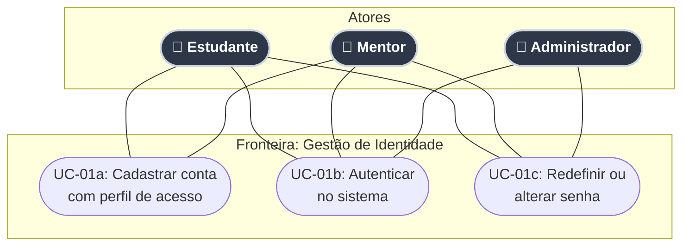
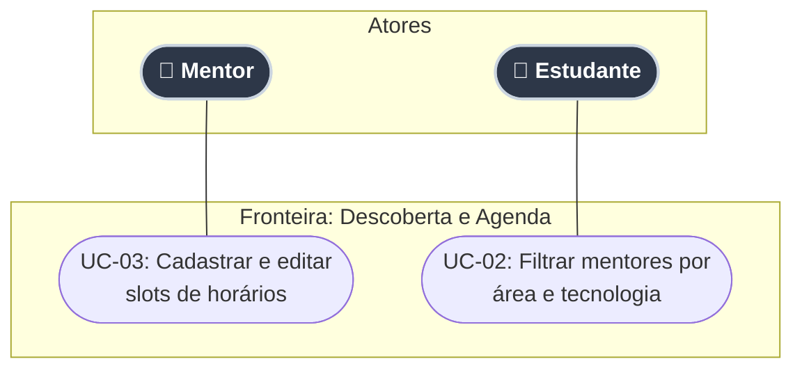
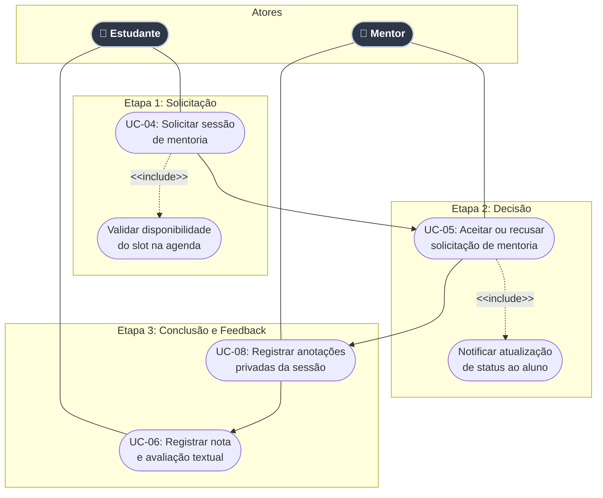
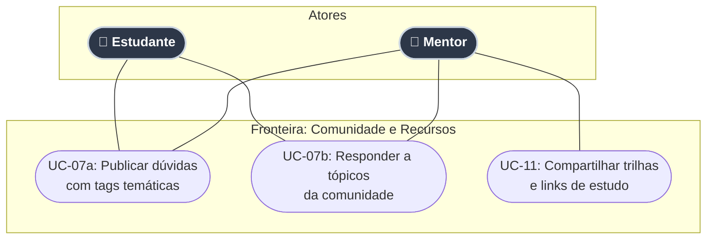
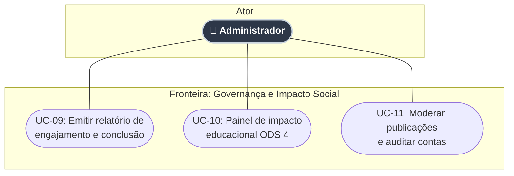
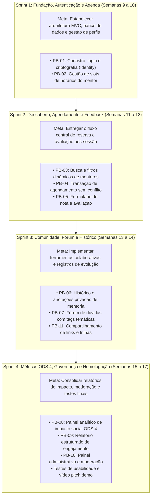

# 1. Introdução

No cenário contemporâneo, marcado pela aceleração da transformação digital, o domínio de competências tecnológicas, lógica de sistemas e segurança da informação tornou-se um requisito primordial para o desenvolvimento socioeconômico e para o ingresso no mercado de trabalho. Contudo, apesar da expansão do acesso à educação básica e do aumento na disponibilidade de dados no ambiente virtual, a formação prática e estruturada em Tecnologia da Informação e Comunicação (TIC) ainda apresenta barreiras significativas de entrada no Brasil, especialmente para jovens, adultos em início de trajetória profissional e indivíduos em transição de carreira.

Além disso, pesquisas recentes indicam que 71% dos estudantes brasileiros utilizam ferramentas de Inteligência Artificial para a compreensão de conteúdos pedagógicos; no entanto, apenas 5% receberam orientação formal sobre o uso crítico e estruturado dessas tecnologias (OPERA, 2024). Esse dado evidencia que o simples acesso a ferramentas tecnológicas é insuficiente sem o devido direcionamento educacional e profissional.

Paralelamente, o ecossistema de TI vivencia um paradoxo estrutural no Brasil: ao passo que se observa um déficit acumulado de profissionais qualificados para suprir as demandas mercadológicas (BRASSCOM, 2021), milhares de entusiastas e estudantes encontram severas barreiras para converter seus estudos autônomos na primeira oportunidade profissional devido à exigência corporativa de experiência prática prévia (MANPOWERGROUP, 2024). Essa dificuldade é agravada pela escassez de direcionamento pedagógico estruturado e pela pulverização de materiais na internet, o que culmina em sobrecarga informativa, paralisia por análise e elevadas taxas de evasão precoce do aprendizado (MEDEIROS; SILVA; ARANHA, 2021).

Diante desta problemática, este projeto propõe o desenvolvimento e a documentação de uma aplicação web interativa voltada para o agendamento de mentorias profissionais e a consolidação de uma rede de apoio colaborativa. A solução digital busca aproximar estudantes e iniciantes a profissionais consolidados no mercado de tecnologia, fornecendo orientação prática, suporte interpessoal e trilhas de desenvolvimento.

A proposta encontra-se fundamentada e alinhada ao Objetivo de Desenvolvimento Sustentável 4 (ODS 4) da Organização das Nações Unidas (ONU, 2015) — "Educação de Qualidade" —, com ênfase na Meta 4.4 da Agenda 2030, a qual almeja ampliar substancialmente o contingente de jovens e adultos dotados de competências técnicas e profissionais relevantes para o emprego decente e o empreendedorismo.

# 2. Justificativa

A implementação de uma plataforma digital voltada à mentoria profissional em tecnologia justifica-se pelo seu expressivo impacto pedagógico, social e econômico.

Sob a perspectiva econômica e mercadológica, dados debatidos no Senado Federal (2024) com base em estudos da Associação das Empresas de Tecnologia da Informação e Comunicação (BRASSCOM, 2021) projetam um déficit de mais de 532 mil profissionais de tecnologia no Brasil até 2029 (com uma demanda total estimada em 797 mil profissionais até 2025). O país forma em média apenas 53 mil pessoas por ano na área, volume insuficiente para suprir a demanda contínua do mercado.

Complementarmente, pesquisas globais sobre escassez e dificuldade de contratação de profissionais qualificados (MANPOWERGROUP, 2024) apontam que 80% dos empregadores no Brasil enfrentam sérias dificuldades para preencher vagas, sendo o setor de Tecnologia e Dados o mais impactado, com 79% de entraves no recrutamento. Pesquisas de mercado (EDUCA MAIS BRASIL, 2024) reforçam que a falta de experiência prática (54%) e a ausência de habilidades comportamentais e colaborativas (*soft skills*, 37%) constituem os principais gargalos. O modelo de mentoria atua como uma ponte integradora entre a teoria acadêmica e as exigências reais do mercado de trabalho.

Sob o prisma social e educacional, o projeto mitiga a assimetria de oportunidades no acesso ao setor tecnológico. Indivíduos oriundos de contextos vulneráveis ou sem histórico de contatos no ecossistema *tech* frequentemente carecem de *networking* estruturado. A plataforma descentraliza o acesso à orientação técnica, permitindo que a troca de conhecimento ocorra de forma inclusiva, gratuita e acessível, combatendo a evasão e promovendo a mobilidade social por meio do letramento digital e profissional.

# 3. Objetivos

## 3.1 Objetivo geral
Projetar, desenvolver e avaliar uma aplicação web interativa de mentoria profissional e rede de apoio colaborativa, destinada a intermediar o contato entre estudantes de tecnologia e profissionais experientes do mercado, visando à orientação de carreira e ao desenvolvimento de competências técnicas e socioemocionais.

## 3.2 Objetivos específicos
Para alcançar o objetivo geral, o trabalho desdobra-se nos seguintes objetivos específicos:

* Mapear as principais lacunas de formação, dificuldades de ingresso e demandas de orientação enfrentadas por iniciantes e pessoas em transição de carreira no setor de tecnologia;
* Especificar os requisitos funcionais e não-funcionais do sistema com base nas normas de engenharia de software, definindo a arquitetura em camadas da aplicação (C#, .NET, Entity Framework, SQL Server, HTML5, CSS3 e JavaScript) e a modelagem relacional de dados;
* Desenvolver a aplicação web integrando uma interface responsiva no *Front-End* a mecanismos de autenticação, gestão de disponibilidade, agendamento de sessões e fórum de dúvidas no *Back-End*;
* Incorporar módulos de relatórios de engajamento e métricas de impacto alinhados à Meta 4.4 do ODS 4 da Agenda 2030 da ONU;
* Avaliar o funcionamento da plataforma mediante testes funcionais, de usabilidade e de segurança em ambiente público, analisando o engajamento e o retorno dos usuários.

# 4. Público-alvo

* **Estudantes e mentorados:** Jovens e adultos em transição ou início de carreira, autodidatas ou estudantes de cursos técnicos e superiores que buscam orientação profissional, revisão de portfólio e apoio prático na área de TI.
* **Mentores voluntários:** Profissionais atuantes no mercado (desenvolvedores, engenheiros de software, analistas de dados, designers UX/UI, gerentes de produto e especialistas em infraestrutura) dispostos a compartilhar conhecimento e orientar iniciantes.
* **Administradores e coordenadores:** Gestores da plataforma responsáveis pela mediação de conflitos, moderação de conteúdos no fórum, auditoria e acompanhamento de métricas de impacto educacional.

# 5. Especificação do projeto

**Perfis de usuários e arquétipos**

| Persona / Nome       | Perfil / Arquétipo                    | Descrição e necessidades                                                                                                                                                         |
| :------------------- | :------------------------------------ | :------------------------------------------------------------------------------------------------------------------------------------------------------------------------------- |
| **Lucas Mendes**     | *Estudante Sem Contato*               | Jovem autodidata em transição de carreira, sem rede de contatos em TI. Necessita de orientação inicial e trilhas de estudo estruturadas para vencer a sobrecarga de informações. |
| **Beatriz Lima**     | *Estudante Com Contato, Sem Emprego*  | Estudante de TI com rede básica que busca a primeira oportunidade. Necessita de auxílio na construção de portfólio prático, revisão de currículo e simulação de entrevistas.     |
| **Gabriel Santos**   | *Estudante Com Contato e Com Emprego* | Desenvolvedor Júnior que busca acelerar sua evolução profissional. Busca orientações técnicas avançadas com sêniores para migração de *stack* e promoção na carreira.            |
| **Roberto Oliveira** | *Mentor Formador*                     | Engenheiro de Software Sênior que deseja impactar a comunidade. Busca uma ferramenta para organizar mentorias voluntárias e preparar novos profissionais e estudantes desde os primeiros passos. |
| **Camila Rocha**     | *Mentor em Evolução de Carreira*      | Desenvolvedora Plena/Sênior buscando migrar para liderança (*Tech Lead*). Necessita orientar mentorados e receber *feedbacks* para desenvolver suas *soft skills* de gestão.     |

---

# 6. Histórias de usuários

| ID | Persona associada | Eu como... [QUEM] | Quero/desejo... [O QUE] | Para... [PORQUE] | Requisitos associados |
| :--- | :--- | :--- | :--- | :--- | :--- |
| **HU-01** | Lucas Mendes | Estudante sem rede de contatos | Filtrar mentores por tecnologia introdutória e área de conhecimento | Encontrar um profissional capacitado para me orientar nos primeiros passos e estruturar minha trilha de estudos | RF-02 |
| **HU-02** | Lucas Mendes | Estudante sem rede de contatos | Visualizar os dias e horários livres na agenda do mentor e solicitar uma sessão | Agendar um atendimento introdutório sem necessidade de troca de mensagens informais prévias | RF-03, RF-04 |
| **HU-03** | Beatriz Lima | Estudante em busca de emprego | Solicitar agendamento de mentoria com foco em revisão de portfólio e simulação de entrevista | Identificar lacunas nos meus projetos práticos e me preparar de forma realista para processos seletivos | RF-02, RF-04 |
| **HU-04** | Beatriz Lima | Estudante em busca de emprego | Acessar o histórico da mentoria com as anotações e pontos de melhoria deixados pelo mentor | Implementar as correções sugeridas em meu currículo e repositórios do GitHub para aumentar minha empregabilidade | RF-06, RF-08 |
| **HU-05** | Gabriel Santos | Desenvolvedor júnior empregado | Filtrar e selecionar mentores com perfil sênior/liderança em arquitetura e *stacks* avançadas (ex.: .NET / C#) | Discutir desafios técnicos complexos, boas práticas de código e estratégias de promoção profissional | RF-02, RF-04 |
| **HU-06** | Gabriel Santos | Desenvolvedor júnior empregado | Publicar dúvidas técnicas aprofundadas no fórum com marcação de tags temáticas | Obter diferentes perspectivas técnicas e referências arquiteturais de mentores e outros membros da comunidade | RF-05 |
| **HU-07** | Roberto Oliveira | Mentor formador voluntário | Cadastrar, editar e desativar meus blocos de horários disponíveis para mentoria | Disponibilizar horários voluntários organizados sem comprometer meus compromissos profissionais | RF-03 |
| **HU-08** | Roberto Oliveira | Mentor formador voluntário | Visualizar a lista de solicitações pendentes e poder aceitá-las ou recusá-las com mensagem justificativa | Selecionar estudantes alinhados à minha área de tutoria e gerenciar com transparência meus atendimentos | RF-04, RF-07 |
| **HU-09** | Camila Rocha | Mentora em evolução para liderança | Receber avaliações numéricas e comentários de *feedback* qualitativo dos mentorados após cada sessão | Identificar pontos de melhoria na minha comunicação, didática e habilidades interpessoais de liderança (*soft skills*) | RF-06, RF-07 |
| **HU-10** | Camila Rocha | Mentora em evolução para liderança | Acessar um painel com o histórico consolidado das minhas mentorias realizadas e média de avaliações | Mensurar meu progresso contínuo como tutora e comprovar minha experiência prática em orientação e mentoria técnica | RF-08, RF-09, RF-10 |

# 7. Requisitos do projeto

## 7.1 Requisitos funcionais

| ID | Descrição do requisito | Módulo / Operação | Prioridade |
| :--- | :--- | :--- | :--- |
| **RF-01** | O sistema deve permitir o cadastro, autenticação, visualização, edição de perfil e exclusão lógica de contas de usuários com diferenciação de perfis (Estudante, Mentor e Administrador). | CRUD de Usuários e Autenticação (CRUD 1) | ALTA |
| **RF-02** | O sistema deve disponibilizar funcionalidade de busca e listagem de mentores com filtros combinados por área de especialidade, tecnologia de domínio e disponibilidade. | Consulta e Descoberta de Mentores | ALTA |
| **RF-03** | O sistema deve permitir que o mentor cadastre, liste, altere e remova seus slots de disponibilidade de dias e horários de atendimento. | CRUD de Disponibilidade da Agenda (CRUD 2) | ALTA |
| **RF-04** | O sistema deve permitir que o estudante crie solicitações de agendamento de mentoria, e que o mentor confirme, recuse ou cancele a sessão, atualizando o status do agendamento. | CRUD de Agendamentos de Mentoria (CRUD 3) | ALTA |
| **RF-05** | O sistema deve permitir que usuários publiquem tópicos de dúvidas, visualizem listagens com paginação, respondam a tópicos existentes, editem e excluam suas próprias postagens. | CRUD de Tópicos e Fórum Colaborativo (CRUD 4) | MÉDIA |
| **RF-06** | O sistema deve disponibilizar formulário para que o estudante registre avaliação numérica (de 1 a 5 estrelas) e comentário textual sobre a sessão de mentoria concluída. | Avaliação e Feedback de Sessões | MÉDIA |
| **RF-07** | O sistema deve exibir notificações no painel do usuário e enviar alertas de status sobre solicitações de mentoria (pendente, aceita, recusada ou cancelada) e respostas no fórum. | Central de Notificações e Alertas | MÉDIA |
| **RF-08** | O sistema deve disponibilizar um histórico individualizado de sessões de mentoria para estudantes e mentores, com visualização de detalhes e anotações privadas de evolução do aluno. | Histórico de Sessões e Acompanhamento | MÉDIA |
| **RF-09** | O sistema deve gerar um relatório consolidado de engajamento e desempenho, com cruzamento de dados de mentorias agendadas vs. concluídas, taxa de cancelamento e média de avaliações por período. | Relatório Estruturado de Engajamento (Relatório 1) | ALTA |
| **RF-10** | O sistema deve disponibilizar um painel gerencial de indicadores de impacto social (ODS 4), apresentando o volume consolidado de horas de mentoria voluntária, total de alunos beneficiados e ranking de tecnologias mais demandadas. | Relatório Analítico de Impacto ODS 4 (Relatório 2) | ALTA |
| **RF-11** | O sistema deve fornecer ferramentas administrativas para moderar publicações do fórum, bloquear ou reativar contas de usuários e consultar logs de auditoria de ações críticas. | Painel de Moderação e Governança | MÉDIA |
| **RF-12** | O sistema deve permitir que mentores cadastrem e compartilhem links e materiais de apoio recomendados (artigos, repositórios e trilhas de estudo) associados a áreas de conhecimento. | Gestão de Materiais e Trilhas de Apoio | BAIXA |
| **RF-13** | O sistema deve permitir que o usuário autenticado altere sua própria senha de acesso informando a senha atual e a nova credencial. | Gestão de Credenciais e Perfil | MÉDIA |

## 7.2 Requisitos não-funcionais

| ID         | Descrição do requisito                                                                                                                                                                                                                        | Categoria / Métrica de qualidade      | Prioridade |
| :--------- | :-------------------------------------------------------------------------------------------------------------------------------------------------------------------------------------------------------------------------------------------- | :------------------------------------ | :--------- |
| **RNF-01** | A interface deve permitir que o estudante localize um mentor compatível e inicie a solicitação de agendamento em até 3 cliques a partir da tela inicial.                                                                                      | Usabilidade e Navegação               | ALTA       |
| **RNF-02** | A interface deve manter bom nível de contraste visual entre textos e elementos de fundo, utilizando tipografia legível e ícones intuitivos para facilitar a leitura. | Acessibilidade e Legibilidade Visual | MÉDIA |
| **RNF-03** | O sistema deve garantir a integridade transacional no banco de dados relacional, impedindo a sobreposição de agendamentos e que dois estudantes reservem simultaneamente o mesmo slot de horário de um mentor.                                | Confiabilidade e Integridade de Dados | ALTA       |
| **RNF-04** | A aplicação deve implementar controle de acesso e permissões por perfil, impedindo que usuários não autorizados visualizem ou alterem dados de outros usuários ou acessem rotas administrativas.                                              | Segurança e Controle de Acesso        | ALTA       |
| **RNF-05** | A aplicação deve ser compatível e funcionalmente estável nas versões estáveis mais recentes dos principais navegadores web do mercado (Google Chrome, Mozilla Firefox, Microsoft Edge e Apple Safari).                                        | Compatibilidade e Portabilidade       | ALTA       |
| **RNF-06** | O sistema deve garantir a segurança e a privacidade dos dados pessoais em conformidade com a LGPD (Lei nº 13.709/2018), armazenando senhas de forma criptografada com algoritmos de *hash* seguro e *salt* (ASP.NET Core Identity), além de assegurar exclusão lógica (*soft delete*) e sigilo absoluto das anotações privadas de mentoria, visíveis unicamente aos participantes da sessão. | Segurança da Informação e Privacidade | ALTA       |
| **RNF-07** | A interface deve fornecer feedback visual imediato (mensagens claras de sucesso, alertas de validação de formulários e indicadores de carregamento) para todas as ações realizadas pelo usuário.                                              | Usabilidade e Interface               | ALTA       |
| **RNF-08** | A solução deve ser construída estritamente na stack tecnológica obrigatória do Eixo 2: Back-End em C# (.NET / ASP.NET Core com Entity Framework Core), Banco de Dados Relacional SQL Server, e Front-End em HTML5, CSS3 e JavaScript Vanilla. | Restrição Arquitetural e Tecnológica  | ALTA       |

# 8. Casos de uso do sistema

## 8.1 Atores do sistema

| Ator | Descrição e responsabilidades no sistema |
| :--- | :--- |
| **Estudante / Mentorado** | Usuário cadastrado em busca de orientação técnica ou transição de carreira. Pesquisa mentores, agenda atendimentos, participa do fórum de dúvidas e avalia sessões concluídas. |
| **Mentor Voluntário** | Profissional de tecnologia que disponibiliza horários voluntários. Gerencia seus slots de agenda, aprova ou recusa agendamentos, registra anotações pós-mentoria e compartilha trilhas de estudo. |
| **Administrador** | Gestor da plataforma responsável por governança, moderação de conteúdos no fórum, auditoria de contas e emissão de relatórios de engajamento e métricas de impacto socioeducacional (ODS 4). |

---

## 8.2 Especificação dos casos de uso

| Identificador | Nome do caso de uso | Ator primário | Requisitos associados | Descrição sucinta |
| :--- | :--- | :--- | :--- | :--- |
| **UC-01** | Manter conta de usuário | Estudante, Mentor, Admin | RF-01, RF-13 | Cadastro de perfil, autenticação com credenciais seguras, atualização de dados pessoais e alteração de senha. |
| **UC-02** | Consultar e filtrar mentores | Estudante | RF-02, RNF-01 | Busca dinâmica de mentores por especialidade, tecnologia (ex.: .NET, React, SQL) e disponibilidade de horários. |
| **UC-03** | Gerenciar slots de disponibilidade | Mentor | RF-03 | Cadastro, edição e cancelamento de blocos de horários livres para realização de atendimentos voluntários. |
| **UC-04** | Solicitar agendamento de mentoria | Estudante | RF-04, RNF-03 | Seleção de slot livre na agenda do mentor, definição do tema de interesse e envio de solicitação de mentoria. |
| **UC-05** | Responder solicitação de mentoria | Mentor | RF-04, RF-07 | Visualização das solicitações pendentes e confirmação ou recusa motivada da sessão, com disparo de alerta ao aluno. |
| **UC-06** | Registrar avaliação e feedback | Estudante | RF-06 | Atribuição de nota de 1 a 5 estrelas e elaboração de parecer qualitativo após o término da mentoria. |
| **UC-07** | Interagir no fórum colaborativo | Estudante, Mentor | RF-05, RF-07 | Publicação de tópicos com tags temáticas, respostas a postagens da comunidade e edição ou exclusão do próprio conteúdo. |
| **UC-08** | Consultar histórico e anotações | Estudante, Mentor | RF-08 | Visualização da linha do tempo de atendimentos e registro de anotações privadas de evolução técnica. |
| **UC-09** | Emitir relatórios de engajamento e ODS 4 | Administrador | RF-09, RF-10 | Geração de relatórios consolidados de taxa de conclusão e painel analítico de horas voluntárias e alunos beneficiados. |
| **UC-10** | Moderar conteúdos e auditar contas | Administrador | RF-11 | Exclusão de postagens ofensivas no fórum, bloqueio preventivo de perfis e verificação de logs de auditoria. |
| **UC-11** | Compartilhar trilhas e materiais de apoio | Mentor | RF-12 | Cadastro e compartilhamento de links de artigos, documentações e repositórios de apoio para os mentorados. |

---

## 8.3 Convenções e especificação das relações UML

Para assegurar o rigor técnico da modelagem UML nos diagramas a seguir, são empregadas as seguintes convenções de relacionamentos e notações de setas:

| Elemento / Relação UML | Notação gráfica | Tipo de linha e seta | Significado e aplicação no sistema |
| :--- | :--- | :--- | :--- |
| **Associação** | `Ator --- CasoDeUso` | Linha contínua sem ponta | Indica a comunicação bidirecional direta entre um ator e o caso de uso que ele executa. |
| **Generalização / Herança** | `AtorEspecializado --\|> AtorBase` | Linha sólida com seta triangular fechada | Indica herança de comportamento (ex.: Usuário Autenticado herdando de Usuário Base). |
| **Inclusão (`<<include>>`)** | `UC_Base -.->\|<<include>>\| UC_Obrigatorio` | Linha tracejada com seta aberta em 'V' | O caso de uso base **obrigatoriamente** executa o caso de uso incluído (ex.: agendar mentoria inclui validação de conflitos). A seta aponta do caso base para o incluído. |
| **Extensão (`<<extend>>`)** | `UC_Extensao -.->\|<<extend>>\| UC_Base` | Linha tracejada com seta aberta em 'V' | Representa comportamento **opcional ou condicional** que pode estender o caso de uso base. A seta aponta do caso opcional (extensão) para o caso de uso base. |

---

## 8.4 Diagramas de casos de uso por módulo funcional (UML)

Para garantir máxima legibilidade e clareza visual, os casos de uso são organizados em diagramas verticais modulares independentes, contextualizando os atores específicos que interagem em cada fronteira do sistema.

### Módulo 1: Autenticação, perfis e credenciais

---

### Módulo 2: Descoberta de mentores e gestão de agenda

---

### Módulo 3: Ciclo de vida da mentoria (solicitação, sessão e avaliação)

---

### Módulo 4: Fórum colaborativo e recursos de apoio

---

### Módulo 5: Governança, moderação e métricas de impacto ODS 4

---

# 9. Backlog do produto e planejamento de sprints

## 9.1 Backlog do produto (Product backlog)

| ID do Item | Épico / Módulo | Requisitos associados | Histórias de usuário | Estimativa | Prioridade MoSCoW |
| :--- | :--- | :--- | :--- | :--- | :--- |
| **PB-01** | Autenticação e Perfis (CRUD 1) | RF-01, RF-13, RNF-04, RNF-06 | Base Geral | 8 pts | Must have |
| **PB-02** | Gestão de Agenda do Mentor (CRUD 2) | RF-03 | HU-07 | 5 pts | Must have |
| **PB-03** | Descoberta e Filtros de Mentores | RF-02, RNF-01 | HU-01, HU-05 | 5 pts | Must have |
| **PB-04** | Agendamento e Transações (CRUD 3) | RF-04, RNF-03 | HU-02, HU-03, HU-08 | 8 pts | Must have |
| **PB-05** | Avaliação e Feedback da Sessão | RF-06 | HU-09 | 3 pts | Should have |
| **PB-06** | Histórico e Anotações Privadas | RF-07, RF-08 | HU-04, HU-10 | 5 pts | Should have |
| **PB-07** | Fórum Colaborativo de Dúvidas (CRUD 4) | RF-05, RF-07 | HU-06 | 5 pts | Should have |
| **PB-08** | Painel de Indicadores ODS 4 (Relatório 2) | RF-10 | HU-10 | 5 pts | Should have |
| **PB-09** | Relatório de Engajamento (Relatório 1) | RF-09 | HU-10 | 5 pts | Should have |
| **PB-10** | Moderação Administrativa e Auditoria | RF-11 | Governança | 5 pts | Could have |
| **PB-11** | Trilhas e Links Recomendados | RF-12 | HU-01 | 2 pts | Could have |

---

## 9.2 Planejamento e divisão em 4 sprints

A execução prática do desenvolvimento de software foi estruturada em **4 Sprints** equilibradas, cobrindo todo o ciclo desde a arquitetura inicial até a entrega da versão final homologada.

---

### Detalhamento das 4 sprints

#### Sprint 1: Fundação, autenticação e gestão de agenda
* **Período:** ==28/09 a 11/10/2026== (Semanas 9 e 10 — Início do Módulo 3 / Etapa 03)
* **Objetivo:** Estabelecer a infraestrutura técnica em camadas (.NET MVC + Entity Framework Core + SQL Server), implementação do Identity para autenticação com segurança criptográfica (hash/salt) e disponibilização do módulo de horários do mentor.
* **Itens entregues:**
  * **PB-01:** Scaffold do projeto, mapeamento ORM, migrations, login, cadastro com diferenciação de perfis (*Estudante*, *Mentor*, *Admin*) e troca de senha.
  * **PB-02:** Interface e rotas de CRUD para o mentor cadastrar, alterar e desativar blocos de horários livres em sua agenda semanal.
* **Critério de pronto (DoD):** Banco de dados relacional populado, autenticação funcional por cookies/Identity e CRUD de agenda operando com persistência no SQL Server.

---

#### Sprint 2: Descoberta, reserva de sessões e avaliação
* **Período:** ==12/10 a 25/10/2026== (Semanas 11 e 12 — Fechamento da Etapa 03 e Início da Etapa 04)
* **Objetivo:** Integrar a Prova de Conceito (POC) conectando Front-End responsivo com Back-End para permitir que o estudante localize mentores, reserve horários sem sobreposição e avalie atendimentos concluídos.
* **Itens entregues:**
  * **PB-03:** Catálogo visual de mentores com filtros combinados por tecnologia (ex.: C#, React, SQL) e disponibilidade.
  * **PB-04:** Fluxo transacional de solicitação de agendamento com validação de slot livre, aprovação/recusa pelo mentor e notificação.
  * **PB-05:** Sistema de avaliação quantitativa (1 a 5 estrelas) e qualitativa pós-sessão.
* **Critério de pronto (DoD):** Fluxo fim a fim de solicitação, aprovação e avaliação testado em ambiente web responsivo com relatórios de testes de software registrados.

---

#### Sprint 3: Fórum colaborativo, histórico e acompanhamento
* **Período:** ==26/10 a 08/11/2026== (Semanas 13 e 14 — Fechamento do Módulo 4 / Etapa 04)
* **Objetivo:** Implementar os recursos comunitários e a área de acompanhamento pedagógico do estudante, estimulando a troca contínua de conhecimento.
* **Itens entregues:**
  * **PB-06:** Linha do tempo de atendimentos realizados e editor de anotações privadas de evolução do mentorado (com controle de privacidade estrito).
  * **PB-07:** Fórum colaborativo de dúvidas com listagem paginada, postagem por tópicos temáticos e respostas da comunidade.
  * **PB-11:** Compartilhamento de links de artigos, documentações e repositórios de apoio pelo mentor.
* **Critério de pronto (DoD):** Fórum 100% funcional, histórico de sessões com anotações salvas e registros formais dos testes de usabilidade com usuários.

---

#### Sprint 4: Painel de impacto ODS 4, governança e entrega final
* **Período:** ==09/11 a 29/11/2026== (Semanas 15 a 17 — Módulo 5 / Etapa 05)
* **Objetivo:** Construir a camada analítica de relatórios gerenciais focados na Meta 4.4 do ODS 4, governança administrativa, revisão final de acessibilidade/desempenho e preparação dos artefatos de encerramento.
* **Itens entregues:**
  * **PB-08:** Painel gerencial analítico de impacto ODS 4 (horas de mentoria voluntária prestadas, alunos beneficiados e ranking de tecnologias).
  * **PB-09:** Relatório consolidado de engajamento (mentorias agendadas vs. concluídas, taxa de cancelamento e médias).
  * **PB-10:** Painel administrativo para moderação de publicações do fórum, auditoria de logs e bloqueio preventivo de perfis.
  * Refinamento visual, testes finais de regressão, arquivo `citation.cff` e gravação do Vídeo Pitch Comercial com demo (3 min).
* **Critério de pronto (DoD):** Código-fonte final validado no GitHub, relatórios finais de testes de software e usabilidade, documentação completa e projeto homologado para a banca.

---

# 10. Referências bibliográficas

BRASSCOM (Associação das Empresas de Tecnologia da Informação e Comunicação). **Relatório de Demanda de Talentos em TIC e Estratégia ΣTCEM**. São Paulo: Brasscom, 1 dez. 2021. Disponível em: https://brasscom.org.br/estudo-da-brasscom-aponta-demanda-de-797-mil-profissionais-de-tecnologia-ate-2025/. Acesso em: ==13/08/2026==.

EDUCA MAIS BRASIL. **Escassez de talentos tech desafia empresas no Brasil**. 2024. Disponível em: https://www.educamaisbrasil.com.br/educacao/carreira/escassez-de-talentos-tech-desafia-empresas-no-brasil. Acesso em: ==13/08/2026==.

MANPOWERGROUP. **Pesquisa de Escassez de Talentos 2024**. São Paulo: ManpowerGroup Brasil, 2024. Disponível em: https://www.manpowergroup.com.br/insights/estudos/pesquisa-de-escassez-de-talentos-2024?hsLang=pt-br. Acesso em: ==13/08/2026==.

MEDEIROS, Hermeson; SILVA, Wilkerson; ARANHA, Eduardo. Identificação de fatores que influenciam a evasão em cursos de graduação em computação: um mapeamento sistemático. In: WORKSHOP SOBRE EDUCAÇÃO EM COMPUTAÇÃO (WEI / CSBC), 29., 2021, Evento Online. **Anais [...].** Porto Alegre: Sociedade Brasileira de Computação (SBC), 2021. p. 111-120. Disponível em: https://sol.sbc.org.br/index.php/wei/article/view/15904. Acesso em: ==13/08/2026==.

OPERA. **78% dos estudantes usam IA na rotina de estudos, aponta pesquisa da Opera**. Divulgação: TecMundo, 12 ago. 2024. Disponível em: https://www.tecmundo.com.br/software/287796-78-estudantes-usam-ia-rotina-estudos-aponta-pesquisa-opera.htm. Acesso em: ==13/08/2026==.

ORGANIZAÇÃO DAS NAÇÕES UNIDAS (ONU). **Objetivo 4: Garantir a educação inclusiva e equitativa de qualidade, e promover oportunidades de aprendizagem ao longo da vida para todos**. Agenda 2030 para o Desenvolvimento Sustentável, 2015. Disponível em: https://brasil.un.org/pt-br/sdgs/4. Acesso em: ==13/08/2026==.

SENADO FEDERAL. **País terá déficit de 532 mil profissionais de tecnologia até 2029, aponta debate**. Agência Senado, Brasília, 30 out. 2024. Disponível em: https://www12.senado.leg.br/noticias/materias/2024/10/30/pais-tera-deficit-de-532-mil-profissionais-de-tecnologia-ate-2029-aponta-debate. Acesso em: ==13/08/2026==.
