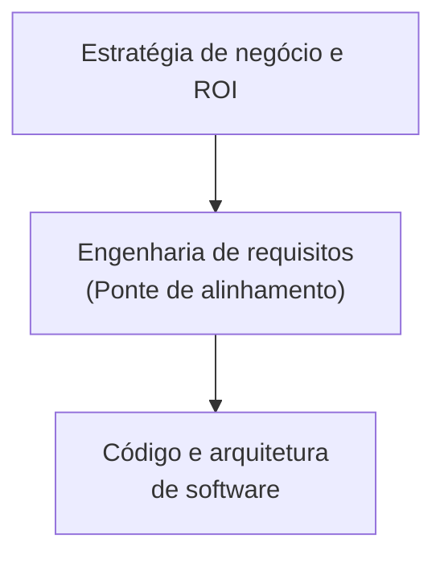

# Engenharia de requisitos e negócios: o alinhamento estratégico

## Introdução

Um dos maiores equívocos no desenvolvimento de produtos digitais é encarar a [[01. O que é, afinal, engenharia de requisitos|Engenharia de Requisitos]] como uma atividade estritamente técnica. Na realidade, a Engenharia de Requisitos é, antes de tudo, uma disciplina de **alinhamento de negócios**. 

Software não existe em um vácuo; ele é construído para resolver problemas organizacionais, automatizar processos, capturar novas oportunidades de mercado e gerar retorno sobre o investimento (ROI).

Neste artigo, exploraremos a profunda conexão entre a Engenharia de Requisitos e o mundo dos negócios, o papel do Analista de Negócios (Business Analyst), como os requisitos garantem o valor do produto e os riscos do desalinhamento estratégico.

---

## 1. A Engenharia de Requisitos como tradutora de valor de negócio

No ambiente corporativo, existem duas linguagens muito distintas:
* **a língua dos negócios:** fala sobre receita, redução de custos, participação de mercado (market share), retenção de clientes (*churn*), *compliance* regulatório e eficiência operacional.
* **a língua da tecnologia:** fala sobre APIs, microserviços, bancos de dados (veja [[02. Modelagem de Dados/00. Modelagem de Dados - Resumo|Modelagem de Dados]]), latência e arquiteturas de [[05. Desenvolvimento Web Back-End/00. Desenvolvimento Web Back-End - Resumo|Back-End]].

A Engenharia de Requisitos atua como o **tradutor bilíngue** dessa relação. Ela pega os objetivos estratégicos de alto nível (Requisitos de Negócio) e os desdobra em especificações técnicas compreensíveis para a engenharia.

---

## 2. O papel do Analista de Negócios (BA) e do Product Owner (PO)

A interseção entre negócios e requisitos deu origem a papéis fundamentais na indústria de tecnologia:
* **Analista de Negócios (Business Analyst - BA):** focado em entender os processos da empresa (mapeamento *As-Is* e *To-Be*), identificar dores operacionais e propor soluções viáveis de software.
* **Product Owner (PO):** em ambientes ágeis, o PO gerencia o *Product Backlog*, garantindo que as Histórias de Usuário entregues a cada sprint maximizem o valor entregue aos clientes e ao negócio.

Esses profissionais utilizam as [[06. Técnicas de elicitação de requisitos|Técnicas de Elicitação]] (como workshops, entrevistas e análise de processos) não para perguntar "o que você quer que o botão faça?", mas sim **"qual indicador de negócio nós queremos melhorar com essa funcionalidade?"**.

---

## 3. Riscos do desalinhamento entre requisitos e negócios

Quando a Engenharia de Requisitos falha em se conectar aos objetivos de negócio, os projetos sofrem de dois males clássicos:

### a. *Gold plating* (ouro sobre azul)
Ocorre quando a equipe técnica adiciona recursos altamente complexos e custosos que **não agregam valor perceptível ao cliente ou ao negócio**. Exemplo: gastar 3 meses otimizando um algoritmo para rodar em 5ms em vez de 50ms quando o usuário final não perceberia a diferença e o custo do servidor não mudaria.

### b. Software perfeito para o problema errado
É o cenário em que o software é entregue dentro do prazo, dentro do orçamento, com zero bugs e com excelente desempenho (atendendo a todos os [[04. Requisitos funcionais e não-funcionais|Requisitos Não-Funcionais]]), porém **ninguém usa o produto** porque ele não resolveu a dor real do cliente ou não se encaixa na operação da empresa.

---

## 4. Como garantir o alinhamento estratégico?

Para conectar com sucesso os requisitos ao negócio, as equipes devem adotar as seguintes práticas:

1. **definição de métricas de sucesso (OKRs / KPIs):** todo [[03. O conceito de requisito de software - definição, níveis e características|Requisito de Negócio]] deve estar atrelado a um indicador mensurável. Por exemplo: *"A funcionalidade X deve reduzir o tempo de atendimento em 15%"*.
2. **priorização baseada em valor:** funcionalidades com maior impacto financeiro ou operacional devem ser desenvolvidas primeiro.
3. **validação contínua com stakeholders:** demonstrar protótipos e incrementos funcionais frequentemente aos tomadores de decisão de negócio para garantir alinhamento constante.
4. **habilidades comportamentais (soft skills):** o engenheiro de requisitos precisa de empatia, capacidade de negociação e liderança (estudados em [[10. Lideranca e Competencias/00. Lideranca e Competencias - Resumo|Liderança e Competências Comportamentais]]) para arbitrar conflitos de interesses entre diferentes áreas da empresa.

---

## Conclusão

A Engenharia de Requisitos é a garantia de que o capital investido em desenvolvimento de software trará retorno real para a organização. Ao conectar os objetivos estratégicos da empresa às especificações técnicas da equipe de desenvolvimento, a Engenharia de Requisitos deixa de ser um mero custo de documentação e se torna um **driver direto de inovação e valor de negócio**.

---

## Artigos relacionados e navegação

* **Artigo anterior:** [[01. O que é, afinal, engenharia de requisitos]]
* **Próximo artigo:** [[03. O conceito de requisito de software - definição, níveis e características]]
* **Resumo da disciplina:** [[00. Engenharia de Requisitos - Resumo]]
* **Índice geral do vault:** [[index]]
