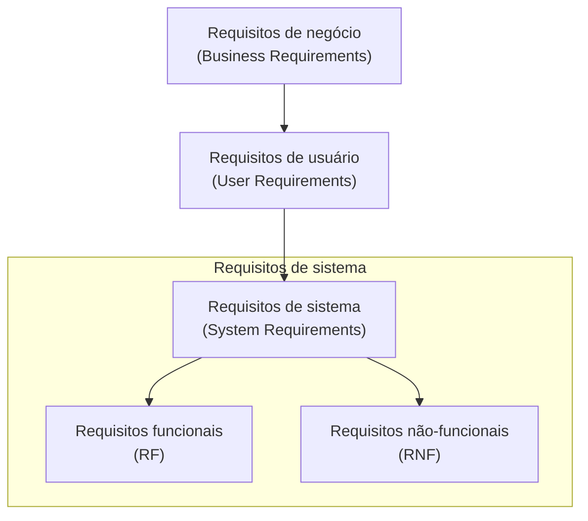

# O conceito de requisito de software: definição, níveis e características

## Introdução

Na [[01. O que é, afinal, engenharia de requisitos|Engenharia de Requisitos]], a palavra "requisito" é a unidade fundamental de trabalho. No entanto, o que exatamente constitui um requisito? Trata-se de uma funcionalidade, um desejo do cliente, uma restrição legal ou uma métrica de desempenho?

A resposta é que um requisito pode abranger tudo isso, desde que formalizado corretamente. Neste artigo, examinaremos o conceito formal de requisito de software segundo padrões internacionais (como a IEEE), os diferentes níveis em que os requisitos se manifestam, as características essenciais de um bom requisito e um exemplo prático completo do mundo real.

---

## 1. Definição formal de requisito

Segundo o padrão **IEEE 610.12 (Standard Glossary of Software Engineering Terminology)**, um requisito é definido como:

1. *uma condição ou capacidade necessária que um usuário precisa para resolver um problema ou atingir um objetivo.*
2. *uma condição ou capacidade que um sistema ou componente de sistema deve atender ou possuir para satisfazer um contrato, padrão, especificação ou outro documento formalmente imposto.*

Em termos simples: um requisito é a representação clara de uma **necessidade de negócio ou de usuário** traduzida de forma que a equipe técnica possa projetar, codificar (no [[05. Desenvolvimento Web Back-End/00. Desenvolvimento Web Back-End - Resumo|Back-End]] ou Front-End) e testar a solução.

---

## 2. A hierarquia dos requisitos: níveis de abstração

Nem todos os requisitos possuem o mesmo nível de detalhamento. Eles se organizam em três níveis principais de abstração:

### a. Requisitos de negócio (*business requirements*)
Definem os objetivos de alto nível da organização que está contratando ou construindo o software. Respondem ao *porquê* o projeto existe.
* *exemplo:* "Aumentar as vendas do e-commerce em 25% no próximo trimestre oferecendo compras via aplicativo móvel."

### b. Requisitos de usuário (*user requirements*)
Descrevem as tarefas que os usuários precisam realizar utilizando o sistema, geralmente capturadas através de [[06. Técnicas de elicitação de requisitos|Técnicas de Elicitação]] e representadas como [[08. Modelagem de requisitos com casos de uso e especificações textuais|Casos de Uso]] ou Histórias de Usuário (*User Stories*).
* *exemplo:* "O cliente deve ser capaz de rastrear a localização da sua entrega em tempo real no mapa."

### c. Requisitos de sistema (*system requirements*)
O nível mais detalhado e técnico. Descrevem com precisão as funções do software e suas restrições operacionais. Subdividem-se em [[04. Requisitos funcionais e não-funcionais|Requisitos Funcionais e Não-Funcionais]].
* *exemplo funcional:* "O sistema deve integrar com a API da transportadora a cada 60 segundos para atualizar a latitude e longitude do veículo."
* *exemplo não-funcional:* "A atualização do mapa deve ser renderizada em menos de 500 milissegundos."

---

## 3. Exemplo prático do mundo real: sistema de Uber / Delivery

Para entender como esses níveis e conceitos se conectam na prática, imagine o desenvolvimento de um aplicativo de transporte de passageiros (como o Uber):

1. **visão de negócio (requisito de negócio):** 
 > *"Reduzir o tempo de espera do passageiro para menos de 5 minutos nas grandes capitais, aumentando o faturamento da plataforma."*

2. **necessidade do usuário (requisito de usuário):** 
 > *"Como passageiro, quero solicitar uma corrida informando meu destino para que um motorista próximo venha me buscar."* (Capturado via História de Usuário / [[08. Modelagem de requisitos com casos de uso e especificações textuais|Caso de Uso]]).

3. **especificação técnica (requisitos de sistema):**
 * **requisito funcional (RF-01):** *"Ao confirmar a solicitação, o sistema deve calcular a rota via algoritmos de geolocalização e disparar uma notificação push para os 3 motoristas ativos mais próximos num raio de 2 km."* (Integrado à arquitetura [[05. Desenvolvimento Web Back-End/00. Desenvolvimento Web Back-End - Resumo|Back-End]]).
 * **requisito não-funcional (RNF-01 - desempenho):** *"A busca e notificação dos motoristas deve ocorrer em no máximo 3 segundos."* (Refletindo no estudo de [[04. Algoritmos e Estruturas de Dados/00. Algoritmos e Estruturas de Dados - Resumo|Complexidade de Algoritmos]]).
 * **requisito não-funcional (RNF-02 - segurança):** *"Os dados de cartão de crédito do passageiro devem ser tokenizados no padrão PCI-DSS antes do envio."*

Se o requisito fosse escrito apenas como *"O app precisa ser rápido e chamar um carro"*, ele seria **ambíguo e não-testável**. Ao detalhá-lo em níveis e aplicar as características de clareza e rastreabilidade, a equipe garante que a solução construída corresponda exatamente à necessidade real.

---

## 4. As características de um bom requisito

Elicitar requisitos não é apenas escrever uma lista de desejos. Para que um requisito seja útil para os desenvolvedores e testadores, ele deve possuir as seguintes qualidades:

1. **claro e inambíguo:** deve ter apenas uma interpretação possível para qualquer leitor.
2. **completo:** contém todas as informações necessárias para sua implementação sem deixar omissões.
3. **consistente:** não entra em contradição com nenhum outro requisito existente no sistema.
4. **verificável (testável):** deve ser possível projetar um teste quantitativo ou lógico que comprove se o requisito foi atendido ou não.
5. **viável:** é passível de ser construído considerando as restrições de tecnologia, orçamento e tempo.
6. **rastreável:** possui um identificador único (ex.: `REQ-001`, `RF-12`) para acompanhar sua evolução desde a elicitação até o teste e a implantação.
7. **necessário:** agrega valor real ao produto e aos objetivos de negócio, evitando a inclusão de recursos desnecessários (*Gold Plating*).

---

## Conclusão

Entender o conceito e os níveis de um requisito é o alicerce para toda a [[01. O que é, afinal, engenharia de requisitos|Engenharia de Requisitos]]. Um requisito bem conceituado e estruturado reduz dúvidas no desenvolvimento, evita retrabalho e garante que a aplicação final atenda perfeitamente aos objetivos estratégicos do negócio.

---

## Artigos relacionados e navegação

* **Artigo anterior:** [[02. Engenharia de requisitos e negócios - o alinhamento estratégico]]
* **Próximo artigo:** [[04. Requisitos funcionais e não-funcionais]]
* **Resumo da disciplina:** [[00. Engenharia de Requisitos - Resumo]]
* **Índice geral do vault:** [[index]]
