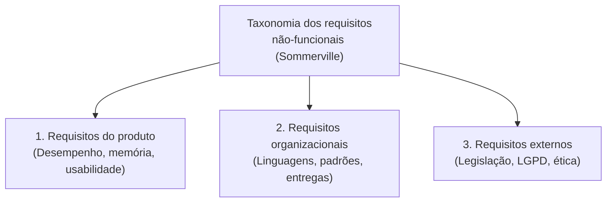

# Requisitos funcionais e não-funcionais: o que são e como se diferenciam

> **Contexto:** Guia fundamental de diferenciação entre funcionalidades de negócio (RF) e atributos de qualidade/restrições tecnológicas (RNF).

---

## Introdução

Na [[07. Engenharia de Requisitos/01. O que é, afinal, engenharia de requisitos.md|Engenharia de Requisitos]], após entender [[07. Engenharia de Requisitos/03. O conceito de requisito de software - definição, níveis e características.md|o que é um Requisito de Software]], a distinção mais fundamental é a separação entre **Requisitos Funcionais (RF)** e **Requisitos Não-Funcionais (RNF)**. Compreender essa diferença é crucial para garantir que o sistema não apenas realize as tarefas necessárias, mas também opere com a qualidade, segurança e eficiência esperadas pelos usuários e pelo negócio.

---

## 1. O que são requisitos funcionais (RF)?

Os **Requisitos Funcionais** definem **o que o sistema deve fazer**. Eles descrevem as funções, comportamentos e ações que o produto deverá realizar em benefício do usuário ou do processo de negócio.

> **Princípio da tecnologia perfeita:**
> Na fase de especificação dos Requisitos Funcionais, assume-se hipoteticamente uma "tecnologia perfeita". O foco é **exclusivamente no negócio** (o que o usuário precisa realizar), esquecendo temporariamente as restrições tecnológicas de implementação (plataforma, velocidade, linguagem ou banco de dados), pois estes detalhes pertencem aos Requisitos Não-Funcionais.

### Características dos requisitos funcionais:
* **Foco na ação e no negócio:** Descrevem regras, serviços e fluxos operacionais.
* **Mensuráveis e testáveis:** Validados diretamente por testes funcionais de aceitação (passa/falha).
* **Benefício ao usuário:** Garantem que o sistema resolva um problema real do usuário final ou do processo organizacional.

### Exemplos de requisitos funcionais:
1. *Solicitação de Estoque:* "O sistema deve permitir a solicitação de materiais para o estoque."
2. *Autenticação:* "O sistema deve permitir que o usuário faça login utilizando e-mail e senha."
3. *Processamento de Pedidos:* "Ao finalizar a compra, o sistema deve gerar um comprovante em PDF e enviá-lo por e-mail."

---

## 2. O que são requisitos não-funcionais (RNF)?

Os **Requisitos Não-Funcionais** definem **como o sistema deve funcionar**. Eles têm **foco direto na tecnologia**, nas restrições de arquitetura, infraestrutura e plataforma sob as quais o software será desenvolvido e executado.

> **Foco na tecnologia e restrições de comportamento:**
> Os Requisitos Não-Funcionais especificam ou restringem o comportamento operacional do produto. Eles são fundamentais para que o software esteja perfeitamente adequado à plataforma tecnológica, mantendo altos níveis de desempenho, confiabilidade e proteção.

### Principais categorias e exemplos de RNF do produto:

1. **Desempenho e Recursos (Performance & Memory):**
 * Especificam a velocidade com que o sistema deve executar tarefas e o limite de memória ou CPU requerido.
 * *Exemplo:* "O sistema deve retornar as consultas aos pedidos em menos de 5 segundos e consumir no máximo 512 MB de memória RAM por instância."
2. **Confiabilidade (Reliability):**
 * Estabelecem a taxa aceitável de falhas do sistema ou tempo médio entre falhas (MTBF - *Mean Time Between Failures*).
 * *Exemplo:* "O sistema deve manter uma taxa aceitável de indisponibilidade de no máximo 0,01% ao mês."
3. **Proteção e Segurança (Protection & Security):**
 * Determinam salvaguardas contra acessos não autorizados, vazamento de dados ou falhas de segurança.
 * *Exemplo:* "Todas as senhas devem ser armazenadas utilizando algoritmo de hash bcrypt com *salt*."
4. **Usabilidade e Acessibilidade (Usability):**
 * Definem a facilidade de aprendizado, navegação e adaptação a usuários com necessidades especiais.
 * *Exemplo:* "A interface deve permitir que um novo operador conclua o cadastro básico sem treinamento prévio em até 3 minutos."
5. **Plataforma e Portabilidade (Platform & Portability):**
 * Especificam as tecnologias, sistemas operacionais e hardware onde o software deve operar.
 * *Exemplo:* "O sistema deve funcionar de forma nativa nas plataformas Windows e Linux."

---

## 3. Classificação clássica dos RNF (Taxonomia de Sommerville)

A classificação dos Requisitos Não-Funcionais varia entre autores clássicos da Engenharia de Software. Segundo a taxonomia amplamente adotada de **Ian Sommerville**, os RNF são divididos em **três grandes categorias organizacionais e tecnológicas**:

### 3.1 Requisitos do Produto
Especificam o comportamento do software em execução (velocidade, consumo de memória, taxa de falhas, portabilidade e proteção de dados).

### 3.2 Requisitos Organizacionais
Derivam das políticas, padrões técnicos, processos internos e restrições da organização cliente ou desenvolvedora:

* **Requisitos de Implementação:** Definem as linguagens de programação, linguagens de banco de dados ou frameworks que devem ser utilizados obrigatoriamente.
 * *Exemplo:* "O back-end do sistema deve ser desenvolvido obrigatoriamente em C# utilizando a plataforma ASP.NET Core e banco de dados SQL Server."
* **Requisitos de Entrega e Processo:** Definem os prazos das etapas, metodologias de projeto (ex.: Scrum) e formatos dos entregáveis.
 * *Exemplo:* "O código-fonte da aplicação deve ser entregue e versionado no repositório institucional do GitHub até a Etapa 03."
* **Requisitos de Padrões e Documentação:** Determinam as normas de codificação, uso de metadados e diagramas da organização.
 * *Exemplo:* "A documentação técnica deve conter o arquivo de citação `citation.cff` e seguir o padrão de modelagem UML."

### 3.3 Requisitos Externos
Derivam de fatores externos ao sistema e à organização:

* **Requisitos Legais e Regulatórios:** Conformidade com a Lei Geral de Proteção de Dados (LGPD) e legislações vigentes.
* **Requisitos Éticos:** Garantia de acessibilidade universal e ausência de vieses discriminatórios.
* **Requisitos de Interoperabilidade:** Regras para integração com sistemas legados ou de terceiros.

---

## 4. Análise prática de questões e diferenciação direta

Para consolidar o aprendizado em exames e na prática profissional, observe a classificação direta entre RF e RNF:

| Requisito | Classificação | Categoria de RNF | Justificativa Didática |
| :--- | :--- | :--- | :--- |
| **"O sistema deve permitir a solicitação de materiais para o estoque."** | **Requisito Funcional (RF)** | N/A (Funcionalidade) | Descreve uma ação direta do negócio que traz benefício ao usuário (O que o sistema faz). |
| **"O sistema deve funcionar nas plataformas Windows e Linux."** | **Requisito Não-Funcional (RNF)** | Requisito do Produto (Portabilidade) | Restrição tecnológica de portabilidade e ambiente operacional (Como/Onde roda). |
| **"O back-end deve ser desenvolvido em C# com ASP.NET Core."** | **Requisito Não-Funcional (RNF)** | Requisito Organizacional (Implementação) | Restrição imposta pela organização referente a linguagens e frameworks obrigatórios. |
| **"O sistema deve suportar 1 milhão de usuários simultâneos."** | **Requisito Não-Funcional (RNF)** | Requisito do Produto (Escalabilidade) | Atributo de qualidade e capacidade de carga (Desempenho). |
| **"O sistema deve retornar as consultas aos pedidos em menos de 5 segundos."** | **Requisito Não-Funcional (RNF)** | Requisito do Produto (Desempenho) | Métrica e restrição de desempenho temporal (Tempo de resposta). |

---

## 5. Matriz comparativa: RF vs. RNF

| Critério | Requisito funcional (RF) | Requisito não-funcional (RNF) |
| :--- | :--- | :--- |
| **Pergunta-chave** | *O que* o sistema faz? | *Como* o sistema opera e sob quais restrições? |
| **Foco principal** | Negócio, funções e processos | Tecnologia, qualidade, padrões da empresa e restrições de plataforma |
| **Visão tecnológica** | Abstrai a tecnologia (tecnologia perfeita) | Especifica restrições tecnológicas, linguagem (C#), memória e ambiente |
| **Forma de validação** | Testes funcionais e casos de uso | Testes de estresse, segurança, carga, conformidade e usabilidade |

---

## Referências bibliográficas

* SOMMERVILLE, Ian. **Engenharia de Software**. 10. ed. São Paulo: Pearson, 2019.

---

## Links e Documentos Relacionados

* **[[07. Engenharia de Requisitos/03. O conceito de requisito de software - definição, níveis e características.md|03. O conceito de requisito de software - definição, níveis e características]]**
* **[[07. Engenharia de Requisitos/05. Como escrever requisitos de qualidade - critérios, padrões e boas práticas.md|05. Como escrever requisitos de qualidade - critérios, padrões e boas práticas]]**
* **[[07. Engenharia de Requisitos/09. Modelagem estrutural com diagrama de classes da uml.md|09. Modelagem estrutural com diagrama de classes da uml]]**
* **[[07. Engenharia de Requisitos/00. Engenharia de Requisitos - Resumo.md|00. Engenharia de Requisitos - Resumo]]**
* **[[index.md|Página Inicial do Vault]]**

