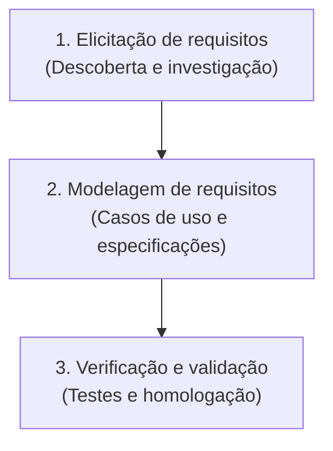

# Técnicas de elicitação de requisitos: o guia exaustivo

> **Contexto:** Guia exaustivo detalhando as fases da Engenharia de Requisitos e o catálogo completo das técnicas de elicitação com suas respectivas vantagens e desvantagens.

---

## 1. O que é elicitação de requisitos? (Conceito fundamental)

A **Elicitação de Requisitos** é a primeira e mais crítica fase da Engenharia de Requisitos. O termo origina-se do latim *elicitare*, que significa "trazer à tona", "provocar", "investigar" ou "extrair".

> **Definição formal:**
> Elicitação é o processo ativo e investigativo de descobrir, extrair, compreender e sintetizar as reais necessidades, desejos, limitações e regras de negócio junto às partes interessadas (*stakeholders*), visando determinar o que o sistema de software deve realizar.

### A diferença crucial: "Elicitar" vs. "Coletar"

Na Engenharia de Software, evita-se o termo "coleta de requisitos" porque ele sugere erroneamente que os requisitos já estão prontos, organizados e disponíveis na cabeça do cliente, bastando ao analista "colhê-los" como frutos em uma árvore.

Na prática real:
* **Os stakeholders raramente sabem exatamente o que querem:** Muitas vezes possuem apenas uma ideia vaga de um problema a ser resolvido.
* **Requisitos implícitos:** Usuários executam tarefas de forma tão rotineira que esquecem de mencionar passos essenciais em uma simples conversa.
* **Conflitos de interesses:** Diferentes departamentos da mesma empresa frequentemente possuem expectativas contraditórias sobre o mesmo software.

Por isso, a elicitação exige uma postura **investigativa e ativa** do engenheiro de requisitos, utilizando técnicas estruturadas para transformar necessidades brutas e implícitas em especificações claras.

---

## 2. As fases da engenharia de requisitos

A [[07. Engenharia de Requisitos/01. O que é, afinal, engenharia de requisitos.md|Engenharia de Requisitos]] é estruturada em um ciclo lógico de três fases principais:

1. **Elicitação de Requisitos:** Primeira fase, focada em extrair, investigar e descobrir as reais necessidades dos *stakeholders*.
2. **Modelagem de Requisitos:** Fase de representação abstrata através de especificações textuais e diagramas UML (ver [[07. Engenharia de Requisitos/08. Modelagem de requisitos com casos de uso e especificações textuais.md|Modelagem com UML e Casos de Uso]]).
3. **Verificação e Validação (V&V):** Fase final de garantia de que os requisitos especificam o produto correto e estão livres de ambiguidades ou inconsistências (ver [[07. Engenharia de Requisitos/05. Como escrever requisitos de qualidade - critérios, padrões e boas práticas.md|Critérios de Qualidade]]).

---

## 3. Detalhamento das 6 técnicas fundamentais (com vantagens e desvantagens)

### 3.1 Entrevista
Conversa direta entre o analista de requisitos e os *stakeholders*. Pode ser **estruturada** (roteiro fixo), **não-estruturada** (diálogo livre) ou **semi-estruturada** (roteiro base com flexibilidade).
* **Vantagens:** Permite aprofundar temas complexos, capturar linguagem corporal e construir relacionamento com o cliente.
* **Desvantagens:** Consome muito tempo, exige habilidade interpessoal do entrevistador e pode sofrer viés de um único entrevistado.

### 3.2 Brainstorming
Sessão de geração livre e rápida de ideias com um grupo de participantes, sem julgamentos ou críticas na fase inicial.
* **Vantagens:** Estimula a criatividade, promove inovação e ajuda a descobrir novos recursos para o produto.
* **Desvantagens:** Pode ser dominado por participantes mais extrovertidos e gerar muitas ideias inviáveis se não for bem moderado.

### 3.3 Questionário (*Surveys*)
Formulários impressos ou digitais enviados para um grande grupo de usuários com perguntas abertas ou fechadas.
* **Vantagens:** Coleta dados em larga escala de forma rápida e de baixo custo, ideal para usuários geograficamente dispersos.
* **Desvantagens:** Baixa taxa de resposta, impossibilidade de esclarecer dúvidas no momento do preenchimento e respostas potencialmente superficiais.

### 3.4 Protótipo (Prototipagem)
Construção de modelos visuais ou funcionais de baixa (wireframes) ou alta fidelidade para demonstrar a interface antes da codificação.
* **Vantagens:** Facilita a visualização pelos usuários, reduz mal-entendidos e valida a usabilidade precocemente.
* **Desvantagens:** Pode criar a falsa expectativa de que o sistema já está pronto e gerar retrabalho se as alterações forem constantes.

### 3.5 Etnografia / Observação (*Shadowing*)
O analista acompanha o usuário em seu ambiente real de trabalho para observar o fluxo prático de execução das tarefas (passiva ou ativa).
* **Vantagens:** Revela requisitos implícitos, hábitos e nuances operacionais que o usuário esquece de mencionar em entrevistas.
* **Desvantagens:** Pode alterar o comportamento normal do usuário (*Efeito Hawthorne*) e exige alto tempo de imersão do analista.

### 3.6 Estudo / Análise de documentos
Exame criterioso da documentação existente, como manuais de sistemas legados, relatórios regulatórios, planilhas e procedimentos (POPs).
* **Vantagens:** Fornece um panorama histórico do negócio, identifica regras de negócio formais e não consome tempo dos usuários nas fases iniciais.
* **Desvantagens:** Documentos frequentemente estão desatualizados, incompletos ou descrevem o processo ideal e não o processo real.

---

## 4. Catálogo complementar de técnicas avançadas de elicitação

Além das técnicas principais, o engenheiro de requisitos pode utilizar:

7. **Workshops de requisitos e Sessões JAD (Joint Application Development):** Reuniões estruturadas e intensivas reunindo executivos, usuários e equipe técnica para elicitar e pactuar requisitos rapidamente em consenso.
8. **Card Sorting (Ordenação de cartões):** Técnica colaborativa onde usuários agrupam e categorizam cartões contendo funcionalidades ou conteúdos, revelando seu modelo mental para a arquitetura de informação (ver [[08. Design de Interacao/00. Design de Interacao - Resumo|Design de Interação]]).
9. **Engenharia reversa:** Análise de código-fonte, bancos de dados e interfaces de sistemas legados ou concorrentes.
10. **Grupos focais (*Focus Groups*):** Discussões moderadas com grupos representativos de 6 a 12 usuários para capturar percepções e reações.
11. **Histórias de usuário e casos de uso:** Modelagem de cenários e narrativas operacionais de uso.
12. **Técnica dos 5 porquês:** Investigação profunda para descobrir a causa raiz de um problema de negócio.
13. **Modelagem de processos (BPMN):** Mapeamento formal de fluxos operacionais *As-Is* (atual) e *To-Be* (futuro).
14. **Análise competitiva (*Benchmarking*):** Comparação sistemática das funcionalidades de produtos concorrentes do mercado.
15. **Elicitação baseada em personas:** Simulação de cenários utilizando perfis fictícios e representativos dos usuários finais.

---

## 5. Quadro comparativo das técnicas de elicitação

| Técnica | Foco Principal | Maior Vantagem | Maior Desvantagem |
| :--- | :--- | :--- | :--- |
| **Entrevista** | Aprofundamento individual | Detalhamento rico de necessidades | Alto consumo de tempo |
| **Brainstorming** | Inovação e ideias | Descoberta de novos recursos | Ideias fora do escopo do projeto |
| **Questionário** | Escala e quantidade | Coleta rápida para grandes públicos | Respostas superficiais |
| **Protótipo** | Interface e validação visual | Redução de ambiguidade na UI | Expectativa precoce do cliente |
| **Etnografia** | Processo prático real | Descobre requisitos ocultos e implícitos | Demora e interferência no trabalho |
| **Estudo de Documentos** | Regras formais e histórico | Fonte rica de regras de negócio sem gastar tempo de usuário | Documentação desatualizada |
| **Workshops (JAD)** | Consenso e alinhamento multidisciplinar | Resolução rápida de conflitos e aprovação conjunta | Exige facilitação experiente e agenda de executivos |
| **Card Sorting** | Modelo mental e arquitetura de informação | Estruturação intuitiva de navegação e menus | Focado em organização, exigindo outras técnicas para regras |

---

## Links e Documentos Relacionados

* **[[07. Engenharia de Requisitos/05. Como escrever requisitos de qualidade - critérios, padrões e boas práticas.md|05. Como escrever requisitos de qualidade - critérios, padrões e boas práticas]]**
* **[[07. Engenharia de Requisitos/08. Modelagem de requisitos com casos de uso e especificações textuais.md|08. Modelagem de requisitos com casos de uso e especificações textuais]]**
* **[[07. Engenharia de Requisitos/00. Engenharia de Requisitos - Resumo.md|00. Engenharia de Requisitos - Resumo]]**
* **[[index.md|Página Inicial do Vault]]**
