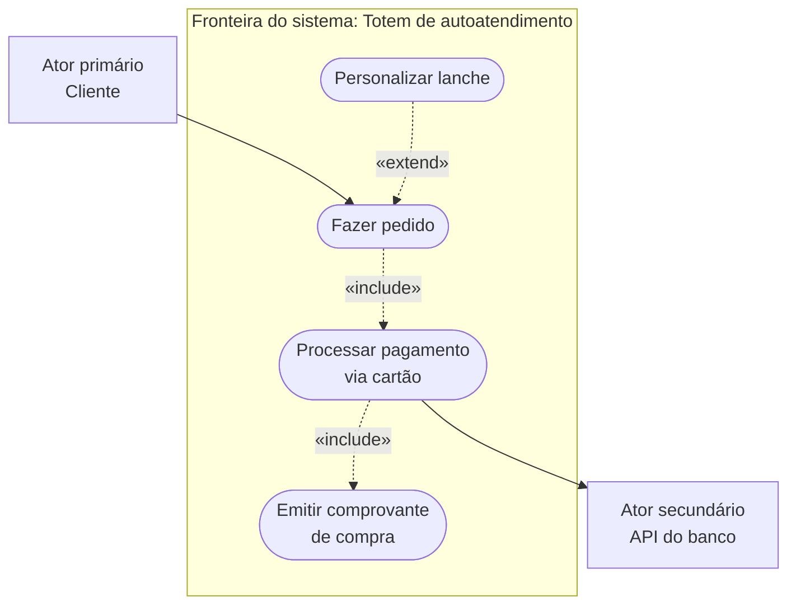
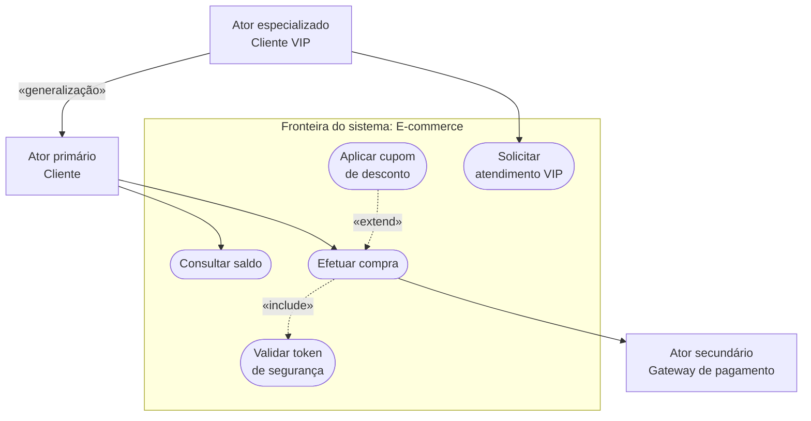
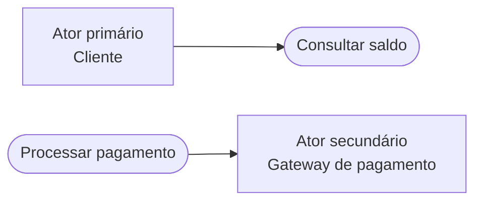
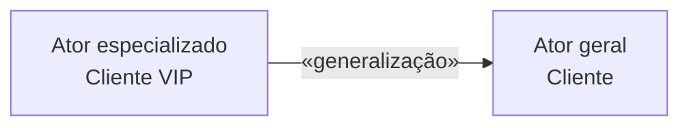
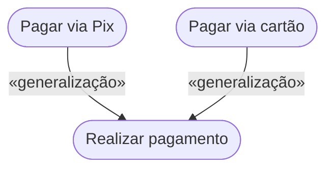
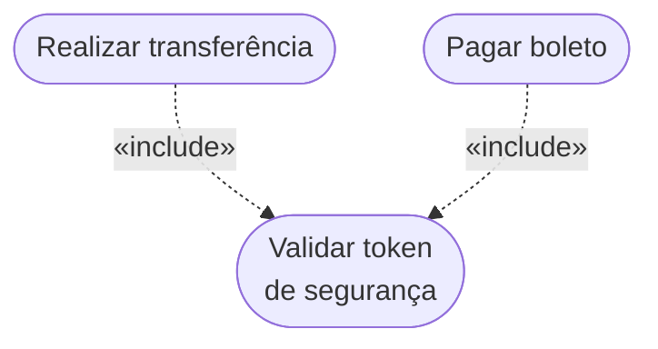
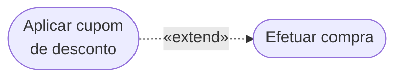
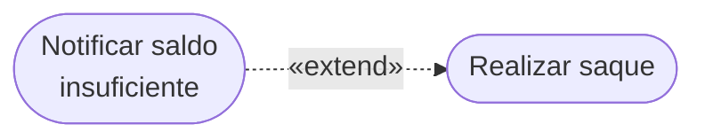
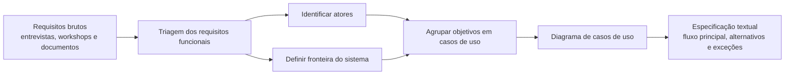

# Modelagem de requisitos com casos de uso e especificações textuais

> **Contexto:** Guia prático sobre a modelagem visual e textual de requisitos funcionais através dos diagramas de casos de uso da UML, detalhamento dos 4 relacionamentos formais e especificação textual.

---

## Casos de uso como representação de objetivos e interações

Imagine que um arquiteto civil passe semanas conversando com uma família sobre a casa dos seus sonhos. Eles mencionam a quantidade de quartos, a preferência por ambientes iluminados e a necessidade de uma garagem espaçosa. No entanto, se o construtor tentar erguer a casa baseando-se apenas nessas conversas e anotações soltas de caderno, o risco de erros estruturais, desentendimentos e retrabalho será imenso.

Para resolver essa lacuna, o arquiteto cria **plantas baixas, maquetes 3D e desenhos técnicos**. Esses artefatos simplificam a realidade complexa da construção, permitindo que a família visualize o resultado final e que os pedreiros e engenheiros saibam exatamente a espessura das vigas e a tubulação hidráulica.

Na Engenharia de Software, esse processo de criação de "plantas baixas" do sistema é chamado de **Modelagem de Requisitos**. Ela é a segunda fase da [[07. Engenharia de Requisitos/01. O que é, afinal, engenharia de requisitos.md|Engenharia de Requisitos]], ocorrendo logo após a [[07. Engenharia de Requisitos/06. Técnicas de elicitação de requisitos.md|Elicitação de Requisitos]].

---

## Atores, casos de uso e fronteira do sistema

Os **Diagramas de Casos de Uso** da UML 2.x capturam os [[07. Engenharia de Requisitos/04. Requisitos funcionais e não-funcionais.md|Requisitos Funcionais]] sob a perspectiva dos atores que interagem com o sistema.

### Elementos básicos do diagrama
* **Atores (*Actors*):** Entidades externas que interagem com o software (representados pelo "boneco de palito").
 * **Ator Primário:** O ator que **inicia a ação** do caso de uso para alcançar um objetivo.
 * **Ator Secundário:** O ator que **é afetado pela ação** ou fornece um serviço de suporte (ex.: Gateway de pagamento ou servidor de e-mail). Um caso de uso pode conter zero ou múltiplos atores secundários.
* **Caso de Uso (*Use Case*):** Unidade discreta de funcionalidade que entrega um valor mensurável para um ator (representado por uma elipse com verbo no infinitivo).
* **Fronteira do Sistema (*System Boundary*):** Caixa retangular rotulada que delimita exatamente o que é responsabilidade interna do software.
 * **Regra de localização:** Todos os **Casos de Uso (elipses)** ficam obrigatoriamente **DENTRO** da Fronteira do Sistema. Todos os **Atores (bonecos de palito e sistemas externos)** ficam obrigatoriamente **FORA** da caixa.
 * **Exemplo prático de negócio (Totem de Autoatendimento de Restaurante):**

### Exemplo completo de diagrama de casos de uso

A seguir, a representação visual compativel do Diagrama de Casos de Uso em Mermaid:



---


## Relacionamentos entre atores e casos de uso

Na UML, a modelagem de casos de uso utiliza **quatro tipos formais de relacionamentos**: Associação, Generalização (Herança), Inclusão (`«include»`) e Extensão (`«extend»`).

| Relacionamento | Conecta | Semântica principal |
| :--- | :--- | :--- |
| Associação | Ator ↔ caso de uso | Participação do ator na interação |
| Generalização | Ator → ator ou caso de uso → caso de uso | Especialização de comportamento ou papel |
| `«include»` | Caso de uso → caso de uso | Comportamento obrigatório reutilizado |
| `«extend»` | Caso de uso → caso de uso | Comportamento opcional ou condicional |

### Associação entre ator e caso de uso

É o relacionamento mais comum no diagrama. Conecta um **Ator a um Caso de Uso** (or vice-versa).
* **Sintaxe e notação:** Representado por uma linha contínua ou por uma **seta com ponta aberta** indicando o sentido do fluxo de informação.
* **Regra estrita de notação:** A seta com ponta aberta de associação **NÃO pode** ser usada para conectar ator com ator, nem caso de uso com caso de uso.
* **Uso da seta:** Embora a UML permita usar apenas uma reta simples sem ponta, a utilização da seta aberta é preferida para aumentar a legibilidade do fluxo da informação.
* **Exemplo prático de negócio:**

 * *Explicação:* O ator primário `Cliente` inicia a associação com o caso de uso `Consultar Saldo`. O caso de uso `Processar Pagamento` se conecta ao ator secundário `Gateway de Pagamento` para notificar a transação.

### Generalização entre atores ou casos de uso

Ocorre entre **elementos de mesma natureza**: entre ator e ator, e também entre caso de uso e caso de uso (sendo mais frequente entre atores).
* **Conceito:** Ocorre quando um elemento "filho" herda o comportamento, permissões e associações do elemento "pai", podendo adicionar especializações.
* **Sintaxe e notação:** Representado por uma **seta com ponta triangular fechada (vazada/branca)** que aponta **SEMPRE do filho para o pai**.
* **Diferenciação:** A ponta fechada triangular diferencia graficamente a Generalização da Associação comum.
* **Exemplo prático de negócio (Entre Atores):**

 * *Explicação:* O `Cliente VIP` (filho) herda todas as associações do `Cliente` comum (como `Consultar Saldo`), mas ganha permissões exclusivas (como `Solicitar Atendimento Exclusivo`).
* **Exemplo prático de negócio (Entre Casos de Uso):**

 * *Explicação:* Os casos de uso específicos `Pagar via Pix` e `Pagar via Cartão` herdam a estrutura genérica do caso de uso pai `Realizar Pagamento`.

### Inclusão (`«include»`) como comportamento obrigatório reutilizável

Ocorre **exclusivamente entre caso de uso e caso de uso**.
* **Conceito:** Utilizado quando existem rotinas comuns compartilhadas por múltiplos casos de uso do sistema (evita duplicação de especificação).
* **Sintaxe e notação:** Representado por uma **seta pontilhada** com o estereótipo `«include»` que aponta **do caso de uso ativador (base) para a rotina geral incluída**.
* **Ativação OBRIGATÓRIA:** A execução do caso de uso base obrigatoriamente executa a rotina do caso de uso incluído.
* **Exemplo prático de negócio:**

 * *Explicação:* Toda vez que o usuário executa `Realizar Transferência` ou `Pagar Boleto`, o sistema **obrigatoriamente** executa o caso de uso compartilhado `Validar Token de Segurança`.

#### Reutilização de comportamento com `«include»`

Ter múltiplos casos de uso utilizando `«include»` no diagrama traz benefícios fundamentais para a Engenharia de Software:

1. **Reaproveitamento de Especificação (Princípio DRY - *Don't Repeat Yourself*):**
 * Evita a duplicação de texto. Em vez de descrever os mesmos 8 passos de validação de token ou gravação de log em 20 especificações textuais diferentes, você especifica o módulo comum **uma única vez** no caso de uso incluído e reutiliza essa referência em todo o projeto.

2. **Facilidade de Manutenção e Alteração de Regras de Negócio:**
 * Se a regra de negócio do módulo compartilhado mudar no futuro (ex.: a validação de segurança passar a exigir biometria em vez de código SMS), você precisa alterar a documentação e o código de **apenas um único caso de uso**. Todos os casos de uso que fazem o `include` são atualizados automaticamente, eliminando o risco de inconsistências.

3. **Mapeamento Direto para o Código Back-End (Serviços Compartilhados):**
 * No desenvolvimento em C#, Java ou Node.js, um caso de uso com vários `includes` mapeia diretamente para **serviços reutilizáveis, middlewares de autenticação ou bibliotecas de infraestrutura** (ex.: `AuthService`, `AuditLoggerService`).

4. **Descomposição Modular e Clareza Visual:**
 * Ajuda a quebrar cenários complexos em partes menores e gerenciáveis, facilitando a divisão de tarefas entre os desenvolvedores da equipe.

#### `«include»` como analogia de sub-rotina

Conforme destacado nas orientações de projeto do Eixo 2 ([[06. Projeto - Aplicacao Interativa/06. Reunião de acompanhamento do grupo 4 (27-08-2026) - resumo e transcrição integral.md|Reunião de Acompanhamento do Projeto]]), o relacionamento de inclusão (`«include»`) na UML é o exato equivalente conceitual da **chamada de uma função ou procedimento** na [[01. Programacao Modular/02. Funções e procedimentos.md|Programação Modular]]:

* **Na Programação Modular:** Quando múltiplos pontos do sistema precisam calcular o dígito de um documento (ex.: `CalcularPrimeiroDigito(cpf)`) ou autenticar uma sessão, você não duplica as 20 linhas de cálculo em cada método; você cria uma **função isolada reutilizável** e a invoca onde for necessário (veja [[01. Programacao Modular/02. Funções e procedimentos.md#Exemplo prático 1: Função de cálculo do dígito verificador do CPF em C#|Função de cálculo de CPF em C#]] e [[00. Sintaxe Multilinguagem/04. Sub-rotinas (funções e procedimentos).md|Guia de Sintaxe de Sub-rotinas]]).
* **Na Engenharia de Requisitos:** O caso de uso com `«include»` funciona como essa função compartilhada. O caso de uso base interrompe seu fluxo principal, delega a execução para o caso de uso incluído (que executa sua rotina completa com início, meio e fim) e, ao terminar, retorna o controle para o fluxo chamador.

---


### Extensão (`«extend»`) como comportamento condicional

Ocorre **exclusivamente entre caso de uso e caso de uso**.
* **Conceito:** Utilizado para tratar exceções, regras de negócio condicionais ou fluxos especiais que ocorrem apenas sob certas circunstâncias.
* **Sintaxe e notação:** Representado por uma **seta pontilhada** com o estereótipo `«extend»` que aponta **do caso de uso de extensão (exceção/opcional) para o caso de uso base**.
* **Ativação OPCIONAL / CONDICIONAL:** Ao contrário do `include` (que é obrigatório), no `extend` a ativação é totalmente opcional e depende da satisfação de uma condição específica durante a execução.
* **Exemplo prático de negócio (Fluxo Opcional):**

 * *Explicação:* Durante a execução do caso de uso base `Efetuar Compra`, o caso de uso `Aplicar Cupom de Desconto` **só é executado se** o cliente decidir inserir um cupom válido (opcional/condicional).
* **Exemplo prático de negócio (Tratamento de Exceção):**

 * *Explicação:* O caso de uso de exceção `Notificar Saldo Insuficiente` só é disparado se o limite da conta for excedido durante o `Realizar Saque`.

#### `«extend»` como analogia de desvio condicional

Assim como o `«include»` equivale a uma chamada direta de função compartilhada, o relacionamento de extensão (`«extend»`) na UML é o exato equivalente conceitual de dois mecanismos fundamentais da programação:

1. **Tratamento de Exceções (`try / catch / throw`):**
   * **Na Programação Modular / Guia de Sintaxe ([[00. Sintaxe Multilinguagem/09. Tratamento de exceções e erros (try, catch, finally, throw).md|Tratamento de Exceções]]):** O algoritmo tenta executar o fluxo principal (`Realizar Saque`). Se uma regra de negócio for violada ou ocorrer um erro imprevisível (ex.: `valor > saldo`), o sistema dispara uma exceção (`throw new InvalidOperationException("Saldo insuficiente")`), e a execução é desviada para o bloco de captura (`catch`) para lidar com a contingência.
   * **Na UML:** O caso de uso de extensão `Notificar Saldo Insuficiente` atua exatamente como esse bloco `catch`: ele intercepta o caso de uso base no ponto de extensão e só é acionado quando a anomalia acontece.
2. **Desvios Condicionais e Recursos Opcionais (`if / else` e *Hooks/Plugins*):**
   * **Na Programação ([[00. Sintaxe Multilinguagem/02. Estruturas condicionais (if, else, switch).md|Estruturas Condicionais]]):** Recursos extras (como aplicar um cupom de desconto) são blocos condicionais opcionais (`if (cupom != null)`). O fluxo principal (`Efetuar Compra`) roda perfeitamente sem o cupom; a extensão apenas acopla um comportamento opcional se a condição for satisfeita.
3. **Autonomia do Caso de Uso Base:**
   * O caso de uso base (`Realizar Saque` ou `Efetuar Compra`) **não conhece e não depende da extensão**. Essa independência garante o desacoplamento e a manutenibilidade do sistema, respeitando o princípio de que o fluxo padrão não deve ficar sobrecarregado com regras de exceção secundárias.

---


### Direção e semântica dos conectores

| Conector | Forma conceitual | Regra de uso |
| :--- | :--- | :--- |
| Associação | Linha contínua | Ator com caso de uso |
| Generalização | Linha com seta triangular para o elemento geral | Ator com ator ou caso de uso com caso de uso |
| `«include»` | Dependência tracejada apontando para o caso incluído | Reuso obrigatório |
| `«extend»` | Dependência tracejada apontando para o caso base | Comportamento opcional ou condicional |

1. **Seta de Associação (Ponta Aberta / Reta Contínua):**
 * **Notação:** `►` ou `` (Linha contínua com ponta de seta aberta `>` ou reta simples).
 * **Direção:** Aponta do Ator Primário (iniciador) para o Caso de Uso, ou do Caso de Uso para o Ator Secundário.
 * **Uso exclusivo:** Conecta apenas **Ator Caso de Uso**.

2. **Seta de Generalização / Herança (Ponta Triangular Fechada / Branca / Vazada):**
 * **Notação:** `▷` (Linha contínua terminando em um triângulo fechado e sem preenchimento).
 * **Direção:** Aponta **SEMPRE do elemento Filho (específico) para o elemento Pai (geral)**.
 * **Uso exclusivo:** Conecta **Ator Ator** ou **Caso de Uso Caso de Uso**.

3. **Seta de Inclusão (`«include»`):**
 * **Notação:** ` ►` com o texto `«include»` sobre a linha (Linha pontilhada / tracejada com ponta simples).
 * **Direção:** Aponta do **Caso de Uso Base (ativador) para o Caso de Uso Incluído (rotina comum)**.
 * **Uso exclusivo:** Conecta apenas **Caso de Uso Caso de Uso** (Ativação **Obrigatória**).

4. **Seta de Extensão (`«extend»`):**
 * **Notação:** ` ►` com o texto `«extend»` sobre a linha (Linha pontilhada / tracejada com ponta simples).
 * **Direção:** Aponta do **Caso de Uso de Extensão (opcional/exceção) para o Caso de Uso Base**.
 * **Uso exclusivo:** Conecta apenas **Caso de Uso Caso de Uso** (Ativação **Opcional / Condicional**).

---

### Reconhecendo relacionamentos em enunciados

Para acertar questões e modelar corretamente sem dúvidas, aplique as regras e palavras-chave de reconhecimento a seguir:

#### Reconhecendo associação
* **Palavras-chave em enunciados:** *"O usuário acessa"*, *"O sistema notifica o administrador"*, *"O cliente solicita o serviço"*.
* **Elemento de origem e destino:** Conecta **um Ator (humano/sistema) a um Caso de Uso (elipse)**.
* **Pergunta de validação:** *"Existe um ser humano ou sistema externo interagindo diretamente com esta funcionalidade?"*
* **Gatilho de reconhecimento:** Se a ligação for entre um boneco de palito e uma elipse, **é sempre uma Associação**.

#### Reconhecendo generalização
* **Palavras-chave em enunciados:** *"O Gerente É UM tipo de Funcionário"*, *"O Administrador possui todos os privilégios do Usuário Comum, mais X"*, *"O Pagamento via Pix é um tipo específico de Pagamento"*.
* **Elemento de origem e destino:** Conecta **Ator Ator** ou **Caso de Uso Caso de Uso**.
* **Pergunta de validação (O Teste do "É UM"):** *"O elemento A 'É UM' tipo especial do elemento B?"* (Exemplo: *Cliente VIP 'É UM' Cliente?* Sim! Logo, a seta triangular apontará de Cliente VIP para Cliente).
* **Gatilho de reconhecimento:** Procure a seta com **ponta triangular fechada branca/vazada** (`▷`).

#### Reconhecendo `«include»`
* **Palavras-chave em enunciados:** *"Sempre que"*, *"Obrigatoriamente"*, *"Exige a execução prévia de"*, *"Tanto o cadastro A quanto o B utilizam a mesma rotina de validação"*.
* **Elemento de origem e destino:** Conecta **Caso de Uso Caso de Uso**.
* **Pergunta de validação (O Teste do "SEMPRE"):** *"Toda vez que o Caso de Uso A for executado, o Caso de Uso B SERÁ EXECUTADO OBRIGATORIAMENTE como parte do fluxo?"*
* **Sentido da seta:** A seta pontilhada aponta do **Caso de Uso Principal (que chamou) para o Módulo Compartilhado (que foi chamado)**.

#### Reconhecendo `«extend»`
* **Palavras-chave em enunciados:** *"Caso o usuário deseje"*, *"Opcionalmente"*, *"Se ocorrer um erro"*, *"Sob a condição X"*, *"Tratamento de exceção"*.
* **Elemento de origem e destino:** Conecta **Caso de Uso Caso de Uso**.
* **Pergunta de validação (O Teste do "ÀS VEZES / SE"):** *"O Caso de Uso B só é executado OPCIONALMENTE quando uma condição específica ou exceção acontece durante o Caso de Uso A?"*
* **Sentido da seta (Armadilha comum!):** A seta pontilhada aponta do **Caso de Uso Opcional/Exceção para o Caso de Uso Base** (ou seja, aponta de quem estende para quem foi estendido).

---

## Regras de conexão entre elementos do diagrama

Para evitar erros graves de sintaxe em diagramas de casos de uso, a norma da UML estabelece regras rígidas sobre quais elementos podem se conectar:

```

 Matriz de Permissões de Conexão na UML 

 Conexão Desejada É Permitida? Tipo de Seta Usada 

 Ator Caso de Uso SIM Associação (aberta) 
 Ator Ator SIM (Apenas) Generalização (fech) 
 Caso de Uso Caso de Uso SIM Include / Extend / Gen
 Ator Ator (Associação) NÃO (PROIBIDO) Seta de Associação 
 Caso de Uso Caso de Uso NÃO (PROIBIDO) Seta de Associação 
 Ator Caso de Uso (Include) NÃO (PROIBIDO) Seta Pontilhada 

```

### Conexões válidas
* **Ator com Caso de Uso:** Apenas via **Associação** (reta ou seta de ponta aberta).
* **Ator com Ator:** Apenas via **Generalização/Herança** (seta com ponta triangular fechada apontando do filho para o pai).
* **Caso de Uso com Caso de Uso:** Apenas via **Inclusão (`«include»`)**, **Extensão (`«extend»`)** ou **Generalização/Herança**.

### Conexões inválidas e erros clássicos
* **PROIBIDO Ator com Ator via Associação:** Atores **nunca se comunicam diretamente** entre si em um Diagrama de Casos de Uso. A única relação possível entre dois atores é a Herança/Generalização.
* **PROIBIDO Caso de Uso com Caso de Uso via Associação:** Casos de uso **nunca se ligam por linhas de associação comum**. Eles se relacionam apenas por `«include»`, `«extend»` ou Generalização.
* **PROIBIDO Ator com Caso de Uso via Include/Extend:** Os estereótipos `include` e `extend` existem **exclusivamente entre casos de uso**.

---

## Casos de uso não representam sequência temporal

Um dos erros conceituais mais comuns cometidos por iniciantes é tratar o Diagrama de Casos de Uso como se fosse um fluxograma.

> **Regra fundamental:**
> **NÃO existe sequência temporal ou cronológica em um Diagrama de Casos de Uso.**

* **O diagrama gráfico NÃO mostra a ordem das ações:** A posição visual de uma elipse acima ou ao lado de outra não significa que o caso de uso de cima ocorre antes do de baixo.
* **Não há fluxo de controle:** O diagrama representa apenas o mapa estático de **quem (Atores)** tem permissão para realizar **o quê (Casos de Uso)** no sistema.
* **Onde fica a sequência cronológica?** A ordem dos passos (passo 1, passo 2, passo 3) e o fluxo temporal pertencem **exclusivamente à Especificação Textual do Caso de Uso** (nos fluxos principal, alternativos e de exceção) ou a diagramas dinâmicos como o **Diagrama de Sequência** e o **Diagrama de Atividades**.

---

## Comparação entre os quatro relacionamentos


| Relacionamento | Conecta | Sentido da Seta | Notação Gráfica | Tipo de Ativação |
| :--- | :--- | :--- | :--- | :--- |
| **Associação** | Ator Caso de Uso | Do iniciador para o receptor | Seta simples com ponta aberta (ou reta) | N/A (Comunicação) |
| **Generalização** | Ator Ator / CU CU | Do elemento Filho para o Pai | Seta com ponta triangular fechada (branca) | Herança direta |
| **Inclusão (`include`)** | Caso de Uso Caso de Uso | Do CU Base para o CU Incluído | Seta pontilhada com estereótipo `«include»` | **Obrigatória** |
| **Extensão (`extend`)** | Caso de Uso Caso de Uso | Do CU de Extensão para o CU Base | Seta pontilhada com estereótipo `«extend»` | **Opcional / Condicional** |

---

## Da elicitação aos casos de uso

A transformação de desejos e necessidades brutas (coletados na [[07. Engenharia de Requisitos/06. Técnicas de elicitação de requisitos.md|Elicitação]]) em **Casos de Uso** forma o núcleo da modelagem funcional. Requisitos brutos costumam ser vagos, declarativos, desestruturados e por vezes contraditórios. Os Casos de Uso estruturam esses requisitos sob a ótica da **interação com o usuário**.

### Fluxo da elicitação à especificação



---

### Conversão de requisitos em casos de uso

1. **Passo 1: Extrair e Filtrar Requisitos Funcionais (RFs)**
   * Nem todo requisito elicita um Caso de Uso. [[07. Engenharia de Requisitos/04. Requisitos funcionais e não-funcionais.md|Requisitos Não-Funcionais]] (ex.: tempo de resposta, criptografia, SLA) viram **restrições/pré-condições/pós-condições** da especificação textual, e não elipses no diagrama.
2. **Passo 2: Identificar os Atores (Ator Primário e Secundário)**
   * Descobrir quem inicia cada funcionalidade (Ator Primário) e quais serviços externos ou atores de suporte colaboram na execução (Ator Secundário).
3. **Passo 3: Mapear RFs para Casos de Uso (Agrupamento por Objetivo do Ator)**
   * Um único Caso de Uso geralmente engloba múltiplos Requisitos Funcionais relacionados a uma mesma meta do usuário.
4. **Passo 4: Construir o Diagrama Visual UML**
   * Desenhar a fronteira do sistema, dispor os atores externamente e relacionar as elipses usando os relacionamentos apropriados (`Associação`, `«include»`, `«extend»`, `Generalização`).
5. **Passo 5: Detalhar a Especificação Textual de Caso de Uso**
   * Traduzir os requisitos detalhados nos passos ordenados do **Fluxo Principal**, desvios no **Fluxo Alternativo** e exceções/erros no **Fluxo de Exceção**.

---

### Exemplo de transformação

#### Requisitos brutos elicitados
* *RF01:* O cliente deve ser capaz de buscar produtos por nome, categoria ou faixa de preço.
* *RF02:* O sistema deve permitir adicionar produtos a um carrinho de compras.
* *RF03:* Ao finalizar o pedido, o sistema deve calcular o frete e exigir pagamento via cartão ou Pix.
* *RF04:* O sistema deve enviar um e-mail de confirmação de pedido.
* *RNF01:* As transações financeiras devem ser processadas em menos de 3 segundos e usar criptografia TLS 1.3.

#### Mapeamento entre requisitos e casos de uso

| Requisito Elicitado | Tipo | Elemento resultante no modelo de Casos de Uso | Justificativa de modelagem |
| :--- | :--- | :--- | :--- |
| **RF01** | Funcional | **UC01: Pesquisar Produtos** | Objetivo isolado do cliente ao navegar no catálogo. |
| **RF02** | Funcional | **UC02: Gerenciar Carrinho** | Reúne ações de adicionar, remover e listar itens do carrinho. |
| **RF03**, **RF04** | Funcional | **UC03: Realizar Checkout / Comprar** | Objetivo principal de valor. Aciona o ator secundário Gateway e envia e-mail. |
| **RNF01** | Não-Funcional | **Pré/Pós-condição e NFR de UC03** | Não vira elipse! Torna-se critério de qualidade/segurança na especificação de `UC03`. |

---

## Especificação textual de caso de uso


Embora o diagrama gráfico da UML mostre o panorama geral, a especificação detalhada exige o preenchimento de uma **documentação textual de Caso de Uso**.

### Estrutura padrão da especificação

```markdown
# UC01: Cadastrar novo cliente

- **Ator principal:** Cliente Não-Cadastrado (Ator Primário)
- **Ator secundário:** Servidor de E-mail (Ator Secundário)
- **Pré-condições:** O sistema deve estar operacional e a página de cadastro acessível.
- **Pós-condições:** Registro salvo no banco de dados e e-mail de confirmação enviado.

### Fluxo principal
1. O cliente acessa a página de cadastro.
2. O sistema exibe o formulário de cadastro.
3. O cliente preenche Nome, CPF, E-mail e Senha e clica em "Submeter".
4. O sistema valida os dados informados.
5. O sistema salva o novo cliente no banco de dados.
6. O sistema envia e-mail de confirmação.
7. O sistema exibe a mensagem "Cadastro realizado com sucesso!".

### Fluxos alternativos
- **FA01 (Cadastro via conta Google):** No passo 3, o cliente opta por clicar em "Entrar com Google". O sistema redireciona para autenticação OAuth2 e retorna ao passo 5.

### Fluxos de exceção
- **FE01 (CPF já cadastrado):** No passo 4, se o CPF já constar no banco de dados, o sistema exibe a mensagem "CPF já cadastrado" e retorna ao passo 2.
```

---

## Diagrama e especificação textual como representações complementares


A modelagem precisa de diagramas de casos de uso exige o domínio estrito da notação dos **quatro relacionamentos da UML**: usar associação entre atores e casos de uso, generalização com seta fechada para herança, `include` para rotinas obrigatórias comuns e `extend` para exceções opcionais. 

Essa clareza notacional garante que o diagrama seja interpretado sem ambiguidades por desenvolvedores, testadores e clientes.

---

## Referências bibliográficas

* BEZERRA, Eduardo. **Princípios de Análise e Projeto de Sistemas com UML**. São Paulo: Elsevier, 2006. (Capítulo: *Modelagem de Casos de Uso*).
* FOWLER, Martin. **UML essencial: um breve guia para a linguagem-padrão de modelagem de objetos**. 3. ed. Porto Alegre: Bookman, 2005.
* GUEDES, Gilleanes. **UML 2: Uma Abordagem Prática**. 3. ed. São Paulo: Novatec, 2018. (Capítulo: *Modelagem de Casos de Uso*).
* SOMMERVILLE, Ian. **Engenharia de Software**. 10. ed. São Paulo: Pearson, 2019.

---


## Artigos relacionados

* **[[07. Engenharia de Requisitos/06. Técnicas de elicitação de requisitos.md|06. Técnicas de elicitação de requisitos]]**
* **[[07. Engenharia de Requisitos/07. Visão geral da uml e tipos de diagramas na modelagem de requisitos.md|07. Visão geral da uml e tipos de diagramas na modelagem de requisitos]]**
* **[[07. Engenharia de Requisitos/11. Verificação e validação de requisitos - técnicas, revisões e qualidade.md|11. Verificação e validação de requisitos - técnicas, revisões e qualidade]]**
* **[[07. Engenharia de Requisitos/00. Engenharia de Requisitos - Resumo.md|00. Engenharia de Requisitos - Resumo]]**
* **[[index.md|Página Inicial do Vault]]**
