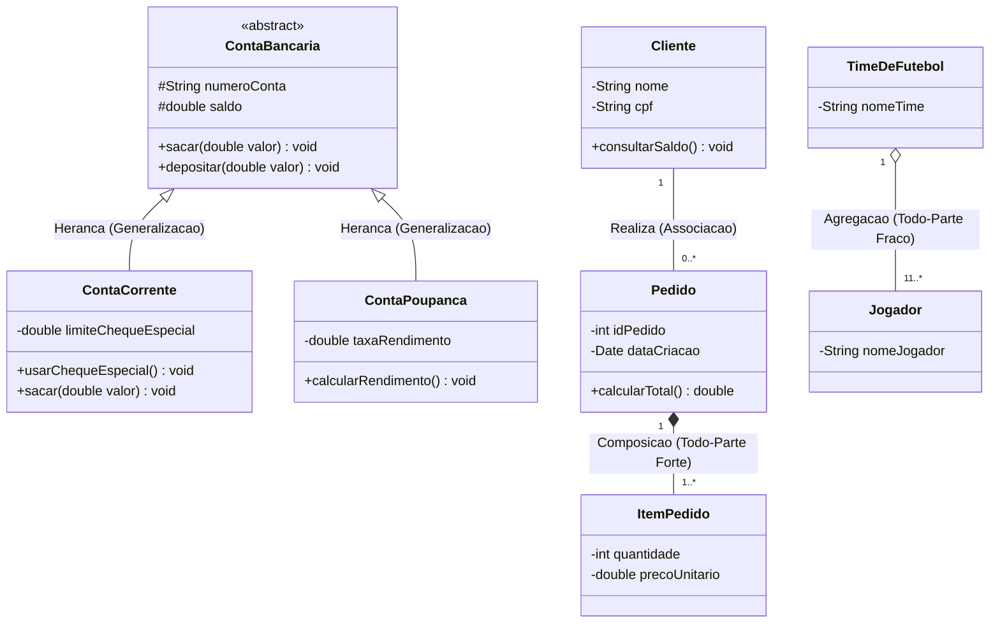

# Modelagem estrutural com diagrama de classes da uml

> **Contexto:** Guia completo sobre o Diagrama de Classes da UML, detalhando a estrutura de uma classe (atributos, métodos e visibilidade) e os tipos de conexões: Associação, Agregação (Todo-Parte fraco), Composição (Todo-Parte forte) e Herança (Generalização-Especialização).

---

## 1. Intuição e conceito em linguagem simples

Imagine que você esteja projetando o catálogo de uma fábrica de veículos. Para construir os carros de forma padronizada na linha de montagem, os engenheiros criam o **molde original** (o projeto do carro) definindo quais características todo carro terá (cor, modelo, número de portas) e o que ele poderá fazer (acelerar, frear, ligar o farol).

Na Engenharia de Software e na Orientação a Objetos:
* A **Classe** é esse molde abstrato ou gabarito.
* O **Objeto** é o veículo concreto fabricado a partir desse molde rodando na memória.

O **Diagrama de Classes** é o diagrama estrutural mais importante da UML. Ele representa a visão estática do sistema, mostrando quais classes existem, quais dados elas armazenam (**Atributos**), quais ações elas executam (**Métodos**) e, principalmente, **como essas classes se conectam entre si**.

---

---

## 2. Elementos constituintes do diagrama de classes

Um **Diagrama de Classes** é composto por uma variedade de elementos notacionais padronizados pela UML para descrever a estrutura e a semântica do software.

```

 Elementos do Diagrama de Classes 

 1. Tipos de Classes ► Concreta, Abstrata, Interface, Associação 
 2. Atributos ► Dados/Estado (-privado, +público, /derivado)
 3. Operações/Métodos ► Comportamentos (parâmetros, retorno) 
 4. Multiplicidades ► Quantidades permitidas (1, 0..1, 1..*, *) 
 5. Papéis (Roles) ► Função de cada classe no relacionamento 

```

### 2.1 Tipos de classes na UML

1. **Classe Concreta:**
 * Classe padrão que possui implementação completa de seus métodos e pode ser instanciada diretamente para criar objetos na memória (ex.: `Cliente c = new Cliente();`).

2. **Classe Abstrata:**
 * **Notação:** O nome da classe é escrito em ***itálico*** ou acompanhado da propriedade `{abstract}`.
 * **Conceito:** Não pode ser instanciada diretamente. Serve exclusivamente como superclasse/gabarito de herança para outras classes (ex.: `ContaBancaria`).

3. **Interface:**
 * **Notação:** Indicada pelo estereótipo `«interface»` acima do nome da classe ou pelo ícone de círculo ("pirulito").
 * **Conceito:** Contrato puro de software contendo apenas a assinatura de métodos (sem código de implementação). Uma classe implementa uma interface por meio da relação de **Realização** (seta pontilhada com ponta triangular branca).

4. **Classe de Associação (*Association Class*):**
 * **Notação:** Uma classe normal conectada por uma **linha pontilhada** no meio de uma linha de associação entre duas outras classes.
 * **Conceito:** Utilizada quando um relacionamento de associação muitos-para-muitos (`N:N`) possui seus próprios atributos e operações.
 * **Exemplo:** A relação entre `Aluno` e `Disciplina` possui a classe de associação `Matricula`, armazenando a `dataMatricula` e a `notaFinal`.

---

### 2.2 Anatomia dos compartimentos de uma classe

Graficamente, uma classe é representada por um retângulo dividido em três compartimentos verticais:

```

 *NomeDaClasse* ◄ 1. Nome (Itálico se abstrata)

 - atributoPrivado: Tipo = ValorInicial ◄ 2. Atributos (Estado/Dados)
 + atributoPublico: Tipo 
 /atributoDerivado: Tipo 
 <u>+ contadorInstancias: int</u> ◄ Atributo Estático (Sublinhado)

 + metodoPublico(parametro: Tipo): TipoRetorno ◄ 3. Métodos (Comportamento)
 # metodoProtegido(): void 
 <u>+ resetarContador(): void</u> ◄ Método Estático (Sublinhado)

```

#### Modificadores de visibilidade e o princípio do encapsulamento

O **Encapsulamento** é o pilar fundamental da Orientação a Objetos que protege os dados internos de uma classe contra acessos diretos e indevidos por outras partes do software.

```

 O Mecanismo de Encapsulamento 

 Estado Interno (Privado `-`) ◄ Escondido do mundo externo 
 Método Getter (+getSaldo()) ► Permite leitura controlada 
 Método Setter (+setSaldo()) ► Permite alteração com validação 

```

* **Simbologia de Visibilidade:**
 * `+` **Público (*Public*):** O membro é visível e acessível por qualquer outra classe do sistema.
 * `-` **Privado (*Private*):** O membro é **escondido** e visível apenas dentro da própria classe que o declarou (regra ouro do encapsulamento para atributos).
 * `#` **Protegido (*Protected*):** O membro é visível na própria classe e em suas subclasses herdeiras (usado para reaproveitamento em hierarquias de Herança).
 * `~` **Pacote (*Package / Default*):** O membro é visível por qualquer classe dentro do mesmo pacote/namespace.

* **Métodos Acessores e Modificadores (Getters e Setters):**
 * Para permitir o acesso seguro a atributos privados (`-`), criam-se métodos públicos (`+`):
 * **Getter (`+ getSaldo(): double`):** Retorna o valor atual do atributo sem expor a variável diretamente.
 * **Setter (`+ depositar(valor: double): void`):** Recebe o novo valor e aplica as regras de negócio de validação antes de alterar a variável (ex.: impede que o saldo fique negativo).

#### Por que a regra de ouro da OO é ter ATRIBUTOS PRIVADOS (-) e MÉTODOS PÚBLICOS (+)?

Trata-se de uma das convenções mais fundamentais e importantes da Engenharia de Software. Existem três motivos cruciais para essa regra:

```

 Por que Atributos são PRIVADOS (-) e Métodos são PÚBLICOS (+)? 

 Atributos PRIVADOS (-) Métodos PÚBLICOS (+) 

 1. Protege a integridade dos dados 1. Define a porta de entrada (API) 
 2. Evita corrupção de estado 2. Executa validações de negócio 
 3. Oculta a estrutura interna 3. Garante flexibilidade de código 

```

1. **Proteção contra a corrupção do estado do objeto (Integridade de Dados):**
 * Se um atributo fosse público (`+ saldo: double`), qualquer classe externa poderia alterá-lo diretamente e fazer algo absurdo, como `conta.saldo = -99999` ou `pessoa.idade = -50`.
 * Mantendo o atributo **privado (`-`)**, a alteração só pode ser feita invocando um método **público (`+ depositar(valor)`)**, onde a classe valida se a operação é permitida antes de modificar o dado.

2. **Ocultamento de Informação (*Information Hiding*) e Baixo Acoplamento:**
 * Se os atributos fossem públicos, todas as outras classes do sistema dependeriam da forma exata como a variável foi criada. Se o desenvolvedor decidisse mudar o nome da variável ou seu tipo de dados (ex.: de `Date` para `DateTime`), o sistema inteiro quebraria.
 * Com atributos privados e métodos públicos, você pode alterar a estrutura interna de dados sem quebrar nenhuma outra classe do sistema.

3. **Controle total sobre a leitura e escrita:**
 * Permite criar atributos que são **somente leitura (*read-only*)** (criando apenas o método *Getter* público, sem criar o *Setter*), impedindo que clientes externos modifiquem valores sensíveis.

---


#### Tipos e características dos métodos (Operações)

Os **Métodos** (terceiro compartimento da classe) descrevem as ações e comportamentos que os objetos da classe podem executar.

* **Sintaxe formal completa:**
 ```
 visibilidade nomeDoMetodo(parametro1 : Tipo1, parametro2 : Tipo2) : TipoRetorno
 ```

* **Variedades de Métodos na UML:**
 1. **Métodos Construtores:**
 * Métodos especiais chamados no momento da criação/instanciação do objeto. Na UML, costumam ter o mesmo nome da classe ou o estereótipo `«create»` (ex.: `+ ContaBancaria(titular: String)`).
 2. **Métodos Abstratos:**
 * Notados em ***itálico***. Métodos declarados na superclasse que não possuem implementação lá (sem corpo de código), tornando obrigatória a implementação concreta nas subclasses filhas.
 3. **Métodos Estáticos (<u>Sublinhados</u>):**
 * Notados com texto **<u>sublinhado</u>**. Pertencem à classe em si e não a um objeto específico. Podem ser invocados sem precisar instanciar um objeto (ex.: `<u>+ calcularIPCA(): double</u>`).
 4. **Sobrecarga de Métodos (*Overloading*):**
 * Ocorre quando a classe possui múltiplos métodos com o **mesmo nome**, mas com **parâmetros ou assinaturas diferentes** (ex.: `+ buscar(id: int)` e `+ buscar(nome: String)`).
 5. **Sobrescrita de Métodos (*Overriding*):**
 * Ocorre quando uma subclasse reimplementa o comportamento de um método que herdou da superclasse pai para adaptar a regra ao seu contexto específico (ex.: `ContaPoupanca` reimplementando o método `+ calcularRendimento()`).

---


### 2.3 Multiplicidade (Cardinalidade) e papéis (*Roles*)

Nas pontas das linhas de associação entre classes, especificam-se a quantidade de instâncias permitidas e os papéis desempenhados:

* **Tabela de Multiplicidades:**
 * `1`: Exatamente um.
 * `0..1`: Zero ou um (opcional).
 * `*` ou `0..*`: Zero ou muitos.
 * `1..*`: Um ou muitos (pelo menos um).
 * `n..m`: De `n` até `m` instâncias (ex.: `2..4`).

* **Papéis (*Roles*):** Nomes atribuídos às extremidades da associação indicando o papel desempenhado pelo objeto naquela relação (ex.: na relação entre `Pessoa` e `Empresa`, a `Pessoa` tem o papel de `+funcionario` e a `Empresa` o papel de `+empregador`).

---

## 3. Conexões e relacionamentos entre classes


Para que o software funcione como um todo integrado, as classes precisam se conectar. A UML define quatro tipos principais de conexões estruturais:

1. **Associação:** Conexão estrutural simples (uso / relacionamento).
2. **Agregação:** Todo-Parte fraco (losango vazado / sem dependência de ciclo de vida).
3. **Composição:** Todo-Parte forte (losango preenchido / ciclo de vida dependente).
4. **Herança:** Generalização - Especialização (seta com ponta triangular fechada branca).

---

### 3.0 Visão geral integrada em Diagrama Mermaid

O diagrama a seguir compila todos os relacionamentos em notação padrão UML renderizada via Mermaid:



---


### 3.1 Associação

Representa um relacionamento estrutural simples entre duas classes independentes. Indica que os objetos de uma classe sabem da existência dos objetos de outra classe e conversam entre si.

* **Sintaxe gráfica:** Linha contínua ligando as duas classes, podendo conter indicação de navegabilidade (seta simples), papéis e multiplicidades.
* **Multiplicidade (Cardinalidade):**
 * `1`: Exatamente 1.
 * `0..1`: Zero ou um (opcional).
 * `0..*` ou `*`: Zero ou muitos.
 * `1..*`: Um ou muitos (pelo menos um).
* **Exemplo prático de negócio:**
 ```
 [Cliente] 1 0..* [Pedido]
 ```
 * *Explicação:* Um `Cliente` pode realizar zero ou vários `Pedidos`. Cada `Pedido` pertence obrigatoriamente a exatamente 1 `Cliente`.

---

### 3.2 Agregação (Todo-Parte Fraco)

É uma forma especializada de associação que representa uma relação conceitual de **"Todo-Parte"** em que as partes possuem **existência independente**.

* **Conceito chave:** Se a classe "Todo" for destruída ou removida do sistema, a classe "Parte" **continua existindo normalmente**.
* **Sintaxe gráfica:** Representada por um **losango vazado / branco (◊)** na extremidade conectada à classe "Todo".
* **Exemplo prático de negócio:**
 ```
 [TimeDeFutebol] ◊ 1 11..* [Jogador]
 ```
 * *Explicação:* O `TimeDeFutebol` é o "Todo" e os `Jogadores` são as "Partes". Se o time for encerrado ou extinto, os objetos `Jogador` continuam existindo no sistema e podem ser transferidos para outro time.

---

### 3.3 Composição (Todo-Parte Forte)

É uma forma de agregação estrita onde a relação "Todo-Parte" possui uma **dependência de ciclo de vida coincidente**.

* **Conceito chave:** A "Parte" pertence exclusivamente a um único "Todo". Se a classe "Todo" for destruída ou excluída, todas as suas "Partes" são **destruídas automaticamente junto**.
* **Sintaxe gráfica:** Representada por um **losango preenchido / preto ()** na extremidade conectada à classe "Todo".
* **Exemplo prático de negócio:**
 ```
 [Pedido] 1 1..* [ItemDoPedido]
 ```
 * *Explicação:* O `Pedido` é o "Todo" e o `ItemDoPedido` é a "Parte". Um `ItemDoPedido` não pode existir solto no banco de dados sem um `Pedido` pai. Se o `Pedido` for excluído do sistema, todos os seus `ItensDoPedido` são apagados em cascata.

---

### 3.4 Herança (Generalização – Especialização)

Representa um relacionamento em que uma subclasse (específica/filha) herda todos os atributos e métodos de uma superclasse (geral/pai), podendo adicionar novos membros ou sobrescrever comportamentos.

```

 Superclasse vs. Subclasse 

 Superclasse (Pai/Mãe) ► Classe genérica no topo da hierarquia 
 
 (Seta triangular fechada branca) 
 
 Subclasse (Filho/Derivada)► Herda membros e adiciona especialização 

```

#### 1. Superclasse (Classe Pai / Classe Mãe / Classe Genérica)
* **Definição:** É a classe mais geral localizada no nível superior da hierarquia.
* **Características:**
 * Define os **atributos e métodos comuns** compartilhados por todas as suas subclasses derivadas.
 * Pode ser declarada como uma **Superclasse Abstrata** (em *itálico*), impedindo a criação direta de objetos dela (ex.: a classe `Veiculo` ou `ContaBancaria`).
 * Na UML, a seta triangular de herança **SEMPRE aponta para a Superclasse** (`▷`).

#### 2. Subclasse (Classe Filha / Classe Derivada / Classe Especializada)
* **Definição:** É a classe mais específica localizada nos níveis inferiores da hierarquia.
* **Características:**
 * **Reaproveitamento automático:** Herda todos os atributos e métodos públicos (`+`) e protegidos (`#`) da superclasse sem precisar reescrever o código.
 * **Especialização:** Pode declarar **novos atributos e novos métodos próprios** que a superclasse não possui (ex.: a subclasse `ContaCorrente` adiciona o atributo `limiteChequeEspecial`).
 * **Sobrescrita de comportamento (*Overriding*):** Pode redefinir a implementação de um método herdado para adaptar a regra ao seu contexto específico (ex.: `ContaPoupanca` sobrescrevendo o método `sacar()` para cobrar uma taxa específica).

#### Exemplo prático de negócio em código e UML:
```
 
 ContaBancaria ◄ SUPERCLASSE (Mãe)
 
 # numeroConta: String 
 # saldo: double 
 
 + sacar(valor: double): void 
 + depositar(valor: double): v 
 
 
 (Seta triangular fechada branca ▷)
 
 ContaCorrente ◄ SUBCLASSE (Filha)
 
 - limiteChequeEspecial: double ◄ Novo Atributo Especializado
 
 + usarChequeEspecial(): void ◄ Novo Método Especializado
 + sacar(valor: double): void ◄ Método Sobrescrito (Overriding)
 
```

> **Diferença conceitual chave:**
> Uma **Superclasse** atua no nível de *código e reuso de dados/métodos* (herança OO). Já um **Pacote** atua no nível de *organização arquitetural e namespaces* (agrupando classes relacionadas). Para um guia completo de quando usar cada um, consulte o artigo **[[07. Engenharia de Requisitos/10. Modelagem estrutural e modularização com diagrama de pacotes da uml.md|10. Modelagem estrutural e modularização com diagrama de pacotes da uml]]**.

---


### 3.5 Qual relacionamento NÃO possui multiplicidade na UML?

Na UML, existe uma regra clássica de sintaxe muito cobrada em exames e provas sobre quais relacionamentos levam ou não números de multiplicidade (cardinalidade) nas extremidades:

```

 Regra de Ouro da Multiplicidade no Diagrama de Classes 

 Relacionamento Possui Multiplicidade (1, 0..*, etc)? 

 Associação SIM (Nas duas pontas) 
 Agregação SIM (Nas duas pontas) 
 Composição SIM (Nas duas pontas) 
 Herança (Generalização) NÃO! (PROIBIDO COLOCAR MULTIPLICIDADE)
 Realização (Interface) NÃO! (PROIBIDO COLOCAR MULTIPLICIDADE)
 Dependência NÃO! (PROIBIDO COLOCAR MULTIPLICIDADE)

```

> **A Regra Fundamental:**
> O relacionamento de **HERANÇA (Generalização – Especialização)** **NÃO POSSUI MULTIPLICIDADE**.

#### Por que a Herança NÃO possui multiplicidade?
* **Associação, Agregação e Composição** conectam **instâncias de objetos dinâmicos em tempo de execução** rodando na memória (ex.: 1 `Cliente` possui N `Pedidos`). Por isso, é necessário definir a quantidade de objetos permitidos (multiplicidade).
* **A Herança (Generalização)** é um relacionamento **conceitual estático entre definições de classes em tempo de compilação**. Uma classe `ContaCorrente` "É UM" tipo de `ContaBancaria`. Não existe a ideia de *"1 ContaCorrente para 3 ContaBancaria"*. A subclasse simplesmente deriva da superclasse.
* **Sintaxe notacional estrita:** Ao desenhar a seta com ponta triangular fechada branca (`▷`), é um **erro de notação UML** colocar qualquer número (`1`, `*`, `0..1`) ao lado da seta ou das pontas da linha.

---


## 4. Guia de identificação em provas e enunciados

| Tipo de Conexão | Conceito Central | Símbolo Gráfico | Pergunta de Reconhecimento | Exemplo |
| :--- | :--- | :--- | :--- | :--- |
| **Associação** | Uso ou relacionamento simples | Linha simples ou seta de ponta aberta | *A classe A usa ou se relaciona com B?* | `Cliente` e `Carro` |
| **Agregação** | Todo-Parte **Fraco** | Losango **vazado (branco)** no Todo | *Se o Todo acabar, a Parte continua existindo?* | `Curso` e `Professor` |
| **Composição** | Todo-Parte **Forte** | Losango **preenchido (preto)** no Todo | *Se o Todo for deletado, a Parte é destruída junto?* | `NotaFiscal` e `ItemNota` |
| **Herança** | Generalização-Especialização | Seta com ponta **triangular fechada (branca)** no Pai | *A classe Filha É UM tipo da classe Pai?* | `Caminhao` É UM `Veiculo` |

---

## 5. Síntese e consolidação

O **Diagrama de Classes** é o coração da modelagem estática na UML. Compreender a diferença entre **Associação** (comunicação), **Agregação** (todo-parte independente), **Composição** (todo-parte dependente) e **Herança** (reaproveitamento com especialização) permite traduzir os requisitos funcionais em arquiteturas de software sólidas e limpas.

---

## Referências bibliográficas

* BEZERRA, Eduardo. **Princípios de Análise e Projeto de Sistemas com UML**. São Paulo: Elsevier, 2006. (Capítulo: *Modelagem de Classes UML*).
* FOWLER, Martin. **UML essencial: um breve guia para a linguagem-padrão de modelagem de objetos**. 3. ed. Porto Alegre: Bookman, 2005.
* GUEDES, Gilleanes. **UML 2: Uma Abordagem Prática**. 3. ed. São Paulo: Novatec, 2018. (Capítulo: *Modelagem de Classes*).
* SOMMERVILLE, Ian. **Engenharia de Software**. 10. ed. São Paulo: Pearson, 2019.

---


## Links e Documentos Relacionados

* **[[07. Engenharia de Requisitos/07. Visão geral da uml e tipos de diagramas na modelagem de requisitos.md|07. Visão geral da uml e tipos de diagramas na modelagem de requisitos]]**
* **[[07. Engenharia de Requisitos/08. Modelagem de requisitos com casos de uso e especificações textuais.md|08. Modelagem de requisitos com casos de uso e especificações textuais]]**
* **[[07. Engenharia de Requisitos/11. Verificação e validação de requisitos - técnicas, revisões e qualidade.md|11. Verificação e validação de requisitos - técnicas, revisões e qualidade]]**
* **[[07. Engenharia de Requisitos/00. Engenharia de Requisitos - Resumo.md|00. Engenharia de Requisitos - Resumo]]**
* **[[index.md|Página Inicial do Vault]]**
